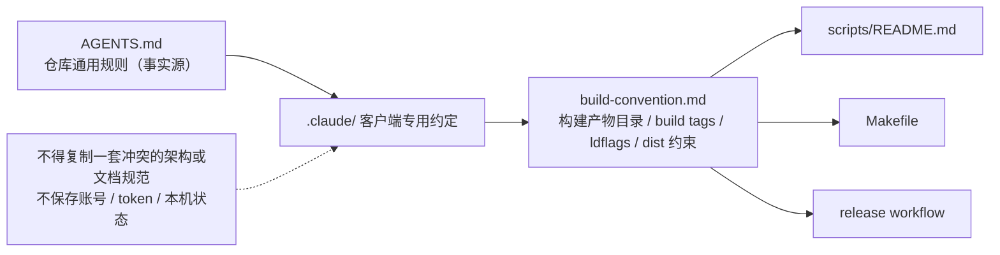

# Local Agent Conventions

## 生态位

`.claude/` 保存特定 Agent 客户端可读取的仓库辅助约定。仓库通用规则以根目录 [`AGENTS.md`](../AGENTS.md) 为准；这里不得复制一套冲突的架构或文档规范。

当前 [`build-convention.md`](build-convention.md) 记录构建产物目录、GUI build tags、ldflags 和 `dist/` 约束。

## 数据流图

维护时遵循：

- 通用规则写入 `AGENTS.md`，客户端专用提示才进入本目录。
- 不保存账号、token、用户主目录或本机临时状态。
- 构建约定变化时同步 `scripts/README.md`、Makefile 和 release workflow。
