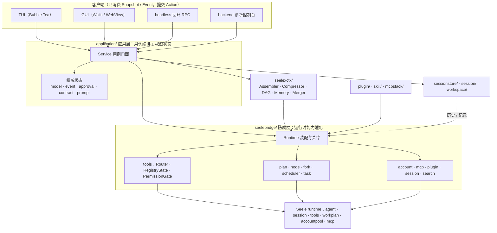
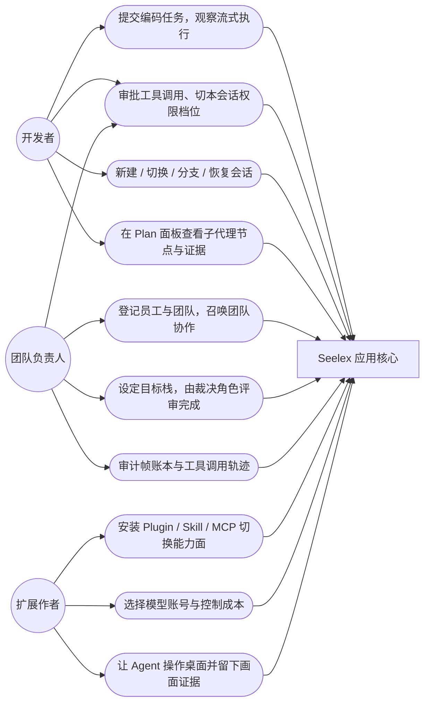
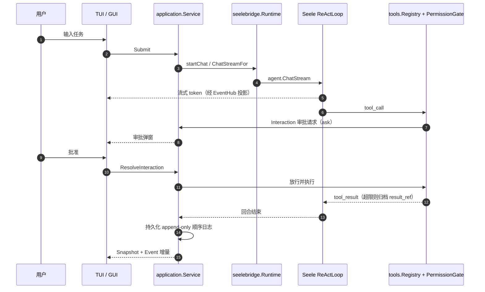
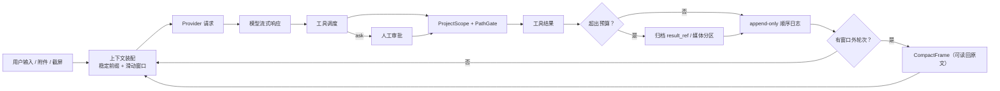

# Seelex — Open-Source Coding Agent Harness

> 面向软件工程任务的 Agent Harness 与 Multi-Agent Runtime：把 LLM、Tool Calling、Agentic Workflow、Context Engineering、权限策略和持久化装配成可运行、可观察、可恢复的本地 Coding Agent。

[English README](README_EN.md)

Seelex 不是一个只负责转发聊天请求的 AI Chat Client，也不是把 Prompt、Shell 和模型 API 粘在一起的薄封装。作为面向软件工程的 AI Agent Framework，它在 [Seele](https://github.com/RedHuang-0622/Seele) Agent Runtime 之上提供 Coding Agent 的产品语义：项目作用域 Tool Calling / Function Calling、Task/Plan 生命周期、Multi-Agent Orchestration、并行 Subagent、Goal 目标治理与完成裁决、Context Engineering、分层记忆、模型与账号路由、Human-in-the-loop 审批、多模态输入与桌面操控、Plugin/Agent Skills/MCP、Session Persistence，以及共享同一 Application Core 的 TUI、桌面 GUI、headless 与 backend 诊断前端。

当前项目处于 **Developer Alpha**。默认入口是 TUI；GUI 已可构建和使用，但仍属于 Alpha 功能。

## 项目概览

Seelex 由两个公开层次组成：[Seele](https://github.com/RedHuang-0622/Seele) 提供 Agent、Session、Tool Registry、ReAct、WorkPlan 和 Account Pool 等运行时原语；本仓库在其上实现面向软件工程的 Application Core、Workspace Sandbox、Context Pipeline、Plugin/Skill/MCP、持久化和交互前端。两层之间通过 [Seele Bridge](seelebridge/README.md) 隔离，使 Runtime 能力与产品语义可以分别演进。

主会话默认使用 ReAct 和项目作用域 Tool Calling 完成任务。面对需要拆分的长任务，模型可以按需加载 WorkPlan DAG：每个 Subagent 节点拥有独立 Session、NodeScope、PromptBlocks、账号 binding 和 token budget，并行执行后再把 findings、decisions 与 progress 合并回父会话。Plan 不是所有请求的强制前置步骤，因此简单任务不会额外承担规划延迟和 token 成本。

上下文处理采用预算驱动的 Context Engineering 流程。Seelex 会为输出预留 token、保留最近对话窗口、压缩窗口外历史，并把超大 Tool Result 归档为可读回的引用。文件和 Shell 工具则同时受 ProjectScope 与 Permission Policy 约束：前者负责 workspace root 的路径 containment（按会话分格，后台与并行会话各用各的项目根），后者在合法范围内继续执行 allow、ask 或 deny，并通过 Human-in-the-loop Interaction 完成审批。桌面操控与用户图片走同一条会话媒体通道，额外受过平台门控、媒体配额与逐次审批约束；长任务则可以选择进入 goal 目标栈，由独立上下文的裁决角色评审「是否完成」。

运行时可以使用 OpenAI-compatible endpoint，包括满足流式响应和 Tool Calling 契约的 DeepSeek 服务。模型账号按 agent、subagent、goalplan 等角色进入 Account Pool；Plugin 可以事务式切换工具、Agent Skills 和 MCP Server。当前会话数据使用 JSON v8；SQLite、PostgreSQL、Redis 枚举保留用于显式退役错误，新后端待按接口重写。

项目通过 Go 单元测试、集成测试、确定性 E2E scenario、GUI 协议测试和 Windows/Linux/macOS CI 验证。完整的设计依据和代码入口见 [关键技术决策](#关键技术决策)，当前已知限制见 [项目状态与边界](#当前状态与边界)。

不连接真实模型也可以完成基础验证：

~~~bash
git clone https://github.com/RedHuang-0622/seelex.git
cd seelex
go test ./... -count=1 -timeout=120s
go build .
~~~

上述验证不需要真实模型账号；连接模型并执行 Tool Calling、ReAct 或 Multi-Agent Plan 时才需要本地 <code>config/accounts.yaml</code>。

## 为什么是 Harness

一个可用的 Agent 不只有模型调用。它还需要回答以下问题：

- 模型在什么时候可以调用哪些工具？
- 文件和 Shell 操作如何限制在当前项目内？
- 长任务如何拆分、并行执行并把结果合并回主会话？
- 上下文超出预算时，哪些内容保留、压缩或按需读回？
- 会话、计划和工具结果如何可靠恢复？
- 不同模型、账号、Plugin、Skill 和 MCP Server 如何在运行时切换？

Seelex 把这些能力组织成可替换、可测试的模块，而不是把它们写进某个前端或单一 Agent 循环。

## 已实现能力

| 能力 | 当前实现 |
|---|---|
| Agent 执行 | 流式对话、工具调用、取消、审批交互和任务终态；Effort 四档（lite/medium/high/max）约束循环数、工具调用数与计划规模 |
| Plan 与子 Agent | 可选 WorkPlan DAG、拓扑校验、并行分支、独立节点 Session、事件投影和结果 merge-back；<code>fork_subagents</code> 派发子代理并同步等待终态 |
| 目标治理 | 会话级 LIFO goal 栈与状态机、独立上下文的裁决角色（ADVISOR / TechLeader）回合制评审、抽帧节流、有界指令邮箱、终态门禁与 append-only 审计 |
| 代理团队与工作台 | TeamSpec 团队工厂（团队库条目显式装配）、成员与发言顺序注册表；plan / tasklist / subagent / todo 四源合一的工作台投影与 traceboard |
| 上下文治理 | Prompt Stack 稳定前缀、滑动窗口、预算控制、压缩 DAG、超大工具结果归档为 <code>result_ref</code> 与按页/过滤读回；装配逼近硬阈值（默认 98% 预算）时**探测即主动压缩**为有界 checkpoint 帧，<code>compact_context</code> 工具与 <code>/compact</code> 命令可手动触发同一压缩 |
| 记忆与检索 | 相关记忆块（词法 top-K）、以压缩栈为索引的历史检索读回、跨会话稳定前缀复用、CLI/项目级 <code>MEMORY.md</code> 索引 |
| 项目安全 | ProjectScope 按会话分格的路径约束、PathGate / LMRW 规则；工具权责模型为「主体 × 路由组 × 位」（root / sub / emp_ro / emp_rw，ro / rw / rw_session / rw_desktop / ctl / adm），子代理在结构上缺 <code>ctl</code>/<code>adm</code> 位 |
| 权限档位 | 主会话有序档位表 <code>manual</code> / <code>edit</code> / <code>auto</code> / <code>full</code>，按会话解析；档位只剪掉 <code>ask</code> 规则，从不覆盖危险 <code>deny</code>，<code>full</code> 短路仅作用于 root，员工越权仍走审批提权 |
| 多模态输入 | 图片与文档附件进入模型请求；截屏画面落会话媒体分区（内容寻址、配额独立记账）并随下一次请求送入；文档无原生解码时兜底为内联文本 |
| 桌面操作 | computer use 工具族（截屏/窗口枚举/可滚动面板识别/聚焦/点击/移动/拖拽/滚动/输入/按键/等待）：平台门控 + <code>SEELEX_COMPUTER_USE</code> 总开关，输入注入默认逐次审批，子代理只见只读观察类（<code>computer_screenshot</code>/<code>computer_windows</code>/<code>computer_scroll_targets</code>/<code>computer_wait</code>） |
| 扩展系统 | 声明式 Plugin、目录化 Skill、MCP Server 冷启动登记/按需加载/重挂载与工具可见性过滤，以及 plugin/skill/mcp 自管理工具 |
| 定时任务 | 周期（hour/day/week/month 或固定间隔）与一次性定时任务；command 白名单 argv 直传，prompt 任务复用会话执行器 |
| Web 搜索 | <code>web_search</code> 工具与 tavily / bochaai / searxng provider 装配 |
| 模型与账号 | OpenAI-compatible endpoint、按角色（agent / subagent / goalplan / websearch）分组的账号池、分支确定性选路和流式租约 |
| 持久化 | JSON v8 后端；会话顺序日志、项目与 Session 隔离、模块 head 发布、消息分片、媒体分区，以及 plan/task/goal 三栈通道 |
| 恢复与存活 | 通用恢复七步模板、子代理冷恢复同键续跑、中断轮残缺工具链截断、驻留 LRU 驱逐与 replan 并发/窗口限流 |
| 前端 | Bubble Tea TUI（默认）、Wails/WebView GUI（Alpha）、headless 回环 RPC、backend 诊断控制台 |
| 可观测性 | Snapshot/Event 协议、Plan 节点事件、工作台/traceboard、MCP 调用轨迹和运行时状态 |
| 测试 | Go 单元/集成/E2E（无真实 LLM 的确定性场景）、GUI 协议测试、三平台 CI、race/coverage 和发布安全检查 |

Plan 是可选能力。普通请求可以直接进入主 ReAct 流程；只有在任务需要结构化拆分时才加载和执行 DAG。

## 架构

### 分层架构

### 用户视角用例

### 一次请求的端到端时序

### 数据流全景

### 分层结构速览（字符画）

~~~text
┌────────────────────────── Clients ──────────────────────────┐
│ TUI (Bubble Tea) · GUI (Wails/WebView) · headless · backend │
└──────────────────────────────┬──────────────────────────────┘
                               │ Snapshot / Event / Action
┌──────────────────────────────▼──────────────────────────────┐
│ application/                                                │
│ Chat · Task · Plan · Goal/Govern · AgentTeam · Worktable    │
│ Approval · Session · Workspace · Resume                     │
└───────────────┬──────────────────────────┬──────────────────┘
                │                          │
┌───────────────▼────────────┐  ┌──────────▼──────────────────┐
│ seelebridge/               │  │ seelexctx/                  │
│ Runtime · Tools · Plan     │  │ Assemble · Compact · DAG    │
│ Account · MCP · PathGate   │  │ Memory · Search · Merge     │
└───────────────┬────────────┘  └──────────┬──────────────────┘
                │                          │
┌───────────────▼──────────────────────────▼──────────────────┐
│ Seele runtime                                               │
│ agent · session · tools · workplan · accountpool · mcp      │
└─────────────────────────────────────────────────────────────┘

Supporting modules:
plugin/ · skill/ · sessionstore/ · workspace/ · session/ · mcpstack/
~~~

### Seelex 与 Seele 的边界

| 模块 | 负责什么 |
|---|---|
| Seele | Agent/Session 原语、ReAct 执行、工具注册与分发、WorkPlan 内核、账号租约、事件和遥测 |
| Seelex | 工程任务语义、Plan 产品 DSL、项目作用域工具、上下文策略、Plugin/Skill/MCP 编排、持久化和前端 |

Seelex 当前依赖 <code>github.com/RedHuang-0622/Seele v0.3.1</code>（见 <code>go.mod</code>；v0.3.1 即 Linux 式权限模型：主体 × 路由组 × rwx + sudo 与中间件判定，并包含 <code>session.InLoop</code> 环内历史把手；2026-09-15 权限模型与 2026-09-26 InLoop 两轮联调期的本地 <code>replace</code> 均已移除）。上游能力通过 <code>seelebridge/</code> 集中适配，Application 和前端不直接依赖 Seele 的内部类型。

## 数据流与机制图

会话模型、上下文与 Skill 的关键数据流/机制图（分别位于各自模块 README）：

| 主题 | 位置 |
|---|---|
| 会话数据流：状态流转（Mermaid） | [application/core/README.md](application/core/README.md)「会话数据流：状态流转」 |
| 会话数据流：架构层与方法（Mermaid） | [docs/arch/README.md](docs/arch/README.md)「会话数据流：架构层与方法」 |
| 上下文压缩占比（字符画，启用/未启用对照） | [seelexctx/README.md](seelexctx/README.md)「上下文压缩的占比表现」 |
| Fork 对话机制（字符画，切点与深拷贝占比） | [application/core/README.md](application/core/README.md)「Fork 对话机制」 |
| Skill 加载位置（Mermaid） | [skill/README.md](skill/README.md)「Skill 加载位置」 |
| 上下文前缀链路（稳定前缀 + 累积 context + plan/task 后置，已实现） | [docs/arch/context-prefix-chain.md](docs/arch/context-prefix-chain.md) |

## 关键技术决策

这一节描述当前代码中已经落地的设计选择，以及这些选择试图解决的工程问题。它们也是 Seelex 与普通 AI Chat Client、Prompt Wrapper 或单文件 Agent Demo 的主要区别。

### 1. 用 Ports and Adapters 隔离 Agent Runtime 与产品语义

Seelex 采用接近 **Hexagonal Architecture / Ports and Adapters** 的依赖方向：

- <code>application/contract</code> 由消费方定义 Runtime、Session、Plugin、Workspace 等端口。
- 根目录 adapter、<code>seelebridge/</code> 和存储模块实现这些端口。
- TUI 与 GUI 只依赖 Application DTO、Snapshot 和 Event，不直接调用 Seele Engine、数据库或 Plugin Manager。

这个决策把“模型如何执行”和“产品如何解释执行结果”分开。Seele 可以继续演进 Agent、Session、Tool Registry 和 WorkPlan 原语；Seelex 则保持 Task、Plan、审批、Workspace 和前端协议稳定。上游类型变化被限制在 **Anti-Corruption Layer** <code>seelebridge/</code> 内，而不是扩散到整个代码库。

### 2. Application Snapshot 是权威状态，Event 只负责增量同步

聊天、Plan、Session、Interaction 和 Runtime State 的权威事实保存在 Application，而不是某个前端。客户端启动时先读取完整 Snapshot，再消费带 sequence/revision 的有序 Event：

- Event 连续时，TUI/GUI 只应用增量更新。
- Event 出现缺口、未知版本或协议不兼容时，客户端重新加载 Snapshot。
- 前端本地状态只保存 viewport、光标、输入框和布局等纯 UI 信息。

这是一个面向 Agent 长任务的 **Snapshot + Event Delta Protocol**。它避免 TUI 和 GUI 各自维护一套业务状态机，也避免流式 token、工具事件和 Plan 节点状态因丢包而永久错位。

### 3. ReAct 是默认执行路径，DAG Plan 是按需加载的编排能力

Seelex 没有强迫所有请求先生成 Plan。简单任务直接进入主 **ReAct Loop**，减少额外模型请求、首 token 延迟和计划 token 消耗；只有复杂任务需要结构化拆分时，模型才使用 <code>plan_load</code>/<code>plan_run</code> 加载 **Agentic Workflow DAG**。

Plan 在执行前完成：

- JSON Schema 与字段归一化。
- 节点引用、边和拓扑校验。
- cycle detection 与 topological order。
- Effort 对节点数、串并行和最大并发的策略约束。

每个 <code>kind: agent</code> 节点获得独立 Session、NodeScope、PromptBlocks、账号 binding 和 token budget。并行分支不共享不可控的会话状态；父任务证据在执行前注入，子节点的 findings、decisions 和 progress 在完成后结构化 merge-back。

这个设计属于 **Multi-Agent Orchestration / Subagent Orchestration**，但当前仍是单进程内编排，不宣称已经实现跨组织 A2A Protocol。

#### 子代理的进度与结果

`fork_subagents` 会在运行时构造 `start → subagent(s) → summary` 的 DAG，并同步等待该 DAG 到达终态。因此，外层工具在子代理仍运行时显示 `Waiting for output…` 是预期行为，不能仅据此判定为死锁。执行中的权威状态来自 Plan 事件：在 GUI 右侧 Plan 中点击子代理节点，即可查看会话记录、功能打点、事件时间线、工具活动和最终输出。

当前 summary 节点会拼接各子代理输出；长审查或大量工具输出可能使外层工具结果超过单条 provider context 的预算。出现“结果过大、无法读取完整内容”时，不能据此转述或推断审查结论，应以节点详情中的会话与工具证据为准。完整结果的可靠交付需要有界摘要和可分页的结果引用；在该交付契约落地前，不应把外层 `final_output` 当作大结果的唯一读取通道。

### 4. 上下文不是无限聊天记录，而是一条有预算的 Context Pipeline

Seelex 把 **Context Engineering** 实现为可组合的 Session Components：

<code>Assembler → ToolResultProcessor → Compressor → ContextController</code>

核心决策包括：

- 从模型总 context window 中扣除输出预留和 12.5% 安全余量，再计算输入预算。
- System Prompt 与当前 Plan/Task/Skill 等工作栈不参与历史压缩。
- 最新 N 轮保留原文，只压缩滑动窗口之外的历史。
- 超大 Tool Result 保存为 immutable <code>result_ref</code>，模型先看到有界摘要，需要时再调用 read-back 工具。
- Provider History 必须保持 assistant/tool call 配对，不能把孤立 Tool Result 重新注入模型。
- 父子 Agent 之间传递结构化 Goal、Constraint、Decision、Finding 和 PendingWork，而不是无界复制完整 transcript。

这套 **Token Budgeting + Context Compression + Selective Retrieval** 策略的目标不是制造“无限上下文”错觉，而是在成本、可审计性和任务连续性之间保持确定边界。

### 5. Workspace Sandbox 与 Permission Policy 是两层独立安全边界

Seelex 没有只依赖 Prompt 告诉模型“不要访问项目外文件”。所有文件和 Shell 工具先经过：

1. **ProjectScope**：把目标解析为 canonical absolute path，并验证它仍位于绑定 workspace root 内。
2. **PathGate / Permission Gate**：在合法项目范围内进一步计算 allow、ask 或 deny。

ProjectScope 解决“能否逃出项目目录”的物理边界；PathGate 解决“项目内哪些操作仍需要审批”的策略边界。两者不能互相替代。

默认权限模式是 <code>manual</code>。Plugin tool visibility、Human-in-the-loop approval 和 scoped tool dispatch 在请求时共同生效，隐藏工具即使被模型构造出调用也会被拒绝。Windows Shell 使用显式系统 PowerShell、<code>-NoProfile</code> 和 <code>-NonInteractive</code>，降低 profile 注入、WSL shim 命中和交互阻塞风险。

### 6. 会话持久化采用 append-only message 与模块 head

JSON v8 后端先按 <code>project_id</code> 分区，再按 <code>session_id</code> 隔离。message 事件行按固定大小分片追加，模块 head 只在新数据完整写入后原子发布：

- 读者只能看到旧水位或新水位对应的已发布内容。
- 中途失败或未发布的追加行不会被当作当前会话事实。
- SQLite、PostgreSQL、Redis 旧实现已删除，调用方只依赖 JSON v8 与
  <code>Repository</code> 接口。

Provider History、append-only Transcript Event、Application State 和 immutable Tool Result 分开保存。这个决策避免“为了恢复模型上下文而覆盖用户可见事实”，也让 Plan、标题、工具来源和压缩 checkpoint 可以独立演进。

### 7. Plugin 切换是事务，而不是修改一个 current 字段

一个 Plugin 同时影响 Tool include/exclude、System Prompt、Skill visibility 和 MCP Server。Seelex 的 Plugin Manager 采用 prepare/switch/cleanup 顺序：

1. 先准备目标 Plugin 需要的新 MCP 连接。
2. 再切换 Tool visibility 与 Skill scope。
3. 成功后拆除旧 MCP。
4. 任一步失败都按逆序恢复先前状态。

工具可见性以请求级 snapshot 传入 Runtime，避免正在执行的请求观察到一半新、一半旧的能力集合。这使 Plugin 可以作为 Agent 的专业形态切换机制，而不必为只读检索、代码修改、Git、Shell 或 CAD 工作流分别维护多套二进制（仓库内置 <code>default</code> 与垂直领域的 <code>freecad</code>）。

### 8. 账号池按角色和分支路由，并把租约保持到流结束

模型账号按 <code>agent</code>、<code>subagent</code>、<code>goalplan</code> 等 role 注册到 Account Pool。同步请求和流式请求共享路由规则，但流式请求会把 lease 保持到 EOF、错误或显式 Close，避免响应过程中被其他请求抢占或切换账号。

Plan branch 使用 role + branch ID 的确定性 hash 选择账号；显式 AccountID binding 可以直接 pin。这个决策让相同 DAG 的账号路由可复现，同时降低多个并发 Subagent 争用同一模型额度和可变状态的概率。

### 9. 测试 Harness 与生产 Harness 共用公开契约

<code>e2e/scenario</code> 使用 scripted engine、fixture、event recorder 和 Application ports 构造确定性用户旅程，不依赖真实 LLM、外部网络或秘密配置。测试验证的是 Submit、Tool lifecycle、Interaction、Snapshot/Event 和最终可观察结果，而不是私有字段。

生产运行时与测试 Harness 共享 Application contract，使 Tool Calling、Plan projection、审批和前端协议可以在离线 CI 中重复验证；真实模型 smoke test 则保持显式启用，避免普通测试把 API 可用性误当成代码正确性。

### 10. 桌面操控与多模态输入共用一条会话媒体通道

Seelex 的截屏不再把 base64 塞进工具结果，而是走一条统一的媒体通道：

- **落盘**：PNG 以内容寻址写入会话媒体分区 <code>&lt;sessionRoot&gt;/meta/&lt;sha256&gt;/&lt;原名&gt;</code>，工具结果只挂 <code>media:&lt;sha256&gt;</code> 引用与尺寸/缩放元数据；同一份字节只落一份，改名写入记为 alias。
- **随图**：画面进入「待随图队列」，由最贴近 provider 的一层挂到**下一次**模型请求上；<code>Take</code> 即清空，同一张图至多送一次，避免反复占用 token 与配额。包装位置刻意在 request log **之内**，因此请求日志记录的就是真正发出去的消息。
- **分轴限额**：文本大结果软限 60000 字符（可截断并归档 <code>result_ref</code>），媒体单件 8 MB、长边 4096 像素、每会话 500 件、会话配额 256 MB，且**永不截断**；配额只统计二进制载荷，与文本大结果独立记账，回收以工具结果引用集为准（<code>CollectMedia</code>，支持 dry-run）。
- **归属按执行会话解析**：主代理按会话绑定，子代理与 Plan 节点按 <code>NodeScope.WorkspaceID</code>，刻意不读 Router 的活跃写作用域——并行执行期间视图可能已切走，用它解析会把画面写进另一个项目。

门控分四层：平台（不支持的平台不注册工具）、<code>SEELEX_COMPUTER_USE=0/off/false/no</code> 可整体关闭、<code>config/seele.yaml</code> 的 <code>permission.rules</code> 逐次 allow/ask/deny、子代理不可见**会改变桌面**的工具（<code>computer_focus</code> 与键鼠注入类；子代理只保留只读观察类 <code>computer_screenshot</code>、<code>computer_windows</code>、<code>computer_scroll_targets</code>、<code>computer_wait</code>）。默认规则中截屏、窗口枚举与可滚动面板识别为 <code>ask</code>（画面/屏幕内容进入模型上下文），键鼠注入逐次 <code>ask</code>，<code>computer_wait</code> 为 <code>allow</code>。

### 11. 目标栈与裁决角色把「完成」变成外部裁决

- 会话级 **LIFO 目标栈**（栈深上限 16）承载目标、验收条件与进展；活栈投影落 sessionstore，进程重启后继续治理，终态弹栈即删除。
- 执行侧（EXEC）的事件驱动裁决侧（ADVISOR / TechLeader）在**独立上下文**中回合制评审，裁决以指令回投执行侧：指令邮箱容量 32（满则丢最旧并计数），指令正文 ≤1200 rune，信号 detail ≤400 rune。
- **抽帧节流**：非关键信号在评估窗口（默认 3）内抑制，关键信号立即评估；回合完成后一次性抽帧，把 EXEC 的真实产出摘要带进裁决输入。
- **缺席矩阵**：完成声明必须经裁决侧裁决；执行侧永不等待裁决侧；超时或限流按判负或转人工处理；审批请求先经裁决侧预筛（低风险代答、高风险转人工）；每次状态变更 append-only 记账。

这个闭环的作用是让「任务已完成」不再由模型单方面宣告。它目前仍是**单进程内**的治理；**团队**有谁在编由用户/leader 决定（团队库条目显式装配，没有任何内置形态模板），装配本身不等于有人在干活——只登记了配置与角色会话、没接执行者的团队成员会在成员表里被明说「暂无可执行者」（见 [teamwork 接线修复记录](docs/devlog/2026-09-14-teamwork-wiring-fixes.md)）。

## 快速开始

### 1. 准备环境

- Go 1.25.8+（<code>go.mod</code> 要求 go 1.25.8）
- 一个支持 OpenAI-compatible Chat Completions 的模型 endpoint
- Git

~~~bash
git clone https://github.com/RedHuang-0622/seelex.git
cd seelex
~~~

### 2. 创建本地账号配置

Linux/macOS：

~~~bash
cp config/accounts.example.yaml config/accounts.yaml
~~~

PowerShell：

~~~powershell
Copy-Item config/accounts.example.yaml config/accounts.yaml
~~~

编辑 <code>config/accounts.yaml</code>。最小配置如下：

~~~yaml
defaults:
  provider: openai
  context_window: 128000
  max_tokens: 8192
  timeout: 120s
  temperature: 0

roles:
  agent:
    - model: your-model
      base_url: https://your-openai-compatible-endpoint/v1
      api_key: replace-with-your-api-key

  # 可选：Plan 节点使用的独立账号或快速模型
  subagent:
    - model: your-subagent-model
      base_url: https://your-openai-compatible-endpoint/v1
      api_key: replace-with-your-api-key
~~~

<code>config/accounts.yaml</code> 已被 Git 忽略。不要提交真实 API key、token、DSN 或本机私有配置。

### DeepSeek 示例

DeepSeek API 提供 OpenAI-compatible 接口时，可以继续使用 <code>provider: openai</code>，并替换模型与 endpoint：

~~~yaml
defaults:
  provider: openai
  context_window: 1000000
  max_tokens: 8192

roles:
  agent:
    - model: deepseek-flash
      base_url: https://api.deepseek.com
      api_key: replace-with-your-deepseek-api-key

  subagent:
    - model: deepseek-flash
      base_url: https://api.deepseek.com
      api_key: replace-with-your-deepseek-api-key
~~~

具体兼容性取决于 endpoint 是否支持项目所需的流式响应、工具调用和对应模型参数。Seelex 不对所有 OpenAI-compatible 服务作统一兼容承诺。

### 3. 运行 TUI

直接运行：

~~~bash
go run .
~~~

或构建本地二进制：

~~~bash
go build -o seelex .
./seelex
~~~

Windows：

~~~powershell
go build -o seelex.exe .
.\seelex.exe
~~~

### 4. 运行 GUI

GUI 需要显式 build tags：

~~~bash
go run -tags "gui,desktop,production" . -frontend gui
~~~

Windows 开发构建也可以使用：

~~~powershell
# 单个 GUI exe，产物落 P5 暂存分区 dist/stage-gui/
go build -tags "gui,desktop,production" -trimpath `
  -ldflags "-s -w -H windowsgui -X github.com/RedHuang-0622/seelex/internal/buildinfo.Version=dev -X github.com/RedHuang-0622/seelex/internal/buildinfo.DefaultFrontend=gui" `
  -o dist/stage-gui/seelex-gui.exe .

# 完整 GUI 发布包（zip + sha256，只含 example 配置）
powershell -NoProfile -ExecutionPolicy Bypass -File scripts/build-gui.ps1 -BuildKind Publish -Version v0.1.0
~~~

GUI 使用系统 WebView，当前仍处于 Alpha 阶段。日常开发和问题排查建议优先使用 TUI。

### 5. 其他前端（headless / backend）

headless 在同一 Application Core 上起回环 RPC，供脚本化驱动与端到端测试使用，监听端口由 <code>SEELEX_HEADLESS_PORT</code> 指定：

~~~bash
SEELEX_HEADLESS_PORT=0 go run . -frontend headless
~~~

backend 是诊断控制台：带启动阶段日志、工具钩子与事件记录器，可以直接喂一个提示词并等待终态，适合定位冷启动、装配与工具链问题：

~~~bash
go run . -frontend backend -backend-prompt "列出当前项目结构" -backend-log .seelex/backend.log
~~~

构建脚本与 Makefile 会先校验 `dist/` 根只有规范分区（P1–P5）。若根下出现游离产物
（例如手写 `go build -o dist\seelex-gui-pprof.exe .`），构建会以 `unexpected entry
under dist/ (layout drift)` 中止；把产物改到 `dist/dev/`、`dist/stage-gui/` 等分区，
或移走游离文件后重跑即可。分区总表见 [`.claude/build-convention.md`](.claude/build-convention.md)。

Makefile 目标依赖 POSIX shell（`sed`/`cut`/`rm`），请在 Git Bash / WSL / MSYS 下执行；
Windows PowerShell 或 cmd 请直接使用 `scripts/*.ps1`。

## 常用启动参数

| 参数 | 默认值 | 说明 |
|---|---|---|
| <code>-frontend</code> | <code>tui</code> | 选择 <code>tui</code>、<code>gui</code>、<code>headless</code> 或 <code>backend</code> |
| <code>-store</code> | <code>.seelex/sessions</code> | 会话持久化路径 |
| <code>-plugins</code> | <code>plugins</code> | Plugin 搜索路径，多个路径用逗号分隔 |
| <code>-permission</code> | <code>manual</code> | 进程默认权限档位，取值 <code>manual</code> / <code>edit</code> / <code>auto</code> / <code>full</code>；会话内可在运行状态面板或 composer 芯片单独切档，旧值 <code>full_access</code> 等价于 <code>full</code> |
| <code>-backend-prompt</code> | — | 仅 <code>-frontend backend</code>：启动后立即执行的提示词 |
| <code>-backend-timeout</code> | <code>2m</code> | 仅 <code>-frontend backend</code>：等待提示词完成的超时 |
| <code>-backend-log</code> | — | 仅 <code>-frontend backend</code>：事件与阶段日志输出文件 |
| <code>-backend-project</code> | — | 仅 <code>-frontend backend</code>：启动时绑定到指定项目目录 |
| <code>-version</code> | — | 输出版本并退出 |

档位是「只剪 <code>ask</code>、不动 <code>deny</code>」的声明式覆盖：<code>edit</code> 不再打断项目文件写入，<code>auto</code> 再放开命令审批，<code>full</code> 全放行；危险命令（<code>rm -rf</code> 根目录、<code>dd if=* of=*</code>、<code>mkfs*</code>）在任何档位下仍被硬拦。<code>full</code> 与 <code>auto</code> 仅应在明确受控的工作区内使用，且不会放宽子代理与员工的权限边界。

## Plugin、Skill 与 MCP

内置 Plugin 位于 <code>plugins/</code>：

| Plugin | 用途 |
|---|---|
| <code>default</code> | 默认完整能力：不设 include/exclude，暴露全部已注册工具与全局 Skill（10 个 Skill） |
| <code>freecad</code> | CAD 垂直能力验证：声明 include 白名单与 stdio MCP Server（7 个 Skill） |

仓库当前只有以上两个内置 Plugin，共 17 个 Skill（<code>plugins/*/&lt;skill&gt;/SKILL.md</code>）。

每个 Plugin 通过 <code>plugin.md</code> 声明工具 include/exclude、System Prompt、Skill 和可选 MCP Server。激活失败时，Manager 会回滚工具、Skill、MCP 和当前 Plugin 状态，避免留下半激活运行时。

Skill 使用 <code>&lt;skill&gt;/SKILL.md</code> 目录结构；相关脚本和资源保存在同一 Skill root 内。资源路径会经过 canonicalization 和逃逸检查。

## Computer Use 与多模态输入

桌面操控面由 11 个工具组成，支持桌面的平台默认注册，<code>SEELEX_COMPUTER_USE=0/off</code> 可整体关闭：

| 类别 | 工具 |
|---|---|
| 观察 | <code>computer_screenshot</code>、<code>computer_windows</code>、<code>computer_scroll_targets</code>、<code>computer_focus</code> |
| 输入注入 | <code>computer_click</code>、<code>computer_move</code>、<code>computer_drag</code>、<code>computer_scroll</code>、<code>computer_type</code>、<code>computer_keys</code> |
| 节流 | <code>computer_wait</code> |

- 截图按宽度缩放（最近邻，保持坐标系），PNG 落会话媒体分区，画面随下一次模型请求送入，同一张图至多送一次。
- **滚轮与可滚动面板**：<code>computer_scroll_targets</code> 用 UI Automation **只读**列出窗口里的可滚轮面板（名称、控件类型、矩形、中心坐标、纵向/横向滚动位置与视口占比），模型据此知道"屏幕外的上下文在哪个面板里、还差多少"；<code>computer_scroll</code> 在指定坐标按格下发滚轮（给 <code>window</code> 时按该窗口最大的纵向面板落点），并在结果里回读落点面板的滚前/滚后位置，区分"滚了但已到头"和"没滚到可滚动区域"。
- 输入注入默认逐次审批；子代理只可见只读观察类 <code>computer_screenshot</code>、<code>computer_windows</code>、<code>computer_scroll_targets</code> 与 <code>computer_wait</code>（<code>computer_focus</code> 与键鼠注入类对子代理不可见，因为并行子代理共用一块桌面会互相打断）。
- 另有一条面向外部宿主的 MCP 工具面（<code>seelebridge/tools/computer/mcp</code>）：<code>screenshot</code> / <code>view_screen</code> / <code>view_image</code> / <code>scroll_targets</code> 与键鼠、窗口原语，图像以 base64 内联返回，供不共享会话媒体分区的宿主使用。

权限规则在 <code>config/seele.yaml</code> 中声明（默认已包含以下条目）：

~~~yaml
permission:
  rules:
    - tool: "computer_screenshot"
      action: ask
    - tool: "computer_click"
      action: ask
    - tool: "computer_scroll_targets"
      action: ask
    - tool: "computer_wait"
      action: allow
~~~

用户附件（图片 / 文档）与截屏共用同一套 wire 适配：图片编码为 provider 可读的内容部件，文档在没有原生解码能力时兜底为内联文本。真机冒烟测试（opt-in）用「提示词里不存在的颜色词」断言图片确实送达——链路任一段静默丢图都会失败。

## 会话、项目与存储

- Workspace 保存项目目录和 Session binding；ProjectScope 按**会话键**分格保存项目根，后台与并行会话各自解析自己的根，不会因为视图切换而写进别的项目。
- ProjectScope 把文件、Shell 和工作目录限制在绑定的项目 root 内，SessionStore 以 <code>(project_id, session_id)</code> 为隔离键。
- 每会话一条 append-only 顺序日志作为唯一事实源：消息行按固定规模分片追加，模块 head 只在新数据完整写入后原子发布；plan / task / goal 各自有独立通道，head 只装水位。
- 会话媒体分区（<code>meta/&lt;hash&gt;/&lt;原名&gt;</code>）保存图片等二进制资产，单件 8 MB / 每会话 500 件 / 配额 256 MB，与文本大结果独立记账，回收以工具结果引用集为准。
- 当前使用 JSON v8 本地存储；SQLite、PostgreSQL、Redis 枚举会返回显式退役错误。
- Provider history、可见 transcript、Plan 状态和工具结果使用不同的数据边界，避免模型历史覆盖应用事实。

默认存储路径是 <code>.seelex/sessions</code>。

## 项目结构

| 目录 | 职责 |
|---|---|
| [<code>application/</code>](application/README.md) | 稳定应用层：Chat、Task、Plan、Goal/Govern、AgentTeam、Worktable、审批、会话、项目和 Snapshot/Event |
| [<code>seelebridge/</code>](seelebridge/README.md) | Seele 防腐层、工具面（含 computer use）、账号池、Plan、MCP、多模态与附件、ProjectScope 与 PathGate |
| [<code>seelexctx/</code>](seelexctx/README.md) | 上下文装配、预算、压缩 DAG、记忆、检索、快照和父子 Agent merge-back |
| [<code>sessionstore/</code>](sessionstore/README.md) | JSON v8 持久化、顺序日志、模块 head、三栈通道与媒体分区；退役后端枚举与接口契约 |
| [<code>session/</code>](session/README.md) | 会话领域模型与投影 |
| [<code>plugin/</code>](plugin/README.md) | Plugin loader、生命周期和事务式切换 |
| [<code>skill/</code>](skill/README.md) | Skill 加载、资源安全和可见性 |
| [<code>workspace/</code>](workspace/README.md) | Workspace 与 Session binding |
| [<code>mcpstack/</code>](mcpstack/README.md) | MCP 调用轨迹、持久化和上下文摘要 |
| [<code>tui/</code>](tui/README.md) | Bubble Tea 终端前端 |
| [<code>gui/</code>](gui/README.md) | Wails GUI 适配层、headless RPC 与前端 |
| [<code>e2e/</code>](e2e/README.md) | 无真实 LLM 的确定性端到端场景 |
| [<code>plugins/</code>](plugins/README.md) | 内置 Plugin 与 Skill 定义 |
| [<code>config/</code>](config/README.md) | 账号池示例与运行参数/权限配置说明 |
| [<code>scripts/</code>](scripts/README.md) | 构建、发布与文档生成脚本 |
| [<code>internal/</code>](internal/README.md) | 构建信息、frontmatter、提示词资产与测试工具 |
| [<code>docs/</code>](docs/README.md) | 架构、产品、研究、测试和研发记录 |

## 构建与验证

仓库 CI 在 Windows、Linux 和 macOS 上执行构建与测试。主要本地检查：

~~~bash
gofmt -l .
go build ./...
go vet ./...
go test ./... -count=1 -timeout=120s
node --test gui/frontend/dist/*.test.mjs
~~~

GUI 构建检查：

~~~bash
go build -tags "gui,desktop,production" ./...
~~~

桌面 computer use 的两条 opt-in 验证（默认跳过，需要交互桌面）：

~~~bash
# 真机探针：真截一次屏并落会话媒体分区（不注入键鼠）
$env:SEELEX_COMPUTER_DESKTOP_PROBE=1; go test ./seelebridge/tools/computer -run RealDesktop -v

# 真实 API 冒烟：走完整应用链路（模型自己调用 computer_screenshot → 截图随下一次
# 请求送入 → 回答必须命中真实前台窗口标题）。⚠️ 会把当前屏幕画面发给 provider。
$env:SEELEX_SMOKE_ACCOUNTS='config/accounts.yaml'
go test -tags computerlive . -run TestComputerUseLiveSmoke -count=1 -v -timeout=15m

# Agent Team（goal-a2a）的 team work + computer use：EXEC 截图 → ADVISOR 输入必须
# 带 screen: media:… foreground=… 证据，且 ADVISOR 裁决确实发生。
go build -o tmp/bin/seelex-headless.exe .
$env:SMOKE_TEAM_WORK_COMPUTER_LIVE='1'
go test ./gui -run TestRealAPITeamWorkComputerUseLiveProbe -count=1 -v -timeout=20m
~~~

Linux CI 还会执行 race detector、覆盖率和发布包安全检查。

2026-09-14 在当前工作树执行 `go test ./... -covermode=count -coverprofile=coverage.out` 的可复现结果为全仓 **58.6%**（全部包通过）；关键包分布为 `application/core` **74.4%**、`seelebridge` **65.1%**、`seelexctx` **84.6%**、`sessionstore` **73.9%**、`plugin` **83.4%**、`gui` **69.0%**、`workspace` **78.1%**、`tui` **35.6%**。这个分布也暴露了剩余风险：TUI 仍明显低于核心编排层，不应只用全仓平均值掩盖前端交互测试不足。CI 使用同类命令，并叠加 `-race -covermode=atomic -coverpkg=./...`，上传 `coverage.out` 与 `coverage-summary.txt` 供复核。

## 性能测试与基准（历史基线）

这一节的数字来自 2026-08-05 的实测批次，对应构建为 `v0.1.0-dev-latest`（HEAD `87666f7`）。**当前代码尚未按同一口径复跑**，因此下面的结论应视为历史基线而不是当前性能承诺；复跑需要真实模型账号与 tmux 驱动环境。

性能测试采用 **tmux 驱动真实 TUI 全链路**（输入 → 引擎 → DeepSeek API 在线调用 → 流式渲染完成），Effort=high，同沙箱、同模型同口径。两份完整报表均作为数据支撑：

- **当前结论（权威）**：[`docs/test/REPORT-perf-latest.md`](docs/test/REPORT-perf-latest.md) —— 最新代码 `v0.1.0-dev-latest`（HEAD `87666f7`），2026-08-05 23:04–23:16 实测（原始产物：`.seelex/perf/REPORT-latest.md`，运行时生成、不入库）
- **历史基线**：[`docs/test/REPORT-perf-baseline.md`](docs/test/REPORT-perf-baseline.md) —— 旧构建 `v0.1.0-alpha.1`，2026-08-05 21:00–22:10 实测；顶部有数据取舍声明，被最新代码取代的指标已标注，仅保留其独有的工具子链路/并发失败率/冷启动拆解作为历史参考

### 最新代码 vs 旧构建（关键数字，均 100% 成功率）

| 指标 | 旧构建 v0.1.0-alpha.1 | 最新代码 v0.1.0-dev-latest |
|---|---|---|
| 对话延迟 P50 / P95 | 3.71 / 13.07 s | 3.18 / 13.67 s |
| 工具调用 P50 / P95 | 4.30 / 16.31 s | 4.67 / 22.48 s（该批次含 API 长尾抖动） |
| 串行吞吐 | 0.288 req/s | **0.401 req/s（+39%）** |
| 并发 2×2 吞吐 | 0.269 req/s | 0.283 req/s |
| 连续工具调用（get_time×2，自锁场景） | 7/8（1 次流式中断） | **8/8 全成功，p50=4.97s** |
| 多轮上下文记忆召回 | 8/8 | 8/8（逐轮持久化落盘正常） |

要点：
- **工具返回自锁问题已在最新代码修复**：连续工具调用从 7/8（含 1 次流式中断）提升到 8/8 全成功且延迟更低；
- **上下文管理正常**：多轮记忆召回 8/8，`cfec9fe` 的"空检查点后重灌对话"修复针对中断恢复场景（未做故障注入，见报表 §6）；
- **串行吞吐提升 39%** 是本次最显著改善；
- **已知回归（见报表 §4）**：最新代码 TUI/backend 首次提交需先 `/new`（commit `482b158` 懒创建会话但初始快照漏 `Draft:true`）；GUI 新建会话已显式调用 `BeginNewSession` 不受影响。修复建议：初始 `Draft = SessionID==""`，一行改动。

### Token 消耗说明（本次任务真实计费数据）

| 项目 | Token 数 | 占比 |
|---|---|---|
| 总 token 消耗 | 37,689,781 | 100% |
| 输入（命中缓存） | 36,776,832 | **97.6%** |
| 输入（未命中缓存） | 692,746 | 1.8% |
| 输出 | 220,203 | 0.6% |

- **产品本身几乎不耗 token**：全部基准 ~110 次真实调用回复 token 合计 < 1 万（单样本 2–69）；
- 97.6% 的消耗是**执行方会话反复携带同一段大上下文**（130+ 次工具调用的输入命中缓存），输出仅 0.6%——属于驱动/测试执行开销，不是 seelex 的成本；
- 测试耗时 11.7 分钟（run_all 批次）已接近模型延迟下限；每样本冷启动重启 + debug 重试是可优化项，bench v3（warm 会话/轻量检测）预计 5–6 分钟可复跑。

原始数据与驱动：`.seelex/perf/results/`（旧）、`.seelex/perf/results-new/`（新），驱动脚本 `.seelex/perf/bench.py` / `.seelex/perf/bench2.py` / `.seelex/perf/compare.py`（均在被 gitignore 的本地目录，随环境生成、不入库），可复现。

## 当前状态与边界

以下限制是当前项目状态的一部分：

- 项目仍处于 Developer Alpha，CLI、配置字段和持久化 schema 可能继续调整。
- TUI 是默认入口；GUI 功能较完整，但仍依赖平台 WebView，属于 Alpha，真实 WebView E2E 尚未作为发布门禁。
- 当前 Plan 是同一进程内由主 Agent 编排多个独立节点 Session，不是跨进程或跨组织的完整 A2A Protocol 实现。团队轮转的 <code>TurnScheduler</code> 属**部分接线**：链表顺序（<code>Move</code>/<code>Remove</code>/<code>Restore</code>）、<code>SetPrefix</code>、<code>NoteTurn</code>、<code>SyncOrder</code> 与 <code>Snapshot</code> 有生产消费者，而 <code>Next()</code>/<code>Advance()</code> 目前只是原语、没有生产消费者；真正驱动轮次的是 goal 治理的座位循环。
- <code>review-team</code> 的 <code>reviewer</code> 与 <code>research-team</code> 的 <code>researcher</code> 目前只有角色会话与成员行，没有执行者（事实表 <code>RolesWithExecutor</code> 只含 <code>user</code>/<code>main</code>/<code>tl</code>）；装配面通过 <code>DesignNotice</code> 显式声明「谁还没有执行者」，不会让人误以为装配完就有人干活。角色回合执行体（<code>RunRoleTurn</code>）已落地，但只为拿到治理座位的 <code>agent</code> 角色提供承重面。
- OpenAI-compatible 不等于完全行为一致；工具调用、流式协议和模型参数仍需按 provider 验证。
- 项目尚未发布 SWE-bench、Terminal-Bench 等标准化编码基准结果。
- 覆盖率仍是短板：2026-09-14 口径全仓 **58.6%**，TUI **35.6%** 明显低于核心编排层，前端交互的回归保护弱于后端。
- SQLite、PostgreSQL、Redis 会话后端已退役，需按接口重写；MCP 和外部 Web Search 的真实部署仍需要各自服务与配置。
- 媒体分区已有配额与引用式回收（<code>CollectMedia</code>，支持 dry-run），但按会话生命周期的自动 GC 策略仍需补齐。
- GUI 渲染有内存截断线：单条工具输出超过 8000 字符时快照只保留预览，完整内容需经 <code>result_ref</code> 读回。

如果你正在寻找稳定 API 或无人值守生产服务，请先审查对应模块 README、测试和变更记录，再决定是否采用。

## 文档

- [文档索引](docs/README.md)
- [架构索引](docs/arch/README.md)
- [功能打点与指标](docs/feature-instrumentation.md)
- [内置 Plugin](plugins/README.md)
- [GUI 设计与协议](docs/gui/README.md)
- [开题报告（研究文档）](docs/research/2026-09-14-seelex-thesis-proposal-v3.md)
- [性能测试报表（历史基线，2026-08-05）](docs/test/REPORT-perf-latest.md)
- [性能测试报表（更早构建基线）](docs/test/REPORT-perf-baseline.md)

模块 README 是各章节的入口，全部以「生态位」开头，并按模块性质配有架构图、用例图、时序图或数据流图：

| 层 | 模块 README |
|---|---|
| 应用层 | [application/](application/README.md) · [application/core/](application/core/README.md)（含分卷与叶子包） · [contract/](application/contract/README.md) · [contract/dto/](application/contract/dto/README.md) · [model/](application/model/README.md) · [event/](application/event/README.md) · [approval/](application/approval/README.md) · [prompt/](application/prompt/README.md) |
| 运行时适配 | [seelebridge/](seelebridge/README.md) · [security/](seelebridge/security/README.md) · [tools/](seelebridge/tools/README.md) · [plan/](seelebridge/plan/README.md) · [node/](seelebridge/node/README.md) · [fork/](seelebridge/fork/README.md) · [session/](seelebridge/session/README.md) · [account/](seelebridge/account/README.md) · [mcp/](seelebridge/mcp/README.md) · [computer/](seelebridge/tools/computer/README.md) |
| 上下文与存储 | [seelexctx/](seelexctx/README.md) · [sessionstore/](sessionstore/README.md) · [session/](session/README.md) · [workspace/](workspace/README.md) |
| 扩展与前端 | [plugin/](plugin/README.md) · [skill/](skill/README.md) · [mcpstack/](mcpstack/README.md) · [gui/](gui/README.md) · [tui/](tui/README.md) · [plugins/](plugins/README.md) |
| 工程基座 | [e2e/](e2e/README.md) · [scripts/](scripts/README.md) · [config/](config/README.md) · [internal/](internal/README.md) |

README 内的 Mermaid 图由 `go test ./e2e/` 的结构门禁保护（fence 闭合、图类型、括号与引号配平、
`subgraph`/`end` 成对）；本地详细报告用 `python scripts/check_mermaid.py --strict`。

模块 README 描述当前实现；<code>docs/YYYY-MM-DD-topic/</code> 下的文件主要是阶段性方案与研发记录，不应被视为所有功能均已完成的证明。

## 参与开发

项目当前仍主要由原作者维护；欢迎提交可复现 Issue、设计审查或 Pull Request，但仓库不会把自动化提交包装成外部贡献。开始修改前，请阅读 [贡献指南](CONTRIBUTING.md)、[安全策略](SECURITY.md)、[行为准则](CODE_OF_CONDUCT.md)、[AGENTS.md](AGENTS.md) 和目标模块的 README，并保持以下约束：

- 前端只消费 Application DTO/Event，不复制业务状态机。
- 上游 Seele 能力优先通过 <code>seelebridge/</code> 适配。
- 新增工具必须经过 ProjectScope、权限和可见性边界。
- 行为变化应同时更新测试和对应模块文档。
- 不提交账号文件、API key、DSN、token 或本机绝对路径。

## License

[MIT](LICENSE)
