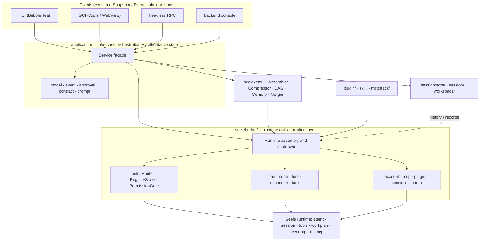
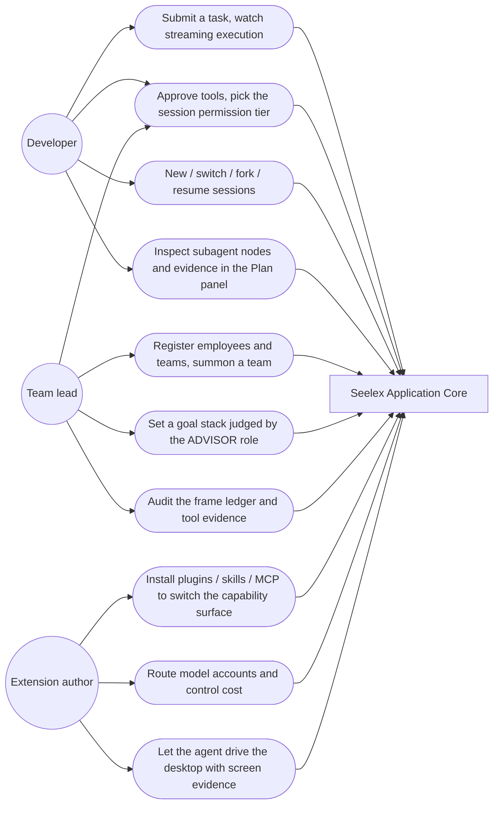
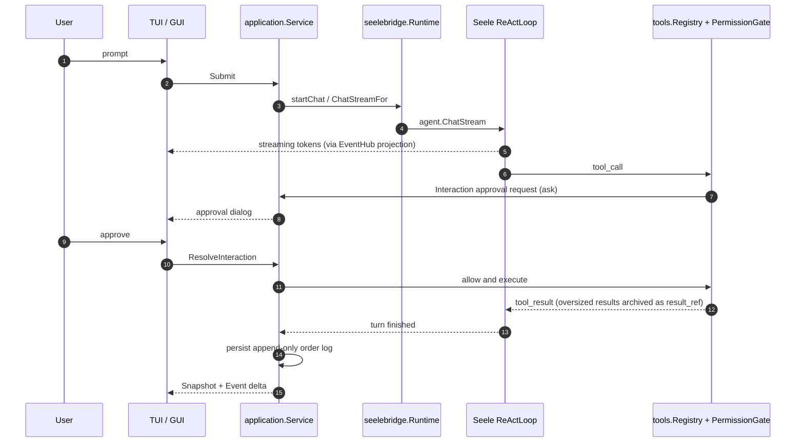

# Seelex — Open-Source Coding Agent Harness

Seelex is a local-first coding-agent harness built in Go. It turns LLM providers, tool calling, agentic workflows, context engineering, permission policy and persistence into an observable and recoverable software-engineering agent.

> Status: **Developer Alpha**. The Bubble Tea TUI is the default interface. The Wails/WebView GUI is usable but remains Alpha. Seelex is not advertised as production-ready or as an OS-level sandbox.

## What it implements

- streaming ReAct execution with bounded Effort profiles;
- optional WorkPlan DAG orchestration, typed nodes and task terminal states;
- parallel subagents with isolated sessions, parent-evidence injection and structured merge-back;
- session-scoped goal stacks with an independent adjudication role (ADVISOR/TechLeader), frame-throttled
  review, a bounded directive mailbox and an append-only governance audit;
- agent-team factory presets and a four-source work table (plan / tasklist / subagent / todo);
- context-window policy, reversible compaction (compaction-as-DAG), prompt stacks and externalized tool results;
- layered memory: related-memory blocks, history read-back indexed by the compaction stack, and
  user/project `MEMORY.md` indexes;
- OpenAI-compatible endpoints, including DeepSeek deployments that satisfy the streaming and
  tool-calling contract (the provider name is a free-form string, but only OpenAI-compatible
  endpoints are exercised);
- P2C account pooling, role-aware routing (agent / subagent / goalplan / websearch) and lease-until-EOF
  streaming safety;
- project-scoped tools with roots resolved per session, plus a Linux-style permission model
  (subject × routing group × rwx bits): `root` / `sub` / `emp_ro` / `emp_rw` subjects over `ro` / `rw` /
  `rw_session` / `rw_desktop` / `ctl` / `adm` groups, where a missing bit means the tool is simply not
  routable for that subject (subagents structurally lack `ctl` and `adm`), and human approval covers every `ask`;
- per-session permission tiers for the main agent (`manual` / `edit` / `auto` / `full`): a tier only
  removes `ask` rules, never adds an allow and never touches a dangerous `deny`, so `rm -rf` roots,
  `dd if=* of=*` and `mkfs*` stay hard-blocked in every tier; the `full` short-circuit applies to the
  `root` subject only, so subagents and employees still escalate through the approval panel;
- multimodal input and desktop control sharing one session media partition: screenshots are stored
  content-addressed, referenced from tool results and attached to the next model request once, while
  desktop-changing tools (focus, mouse/keyboard injection) stay approval-gated and are invisible to
  subagents;
- user image/document attachments, with an inline-text fallback for documents;
- declarative plugins, Agent Skills and dynamically scoped MCP servers, plus plugin/skill/MCP
  self-management tools;
- scheduled (periodic and one-shot) tasks, web search providers (tavily / bochaai / searxng) and
  worktree-scoped execution;
- JSON v8 session persistence with an append-only order log, project/session isolation, per-module head
  publishing, a media partition and plan/task/goal stack channels (the SQLite, PostgreSQL and Redis enum
  values are retired and fail with explicit guidance; new backends wait for an interface rewrite);
- a shared headless Application Core consumed by the TUI, the desktop GUI, a headless RPC frontend and a
  diagnostic backend console;
- deterministic offline scenarios, cross-platform CI, race/coverage gates and release archive audits.

Seelex builds on the [Seele](https://github.com/RedHuang-0622/Seele) agent runtime. The `seelebridge/` anti-corruption layer keeps product semantics separate from runtime primitives.

## Quick verification

```bash
git clone https://github.com/RedHuang-0622/seelex.git
cd seelex
go test ./... -count=1 -timeout=120s
go build .
```

These checks do not require a live model account or network access. To run an agent, copy `config/accounts.example.yaml` to the ignored local `config/accounts.yaml` and provide your own endpoint and credentials.

```bash
go run . -frontend tui -permission manual
```

For an OpenAI-compatible DeepSeek endpoint, keep `provider: openai` and configure a compatible model and base URL in the local account file. Never commit that file.

## Architecture

### Layered architecture



### Use cases



### One request, end to end



```text
TUI / Wails GUI / headless RPC / backend console
       │ Snapshot · Event · Action
application/ — Chat · Task · Plan · Goal/Govern · AgentTeam · Worktable · Session · Workspace
       │
seelebridge/ — runtime adaptation · tools (incl. computer use) · multimodal · node scope · provider/account routing
       │
Seele runtime — Agent · ReAct · Tool Registry · WorkPlan · Account Pool · MCP

plugin/ · skill/ · mcpstack/ · seelexctx/ · sessionstore/ · session/
```

The important design choice is that frontends do not own the agent state machine. They consume a versioned Snapshot + Event Delta protocol from the same Application Core, which keeps chat, plan, approval and persistence behavior testable without a UI or live model.

## Current limitations

- ProjectScope and permission rules are not an OS, container or VM sandbox.
- There is no git checkpoint/rewind abstraction yet.
- There is no semantic repository index, repo map or IDE extension.
- Multi-agent orchestration is in-process and is not an A2A Protocol implementation. The team turn
  scheduler (`TurnScheduler`) is only **partially wired**: linked-list order (`Move` / `Remove` /
  `Restore`), `SetPrefix`, `NoteTurn`, `SyncOrder` and `Snapshot` have production consumers, while
  `Next()` / `Advance()` are primitives without one; the goal governance seat loop is what actually
  drives turns.
- The `review-team` `reviewer` and `research-team` `researcher` roles only have role sessions and member
  rows, no executor yet (`RolesWithExecutor` contains only `user` / `main` / `tl`); the assembly surface
  states this explicitly via `DesignNotice`.
- Standard SWE-bench or Terminal-Bench results have not been published.
- Real WebView E2E is not yet a release gate.
- Total statement coverage is 58.6% (2026-09-14); the TUI (35.6%) trails the core orchestration packages.
- The media partition enforces quotas and reference-based collection, but automatic per-session garbage
  collection is still pending.

For the detailed implementation rationale, configuration and module map, read the [Chinese README](README.md) and [documentation index](docs/README.md).

## Contributing and security

The repository is currently maintained primarily by its original author; external reviews and contributions are welcome. See [CONTRIBUTING.md](CONTRIBUTING.md), [SECURITY.md](SECURITY.md) and [CODE_OF_CONDUCT.md](CODE_OF_CONDUCT.md).

Licensed under the [MIT License](LICENSE).
