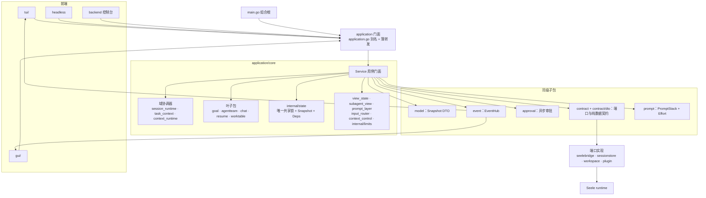
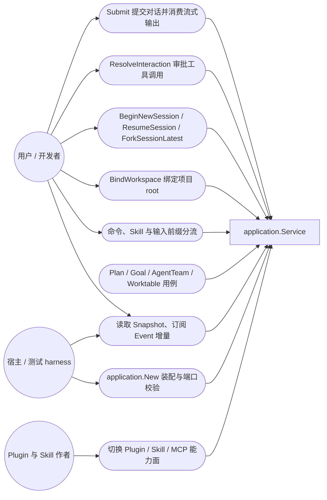
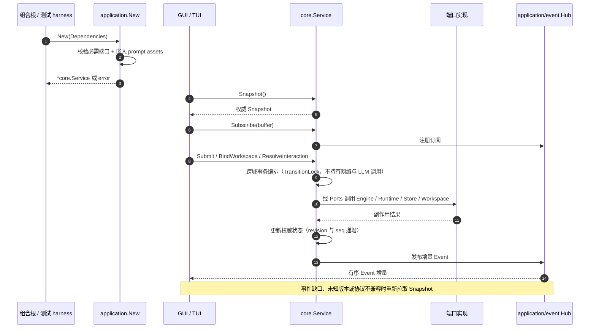
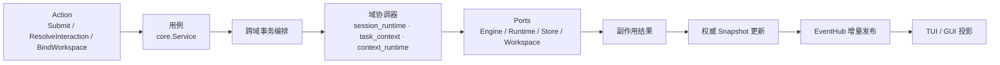
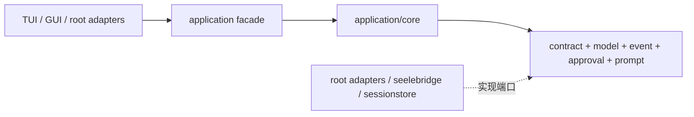

# Application

## 生态位

`application` 是 Seelex 的稳定应用层门面，处在「前端 / 组合根」与「运行时适配」之间，承担两件事：

1. **用例编排**：把底层能力组合成聊天、命令、会话、项目、审批、Plan、Goal、AgentTeam、Worktable 与运行时切换。
2. **权威状态**：所有用户可见事实以 `model.Snapshot` 为准，变更以 `event.Hub` 增量发布，多个前端消费同一份事实。

主要调用方：根目录 composition root（`main.go`）、`tui/`、`gui/` 与测试 harness（`e2e/`）。它们只依赖本门面与 `model`/`contract`，不直接驱动 Seele Engine、Plugin Manager 或存储实现。

## 职责与非职责

- 做：用例编排、跨域事务顺序、权威状态与事件投影、DTO 与协议版本、前端可消费的目录型投影。
- 不做：不实现 Agent 循环（归 Seele）、不实现存储原子写（归 `sessionstore`）、不实现工具路由与权限判定（归 `seelebridge`）、不渲染 UI（归 `tui`/`gui`）。

## 子模块

### 根级子包

| 目录 | 职责 |
|---|---|
| [`model/`](model/README.md) | Snapshot、Message、Plan、Interaction 等版本化 DTO。 |
| [`event/`](event/README.md) | 有序事件封装、订阅和 fan-out。 |
| [`approval/`](approval/README.md) | 异步审批请求、决议、超时和关闭。 |
| [`contract/`](contract/README.md) | Application 拥有的 Engine、Runtime、Plugin、Session、Workspace 端口。 |
| [`contract/dto/`](contract/dto/README.md) | 跨层共享的纯数据契约（Plan / Task / Goal / AgentTeam / 角色会话）。 |
| [`prompt/`](prompt/README.md) | PromptStack 与 Effort 策略。 |
| [`console/`](console/README.md) | backend 诊断前端共享的控制台输出与命令解析。 |
| [`core/`](core/README.md) | Service 用例、聊天状态机、命令、session/project 作用域和工具事件。 |

### `core` 叶子包

`core` 根包按文件前缀分卷（见 [`core/README.md`](core/README.md) 的「分卷 README」导航），
跨域共享与可独立测试的能力下沉为叶子包：

| 目录 | 职责 |
|---|---|
| [`core/agentteam/`](core/agentteam/README.md) | A2A 角色团队装配（`TeamSpec`/`RoleSpec` → 角色会话 + 工作顺序 + 成员表）。 |
| [`core/chat/`](core/chat/README.md) | 聊天流式输出叶子域：`StreamBatcher` 与 `VisibleOutputStream`。 |
| [`core/context_control/`](core/context_control/README.md) | `seele.yaml` window 配置段与窗口策略类型装载。 |
| [`core/context_runtime/`](core/context_runtime/README.md) | provider 上下文预算/压缩/result-ref 与历史归一化。 |
| [`core/goal/`](core/goal/README.md) | 会话级 Goal 对象与状态机、DS-A2A 治理编排、goal 栈持久化。 |
<!-- core/govern/ 已于 2026-10-03（阶段三 W3）随 goal 席位轮转退场删除 -->
| [`core/input_router/`](core/input_router/README.md) | 输入分流（command/skill/plugin/conversation）与命令注册表。 |
| [`core/internal/limits/`](core/internal/limits/README.md) | 进程级运行时上限（`seele.yaml` limits 段）叶子包。 |
| [`core/internal/state/`](core/internal/state/README.md) | core 共享状态内核：唯一共享锁、Snapshot、Deps、Events、Approval。 |
| [`core/prompt_layer/`](core/prompt_layer/README.md) | system prompt 层组装与引擎同步（前缀缓存友好）。 |
| [`core/resume/`](core/resume/README.md) | 「终止前未完成工作」的领域无关恢复模板。 |
| [`core/session_runtime/`](core/session_runtime/README.md) | 会话域协调器：持久化、目录与标题恢复、项目 binding、会话三读。 |
| [`core/subagent_view/`](core/subagent_view/README.md) | 子代理投影面：详情分类、live 流透传、树/节点事件投影。 |
| [`core/task_context/`](core/task_context/README.md) | 任务执行域协调器：打点与终态、transcript、checkpoint、token 审计。 |
| [`core/view_state/`](core/view_state/README.md) | 用户可见 Snapshot 读写与事件发布。 |
| [`core/worktable/`](core/worktable/README.md) | 工作表格增量事件中枢（CSP 汇聚、latest-wins、有界背压）。 |

`application/search` 已于 2026-08-22 迁至 `seelebridge/search/`（后端能力归位）；
`application` 门面保留 `WebSearchConfig`/`WebSearch` 兼容别名与薄转发。
后端适配器（`application/adapters`）同步迁至 `internal/adapters/`，只依赖
`contract` 层，不再反向依赖本门面。

`application.go` 通过类型别名和薄转发保持外部 API 稳定，调用方不需要依赖内部子包。

## 架构图



## 用例图



## 时序图



## 数据流图



## 依赖方向



接口定义在消费方 `contract/`，实现放在根目录适配器或基础设施模块。禁止 `application` 反向依赖 `gui`、`tui` 或 composition root。

## 核心运行流

1. `application.New` 接收 `Dependencies`，校验必需端口与 embedded prompt assets，并返回 `(*core.Service, error)`；构造失败不会终止进程。
2. 前端调用 `Submit`、`ResolveInteraction`、`BindWorkspace` 等用例。
3. Service 更新权威 Snapshot，并通过 EventHub 发布增量事件。
4. TUI/GUI 先读取 Snapshot，再应用连续 Event；出现序列缺口时重新同步 Snapshot。
5. 外部副作用只通过 Ports 进入 Engine、Runtime、Session Store 和 Workspace Repo。

## Review 指南

- 新业务状态应进入 `model.Snapshot` 或明确的内部状态，而不是只存在于某个前端。
- DTO 变更必须检查 GUI reducer、TUI rendering、clone helper 和协议测试。
- 不要把 Seele 深层类型泄漏给前端；在 adapter 边界转换。
- Service 的锁不能包住网络、LLM、数据库或长时间工具调用。
- session/project 操作必须以 ID 为键，显示名称允许重复。

## 测试

```text
go test ./application/... -count=1
go test ./application/... -race -count=1   # 需要 CGO/C toolchain
```

集成入口主要位于 `core/service_test.go`、`core/command_registry_test.go` 和 `internal/adapters/adapters_test.go`。
