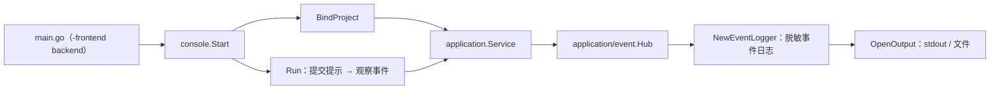
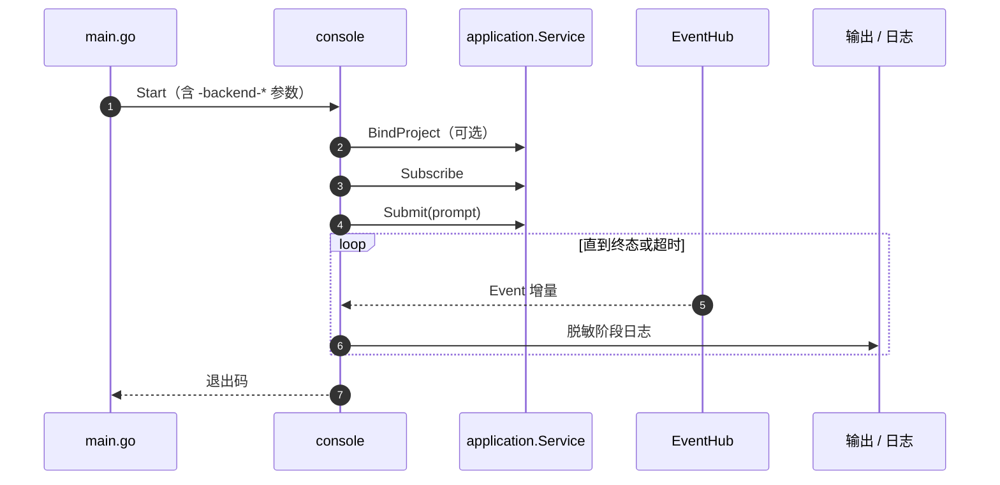

# Console

## 生态位

`application/console` 提供 headless 后端诊断控制台：绑定项目、提交提示、观察事件流并以脱敏格式输出阶段日志。
它是 `-frontend backend` 的入口，只通过 `application.Service` 的窄接口工作，不依赖具体 UI。

主要调用方：组合根 `main.go`（`-frontend backend` 分支）与诊断/冒烟脚本。

## 架构图



## 时序图



## 导出

- `Start`：启动诊断控制台主循环。
- `OpenOutput` / `NewEventLogger`：输出与脱敏事件日志器。
- `BindProject`：将后端会话绑定到项目工作区。
- `Run`：无 UI 的单轮提交-观察循环。

## 验证

```text
go test ./application/console -count=1
```
