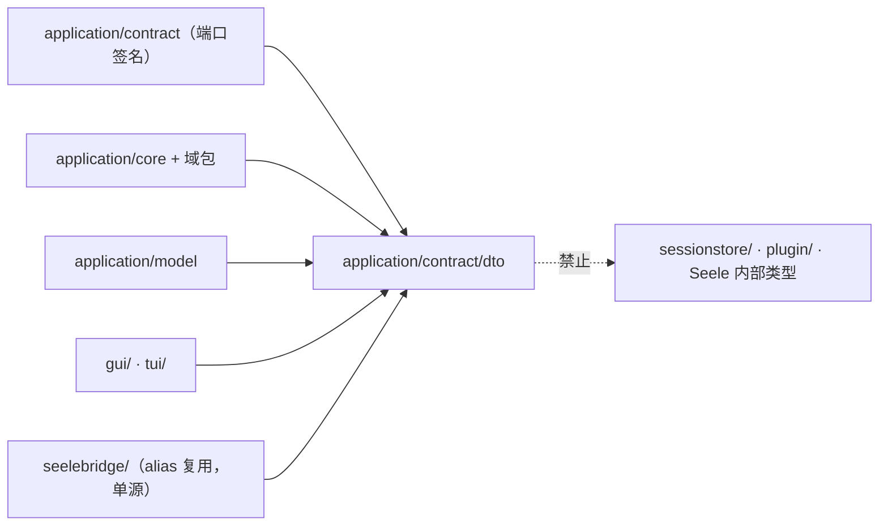
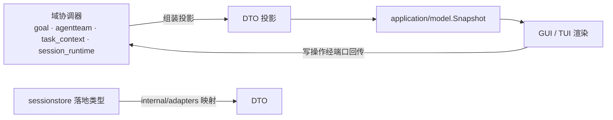

# application/contract/dto

## 生态位

`application/contract/dto` 是 Seelex 跨层共享的**纯数据契约**包：只放数据形状（结构体、枚举字面量、常量），不放行为方法，也不 import 存储、框架或 UI 包。

主要调用方：`application/contract`（端口签名）、`application/core` 及其域包、`application/model`、
`gui/`、`tui/`，以及 `seelebridge/`（以类型 alias 复用同一定义，保证单源）。

## 职责与非职责

- 做：定义 Plan / Task / Goal 治理投影 / AgentTeam / 角色会话 / 子代理树与 live 事件 /
  调度任务 / 工作树 / worktree / 员工权限等跨层词汇；保证 JSON 字段名与前端 reducer 一致。
- 不做：不带方法、不发事件、不读写存储、不持有运行时状态、不做权限判定
  （判定在 `seelebridge/tools`，本包只提供**前后端共用的那份字面量**）。

## 文件结构

| 文件 | 承载 |
|---|---|
| `plan.go` | `PlanEdge` 与 Plan 可序列化形状、`AccountRole`（agent / subagent / goalplan）。 |
| `task.go` | 包文档、`TaskStatus` 生命周期、`TaskPhase*` worktable 阶段常量。 |
| `projection.go` | `RuntimeVisibilityProjection`（application → runtime 的不可变可见性投影）、`GoalGovernanceView`（goal 治理只读投影）。 |
| `agentteam.go` | `RoleKind` / `OrderPolicy` / `TeamKind` 等 A2A 角色工厂枚举与 `TeamSpec` / `RoleSpec`。 |
| `rolesession.go` | R2/R4 群聊角色会话纯 DTO（`Event` / `RoleDraftRow` / `RoleSnapshot` 的应用层形状）。 |
| `permission.go` | 员工权限装配词汇：路由组名 + 位值（前端按组渲染「逐格装配」面板）。 |
| `scheduler.go` | `ScheduledTaskKind` / `PeriodUnit` 定时与周期任务契约。 |
| `subagent.go` | 子代理树只读投影（状态、节点、紧凑上下文）。 |
| `subagent_live.go` | `SubagentLiveEvent`：节点第一视角实时推送（stage / tool / assistant）。 |
| `subagent_recovery.go` | 子代理中断恢复的只读投影。 |
| `tree.go` | 工作树（Work Tree）只读元数据：只含路径/名称/类型/大小/计数，绝不携带文件内容。 |
| `gitcommit.go` | 提交详情（一个提交改了哪些文件）只读元数据：状态/路径/重命名原路径/±行数；文件**内容**走 `dto.FileContent`（与工作树预览同一形状）。 |
| `worktree.go` | `NodeWorktreeInfo`：节点 worktree 现场的只读摘要（人工恢复入口）。 |

## 依赖方向



本包**不得**反向依赖 `application/core`、`sessionstore`、`gui`、`tui` 或 Seele 内部类型；
`seelebridge` 只以 alias 复用定义，不新增平行类型。

## 核心实现

- **枚举即契约**：`TaskStatus`、`TaskPhase*`、`RoleKind`、`OrderPolicy`、`TeamKind`、
  `ScheduledTaskKind` 的字符串值被前端筛选与后端判定共用，改名等于破坏协议。
- **投影而非镜像**：`RuntimeVisibilityProjection` / `GoalGovernanceView` / 子代理树与
  恢复投影都是给 UI 的**有界只读视图**，不是权威状态本身；权威状态在
  `application/model` 与各域协调器。
- **逻辑角色 vs provider role**：`RoleKind` 只是 metadata，provider role 仍然只有
  system / user / assistant / tool；subagent 是 tool calling 能力，不属于任何 `RoleKind`。

## 数据流



存储层类型（`sessionstore.Event` / `RoleDraftRow` / `RoleSnapshot`）只在 `internal/adapters`
里出现，由适配器做 DTO ↔ 存储映射；`application/core` 与前端只认本包类型。

## 并发、存储与错误语义

- 本包全部为值类型或只读形状，**无锁、无全局状态**；并发安全由持有它们的域协调器负责。
- 不定义错误类型：字段缺失或非法由消费方校验（例如 Plan JSON Schema 校验在 `seelebridge/plan`）。
- 字段增删属于**协议变更**：必须同步前端 reducer、GUI 协议测试与 `docs/gui/schemas/`。

## 扩展方式

新增跨层词汇时，先确认它是否真的需要同时被 contract、core、前端与 seelebridge 看到；
只被单层使用的类型应留在该层，不要上提到这里。新增结构体时：

1. 在对应主题文件内定义，保持「一主题一文件」；
2. JSON tag 一旦发布即视为兼容面，破坏性改名须走协议版本；
3. 若是 `seelebridge` 也需要复用的形状，用 alias 而不是复制定义。

## Review 指南

- 是否引入了行为方法或对存储/框架的 import（违反「纯数据」定位）。
- 是否出现了第二份平行定义（`seelebridge` 侧应为 alias，而不是同名结构体）。
- 投影类 DTO 是否可能无界增长（子代理事件、工具事件必须有界）。
- 是否把 workspace 内文件内容塞进只读元数据 DTO（`tree.go` / `gitcommit.go` 明确禁止；
  文件字节只走 `FileContent`，且必须由后端 workspace 层做 containment 与敏感过滤）。

## 测试与验证

本包无独立测试文件；契约由消费方测试覆盖，最小验证命令：

```text
go build ./application/...
go test ./application/... -count=1
node --test gui/frontend/dist/*.test.mjs   # 协议字段与 reducer 一致性
```
