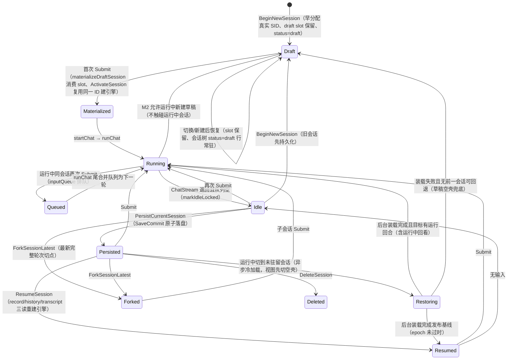

# Application Core

## Service 装配结构

`Service` 是稳定的应用门面与跨组件编排层，本身只保存 `serviceState` 和 `serviceComponents`。共享状态按基础设施、会话、计划、任务上下文、提示词、生命周期和前端快照分组，避免继续扩张成平铺字段集合。

`service_assembler.go` 是唯一组合根，负责装配 prompt、context、task-context、session、history-safety、view 和 input 组件。组件共享同一份受锁保护的状态，但行为通过窄组件端口协作；组件不得持有完整 `*Service`。聊天执行、会话切换、workspace 切换等跨域事务仍由 `Service` 编排，单域规则由对应组件实现。

`service_components_test.go` 固化两条结构约束：`Service` 只能包含状态与组件图，聚焦组件不能反向持有门面。

## 生态位

`core` 是 Seelex 的应用用例层和权威状态机。它不直接创建数据库、Wails 窗口或 Seele Agent，而是通过 `contract.Dependencies` 编排这些能力。

主要调用方是 `application` facade；主要消费者是 TUI、GUI Bridge 和 E2E harness。

本包按域拆分子包（装配件 + 消费方窄接口的容器化方向，见
`docs/2026-08-22-application-split/plan.md`）：

- 零依赖叶子域：`chat/`（流式批次与可见输出）、`worktable/`（表格增量 CSP
  汇聚发布器）、`input_router/`（命令注册表 + 输入路由）、`context_control/`
  （窗口策略配置加载）、`govern/`（多代理回合制治理循环抽象：座次/轮次/
  断环，goal 域经 adapter 接入）。
- 有状态域协调器：`session_runtime/`（会话持久化/目录/项目绑定）、
  `task_context/`（任务执行/checkpoint/transcript/token 审计/plan 状态）、
  `context_runtime/`（provider 上下文装配/压缩/历史安全）、`prompt_layer/`
  （system prompt 组装）、`view_state/`（Snapshot 读/写/事件发布）、
  `subagent_view/`（子代理详情/live/树投影）。
- 共享叶子：`internal/state`（锁 + 权威 Snapshot + 端口依赖 + 事件/审批
  内核）、`internal/limits`（运行时上限）。

域包依赖 `state.Core` 与装配根注入的消费方窄接口，禁止反向依赖 core 根包；
`service_assembler.go` 是唯一组合根。

> Seele v2 装配模型：`contract.ChatEngine` 端口由 seelebridge 创建的
> `session.Session`（`session.NewSession` 主会话）经 `enginePort` 适配满足；
> `RuntimePort` 转发 seelebridge.Runtime（账号池/Completer/可见性/Plan
> preflight/策略）。本模块只消费窄端口，不直接接触 Seele 会话实现。

## 分卷 README（根包按文件前缀）

根包的文件与函数说明按文件前缀分卷到独立 README，主 README 只保留生态位
与导航；各卷含「生态位 + 文件与函数索引」，由
`scripts/gen_core_readme_index.py` 从源码 doc 注释自动刷新。

| 分卷 | 覆盖文件 | 生态位 |
|---|---|---|
| [README-service.md](README-service.md) | `service*.go` | Service 门面、装配根与跨域用例编排（输入/交互/调度/快照/测试夹具） |
| [README-session.md](README-session.md) | `session*.go` | 会话草稿/恢复/存储用例与集成测试 |
| [README-chat.md](README-chat.md) | `chat.go`、`visible_output_test.go` | 聊天主循环与可见输出集成 |
| [README-command.md](README-command.md) | `command*.go` | 内置命令注册与执行 |
| [README-error.md](README-error.md) | `error*.go` | 错误码与面向用户的错误呈现 |
| [README-history.md](README-history.md) | `history*.go` | 历史检索与 provider 失败恢复 |
| [README-input.md](README-input.md) | `input.go`、`input_router_compat_test.go` | 输入分派与路由兼容测试 |
| [README-plan.md](README-plan.md) | `plan_tools.go` | Plan 打点/分支事件/重规划 |
| [README-reference.md](README-reference.md) | `reference*.go` | read_tool_result / read_plan 引用工具 |
| [README-skill.md](README-skill.md) | `skill*.go` | Skill 指令信封编解码 |
| [README-tool.md](README-tool.md) | `tool_hooks.go`、`tool_hook_diagnostic_test.go` | 工具事件钩子与诊断 |
| [README-work-table.md](README-work-table.md) | `work_table*.go` | 工作表格投影与测试 |
| [README-context.md](README-context.md) | `context_*_test.go` | 上下文控制相关集成测试 |
| [README-task.md](README-task.md) | `task_*_test.go` | 任务执行集成测试 |
| [README-subagent.md](README-subagent.md) | `subagent_*_test.go` | 子代理投影集成测试 |
| [README-misc.md](README-misc.md) | aliases/completion/compressed/diagnostics/limits/runtime/workspace/race | 基础与杂项 |

### 叶子包 README

| 包 | 生态位 |
|---|---|
| [chat/](chat/README.md) | 流式批次管道（`StreamBatcher`）与 `<think>` 可见输出剥离 |
| [worktable/](worktable/README.md) | worktable.changed CSP 汇聚发布器（latest-wins、背压、关闭排空尾态） |
| [input_router/](input_router/README.md) | 命令注册表与输入路由 |
| [context_control/](context_control/README.md) | 窗口策略配置加载 |
| [session_runtime/](session_runtime/README.md) | 会话持久化/目录/项目绑定协调器 |
| [task_context/](task_context/README.md) | 任务执行/checkpoint/transcript/token 审计协调器 |
| [context_runtime/](context_runtime/README.md) | provider 上下文装配/压缩/历史安全协调器 |
| [prompt_layer/](prompt_layer/README.md) | system prompt 组装与引擎同步 |
| [view_state/](view_state/README.md) | Snapshot 读/写/事件发布协调器 |
| [subagent_view/](subagent_view/README.md) | 子代理详情/live/树投影 |
| [internal/state/](internal/state/README.md) | 共享状态内核（锁 + Snapshot + 端口依赖） |
| [internal/limits/](internal/limits/README.md) | 运行时上限（seele.yaml limits 段） |

## 权威状态与生命周期

`Service.snapshot` 是前端状态事实源，受 `Service.mu` 保护。一次普通对话：

1. `Submit` 识别 command、Skill、Plugin 或 conversation。
2. `startChat` 写入 user/assistant placeholder、设置 ChatState 并发布事件。
3. Engine `ChatStream` 的 chunk 和 tool hooks 增量更新 conversation/runtime/plan。
4. 完成后保存当前 session；若队列非空，把排队输入冻结并合并为下一 turn。
5. `WaitForIdle` 在 active turn 和已接受队列全部完成后返回。

每个 conversation request 在提交时冻结其 effort 对应的 ReAct budget（工具轮数、工具调用数）。budget 耗尽时保留一次无工具的最终交付回合；它不把报告导出等交付工具一概禁止。长编码任务不设 wall-clock 超时，用户仍可随时主动取消。

`BeginGracefulShutdown` 拒绝新输入但允许已接受工作完成；`Shutdown` 才取消 active chat 并关闭 broker/events。

每个请求另有私有 `TaskExecutionState`：工具结果与 Plan 节点状态写入有界 `NodeCheckpoint`。超长工具结果在下一次 provider 调用前被替换为与原 tool-call 配对的短警告，原文不作为模型上下文；Agent 必须以文件路径、行范围、过滤条件、分页或摘要命令重新读取。历史超过标准 context budget 时，`ContextController` 保留 system prompt，并以一个私有 checkpoint 替换整段可变的 user/assistant/tool transcript；后续轮次需通过定向工具重新获取被省略的细节。连续无新事实、变更、产物或节点状态的工具轮次会触发预算兜底，但不是上下文管理主路径。模型应以 `task_complete`、`task_needs_user_decision` 或 `task_failed` 结束工具型任务；它们分别表示可交付完成、必须由用户选择的有效分歧，以及有界失败事实。若已加载的 authority Plan 尚未执行而模型自然收尾，运行时将其表示为 `needs_user_decision`，而不伪造完成或暴露内部错误。`Snapshot.Task` 公开 `progressing/completed/needs_user_decision/blocked/interrupted/failed`，而 checkpoint、装配的 system prompt 和 `<think>` 内容都不进入 frontend snapshot。Provider 明确返回 context overflow 时，Service 保存私有恢复 checkpoint 并给同一 Agent 一次受控的恢复回合；504 从不自动重放可能已有副作用的工具轮。

冷恢复只给引擎装载尾部窗口（provider 缓存近似）时，恢复后的首个请求不会把
尾部保留段误当“已覆盖前缀”：装配层校验保留段与 transcript 前缀一一对应
（`retainedMatchesTranscriptPrefix`），检测到保留段是后缀就改为从完整
transcript 按会话顺序重建。这样恢复前后的上下文前缀字节一致，模型缓存
（prefix cache）可以命中，而不是得到 `[tail]+[middle]` 的重排与重复。

子代理 mailbox 内容（含 `## 继承上下文 (Inherited Context)` 信封）在排空时
整体丢弃：子代理结论经工具结果（tool_result / summary / `NodeSemanticResult`）
回传父代理，mailbox 不再是注入引擎历史/可见会话/transcript 的通道，因此不会
以 `[子代理产出]` 噪音进入前端或上下文存储。

## Session 与 Project 语义

- project 只定义会话的文件读写范围，不共享 conversation history。
- session ID 是唯一键；标题是按 `(workspaceID, sessionID)` 保存的稳定 KV 元数据。首次请求只初始化一次标题；除显式重命名外，恢复、压缩、历史分页和首条历史消息都不能改写它。
- 运行中切换到**未驻留**会话走异步冷加载：`ResumeSession` 先切视图到目标
  restoring 空壳并立即返回（`session.status=restoring`，会话树与快照可见
  “恢复中”），后台完成三读/引擎重建/context 挂接后发布内容基线
  （`snapshot.changed`）；冷加载不占视图过渡 key，期间其它切换仍可快速
  进行，迟到完成按视图 epoch 判定不再抢占（`session_history.go` 的
  `beginAsyncRestore` / `resumeSessionCold`）。空闲切换与热加载保持原同步
  语义；`SessionStatusRestoring` 只作为运行期叠加状态，不落盘。
- 会话路由引擎（`SessionChatEngine`）下，切换/恢复的 system prompt 一律按
  **目标会话** 经 `SetSystemPromptFor` 写入（`EnginePort` 同步进程级 prompt
  缓存供新建引擎继承），不写进程级“活跃别名”引擎：别名可能指向另一个正在
  运行的会话，其 framework `Session` 锁被 `ChatStream` 全程持有，全局
  `SetSystemPrompt` 会阻塞到该会话收尾——表现为“点第三个会话没反应、被切走
  的会话跑完才开始切换”（复现/回归：
  `repro_two_running_view_third_then_switched_finishes_test.go` 的
  `TestSwitchToIdleThirdBlocksWhileAliasEngineSessionRuns`）。非路由单会话
  引擎无跨会话别名面，仍走全局写。
- `BeginNewSession` 保存旧的非空历史并清空 Engine history，然后进入幂等 draft：**早分配真实会话 ID 并建 `SessionUnit`**（`HasSession=false`，不建引擎 bundle、不写空历史、不建立 workspace binding）；**同时清空继承的项目绑定**（`CurrentWorkspace`/project root/session store workspace）——「任务会话」必须真正未关联工作区，上一个会话的项目信息（项目地址、资源管理器文件树与提交记录、工作台投影）不得污染新会话。需要项目上下文的「工作区会话」在草稿上显式 `BindWorkspace`，第一次进入 `submitConversation` 时才经 `ActivateSession` 用同一草稿 ID 建引擎 bundle，并立即用首问设置显示名。**草稿槽位（draft slot）保留**：`BeginNewSession` 在运行中也可进入草稿（不再返回 `ErrChatRunning`，也不触碰运行中会话的引擎）；切换/新建后草稿不丢失——槽位记录工作区绑定与早分配 SID 并在会话树以 `status=draft` 行常驻，再次新建恢复同一草稿，首次提交物化时消费槽位。用户输入未发送正文后 composer 随 record 落盘（`Status=draft`），冷启动恢复草稿。快照为会话补充 `status`（draft/idle/running/queued）与 `session.composer`（当前草稿未发送正文），`ApplyRuntimeProjectionLocked` 在草稿视图下不覆盖会话 ID（后台运行中会话不得顶掉草稿视图）。
- M1（2026-08-23）起聊天保护粒度从全局单例收窄为**会话级**：每会话独立
  `ChatState`/cancel/inputQueue（`session_scope.go` 的 `sessionChat`
  注册表），`ErrChatRunning` 只对同会话二次提交生效；跨会话提交在运行中
  返回 `ErrSessionBusy`（单飞执行边界）。显式 session API：
  `SubmitToSession/ActivateSession/SnapshotOf/SubscribeSession`；旧方法
  委托活跃会话。真并行执行、每会话驻留 Snapshot/组件栈为 M2 规划
  （见 `docs/gui/modules/multi-session-pages.md` §2.1）。
- workspace ID 是 binding 与 storage shard 的键；显示名来自 root basename。
- 恢复 session 时先定位真实 `workspaceID + sessionID`，再读取历史和绑定 Runtime。
- 有历史的 session 切换 project 时先保存旧 scope，然后创建新 session，禁止把同一 ID 重新绑定后继续写。
- `sessionCatalog` 跨所有项目聚合 metadata；标题按 updatedAt 缓存，存储切换和删除时失效。

## Snapshot/Event 协议

每次状态变化先在锁内 bump revision，再在锁外 Publish。Snapshot 可独立重建全部 UI；Event 只负责低延迟增量。Message ID 由 Service 生成并在 history prepend 时保持稳定。

Event 自 M1 起携带 `session_id` 路由键（`EventHub.PublishSession`），
`SubscribeSession` 可按会话过滤订阅；Snapshot 的会话归属由
`Snapshot.Session.ID` 表达（当前仅活跃会话有驻留快照）。

## Plan 集成

Tool hooks 把用户或 Agent 自主调用的 `plan_load` JSON 转为 Plan DAG。Plan 是可选的
可视化任务结构，不是聊天入口门禁；普通 ReAct 直接使用 project-scoped tools 工作。系统提示
区分 tasklist 与 plan：`plan_run` 可执行含 `kind:agent` 节点的 DAG，子代理继承项目作用域
与父证据、可真并行；tasklist 模式由主代理串行执行并在节点完成后 defer 单个
`task_complete`。`task_complete` 在存在已加载
Plan 时必须枚举完成节点才会把 Plan 标记完成。`replan` 只基于失败原因、旧 Plan 和已完成
节点证据加载一个原子替换的恢复 Plan；它不自动调用 `plan_run`，保留用户复核副作用的边界。

Effort 只为一次可选 `plan_load` 提供节点数、串行和并发约束；它不再创建 isolated preflight
subagent、request-scoped authority lease 或向普通用户输入注入 hidden Plan envelope。这样聊天、
问候和小任务始终直接进入 ReAct，同时复杂任务仍可在用户或 Agent 明确选择时使用 Plan。

## 依赖边界

允许依赖 Application 子包、`seelebridge` 的稳定桥接 DTO 和 `sessionstore.Config`。禁止依赖 `gui`、`tui`、根目录 main package 或具体数据库实现。

## Review 指南

- 不在持有 `Service.mu` 时调用 LLM、网络、数据库、文件系统或外部 callback。
- Snapshot 改动是否 bump revision 并发布正确事件。
- queued input 是否冻结提交时的 Skill 上下文，而非执行时重新读取。

Queue liveness note: for framework-backed sessions, queued inputs are removed
from the visible queue immediately after `ChatStream` returns and the session
lock is released. The current turn is persisted before the merged next turn is
started, so queue acknowledgement does not require re-entering the framework
session from an iteration callback.
- resume/load-more/delete 是否使用目标 session 的真实 workspace，而非当前 active scope。
- 热挂载/冷恢复收尾是否误写全局活跃别名引擎（`SetSystemPrompt` 可能阻塞在
  运行中会话的 framework `Session` 锁上）；路由引擎只按目标会话经
  `SetSystemPromptFor` 写，并同步进程级 prompt 缓存。
- project 切换、storage reconfigure、shutdown 与 running chat 的竞争是否有明确结果。
- draft 期间切换项目是否只更新待继承 scope，是否避免空 Session ID binding；重复点击新建是否仍只保留一个 draft。
- Tool/Plan callback 是否只更新所属 request/session。

## 会话数据流：状态流转



- draft 从新建即持有早分配的真实 SID（引擎 bundle `HasSession=false`），
  槽位跨切换保留；有未发送正文时 composer 随会话 record 落盘（
  `Status=draft`），冷启动恢复草稿，首次提交物化后消费槽位并清空 composer。
- 可见状态由 `Snapshot()` 富化：`SessionState.Status` / `SessionInfo.Status` ∈ draft | idle | running | queued | restoring。
- 运行中新建草稿时 `BeginNewSession` 不清理运行中会话的引擎；仅当用户输入
  未发送正文时才落盘 composer；`ApplyRuntimeProjectionLocked` 在草稿视图下
  不覆盖会话 ID（后台运行中会话不得顶掉草稿视图）。

## Fork 对话机制（字符画）

`ForkSessionLatest` 以父会话「最新完整轮次」为切点，深拷贝 record / events / tool-results / context 生成独立子会话：

```text
父会话 transcript 占比（LatestForkCut 取最新完整轮次作为切点）：
┌──────────────────────────────────────────┬──────────────┐
│ 已落盘内容（轮 1..5）100%                │ 轮 6 进行中   │
│ ▓▓▓▓▓▓▓▓▓▓▓▓▓▓▓▓▓▓▓▓▓▓▓▓▓▓▓▓▓▓▓▓▓▓▓▓▓▓│ ▒▒▒▒▒▒▒▒     │
│ → 子会话完整继承（全拷贝）                │ → 不继承      │
└──────────────────────────────────────────┴──────────────┘
```

子会话以新 ID 独立持久化到同一 workspace（SaveCommitWorkspace），血缘
ForkedFrom 记录父会话 + 切点（EventSeq/轮次/RequestID/MessageID）；
父会话保持原样继续，互不影响。运行中 fork 被拒绝（仅父会话自身）；
父会话未落盘（draft）时无法 fork。task 注册表按切点截断并过滤
`kind=todo`——子会话 todolist 全新、可正常新建；血缘与 plan/task/
checkpoint/tool-results 等其余内容仍按切点拷贝，不受过滤影响。

## 测试

```text
go test ./application/core -count=1
go test ./application/core -race -count=1
```

## Runtime projections and catalog cache

`Snapshot()` only clones the in-memory `Service.snapshot` under `Service.mu`.
It never reads Engine, Runtime, Workspace, or session storage. A background
worker refreshes the session catalog cache and stops without blocking GUI
shutdown on a legacy non-context-aware catalog call.

Application publishes immutable `RuntimeVisibilityProjection` and
`ParentEvidenceProjection` values to Runtime after relevant state changes.
Runtime never calls Application back. Subagent merge-back results return to the
parent through tool results (tool_result / summary / `NodeSemanticResult`) after
the node worktree finishes; a bounded Runtime mailbox is drained and **discarded**
by Application outside `Service.mu` — mailbox content never enters engine
history, the visible conversation, or the durable transcript.

## Context compression visibility

`ContextController` rebuilds provider history from the active system policy, trusted task Skills, the active Plan slice, and complete protocol units. A unit is admitted only when every tool call has a matching result; orphan results and incomplete parallel calls remain in the durable transcript but never enter provider context. The assembled order follows the prefix-cache chain: system → project → memory → compact → accumulated context → plan → task (the seelexctx assembler renders project/memory/stack blocks; the coordinator keeps the engine history as accumulated context + trailing plan message).

> 已实现（任务 A/B/C）：装配顺序为「system → project → memory → compact → 累积 context（达峰前 append-only 全量已定稿轮次）→ plan → task → 当前输入」，checkpoint 正常路径不再进入 LLM 上下文（异常恢复路径 provider 504 / history-safety 保留）；达峰才压缩（折叠 compact 栈顶 + context 窗口，plan/task 不参与压缩）。设计见 [docs/arch/context-prefix-chain.md](../../docs/arch/context-prefix-chain.md)。

The token audit counts the separately configured system prompt, message/tool-call overhead, visible tool metadata, the current input, and an output plus safety reserve. Requests that still exceed the safe budget after dropping the accumulated context (without a checkpoint fallback) are rejected before `ChatStream`; the provider-504 / history-safety recovery path then owns the bounded checkpoint continuation.

Oversized tool output and oversized current input are stored through immutable `result_ref` records. Provider history and `SessionRecord` contain only the reference warning; `read_tool_result` provides bounded, read-only pagination or filtering. `read_plan` retrieves omitted canonical Plan nodes without changing Plan state.

`read_tool_result` 兼容 `result:call_<callID>` 别名：模型在省略占位后自行
拼接的 `result:call_...` 引用会按工具调用 ID 映射回归档的真实 `tr-` ref
（`resolveToolResultRefAlias`），避免「result_ref is not available」假阴性。
引用不可读/参数缺失不再落入 unclassified 兜底文案，而是分类为
「工具执行｜read_tool_result」（`resultRefUnavailablePresentation`），
给模型/用户可行动的指引。

When compaction creates a new checkpoint, Application also publishes a separate `Snapshot.Task.ContextCompactions` record. The record contains only a version, public trigger reason, message count, estimated token count, and timestamp. It never contains checkpoint text, system prompts, tool arguments, tool results, or raw conversation history.

## Session record and recovery

Provider history is an execution cache, not the user-visible source of truth. `persistCurrentSession` atomically stores version 3 `SessionRecord`, bounded provider history, append-only transcript events, and new tool-result objects. The record owns stable title, visible conversation, Plan revisions, `TaskContextProjection`, checkpoint history, and tool-result metadata. Resume reads only a token-bounded tail of complete transcript units for the Engine, restores content-addressed task Skills and the canonical Plan from the projection/store, and keeps the full archive untouched. Interrupted or blocked tasks carry their checkpoint into the next ordinary input; `/new` clears task-scoped Skill, Plan, checkpoint, and result state. Legacy v1/v2 records remain readable.

`Snapshot.Conversation` 是 `limits.history_window` 控制的有界投影；`HistoryOffset`、`TotalMessages`、`HasMoreHistory` 和 `ConversationWindow` 描述当前窗口。持久化前按稳定 message ID 与已有完整 `SessionRecord` 合并，因此尾部窗口不会覆盖旧历史。流式 chunk 经 `StreamBatcher`/`BatchPipeline` 按条数或时间聚合，批次 flush 后才更新 Snapshot 并发布一个 `message.delta`；工具和 Interaction 事件前会先 flush，以保持事件顺序。

子代理事件由 `HandlePlanNodeComplete` 和 `HandleSubagentToolEvent` 投影到嵌套 `PlanNode`。节点生命周期发布 `subagent.changed`，内部工具活动按 ID upsert 到有界 `tool_events` 并发布 started/completed 增量；Snapshot 始终可以重建相同状态。

## 群聊角色会话（R2/R4 可选端口）

`application/core/role_session.go` 把会话端口可选实现的角色能力面
（`CreateRoleSession` / `AppendRoleDraft` / `SyncRoleDraft` / `RoleSnapshot` /
`AssembleRoleWire` / `SetLifecycleOrder` / `schedule.*`）透传给 headless。
Application 只做窄转发，不实现 sequencer、floor、draft 删除或 compact_ref
校验；这些语义仍在 `sessionstore`。

端口形状在 S27 之后来自 `application/contract`：`contract.RoleSessionPort`
与 `contract.SchedulePort`（可选能力，装配期用类型断言发现），签名只用
`application/contract/dto` 纯 DTO，本包与 `gui/headless` 不再出现
`sessionstore.*` 类型；DTO ↔ 存储映射是 `internal/adapters.SessionPort` 的
职责。边界回归见 `e2e/dto_boundary_test.go`。

`task_context` 的消息生产者给 `user` 行写 `role_name=user`、给
`assistant/tool` 行写 `role_name=main`、给 `system`/internal 状态材料写
`role_name=system`，并用 `round_id`（每个 user 输入一轮）与 `unit_seq`
（轮内事件序）补齐群聊排序键；`role_session_id` 默认当前会话 ID。显式已填
字段不覆盖，给未来 agent-team 生产者留入口。注意：provider 请求的 `role`
仍是标准集（实验确认自定义 `tl` 被端点拒绝），A2A 角色只能放 metadata
`role_name`，不得透传成 provider role。

## 工作表格（Work Table）

工作表格是右侧工作台的统一读模型：`buildWorkTable`（纯函数，锁内构建）把
`Runtime.Plan` / `Runtime.TodoItems` / `Engine.SubAgentTree()` 归一为扁平
`WorkItem` 行（phase/task/status/assignee/dependencies/attachments + trace），
行数与 trace 有界（`work_table_rows` / `plan_node_events` / `evidence_chars`）。
增量经 `worktable.changed` 发布，payload 只带表格（CSP 汇聚发布器
latest-wins，避免整份 runtime 深拷贝与 JSON）。`UpdateWorkItemStatus` v1 仅
支持 todo 三态（pending/doing/done），经 `RuntimePort.SetTodoStatus` 落到
todoState mailbox actor（Actor + Mailbox 并发安全）；plan/subagent 状态由
执行器权威管理，手动更新返回明确错误。

子代理生命周期是被动数据源：`fork_subagents` 注册/节点完成时，
`seelebridge` 树 observer 触发 `Service.RefreshWorkTableSnapshot`
（锁外取树 → 锁内重建 → 发布 `worktable.changed`），无需模型调用任何工具；
done 节点有界保留（`subagentTreeRetainDone`），工作表格持续展示已完成
任务，直到显式清空。

task 体系：`seelebridge/task_registry.go` 是唯一权威源（Actor + Mailbox，
保护粒度=task），todolist 融合为 kind=todo 的 task；主动 `taskadd` 与被动
plan/subagent 生命周期同步都落到注册表；`syncTasksFromSources`（锁外外部
端口）做幂等同步，`publishTaskDeltas` 发布 `task.changed`（逐任务）与
`worktable.changed`（结构）；retry 计数、B6 子代理装配 task_id、SessionRecord
快照复用 stack 存储均在此体系内。

重点测试：`service_test.go` 覆盖 session/project/storage 用例，`command_test.go` 覆盖输入协议，`race_test.go` 覆盖并发与关闭。
