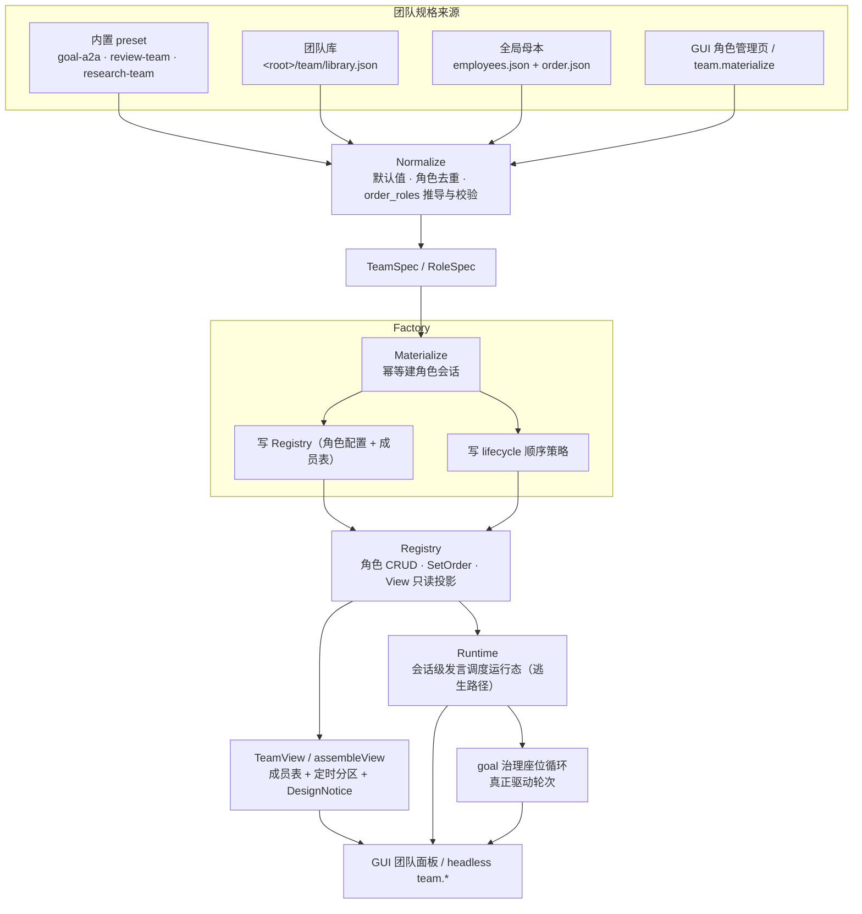
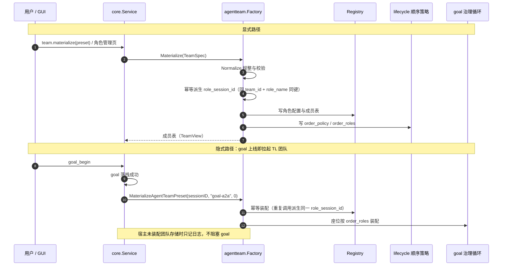

# core/agentteam

## 生态位

A2A 角色团队的**通用装配能力面**：把「`TeamSpec`/`RoleSpec` → 角色会话 + 工作顺序 +
成员表」抽成可复用装配，供 `application/core` 的 Service 门面与 headless `team.*`
接口消费。长期边界见 [`docs/arch/a2a-agent-team-factory.md`](../../../docs/arch/a2a-agent-team-factory.md)；
本次落地的工厂/preset/注册表口径见
[`docs/2026-09-10-a2a-agentteam-recovery/agentteam-management.md`](../../../docs/2026-09-10-a2a-agentteam-recovery/agentteam-management.md)。

主要调用方：`application/core/agentteam_service.go`（窄转发 + 端口适配）、
`gui/headless_team.go`（`team.*` RPC）与 `application/core/goal_service.go`
（goal 创建时自动装配 `goal-a2a`，见下）。goal 的 TL 只是本包的内置 preset，
不是特例。

装配入口有两条：

- **显式**：`team.materialize` / GUI 角色管理页按 preset 装配任意团队；
- **隐式**：`GoalBeginFor` 在 goal 落栈成功后调
  `MaterializeAgentTeamPreset(sessionID, "goal-a2a", 0)`——因为 `goal-a2a` 的
  TL 声明了 `JoinPolicy=on_goal_create`，"goal 上线"就该把 TL 团队拉起来。
  幂等由工厂保证（同 `(team_id, role_name)` 派生同一 `role_session_id`）；
  宿主未装配团队存储时只记日志、不阻塞 goal（`ensureGoalAgentTeam`）。

## 职责与非职责

做什么：

- `Normalize` 规整 `TeamSpec`（默认值、角色去重、`order_roles` 推导与校验）；
- `Factory.Materialize` 由 `TeamSpec` 装配一支团队：幂等建角色会话 → 写注册表 →
  写 `lifecycle` 顺序策略 → 返回成员表；
- `Registry` 角色配置 CRUD 与工作顺序设置；
- `assembleView` 把注册表 + 顺序投影成前端消费的成员表（含定时分区与设计偏差提示）。

刻意不做：

- **不接纳 subagent**：subagent 是 tool calling 能力（劳务派遣），不建角色会话、
  不进 `order_roles`、不占 floor（见设计稿 AT1）；
- **不写 message**：正文只由 sequencer append；
- **不做第二份顺序事实**：顺序只落 `lifecycle.order_policy`/`order_roles`；
- 不决定 provider role：`role_name` 只是 metadata，provider 侧仍只有
  `system/user/assistant/tool`。

## 架构图



## 时序图：装配与隐式拉起



## 接线现状（2026-09-14 复核）

装配得出来 ≠ 有人在干活。下表是**当前代码事实**（每条都可按"证据"列复核），写在这里
是为了避免把"已注册/已装配"读成"已生效"：

| 能力 | 现状 | 证据 |
|---|---|---|
| 角色会话 + 顺序策略 + 注册表 | **已接线**：goal 创建即装配 `goal-a2a`，顺序落 `lifecycle` | `application/core/goal_service.go`（`ensureGoalAgentTeam`）、`application/core/goal_team_wiring_test.go` |
| 工作顺序（`order_policy`/`order_roles`） | **部分接线**：用于角色 draft 同步排序与成员表展示；**不驱动运行时轮次** | `sessionstore/role_session.go`（`sortRoleDraftRows`） |
| 运行时轮次驱动 | **已接线（仅 goal-a2a）**：goal 治理的 Governor 座位 `exec-a` + `advisor-b`，`tl` 的 ADVISOR 回合由 goal 域 TL 评估器执行 | `application/core/goal_coordinator.go`（`newGovernor`）、`application/core/goal/adapter.go` |
| EXEC 工作内容进入 ADVISOR 输入 | **已接线**：`turn_completed.Detail`（本轮正文/工具名有界摘要）→ `work.progress` 帧 → b 回合输入正文 | `application/core/goal_work_summary.go`、`application/core/goal/techleader.go`（`flushWorkProgressLocked`） |
| EXEC 的 computer use 证据进入 ADVISOR 输入 | **已接线**：工作摘要额外带 `screen: media:… 宽x高 foreground="…"`（截图句柄 + 画面尺寸 + 前台窗口），ADVISOR 据此"看证据评审"，而不是只看到一个工具名 | `application/core/goal_work_summary.go`（`computerUseEvidence`）、`gui/team_work_computer_use_live_probe_test.go` |
| ADVISOR 直接读画面内容 | **尚未实现**：ADVISOR 回合是一次有界 LLM 调用（`TLEvalEvaluator`，无工具循环），它拿到的是证据**句柄与元数据**，不是像素；要读图需要给 b 回合挂图（imageattach）或给角色配独立工具循环 | 见 `docs/devlog/2026-09-15-team-work-computer-use.md` |
| `TeamView.floor_role` | **已接线**：读主会话 `message head.floor`（唯一写者 = sequencer）填成员表；宿主未实现可选读面时留空 | `sessionstore/team_registry.go`（`ReadMessageFloorWorkspace`）、`internal/adapters/agentteam_ports.go`（`ReadFloorRole`） |
| 团队库（可复用团队模板） | **已接线**：**全局** `<root>/team/library.json`（整份替换型），条目 = 角色配置集 + 顺序策略；装配 = 条目 → `TeamSpec` → 既有工厂（建角色会话 + 写会话 registry + 写 lifecycle 顺序） | `sessionstore/team_global.go`、本包 `library.go`、`application/core/agentteam_service.go`（`AgentTeamSaveTeam`/`AgentTeamMaterializeTeam`） |
| 全局母本（员工库 + 默认顺序） | **已接线**：`<root>/team/employees.json`（员工名册）与 `<root>/team/order.json`（默认顺序）是全局母本；会话在编员工表 + lifecycle 顺序是它的**深拷贝副本**，会话内入职/改序只改副本；只有「确认·普及搭配到全局」把副本回写母本 | `sessionstore/team_global.go`、本包 `global.go`、`application/core/agentteam_service.go`（`AgentTeamGlobalConfig`/`AgentTeamPublishToGlobal`） |
| 员工提示词（`RoleSpec.SystemPrompt`）→ ADVISOR 回合 | **已接线**：装配根把"读已装配提示词"的读面注入 Runtime，ADVISOR 回合用它替换内置角色设定；**输出契约永远追加**（goal 域要解析 `TLDirective`，不能被员工提示词改掉输出格式） | `seelebridge/runtime_role_prompt.go`（`SetRolePromptProvider`）、`seelebridge/runtime_goal_tl.go`（`advisorSystemPrompt`）、`main.go` 装配点 |
| 员工权限（`RoleSpec.ToolsPolicy`） | **登记 + 写入侧枚举校验 + 运行时承载体已就位**：值随角色注册表落盘、在员工栏与编辑面板可见；写入侧经 `NormalizeRole` 只接受 `readonly`/`readwrite`/`full`/空（枚举外的拼写错误会被**显式拒绝**——运行时把未识别值映射成 root 全权，静默接受等于把拼写错误升级为最高权限）。真正的工具拦截在 seelebridge `PermissionGate`；**按角色拦截的承载体 = 角色回合执行体**（`seelebridge.RunRoleTurn`：开角色会话时分配 `emp_<角色名>` 主体，回合起手按构造把主体放进 ctx，工具面据此收窄）| `application/core/agentteam/spec.go`（`ValidToolPolicy`）、`application/contract/dto/agentteam.go`（`ToolPolicy*`）、`seelebridge/tools/permission_policy.go`（`ClassForToolsPolicy`）、`seelebridge/runtime_role_turn.go`（`RunRoleTurn`）、`seelebridge/tools/registry_state.go`（`PermissionGate`） |
| 员工提示词优化 | **已接线**：一次有界 LLM 回合（`RolePromptPort`），只产出候选文本 + 改动理由，不落盘、不写会话消息；落盘仍走入职/保存 | `seelebridge/runtime_role_prompt.go`（`OptimizeRolePrompt`）、`application/core/agentteam_service.go`（`AgentTeamOptimizeRolePrompt`） |
| `TurnScheduler`（channel + 链表轮转 / team work 前缀） | **部分接线**：`Runtime`（会话级发言调度运行态）持有它并同步注册表顺序；生产实际消费的是 `Order()`（座位存在性）、`NoteTurn()`（逃生记账）、`SyncOrder()` 与 `Snapshot()`，**`Next()`/`Advance()` 没有生产消费者**（"下一个谁发言"是表头扫描的静态投影，不随轮转变化）；真正驱动轮次的是 goal 治理的座位循环（见上一行「运行时轮次驱动」）。含三条**逃生路径**（轮次上限 / 连续无进展 / 无执行者）与 user 席位口径 | 本包 `runtime.go` + `scheduler.go`；守卫用例 `scheduler_wiring_test.go`、`runtime_test.go`（`Next`/`Advance` 的行为用例）；消费点 `application/core/agentteam_service.go`（`teamRuntimeFor`）与 `goal_coordinator.go`（按顺序装座位 + `NoteTurn` 逃生记账） |
| `@` 召唤的"开工"判据 | **已接线（2026-09-17）**：`@<团队> <附言>` 除装配外还落一个 goal（附言 = 目标陈述），主会话这一轮即 EXEC 座位、回合尾 Governor 让 teammate 上场；不带附言仍只装配（待命） | `application/core/input_team.go`（`beginGoalForSummon`）、用例 `application/core/input_team_work_test.go` |
| 团队离场（干完就走人） | **已接线（2026-09-17）**：目标收口（栈里没有 active goal）→ 删角色注册表 + 复位顺序；角色会话子树保留（装配幂等键 `(team_id, role_name)` 不变，再次召唤复用同一棵） | `application/core/agentteam/factory.go`（`Dismiss`/`DismissPort`）、`sessionstore/team_registry.go`（`removeTeamRegistry`）、`application/core/agentteam_service.go`（`DismissAgentTeam`）、`application/core/goal_service.go`（`dismissTeamWhenGoalClosed`） |
| `review-team` / `research-team` 的成员 | **只有装配、没有执行者**：`reviewer`/`researcher` 建得出角色会话，但不会自动产生回合（`TeamView.DesignNotice` 会明说） | `factory.go`（`RolesWithExecutor` / `unexecutedRoles`） |

结论口径（2026-09-16 复核）：`TurnScheduler` 的链表顺序（`Move`/`Remove`/`Restore`）与 `SetPrefix` 现在有生产消费者：
`Runtime`（`runtime.go`，2026-09-15 落地）把注册表顺序同步成环；生产**实际调用**的只有 `Order()`（`newGovernor` 据此决定 main/tl 座位要不要长出来）与 `NoteTurn()`（`AdvanceAfterChat` 据此收束环）与 `NoteWorkDetail()`（同一次 `AdvanceAfterChat` 把本轮正文装配成 team work 前缀 → `SetPrefix` → 交班时下发给下一名发言成员；唯一写入口在后端，前端只能 `Snapshot().Prefix` 只读查看），`Next()` / `Advance()` 没有生产调用者；
前端「工作顺序」编辑既改持久事实（`lifecycle`）也即时同步环，因此"下一个谁发言"不是排班结果（它是把表头第一格扫出来的静态投影）；真正让角色发言的仍是 goal 治理的座位循环，逃生记账只属于**当前这一轮 goal**（新 goal 上线时 `goalCoordinator.Begin` 调 `Runtime.Reset()`，否则上一轮的逃生结论会让新 goal 的 ADVISOR 永久静默）。

**user 算不算环里的一环**（2026-09-15 定稿）：user 永远在 `order_roles` 里（它是群聊的起手与收口），
但"在顺序里"≠"每轮固定占位"。缺省口径 `queued`——user 通过**消息队列**插话，只有队列里存在
未消费的 user 输入时才占位；否则调度器跳过 user 继续转，不因为"人还没说话"卡住 agent 循环。
口径由 `order_policy` 推导，不新增第二个配置项：`goal_loop → queued`、`user_main_decided → member`
（与员工同权固定占位）、`scheduled_only → absent`（只有定时 agent 插话）。

**逃生路径**（不能不休止地转）：① 轮次上限 `round_limit`（缺省 24）；② 连续无进展上限 `no_progress`；
③ 环内没有任何有执行者的角色 `no_executor`；④ 空环 `empty_ring`；⑤ 外部显式停止 `external_break`
（用户中断 / TL 裁决收口 / `goal.gov_break`）。停止是正常收束而非错误，原因随 `TeamView.schedule` 下发前端。

## 文件结构

| 文件 | 职责 |
|---|---|
| `spec.go` | `TeamSpec` 规整与校验、角色会话号派生（`RoleSessionID`） |
| `presets.go` | 内置实例：`goal-a2a`（TL 循环）、`review-team`、`research-team`（定时分区） |
| `factory.go` | `Port` 契约、`Factory.Materialize`、成员表投影 `assembleView` |
| `registry.go` | `Registry`：角色配置 CRUD、`SetOrder`、`View` 只读投影（含 floor 填充）、`Stored`/`PromptFor` 只读回读 |
| `library.go` | 团队库读写面（条目 upsert/delete/`Entry`）与投影（`SpecOfEntry`/`EntryFromRegistry`/`EntryFromSpec`），含共用口径 `IsBuiltinRole`/`OrderRolesOf` |
| `global.go` | `Global`：全局母本（员工库 + 默认顺序）读写面与规整（`NormalizeEmployeeLibrary`/`NormalizeDefaultOrder`） |
| `scheduler.go` | `TurnScheduler` 轮转原语（链表轮转 + channel 投递） |
| `runtime.go` | `Runtime`：会话级发言调度运行态（顺序同步 + user 席位 + 逃生路径），投影 `dto.TeamSchedule` |
| `agentteam_test.go` | 规整/工厂幂等/第二团队（AT8）/定时分区/注册表用例 |

## 核心实现

- `Port` 是唯一外部依赖面：`EnsureRoleSession`、`ReadLifecycleOrder`、
  `SetLifecycleOrder`、`Read/WriteTeamRegistry`。实现方是 `application/core` 的
  `agentTeamAdapter`（把 `internal/adapters.SessionPort` 的 DTO 形态转成工厂输入）。
- `FloorPort`（可选）是运行态读面：`ReadFloorRole` 读主会话 `message head.floor`。
  未实现的宿主（旧端口/测试桩）不填充 `TeamView.FloorRole`，也不报错——可选而不是
  塞进 `Port`，是为了不给每个装配桩加编译期义务。读失败只进 `DesignNotice`。
- `Factory.Materialize` 的幂等键是 `(team_id, role_name)` → `RoleSessionID`；重复装配
  不产生第二个角色会话，返回结果里 `TeamRoleSession.Created=false`。
- `resolveOrderRoles` 是顺序唯一入口：定时角色（`RoleKindTimer`）不得进顺序；
  显式顺序必须是「`user` + `main` + 已注册角色」的子集；未给定时按
  `user → main → 其余角色（OrderPriority 升序）` 推导。
- `assembleView` 只报事实不修补：已注册但不在顺序、顺序里未注册的角色写成
  `TeamView.DesignNotice`，供前端与冒烟断言。
- 顺序里存在**没有执行者**的角色时（`reviewer`/`researcher`/自定义 agent/timer），
  `DesignNotice` 必须明说"暂无可执行者"：执行者事实表 = `RolesWithExecutor`
  （`user`/`main` 由宿主驱动，`tl` 由 goal 治理执行）。

## 数据流或生命周期

```text
TeamSpec（preset 或前端提交）
  → Normalize（默认值/去重/顺序校验）
  → Factory.Materialize
      → Port.EnsureRoleSession（每个非 user/main 角色一个角色会话）
      → Port.WriteTeamRegistry（session/team/roles.json，整份替换型）
      → Port.SetLifecycleOrder（lifecycle head：order_policy/order_roles）
  → dto.TeamMaterializeResult（Spec/View/Sessions/Registry）
```

读取路径：`Registry.View` 读注册表 + `lifecycle` 顺序 → `dto.TeamView`
（成员 + 工作顺序 + 定时分区 + 设计偏差提示）。运行态 `online`/`floor` 高亮由
presence 与 `message head.floor` 提供，不在本包落盘；`Registry.View`/`SetOrder`/
`Materialize` 每次返回视图时经可选 `FloorPort` 重新读取 floor（运行态值不缓存）。

## 依赖方向

- 允许：本包 → `application/contract/dto`（纯 DTO）。
- 禁止：本包 → `sessionstore`、`internal/adapters`、`gui`；也禁止反向依赖
  （存储与界面不得 import 本包）。存储形态只在适配器里出现。

## 并发、存储、安全或错误语义

- 装配是**幂等**的：重复 `Materialize` 复用同一角色会话；注册表与顺序整份替换。
- 错误一律显式：未知 preset（`ErrUnknownPreset`）、未注册角色进顺序、定时角色进顺序、
  重复 `role_name`、内置角色被改写/删除都返回错误，不静默降级。
- 不做读时补写：`View` 遇到「注册表有角色但 lifecycle 无顺序」时按注册顺序推导只读
  视图，不落盘，避免读操作产生第二份事实。

## 扩展方式

- 新增团队形态：在 `presets.go` 加一条 preset（角色集 + `order_policy`），或由前端直接
  提交 `TeamSpec`；不改工厂、sequencer、message/draft/compact 形态。
- 新增调度策略：只在 `dto` 增加策略名并校验，替换点是 sequencer 的 role 顺序函数。
- 新增角色字段：加在 `dto.RoleSpec` + `sessionstore.TeamRoleSpec` + 适配器映射三处，
  保持旧注册表可读（缺字段 = 未配置）。

## Review 指南

- 顺序是不是只落 `lifecycle`？有没有在别处复制一份 `order_roles`？
- 定时角色有没有漏进 `order_roles`？subagent 有没有被当成团队成员？
- 角色会话号是否稳定（`(team_id, role_name)`）？重复装配会不会建出第二棵子树？
- `View` 是否偷偷写盘（读路径必须零写入）？
- `role_name` 是否只做了 metadata：没有被当成 provider role 使用？
- `floor_role` 是不是每次读都重新取（有没有把运行态值缓存/落盘）？读失败是否被静默吞掉？
- 新增/删除有执行者的角色时，`RolesWithExecutor` 与 `DesignNotice` 是否同步（别让 UI 误以为有人干活）？
- `scheduler.go` 被改动时，README「接线现状」表与 `scheduler_wiring_test.go` 是否同步？

## 测试与验证

```text
gofmt -l .
go build ./...
go build -tags "gui,desktop,production" ./...
go vet ./application/core/agentteam ./sessionstore ./gui ./internal/adapters
go test ./application/core/agentteam ./sessionstore ./gui -count=1
go test -race ./application/core/agentteam -count=1
```

关键测试：`agentteam_test.go`（规整/幂等/AT8 第二团队/定时分区/注册表 CRUD）、
`team_view_test.go`（floor 读面：可选端口/读失败/降级；无执行者提示）、
`scheduler_wiring_test.go`（`TurnScheduler` 接线状态与 README 声明一致）、
`sessionstore/team_registry_test.go`（注册表落盘、角色会话幂等、`message head.floor` 读面）、
`application/core/goal_team_wiring_test.go`（goal → 自动装配）与
`application/core/goal_work_summary_test.go`（EXEC 工作正文进 ADVISOR 输入）、
`gui/headless_team_test.go`（`team.*` 契约）、
`gui/team_live_probe_test.go`（真实 API + pprof 冒烟，env 门控）。

## 文件与函数索引

> 由源码 doc 注释自动提取（首行摘要）；描述源码行为，与实现保持同步。
> 刷新方式：`python scripts/gen_core_readme_index.py`。

### agentteam_test.go

- `func newFakePort() *fakePort`
- `func (port *fakePort) EnsureRoleSession(mainSessionID, roleName, roleSessionID string, joinSeq uint64) (bool, error)`
- `func (port *fakePort) ReadLifecycleOrder(string) (string, []string, error)`
- `func (port *fakePort) SetLifecycleOrder(_ string, policy string, roles []string) error`
- `func (port *fakePort) ReadTeamRegistry(string) (dto.TeamRegistry, error)`
- `func (port *fakePort) WriteTeamRegistry(_ string, registry dto.TeamRegistry) error`
- `func TestNormalizeDerivesOrderAndExcludesScheduledRoles(t *testing.T)` — TestNormalizeDerivesOrderAndExcludesScheduledRoles：未给 order_roles 时按
- `func TestNormalizeRejectsBrokenOrder(t *testing.T)` — TestNormalizeRejectsBrokenOrder：定时角色不得进顺序、顺序角色必须已注册、
- `func TestGoalPresetMaterializeIsIdempotent(t *testing.T)` — TestGoalPresetMaterializeIsIdempotent：goal preset 装配建 TL 角色会话、写顺序策略；
- `func TestSecondTeamThroughSameFactory(t *testing.T)` — TestSecondTeamThroughSameFactory（AT8）：同一个工厂实例化 goal 之外的第二个团队，
- `func TestResearchPresetKeepsScheduledRoleOutOfOrder(t *testing.T)` — TestResearchPresetKeepsScheduledRoleOutOfOrder：定时 agent 只出现在定时分区。
- `func TestRegistryCRUDAndOrder(t *testing.T)` — TestRegistryCRUDAndOrder：角色配置 CRUD 只改注册表；顺序设置只改 lifecycle 字段，

### factory.go

- `func NewFactory(port Port) (*Factory, error)` — NewFactory 构造工厂；port 为 nil 时显式报错（不允许静默空转）。
- `func (factory *Factory) Materialize(mainSessionID string, spec dto.TeamSpec, joinSeq uint64) (dto.TeamMaterializeResult, error)` — Materialize 装配 TeamSpec。joinSeq 是本次装配把角色挂到主会话的可见起点
- `func registryFromSpec(spec dto.TeamSpec) dto.TeamRegistry` — registryFromSpec 把 TeamSpec 投影成注册表（角色配置的持久事实）。
- `func (factory *Factory) InstantiateRole(mainSessionID string, role dto.RoleSpec, joinSeq uint64) (dto.RoleInstantiation, error)` — InstantiateRole 一步实例化一个角色：规整/校验配置 → 幂等创建角色会话 →
- `func placeRoleInOrder(role dto.RoleSpec, orderRoles []string) ([]string, bool, []string)` — placeRoleInOrder 按 join_policy 决定新角色是否自动进入工作顺序：
- `func assembleView(sessionID string, registry dto.TeamRegistry, policy string, orderRoles []string) (dto.TeamView, error)` — assembleView 把注册表 + 生命周期顺序投影成前端消费的成员表。
- `func applyFloor(port Port, mainSessionID string, view *dto.TeamView)` — applyFloor 用可选的 floor 读端口填充成员表的当前发言角色（只读事实，不写盘）。
- `func buildMember(teamID, name string, orderIndex int, inOrder bool, byName map[string]dto.RoleSpec) dto.TeamMember`
- `func viewNotices(registry dto.TeamRegistry, orderRoles []string) []string` — viewNotices 只报事实，不自动修补：注册了但不在顺序里的角色、顺序里未注册的角色、
- `func teamKindOf(registry dto.TeamRegistry) string` — teamKindOf 返回可展示的团队形态名（空值不伪装）。
- `func unexecutedRoles(orderRoles []string) []string` — unexecutedRoles 返回工作顺序里没有执行者的角色（保序、去重）。
- `func UnexecutedRoles(orderRoles []string) []string` — UnexecutedRoles 是 unexecutedRoles 的导出形态：发言调度运行态（runtime.go）

### global.go

- `func NewGlobal(port GlobalPort) (*Global, error)` — NewGlobal 构造全局母本读写面；port 为 nil 时显式报错。
- `func (global *Global) Employees() (dto.EmployeeLibrary, error)` — Employees 返回全局员工库。读是深拷贝语义：返回的切片归消费方所有。
- `func (global *Global) SaveEmployee(role dto.RoleSpec) (dto.EmployeeLibrary, error)` — SaveEmployee 新增/覆盖全局员工库里的一个员工（按 role_name 幂等）。
- `func (global *Global) DeleteEmployee(roleName string) (dto.EmployeeLibrary, error)` — DeleteEmployee 删除全局员工库里的一个员工（幂等：不存在时原样返回，不报错）。
- `func (global *Global) Order() (dto.DefaultOrder, error)` — Order 返回全局默认顺序。
- `func (global *Global) SetOrder(policy string, orderRoles []string) (dto.DefaultOrder, error)` — SetOrder 写全局默认顺序：引用了员工库不存在的角色会被剔除，user/main 自动补齐
- `func NormalizeEmployeeLibrary(library dto.EmployeeLibrary) (dto.EmployeeLibrary, error)` — NormalizeEmployeeLibrary 规整整份员工库：role_name 必填、内置角色剔除、同名后者
- `func NormalizeDefaultOrder(order dto.DefaultOrder, employees []dto.RoleSpec) (dto.DefaultOrder, error)` — NormalizeDefaultOrder 规整默认顺序：策略校验、顺序表去空去重**保序**、只保留
- `func normalizeEmployeeRole(role dto.RoleSpec) (dto.RoleSpec, error)` — normalizeEmployeeRole 规整单个员工（复用 NormalizeRole 的默认值口径）并拒绝内置

### instantiate_role_test.go

- `func TestInstantiateRoleOneStepHiresAnEmployee(t *testing.T)` — TestInstantiateRoleOneStepHiresAnEmployee：一步"员工入职"——会话、注册表配置、
- `func TestInstantiateRoleRespectsJoinPolicyAndTimer(t *testing.T)` — TestInstantiateRoleRespectsJoinPolicyAndTimer：join_policy 决定是否自动排入；
- `func TestInstantiateRoleRejectsBuiltinAndBadInput(t *testing.T)` — TestInstantiateRoleRejectsBuiltinAndBadInput：内置角色（user/main）由会话本身
- `func TestInstantiateRoleReportsExecutorForTechlead(t *testing.T)` — TestInstantiateRoleReportsExecutorForTechlead：tl 有真实执行者（goal 治理的
- `func TestNormalizeRoleRejectsUnknownToolsPolicy(t *testing.T)` — TestNormalizeRoleRejectsUnknownToolsPolicy：tools_policy 必须在枚举内。

### library.go

- `func NewLibrary(port LibraryPort) (*Library, error)` — NewLibrary 构造团队库读写面；port 为 nil 时显式报错。
- `func (library *Library) View() (dto.TeamLibrary, error)` — View 返回团队库全文（按 name 排序由存储层保证；这里只做防御性规整）。
- `func (library *Library) Entry(teamID string) (dto.TeamLibraryEntry, error)` — Entry 读单条团队库条目（装配入口用；不存在时返回 ErrUnknownTeam）。
- `func (library *Library) SaveTeam(entry dto.TeamLibraryEntry) (dto.TeamLibrary, error)` — SaveTeam 新增或覆盖一条团队库条目（按 team_id 幂等），返回整份库。
- `func (library *Library) DeleteTeam(teamID string) (dto.TeamLibrary, error)` — DeleteTeam 删除一条团队库条目（幂等：不存在时原样返回，不报错）。
- `func NormalizeLibraryEntry(entry dto.TeamLibraryEntry) (dto.TeamLibraryEntry, error)` — NormalizeLibraryEntry 规整一条团队库条目：team_id 必填（缺省由 team_kind 兜底）、
- `func containsName(values []string, name string) bool`
- `func indexOfName(values []string, name string) int`
- `func isBuiltinRoleName(name string) bool`
- `func IsBuiltinRole(roleName string) bool` — IsBuiltinRole 判定角色名是否是内置角色（user/main）。内置角色由会话本身提供，
- `func dedupePreserveOrder(values []string) []string` — dedupePreserveOrder 去重但保序（顺序表是发言次序，不能排序）。
- `func SpecOfEntry(entry dto.TeamLibraryEntry) dto.TeamSpec` — SpecOfEntry 把团队库条目投影成装配输入（TeamSpec）。顺序与角色配置原样带入，
- `func EntryFromSpec(spec dto.TeamSpec, name, origin string) (dto.TeamLibraryEntry, error)` — EntryFromSpec 把一次性 TeamSpec（例如内置 preset）投影成团队库条目：前端
- `func EntryFromRegistry(registry dto.TeamRegistry, orderRoles []string, name, teamID string) (dto.TeamLibraryEntry, error)` — EntryFromRegistry 把"某个会话当前在编的员工表"投影成一条团队库条目
- `func OrderRolesOf(roles []dto.RoleSpec) []string` — OrderRolesOf 从角色配置推导工作顺序：user → main → 其余角色（OrderPriority

### library_test.go

- `func (port *fakeLibraryPort) ReadTeamLibrary() (dto.TeamLibrary, error)`
- `func (port *fakeLibraryPort) WriteTeamLibrary(library dto.TeamLibrary) error`
- `func TestLibrarySaveIsIdempotentByTeamID(t *testing.T)`
- `func TestLibraryEntryUnknownTeam(t *testing.T)`
- `func TestSpecOfEntryKeepsRolesAndOrder(t *testing.T)` — TestSpecOfEntryKeepsRolesAndOrder：库条目 → TeamSpec 必须原样带入顺序与角色
- `func TestEntryFromRegistryDropsBuiltinsAndKeepsPrompts(t *testing.T)` — TestEntryFromRegistryDropsBuiltinsAndKeepsPrompts：把会话在编员工存进团队库时，
- `func TestNormalizeLibraryEntryRejectsBadInput(t *testing.T)` — TestNormalizeLibraryEntryRejectsBadInput：缺 team_id / 非法顺序策略显式报错。
- `func TestEntryFromSpecCopiesPreset(t *testing.T)` — TestEntryFromSpecCopiesPreset：内置 preset 可复制成库条目（"以模板新建团队"）。

### prefix_test.go

- `func TestNoteMainContextFeedsSpeakerPrefix(t *testing.T)` — TestNoteMainContextFeedsSpeakerPrefix：主会话 wire 的正文进前缀，交班时真的下发给
- `func TestNoteMainContextProjectsWholeWire(t *testing.T)` — TestNoteMainContextProjectsWholeWire：前缀就是主会话上下文本身——本包不再二次
- `func TestNoteMainContextEmptyWireStaysQuiet(t *testing.T)` — TestNoteMainContextEmptyWireStaysQuiet：主会话还没有可装配的正文时前缀为空，
- `func TestTeamPrefixHasNoFrontendWriteEntry(t *testing.T)` — TestTeamPrefixHasNoFrontendWriteEntry 是**守卫用例**：前缀的写入口只能在后端，
- `func keysOf(set map[string]bool) []string`
- `func prefixSkipDir(name string) bool` — prefixSkipDir 报告扫描时应跳过的目录（构建产物 / 依赖缓存 / 临时现场）。
- `func prefixRepoRoot(t *testing.T) string`

### presets.go

- `func goalA2APreset() dto.TeamSpec` — goalA2APreset 是第一个实例：goal 的 user→main↔tl 固定循环。
- `func reviewTeamPreset() dto.TeamSpec` — reviewTeamPreset 是第二个实例（AT8 证据）：同一工厂、同一 sequencer、同一恢复
- `func researchTeamPreset() dto.TeamSpec` — researchTeamPreset 演示「定时 agent 不入 order_roles」的第三形态。
- `func Preset(teamKind string) (dto.TeamSpec, error)` — Preset 返回内置团队实例（goal-a2a / review-team / research-team）。
- `func Presets() []dto.TeamSpec` — Presets 返回全部内置 preset（供前端角色管理页列出可选团队形态）。

### registry.go

- `func NewRegistry(port Port) (*Registry, error)` — NewRegistry 构造注册表读写面；port 为 nil 时显式报错。
- `func (registry *Registry) View(mainSessionID string) (dto.TeamView, error)` — View 返回成员表（供右侧栏「状态 → Agent Team」子页与角色管理设置读取）。
- `func (registry *Registry) Stored(mainSessionID string) (dto.TeamRegistry, error)` — Stored 返回注册表原文（团队库"把当前团队存进库"的数据源）：成员表视图只带
- `func (registry *Registry) PromptFor(mainSessionID, roleName string) (string, error)` — PromptFor 读某个角色登记的提示词（空串 = 未登记 → 调用方用内置提示词兜底）。
- `func (registry *Registry) PutRole(mainSessionID string, role dto.RoleSpec) (dto.TeamRegistry, error)` — PutRole 新增或覆盖一个角色配置（按 role_name 幂等）。
- `func (registry *Registry) DeleteRole(mainSessionID, roleName string) (dto.TeamRegistry, error)` — DeleteRole 删除一个角色配置；角色仍留在工作顺序时同步摘除，避免顺序里挂着
- `func (registry *Registry) SetOrder(mainSessionID, policy string, orderRoles []string) (dto.TeamView, error)` — SetOrder 写工作顺序策略（`order_roles`）；校验角色已注册、定时角色不入顺序、
- `func firstNonEmpty(values ...string) string`

### runtime.go

- `func UserSeatPolicyFor(orderPolicy string) UserSeatPolicy` — UserSeatPolicyFor 由顺序策略推导 user 席位口径：顺序策略是唯一开关，不再
- `func NewRuntime(order []string, sessions map[string]string, orderPolicy string, opts RuntimeOptions) *Runtime` — NewRuntime 构造运行态。sessions 提供 role_name → role_session_id（成员表的
- `func (r *Runtime) SyncOrder(order []string, sessions map[string]string, orderPolicy string)` — SyncOrder 把注册表/顺序的当前事实同步进环（每次角色增删改或顺序调整后调用）。
- `func (r *Runtime) SetUserSeat(policy UserSeatPolicy)` — SetUserSeat 显式覆盖 user 席位口径（缺省由顺序策略推导）。
- `func (r *Runtime) NoteUserQueued(pending bool)` — NoteUserQueued 更新"消息队列里有没有未消费的 user 输入"。user 席位口径为
- `func (r *Runtime) Order() []string` — Order 返回环当前的链表顺序（快照）。
- `func (r *Runtime) NoteMainContext(wire dto.RoleWireSnapshot)` — NoteMainContext 用「主会话上下文 + 主会话 draft」的只读装配结果刷新 team work
- `func (r *Runtime) Prefix() string` — Prefix 返回当前正文前缀（只读；前端/巡检面用它做快照查看）。
- `func renderMainContextPrefix(messages []dto.RoleWireMessage) (string, []string)` — renderMainContextPrefix 把主会话 wire 的正文投影成前缀文本与投影行（纯函数，
- `func wireMessageLine(message dto.RoleWireMessage) string` — wireMessageLine 把一条 wire 正文压成一行：有正文用正文；只有工具调用时保留
- `func (r *Runtime) Round() int` — Round 返回已经走过的轮数。
- `func (r *Runtime) NoteTurn(progressed bool) (bool, string)` — noteprogress 记账一次回合：progressed=false 累计"连续无进展"，到达上限即
- `func (r *Runtime) Stop(reason string)` — Stop 显式停止环（用户中断 / 裁决收口 / 外部 Break）。
- `func (r *Runtime) stopLocked(reason string)`
- `func (r *Runtime) Stopped() (bool, string)` — Stopped 返回环是否已被逃生路径收束，以及原因。
- `func (r *Runtime) Reset()` — Reset 把环恢复到"未开始"的记账状态：清停止态与轮次/无进展计数，顺序、成员与
- `func (r *Runtime) Next() (TurnRequest, bool)` — Next 推进一格并返回下一个该发言的成员。ok=false 表示环内没有人能发言
- `func (r *Runtime) skipLocked(roleName string) bool` — skipLocked 报告某个成员本轮不应占位。
- `func (r *Runtime) Snapshot() dto.TeamSchedule` — Snapshot 投影成只读运行态（前端「下一个谁发言 / 第几轮 / 是否已逃生」）。
- `func (r *Runtime) peekNext() (TurnRequest, bool)` — peekNext 在不改动游标的前提下算出"下一个谁发言"（Snapshot 用）。
- `func cleanOrder(order []string) []string` — cleanOrder 去掉空名与重复项（顺序事实来自 lifecycle，容错但不伪造）。

### runtime_test.go

- `func newTestRuntime(order []string, policy string, opts RuntimeOptions) *Runtime`
- `func TestRuntimeMaintainsRingFromRegistryOrder(t *testing.T)` — TestRuntimeMaintainsRingFromRegistryOrder：环里的员工就是注册表顺序里的员工
- `func TestRuntimeRingsThroughExecutorsOnly(t *testing.T)` — TestRuntimeRingsThroughExecutorsOnly：按链表转一圈，只落在有执行者的角色上；
- `func TestRuntimeUserSeatPolicy(t *testing.T)` — TestRuntimeUserSeatPolicy：user 到底算不算环里的一环，由席位口径决定——
- `func TestUserSeatPolicyDerivesFromOrderPolicy(t *testing.T)` — TestUserSeatPolicyDerivesFromOrderPolicy：user 席位口径由 order_policy 推导，
- `func TestRuntimeEscapeRoundLimit(t *testing.T)` — TestRuntimeEscapeRoundLimit：轮次上限是逃生路径第一道——到达即停，且原因是
- `func TestRuntimeEscapeNoProgress(t *testing.T)` — TestRuntimeEscapeNoProgress：连续无进展是逃生路径第二道——推进一次即清零，
- `func TestRuntimeEscapeNoExecutor(t *testing.T)` — TestRuntimeEscapeNoExecutor：环里一个能发言的都没有时显式收束（no_executor /
- `func TestRuntimeEscapeExternalStop(t *testing.T)` — TestRuntimeEscapeExternalStop：用户中断 / TL 裁决收口 / goal.gov_break 走同一
- `func TestRuntimeResetRevivesEscapeState(t *testing.T)` — TestRuntimeResetRevivesEscapeState：逃生是显式结论，但**复活也必须是显式可达
- `func TestRuntimeResetOnNilIsSafe(t *testing.T)` — TestRuntimeResetOnNilIsSafe：Reset 走 nil 接收者安全（未装配团队环的会话在

### scheduler.go

- `func NewTurnScheduler(order []string, sessions map[string]string, buffer int) *TurnScheduler` — NewTurnScheduler 按 order 建链；sessions 提供 role_name → role_session_id，
- `func (s *TurnScheduler) Requests() chan<- TurnRequest` — Requests 返回发言意向投递口（参与者 actor 用；满则丢，调用方补重试）。
- `func (s *TurnScheduler) Request(request TurnRequest) bool` — Request 非阻塞投递一条发言意向。
- `func (s *TurnScheduler) Next() TurnRequest` — Next 领取下一个该发言的参与者：从 channel 收到意向 struct 后，按链表把
- `func (s *TurnScheduler) SetPrefix(prefix string)` — SetPrefix 更新 team work 起点到当前位置的上下文前缀（装配侧每次读出新事实后
- `func (s *TurnScheduler) Prefix() string` — Prefix 返回当前上下文前缀快照。
- `func (s *TurnScheduler) advanceLocked(roleName string) *roleNode` — advanceLocked 把 current 推进到链表下一节点并按 roleName 对齐（若意向来自
- `func (s *TurnScheduler) Advance(skip func(roleName string) bool) (TurnRequest, bool)` — Advance 按链表推进一格并返回下一名**可发言**成员（不经过 channel）。
- `func (s *TurnScheduler) SetOrder(order []string, sessions map[string]string)` — SetOrder 整表替换顺序（前端顺序编辑的下发路径）。
- `func (s *TurnScheduler) setOrderLocked(order []string, sessions map[string]string)`
- `func (s *TurnScheduler) Order() []string` — Order 返回链表当前顺序（快照）。
- `func (s *TurnScheduler) Move(roleName string, delta int) bool` — Move 上移/下移一个角色（delta<0 上移，delta>0 下移），越界返回 false。
- `func (s *TurnScheduler) Remove(roleName string) bool` — Remove 摘除一个角色（保留注册表；顺序表移除）。
- `func (s *TurnScheduler) Restore(roleName string) bool` — Restore 把角色追加到链尾（加入顺序末尾）。
- `func (s *TurnScheduler) orderLocked() []string`
- `func (s *TurnScheduler) sessionsLocked() map[string]string` — sessionsLocked 返回链表当前的 role_name → role_session_id 快照
- `func indexOfRole(order []string, roleName string) int`

### scheduler_test.go

- `func TestTurnSchedulerChainsAndAdvances(t *testing.T)` — TestTurnSchedulerChainsAndAdvances 验证 channel + 链表轮转：意向 struct 从

### scheduler_wiring_test.go

- `func TestTurnSchedulerHasSingleProductionCallSite(t *testing.T)` — TestTurnSchedulerHasSingleProductionCallSite 钉住"已接线且只有一处"。
- `func TestTurnSchedulerWiredStatusIsDocumented(t *testing.T)` — TestTurnSchedulerWiredStatusIsDocumented 钉住文档声明：README 必须写明接线点
- `func schedulerHasCallSite(source string) bool` — schedulerHasCallSite 报告源码里是否有 `NewTurnScheduler` 的**调用**（定义不算）。
- `func schedulerSkipDir(name string) bool` — schedulerSkipDir 报告扫描时应跳过的目录（非源码树：构建产物/临时现场/依赖缓存）。
- `func TestTurnSchedulerWiredStatusIsDocumentedInSources(t *testing.T)` — schedulerRepoRoot 从包工作目录向上找到含 go.mod 的仓库根。
- `func schedulerRepoRoot(t *testing.T) string`

### spec.go

- `func Normalize(spec dto.TeamSpec) (dto.TeamSpec, error)` — Normalize 把 TeamSpec 规整成可装配形态：补默认值、去重、推导 order_roles、
- `func NormalizeRole(role dto.RoleSpec) (dto.RoleSpec, error)` — NormalizeRole 规整单个角色（TeamSpec 装配与"一步实例化一个角色"共用同一套
- `func ValidToolPolicy(policy string) bool` — ValidToolPolicy 报告 tools_policy 是否落在枚举内（dto.ToolPolicy*）。
- `func resolveRoleKind(roleName string, kind dto.RoleKind) dto.RoleKind` — resolveRoleKind 让内置角色名（user/main）永远取内置 kind；其它角色 kind 缺省
- `func resolveOrderRoles(spec dto.TeamSpec, registered map[string]struct{}) ([]string, error)` — resolveOrderRoles 决定工作顺序：显式给定时必须是 [user, main + 已注册角色] 的
- `func RoleSessionID(teamID, roleName string) string` — RoleSessionID 派生角色会话号：同一个 (team_id, role_name) 永远得到同一个值，
- `func needsRoleSession(kind dto.RoleKind) bool` — needsRoleSession 判定该角色是否需要独立角色会话子树：user/main 复用主会话，
- `func registeredRoles(spec dto.TeamSpec) []dto.RoleSpec` — registeredRoles 返回需要角色会话的已注册角色。

### team_view_test.go

- `func (port *floorFakePort) ReadFloorRole(string) (string, error)`
- `func TestRegistryViewFillsFloorFromOptionalPort(t *testing.T)` — TestRegistryViewFillsFloorFromOptionalPort 钉住 ②：数据在 message head 里，
- `func TestRegistryViewReportsFloorReadFailure(t *testing.T)` — TestRegistryViewReportsFloorReadFailure 钉住错误语义：floor 是运行态读面，
- `func TestReviewAndResearchPresetsDeclareNoExecutor(t *testing.T)` — TestReviewAndResearchPresetsDeclareNoExecutor 钉住 ④：第二个/第三个 preset 只有

