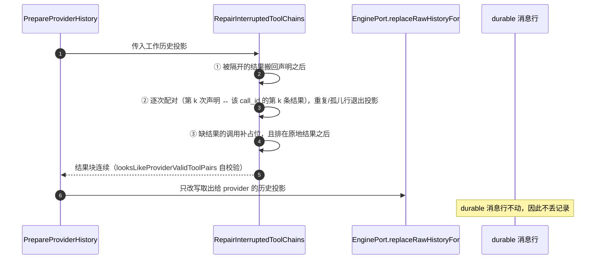

# context_runtime

## 生态位

上下文装配与控制：provider 上下文 token 预算/压缩/result-ref
（`ContextController`）与 provider 历史归一化（`HistoryCoordinator`）。历史
归一化遵守**跨轮前缀不变量**——每条请求都以更早发出的请求字节为前缀，
因此 provider 投影必须等于 wire 已发出的字节：携带工具调用的 assistant
消息正文恒为空、空工具结果不补占位（补写即让该点之后的 prefix cache 失效）。

## 职责与非职责

- 做：`PrepareExecutionContext`、`CompactTaskContext`、超限工具结果拒绝、
  `RemoveTaskContextCheckpoints`、`PrepareProviderHistory`。装配顺序为
  system → 累积 context（达峰前 append-only 全量已定稿轮次）→ plan 尾部；
  达到软阈值时压缩（折叠 compact 栈顶 + context 窗口，发布
  `RecordContextCompactionLocked`），压缩后为有界新鲜窗口。checkpoint 正常
  路径不再注入 LLM 上下文，只保留恢复路径（根包 `history_safety.go` 的
  provider 504 / history-safety 信封）与持久化数据面（`RememberCheckpointLocked`）。
  收缩兜底语义：协议单元不可拆分——单轮装不下预算时不得静默清空历史；
  `TranscriptTailHistory` 降级保留最新完整单元，`fitExecutionHistory` 最终
  兜底不再走 `events=nil` 的空历史分支；真正超出全量预算时由
  `PrepareExecutionContextFor` 返回 `ErrProviderContextBudgetExceeded`。
- **达峰判据的累积起点**：`TaskExecutionState.ContextRetainedFrom` 记录上一次
  折叠覆盖到的 transcript 绝对事件下标。判据量、保留窗口与累积装配都只从该
  起点往后看——被折出的前缀不再回填，否则长会话每次装配都重新累积全量、
  稳定越线，表现为"一发消息压一次"。折出后起点前移到新的保留窗口边界；
  未折叠的回合不动，跨回合由 `continuationTaskExecutionState` 继承。
- **同一把 token 尺子**：尾窗选择走 `TranscriptTailWindowBy` 注入请求装配
  所用的估算器（`Coordinator.transcriptUnitTokens`）。事件自带的 `TokenCount`
  是落盘那一刻的估算值，校准因子变化后与当前估算漂移；按记录值裁窗、按当前
  值判峰会得到"裁完仍越线"的循环。冷读装载仍用记录值口径（只装载、不做
  压缩判据）。
- **落点由配置收口**：折叠目标 = `RetainDecision.Retained`，在
  `min(token1, ratio × all)` 与保护区下限之外再受
  `limits.context_target_percent × 预算` 硬上限约束（`TargetTokens`/
  `TargetApplied` 是同一份决策事实，`Terse()` 与帧正文照实渲染）。保留窗口
  与 soft 之间的差额就是每次折叠留下的余量；两者相等或反超会退化成每回合重压。
- 做：**显式压缩（`/compact`、`compact_context`）两条路径都当场折叠**
  （`CompactContextNow`）：有匹配 request 的执行纪元 → 按该纪元折叠；会话没有
  在飞回合（冷加载、刚清空）→ 向 task 域借一个**会话级维护身份**
  （`BeginSessionContextMaintenanceLocked`）折叠已装载的上下文，折叠结束即撤销
  身份（`EndSessionContextMaintenanceLocked`）。这条路径不伪造回合：不写
  `ChatState.Running`、不设快照 `Chat.RequestID`、不建任务注册表条目；压缩记录与
  帧正文照常落到该会话的上下文状态与可见快照。只有会话真的没有可折叠材料
  （`hasFoldableSessionContext`：transcript 与引擎历史都没有对话消息）时才回到
  登记语义（`ScheduleForceCompact` → 下一条消息装配时先压后发）——折叠空上下文
  只会产出一条区间为空的记录，那是把"没做事"记成"做了事"。
- 做：**工具配对归一化**（`RepairInterruptedToolChains`，随
  `PrepareProviderHistory` 一起跑）。provider 的规则是"每条 `tool` 消息必须
  紧跟携带其 `tool_calls` 的 assistant 消息"，不是"历史里存在配对"——历史里
  出现 `assistant(tool_calls c1) → user → tool(c1)` 时整次请求 400
  （`Messages with role 'tool' must be a response to a preceding message with
  'tool_calls'`）。归一化三件事：① 被隔开的结果搬回声明之后；② 同一 call_id
  的重复结果与无宣告的孤儿从投影里剔除；③ 缺结果的调用补
  `InterruptedToolResultPrefix` 合成占位，且占位排在**该声明的原地结果之后**，
  保证结果块连续。只改写工作历史投影（`EnginePort.replaceRawHistoryFor` →
  `prepareHistory`），durable 消息行不动，因此不丢记录。
- 不做：chat 主循环、provider 失败重试工作流（根包 `history_safety.go`）。

## 关键文件

| 文件 | 职责 |
|---|---|
| `ports.go` | `TaskPort`/`SessionPort`/`PromptPort`/`ViewPort`/`HistoryPort` + `Deps`。 |
| `coordinator.go` | 上下文装配/压缩协调器与纯 helper（警告文本、checkpoint 判定）。 |
| `history.go` | provider 历史归一化（`HistoryCoordinator`）。 |

## 数据流图


## 时序图：工具配对归一化

provider 的规则是「每条 `tool` 消息必须**紧跟**携带其 `tool_calls` 的 assistant 消息」，
而不是「历史里存在配对」。`RepairInterruptedToolChains` 随 `PrepareProviderHistory` 一起跑：



配对按 **call_id 的出现次序**做，不是「首个声明认领该 ID 的全部结果」：同一个 `call_id`
被两次声明（重试/中断后重发复用 ID，现场形状）时，后一条同名结果正是后一次声明的回执——
按「每个 ID 只认首个结果」会把它当重复行丢掉，后一条声明在自己那一行之后的相邻块里就缺回执，
provider 直接 400 `insufficient tool messages following tool_calls message`（2026-09-28 现场：
session loop 0）。同一行里**空 ID**与**行内重复 ID**的调用永远配不上回执（provider 按
`tool_calls` 条数数），从声明里剔除。合成占位只在调用**不可能在飞**时补（ReplaceHistory 路径，
或重复声明），并且被后到的真结果顶掉——否则「重复结果」规则会把真结果当多余行丢弃，模型永远
只看到「调用可能没执行」。框架侧孪生实现（`seelexctx/history_safety.go`）同步改，出口不变量
由 `seelexctx/wire_protocol_safety_test.go:assertProviderToolProtocol` 全量断言。

历史归一化遵守**跨轮前缀不变量**：每条请求都以更早发出的请求字节为前缀，
因此 provider 投影必须等于 wire 已发出的字节——携带工具调用的 assistant
消息正文恒为空，空工具结果不补占位。

## 依赖方向

依赖 `state.Core` + 消费方窄端口；token 预算/transcript 收敛复用
`task_context` 纯函数（`ContextBudgetFor`/`TranscriptTailHistory`）。

## 并发/安全语义

锁内只做内存态变更与 Snapshot 一致发布；锁外收集投影、调用 Engine。
`PrepareExecutionContext` 锁内读 task 权威状态 → 锁外 ReplaceHistory →
锁内记 checkpoint → 锁外 Publish。

**折叠落点的锁纪律（三段式，2026-09-29）**：`prepareExecutionContextFor` 把
「提交状态（A，锁内，微秒级内存操作）→ 推帧与帧正文渲染（B，**锁外**）→ 帧正文进
内容存储 + 写压缩记录 + 翻转视图修订（C，锁内）」分开。理由两条，都在现场发生过：
① 推帧会回调到装配根注入的实现——`CompressedTurnArchiver` 在 ctx 没有会话归属时读
`app.Snapshot()`，而 Snapshot 要 `ViewMu.RLock`；同一 goroutine 持写锁再取读锁，
`sync.RWMutex` 不可重入 = **永久自锁**，`/compact` 返回、快照、提交、切会话一起冻死；
② 推帧在生产路径上不是纯计算（前缀重放厚摘要的**模型调用** + 原文归档 + 压缩栈写盘），
持锁跑它等于把**一个**会话的折叠变成全进程停摆。
跨段传递的只有**值拷贝**（压缩记录、被折区间、帧输入），锁内对象的指针不出锁；
C 段由 `RecordContextCompactionLocked` 按 requestID 自己复核归属（回合已换人 →
`recorded=false`，无主记录不落）。
推帧本身按会话键串行（`Coordinator.compactionPushLock`）：压缩栈是链式结构，
`PushCompact` 的链锚点校验要求一次只推一帧——这条串行原先由 `ViewMu` 顺带提供，
移出锁后必须显式补回；只包推帧，跨会话不互等。
已知边界：推帧仍跑在 `context.Background()` 上（`compaction_index.go`），
因此"停止"不会中断在飞的厚摘要模型调用——但交互面已不再被它扣住。

## 扩展与 Review

新增压缩策略改 `fitExecutionHistory`；替换 token 估算走 `TaskPort` 计数面。
Review 重点：持锁不得调用外部端口、压缩后历史必须保留 system 前缀缓存
友好性、内部标记不得进入可见会话、正常路径不得重新注入 checkpoint（恢复
路径由 `history_safety.go` 单独负责）、累积段字节稳定（已定稿轮次不重排/
不改写，压缩是唯一使前缀失效的事件）、plan/task 尾部不参与压缩、provider
投影不得事后补写（工具轮正文归零、空工具结果保持空，否则跨轮前缀失效）。
达峰判据另有三条边界：① 累积起点必须取 `ContextRetainedFrom`（含跨回合
继承），不得每次从 transcript 头部重算；② 尾窗选择与判据/装配必须同一估算器
（`TranscriptTailWindowBy`），记录值只用于装载；③ 折叠后必须回写新的起点
（普通折叠 = 保留窗口起点，自主压缩 = transcript 末尾），否则下一回合会把
已折出的前缀再算一遍。
无纪元显式压缩（冷加载会话）另有三条：① 不得伪造真实回合纪元——只能用
会话级维护身份，且身份必须成对撤销（异常路径也要撤销，否则会话停在假身份
上）；② 不得在可见面留下"正在执行"信号（`ChatState.Running`/快照
`Chat.RequestID`/任务注册表条目一律不动，状态是 `idle`）；③ 身份发放前必须
重判一次"会话此刻有没有在飞回合"，并发开回合时退回纪元路径或登记，不抢占。
工具配对的两条独立要求不要混：**记录内不得留孤儿/重复**（归一化剔除）与
**结果必须与声明相邻**（归一化重排）——只补不排就是 2026-09-17 的 400。
新增/修改归一化规则时同步 `looksLikeProviderValidToolPairs`（provider 规则的
本地编码），让"修完仍会被拒"在用例里红灯，而不是在线上。
折叠落点新增任何"慢活"（模型调用、写盘、外部端口回调、宿主注入实现）时必须放进
B 段（锁外），不得回填进 A/C；跨段只传值拷贝。推帧新增并发入口时按会话键取锁，
不要用全局锁——链锚点校验要求同会话一次只推一帧，跨会话必须并行。

## 测试

```text
go test ./application/core/context_runtime -count=1
```

根包 `context_controller_test.go`/`history_safety_test.go` 覆盖跨域集成；
前缀不变量与工具叙述归属分别由 `context_prefix_invariant_test.go`、
`context_narration_attribution_test.go` 钉住。

## 文件与函数索引

> 由源码 doc 注释自动提取（首行摘要）；描述源码行为，与实现保持同步。
> 刷新方式：`python scripts/gen_core_readme_index.py`。

### compaction_frame.go

- `func (r compactionFoldedRange) Empty() bool` — Empty 报告这份区间没有任何可记录的边界。
- `func (input compactionFrameInput) metadata() compactionFrameMetadata` — metadata 把渲染输入投影为元数据结构（纯映射，不重算任何数字）。
- `func (input compactionFrameInput) readback() compactionReadback` — readback 组装细筛入口。segment_id 缺失时如实说明为什么没有这一跳——
- `func compactionFrameBody(input compactionFrameInput) string` — compactionFrameBody 渲染折叠帧正文：v2 标记 + JSON 元数据块 + Markdown 读后感块。
- `func marshalFrameMetadata(meta compactionFrameMetadata) string` — marshalFrameMetadata 序列化元数据块。这些结构体不含 channel/func，Marshal 不会
- `func (input compactionFrameInput) readingNotes() string` — readingNotes 渲染帧的 Markdown 一半。

### compaction_frame_test.go

- `func frameMetadataFrom(t *testing.T, body string) compactionFrameMetadata` — frameMetadataFrom 抽出帧正文里那个 fenced json 块并解析。抽不出/解析不了直接
- `func TestCompactionFrameBodyIsJSONMetadataPlusReadingNotes(t *testing.T)` — TestCompactionFrameBodyIsJSONMetadataPlusReadingNotes 钉住规范形状：
- `func TestCompactionFrameBodyMetadataCarriesFoldFacts(t *testing.T)` — TestCompactionFrameBodyMetadataCarriesFoldFacts：元数据块里的每个字段都对得上
- `func TestCompactionFrameBodyOmitsEmptyFoldedRange(t *testing.T)` — TestCompactionFrameBodyOmitsEmptyFoldedRange：没有可记的区间边界时 folded 整个
- `func TestCompactionFrameBodyEmbedsSummaryVerbatim(t *testing.T)` — TestCompactionFrameBodyEmbedsSummaryVerbatim：有栈帧摘要时**原样嵌入**，
- `func TestCompactionFrameBodyAdmitsMissingEvidence(t *testing.T)` — TestCompactionFrameBodyAdmitsMissingEvidence：没有栈帧摘要（开关默认关、重放失败
- `func TestCompactionFrameBodyReadbackSaysWhyNoDrillDown(t *testing.T)` — TestCompactionFrameBodyReadbackSaysWhyNoDrillDown：缺 segment_id 时，正文必须

### compaction_index.go

- `func (c *Coordinator) pushCompactionFrame( sessionID, requestID string, overflow, replay []contract.EngineMessage, window task_context.TranscriptEventRange, ) compactionIndexPush` — pushCompactionFrame 把这次折叠折出保留窗口的区间推进会话压缩栈。
- `func (p compactionIndexPush) gateDetail() string` — gateDetail 渲染门禁 index 关的 Detail：这一步的**事实**（有没有尝试、成没成、
- `func (p compactionIndexPush) sourceLabel() string` — sourceLabel 报告摘要来源；缺省写 (none) 而不是留空——空段会被读成"格式没写对"，
- `func (p compactionIndexPush) indexError() string` — indexError 返回推帧失败的真实原因（空 = 没失败、也没跳过）。帧正文据此如实写出
- `func foldedOverflowEvents(events []model.TranscriptEvent, from, to int) []model.TranscriptEvent` — foldedOverflowEvents 截取被折出保留窗口的 transcript 区间（events[from:to]）。

### compaction_progress.go

- `func CompactionGateTotal() int` — CompactionGateTotal 返回一轮压缩的门禁总数（进度条分母）。
- `func CompactionGateIndex(gate string) int` — CompactionGateIndex 返回门禁在权威顺序里的序号（1 起）；未知 id 返回 0。
- `func (c *Coordinator) startCompactionProgress(sessionID, requestID string, version uint64, origin string) *compactionProgress` — startCompactionProgress 开启一轮门禁进度。没有会话路由键或宿主不支持按会话
- `func (p *compactionProgress) begin()` — begin 发**起手帧**（见 event.CompactionPhaseBegin）：显式压缩在动第一个重活
- `func (p *compactionProgress) gate(id, detail string)` — gate 通告「第 index 关收口」。未知 id 也发（序号 0 会被形状测试抓到），
- `func (p *compactionProgress) GateTimings() []CompactionGateTiming` — GateTimings 返回本轮已收口门禁的实测耗时（副本）。调用点在本轮收口之后
- `func (p *compactionProgress) elapsedLocked() int` — elapsedLocked 返回距上一帧的毫秒数并推进计时基准。调用方持锁。
- `func (p *compactionProgress) setVersion(version uint64)` — setVersion 在自主压缩另开新纪元时校正本轮版本：判定关拿到的版本号可能还是
- `func (p *compactionProgress) skip(reason string)` — skip 记下「本轮折叠了但不落记录」的原因（settle 时拼进 Detail）。没有它，读者
- `func (p *compactionProgress) settle(err error, recorded bool, outcome string)` — settle 收口本轮：err 非空即失败终局（Outcome 带真实原因），否则按是否落了
- `func (p *compactionProgress) publish(payload event.CompactionProgress)`

### compaction_push_lock_test.go

- `func (probe *pushConcurrencyProbe) PushCompactionFrame( _ context.Context, sessionID string, _ CompactionIndexRequest, ) (CompactionIndexReceipt, error)`
- `func (probe *pushConcurrencyProbe) maxConcurrent() int`
- `func pushProbeOverflow() []contract.EngineMessage` — pushProbeOverflow 是一份非空的溢出素材（空溢出走 Skipped 分支，不会问索引面）。
- `func startPush(coordinator *Coordinator, sessionID string) chan struct` — startPush 在后台发起一次推帧，返回完成信号与（推完后的）回执读取。
- `func awaitEntered(t *testing.T, entered <-chan string) string`
- `func awaitPush(t *testing.T, done chan struct{})`
- `func TestCompactionPushSerializesWithinSession(t *testing.T)` — TestCompactionPushSerializesWithinSession：同会话的两条推帧不得重叠。
- `func TestCompactionPushDoesNotSerializeAcrossSessions(t *testing.T)` — TestCompactionPushDoesNotSerializeAcrossSessions：锁必须按会话键取——

### coordinator.go

- `func IsActiveSkillContent(content string) bool` — IsActiveSkillContent 判定内容是否为激活技能 internal 事件（Append-only
- `func (c *Coordinator) compactionPushLock(sessionID string) *sync.Mutex` — compactionPushLock 返回指定会话的推帧串行锁（惰性创建）。
- `func NewCoordinator(deps Deps) *Coordinator` — NewCoordinator 构造 context 域协调器。
- `func (c *Coordinator) ScheduleForceCompact(sessionID string)` — ScheduleForceCompact 登记「该会话下一次装配 provider 上下文时按显式路径压缩」。
- `func (c *Coordinator) consumePendingForceCompact(sessionID string) bool` — consumePendingForceCompact 取走（并清除）登记项：true = 本次装配按显式压缩处理。
- `func (c *Coordinator) Ports() Ports` — Ports 是装配端口图的只读快照（组装校验/诊断用）。
- `func (c *Coordinator) CompactTaskContext(requestID string) error` — CompactTaskContext 把整个可变 transcript 替换为一个私有、有界的 checkpoint
- `func (c *Coordinator) CompactTaskContextFor(sessionID, requestID string) error` — CompactTaskContextFor 把指定会话整个可变 transcript 替换为一个私有、有界
- `func (c *Coordinator) forceCompactTaskContextFor(ctx context.Context, sessionID, requestID string) (compactDecision, error)` — forceCompactTaskContextFor 是显式压缩入口（/compact、compact_context）：
- `func (c *Coordinator) compactTaskContextFor(sessionID, requestID string, options prepareOptions) error`
- `func (c *Coordinator) CompactContextNow(ctx context.Context, sessionID string) (CompactResult, error)` — CompactContextNow 主动压缩指定会话的可变 transcript（`/compact` 命令与
- `func (c *Coordinator) compactSessionContextWithoutEpoch(ctx context.Context, sessionID string) (CompactResult, bool, error)` — compactSessionContextWithoutEpoch 处理"会话没有在飞回合"（冷加载、刚清空）
- `func (c *Coordinator) hasFoldableSessionContext(sessionID string) bool` — hasFoldableSessionContext 判定会话是否装载了**可折叠的对话材料**：transcript
- `func (c *Coordinator) sessionLocationLocked(sessionID string) session_runtime.Location` — sessionLocationLocked 返回指定会话的持久化定位（workspace 绑定优先；
- `func (c *Coordinator) PrepareExecutionContext(requestID, currentInput string) (string, error)` — PrepareExecutionContext 从 durable task 状态与完整 transcript 单元重建
- `func (c *Coordinator) PrepareExecutionContextFor(sessionID, requestID, currentInput string) (string, error)` — PrepareExecutionContextFor 从 durable task 状态与完整 transcript 单元重建
- `func compactionOrigin(options prepareOptions, state *task_context.TaskExecutionState) string` — compactionOrigin 判定一轮折叠的来源：自动路径（软/硬阈值、自主压缩）记 auto，
- `func (c *Coordinator) prepareExecutionContextFor(sessionID, requestID, currentInput string, options prepareOptions) (out string, err error)`
- `func (c *Coordinator) fitExecutionHistory( systemPrompt string, systems []contract.EngineMessage, planMessage string, events []model.TranscriptEvent, currentInput string, tools []model.Tool, target int, windowed bool, maxUnits int, ) ([]contract.EngineMessage, int, int)` — fitExecutionHistory 按目标预算装配 provider 历史：稳定前缀（system）→
- `func (c *Coordinator) tryFitExecutionHistory( systemPrompt string, systems []contract.EngineMessage, planMessage string, events []model.TranscriptEvent, currentInput string, tools []model.Tool, target int, maxUnits int, ) ([]contract.EngineMessage, int, int)` — tryFitExecutionHistory 装配一次 system → context → plan 历史并估算 token，
- `func (c *Coordinator) transcriptUnitTokens(unit []model.TranscriptEvent) int` — transcriptUnitTokens 按请求装配同款估算器给一个协议单元计价。保留窗口
- `func (c *Coordinator) compressExecutionHistory( systemPrompt string, systems []contract.EngineMessage, summary string, planMessage string, currentInput string, tools []model.Tool, budget task_context.ContextBudget, ) ([]contract.EngineMessage, int, bool)` — compressExecutionHistory 是自主压缩兜底：正常有界窗口装不下全量预算时，
- `func AutonomousCompactionMessage(summary string) string` — AutonomousCompactionMessage 渲染自主压缩帧正文（system 消息）：显式告知
- `func retainedMatchesTranscriptPrefix(systems []contract.EngineMessage, events []model.TranscriptEvent) bool` — retainedMatchesTranscriptPrefix 判定引擎保留段（非 system 的已定稿轮次）
- `func (c *Coordinator) planContextMessageLocked(sessionID string) string`
- `func currentPlanSlice(arguments, currentNode string) any`
- `func excludeCurrentInputEvent(events []model.TranscriptEvent, requestID, currentInput string) []model.TranscriptEvent`
- `func (c *Coordinator) protectOversizedCurrentInputLocked(sessionID, requestID, currentInput string, budget task_context.ContextBudget) string` — protectOversizedCurrentInputLocked 把超**单条**预算的当前输入归档为引用：
- `func ContentReferenceWarning(resultRef string) string` — ContentReferenceWarning 是超限用户输入归档引用警告文本。
- `func (c *Coordinator) rejectOversizedToolResults(sessionID string, maxChars int) (bool, error)` — rejectOversizedToolResults 把超限输出替换为显式重试指令（不给头部/尾部
- `func RejectToolResults(history []contract.EngineMessage, maxChars int) ([]contract.EngineMessage, bool)` — RejectToolResults 替换超限工具结果为显式引用警告（纯函数面）。
- `func rejectToolResultsWithRefs(history []contract.EngineMessage, maxChars int, refs map[string]string) ([]contract.EngineMessage, bool)`
- `func IsOversizedToolResult(content string, maxChars int) bool` — IsOversizedToolResult 判定工具结果是否超限（或带框架截断标记）。
- `func OversizedToolResultWarning(name, resultRef string) string` — OversizedToolResultWarning 是超限工具结果归档警告文本。
- `func ProviderSafeToolResult(name, result string, toolErr error) string` — ProviderSafeToolResult 把超限工具结果替换为警告（provider 路径）。
- `func EstimateEngineHistoryTokens(history []contract.EngineMessage) int` — EstimateEngineHistoryTokens 估算引擎历史 token 数（纯函数面）。
- `func TaskContextRecoveryHistory(history []contract.EngineMessage, checkpoint string) []contract.EngineMessage` — TaskContextRecoveryHistory 保留 system 指令并把可变协议记录替换为 checkpoint。
- `func RetainedSystemHistory(history []contract.EngineMessage) []contract.EngineMessage` — RetainedSystemHistory 保留稳定前缀 + 已定稿轮次的 append-only 累积段：
- `func RetainedSystemOnly(history []contract.EngineMessage) []contract.EngineMessage` — RetainedSystemOnly 保留一条产品指令（框架侧摘要也是 system 消息，全保留
- `func isDynamicTailMessage(message contract.EngineMessage) bool` — isDynamicTailMessage 判定消息是否为动态尾部/控制消息（plan 上下文、
- `func retainedContextEventCount(retained []contract.EngineMessage) int` — retainedContextEventCount 返回保留段中已定稿轮次的 message 数（与
- `func (c *Coordinator) RemoveTaskContextCheckpoints() error` — RemoveTaskContextCheckpoints 阻止 Application 控制消息被持久化/重建为
- `func (c *Coordinator) RemoveTaskContextCheckpointsFor(sessionID string) error` — RemoveTaskContextCheckpointsFor 阻止 Application 控制消息被持久化/重建为
- `func IsTaskContextCheckpoint(content string) bool` — IsTaskContextCheckpoint 判定内容是否为上下文 checkpoint 标记。
- `func (c *Coordinator) RecordContextControlFailure(requestID string, err error)` — RecordContextControlFailure 把 hook 失败转移给 runChat（委托 task 域）。
- `func (c *Coordinator) TakeContextControlFailure(requestID string) error` — TakeContextControlFailure 取走当前请求的 context 控制失败（委托 task 域）。
- `func (c *Coordinator) engineHistory(sessionID string) []contract.EngineMessage` — engineHistory 返回指定会话引擎历史（会话路由引擎用 HistoryFor，否则活跃
- `func (c *Coordinator) setEngineSystemPrompt(sessionID, prompt string)` — setEngineSystemPrompt 设置指定会话引擎 system prompt（会话路由引擎用
- `func (c *Coordinator) replaceEngineHistory(sessionID string, history []contract.EngineMessage) error` — replaceEngineHistory 会话内替换指定会话引擎历史（会话路由引擎用
- `func (c *Coordinator) clearEngineHistory(sessionID string)` — clearEngineHistory 清空指定会话引擎历史（会话路由引擎用 ClearHistoryFor，
- `func (c *Coordinator) appendEngineHistory(sessionID string, msg types.Message)` — appendEngineHistory 追加消息到指定会话引擎历史（会话路由引擎用

### fold_history.go

- `func (c *Coordinator) foldHistory(sessionID string) []contract.EngineMessage` — foldHistory 读指定会话的引擎历史（会话路由端口优先）。
- `func (c *Coordinator) replaceFoldHistory(sessionID string, history []contract.EngineMessage) error` — replaceFoldHistory 写指定会话的引擎历史：替换经会话路由端口下发，落点由引擎
- `func (c *Coordinator) setFoldSystemPrompt(sessionID, prompt string)` — setFoldSystemPrompt 把本会话 system prompt 推进引擎历史。它不改写进程级 prompt
- `func (h *HistoryCoordinator) foldHistory(sessionID string) []contract.EngineMessage` — foldHistory / replaceFoldHistory 是 HistoryCoordinator 的同款入口（provider 历史
- `func (h *HistoryCoordinator) replaceFoldHistory(sessionID string, history []contract.EngineMessage) error`
- `func (c *Coordinator) withInFlightTail(existing, assembled []contract.EngineMessage) []contract.EngineMessage` — withInFlightTail 把「正在飞的那一截」接回折叠产物尾部。
- `func inFlightTail(history []contract.EngineMessage) []contract.EngineMessage` — inFlightTail 返回历史末尾那段「assistant 带 tool_calls、其中至少一个 call 还没有
- `func sameToolCalls(left, right []contract.EngineToolCall) bool`

### history.go

- `func interruptedToolResultContent(name string) string` — interruptedToolResultContent 生成缺失 tool 结果的协议占位正文：明示该
- `func NewHistoryCoordinator(core *state.Core) *HistoryCoordinator` — NewHistoryCoordinator 构造 history 域协调器。
- `func (h *HistoryCoordinator) PrepareProviderHistory() error` — PrepareProviderHistory 使每条持久化消息对拒绝空 content 的 provider 安全
- `func (h *HistoryCoordinator) PrepareProviderHistoryFor(sessionID string) error` — PrepareProviderHistoryFor 使每条持久化消息对拒绝空 content 的 provider
- `func (h *HistoryCoordinator) PrepareNewHistoryContentFor(sessionID string) error` — PrepareNewHistoryContentFor 仅修复引擎历史中新 append 的空正文消息
- `func (h *HistoryCoordinator) replaceEngineHistory(sessionID string, history []contract.EngineMessage) error` — replaceEngineHistory 会话内替换指定会话引擎历史（会话路由引擎用
- `func (h *HistoryCoordinator) engineHistory(sessionID string) []contract.EngineMessage` — engineHistory 返回指定会话引擎历史（会话路由引擎用 HistoryFor，否则活跃
- `func (p toolCallPairing) emitInPlace(index int) bool` — emitInPlace 报告某 tool 行能否原样输出：它是所服务声明的结果，且位置已经落在
- `func (p toolCallPairing) declarationHasInPlaceResult(index int) bool` — declarationHasInPlaceResult 报告声明行 index 的结果里是否存在"原地输出"的那
- `func isInterruptedToolResult(message contract.EngineMessage) bool` — isInterruptedToolResult 报告一行 tool 结果是否为合成占位（不是真实工具输出）。
- `func indexToolCallPairing(history []contract.EngineMessage) toolCallPairing`
- `func RepairInterruptedToolChains(history []contract.EngineMessage) ([]contract.EngineMessage, bool)` — RepairInterruptedToolChains 修复历史里的工具链，使它在 provider 的 tool 配对
- `func RepairEmptyHistoryContent(history []contract.EngineMessage) ([]contract.EngineMessage, bool)` — RepairEmptyHistoryContent 使历史对拒绝空 content 的 provider 安全
- `func IsProviderOnlyHistoryContent(content string) bool` — IsProviderOnlyHistoryContent 识别仅用于满足 provider 非空 content 要求的

### history_pairing_gap_test.go

- `func TestRepairInterruptedToolChainsPairsRepeatedDeclarationOccurrence(t *testing.T)` — TestRepairInterruptedToolChainsPairsRepeatedDeclarationOccurrence：同一 call_id
- `func TestRepairInterruptedToolChainsKeepsRepeatedResultWithRepeatedDeclaration(t *testing.T)` — TestRepairInterruptedToolChainsKeepsRepeatedResultWithRepeatedDeclaration：反过来
- `func TestRepairInterruptedToolChainsDropsEmptyCallIDDeclaration(t *testing.T)` — TestRepairInterruptedToolChainsDropsEmptyCallIDDeclaration：声明里的空 ID 调用

### history_recovery_test.go

- `func interruptedChainHistory(withSuffixText, atTail bool) []contract.EngineMessage` — interruptedChainHistory 构造残缺工具链 provider 历史（同三处探针语义）：
- `func TestRepairInterruptedToolChainsFillsMissingResultBeforeSuffixText(t *testing.T)` — TestRepairInterruptedToolChainsFillsMissingResultBeforeSuffixText：
- `func TestRepairInterruptedToolChainsFillsAllMissingAtTail(t *testing.T)` — TestRepairInterruptedToolChainsFillsAllMissingAtTail：会话尾以残缺链收尾
- `func TestRepairInterruptedToolChainsSkipsCompleteChainsAndIsIdempotent(t *testing.T)` — TestRepairInterruptedToolChainsSkipsCompleteChainsAndIsIdempotent：
- `func TestRepairInterruptedToolChainsReordersResultBackToDeclaration(t *testing.T)` — TestRepairInterruptedToolChainsReordersResultBackToDeclaration：缺失 ID 的
- `func TestRepairInterruptedToolChainsDropsOrphanResult(t *testing.T)` — TestRepairInterruptedToolChainsDropsOrphanResult：没有任何 assistant 宣告该
- `func TestRepairInterruptedToolChainsDropsDuplicateResult(t *testing.T)` — TestRepairInterruptedToolChainsDropsDuplicateResult：同一 call_id 的第二个结果
- `func looksLikeProviderValidToolPairs(history []contract.EngineMessage) bool` — looksLikeProviderValidToolPairs 是 provider 工具配对规则的本地校验器：

### history_test.go

- `func TestRepairEmptyHistoryContentKeepsToolCallAssistantContentEmpty(t *testing.T)`
- `func TestRetainedSystemHistoryKeepsStablePrefixAndSettledContext(t *testing.T)`
- `func TestAutonomousCompactionMessageIsBoundedAndDynamicTail(t *testing.T)` — TestAutonomousCompactionMessageIsBoundedAndDynamicTail：自主压缩帧带协议
- `func TestCompactionFrameNeverReentersFoldInput(t *testing.T)` — TestCompactionFrameNeverReentersFoldInput：帧是**终态**——一次折叠产生的帧绝不
- `func retainedContents(history []contract.EngineMessage) []string`
- `func TestRetainedSystemHistoryKeepsActiveSkillEvent(t *testing.T)` — TestRetainedSystemHistoryKeepsActiveSkillEvent：激活技能事件是 append-only

### layout.go

- `func (l ContextLayout) zone(kind string) ContextZone` — zone 返回指定 kind 的分区（缺失 → 只带 kind 的零值）。
- `func (r RetainDecision) Terse() string` — Terse 渲染保留窗口决策的一行事实（门禁 Detail 用：短、无文案）。
- `func (l ContextLayout) RetainTerse() string` — RetainTerse 渲染保留窗口决策的一行事实。
- `func (l ContextLayout) ZonesTerse() string` — ZonesTerse 渲染四区 token 数的一行事实（门禁 Detail 用）。
- `func (c *Coordinator) buildContextLayout( systemPrompt string, assembled []contract.EngineMessage, currentInput string, ) ContextLayout` — buildContextLayout 把装配后的 provider 历史切进四区并汇总判据量：分区判据见
- `func (c *Coordinator) countRequestTokens( systemPrompt string, history []contract.EngineMessage, currentInput string, tools []model.Tool, ) int` — countRequestTokens 适配 TaskPort.CountRequestTokens 到四区切分的计数签名。
- `func ContextZones( systemPrompt string, assembled []contract.EngineMessage, currentInput string, count zoneCounter, ) []ContextZone` — ContextZones 把装配后的 provider 历史切进四区并给出各区 token 数、条数与来源。
- `func retainWindowDecision( config seelexctx.WindowConfig, allContextTokens int, budget task_context.ContextBudget, floorPercent int, ) RetainDecision` — retainWindowDecision 计算保留窗口（③ 的边界）并留下决策事实：

### layout_test.go

- `func layoutTestCounter(systemPrompt string, history []contract.EngineMessage, currentInput string, _ []model.Tool) int` — layoutTestCounter 是四区切分的确定性计数：system 段 3、每条历史 10、当轮输入
- `func TestContextZonesClassifiesFourZones(t *testing.T)` — TestContextZonesClassifiesFourZones：四区显式化的分区判据全部是消息自身的
- `func TestRetainWindowDecisionRecordsFacts(t *testing.T)` — TestRetainWindowDecisionRecordsFacts：保留窗口决策把"拿什么数字比的"全部记下
- `func TestContextLayoutTerseAndZonesRender(t *testing.T)` — TestContextLayoutTerseAndZonesRender：门禁 Detail 与帧正文读同一份 layout——
- `func TestCompactionFrameBodyCarriesZoneLayout(t *testing.T)` — TestCompactionFrameBodyCarriesZoneLayout：帧正文必须带上四区事实——否则记录里

