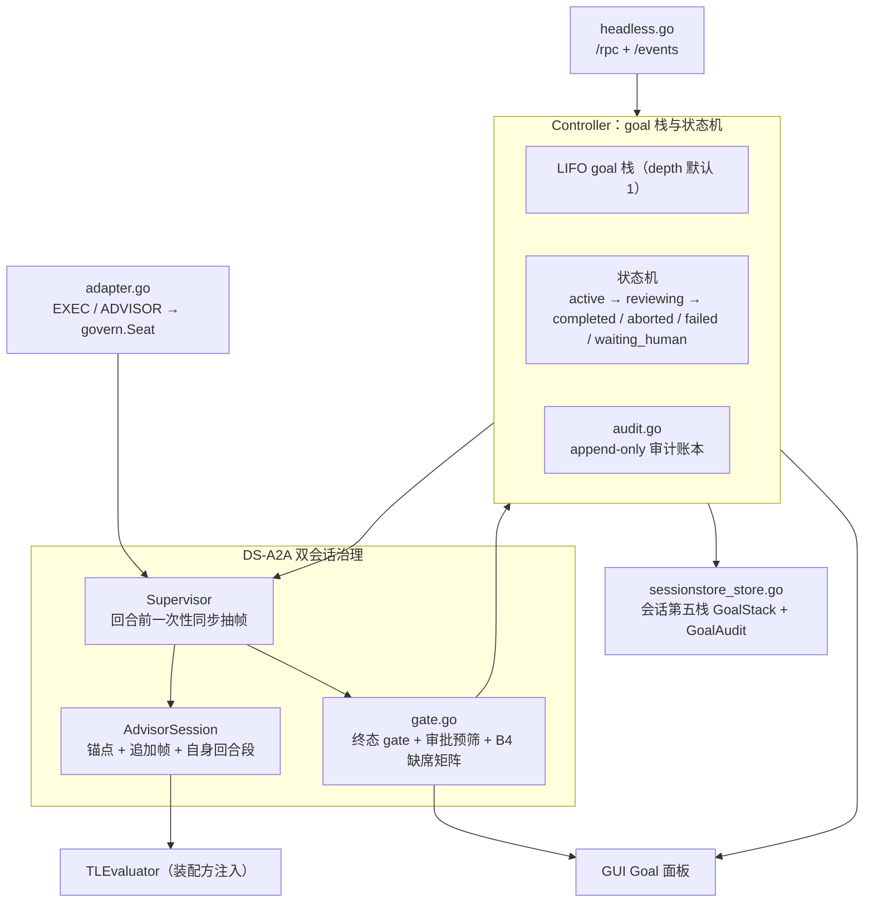
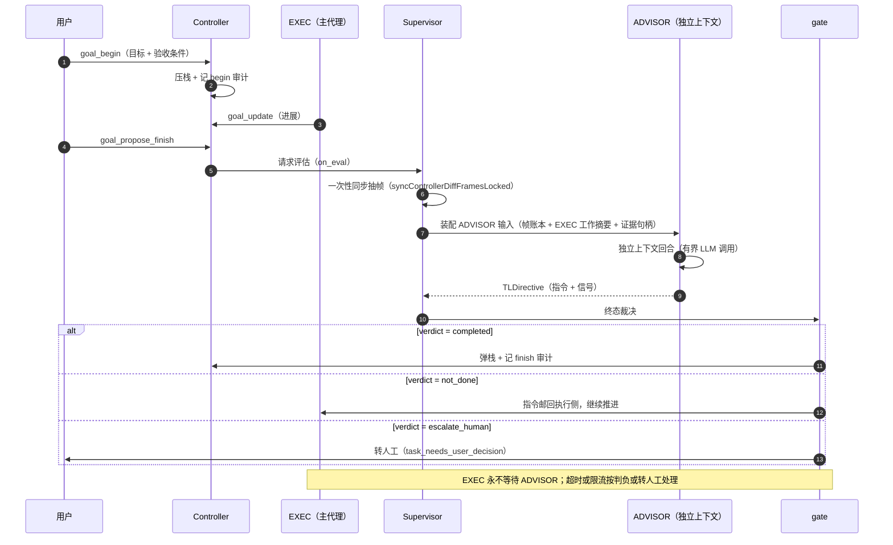
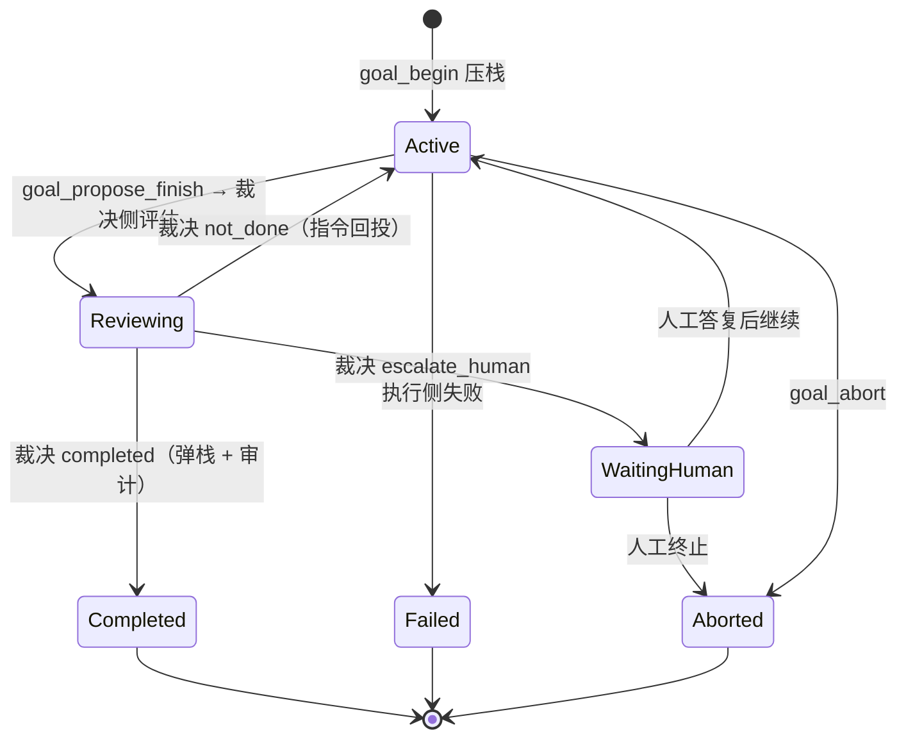

# goal — Goal 域（DS-A2A 双会话治理 + 治理循环适配）

> 角色/团队泛化边界见
> [`docs/arch/a2a-agent-team-factory.md`](../../../docs/arch/a2a-agent-team-factory.md)：
> goal 的 TL/ADVISOR 是 AgentTeam 工厂的第一个实例；subagent 是 tool calling
> 能力，不属于 AgentTeam。
>
> 接线现状：`GoalBeginFor` 在 goal 落栈成功后自动装配 `goal-a2a` 团队
> （`ensureGoalAgentTeam` → `MaterializeAgentTeamPreset`），因此 **goal 上线
> 即拉起 TL 团队**，不再需要前端手动点一次「装配团队」。装配幂等；宿主未
> 装配团队存储时只记日志、不阻塞 goal 治理（supervisor + TL 评估器那条链与
> 团队存储无关）。

## 生态位

会话粒度的 Goal 对象与状态机（`Controller`）、DS-A2A 双会话治理编排
（`Supervisor`/`AdvisorSession`/gate）、治理循环适配（`adapter.go`）以及
会话级第五栈持久化（`sessionstore_store.go`，goal 栈随会话聊天记录同域落
`sessionstore.SessionContextRecord.GoalStack`）。主要调用方：goal 域
headless 契约（`headless.go`）作为外部驱动面；
`application/core/govern` 提供通用治理循环抽象，goal 域经 `adapter.go`
把 EXEC/TL 语义适配为治理座位。

## 职责与非职责

职责：

- Goal 栈/状态机（active→reviewing→completed/aborted/failed/waiting_human）、
  存储与事件订阅（`controller.go`/`record.go`/`store.go`/`stack.go`）；
- goal 栈持久化与恢复：`sessionstore_store.go` 把 Controller 栈投影到
  sessionstore 第五栈（`ContextStateStore`），`Controller.Reload` 从会话
  GoalStack 重建（崩溃/重启恢复，治理可续）；
- goal 生命周期审计：`audit.go` 定义 `AuditAccount`/`AuditEntry`，Controller
  每次状态机变更成功追加一条 append-only 审计（begin/update/finish/abort/
  restore；可携带 SourceSession 出处，记录"用户在其它会话完成了该 goal"），
  账本按会话隔离、只追加不回改（审计与活栈正交：栈终态为空，账本保留收口）；
- DS-A2A 双会话治理：EXEC 事件账本（execSeq）、ADVISOR 独立上下文
  （锚点 + 帧账本 + 自身回合段，只尾部追加）、corr 信封指令、B4 缺席矩阵
  （`advisor.go`/`techleader.go`/`gate.go`）；
- 治理循环适配：`govern.Seat` 封装（advisor 座位）、EXEC+ADVISOR 双座位
  治理循环工厂（`adapter.go`）；
- headless 调教接口（`/rpc` + `/events`，`headless.go`）。

非职责：

- 不持有 seelebridge/application 装配（P1 起由 application 的会话级
  goal 协调器持有 Controller/Supervisor，见 `application/core/goal_coordinator.go`；
  真实 TLEvaluator 与 gui/headless 透传为待续项）；
- 不定义通用治理循环原语（那是 `application/core/govern`）；
- 不接触 LLM provider/账号（`TLEvaluator` 由装配方注入，本包不持有凭据）。

## 架构图



## 时序图：一轮目标治理



## 目标生命周期



## 核心实现

- `Controller`：goal 栈（LIFO，depth 默认 1）+ 状态机 + 事件订阅；
- `Supervisor`：DS-A2A 编排者（goal 域内的 PeerSessionManager 切片），
  回合前 on_eval 一次性同步抽帧（`syncControllerDiffFramesLocked`）；
- `AdvisorSession`：b 独立上下文 = 锚点(goal.start) + 追加帧(ref_seq 单调)
  + 自身回合段（≤ MaxEmbedRounds），前缀稳定只尾部追加；
- `gate.go`：终态 gate（verdict done/not_done/escalate）+ 审批预筛 + B4 缺席
  矩阵（429/超时 → 判负或人工，a 永不等待 b）；
- `sessionstore_store.go`：goal 域记录 ↔ `sessionstore.GoalFrame` 的映射，
  Store.Save 全量替换会话 GoalStack、Store.Load 读回（第五栈只服务恢复与
  治理，不渲染进模型上下文）；
- `audit.go`：审计端口与有界条目（`AuditAccount`/`AuditEntry`），
  `ContextStateStore.AppendGoalAudit` 映射为 sessionstore GoalAuditEntry；
- `adapter.go`：把上面语义翻译为 `govern` 治理循环的座位动作。

## 数据流或生命周期

```text
EXEC(a) 事件（turn/checkpoint/compacted/approval/terminal）
   │ Supervisor.Notify（execSeq 登记 → 触发策略）
   ▼
AdvisorSession(b) 回合：on_eval 补帧 → 一次 LLM 调用 → TLDirective(corr)
   │
   ├─ verdict_done → Controller.Finish → peer.unbind(done) + reap
   ├─ verdict_not_done → goal 保持 active，指令待 a 领取
   └─ 429/超时 → B4 缺席矩阵（escalate / 直连回退），a 不阻塞
```

治理循环（govern 适配）：

```text
exec-a.Act（推进/登记） → advisor-b.Act（真实 TL 回合）
   └─ 循环直到 verdict_done/escalate 断环或轮次护栏
```

## 依赖方向

- goal 包保持叶子生态位：只依赖 `application/core/govern` 与低层持久化
  `sessionstore`（GoalFrame 纯 DTO），不依赖 application/core 其它子包与
  seelebridge；
- `adapter.go` 依赖 `application/core/govern`（goal → govern 单向）；
- `sessionstore_store.go` 依赖 `sessionstore`（goal → sessionstore 单向，
  sessionstore 不反向依赖 goal）；
- seelebridge 未来可依赖 goal（装配面），方向不反转。

## 并发、存储、安全或错误语义

- Controller.mu / Supervisor.mu：锁序 Supervisor.mu → Controller.mu；
  Controller 永不回调 Supervisor（无反向死锁）；
- **b 回合是三段式**（2026-09-29 锁面审计 §4.1 整改）：准入（`beginRoundLocked`，
  s.mu 内，只做判定 + 补帧 + 渲染 b 输入）→ 执行（`evaluateRound`，**不持 s.mu**：
  模型调用与角色回合都在这一段）→ 提交（`commitRoundLocked`，s.mu 内，复核 goal +
  落 b 回合段 + 发 corr 信封）；记录器在提交之后、锁外调用（`recordRound`）。
  于是"持 s.mu 等 roundGate"的一方不存在，s.mu ↔ roundGate 的环在结构上不成立，
  同 goroutine 上"回合内回头找 Supervisor"的回调也不再自锁死。副作用是进行中正文
  （`TLState.InFlight`）在 peer=evaluating 期间真的读得到——旧实现把快照挡在整轮之后；
- 回合闸门**不可重入且不排队**（`roundInFlight` 租约）：已有回合在飞时，第二个入口
  拿到 `ErrRoundInFlight`。各调用点按自己的语义处理：`Notify` = 登记照旧、本轮不评；
  终态 gate / 审批预筛 = B4 缺席默认（保持 active 转人工，a 永不等待 b）；治理座位 =
  良性跳过本轮发言（不写 roundError、不断环）；
- 提交段复核顶栈 goal（执行段在锁外，这一期间 goal 可能被改或被收口）：
  **收口/取消** → 丢弃这一回合的结论（`ErrRoundGoalGone`，不发信封、不落回合段）；
  **同一个 goal 被改** → 结论照常落地，并补一条 `goal.update` 差异帧
  （`goalStampOf` 指纹判定；不用秒级 `UpdatedAt` 单判，否则同一秒内的两次更新判不出）；
- b 上下文只尾部追加（前缀稳定），帧 ref_seq 单调、dup 幂等；
- 指令/帧/嵌入全有界（MaxDirectiveQueue/MaxDirectiveRunes/…）；
- 错误语义：TL 缺席（ErrTLDisabled/429/超时）走 B4 矩阵，不吞不挂。

goal 第五栈语义边界（docs/2026-09-08-govern-loop/design.md §2.1 澄清）：

- goal 栈随会话聊天记录同域持久化到 sessionstore，只用于会话恢复与后续
  goal 治理（对齐 plan/task 的会话级使用栈）；
- GoalStack 是**活栈投影**：begin 压栈即写入，finish/abort 弹栈即同步删除
  该帧；存储初始与终态都为空（治理结束不留任何 goal 帧，终态审计只在进程内
  History，不落栈）；
- 审计账本（GoalAudit）与活栈正交：终态帧不进 GoalStack，但**审计保留收口
  记录**（append-only、按会话隔离、只追加不回改）；"在其它会话完成该 goal"
  的收口可带 SourceSession 出处写回原会话账本，不跨会话共享/回放；
- 栈内 goal **不入模型上下文**：seelexctx 只渲染 Plan/Task/Skill/Compact
  四栈，goal 栈不做前缀/尾部块渲染，也不做记忆前缀与匹配；
- 聊天记录中的 `#goal` 文本是普通转录内容，随上下文窗口/压缩一起被压缩；
- 收口弹栈（finish/abort）后栈投影同步落盘（弹栈即删除），栈空 = 治理收口
  前提。

## 扩展方式

- 新增 goal 命令：headless.go dispatch 补一行（命令本身走 Controller）；
- 新增治理角色：实现 `govern.Seat` 后加入 `NewTurnGovernorForDSA2A`；
- 新增 DirectiveKind 断环规则：改 `DirectiveBreaksLoop`。

## Review 指南

- b 回合是否携带锚点 goal 帧（防遗忘）；帧 ref_seq 是否单调/幂等；
- 是否出现"a 等待 b"路径（违反 B4）；
- 治理适配是否把裁决语义正确映射为断环（not_done 不该断、escalate 应断）；
- 事件/投影是否深拷贝（锁外安全）。

## 测试与验证

```text
go test ./application/core/goal/... -count=1
go test -race ./application/core/goal/ -count=1
真实 API 隔离冒烟：$env:SEELEX_LIVE_SMOKE=1; go test ./_tmp/goal-tl-live-smoke -v
（`_tmp/` 是本地 scratch 归档（2026-09-17 由 `tmp/` 改名）：Go 工具链的
`./...` 通配会跳过 `_` 前缀目录，避免 scratch 包污染仓库门禁；显式路径仍可
直接 `go test`。）
```

## 文件与函数索引

> 由源码 doc 注释自动提取（首行摘要）；描述源码行为，与实现保持同步。
> 刷新方式：`python scripts/gen_core_readme_index.py`。

### a2a.go

- `func IsCriticalSignal(kind SignalKind) bool` — IsCriticalSignal 报告该信号是否强制评估（不受 eval_window 间隔约束）。
- `func (s TLEvalSignal) Validate() error` — Validate 校验信号字段。
- `func (d TLDirective) Validate() error` — Validate 校验指令字段（目标 id 可为空，由 Supervisor 补当前 active goal id）。
- `func (d TLDirective) Summary() string` — Summary 返回有界摘要（写入 goal 指令环形记录的形态，design §3.2 TLDirective 摘要）。
- `func goalFrameOf(record *GoalRecord) GoalFrame`
- `func (e TLSessionEmbed) Validate() error` — Validate 校验回合嵌入（有界性快检；供测试与装配护栏使用）。
- `func TLNow() func() int64` — TLNow 提供 TL 域时间源（测试可注入）。

### adapter.go

- `func DirectiveBreaksLoop(directive TLDirective) bool` — DirectiveBreaksLoop 报告一条 TLDirective 是否应打破治理循环。
- `func NewAdvisorSeat(supervisor *Supervisor, name string) govern.Seat` — NewAdvisorSeat 构造 Advisor 座位。supervisor 为 nil 或未启用时，Act
- `func (s *advisorSeat) Name() string`
- `func (s *advisorSeat) Kind() govern.AgentKind`
- `func (s *advisorSeat) Act(ctx context.Context) (govern.TurnAction, error)`
- `func NewTurnGovernorForDSA2A( execName string, execAct func(context.Context) (govern.TurnAction, error), supervisor *Supervisor, maxRounds int, ) govern.Governor` — NewTurnGovernorForDSA2A 装配"EXEC + ADVISOR"两座位的治理循环：
- `func (f funcSeat) Name() string`
- `func (f funcSeat) Kind() govern.AgentKind`
- `func (f funcSeat) Act(ctx context.Context) (govern.TurnAction, error)`

### adapter_test.go

- `func TestGovernorDrivesAdvisorRound(t *testing.T)` — TestGovernorDrivesAdvisorRound 验证治理循环能驱动真实 TL 回合：
- `func TestGovernorBreaksOnVerdictDone(t *testing.T)` — TestGovernorBreaksOnVerdictDone 验证完整收口闭环：
- `func TestAdvisorSeatDisabledReportsTLDisabled(t *testing.T)` — TestAdvisorSeatDisabledReportsTLDisabled 验证无评估器（TL 缺席）时
- `func TestAdvisorSeatVerdictDoneClosesGoal(t *testing.T)` — TestAdvisorSeatVerdictDoneClosesGoal 验证**常规治理回合**的终态裁决同样收口
- `func TestAdvisorSeatNonTerminalKeepsGoal(t *testing.T)` — TestAdvisorSeatNonTerminalKeepsGoal 钉住反向：非终态裁决（verdict_not_done）

### advisor.go

- `func (f Frame) Validate() error` — Validate 校验帧字段（有界：detail ≤ MaxSignalDetailRunes）。
- `func (b *AdvisorSession) nextCorr() string` — nextCorr 生成下一条 b→a 产物的关联 id（corr-<n>）。
- `func (b *AdvisorSession) appendFrame(frame Frame) (bool, error)` — appendFrame 追加一帧（幂等：ref_seq ≤ 已应用水位 → dup=true 不追加；单调性检查）。
- `func (b *AdvisorSession) appendRound(round Round)` — appendRound 追加一条 b 自身回合段（只尾部追加；cap MaxDirectives 保护展示记忆）。
- `func (b *AdvisorSession) RoundMemories(limit int) []string` — RoundMemories 返回最近自身回合摘要（TLMemory 素材：TL 记得自己说过什么，但不写 a 的 goal 状态）。
- `func (b *AdvisorSession) renderEmbed(trigger string) (TLSessionEmbed, string)` — renderEmbed 构建一次 b 回合的有界输入：锚点 + 追加帧 + 自身回合记忆（全部来自 b 上下文，
- `func estimateTokens(text string) int64` — estimateTokens 是 token 估算（runes/4；仅用于原型缓存观测，真实 provider 用量由装配层上报）。
- `func (e TLSessionEmbed) RenderText() string` — RenderText 把一次 b 回合输入渲染为文本（P_b 角色说明 + 锚点 + 帧账本 + 自身回合段）。
- `func goalFrameText(frame GoalFrame) string` — goalFrameText 渲染锚点目标（复刻 Goal 帧关键信息，有界）。
- `func (b *AdvisorSession) markBound(peerID string, anchor GoalFrame, refSeq uint64, now int64)` — markEvaluating / markAdvisory / markBound 是状态机辅助（调用方持锁）。

### audit.go

- `func (e AuditEntry) normalized() AuditEntry` — normalized 返回文本字段有界的副本。
- `func truncateAuditText(value string) string`
- `func (s *ContextStateStore) AppendGoalAudit(ctx context.Context, entry AuditEntry) error` — AppendGoalAudit 实现 AuditAccount：映射为 sessionstore GoalAuditEntry 后

### audit_test.go

- `func TestControllerAuditAppendOnlyLifecycle(t *testing.T)` — TestControllerAuditAppendOnlyLifecycle 验证 Controller 自动审计：
- `func TestControllerAuditNestedRestoreAndTerminal(t *testing.T)` — TestControllerAuditNestedRestoreAndTerminal 验证嵌套治理审计：子 finish
- `func TestAuditSourceSessionProvenanceRoundTrip(t *testing.T)` — TestAuditSourceSessionProvenanceRoundTrip 验证"用户在其它会话完成 goal"
- `func TestAuditPerSessionIsolation(t *testing.T)` — TestAuditPerSessionIsolation 验证审计按会话隔离：两会话各自审计独立

### controller.go

- `func viewOf(record *GoalRecord) *View`
- `func projectionOf(records []*GoalRecord) Projection`
- `func NewController(options Options) *Controller` — NewController 构造控制器（Depth 默认 1；Now 默认 time.Now().Unix）。
- `func (c *Controller) Begin(ctx context.Context, request BeginRequest) (*GoalRecord, error)` — Begin 注册并压栈一个 goal（design §3.4 goal_begin）。
- `func (c *Controller) Update(ctx context.Context, request UpdateRequest) (*GoalRecord, error)` — Update 更新栈顶 active goal（design §3.4 goal_update）。
- `func (c *Controller) Finish(ctx context.Context, request FinishRequest) (*GoalRecord, error)` — Finish 把栈顶 goal 标记 completed 并弹栈（design §3.4 goal_finish；
- `func (c *Controller) Abort(ctx context.Context, request FinishRequest) (*GoalRecord, error)` — Abort 把栈顶 goal 标记 aborted 并弹栈。
- `func (c *Controller) finishOrAbort(ctx context.Context, request FinishRequest, terminal Status, kind EventKind) (*GoalRecord, error)`
- `func (c *Controller) Status() StatusView` — Status 返回全量视图（深拷贝，锁外安全）。
- `func (c *Controller) Projection() Projection` — Projection 返回前端投影（深拷贝视图）。
- `func (c *Controller) projectionLocked() Projection`
- `func (c *Controller) History() []*GoalRecord` — History 返回已收口（finish/abort）goal 的审计副本（栈底→收口序）。
- `func (c *Controller) Frame() string` — Frame 渲染栈顶 goal 的 Goal 帧文本（design §3.5；Part II TechLeader 每轮
- `func (c *Controller) Subscribe(buffer int) *Subscription` — Subscribe 订阅事件流（buffer ≤ 0 时用 64）。Close 幂等。
- `func (s *Subscription) EventsChannel() <-chan Event` — Events 是订阅通道（等价 Subscription.Events，便利字段）。
- `func (s *Subscription) Close()` — Close 移除订阅并关闭通道（幂等）。
- `func (s *Subscription) Dropped() int64` — Dropped 返回因缓冲满而被丢弃的事件数（事件自带全量投影，可覆盖追平）。
- `func (c *Controller) emitLocked(event Event)` — emitLocked 在持锁下向全部订阅者投递；不阻塞（满则 dropped++）。
- `func (c *Controller) persistLocked(ctx context.Context) error` — persistLocked 在持锁下持久化当前栈（无 store 时为空操作）。
- `func (c *Controller) appendAuditLocked(ctx context.Context, entry AuditEntry) error` — appendAuditLocked 在持锁下向审计账本追加一条有界审计（无 Audit 时为空
- `func (c *Controller) Reload(ctx context.Context) error` — Reload 从 Store 装载 goal 栈（崩溃/重启恢复；design §3.7）。装载后修正：

### controller_test.go

- `func newTestController(t *testing.T, depth int) *Controller`
- `func requireActive(t *testing.T, controller *Controller, title string) *GoalRecord`
- `func TestBeginFinishSingle(t *testing.T)` — TestBeginFinishSingle 验证会话单例主路径：begin → update → finish 弹栈删除、
- `func TestStackDepthRejectsNested(t *testing.T)` — TestStackDepthRejectsNested 验证 D2 会话单例：depth=1 时嵌套 begin 被拒。
- `func TestNestedDepthRestores(t *testing.T)` — TestNestedDepthRestores 验证 D2 放开嵌套（depth>1）：压栈下层 paused、
- `func TestNestedGoalsPopLIFOUntilEmpty(t *testing.T)` — TestNestedGoalsPopLIFOUntilEmpty 验证嵌套逐层弹栈直至栈空（治理收口
- `func TestGoalStackDepthBound(t *testing.T)` — TestGoalStackDepthBound 验证 Depth 放开后仍受 MaxStackDepth 上限约束：
- `func TestUpdateOnlyActive(t *testing.T)` — TestUpdateOnlyActive 验证更新边界：空栈/非 active 不可更新。
- `func TestAbortPopsAndHistory(t *testing.T)` — TestAbortPopsAndHistory 验证 abort 路径。
- `func TestIdempotentBegin(t *testing.T)` — TestIdempotentBegin 验证同标题 active 幂等返回现有 goal。
- `func TestJSONStoreRoundtrip(t *testing.T)` — TestJSONStoreRoundtrip 验证存储 roundtrip：变更落盘、新控制器 Reload 恢复
- `func TestFrameRendersGoal(t *testing.T)` — TestFrameRendersGoal 验证 Goal 帧渲染（TechLeader/装配嵌入素材）。
- `func TestSubscribeDropAndClose(t *testing.T)` — TestSubscribeDropAndClose 验证有界订阅：溢出仅计数（不丢语义由全量投影兜底）；
- `func TestConcurrentBeginFinishRace(t *testing.T)` — TestConcurrentBeginFinishRace 在 -race 下验证控制器并发安全与不变量。

### directive.go

- `func (c *Controller) ActiveGoal() (*GoalRecord, bool)` — ActiveGoal 返回当前栈顶 active goal 的深拷贝（无则返回 nil, false）。
- `func (c *Controller) AppendDirective(ctx context.Context, content string) (*GoalRecord, error)` — AppendDirective 把一条 TL 指令摘要追加进 active goal 的指令环
- `func trimDirectiveSummary(content string) string` — trimDirectiveSummary 截断摘要到 MaxDirectiveRunes（防御：注入内容有界）。

### dsa2a_test.go

- `func newFlakyEvaluator(failFirst int, replies ...TLDirective) *flakyEvaluator`
- `func (f *flakyEvaluator) Evaluate(_ context.Context, _ TLSessionEmbed) (TLDirective, error)`
- `func TestAdvisorFrameAppendMonotonicAndDup(t *testing.T)`
- `func TestTurnSkipsFramesBehindAndCacheHitRise(t *testing.T)`
- `func TestB429AbsentGateEscalatesAndRecovers(t *testing.T)`
- `func TestGoalFinishReapsAndRebinds(t *testing.T)`
- `func TestHeadlessDSA2AAdvisorSmoke(t *testing.T)`
- `func TestHeadlessDSA2AAbsentGate(t *testing.T)`

### escape.go

- `func (s *Supervisor) AbortOnEscape(ctx context.Context, reason string) (EscapeResult, error)` — AbortOnEscape 收口当前 active goal，并把 b 侧会话历史归档。
- `func (s *Supervisor) reapForArchive(reason string) TLArchiveRecord` — reapForArchive 读取 b 的会话历史快照并把 peer 标成 reaped。返回的归档素材在
- `func boundedArchiveText(text string) (string, bool)` — boundedArchiveText 按 MaxArchiveRunes 截断归档正文，并报告是否截断。

### escape_test.go

- `func (r *recordingRecorder) RecordTLRound(_ context.Context, record TLRoundRecord) error`
- `func (r *recordingRecorder) RecordMainTurn(context.Context, MainTurnRecord) error`
- `func (r *recordingRecorder) ArchiveTLHistory(_ context.Context, record TLArchiveRecord) error`
- `func (r *escapingRecorder) RecordTLRound(context.Context, TLRoundRecord) error`
- `func (r *escapingRecorder) RecordMainTurn(context.Context, MainTurnRecord) error`
- `func escapeTestFixture(t *testing.T) (*Controller, *Supervisor, *stubEvaluator, *recordingRecorder)`
- `func TestAbortOnEscapeClosesGoalAndArchivesTLHistory(t *testing.T)` — TestAbortOnEscapeClosesGoalAndArchivesTLHistory：逃生必须收口 goal + 归档 b 历史 + reap。
- `func TestAbortOnEscapeIsIdempotentAndKeepsRingSafe(t *testing.T)` — TestAbortOnEscapeIsIdempotentAndKeepsRingSafe：逃生可能被多处触发（环记账 +
- `func TestEscapeDoesNotLeakTLHistoryIntoNextGoal(t *testing.T)` — TestEscapeDoesNotLeakTLHistoryIntoNextGoal：逃生收口后，下一个 goal 的 b peer
- `func TestAbortOnEscapeWithoutArchiverStillCloses(t *testing.T)` — TestAbortOnEscapeWithoutArchiverStillCloses：未实现归档面时收口照常发生
- `func TestAbortOnEscapeWithoutGoalIsNoop(t *testing.T)` — TestAbortOnEscapeWithoutGoalIsNoop：没有 active goal 时逃生是 no-op（不报错）。

### gate.go

- `func (s *Supervisor) ProposeFinish(ctx context.Context, request FinishRequest) (FinishProposalResult, error)` — ProposeFinish 把 EXEC 的 goal_finish 提议送入 b 终态 gate（DS-A2A）：
- `func boundedProposalDetail(result string) string`
- `func (s *Supervisor) CloseTopGoalOnTerminal(ctx context.Context, directive TLDirective) (bool, error)` — CloseTopGoalOnTerminal 把一次**常规治理回合**产出的终态裁决落成 goal 收口
- `func boundedFinishResult(content string) string` — boundedFinishResult 把裁决正文压到 Finish 允许的进度长度（result 上限
- `func (s *Supervisor) PreScreenApproval(ctx context.Context, request ApprovalScreenRequest) (ApprovalVerdict, error)` — PreScreenApproval 在 ask_approve/ApprovalBroker 前做 b 预筛（DS-A2A + B4）：

### gate_test.go

- `func TestProposeFinishVerdictNotDoneBlocks(t *testing.T)` — TestProposeFinishVerdictNotDoneBlocks 验证负向：mainagent 提前 finish，
- `func TestProposeFinishVerdictDonePops(t *testing.T)` — TestProposeFinishVerdictDonePops 验证正向：TL verdict_done → completed 弹栈。
- `func TestProposeFinishEscalateKeepsActive(t *testing.T)` — TestProposeFinishEscalateKeepsActive 验证 escalate_human：保持 active，转人工。
- `func TestProposeFinishNoGoalAndNoTLFallback(t *testing.T)` — TestProposeFinishNoGoalAndNoTLFallback 验证边界：无 goal → no_goal；TL 未启用 → 直连。
- `func TestProposeFinishRejectsWrongVerdict(t *testing.T)` — TestProposeFinishRejectsWrongVerdict 验证 gate 只接受终态裁决 kinds。
- `func TestPreScreenApproval(t *testing.T)` — TestPreScreenApproval 验证审批预筛（design §5.5）：

### gate_verdict_unusable_test.go

- `func (e errorEvaluator) Evaluate(context.Context, TLSessionEmbed) (TLDirective, error)`
- `func TestProposeFinishUnusableVerdictIsNotAbsence(t *testing.T)` — TestProposeFinishUnusableVerdictIsNotAbsence 钉住"裁决不可用"与"b 缺席"在面向

### headless.go

- `func NewServer(controller *Controller) *Server` — NewServer 构造 goal Headless 服务。
- `func (s *Server) WithTechLeader(supervisor *Supervisor) *Server` — WithTechLeader 装配 TL 监督器（启用 goal_tl_* / goal_propose_finish / goal_prescreen RPC）。
- `func (s *Server) WithGovernor(governor govern.Governor) *Server` — WithGovernor 装配回合制治理循环（启用 goal_gov_* RPC：多代理治理测试面）。
- `func (s *Server) Handler() http.Handler` — Handler 返回路由（/healthz /rpc /events）。
- `func (s *Server) serveHealth(writer http.ResponseWriter, _ *http.Request)`
- `func (s *Server) serveRPC(writer http.ResponseWriter, request *http.Request)`
- `func (s *Server) dispatch(ctx context.Context, method string, args []json.RawMessage) (any, error)` — dispatch 把 headless 驱动的方法调用映射到 goal.Controller 契约。
- `func (s *Server) supervisorFor(method string) (*Supervisor, error)` — supervisorFor 返回 TL 监督器；未装配（WithTechLeader）时报可读错误。
- `func (s *Server) serveEvents(writer http.ResponseWriter, request *http.Request)` — serveEvents 以 JSON 行流输出订阅事件（每行一个 Event，写后 flush）。
- `func NewClient(base string) *Client` — NewClient 构造客户端。
- `func (c *Client) Call(ctx context.Context, method string, arg any, out any) error` — Call 调用一个 /rpc 方法；arg 可为 nil（无参）。成功时若 out 非 nil 则解码 result。
- `func (c *Client) Health(ctx context.Context) error` — Health 探测 /healthz。
- `func (c *Client) ReadEvents(ctx context.Context, handle func(Event) error) error` — ReadEvents 逐行读取 /events 流并调用 handle（阻塞至 ctx 取消或流结束）。

### headless_gov_test.go

- `func TestHeadlessGovernRPC(t *testing.T)` — TestHeadlessGovernRPC 验证 goal headless 治理测试面：
- `func TestHeadlessGovernUnwired(t *testing.T)` — TestHeadlessGovernUnwired 验证未装配治理循环时 goal_gov_* 显式拒绝。

### headless_test.go

- `func startHeadlessServer(t *testing.T, controller *Controller) *httptest.Server` — startHeadlessServer 起测试用 goal Headless 控制面。
- `func TestHeadlessHealthAndBeginStatusFinish(t *testing.T)`
- `func TestHeadlessErrorTransparentAndUnknownMethod(t *testing.T)`
- `func TestHeadlessEventsStream(t *testing.T)` — TestHeadlessEventsStream 验证 /events 流：begin/finish 事件行按序到达且
- `func TestHeadlessJSONWireShape(t *testing.T)` — TestHeadlessJSONWireShape 钉住 wire shape：method + args（gui/headless.go

### headless_tl_test.go

- `func startTLHeadlessServer(t *testing.T, ctl *Controller, replies ...TLDirective) (*httptest.Server, *Supervisor, *stubEvaluator)` — startTLHeadlessServer 起带 TL 监督器的 goal Headless 控制面。
- `func TestHeadlessTLE2E(t *testing.T)` — TestHeadlessTLE2E 覆盖完整 A2A 链路（外部驱动视角）：
- `func TestHeadlessTLErrNotWired(t *testing.T)` — TestHeadlessTLErrNotWired 验证未装配 TL 时 goal_tl_* RPC 报可读错误。
- `func TestHeadlessApprovalPreScreen(t *testing.T)` — TestHeadlessApprovalPreScreen 验证审批预筛经 headless：low 代答、high 转人工。
- `func TestConcurrentNotifyRace(t *testing.T)` — TestConcurrentNotifyRace 在 -race 下验证多 goroutine 信号/回合无竞态。

### record.go

- `func ParseStatus(value string) (Status, error)` — ParseStatus 解析并校验状态字符串。
- `func IsTerminal(status Status) bool` — IsTerminal 报告状态是否终态（不再停留在 goal 栈上）。
- `func (b Budget) Normalized() Budget` — Normalized 返回带默认值的预算副本。
- `func (r *GoalRecord) Clone() *GoalRecord` — Clone 深拷贝记录（返回副本，避免锁外读到栈内可变引用）。
- `func (r *GoalRecord) validateBegin() error`
- `func newGoalRecord(id string, request BeginRequest, now int64) *GoalRecord` — newGoalRecord 由 BeginRequest 构造记录并应用默认值。
- `func (r UpdateRequest) ChangesDefinition() bool` — ChangesDefinition 报告这次更新是否动到了 goal 的**定义**：标题 / 正文 / 完成条件 /

### round_lock_test.go

- `func (e *gateEvaluator) Evaluate(ctx context.Context, embed TLSessionEmbed) (TLDirective, error)` — Evaluate 实现 TLEvaluator：hooks → 放行 entered → 等 release → 返回裁决。
- `func (e *gateEvaluator) evalCount() int`
- `func newBlockingEvaluator(reply TLDirective) *gateEvaluator` — newBlockingEvaluator 构造"卡在执行段"的评估器（不 release 就一直不返回）。
- `func newImmediateEvaluator(reply TLDirective, hooks ...func(context.Context, TLSessionEmbed)) *gateEvaluator` — newImmediateEvaluator 构造"立刻返回"的评估器，可带回合内副作用。
- `func beginTestGoal(t *testing.T, ctl *Controller, title string)`
- `func waitSignal(t *testing.T, ch <-chan struct{}, what string)` — waitSignal 等一个形状信号在超时内就绪。
- `func mustSnapshotWithin(t *testing.T, sup *Supervisor) TLState` — mustSnapshotWithin 断言快照能在超时内返回——即执行段**不持** s.mu。
- `func waitRound(t *testing.T, done <-chan error, what string) error` — waitRound 收一个后台回合的结果（超时即失败，不挂死）。
- `func TestRoundDoesNotHoldSupervisorLockWhileEvaluating(t *testing.T)` — TestRoundDoesNotHoldSupervisorLockWhileEvaluating 钉住三段式的核心：**执行段不持
- `func TestRoundInFlightIsExplicitErrorNotQueue(t *testing.T)` — TestRoundInFlightIsExplicitErrorNotQueue 钉住回合闸门的"不排队"纪律：第二个入口
- `func TestProposeFinishWhileRoundInFlightEscalates(t *testing.T)` — TestProposeFinishWhileRoundInFlightEscalates 钉住 A 语义：终态 gate 遇到"已有回合
- `func TestPreScreenApprovalWhileRoundInFlightEscalates(t *testing.T)` — TestPreScreenApprovalWhileRoundInFlightEscalates 同一条 A 语义在审批预筛上的表现：
- `func TestInRoundCallbackDoesNotDeadlock(t *testing.T)` — TestInRoundCallbackDoesNotDeadlock 钉住"回合内回头找 Supervisor"的形状：同 goroutine
- `func TestRoundDiscardedWhenGoalClosedDuringRound(t *testing.T)` — TestRoundDiscardedWhenGoalClosedDuringRound 钉住 B 语义之一：回合执行期间 goal 被
- `func TestRoundEmitsGoalUpdateFrameWhenGoalChangedDuringRound(t *testing.T)` — TestRoundEmitsGoalUpdateFrameWhenGoalChangedDuringRound 钉住 B 语义之二：回合执行
- `func TestAdvisorSeatSkipsWhenRoundInFlight(t *testing.T)` — TestAdvisorSeatSkipsWhenRoundInFlight 钉住治理座位的处理口径：在飞是**良性跳过**

### sessionstore_store.go

- `func NewContextStateStore(session *sessionstore.SessionContextStore) *ContextStateStore` — NewContextStateStore 构造适配器。session 为 nil 时 Load/Save 返回
- `func (s *ContextStateStore) Load(ctx context.Context) ([]*GoalRecord, error)` — Load 实现 Store：从会话 GoalStack 读取当前栈（空栈返回空切片）。
- `func (s *ContextStateStore) Save(ctx context.Context, records []*GoalRecord) error` — Save 实现 Store：全量替换会话 GoalStack 并持久化。写入前先确保会话
- `func goalFramesFromRecords(records []*GoalRecord) []sessionstore.GoalFrame` — goalFramesFromRecords 把 goal 域记录投影为 sessionstore 第五栈帧
- `func recordsFromGoalFrames(frames []sessionstore.GoalFrame) []*GoalRecord` — recordsFromGoalFrames 把 sessionstore 第五栈帧还原为 goal 域记录

### sessionstore_store_test.go

- `func newSessionRouterForGoalTest(t *testing.T) *sessionstore.Router`
- `func newGoalSessionStore(t *testing.T, router *sessionstore.Router, sessionID string) *sessionstore.SessionContextStore`
- `func TestContextStateStoreReloadRestoresNestedStack(t *testing.T)` — TestContextStateStoreReloadRestoresNestedStack 验证会话恢复：Controller
- `func TestContextStateStoreSessionIsolation(t *testing.T)` — TestContextStateStoreSessionIsolation 验证 goal 第五栈按会话隔离：
- `func TestContextStateStoreFinishPopsToEmpty(t *testing.T)` — TestContextStateStoreFinishPopsToEmpty 验证栈空语义落盘：子 goal 完成 →
- `func TestContextStateStoreNilRejects(t *testing.T)` — TestContextStateStoreNilRejects 验证未装配会话上下文存储时 Store 显式失败。

### stack.go

- `func (s *Stack) Len() int` — Len 返回栈中 goal 数。
- `func (s *Stack) Push(record *GoalRecord)` — Push 压栈。
- `func (s *Stack) Pop() *GoalRecord` — Pop 弹栈顶；空栈返回 nil。
- `func (s *Stack) Top() *GoalRecord` — Top 返回栈顶（不弹）。
- `func (s *Stack) All() []*GoalRecord` — All 返回栈底→栈顶的切片（引用；调用方需持锁或仅读）。

### stack_test.go

- `func TestStackLIFO(t *testing.T)`

### store.go

- `func NewMemoryStore() *MemoryStore` — NewMemoryStore 构造空内存存储。
- `func (m *MemoryStore) Load(_ context.Context) ([]*GoalRecord, error)` — Load 实现 Store。
- `func (m *MemoryStore) Save(_ context.Context, records []*GoalRecord) error` — Save 实现 Store（原子替换快照）。
- `func NewJSONFileStore(path string) *JSONFileStore` — NewJSONFileStore 构造文件存储（父目录需存在；测试用 t.TempDir()）。
- `func (s *JSONFileStore) Load(_ context.Context) ([]*GoalRecord, error)` — Load 实现 Store；文件不存在视为空栈。
- `func (s *JSONFileStore) Save(_ context.Context, records []*GoalRecord) error` — Save 实现 Store（原子写：同目录 temp + rename）。

### supervisor_test.go

- `func TestTurnCompletedNeverEvals(t *testing.T)` — TestTurnCompletedNeverEvals 验证 turn 跳帧：只计数不评估（用户例子中 a:6,7 而 b 不动）。
- `func TestEvalWindowSkipsAndFires(t *testing.T)` — TestEvalWindowSkipsAndFires 验证 eval_window（D5）：step 窗口内抑制、期满触发；
- `func TestCriticalSignalImmediateEval(t *testing.T)` — TestCriticalSignalImmediateEval 验证关键信号绕过窗口立即评估。
- `func TestEmbedCarriesAnchorAndFrames(t *testing.T)` — TestEmbedCarriesAnchorAndFrames 验证 b 回合输入来自 b 自身上下文：
- `func TestNoActiveGoalNoEval(t *testing.T)` — TestNoActiveGoalNoEval 验证无 goal 时 Notify 静默忽略、RunEval 明确报错。
- `func TestTLDisabledFallback(t *testing.T)` — TestTLDisabledFallback 验证 TL 未启用（无评估器）时不评估、gate 走缺席直连。
- `func TestBadDirectiveRejected(t *testing.T)` — TestBadDirectiveRejected 验证 b 输出非法/超长/漂移指令被拒。
- `func TestDirectiveEventAndRing(t *testing.T)` — TestDirectiveEventAndRing 验证 Controller.AppendDirective 仍提供（审计/兼容），但 DS-A2A

### techleader.go

- `func NewTechLeaderMailbox(maxDirectives int) *TechLeaderMailbox` — NewTechLeaderMailbox 构造有界指令队列（cap ≤0 用 MaxDirectiveQueue）。
- `func (m *TechLeaderMailbox) PublishDirective(directive TLDirective)` — PublishDirective 发布一条 b→a 指令（corr 信封；满丢最旧并计数，不阻塞）。
- `func (m *TechLeaderMailbox) DrainDirectives() []TLDirective` — DrainDirectives 一次性排空全部待领取指令（corr 幂等消费）。
- `func (m *TechLeaderMailbox) PeekDirectives() []TLDirective` — PeekDirectives 读取待领取指令的副本（**不消费**）：供"指令产出后在同一个回合
- `func (m *TechLeaderMailbox) PendingDirectives() int` — PendingDirectives 读面计数。
- `func (m *TechLeaderMailbox) Overflow() int64` — Overflow 返回指令溢出计数。
- `func DefaultTechLeaderConfig() TechLeaderConfig` — DefaultTechLeaderConfig 返回生产默认（≤1 次/3-5 轮，控制 b 回合频率）。
- `func (s *Supervisor) noteInFlight(delta string)` — noteInFlight 记一段 b 回合的进行中正文。
- `func (s *Supervisor) clearInFlight()` — clearInFlight 清空进行中正文（回合结束：权威正文是裁决行）。
- `func boundInFlightRunes(text string, max int) string` — boundInFlightRunes 把进行中正文截到近端 max 个 rune（超出时前置省略标记）。
- `func loopContinues(kind DirectiveKind) bool` — loopContinues 报告该裁决是否把发言权交还 EXEC（终态裁决结束循环）。
- `func (s *Supervisor) SetRoundRecorder(recorder TLRoundRecorder)` — SetRoundRecorder 注入 b 回合记录器（装配根在首次会话启动前调用；幂等）。
- `func (s *Supervisor) SetSessionID(sessionID string)` — SetSessionID 写入本次评审所在的主会话（工作区）坐标：b 回合输入会带上它，评审者
- `func directiveText(directive TLDirective) string` — directiveText 把 b 的裁决渲染成原文 JSON（记录与展示用，不截断）。
- `func NewSupervisor(ctl *Controller, evaluator TLEvaluator, cfg TechLeaderConfig) *Supervisor` — NewSupervisor 构造编排者（config 零值用默认；mailbox 自动新建）。
- `func (s *Supervisor) Mailbox() *TechLeaderMailbox` — Mailbox 返回 b→a 指令队列（排空/读面）。
- `func (s *Supervisor) Enabled() bool` — Enabled 报告 b 是否可用（有评估器且配置开启）。
- `func (s *Supervisor) advisorForLocked(active *GoalRecord) *AdvisorSession` — advisorFor 返回（必要时创建）b 会话；要求存在 active goal。调用方持 s.mu。
- `func (s *Supervisor) Notify(ctx context.Context, signal TLEvalSignal) error` — Notify 登记一条 a 事件（EXEC 账本）并按触发策略决定是否自动执行 b 回合。
- `func (s *Supervisor) noteWorkProgressLocked(signal TLEvalSignal)` — noteWorkProgressLocked 把 turn_completed 的工作正文摘要入待抽帧缓冲（调用方
- `func (s *Supervisor) flushWorkProgressLocked(peer *AdvisorSession, now int64) error` — flushWorkProgressLocked 在 b 回合前把缓冲的 EXEC 工作进展一次性抽成
- `func (s *Supervisor) beginAutoRoundLocked(ctx context.Context, signal TLEvalSignal) (*roundPlan, error)` — beginAutoRoundLocked 是 Notify 的"要不要评 + 准入"合一判定（调用方持 s.mu）。
- `func (s *Supervisor) RunEval(ctx context.Context, trigger string) (TLDirective, error)` — RunEval 强制执行一次 b 回合（外部/边界触发：终态 gate、审批预筛、headless goal_tl_eval）。
- `func (s *Supervisor) runRound(ctx context.Context, trigger string, signal TLEvalSignal) (TLDirective, error)` — runRound 是 b 回合的唯一入口（RunEval / Notify / 终态 gate / 审批预筛都走它）：
- `func (s *Supervisor) beginRound(ctx context.Context, trigger string, signal TLEvalSignal) (*roundPlan, error)` — beginRound 是准入段：只拿 s.mu 一小段，做完判定与 b 输入构造就放掉。
- `func (s *Supervisor) beginRoundLocked(ctx context.Context, trigger string, signal TLEvalSignal) (*roundPlan, error)` — beginRoundLocked 是准入段本体（调用方持 s.mu）：
- `func (s *Supervisor) abortRoundLocked(peer *AdvisorSession)` — abortRoundLocked 释放回合租约并把 peer 落回稳态（准入失败路径；调用方持 s.mu）。
- `func (s *Supervisor) completeRound(ctx context.Context, plan *roundPlan) (TLDirective, error)` — completeRound 跑完一个已准入的回合：执行段（锁外）→ 提交段（锁内）→ 记录（锁外）。
- `func (s *Supervisor) evaluateRound(ctx context.Context, plan *roundPlan) (TLDirective, error)` — evaluateRound 是执行段：**刻意不持 s.mu**。
- `func (s *Supervisor) commitRound(ctx context.Context, plan *roundPlan, directive TLDirective, evalErr error) (TLDirective, *TLRoundRecord, *MainTurnRecord, error)` — commitRound 是提交段入口：拿 s.mu 一小段做提交（body 见 commitRoundLocked）。
- `func (s *Supervisor) commitRoundLocked(ctx context.Context, plan *roundPlan, directive TLDirective, evalErr error) (TLDirective, *TLRoundRecord, *MainTurnRecord, error)` — commitRoundLocked 是提交段本体（调用方持 s.mu）：复核 goal → 校验裁决 → 落 b 回合段
- `func (s *Supervisor) noteGoalChangedLocked(peer *AdvisorSession, active *GoalRecord)` — noteGoalChangedLocked 在提交段发现"顶栈 goal 在回合期间被改过"时补一条
- `func (s *Supervisor) recordRound(ctx context.Context, record *TLRoundRecord, mainTurn *MainTurnRecord)` — recordRound 把回合原文交给记录器——**锁外**。两重理由：① 记录器是宿主/落盘活
- `func goalStampOf(record *GoalRecord) string` — goalStampOf 是顶栈 goal 的轻量指纹：回答"这一回合执行期间 goal 变了吗"。
- `func (s *Supervisor) syncControllerDiffFramesLocked(peer *AdvisorSession, active *GoalRecord, now int64) error` — syncControllerDiffFramesLocked 把 headless 直接改 goal（无 Notify 接线）的差异补成
- `func latestProgressSummary(active *GoalRecord) string` — latestProgressSummary 取最近一条 progress 作 update 帧详情（有界）。
- `func (s *Supervisor) unbindIfTerminal(reason string)` — unbindIfTerminal 在 goal 收口后置 b 终态（协议 §9：done/abort → unbind + reap 会话对象，
- `func (s *Supervisor) Snapshot() TLState` — Snapshot 返回 b/治理状态快照（headless goal_tl_snapshot / 前端 ADVISOR 面板素材）。
- `func frameForSignal(signal TLEvalSignal) (FrameKind, bool)` — frameForSignal 映射执行信号 → 抽帧集（协议 §4 默认集；turn/goal_updated 无帧）。
- `func cacheStatsOf(rounds []Round) CacheStats` — cacheStatsOf 汇总回合缓存观测（命中回升可验证：cached/input 单调不降趋稳）。
- `func commonPrefix(left, right string) string` — commonPrefix 返回两个输入文本的公共前缀（相邻回合命中段；协议 C4 全等复核即全命中）。

### techleader_test.go

- `func newStubEvaluator(replies ...TLDirective) *stubEvaluator`
- `func (s *stubEvaluator) Evaluate(_ context.Context, embed TLSessionEmbed) (TLDirective, error)`
- `func (s *stubEvaluator) last() *TLSessionEmbed`
- `func (s *stubEvaluator) evalCount() int`
- `func newTestSupervisor(t *testing.T, ctl *Controller, window int, replies ...TLDirective) (*Supervisor, *stubEvaluator)` — newTestSupervisor 构造带 stub 评估器的监督器。
- `func TestA2AContractValidation(t *testing.T)`
- `func TestMailboxBoundedDirectivesAndOverflow(t *testing.T)`
- `func TestMailboxPeekDoesNotConsume(t *testing.T)` — TestMailboxPeekDoesNotConsume：Peek 只给"看一眼"（回合尾立刻回放可见行用），

### tl_steps.go

- `func WithTLStepSink(ctx context.Context, sink TLStepSink) context.Context` — WithTLStepSink 把步骤观察回调挂到 ctx 上（回合开始处挂）。
- `func TLStepSinkFrom(ctx context.Context) TLStepSink` — TLStepSinkFrom 取出步骤观察回调；未挂载时返回 nil（执行面按"不观察"处理，
- `func (s *Supervisor) noteStep(step TLStep)` — noteStep 记一个 b 回合步骤（保留最近 MaxRoundSteps 条）。
- `func (s *Supervisor) clearRoundSteps()` — clearRoundSteps 在本轮**开始**时清掉上一轮的过程。
- `func (s *Supervisor) roundStepsSnapshot() []TLStep` — roundStepsSnapshot 复制当前过程步骤（读面用；调用方不限持锁）。

### tl_steps_test.go

- `func (e *stepEvaluator) Evaluate(ctx context.Context, _ TLSessionEmbed) (TLDirective, error)`
- `func TestTLStepSinkRoundTrip(t *testing.T)`
- `func TestRunRoundKeepsRoundStepsAfterCommit(t *testing.T)` — TestRunRoundKeepsRoundStepsAfterCommit：回合结束后步骤**仍在**（保留给面板），
- `func TestRoundStepsAreBounded(t *testing.T)` — TestRoundStepsAreBounded：步骤列表保留最近 MaxRoundSteps 条（旧步骤先丢）。
- `func TestRoundStepsRotateOnNextRound(t *testing.T)` — TestRoundStepsRotateOnNextRound：新一轮开始即换代——面板语义是"本轮/最近一轮"，

### tl_stream.go

- `func WithTLDeltaSink(ctx context.Context, sink TLDeltaSink) context.Context` — WithTLDeltaSink 把观察回调挂到 ctx 上（回合开始处挂，defer 清理）。
- `func TLDeltaSinkFrom(ctx context.Context) TLDeltaSink` — TLDeltaSinkFrom 取出观察回调；未挂载时返回 nil（执行面按"不观察"处理，

### tl_stream_test.go

- `func (e *deltaEvaluator) Evaluate(ctx context.Context, _ TLSessionEmbed) (TLDirective, error)`
- `func TestTLDeltaSinkRoundTrip(t *testing.T)`
- `func TestRunRoundInstallsInFlightSinkAndClears(t *testing.T)` — TestRunRoundInstallsInFlightSinkAndClears：b 回合进行中有观察回调，回合结束清空。
- `func TestNoteInFlightIsBoundedTail(t *testing.T)` — TestNoteInFlightIsBoundedTail：进行中正文保留近端，且读数与内容一致。

### work_progress_test.go

- `func TestTurnCompletedDetailBecomesWorkProgressFrame(t *testing.T)` — TestTurnCompletedDetailBecomesWorkProgressFrame 是 ① 的核心断言：
- `func TestTurnCompletedWithoutDetailStaysSkipped(t *testing.T)` — TestTurnCompletedWithoutDetailStaysSkipped 钉住跳帧语义：没有工作正文摘要的
- `func TestWorkProgressBufferBoundedAndDeduped(t *testing.T)` — TestWorkProgressBufferBoundedAndDeduped 钉住有界性：内容级去重（同一轮被
- `func countWorkProgress(frames []Frame) int`

