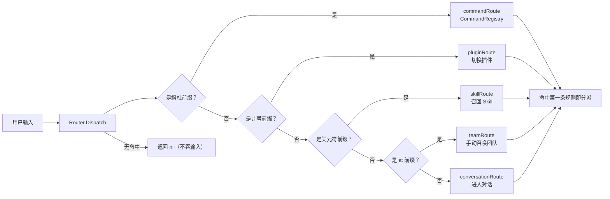

# input_router

## 生态位

输入分流（command/skill/plugin/conversation）与命令注册表：`CommandRegistry`
/`Router`/`CommandFunc`。路由只持闭包，不持有 Service 状态。

## 职责与非职责

- 做：注册、查询、按路由策略分派。
- 不做：内置命令注册（根包 `registerBuiltinCommands`）、Skill 上下文编解码。

## 数据流图



前缀（sigil）契约为**一字符一含义**：`/` 命令、`#` 切换插件、`$` 召回 Skill、
`@` 手动召唤团队；路由按固定顺序匹配，命中即分派。

## 测试

```text
go test ./application/core/input_router -count=1
```

## 文件与函数索引

> 由源码 doc 注释自动提取（首行摘要）；描述源码行为，与实现保持同步。
> 刷新方式：`python scripts/gen_core_readme_index.py`。

### command.go

- `func NewCommandFunc(name, description string, execute func(context.Context, []string) (CommandResult, error)) CommandFunc` — NewCommandFunc 构造命令闭包实现。
- `func (command CommandFunc) Name() string`
- `func (command CommandFunc) Description() string`
- `func (command CommandFunc) Execute(ctx context.Context, args []string) (CommandResult, error)`
- `func NewCommandRegistry() *CommandRegistry` — NewCommandRegistry 构造空注册表。
- `func (registry *CommandRegistry) Register(command Command) error` — Register 注册命令（大小写不敏感；重名报错）。
- `func (registry *CommandRegistry) Get(name string) (Command, bool)` — Get 按名查找命令。
- `func (registry *CommandRegistry) All() []Command` — All 返回按名排序的全部命令。

### input_router_test.go

- `func (route recordingInputRoute) Matches(string) bool`
- `func (route recordingInputRoute) Dispatch(context.Context, string) error`
- `func TestInputRouterDispatchesFirstMatchingStrategy(t *testing.T)`
- `func TestInputRouterSigilOwnership(t *testing.T)` — 前缀（sigil）契约：`/` 命令、`#` 切换插件、`$` 召回 Skill、`@` 手动召唤团队，

### router.go

- `func NewRouter(handlers RouteHandlers) *Router` — NewRouter 按固定策略顺序装配路由。
- `func (router *Router) Dispatch(ctx context.Context, input string) error` — Dispatch 命中第一条规则后分派；无命中返回 nil。
- `func (route commandRoute) Matches(input string) bool`
- `func (route commandRoute) Dispatch(ctx context.Context, input string) error`
- `func (route pluginRoute) Matches(input string) bool`
- `func (route pluginRoute) Dispatch(ctx context.Context, input string) error`
- `func (route skillRoute) Matches(input string) bool`
- `func (route skillRoute) Dispatch(ctx context.Context, input string) error`
- `func (route teamRoute) Matches(input string) bool`
- `func (route teamRoute) Dispatch(ctx context.Context, input string) error`
- `func (conversationRoute) Matches(string) bool`
- `func (route conversationRoute) Dispatch(ctx context.Context, input string) error`

