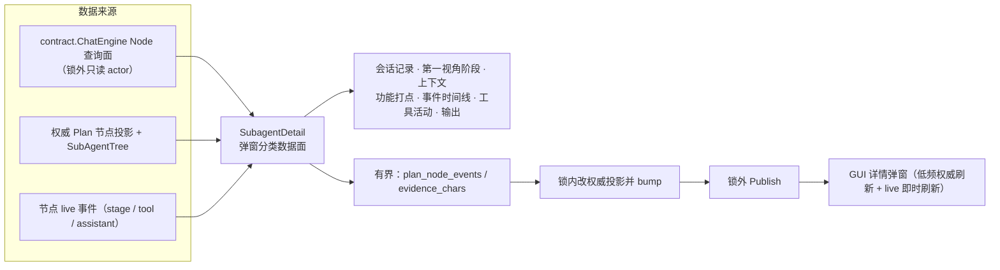
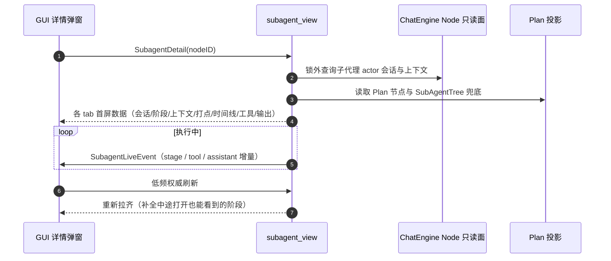

# subagent_view

## 生态位

子代理投影面：详情（按弹窗分类：会话记录/第一视角阶段/上下文/功能打点/
事件时间线/工具活动/输出）、live 流透传、树/节点事件投影与有界工具事件
增量。

## 职责与非职责

- 做：`SubagentDetail`、`SubscribeSubagentLive`、`HandleSubagentToolEvent`、
  `FindPlanNodeByID`/`ClonePlanNode`/`SubagentChangedPayload`。
- `SubagentDetail`（2026-09-07 起）是弹窗分类实时数据面：除会话记录外还
  回填 Goal/SessionID/Assignee/Participants（SubAgentTree/工作台兜底，fork
  不在 Plan 快照也可展示）、Stages（第一视角历史，详情中途打开也能补全）、
  Trace（功能打点）、Timeline（阶段 + 打点推导的事件时间线）。GUI 打开
  详情后低频权威刷新 + live 事件即时刷新双通道，各 tab 独立更新。
- 不做：fork/merge-back 执行（seelebridge 负责）。

## 依赖方向

依赖 `state.Core` + `contract.ChatEngine` Node 查询面（只读子代理 actor）+
`ViewPort`（bump）+ `Limits`。

## 数据流图



## 时序图



## 并发/安全语义

锁内只改权威 Plan 节点投影并 bump；引擎 Node 查询在锁外（只读 actor，
安全）。工具事件与节点时间线有界（`plan_node_events`/`evidence_chars`）。

## 扩展与 Review

新增子代理数据面放本包。Review 重点：不触碰子代理执行锁、事件有界、投影
深拷贝不共享引擎数据。

## 测试

```text
go test ./application/core/subagent_view -count=1
```

根包 `subagent_detail_test.go`/`subagent_tree_test.go` 覆盖集成；本包
`adapt_test.go` 覆盖会话/上下文适配与时间线/状态映射兜底。

## 文件与函数索引

> 由源码 doc 注释自动提取（首行摘要）；描述源码行为，与实现保持同步。
> 刷新方式：`python scripts/gen_core_readme_index.py`。

### adapt_test.go

- `func testCoordinator() *Coordinator`
- `func TestAdaptSubagentConversation(t *testing.T)` — TestAdaptSubagentConversation 验证会话记录适配：截断（evidence_chars）、
- `func TestAdaptSubagentContext(t *testing.T)` — TestAdaptSubagentContext 验证上下文快照适配：截断、条目上限、空快照 → nil。
- `func TestNodeStatusMappingFallbacks(t *testing.T)` — TestNodeStatusMappingFallbacks 验证树状态/任务状态 → 详情状态映射。
- `func TestFindSubagentTreeNodeNested(t *testing.T)` — TestFindSubagentTreeNodeNested 验证递归查找子代理树节点。
- `func strPtr(value string) *string`

### coordinator.go

- `func NewCoordinator(deps Deps) *Coordinator` — NewCoordinator 构造 subagent_view 协调器。
- `func (c *Coordinator) HandleSubagentToolEvent(e seelsession.SubagentToolEvent)` — HandleSubagentToolEvent 把 Runtime 工具分发投影进有界权威 Plan 节点快照
- `func (c *Coordinator) upsertSubagentToolEvent(node *model.PlanNode, e model.SubagentToolEvent)`
- `func (c *Coordinator) truncateSubagentEvidence(value string) string`
- `func FindPlanNodeByID(nodes []model.PlanNode, nodeID string) *model.PlanNode` — FindPlanNodeByID 递归查找 Plan 节点（含子节点）。
- `func ClonePlanNode(node model.PlanNode) model.PlanNode` — ClonePlanNode 深拷贝单个 Plan 节点（事件投影发布用）。
- `func SubagentChangedPayload(plan *model.PlanState, planID, runID string, node model.PlanNode) model.SubagentEvent` — SubagentChangedPayload 组装子代理变更事件负载。
- `func (c *Coordinator) SubagentDetail(nodeID string) (*model.SubagentDetail, error)` — SubagentDetail 返回节点子代理详情（截断会话 + 上下文快照 + 功能打点 +
- `func nodeStatusFromSubagentStatus(status dto.SubAgentNodeStatus) model.NodeStatus` — nodeStatusFromSubagentStatus 把子代理树状态映射为详情状态。
- `func nodeStatusFromTaskStatus(status string) model.NodeStatus` — nodeStatusFromTaskStatus 把任务注册表状态映射为详情状态（未知 → ""）。
- `func findSubagentTreeNode(nodes []dto.SubAgentTreeNode, nodeID string) *dto.SubAgentTreeNode` — findSubagentTreeNode 在子代理树投影中递归查找节点。
- `func (c *Coordinator) nodeWorktreeInfo(nodeID string) *model.SubagentWorktreeInfo`
- `func (c *Coordinator) adaptSubagentContext(snap *snapshot.ContextSnapshot) *model.SubagentContext`
- `func isRunningSubagentStatus(status model.NodeStatus) bool`
- `func (c *Coordinator) adaptSubagentConversation(messages []types.Message) []model.Message`

