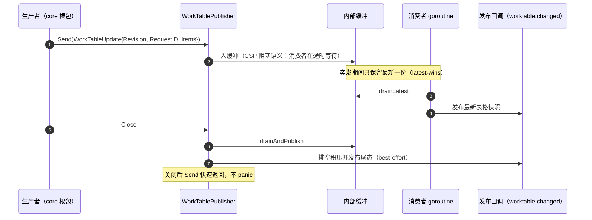
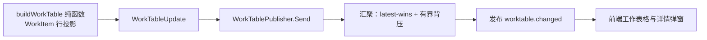

# core/worktable

## 生态位

`application/core/worktable` 是工作表格（Work Table）增量事件的中枢投递
机制：`WorkTablePublisher` 以 CSP 汇聚（latest-wins、有界背压、关闭排空
尾态）发布 `worktable.changed` 所需的最新表格快照。

## 职责与非职责

- 职责：表格快照的并发安全汇聚与有序投递；`WorkTableUpdate` 承载
  Revision/RequestID/Items。
- 非职责：`WorkItem` 行投影的构建（`application/core/work_table.go` 的 `buildWorkTable`
  纯函数）、todo 三态更新、task 注册表同步——这些仍在 `core` 根包或
  `seelebridge/task`。

## 依赖方向

只依赖 `application/model`（`WorkItem`）与标准库；禁止反向依赖 `core` 根包。

## 时序图



## 数据流图



## 测试

```text
go test ./application/core/worktable -count=1
```

`worktable_publisher_test.go` 覆盖突发汇聚、关闭尾态与关闭后 Send 安全性。

## 文件与函数索引

> 由源码 doc 注释自动提取（首行摘要）；描述源码行为，与实现保持同步。
> 刷新方式：`python scripts/gen_core_readme_index.py`。

### worktable_publisher.go

- `func NewWorkTablePublisher(publish func(WorkTableUpdate)) *WorkTablePublisher`
- `func (publisher *WorkTablePublisher) Send(update WorkTableUpdate)` — Send 投递一次表格更新（CSP 阻塞语义：消费者在途时等待；关闭后快速返回）。
- `func (publisher *WorkTablePublisher) loop()`
- `func (publisher *WorkTablePublisher) drainLatest(initial WorkTableUpdate) WorkTableUpdate` — drainLatest 消费缓冲区内积压的全部更新，返回最后一次（latest-wins）。
- `func (publisher *WorkTablePublisher) drainAndPublish()` — drainAndPublish 关闭路径：排空积压并发布尾态（best-effort）。
- `func (publisher *WorkTablePublisher) Close()` — Close 优雅关闭：停止消费者 goroutine 并发布尾态。

### worktable_publisher_test.go

- `func TestWorkTablePublisherCoalescesBurstToLatest(t *testing.T)`
- `func TestWorkTablePublisherCloseDrainsTail(t *testing.T)`

