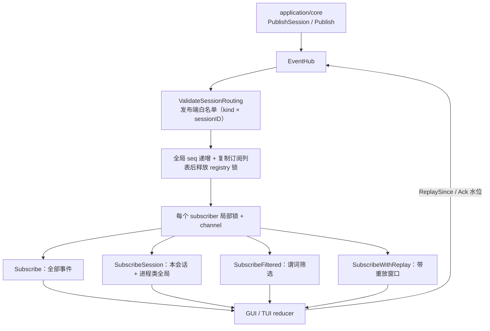
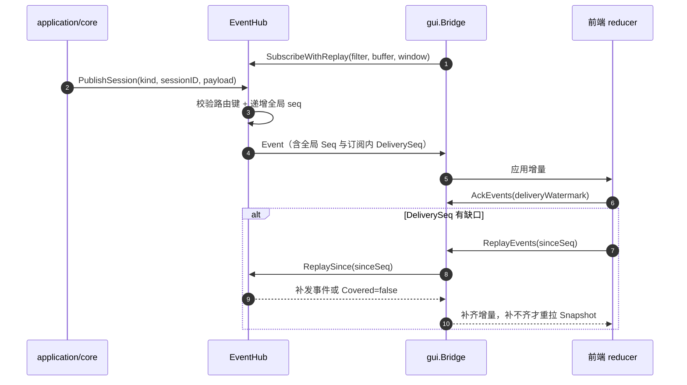
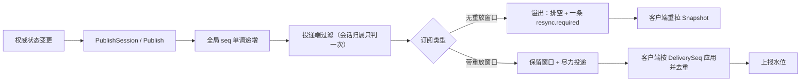
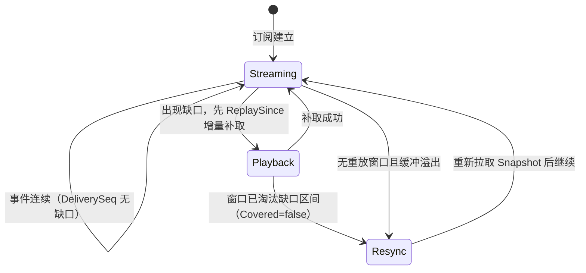

# Application Events

## 生态位

本包把 Application 权威状态变化发布给 TUI、GUI Bridge 和测试观察者。Snapshot 是完整事实，Event 是连续增量；Event 不能成为唯一持久状态。

主要调用方：`application/core`（发布端，经 `PublishSession` 打会话路由键）、
`gui/bridge.go`（订阅 + 重放 + 确认水位）、`tui`（订阅）与 `e2e/scenario`（观察者）。

## 架构图



## 时序图



## 数据流图



## 溢出与重同步状态



## 核心实现

- `EventKind`：消息新增/增量、主代理工具、子代理生命周期/工具、**员工回合工具活动**（`teammate.tool.started` / `teammate.tool.completed`，载荷 `dto.RoleToolActivity`——`subagent.tool.*` 的员工侧对称面：子代理按 `NodeID` 落进 Plan 节点的有界 `tool_events`，员工按角色会话归位、**不落快照**，只作"它刚动了"的推送）、Runtime、聊天运行态（`chat.changed`）、Interaction、Snapshot 和 Error 等事件类型；另有四条**载荷不进快照**的通告类 kind（`team.changed` 作废前端面板缓存、`teammate.tool.*` 驱动员工详情的实时区、`compaction.progress` 逐关进度），这些一律用 `revision = 0`。
- `CompactionProgress`（`compaction.progress` 载荷）：一轮上下文压缩的门禁进度。`state` =
  `running`/`done`/`failed`（三态之外没有第四种）；`phase` 为空表示"该关刚刚收口"，
  `begin` 是起手帧（判据估算还没出结果：`index=0`、`version=0` 表示"未定"，判据关收口时才补正）；
  `gate`/`index`/`total` 说明走到哪一关，顺序的唯一事实在
  `application/core/context_runtime.CompactionGates`；`elapsed_ms` 是**刚刚过去那一段**的墙钟
  （毫秒），不是从开轮算起的累计值。会话/请求归属在事件信封里（`Event.SessionID` /
  `Event.RequestID`），载荷不重复一份同事实；`gate` 只带枚举 id，文案在前端。
- `Event`：包含 `ProtocolVersion`、全局 `Seq`、订阅内 `DeliverySeq`、Snapshot `Revision`、request ID、会话路由键 `SessionID` 和 JSON payload。
- `EventHub`：为每个 subscriber 分配局部锁和 channel，负责 fan-out、顺序、投递端过滤与关闭。
- `Subscription`：暴露只读事件 channel 与幂等 `Close`。

订阅口径有三种，会话归属只在 Hub 投递端判定一次，客户端不得再判：

| 口径 | 投递内容 |
|------|----------|
| `Subscribe(buffer)` | 全部事件（全局观察、测试） |
| `SubscribeSession(sessionID, buffer)` | 该会话 + 进程类全局（`SessionID == ""`，resync/exit）事件 |
| `SubscribeFiltered(filter, buffer)` | 谓词筛选；`application/core` 用它实现显式 sid 订阅与（过渡口径）空 sid 跟随视图 |
| `SubscribeWithReplay(filter, buffer, window)` | 同上，另保留最近 `window` 条可增量补取（桌面 Bridge 用） |

发布端严格白名单（G2，波 2 开启）：`PublishSession` 在发布前按
`ValidateSessionRouting` 校验 `(kind, sessionID)`——会话类 kind 空 sid、
进程类 kind 带 sid 一律拒绝发布（返回零值事件）并经 `PublishDiagnostic`
记诊断（默认 stderr，可整体替换）。草稿早分配真实 SID 后，会话类事件
不再存在合法的空 sid 形态。

谓词在发布 goroutine 上求值，必须无阻塞、无副作用。不属于本订阅的事件根本不进入
其 channel：别会话的流量既不挤占本订阅缓冲，也不要求客户端二次过滤。

发布时 Hub 按全局顺序递增 seq，并在复制 subscriber 列表后立即释放 registry 锁；实际投递只持有目标 subscriber 的局部锁。慢订阅者不会阻塞 Subscribe/Close 或其他 subscriber 的状态管理。溢出按订阅类型分两种策略：

- **无重放窗口**（`Subscribe` / `SubscribeFiltered`）：排空该订阅缓冲，只保留一个
  `resync.required`，且它一律以**全局事件**投递（保留会话路由键会被本订阅自己的
  过滤条件吞掉，客户端从此静默地看旧数据），由消费者重新获取 Snapshot。排空
  必须用非阻塞接收：`deliver` 持有 subscriber 局部锁，若阻塞在接收上与并发
  消费者抢元素，就会和等同一把锁的 `Close` 互相死锁（2026-09-12 CI
  `application/core` 偶发挂死即此根因）。
- **带重放窗口**（`SubscribeWithReplay`）：**不丢弃载荷、也不排空缓冲** —— 每个通过
  过滤的事件都先进入按 `DeliverySeq` 有序的窗口，再尽力写入 channel。落后消费者用
  `ReplaySince(sinceSeq)` 增量补取，`DeliveryWatermark()` 用来区分"确实没有新事件"和
  "有事件但我还没拿到"。只有窗口淘汰掉缺口区间（`ReplayResult Covered=false`）时才
  退化为整份重拉。重放是幂等的：同一事件可能既在 channel 又在窗口里，客户端按
  `DeliverySeq` 去重即可。

## 依赖和边界

本包只依赖 `application/model`，不读取 Service 内部状态。经过投递端过滤后，全局
`Seq` 必然跳号，连续性只以 `DeliverySeq` 判定：GUI 的 reducer 在 delivery_seq 缺口时
先向宿主增量补取（`Bridge.ReplayEvents`），补不齐才重拉 Snapshot；渲染层每次应用后
回报水位（`Bridge.AckEvents`），宿主据此重推未确认的事件。改动这套语义时，
`gui/bridge.go`、`gui/frontend/dist/protocol.js` 与 `client-state.js` 必须同步，详见
[`docs/gui`](../../docs/gui/README.md)。

## Review 指南

- 新事件必须能由 Snapshot 重建，不能制造只存在于事件流的事实。
- 客户端能"猜"的状态都是重复维护：运行/排队只由 `chat.changed` 下发完整
  `ChatState`，前端不得从"收到增量事件"反推 running（协议层曾因此与
  `sessionStatusLocked` 各持一份真相）。
- 纯状态替换型事件用 `revision = 0`：它不声称推进快照版本，且若带上当前
  revision，会被客户端"已由权威快照表示"的抑制规则丢掉。
- 进度类事件（`compaction.progress`）承载的是**过程事实**，不是状态：一轮的形状是
  起手帧（`phase=begin`，只有显式压缩发——自动路径"要不要压缩"正是判据估算的结果）→
  逐关收口 → 恰好一个终局（`done`/`failed`），终局后本轮生命周期即结束，中途报错也必须
  发终局（挂着不动的进度条比没有进度条更糟）。进度帧是一次性的过程展示，不冒充可重建
  状态：快照里对应的持久事实只有压缩记录本身（`Snapshot.Task.ContextCompactions`）。
  它也因此**不能**进前端的 120ms 尾随合并集
  （`gui/frontend/dist/app.js` 的 `BUFFERED_INCREMENTAL_KINDS`）：
  latest-wins 会把中间门禁帧吃掉，只剩首尾两帧。
- 会话级事件必须经 `PublishSession` 打会话路由键：漏打键等于全局广播，会绕过投递端
  过滤、污染其它会话的视图。
- 修改 seq/revision/delivery_seq 含义时同步更新 `gui/frontend/dist/protocol.js`、`client-state.js` 及协议测试。
- Publish/Close/Subscribe 的竞态必须用 race test 验证。
- payload 应是稳定 DTO，避免传递可被后续修改的共享 slice/map。
- `subagent.changed` payload 携带完整有界节点投影；`subagent.tool.started/completed` 携带单条工具活动，前端必须递归更新 Plan，不能原地修改旧 Snapshot。

## 测试

```text
go test ./application/event -count=1
go test ./application/core -run SubscribeSession -count=1
node --test gui/frontend/dist/client-state.test.mjs
node --test gui/frontend/dist/event-chain.test.mjs
```
