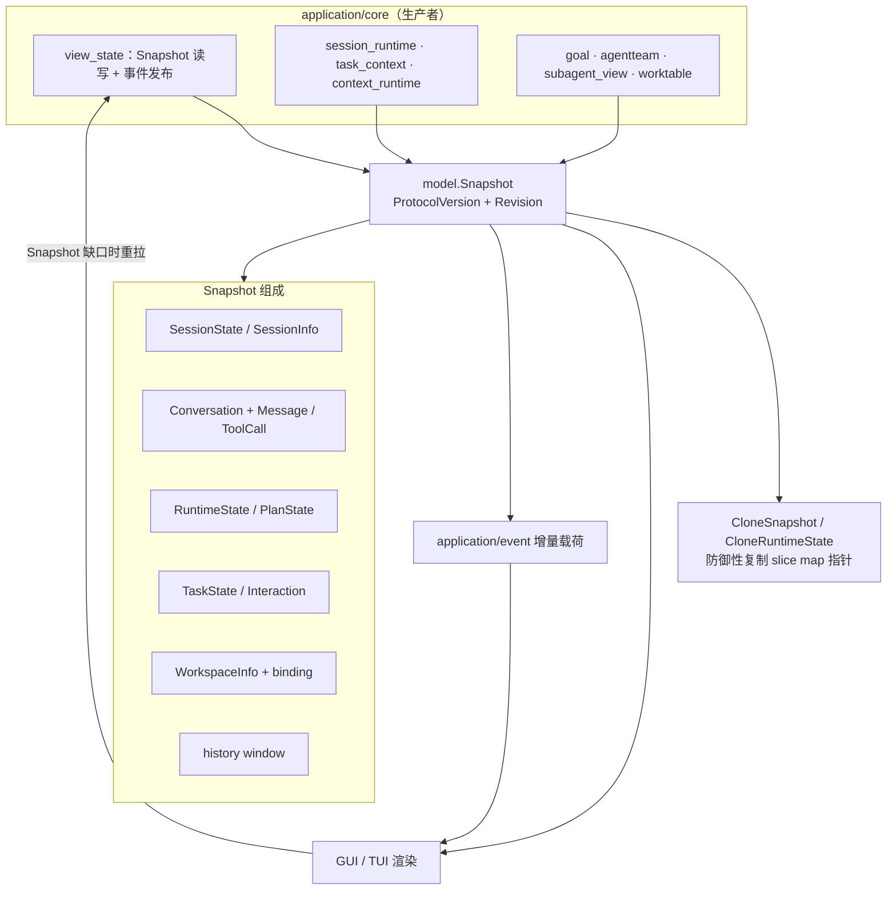
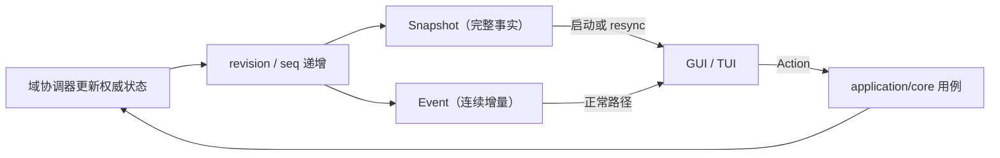

# Application Model

## 生态位

`model` 是 Application 与所有前端共享的版本化 DTO 层。这里的字段是进程内 GUI/TUI 协议的一部分，不是随意的内部结构。

主要调用方：`application/core`（组装权威 `Snapshot`）、`gui` 与 `tui`（消费并渲染）、
`application/event`（增量载荷）、`e2e/scenario`（断言可观察结果）。

## 架构图



## 数据流图



## 权威结构

- `Snapshot`：session、conversation、chat、task、runtime、interaction、history window、workspace 和 binding 的完整视图。
- `TaskState`：最近一次请求的可观察结果，只能是 `progressing`、`completed`、`needs_user_decision`、`blocked`、`interrupted` 或 `failed`；不承载模型推理、系统提示词或原始工具日志。
- `SessionState`/`SessionInfo`：`ID` 是唯一操作键，`Name` 是允许重复的显示标题；`SessionState.Draft` 表示尚未生成 ID、不得持久化的待发送会话。可见 `Status` 含 `draft | idle | running | queued | restoring | awaiting_approval | archived`；`restoring` 是运行中切换到未驻留会话时“后台冷加载中”的权威状态（视图已切到目标空壳，内容基线由装载完成事件发布）。
- `WorkspaceInfo`：`ID` 是唯一键，`Name` 默认来自 root basename。
- `Message`/`ToolCall`：前端渲染的消息与工具卡片。`Message` 的 `RoleName`/`RoleSessionID`/`RoundID`/`UnitSeq` 是群聊角色归属（谁主持这一轮），聊天区据此渲染 `EXEC`（`main`）/`ADVISOR`（`tl`）与轮次徽标；空值 = 单 agent 会话的旧数据，前端回退到 provider role 文案。生产者用 `MessageOrigin` 传入这段归属（见 `application/core/README-service.md` 的 `appendMessageWithOriginLocked`）。
- `RuntimeState`/`PlanState`：模型、Provider、Plugin、Effort、权威**权限档位**（`permission_tier` 生效档 + `permission_tiers` 目录）、工具和 Plan DAG 的投影；嵌套 `PlanNode` 包含有界生命周期 `events` 和子代理 `tool_events`。`full_access` 保留为派生位（`full` 档 ⇒ true），不再是有独立语义的开关。
- `SubagentEvent`/`SubagentToolEvent`：前端增量协议；前者携带完整节点及 Plan 进度，后者携带单次子代理工具 started/completed 状态。
- `WorkTableEvent`：`worktable.changed` 增量载荷（`items` + 可选 `batches` + 可选 `subagent_tree`）；树只在内容变化时携带，空数组表示已清空，缺失/`null` 表示保留既有树——前端据此把工作表格行解析成详情弹窗节点。
- `Interaction`：审批、session/account picker 等等待用户决策的状态。

`ProtocolVersion` 标识不兼容协议版本。`CloneSnapshot` 和 `CloneRuntimeState` 对 slice、map 和嵌套指针做防御性复制。

## Session persistence

`SessionRecord` version 3 is the backend session aggregate: `id`, stable `title`, `plan_stack`, visible `conversation`, `TaskContextProjection`, checkpoint revisions, and `ToolResultRef` metadata are independent records. Provider history is a replaceable execution cache and must never overwrite the stored title, active Plan, task status, or transcript.

`TaskContextProjection` is the restart source for one task. It stores content-addressed active Skills, the canonical Plan reference and node projection, the latest structured `TaskCheckpoint`, and `TokenAudit`. `TranscriptEvent` preserves original user/assistant/tool roles and protocol IDs; oversized content is represented by `result_ref`, while `StoredToolResult.Content` is excluded from JSON and persisted separately.

## 边界

DTO 不执行 IO、不调用 Engine，也不持有锁。它可以引用稳定的桥接值类型，但不应暴露数据库连接、Wails runtime 或可变 backend 对象。
装配后的 system prompt、其文本分层和内部摘要均不属于 DTO；它们只在服务端传给 Engine，不能经 Snapshot/Event 进入前端。

## 兼容性规则

- 新增 optional 字段通常向后兼容；删除、改义或修改 ID/revision 语义需要升级协议并同步前端。
- 修改嵌套 slice/map 时必须更新 clone helper。
- JSON tag 是客户端契约，重命名必须更新 GUI tests 和 docs schemas。

## Review 指南

- 名称是否被误当作索引；恢复/删除/绑定必须继续使用 ID。
- draft 是否从新建即持有早分配的真实 SID（草稿期不建引擎 bundle），物化是否
  复用同一 ID 并用首问生成 Name；composer 未发送正文是否随 record 落盘。
- Snapshot clone 是否仍真正隔离可变数据。
- Plan 节点状态是否覆盖 queued/running/worktree_creating/rebasing/merging/completed/failed/skipped/aborted 生命周期。
- 权限档位控件（composer 芯片与运行状态面板列表）是否只消费 `RuntimeState.permission_tier` 与后端下发的 `permission_tiers` 目录，而不是维护前端本地镜像；旧 `full_access` 是否只作为 `full` 档的派生位出现。
- 零值是否对旧客户端安全。

## 测试

```text
go test ./application/core ./gui -count=1
node --test gui/frontend/dist/protocol.test.mjs gui/frontend/dist/client-state.test.mjs
```
