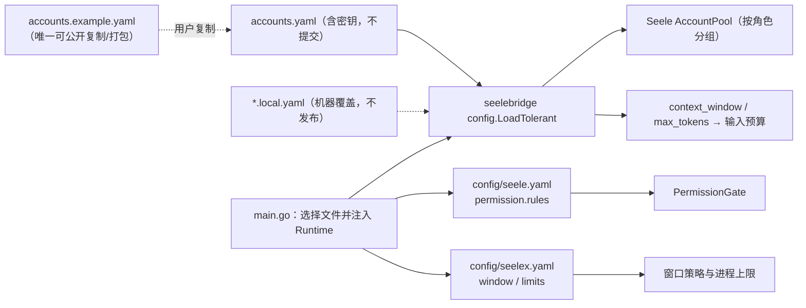

# Configuration

## 生态位

`defaults.context_window` 表示模型的总上下文窗口，`defaults.max_tokens` 表示单次响应的最大输出 token。账号条目可以覆盖这两个值；Application 会从总窗口中扣除输出预留和 12.5% 安全余量后计算可用输入预算。

`config/` 存放运行时账号配置模板、本机私有配置以及运行参数文件（`seele.yaml` 权限规则、`seelex.yaml` 窗口/limits 参数）。配置最终由 Seele ChatClient/AccountPool 读取，Seelex composition root 负责选择文件并注入 Runtime。

## 数据流图



## 文件约定

- `accounts.example.yaml`：唯一可公开复制、文档引用和发行打包的账号模板。
- `accounts.yaml`：本机实际账号文件，可能含秘密，不应提交或出现在文档输出。
- `*.local.yaml`：机器或开发者专用覆盖文件，同样不得发布。
- `seele.yaml`：权限规则文件（permission.rules），`main.go` 优先读 `config/seele.yaml`，根目录版本回退兼容。
- `seelex.yaml`：运行参数文件（window / limits），加载逻辑同上。**两个 `limits` 段只有一个家**：`window` 与 `limits`（含 `limits.session_storage`）都从 `config/seelex.yaml` 读（`core.LoadWindowConfig` 与 `seelexctx.LoadLimits` 收的是同一个路径，见 `main.go` 的 `initRuntime`）；`config/seele.yaml` 只放权限段。

## 多进程启动开关（`limits.runtime.allow_multi_process`）

`config/seelex.yaml` 的 `limits.runtime.allow_multi_process` 决定进程是否同意
**多进程**共用同一数据根，**默认 false = 单实例**：

- 数据根是单进程写者（`sessionstore/data_root_lock.go` 的 `lock.owner`）。默认下
  第二个进程启动即被拒绝：`main.go` 的 `guardMultiProcess` 给出**可读的启动期拒绝**，
  装配深处的数据根锁同样把冲突报成 `ErrDataRootLocked`。
- 置 `true` 才放行：第二个进程不再被数据根锁拒绝（存储侧 `allow_multi_process`
  让冲突退化为一条诊断日志，本进程不持锁、不夺锁、不删别人的锁）。
- **代价**：多个进程可同时写同一数据根，失去**跨进程**写者串行化——进程内的模块锁
  不跨进程，并发写同一会话/同一模块会互相覆盖。谁保证一致性 = 使用者（典型用法是
  只读的旁路进程，或把并发写分给不同数据根）。
- 代码零值 = 关（`seelexctx.RuntimeLimits.AllowMultiProcess` 的零值 false），与既有
  `async_exec` / `context_compaction_summary` 同一套「整块缺失或显式 false 都走
  不允许路径、可一键回滚」的纪律；两臂各有用例钉住（`seelexctx` 解析两臂 +
  `sessionstore` 数据根锁两臂）。

## 启动期自愈（责任链 + 缺失即初始化）

`main.go` 按**责任链**决定读哪份配置（`runtimeConfigChain`）：

```text
1. config/<name>         CWD 相对（仓库里那份 / 开发场景；用户改过的就是它）
2. <name>                根目录回退（历史兼容）
3. <exe>/config/<name>   包内配置（正式部署：二进制旁边自带一份）
```

**存在即读**：链上第一份存在的文件就是答案，进程一个字节都不写。
**缺失即初始化**：三处都没有时，用内嵌在二进制里的默认档（`internal/bootseed`
的 `assets/config/`）在 **`<exe>/config/`** 落盘，再读它——落盘位置刻意只取二进制
所在目录，CWD 可能是用户的项目目录，不能在那里凭空造 `config/`。

两条约定：

- 内嵌默认档必须是本目录规范档的**逐字节副本**：改了 `config/*.yaml` 就跑
  `scripts/sync-bootseed-defaults.ps1`（`internal/bootseed` 的
  `TestEmbeddedConfigDefaultsMatchRepository` 会在漂移时变红）；
- `accounts.yaml` **不参与**自愈（它是本地凭据，由 `-LocalConfigPath` 显式给出，
  仓库根与包内都不会凭空生成一份假的）。

账号按 `subagent`、`agent`、`goalplan` 等 role 分组；缺少专用 role 时由 bridge 的 fallback 规则选择账号。

每个账号条目可带可选字段 `max_concurrency`，控制该账号在 AccountPool 上的
并发租约（必须 > 0）。默认按角色区分：`agent`/`goalplan` 为 1（主会话与
规划路径本身受 Session 单锁约束），`subagent` 为 1024——即框架不设实用
上限，子代理只按“角色 + 模型供应商”运行，实际在途请求受供应商/API 限流
约束；显式填写 `max_concurrency` 时优先于角色默认值。

## 安全规则

- 不读取或展示真实 `api_key`、token、password、DSN。
- 新示例使用明显占位符，不使用 `sk-` 形式的伪密钥，以免触发安全扫描。
- release/CI 只能复制白名单模板。
- GUI 返回存储设置时必须使用 safe/redacted config。

## Review 指南

- 新字段是否由实际 loader 支持，而非只修改 YAML。
- role fallback 是否保持确定性，disabled account 是否被排除。
- 本机路径和秘密是否意外进入 Git diff、日志或构建产物。

## 验证

```text
go test . -run 'Config|Account' -count=1
go test ./seelebridge -run Account -count=1
```
