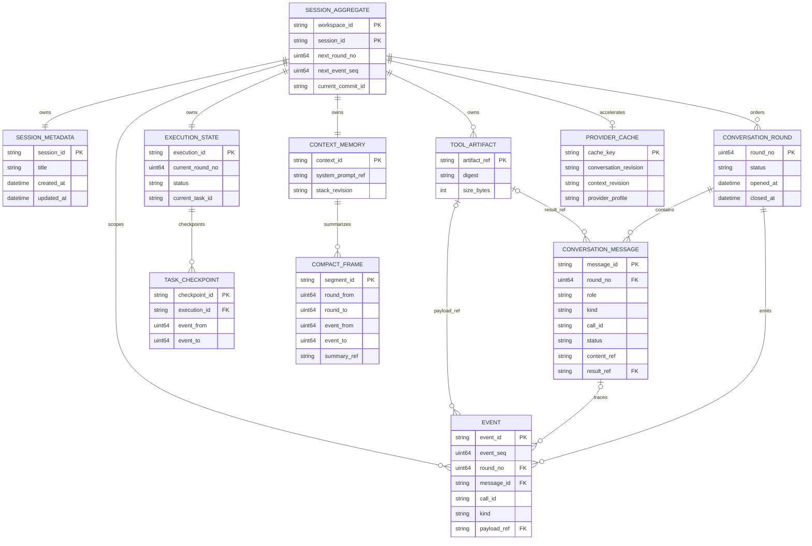

# Session Storage v2：DDD 架构设计

## 1. 设计决策

Session 按 DDD 建模为一个有界聚合：

```text
SessionAggregate (workspace_id, session_id)
├── Metadata
├── ConversationRound[]       # 用户可见正文
├── ConversationMessage[]     # 语义消息 + tool call/result 摘要
├── ExecutionProjection       # task/checkpoint/continuation
├── ContextState               # system/plan/task/skill/compact
├── ToolArtifactRef[]          # 不可变原文引用
└── EventRef[]                 # 指向独立 event stream 的引用
```

独立的 `EventStream` 保存流式、工具生命周期和框架事件，不作为
`SessionAggregate` 的内嵌历史。Provider working history 不属于聚合真相源，
它是 Runtime 的可重建缓存。聚合提交可以携带缓存作为加速数据，但恢复正确性不能依赖它。

### 不变式

1. `(workspace_id, session_id)` 是唯一聚合键；session name 只属于 Metadata，不参与寻址。
2. `RoundNo` 是 session 内单调递增的领域编号，从 1 开始，永不复用。
3. 一次用户请求及其 assistant/tool 完成链属于同一个 `RoundNo`。
4. `EventSeq` 是独立 EventStream 的单调递增编号；恢复或诊断按 `EventSeq`，不按文件名或时间戳。
5. `Message.ID` 是 UI 增量更新和范围定位的稳定键；不能因窗口淘汰而重写。
6. `SegmentID` 只能标识压缩片段，必须携带其 `RoundFrom/RoundTo` 和 `EventFrom/EventTo`；随机值不得承担截断语义。
7. Provider cache 可以缺失；Conversation、Context 缺失必须显式报告；EventStream 缺失时诊断能力降级，但不能静默伪造为空。
8. 任何已发布 generation 不得原地修改；所有模块变更通过新 revision + root manifest 切换发布。

## 2. 有界上下文与 owner

### 2.1 领域实体关系（ER）

下面的图描述**领域关系**，而不是把每一个 JSON 文件都当成独立业务对象。
`SessionAggregate` 是唯一聚合根；`provider-cache` 是从
ConversationMessage 和 Context 派生的缓存，`events` 是只用于流式回放与
可观测性的独立事实轨。



关系解释：

- `ConversationRound` 是用户请求及其 assistant/tool 完成链的有序容器；
  `RoundNo` 是会话截断与历史分页的主键。
- `ConversationMessage` 是模型恢复的语义正本，工具调用和工具结果通过
  `CallID` 配对；大结果只保存 `result_ref`，不把原文塞入消息 shard。
- `Event` 属于独立的 append-only EventStream，以 `EventSeq` 排序，保存流式块、
  工具生命周期、mailbox 和框架诊断事件。正常恢复不需要加载全部 Event shard。
- `ExecutionState` 只保存任务、子代理、continuation 和 checkpoint 的当前业务状态；
  checkpoint 通过 event 范围定位证据，不能复制 ConversationMessage 或 Event payload。
- `ContextMemory` 保存四类 stack；`CompactFrame` 只保存摘要与范围索引，原文仍由
  ConversationMessage、Event 或 Artifact 提供。
- `ProviderCache` 只记录所依据的 Conversation/Context revision，失效后可重建；
  它不能被用作任何恢复路径的真相源。
- Event 只关联 `CommitID`、`RoundNo`、`TaskID` 或 `MessageID` 做诊断，不能反向
  改变 ConversationMessage 或 ExecutionState。

| Bounded Context | 聚合内模块 | owner | 不允许做的事 |
|---|---|---|---|
| Conversation | metadata、round、message | Application Session | 不保存 provider-only prompt 或完整工具原文 |
| Conversation Message | 语义消息、tool call/result 摘要 | Application Session | 不保存流式诊断或 provider cache |
| Event Stream | 流式块、工具生命周期、框架事实 | Application/Runtime adapter | 不作为对话恢复真相源，不保存 task projection |
| Execution | task projection、checkpoint、continuation | Application/Execution Coordinator | 不复制 Conversation Message 或 Event payload |
| Context Memory | system prompt、四类 stack | seelexctx + Runtime adapter | 不反查 Application，不直接读取全量 Conversation |
| Artifact | tool result、compressed original | sessionstore artifact backend | 不参与正文排序，不覆盖已有 ref |
| Framework Facts | Event Stream 的诊断事件 | Runtime event persister | 不与 Conversation Message 共用正文，不反向驱动恢复 |
| Provider Runtime | bounded provider cache | Runtime/Seele session | 不作为恢复真相源，不要求 UI 读取 |

Application Snapshot/EventHub 是前端投影，不是新的持久化 owner。GUI/TUI 只能通过 Application DTO 和模块查询接口读数据。

## 3. 顺序 ID 模型

### 3.1 RoundNo

`RoundNo` 在 Session 聚合写入边界分配：

```text
next_round = max(previous_round_no) + 1
user input                  -> RoundNo = next_round
assistant response           -> RoundNo = next_round
tool call / tool result     -> RoundNo = next_round
checkpoint / compact frame  -> 保存覆盖的 RoundNo 范围
```

如果一次请求被取消，未完成的 round 仍保留，状态为 `interrupted` 或 `pending`，下一轮不得复用该编号。

### 3.2 EventSeq 与 MessageID

- `EventSeq` 保持独立 EventStream 顺序，用于事件回放和诊断范围 select。
- `MessageID` 保持 UI 级稳定 ID，用于 conversation around/range select。
- Event 必须持久化对应 `MessageID`、`RoundNo` 或同 revision 的 message-to-event
  索引，禁止按数组位置临时推导。

### 3.3 CompactFrame

兼容现有的 `From/To`（Provider unit index），新增正式定位字段：

```json
{
  "segment_id": "compact-r00000003-r00000008-v0002",
  "round_from": 3,
  "round_to": 8,
  "event_from": 21,
  "event_to": 49,
  "message_from": "message-31",
  "message_to": "message-76",
  "event_revision": "rev-00012",
  "conversation_revision": "rev-00012"
}
```

`segment_id` 可以由范围和 revision 确定性生成；即使实现使用随机后缀，也只能当作去重句柄，不能替代上述顺序字段。

## 4. 物理布局

```text
project-<hash>/session-<hash>/
  manifest.json                         # root commit pointer
  modules/
    metadata/
      rev-000001/session.json
    conversation_message/
      rev-000001/
        index.json                      # round/message/call range index
        rounds-00000001-00000100.json
    events/
      rev-000001/
        index.json                      # EventSeq/round/message ranges
        events-00000001-00000100.json
    execution/
      rev-000001/projection.json
      rev-000001/checkpoints-00000001-00000100.json
    context/
      rev-000001/system-prompt.json
      rev-000001/plan-stack.json
      rev-000001/task-stack.json
      rev-000001/skill-stack.json
      rev-000001/compact-stack.json
    provider-cache/
      rev-000001/history-00000001-00000004.json
  tool-results/
    <immutable-ref>.json
```

### 分片边界与加载策略

- `conversation_message` 按 `RoundNo` 分片；一个 shard 只包含完整 round，不能
  把同一轮的 tool call 和 tool result 拆到两个 shard。
- `events` 按 `EventSeq` 分片，并额外受文件大小上限约束；事件流可以高频追加，
  但读取只通过 `index.json` 选择需要的范围。
- 两类 shard 都在 index 中记录起止编号、checksum、revision 和文件大小；
  交叉引用使用稳定的 `MessageID`、`CallID`、`EventID`，不使用数组下标。
- 普通恢复只读取 metadata、conversation 尾部、context snapshot 和 execution
  projection；事件和大工具结果按需加载，避免长会话启动时把全部历史放入内存。

### Root manifest

```json
{
  "layout_version": 2,
  "session_id": "sess-...",
  "workspace_id": "ws-...",
  "commit_id": "commit-000012",
  "revision": 12,
  "next_round_no": 9,
  "next_event_seq": 50,
  "modules": {
    "metadata": {"revision": 12},
    "conversation_message": {"revision": 12, "round_from": 1, "round_to": 8},
    "context": {"revision": 12},
    "execution": {"revision": 12},
    "events": {"revision": 12, "event_from": 1, "event_to": 49}
  }
}
```

The root manifest is the only publication point. Module revisions may be
physically present before publication, but readers must ignore revisions that
are not referenced by the current root manifest.

### 提交并发与幂等

- 写入者先读取当前 root manifest，并在 `CommitOptions.ExpectedRevision` 中
  携带它；版本不匹配时返回 `ErrCommitConflict`，不得覆盖较新的提交。
- `IdempotencyKey` 绑定一次逻辑提交。网络重试使用相同 key 时，backend 必须
  返回原提交的 `Revision`，不能重复分配 `RoundNo` 或 `EventSeq`。
- `next_round_no` 和 `next_event_seq` 由聚合快照携带，backend 只做单调性校验；
  backend 不得依据文件名、时间戳或随机字符串自行推导领域顺序。
- root manifest 替换成功后提交才对读者可见。替换失败时，临时模块 revision
  可以遗留，后续由 GC 清理。

## 5. Write path

```text
Service
  └─ copy module snapshots under service.mu
       └─ unlock
            └─ SessionAggregateWriter
                 ├─ allocate RoundNo/EventSeq
                 ├─ write new module revisions to temp paths
                 ├─ validate indexes and artifact refs
                 ├─ fsync/rename module files
                 └─ atomically replace root manifest
```

The Application mutex must never be held while calling Engine, Runtime,
Workspace, Storage or filesystem code. A failed module write leaves an
unreferenced revision, which is safe garbage and can be collected later.

Single-module updates (CompactStack push, event append, tool result
append) still publish a new root manifest. They must not mutate the current
published generation in place.

## 6. Read and recovery path

```text
Read root manifest
  ├─ metadata                 -> session title/workspace
  ├─ conversation_message index -> visible tail or requested round range
  ├─ events index              -> bounded EventSeq range when diagnostics/stream replay is requested
  ├─ context modules          -> assembler prompt blocks
  ├─ execution projection     -> task/subagent detail
  └─ tool artifact index      -> lazy large-result reads
```

`ResumeSession` uses bounded module reads:

1. conversation_message: last visible rounds and完整 tool call/result 摘要；
2. context: current Plan/Task/Skill/Compact frames and snapshot cursor;
3. execution: current projection and checkpoints;
4. events: only the bounded EventSeq tail needed for stream/diagnostics replay；
5. provider-cache: optional fast path only.

取消与关闭不改变已分配的顺序号：取消中的 round 以 `interrupted` 状态提交，
其 `RoundNo` 永不复用；关闭流程先取消外部操作，再 drain 写入队列，最后发布
关闭前已经完成的模块 revision。

If an old CompactFrame is selected, the system first selects its range index,
then reads the exact ConversationMessage range, optional EventSeq range, or
compressed artifact. It does not deserialize the entire session aggregate or
the complete event stream.

## 7. ToolArtifactRef 与上下文拼接

`ToolArtifactRef` 是大工具结果、二进制结果、压缩前原文和子代理大段输出的
不可变引用。它不是顺序号，也不是工具调用本身。`conversation_message` 保存
工具调用的语义记录，`events` 保存执行过程，二者可以通过 `CallID`、`MessageID`
和 `EventID` 关联。

```text
tool execution
  ├─ events: tool.call.started / chunk / completed / failed
  ├─ conversation_message: tool_call + tool_result
  │    ├─ 小结果：inline_content
  │    └─ 大结果：preview + artifact_ref
  ├─ context controller: 更新内存窗口和 compact stack
  ├─ context snapshot: 持久化 stack revision 与恢复游标
  └─ prompt assembler: 按 token/byte 预算解析 inline 或 artifact 内容
```

### Artifact 物化策略

1. 小型纯文本结果可以直接内嵌在 `conversation_message`；是否生成 artifact
   由配置的 `inline_result_limit` 决定。
2. 超过该上限、二进制、文件、压缩原文和需要复用的大结果必须写入
   `tool-results/<immutable-ref>.json`，消息只保留摘要、预览、digest、大小和 ref。
3. 上下文拼接默认只使用 inline 内容、preview 或 compact summary；只有模型或
   用户明确请求原文时，才通过 `ArtifactReader` 按页读取，并受 context deadline
   与 token/byte 预算约束。
4. artifact 写入成功、消息引用校验通过后，才允许 root manifest 发布；引用缺失
   必须返回 `ErrArtifactNotFound`，不能静默变成空工具结果。

## 8. 会话恢复：前端滑动窗口

前端历史窗口按 `RoundNo` 而不是按物理 shard 或数组 offset 加载。一个窗口必须
包含完整 round，不能把 tool call 与 tool result 拆开。

```text
open session
  ├─ read metadata + root manifest
  ├─ read conversation_message tail (last N rounds / byte budget)
  ├─ render visible messages (按 kind/visibility 过滤内部记录)
  └─ retain cursors: before_round, after_round, revision

scroll up
  └─ read rounds [before_round - N, before_round - 1]

scroll down / live update
  └─ read rounds [after_round + 1, after_round + N]
```

前端只保留当前窗口和少量相邻页的内存副本；被淘汰的页面通过 cursor 重新读取。
查询必须携带 root revision，revision 变化时由服务端返回新的 cursor，而不是在
客户端按旧 offset 拼接，避免并发追加造成重复或遗漏。

## 9. 上下文恢复内容

上下文恢复不是“把前端滑动窗口全部塞回模型”，而是从有界模块重新组装
Provider prompt：

```text
context/system.json                    # 必选，当前 system prompt
context/plan-stack.json                # 只取栈顶未完成 frame
context/task-stack.json                # 只取栈顶未完成 frame
context/skill-stack.json               # 只取栈顶未完成 frame
context/compact-stack.json             # 取仍覆盖当前轮次且未被更新替代的 frame
conversation_message tail              # 最近完整 rounds + 当前未完成 user/tool unit
execution/projection.json              # 当前 task/subagent 状态
```

Stack frame 必须带 `status`、`created_round`、`updated_round` 和 revision。默认
只有 `pending`、`running`、`blocked`、`waiting_input` 被视为未完成并进入上下文；
`completed`、`cancelled`、`failed` 不自动加入，除非用户显式查看历史或恢复任务。

Compact frame 不是普通任务栈：它需要校验 `round_from/to`、`event_from/to`、
`conversation_revision` 和 `event_revision`，只选择覆盖当前恢复游标且仍被 root
manifest 发布的最新有效 frame。

如果最近一轮存在未完成的 tool call，恢复流程先读取该 round 的
`conversation_message`，再按 `CallID` 读取必要的 artifact；事件只读取该调用
对应的有限 EventSeq 范围，用于确认 started/completed/failed 状态。正常的上下文
恢复不读取完整 events stream。

## 10. 长远记忆查询工具

“没有记忆”必须区分三种情况，不能遇到任何空窗口都直接查询外部记忆：

| 情况 | 处理 |
|---|---|
| Provider cache 缺失 | 从 `conversation_message + context` 重建，不调用记忆工具 |
| 当前上下文没有相关历史，但用户问题需要历史信息 | 调用内置 `long_term_memory.query` |
| Conversation/Context 持久化损坏或 backend 不可用 | 返回显式错误或降级提示，不让工具伪造历史 |

### 查询触发链路

```text
ContextAssembler
  ├─ 组装 system prompt、未完成 stack 顶部、最近 conversation window
  ├─ MemoryNeedDetector 判断是否缺少与当前请求相关的历史证据
  ├─ 缺失且请求需要历史 -> 调用内置 long_term_memory.query
  ├─ 结果截断到 token/byte budget
  ├─ 写入 conversation_message(tool_call/tool_result) 和 events
  ├─ 大结果写入 ToolArtifact，context 只注入 bounded hits
  └─ Provider 使用带来源范围的 memory evidence
```

查询工具是 Runtime/Application 内置能力，不通过普通外部 MCP 发现，也不能
反过来调用自己。它直接读取持久化模块的索引和 shard，所有 IO 在
`service.mu` 之外执行，并且必须受 context deadline、结果数量和 token budget
限制。

查询范围按优先级限定为：当前 session → 当前 project → workspace；默认不跨
workspace 查询。每个命中必须携带 `memory_id`、来源模块、`RoundNo`/`EventSeq`
范围、来源 revision 和摘要，模型只能把命中摘要当作证据，不能把 score 当作事实。

### 记忆结果的持久化与恢复

- 查询本身作为一次内置工具调用记录在 `conversation_message`，因此前端可以
  展示“查询了哪些长期记忆”。
- 完整命中列表或大段原文写入 `ToolArtifact`；上下文只保存 bounded snippets
  和 `MemoryEvidenceRef`。
- `context/snapshot.json` 只保存查询 revision、命中 ID 和过期策略，不复制完整
  搜索结果。
- 恢复会话时不自动重新查询；只有当前请求再次触发 MemoryNeedDetector，或用户
  显式要求搜索历史时才重新调用工具。

## 11. 长远记忆生命周期

长远记忆不是 Conversation 的第二份真相源，而是从已经提交的
`conversation_message`、`context` 和用户显式确认内容派生出的可重建投影。
因此必须同时定义写入、索引、查询、失效和删除，而不能只定义 query API。

### 11.1 领域对象与来源

```text
MemoryEntry
  ├─ memory_id                 # 稳定引用，不承担 RoundNo 顺序语义
  ├─ scope                     # session / project / workspace
  ├─ summary                   # 可注入模型的短摘要
  ├─ source_session_id
  ├─ source_round_from/to
  ├─ source_event_from/to      # 可选，便于审计和回放
  ├─ source_revision
  ├─ fingerprint               # 幂等去重
  ├─ status                    # active / stale / retired
  └─ expires_at / updated_at
```

`MemoryEntry` 必须能回指产生它的会话范围和 revision。查询结果只能把
`summary + MemoryEvidenceRef` 注入上下文，不能丢失来源范围或把检索 score
当作事实。

### 11.2 写入与索引链路

```text
SessionAggregate Commit
  └─ append memory.outbox fact (commit_id, round range, scope)
       └─ MemoryExtractor（异步、幂等、受限额）
            ├─ 过滤噪声、秘密和未确认的临时内容
            ├─ 生成 MemoryEntry + fingerprint
            ├─ MemoryWriter.Upsert
            └─ MemoryIndexer.Index
```

- 记忆提取在 round 成功提交或用户显式“记住”后触发，不在 `service.mu` 临界区
  内执行。
- 同一 `source_revision + fingerprint` 重试必须幂等，不能产生重复记忆。
- 提取失败不回滚会话提交；outbox 保留待重试状态，并可在查询时返回
  `memory_index_lag` 诊断信息。
- 当前轮刚产生的内容可以继续进入当前上下文，但不保证在同一轮立即成为
  长远记忆；长远索引采用最终一致性。

### 11.3 查询、权限与范围

查询顺序固定为 `session → project → workspace`，每一级都必须经过 workspace
权限校验。默认禁止跨 workspace 检索；project 记忆不能被另一个 project
的 session 读取。

查询结果必须带：

- `memory_id`、`scope`、`source_session_id`；
- `source_round_from/to` 和可选 `source_event_from/to`；
- `source_revision`、`updated_at`、`status`；
- 有界 `summary` 和必要的 `MemoryEvidenceRef`。

`stale` 记忆可以作为低优先级候选，但必须显式标记；`retired` 记忆不可注入
模型，只允许审计读取。

### 11.4 失效、删除与重建

- 会话、project 或 workspace 删除时，按 scope 级联 retire 对应 MemoryEntry，
  再异步清理索引和 artifact；清理未完成前不得对查询端可见。
- 原始 Conversation revision 被重写、撤回或用户执行“忘记”时，依据
  `source_revision` 将相关记忆标记为 `stale/retired`，不能继续使用旧摘要。
- 索引损坏时从 `conversation_message` 和用户确认的 context 重新提取；
  MemoryEntry 是投影，不是不可恢复的唯一数据源。
- `ErrMemoryUnavailable` 与“查询成功但没有命中”必须区分；前者只能显式降级，
  不能当作空结果触发错误的模型推断。

## 12. v1 migration

The v1 reader recognizes the current `generation-*` layout and opaque
`state.json`. On the first successful v2 write:

1. derive `RoundNo` from user-turn boundaries in Conversation and legacy Transcript;
2. preserve existing `Message.ID` and legacy event sequence where present;
3. create conversation-to-event indexes for legacy records;
4. split SessionRecord into metadata, conversation, execution and context;
5. publish a v2 root manifest;
6. keep v1 generation read-only until retention cleanup.

If migration cannot derive a stable range, it must mark the module as
`legacy_unindexed` and require an explicit rebuild, not silently invent a
random or time-based ordering.

## 13. Verification matrix

| Invariant | Required test |
|---|---|
| RoundNo monotonicity | append/cancel/resume/fork sequences never reuse a number |
| Range correctness | select rounds 3–5 returns exactly those rounds across shard boundaries |
| Crash atomicity | interrupted write exposes old or new root manifest, never a mixed revision |
| Cold read | conversation range does not read context/tool/provider modules |
| Compact recovery | frame range resolves to exact conversation and EventSeq boundaries |
| Legacy migration | v1 state remains readable and first v2 write is idempotent |
| Event stream | append followed by another commit keeps all events visible |
| Race safety | concurrent append/read/resume passes `-race` and does not hold service.mu over IO |
| Frontend window | cursor paging never splits a round or duplicates pages after append |
| Context resume | system prompt is always present and completed stack tops are excluded |
| Artifact loading | large tool results are lazy-loaded and missing refs return an explicit error |
| Memory fallback | missing relevant context triggers bounded built-in query with source ranges |
| Memory safety | query tool is non-recursive, scope-limited, deadline-bounded and degrades explicitly |
