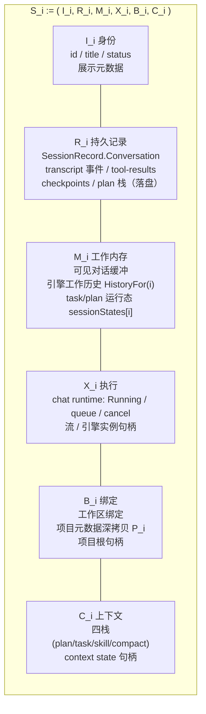
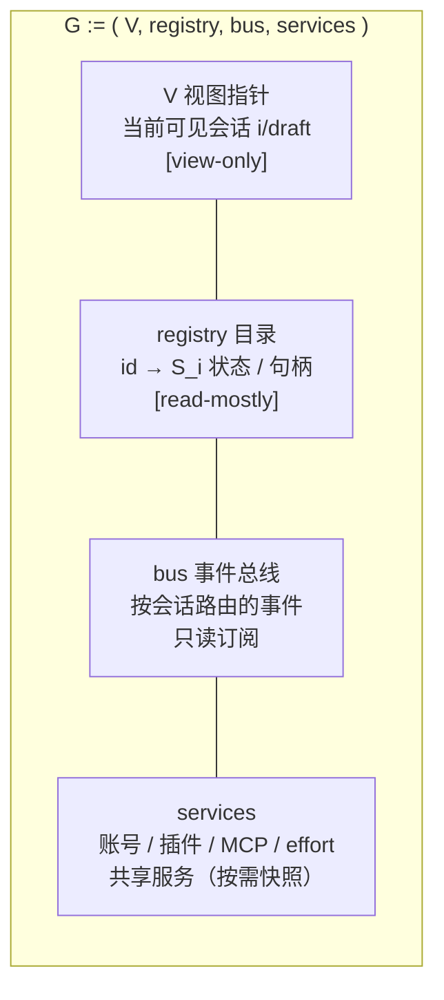
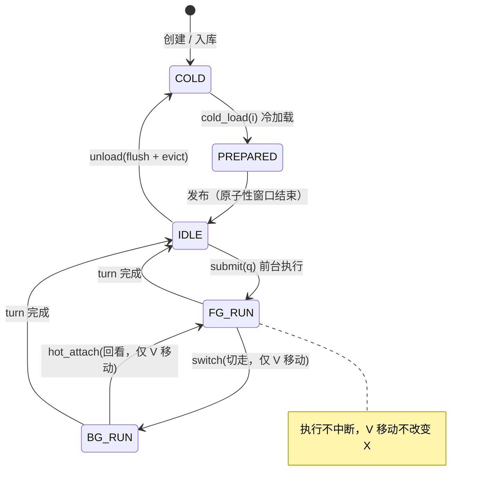
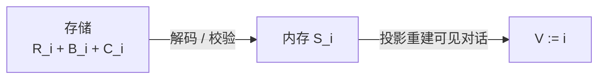
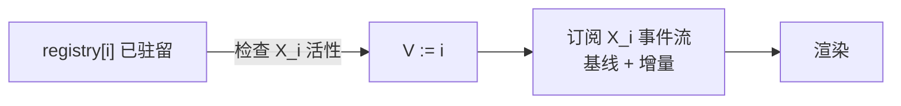
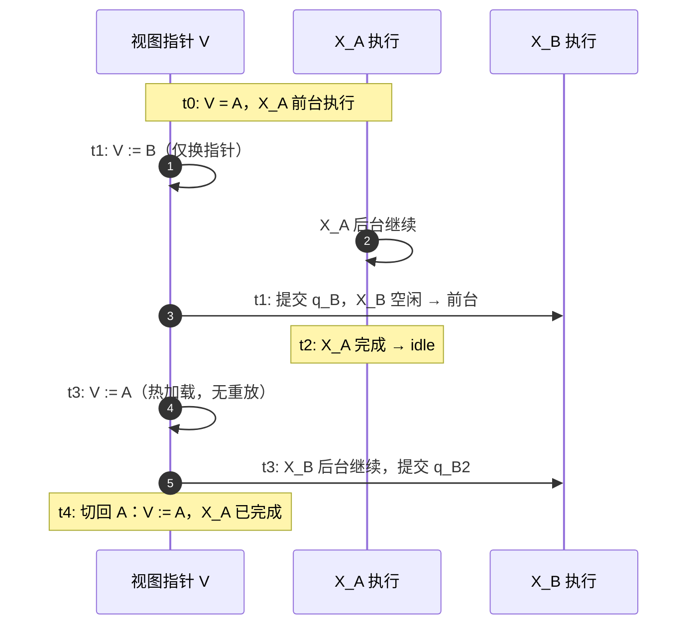
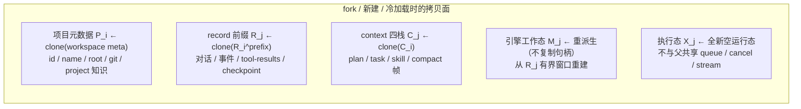
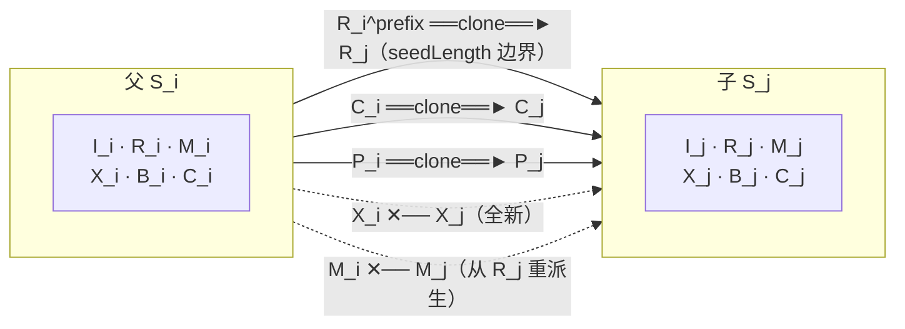
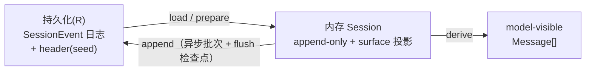
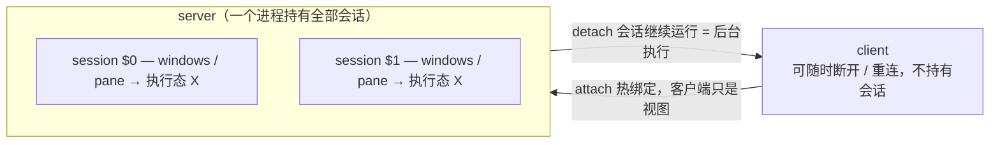

# 会话解耦数学模型与冷/热加载设计

> 日期：2026-08-30
> 状态：设计底稿（规划，尚未实现）；User Story（边界场景 + 测试用例）待用户补充
> 前置：先读 [plan.md](./plan.md)（资源清单、粒度、竞争/污染源）；表达形式与 [plan.md](./plan.md) 第 0 节统一（Mermaid）
> 调研对象：dsh（DeepSeek Harness）、ACP（Agent Client Protocol）、tmux、Claude Code 设计空间论文、puristajs/harness

---

## 0. 符号与表达形式

沿用 [plan.md](./plan.md) 第 0 节的 Mermaid 约定，并补充数学符号：

```text
S_i        第 i 个会话；V = 当前可见会话指针；G = 全局面
M / R / X / B / C / I   会话六个状态域（见 1.1）
clone(·)   深拷贝（值语义，结果与来源无共享可变引用）
persist(i) 会话 i 的落盘
──►        数据流 / 时间序 / 状态迁移
[read-own] 只读本会话域    [view-only] 只改视图指针
```

---

## 1. 数学模型

### 1.1 会话状态域分解

一个会话是一个六元组，六个域各自独立、互不相交：



全局面（不随会话切换）：



### 1.2 核心操作的形式签名

```text
cold_load(i)   : (R_i, B_i, C_i) → S_i            // 冷加载：存储 → 内存，X_i := idle，V := i
hot_attach(i)  : registry[i] 存在时 → V := i      // 热加载：仅移动视图指针 + 订阅 X_i 事件流
submit(i, q)   : q 进入 X_i 队列；i == V 时前台执行，否则后台执行
switch(i → j)  : j 未驻留 → cold_load(j)；随后 V := j
fork(i)        : 以 deep-copy 前缀创建 j（见 2 节）
persist(i)     : 只读 S_i 自身域 → 写入键 (projectID, i)
unload(i)      : persist(i) 后释放 S_i 内存，registry 仅留 COLD 元数据
```

成本语义：

```text
cold_load(i) : O(|R_i|) 解码 + 投影重建（有界窗口）；创建期间 S_i 不对外可见
hot_attach(i) : O(1) 指针切换 + 基线投影（已持久化的尾部）+ 增量事件订阅
               对 S_i 的 X/M/R 零写入
```

热加载的“不干扰”由下面这条写出来：

```text
hot_attach(i)  ⇒  ∀ 域 D ∈ {I_i, R_i, M_i, X_i, B_i, C_i}: D 不变
                 仅 G.V 改变，且向 G.bus 新增一个对 X_i 事件的只读订阅
```

### 1.3 四条不变量

```text
Ⅰ 域不相交      ∀ i ≠ j: (M_i ∪ X_i ∪ R_i) ∩ (M_j ∪ X_j ∪ R_j) = ∅
                存储键、内存对象、执行句柄均不共享（深拷贝保证）

Ⅱ 视图不写执行  V 的任何变更不得改变任何 S_i 的 X/M/R
                切换/查看 = 换指针 + 订阅，绝不进入执行路径

Ⅲ 写自有域      persist(i) 的每个读源都属于 S_i（R_i/M_i/C_i）
                禁止从 G.V 指向的其它会话域读取内容

Ⅳ 深拷贝边界    创建 / fork / 冷加载产生的引用集与来源不相交：
                clone(x) ⇒ 无别名；唯一例外是不可变共享常量与只读服务快照
```

当前代码违反 Ⅱ、Ⅲ（plan.md 的 P1/P2/P3/P4），根源就是“全局单槽（G.V 的字段）
被当成 M_i/R_i 用”。重构后这四条是编译期/测试期断言的目标。

### 1.4 生命周期自动机



状态标注：

```text
COLD          仅持久化，无内存对象（可被目录列出）
PREPARED      内存中已构造、未发布（冷加载的原子性窗口）
LIVE(IDLE)    驻留、无执行
LIVE(FG-RUN)  前台执行（V == i）
LIVE(BG-RUN)  后台执行（V == j ≠ i，X_i 独立继续）
```

### 1.5 冷/热两条路径对照

冷加载（用户视角：打开历史会话）：



读取持久记录、事件日志尾部、context state；副作用只有创建，不触碰其它会话；
等价物：ACP `session/load`（重放全部历史）/ dsh `persistence.prepare`（冷）。

热加载（用户视角：切回仍在运行的会话）：



读取 S_i 当前快照 + 事件流，不写任何域；副作用无，即使 X_i 运行中也不拿
X_i 的执行锁；等价物：ACP `session/resume`（静默恢复）/ tmux attach /
dsh `agents.resume`。

### 1.6 后台运行的时间线（视图与执行解耦）



不变量：V 的每次移动都不改变任何 X；每个 `persist(i)` 只发生在 X_i 自己的时间线上。

---

## 2. 深拷贝边界（decoupling boundary）

### 2.1 哪些内容深拷贝到会话单位





任意两个会话之间域不相交（不变量 Ⅰ）。

### 2.2 允许共享的面（只读 / 不可变）

```text
共享面（非会话所有，不参与拷贝）：
  services：账号 / 插件 / MCP / effort 等级 —— 只读引用，按需快照
  不可变常量：system 模板、limit 配置、provider 前缀缓存策略
  registry 目录元数据 —— 全局只读列表
```

### 2.3 与当前代码的差距（哪些全局槽违反 Ⅰ–Ⅳ）

引用 [plan.md](./plan.md) 第 2 节：`Snapshot.Conversation`、`Engine.History()`、
`Router.projectID`、tasks 活跃读口、`Runtime` 项目根、service 活跃镜像——
这些都属于“用 G.V 的字段冒充 S_i 的域”，重构目标就是把它们全部收进 S_i
（SessionScope），G 只留 V、registry、bus、services。

---

## 3. 调研：dsh 与其它 GUI harness 的会话解耦模型

### 3.1 dsh（DeepSeek Harness）——事件溯源 + seed 深拷贝

dsh 的会话模型是**事件溯源**：`Session` 是 append-only 的 `SessionEvent` 日志，
是唯一真源；LLM 消息历史由日志**派生**（`Session.deriveMessages()`），不单独存储；
持久化后端（JSONL / SQLite）实现同一个 `SessionPersistence` 抽象。



事件循环的 turn / step / tool 边界都是持久事件。

关键概念与你的设计一一对应：

```text
冷会话（cold）     = 持久化日志；SessionPersistence.load()/inspect()/prepare()
                    只对冷会话做“中断轮次内存配平”（合成 turn/end interrupted）；
                    活跃 id 的 load 会等待权威内存快照，活跃轮次未闭合则拒绝
热恢复（live）     = ctx.agents.resume({ resumeSessionId })：静默状态恢复，不重放历史
                    HMR 接管活跃前缀，不关闭进行中的轮次
seed（深拷贝边界） = ctx.sessions.create(id, { seed, meta }) 是 replay/fork 的同一原语；
                    session/end-seed 事件 + header.seedLength 标记“继承前缀 vs 本会话工作”
client runtime    = 重连时 Host 从持久 agent/inbox 派生整份 session/queue 快照，
                    发基线（baseline）后跟随增量事件
```

也就是说：**dsh 的“日志 + 派生投影”恰好把 `R`（日志）与 `M`（派生投影）分开，
冷加载 = 从 R 重派生，热加载 = 直接接住 live Session 的增量**；seed 的深拷贝语义
就是本设计第 2 节的拷贝面。

来源：[docs/subsystems/session.md](https://github.com/deepseek-ai/DeepSeek-Harness/blob/master/docs/subsystems/session.md)、
[docs/subsystems/persistence.zh.md](https://github.com/deepseek-ai/DeepSeek-Harness/blob/master/docs/subsystems/persistence.zh.md)

### 3.2 ACP（Agent Client Protocol）——load（冷）vs resume（热）vs suspend

ACP 的会话动词把冷/热区分成了协议级原语：

```text
session/new       新建
session/load      冷重放：重发全部历史 session/update，客户端重建视图
session/resume    静默热恢复：不重放历史，直接接住现有会话上下文
session/suspend   提议中的协作暂停：非取消，暂停在轮次边界，resume 热恢复
                  （或 load 冷重放），等待中的工具调用先完成
```

`session/resume` 的定位是“`session/load` 的子集、与存储机制解耦”：
代理只要支持 resume，适配层就可以在其上实现 load（代理回放事件、客户端落盘）。
对应到本设计：**冷加载 = load（重放 R），热加载 = resume（不重放，接住 X）**。

来源：[session-resume RFD](https://github.com/agentclientprotocol/agent-client-protocol/blob/main/docs/rfds/session-resume.mdx)、
[ACP session/suspend RFC](https://harnlang.com/protocol-contributions/acp-session-suspend.html)

### 3.3 tmux —— client-server：热 attach / detach 后台运行



tmux 是“热加载”的教科书模型：**会话的执行态永远在 server，客户端 attach/detach
只改变“谁在看”**；detach 后会话继续运行（后台），attach 不干扰执行。缺点是没有
冷加载（server 重启即丢）；session group 提供了可控共享（组内会话共享 windows）。

来源：[tmux Sessions 概念文档](https://mintlify.wiki/tmux/tmux/concepts/sessions)

### 3.4 Claude Code（设计空间论文 + 社区分析）

Claude Code 的会话解耦要点：

```text
持久化：append-only JSONL 三通道（会话 transcript / 全局 prompt 历史 / 子代理 sidechain）
并发：Runs 通过 per-session queue 串行 + 可选 global lane，防止跨通道工具/会话竞争
隔离：并行会话各自独立 git worktree（.claude/worktrees/<id>/），文件不再互相竞争
后台：后台会话由 per-user supervisor 进程托管
恢复：resume 不恢复权限——信任在每个会话重新建立（冷恢复的安全语义）
```

这印证了本设计的两个点：**深拷贝到会话单位（worktree = B_i 的项目根副本）** 和
**每会话队列（X_i 的执行隔离）**。

来源：[Dive into Claude Code（VILA-Lab）](https://github.com/VILA-Lab/Dive-into-Claude-Code)、
[arXiv 2604.14228](https://arxiv.org/abs/2604.14228)

### 3.5 其它 harness

```text
puristajs/harness  Session = 隔离操作上下文（memory/history/sandbox + 一次一个 active run）
                   UI 通过 run events 流渲染（视图与执行解耦）
mastersof-ai/harness  按用户隔离 workspace/memory/sessions + 独立 token 预算
                   （隔离单位是用户/租户，不是会话，粒度更粗）
```

### 3.6 对比表

| 模型 | 冷加载 | 热加载 / attach | 后台运行 | 深拷贝边界 | 共享面 |
|------|--------|------------------|----------|------------|--------|
| dsh（DeepSeek Harness） | `persistence.load/prepare`（事件日志重放，只修冷会话） | `agents.resume`（静默，不重放）+ client 基线快照 | Session 常驻内存，事件异步落盘 | `create(id, {seed})` + `seedLength` | workspace/cwd 元数据、provider 路由 |
| ACP | `session/load`（冷重放历史） | `session/resume`（静默恢复） | —（suspend 提议中） | — | 能力协商 / 工具注册 |
| tmux | 无（server 重启即失） | `attach`（客户端绑定 server 侧会话） | `detach` 后继续 | session group 共享 windows（可控） | server 进程 |
| Claude Code | append-only JSONL 加载 | `resume`（权限不恢复，重建信任） | supervisor 托管后台会话 | 每会话独立 worktree | 项目 CLAUDE.md |
| puristajs/harness | StateStore run 回放 | run events 流渲染 | 一次一个 active run | sandbox + workspace store | 应用边界 |
| **本设计（目标）** | `cold_load(i)`：R+B+C → S_i | `hot_attach(i)`：V:=i + 事件订阅 | X_i 独立继续 | 深拷贝 P_i / fork 前缀 / context | 仅只读服务与不可变常量 |

---

## 4. 结论：调研与你的设计的一致性

1. **冷/热双路径是行业共识**：ACP 用 `load/resume` 命名，dsh 用冷会话/活跃会话 +
   resume 语义，tmux 用 attach/detach——你的“冷加载 = 从存储重建、热加载 = 进入运行中
   会话的线程且不干扰执行”对应得严丝合缝。
2. **深拷贝到会话单位是隔离的充要条件**：dsh 的 seed、Claude Code 的 worktree、
   本设计的 `clone(P_i)` / fork 前缀拷贝，都是把“共享面”收窄到只读，保证 Ⅰ 不变量。
3. **视图与执行必须分离**：tmux 的 server/client、dsh 的 live Session + client 基线快照、
   本设计的 `V := i` + 事件订阅，都是“热加载只动视图指针”。当前 Seelex 把
   `G.V`（快照/活跃引擎/写作用域）当成执行与持久化的数据源，正是违反 Ⅱ/Ⅲ 的病灶。
4. **dsh 是最近的参照系**：它的“事件日志真源 + 派生投影 + seed 边界”模型，
   可以直接作为 Seelex `SessionScope` 重构的目标形态（R 权威、M 派生、X 常驻、B/C 深拷贝）。

---

## 5. 后续

- 按本文件第 0 节表达形式（Mermaid）补充 user story 的场景图与用例表（用户提供）；
- 每条场景逐条映射到 1.3 不变量 / 2.1 拷贝面 / [plan.md](./plan.md) 第 3 节的 P/R 清单；
- 待确认的设计决策：热加载时是否允许“只读快照 + 增量事件”回看（当前 `ErrChatRunning`
  拒绝）；项目元数据刷新后既有会话的 `P_i` 是否版本化更新（保持 Ⅰ 不变）。
