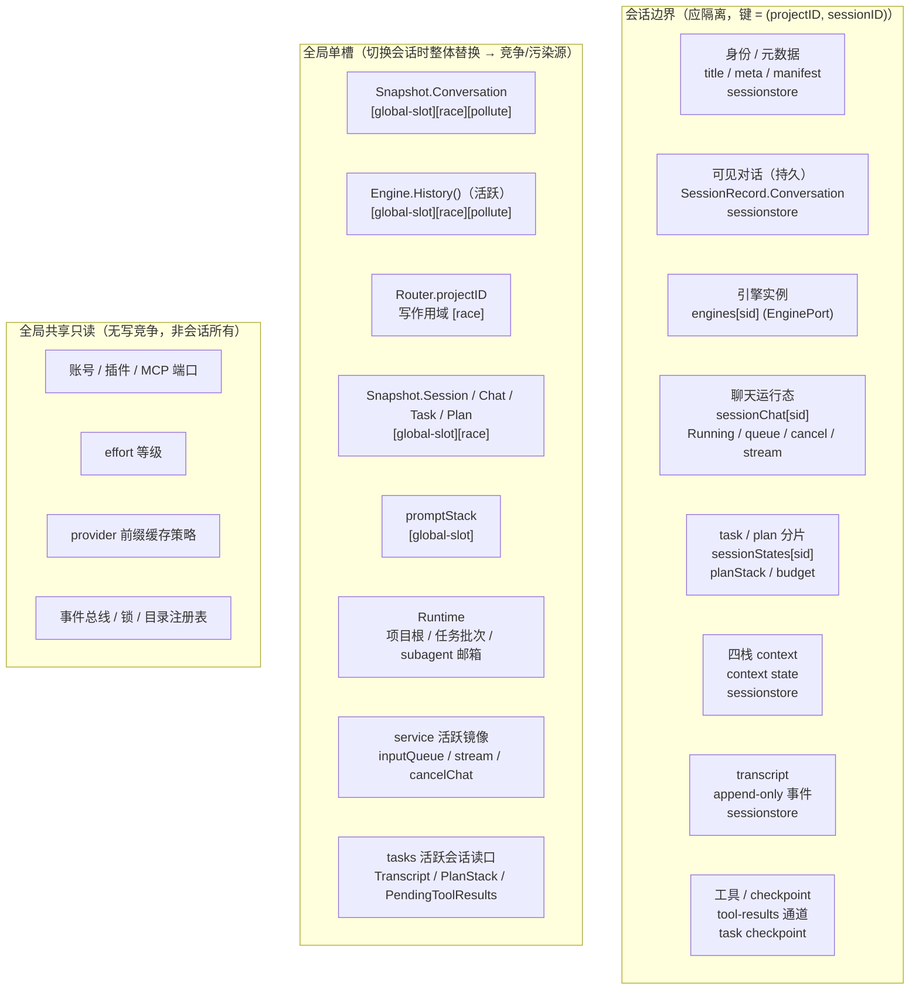
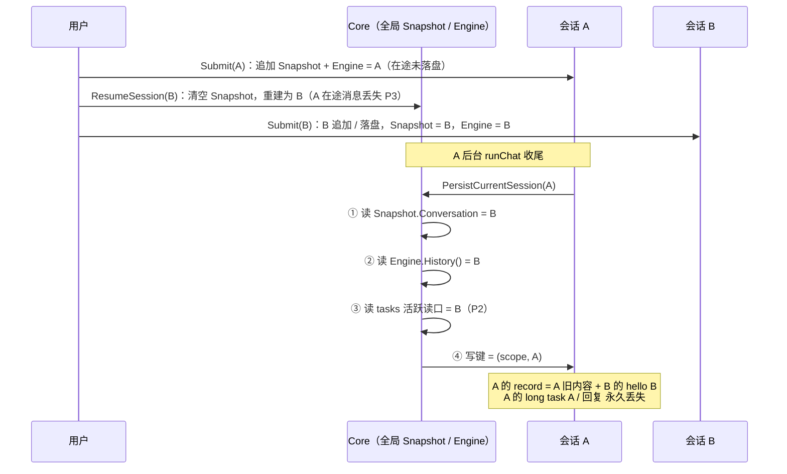
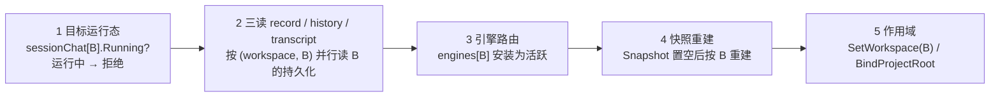
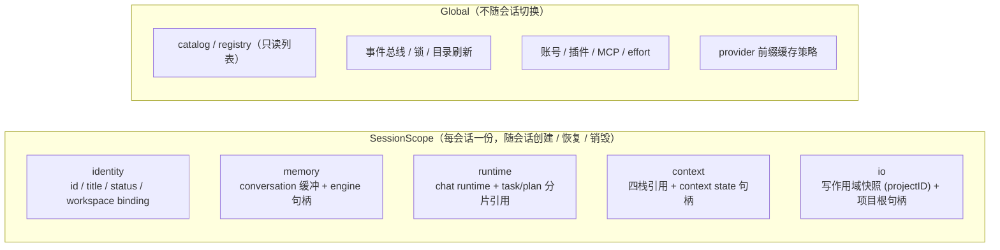
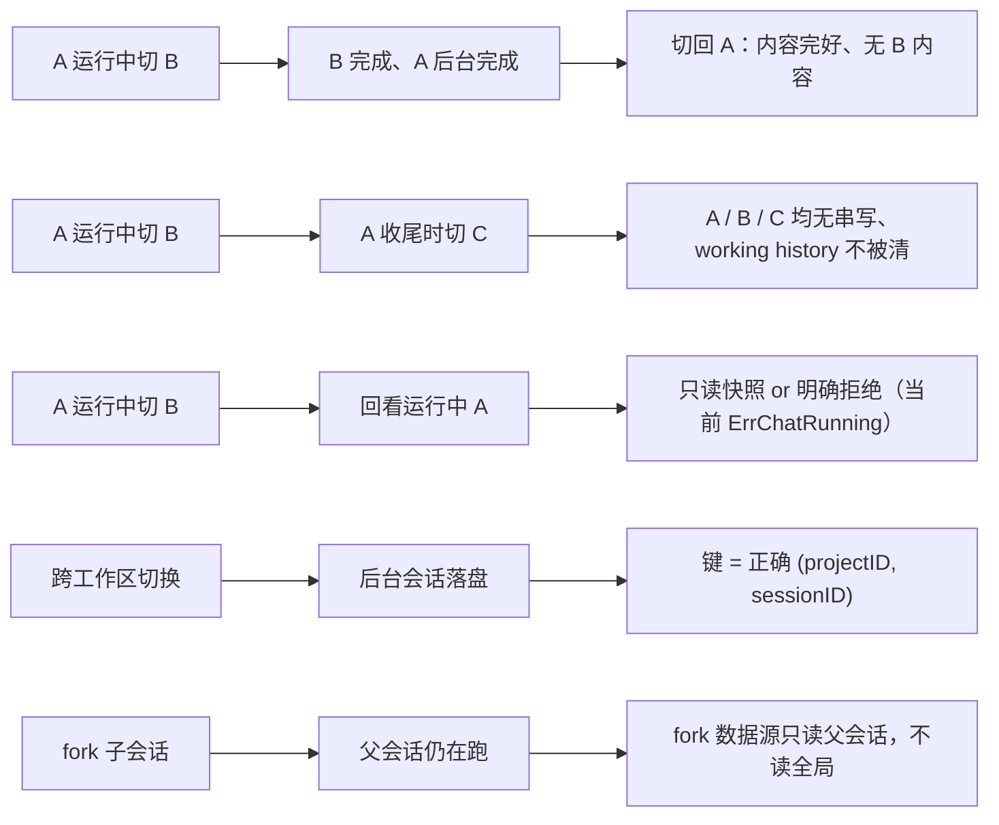

# Session 资源控制重构：资源清单、粒度与竞争/污染源

> 日期：2026-08-30
> 范围：`application/core` + `internal/adapters` + `sessionstore`（会话资源控制）
> 状态：调研底稿（规划）；User Story（边界场景 + 测试用例）待用户补充
> 关联：提交 `b82d7fa`（会话状态可见化/草稿槽位/运行中可新建草稿，含污染复现测试）；
> 表达形式统一：本文件与 [design-model.md](./design-model.md) 均用 Mermaid 画结构图

---

## 0. 表达形式约定（Mermaid 统一）

本文所有结构图统一用 Mermaid（`flowchart` / `stateDiagram-v2` / `sequenceDiagram`）；
数学符号与标注沿用以下文本语义（仅作图内 label 与注释，不再用 ASCII 画图）：

```text
──►              箭头：数据流 / 时间序 / 因果
[per-session]     标注：资源粒度应为会话级（键 = (projectID, sessionID)）
[global-slot]     标注：全局单槽，切换会话时整体替换
[race]            标注：并发读写竞争点
[pollute]         标注：会话污染点（键是 A、内容是 B，或在途内容丢失）
[ok] / [warn] / [bad]   隔离现状
```

约定：**后续一切 session 粒度设计、评审、改动一律先画 Mermaid 图再写代码**——
每张图必须标注资源粒度、写入路径与“读的是哪个会话的槽”。

---

## 1. 会话需要控制什么资源：总览



一句话结论：**键是会话级的（存储、引擎实例、聊天运行态、task/plan 分片都对），
但“可见对话、引擎历史、写作用域、task/plan 读口”仍是全局单槽**——一切竞争与污染
都发生在“以会话键写盘，却从全局活跃槽读内容”的路径上。

---

## 2. 资源清单对比：来源、粒度、隔离现状与风险

（合并上一轮“会话需要什么：属性、来源、粒度”结论，补三列：隔离现状、数据竞争、会话污染。）

| # | 资源 | 代码来源 | 当前粒度 | 隔离现状 | 数据竞争 | 会话污染 | 关键路径 / 证据 |
|---|------|----------|----------|----------|----------|----------|------------------|
| 1 | 身份 / 标题 / 更新时间 / Token | sessionstore manifest + record | 每会话 `(project, session)` | [ok] | 无 | 无 | `session_runtime/scope.go` 目录聚合 |
| 2 | 可见对话（权威持久化） | `SessionRecord.Conversation` | 每会话 | [ok] | 无 | 无 | `archive.go` record 落盘 |
| 3 | 可见对话（运行期窗口） | `Core.Snapshot.Conversation` | **全局单槽** | [bad] | [race] 单锁 + active 守卫 | **[pollute] P1** | [chat.go](../../application/core/chat.go) 活跃时 `appendMessageLocked`；[session_history.go](../../application/core/session_history.go) 切换时置空重建 |
| 4 | 引擎实例 | `EnginePort.engines[sid]` | 每会话（M1/M2） | [ok] | 无 | 无 | `engine_port.go` `HistoryFor` |
| 5 | 引擎历史（持久化读取） | `Engine.History()` | **全局活跃** | [bad] | [race] | **[pollute] P1** | [archive.go](../../application/core/session_runtime/archive.go) `SaveSessionSnapshot(sid, Engine.History(), ...)` |
| 6 | 引擎活跃指针 | `EnginePort.engine / sessionID` | 全局 | [warn] | [race] 未注册会话回退活跃引擎 | [pollute] P5（潜在） | `engineForSessionLocked` fallback |
| 7 | 聊天运行态 / 队列 / 取消 / 流 | `service.sessionChat[sid]` | 每会话 | [ok] | 无 | 无 | `session_scope.go` |
| 8 | task / plan / 预算状态 | `task_context.sessionStates[sid]` | 每会话 | [ok] | 无 | 无 | `task_context/coordinator.go` |
| 9 | task / plan 读口（非 For 变体） | `Transcript()` / `PlanStack()` / `PendingToolResults()` / `TaskCheckpoints()` | **活跃会话** | [bad] | [race] | **[pollute] P2** | `task_context_state.go` |
| 10 | 四栈 context | sessionstore context state | 每会话 | [ok] | 无 | 无 | `session_context.go` |
| 11 | 工作区绑定 | `Workspace.BindSession` | 每会话（持久映射） | [ok] | 无 | 无 | `workspace/` |
| 12 | 存储写作用域 | `Router.projectID`（`SetWorkspace`） | **全局** | [bad] | [race] 切换与后台写并发 | [pollute] P1（键漂移） | `sessionstore/router` |
| 13 | 项目根 | `Runtime.BindProjectRoot` | 全局 | [warn] | [race] | [pollute] P3（配合丢失） | `session_history.go` 恢复路径 |
| 14 | 全局 Prompt 栈 | `promptStack` / `effortManager` | 全局 | [warn] | [race] | 低（system prompt 按会话路由） | `service_state.go` |
| 15 | 活跃会话镜像 | `service.inputQueue` / `streamOutput` / `streamBatcher` / `cancelChat` | 全局 | [warn] | [race]（active 守卫） | 低 | `chat.go` / `runChat` 尾部 |
| 16 | 草稿槽位 | `service.draft` | 全局唯一（设计如此） | [warn] | 无 | 无（已有守卫） | `session_draft.go` |
| 17 | 会话状态徽标 | `sessionChat` runtime + draft | 每会话 | [ok] | 无 | 无 | `service_snapshot.go` |
| 18 | transcript / tool-results / checkpoints | sessionstore 事件库 | 每会话持久 | [ok] | 无 | 无 | `sessionstore` |
| 19 | Plan 投影 | `Snapshot.Runtime.Plan` + 会话 `activePlanID` | **混合** | [warn] | [race] | [pollute] P6（潜在） | `ActivePlanProjectionLockedFor` |

---

## 3. 竞争与污染源清单

### 3.1 会话污染源（键对、内容错 / 内容丢失）

| 编号 | 污染表现 | 机制 | 证据 |
|------|----------|------|------|
| P1 | A 后台完成后，A 的 record 混入 B 的对话与引擎历史，A 在途消息丢失 | `PersistCurrentSession(A)` 读全局 `Snapshot.Conversation` + 活跃 `Engine.History()`，写 `(scope, A)` 键 | 复现测试 [repro_session_disappear_test.go](../../repro_session_disappear_test.go) 稳定红（3/3） |
| P2 | A 的 record 混入 B 的 task/plan/transcript | `sessionRecordLocked` 调活跃会话读口 `Transcript()` / `PlanStack()` / `PendingToolResults()` / `TaskCheckpoints()` | `task_context_state.go` 非 For 变体均取 `activeSessionLocked()` |
| P3 | 后台会话在途内容丢失 | `resumeSession` 清空 `Snapshot.Conversation` 并按目标会话重建，后台会话的在途消息只存在于其引擎实例，落盘却不读它 | [session_history.go](../../application/core/session_history.go) 置空重建 |
| P4 | A 收尾清掉 B 的 working history | `runChat` 成功后 `ReleaseWorkingHistory()` 作用于活跃引擎（`port.engine` / `port.sessionID`） | `engine_port.go` |
| P5 | 后台提交打到活跃会话引擎（潜在） | `ChatStreamFor(sid)` 对未注册会话回退 `port.engine` | `engineForSessionLocked` fallback（M2 桩挂死根因同源） |
| P6 | 后台会话 prompt 混入活跃会话 plan（潜在） | 上下文装配的 Plan 投影读全局 `Snapshot.Runtime.Plan`，仅 `activePlanID` 是会话的 | `ActivePlanProjectionLockedFor` |

### 3.2 数据竞争源（同一内存槽并发读写）

| 编号 | 槽位 | 并发写方 | 现状 |
|------|------|----------|------|
| R1 | `Core.Snapshot.*` | 多个 `runChat` 尾部 / 目录刷新 worker / 切换路径 | 单锁串行，但语义上是单槽；draft 守卫仅护 Session.ID |
| R2 | `EnginePort.engine / sessionID` | `ResumeSession` 安装活跃引擎 vs 后台 `ChatStreamFor` / `ReleaseWorkingHistory` | 有 `engineCalls` 计数，fallback 仍存在 |
| R3 | `Router.projectID` | 切换/新建/解绑 vs 后台持久化 | 无隔离，后台写依赖全局 scope 定位键 |
| R4 | tasks 活跃会话读口 | 后台 runChat 收尾 vs 切换恢复 `RestoreSessionTaskLocked` | 非 For 变体无会话参数 |
| R5 | `promptStack` / `effortManager` / `lastSystemPrompt` | 切换/插件/effort 操作 vs 后台 prompt 装配 | 全局状态 |
| R6 | `Runtime`（项目根 / current task batch / subagent 邮箱） | 切换 vs 后台会话 `SetCurrentTaskBatch` | 全局单例 |
| R7 | service 活跃镜像（inputQueue/stream/cancelChat） | 切换 vs 后台 runChat | active 守卫，但仍是全局槽 |

### 3.3 主链路：A 后台完成 → 交叉写盘（P1 + P2 + P3 合流）



### 3.4 切换路径：全局槽整体替换

`resumeSession(B)` 执行序列（持 TransitionLock）：



关键：A 的 runChat 仍持有 engines[A]，但 `PersistCurrentSession(A)` 读的是
① 全局 Snapshot（已被 B 重建）+ ② 活跃 `Engine.History()`（已是 B）
→ 键是 A、内容是 B。

---

## 4. 重构目标形态：SessionScope 控制器（规划，尚未实现）

目标：把第 2 节标 `[bad]` / `[warn]` 的资源收进**会话作用域句柄**，
全局只保留“视图指针”与“共享服务端口”。



配套规则（待 User Story 校验）：

1. **显式键**：所有会话写盘必须显式 `(projectID, sessionID)`，禁止隐式依赖全局 `Router.projectID`；
2. **禁止读全局活跃槽**：后台会话的收尾/持久化只读自己的 scope（`HistoryFor(sid)`、`TranscriptFor(sid)`、
   `PlanStackFor(sid)` 等 For 变体），删除非 For 活跃读口或加编译期断言；
3. **切换 = 换视图指针**：`resumeSession` 只交换全局“当前视图”指针，不搬运、不销毁任何会话资源；
4. **共享服务按需快照**：账号/插件/MCP/effort 不随会话绑定，运行时只读引用；
5. **草稿是唯一全局唯一会话**（设计如此，槽位保留但不得参与并行写）。

---

## 5. 待用户补充：User Story（边界场景 + 测试用例）

> 占位。用户将提供 user story，主要覆盖边界场景与所需测试用例；
> 届时按本文件第 0 节表达形式补充“场景图 + 用例表”，并逐条映射到第 2/3/4 节。

建议 user story 至少覆盖以下空位（供参考，非定稿）：



---

## 6. 验证证据（当前状态）

- 污染复现：`go test . -run TestBackgroundSessionCompletionMustNotPolluteOwner -count=3`
  → 3/3 FAIL（确定性），断言输出 `A conversation = [system:已恢复会话, user:first A, assistant:ok, user:hello B, assistant:ok]`；
- 切换/新建草稿：`TestRealSwitchWhileChattingRepro` / `TestRealBeginNewWhileChattingRepro` /
  `TestRealNewSessionDraftRetainedOnSwitchRepro` → 3/3 PASS（“切到空闲会话”已不死锁）；
- 核心包：`go test ./application/core/... -count=1` → 全部 PASS。
