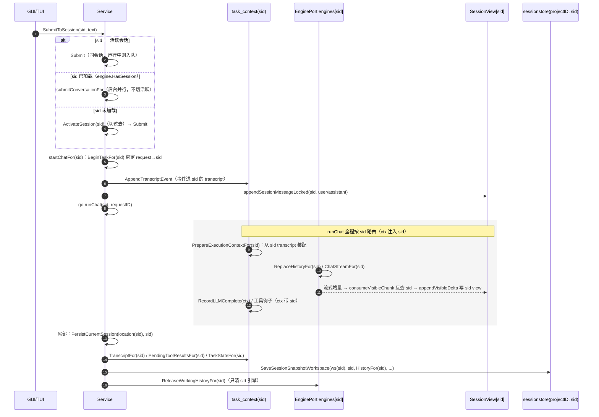
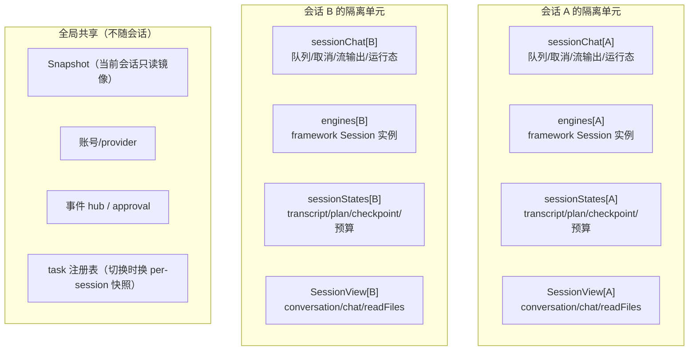

# 多会话异步运行链路与运行中切换策略

> 日期：2026-08-31
> 状态：已实现（阶段 0/1/2 落地，见 [implementation-record.md](./implementation-record.md)）；
> 本文件描述**当前代码事实**，不写规划
> 前置：[design-model.md](./design-model.md)（六元组与不变量 Ⅰ–Ⅳ）、[plan.md](./plan.md)（资源/P-R 清单）

---

## 0. 一句话结论

**执行按会话隔离（X_i 独立）、视图按会话投影（SessionView）、切换只动视图
指针（V）、持久化只写自己的键**——运行中切换既不干扰执行、也不串写数据。

---

## 1. 多会话异步运行的当前链路



### 1.1 入口路由（[service_input.go](../../application/core/service_input.go)）

`SubmitToSession(ctx, sid, text)` 三分支：

- `sid` 是当前活跃会话 → `Submit`（同会话，运行中则进该会话自己的队列）；
- `sid` 已加载（`EnginePort.HasSession(sid)`，即引擎已实例化）→
  `submitConversationFor` 在目标会话上下文中**后台并行启动**，不切换活跃会话；
- `sid` 未加载 → `ActivateSession(sid)`（先切换恢复）再 `Submit`。

### 1.2 启动（[chat.go](../../application/core/chat.go) `startChatFor`）

锁内完成会话级装配：`sessionChatLocked(sid)` 运行态检查（同会话并发返回
`ErrChatRunning`）、`nextChatRequestIDLocked` 生成跨会话唯一 requestID、
`BeginTaskFor(sid, requestID, ...)` 登记 `requestToSession` 绑定、
`AppendTranscriptEventLocked`（事件按 requestID 反查落入 sid 的 transcript）、
`setSessionChatLockedFor(sid, chat)` 与 `appendSessionMessageLocked(sid, ...)`
（写入 sid 的 `SessionView`，活跃会话同步镜像 `Snapshot`）。

锁外：`SetCurrentTaskBatch(sid, requestID)`（会话级默认批次）、
`injectPendingSubagentContextsFor(sid)`、`publishSessionEvent`（事件按会话
路由），然后 `go runChat(...)`。

### 1.3 执行（[chat.go](../../application/core/chat.go) `runChat`）

ctx 注入 sid，全程按会话路由：

1. `PrepareExecutionContextFor(sid, requestID, input)`：从 **sid 的 transcript**
   装配 provider 历史 → `ReplaceHistoryFor(sid)` 写 sid 引擎；
2. `ChatStreamFor(sid)`：会话路由的流式对话（引擎注册表
   [engine_port.go](../../internal/adapters/engine_port.go)）；
3. 流式增量：`consumeVisibleChunk` / `appendVisibleDelta` 经
   `SessionIDForRequest(requestID)` 反查 sid，写 sid 的 `SessionView`
   （后台会话也实时维护可见投影——hot_attach 回看有数据）；
4. 模型输出 / 工具钩子：`RecordLLMComplete(ctx)`、
   `handleToolStart/Complete(ctx, ...)` 按 ctx 的 sid 写 transcript 与 view；
5. 尾部：`PersistCurrentSession(location(sid), sid)` → 只读 sid 的域
   （`TranscriptFor(sid)` / `PendingToolResultsFor(sid)` / `TaskStateFor(sid)` /
   `HistoryFor(sid)` / `TaskSnapshotFor(sid)`），写 `(workspaceID, sid)` 显式键
   （[archive.go](../../application/core/session_runtime/archive.go)）；
6. `ReleaseWorkingHistoryFor(sid)`：只清 sid 引擎的工作历史，不清活跃会话
   （P4 收敛）；
7. 队列消费：sid 的 `inputQueue` 在尾部单点合并批量发送下一轮。

### 1.4 持久化键（R3 收敛）

- 应用层：`PersistCurrentSession(location, sid)` 全 For 读源 + 显式
  `(workspaceID, sid)` 键；`SaveSessionRecordWorkspace` /
  `SaveSessionSnapshotWorkspace` / `LoadSessionRecordWorkspace` 全部显式项目键；
- framework 层：`DurableHistory` 通过 `SetWorkspaceResolver` 按会话 workspace
  显式键落盘（[durable_history.go](../../sessionstore/durable_history.go)），
  后台 ChatStream 结束时即使 Router 已切走也不串写他域；
- task 快照：`TaskSnapshotFor(sid)` 返回切换时保存的会话分片
  （[seelebridge/ports.go](../../seelebridge/ports.go)）。

---

## 2. 运行时运行隔离机制

两个会话并行运行，靠三层叠加：**结构上每会话一份完整状态单元、路径上全链
按会话路由、锁协议上执行在全局锁外**。

### 2.1 结构隔离：每个会话一个完整状态单元



关键：**执行时的可写状态没有跨会话共享引用**。A 的引擎、队列、transcript、
可见投影与 B 的是不同内存对象（不变量 Ⅰ）；`SessionView[A]` 只在 A 是活跃时
才镜像到 `Snapshot`，后台会话的写入到不了全局快照。

### 2.2 路径隔离：全链按 sid 路由

- 提交：`SubmitToSession(sid, text)` 先判 `HasSession(sid)`，已加载就在 sid
  上下文后台启动，不切活跃；
- 绑定：`startChatFor(sid)` 里 `BeginTaskFor(sid, requestID, ...)` 把
  requestID→sessionID 写进 `requestToSession`，这是所有反查的锚；
- 执行：`runChat` 开头 `ctx = withSessionID(ctx, sid)`，之后
  `PrepareExecutionContextFor(sid)` / `ChatStreamFor(sid)` /
  `RecordLLMComplete(ctx)` / 工具钩子全部从 ctx 或 requestID 反查出 sid，
  只碰 sid 的分片；
- 流式增量：`consumeVisibleChunk` / `appendVisibleDelta` 用
  `SessionIDForRequest(requestID)` 反查，后台会话流式内容写
  `SessionView[sid]`，不碰 `Snapshot.Conversation`；
- 事件：`publishSessionEvent(kind, rev, requestID, sid, payload)` 经
  `SessionAwareHub.PublishSession` 按会话路由，前端订阅按 sid 过滤。

没有任何执行路径"顺手"用全局活跃会话：要么带 sid 参数，要么带 requestID
反查；反查不到的兜底才是活跃会话——这是阶段 0 把持久化端口改成全 For 变体的
原因（编译期堵死兜底路径）。

### 2.3 锁与并发模型：执行在全局锁外

- `Core.Mu` 是唯一全局锁，只保护共享结构本身（`sessionChat` map、
  `SessionViews` map、`Snapshot`），临界区都是短操作（取指针、写一条消息、
  bump 修订号）；`ChatStream`、provider 往返、落盘 I/O 全在锁外——两个会话的
  `runChat` 可同时阻塞在各自的 provider 请求上，互不等待；
- 每会话引擎有自己的内部锁（framework `session.Session` 锁 /
  `EnginePort.mu`）：A 持 A 引擎锁时，B 的恢复/提交绝不碰 A 的引擎
  （`SetSystemPromptFor` 按会话路由，`ReplaceHistoryFor` 只替换目标会话）；
- `TransitionLock` 只串行化切换/新建/绑定工作区等跨会话事务，不进入执行
  路径——切换 B 时运行中的 A 不受影响；
- 死锁防护关键：**hot_attach 不拿运行中会话的引擎锁**（`SetSystemPromptFor`
  曾走全局活跃引擎，运行中会话的 Session 锁被 ChatStream 全程持有会阻塞到
  LLM 返回——已按会话路由修复，见 c925a61）。

### 2.4 收尾与落盘隔离

- 收尾只清自己：`ReleaseWorkingHistoryFor(sid)` 只清 `engines[sid]`；
- 落盘只读自己：`PersistCurrentSession(location, sid)` 的每个读源都是 sid 的
  For 变体（`TranscriptFor(sid)` / `TaskStateFor(sid)` / `HistoryFor(sid)` /
  `TaskSnapshotFor(sid)`），键是显式 `(workspaceID, sid)`；
- framework 侧同样：`DurableHistory` 的 workspace 解析闭包让 A 的 ChatStream
  结束时即使 Router 已切到 B 的 workspace，也写 A 自己的键。

### 2.5 共享面与边界

仍共享：账号/provider 池、事件 hub、approval、task 注册表（全局单例，切换时
整体替换 + 每会话保留快照）、`promptStack`（system prompt 按会话渲染）。

尚未隔离：`CancelChat` 只取消活跃会话（后台会话按会话取消未落地，TC-A2-03）、
`TaskAdd` 批次盖章仍走注册表全局默认、`Snapshot.Runtime.Plan` 仍是全局槽
（P6，hot_attach 时从 `PlanStackFor(sid)` 投影，执行期装配读活跃快照）。

---

## 3. 会话运行中的切换策略

```mermaid
flowchart LR
    A[ResumeSession(sid)] --> B{引擎已驻留?<br/>HasSession(sid)}
    B -- 否 --> C[cold_load<br/>三读 record/history/transcript<br/>重建引擎 + 装载 SessionView]
    B -- 是（含运行中） --> D[hot_attach<br/>只换视图指针 + 投影 sid scope]
    D --> E[Snapshot.Session = sid]
    D --> F[Snapshot.Chat/Task/Plan ← sid 域<br/>不触碰 sid 的 X/M/R]
    C --> E
```

### 2.1 切换 = 换视图指针（不变量 Ⅱ）

`resumeSession(sid)` 先判 `sessionLoaded(sid)`（[session_history.go](../../application/core/session_history.go)）：

- **冷加载 `cold_load`**（引擎未驻留）：三读 `record / history / transcript`
  并行加载 → `RestoreSessionTaskLocked` 恢复任务/plan → 构建 `SessionView`
  装载 → 引擎 `ResumeSession(sid, engineHistory)`；
- **热加载 `hot_attach`**（引擎已驻留，含运行中；
  [session_lifecycle.go](../../application/core/session_lifecycle.go)）：
  `SetSystemPromptFor(sid)`、工作区投影（`SetWorkspace(sid.workspace)` +
  `SetSessionWorkspace`）、`SwitchSessionTasks(sid, TaskSnapshotFor(sid))`
  （工作台切到 sid 的快照）、锁内把 `Snapshot` 指向 sid 的
  view/chat/task/plan。**不重建历史、不触碰 sid 的 X/M/R**。

### 2.2 运行中会话允许回看（阶段 2 决策）

运行中会话 `ResumeSession(A)` 从旧的 `ErrChatRunning` 改为 `hot_attach` 回看：
`Snapshot` 投影 A 的实时 `SessionView`（含流式增量），A 的
`ChatStreamFor(A)` 执行不中断。空闲驻留会话的切换同样走 hot_attach，不重放
历史（TC-LC-02 验证引擎历史逐字节不变）。

### 2.3 互斥与提交

- **切换互斥**：`resumeSession` / `BeginNewSession` / `BindWorkspace` 等跨会话
  事务持 `TransitionLock`（会话域自持）；运行中的 A 不受影响，因为它的
  `runChat` 只拿 `Core.Mu` 的短临界区，不经过 TransitionLock；
- **提交分层**：目标会话运行中 → 输入进该会话自己的 `inputQueue`（不污染
  活跃快照）；空闲 → 直接启动；队列在 `runChat` 尾部单一消费点批量发送
  （Session-backed 引擎在 `OnIterationComplete` 检查队列并中断本轮，交给
  尾部统一提升）；
- **收尾与切换并发安全**：A 后台完成时 `PersistCurrentSession(location(A), A)`
  用显式键写 A 的 workspace；即使此刻活跃已是 B、Router 作用域是 Y，A 也落
  X 键（TC-A4-01/02/03 验证），`DurableHistory` 的 workspace 解析闭包保证
  framework 侧同样不串键；
- **引擎活跃回退已取消**：`engineForSessionLocked` 未注册会话返回 nil，后台
  提交不会打到活跃引擎（P5 收敛）。

---

## 4. 与不变量对照

| 不变量 | 实现落点 |
|--------|----------|
| Ⅰ 域不相交 | `engines[sid]` / `sessionStates[sid]` / `SessionView[sid]` 每会话一份；fork 深拷贝前缀 |
| Ⅱ 视图不写执行 | `hot_attach` 只换 `Snapshot.Session.ID` + 投影 scope；不重建历史、不拿运行中会话引擎锁 |
| Ⅲ 写自有域 | `PersistCurrentSession(location, sid)` 全 For 读源 + 显式 `(projectID, sid)` 键 |
| Ⅳ 深拷贝边界 | fork / 冷加载按会话重建；`DurableHistory` 显式 workspace 键 |

---

## 5. 已知边界（当前实现限制）

1. `CancelChat(requestID)` 目前只取消**活跃**会话的请求
   （[service_input.go](../../application/core/service_input.go)）；后台会话的
   按会话取消是加固项（TC-A2-03），未落地；
2. `TaskAdd` 的 BatchID 盖章仍走 registry 全局默认批次（L3 部分修复，
   worktable 工具路径会话化是遗留）；
3. `Snapshot.Runtime.Plan` 仍是全局槽（P6）：hot_attach 时从
   `PlanStackFor(sid)` 投影，执行期装配仍读活跃快照；
4. task_context 非 For 活跃读口（`Transcript()` / `PlanStack()` 等）仍在具体
   类型上供 root 包调用方使用，持久化端口已不再暴露。

---

## 6. 验证

```text
go test ./application/core/ -count=1                                    → ok
go test -race ./application/core/ -run 'Test' -count=1                  → ok（4.2s）
go test . -run 'TestBackgroundSessionCompletionMustNotPolluteOwner|TestBackgroundCompletionWhileSwitchingToC|TestNoPhantomSessionInForeignWorkspace|TestWorkspaceSwitchConcurrentWithBackgroundPersist' -count=1 → ok
go test -race . -run 'TestBackgroundSessionCompletionMustNotPolluteOwner|TestBackgroundCompletionWhileSwitchingToC|TestNoPhantomSessionInForeignWorkspace|TestWorkspaceSwitchConcurrentWithBackgroundPersist' -count=1 → ok
go vet ./...                                                              → ok
```

关键用例：TC-A1-02/03（后台收尾域隔离）、TC-A2-01（收尾与 C 运行并发交错）、
TC-A3-01/02（运行中 resume 回看不触碰执行）、TC-A4-01/02/03（跨工作区键
漂移，含 framework DurableHistory）、TC-LC-02/03（hot_attach 无重放 /
unload 释放 scope）。
