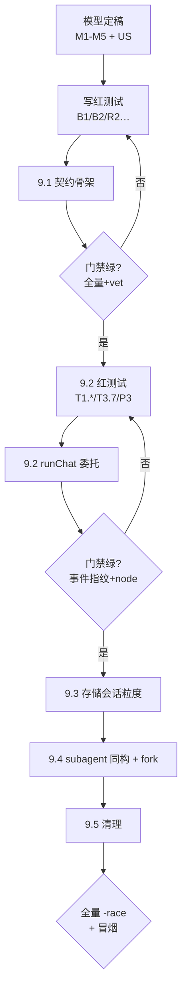
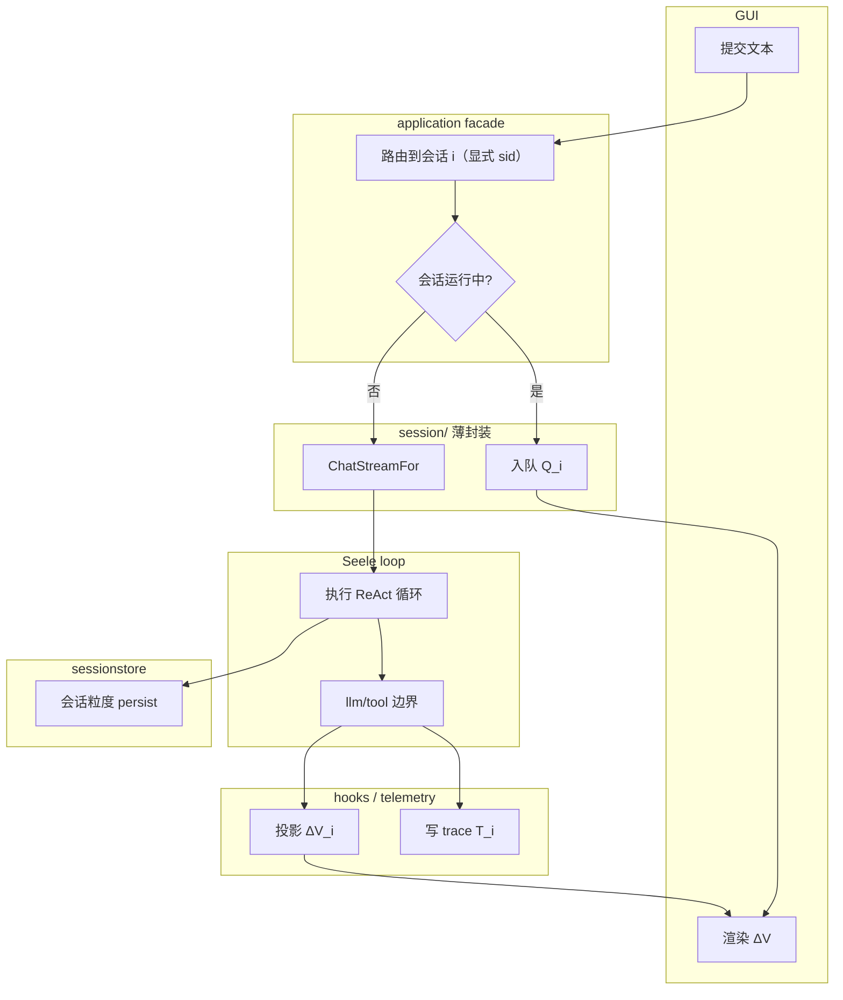
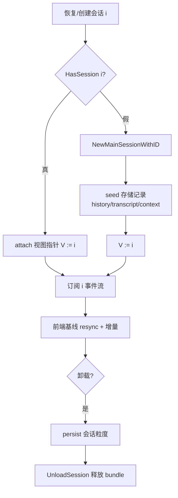
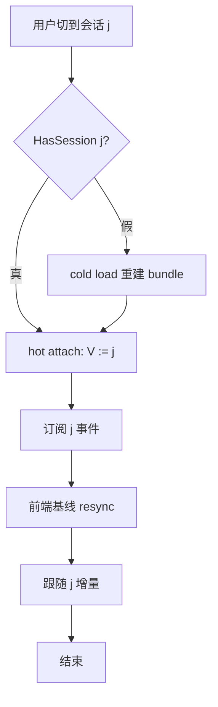
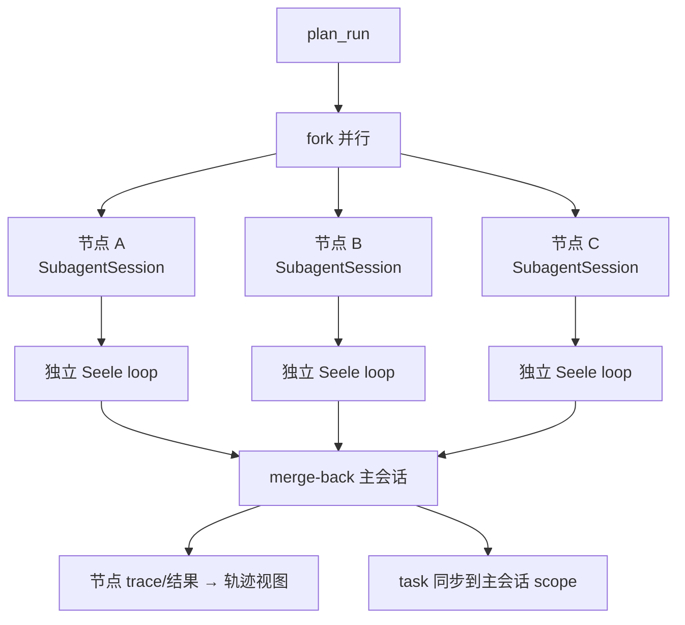
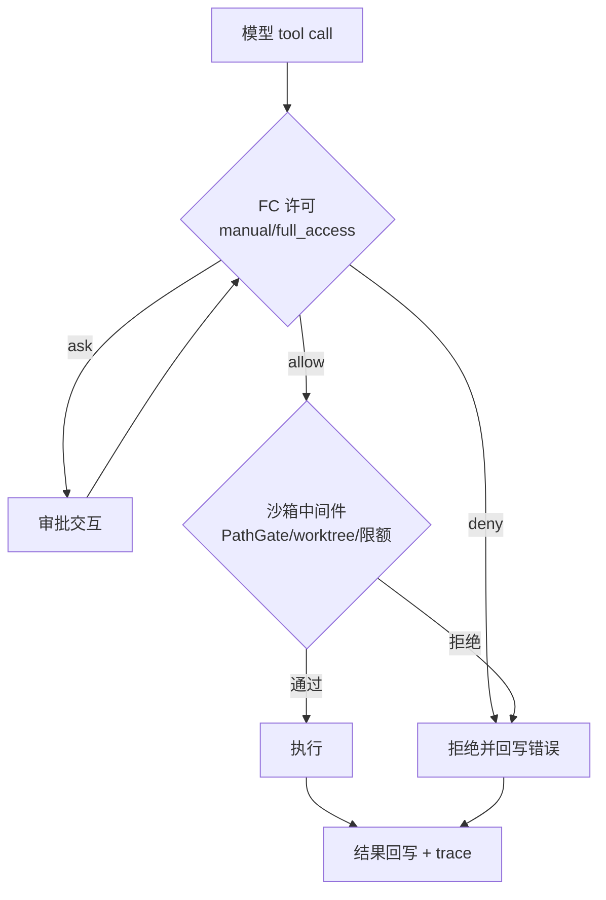
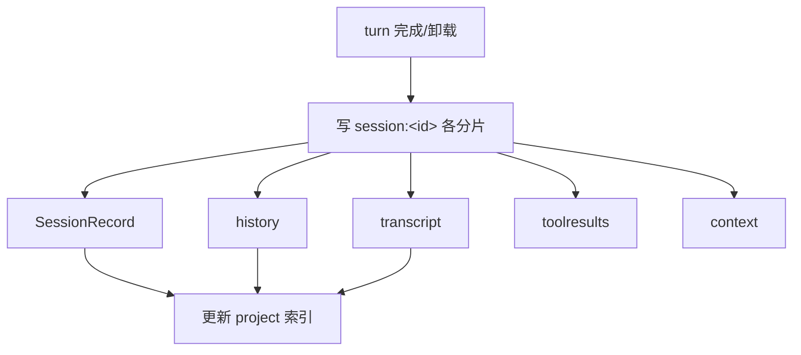
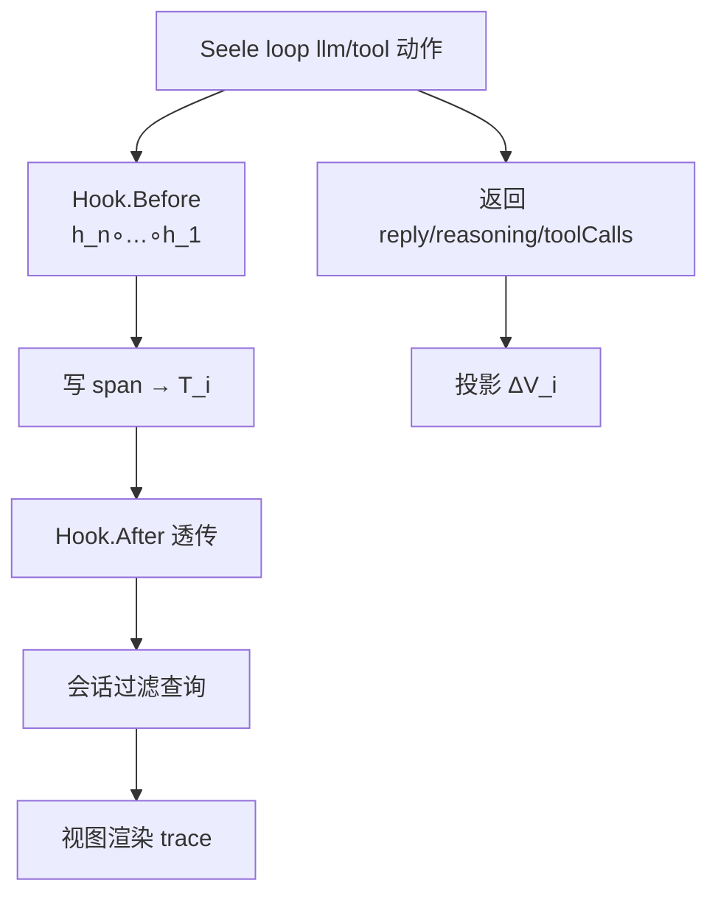
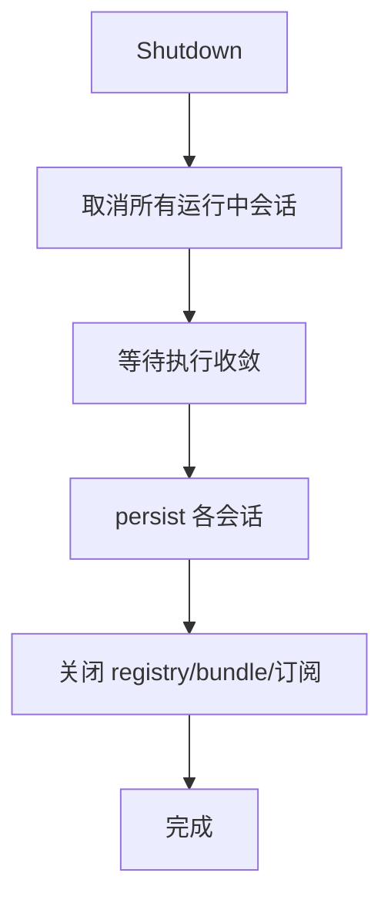
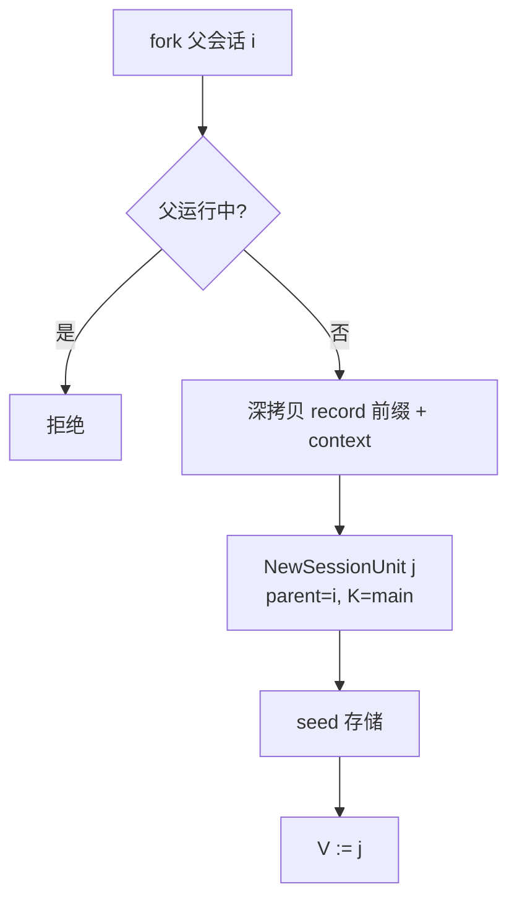

# 会话薄封装活动图（Activity Diagrams）

> 配套 [mbd-overview.md](./mbd-overview.md)（阶段/门禁）、[mbd-us.md](./mbd-us.md)（用例）、
>       [test-cases.md](./test-cases.md)（四维度测试）

## 图例（UML 活动记号）

- 圆角矩形：动作；菱形：判定；实心条：fork/join；横向泳道：参与者；
- 每个图下方标注「对应测试」：以 F/B/P/R 四维度命名（见 test-cases.md）。

## AD-0 MBD 开发流程（阶段 + 门禁）

对应测试：R1/R2 全套、阶段门禁（§10）。

## AD-1 提交与执行（submit → 排队 → loop → 结果 → 持久化）

对应测试：UC1（F）、T1.3（F）、T2.8 队列上限（B）、P5 事件指纹（P）、R4 后台不取全局锁（R）。

## AD-2 会话生命周期（冷加载 / 热挂载 / 卸载）

对应测试：T2.3 状态机（B）、T4.4 冷加载（F/B）、T4.1/T4.2 热挂载零写入（B）。

## AD-3 视图切换（仅移 V）

对应测试：T4.1–T4.3（B/F）、T4.5 切换竞态（B）、T4.6 死锁（R）。

## AD-4 subagent 会话并行执行与 merge-back

对应测试：UC7（F，子代理独立会话）、UC8 merge-back（F）、P1 并行规模（P）、R1 race（R）。

## AD-5 工具调用管线（FC 许可 + 沙箱中间件）

对应测试：UC9 顺序断言（F）、既有 permission/pathgate（F）、B3 限额（B）。

## AD-6 会话粒度持久化

对应测试：T2.6（F/B）、B6 幂等（B）。

## AD-7 trace 注入与结果返回

对应测试：T1.1（F/R）、T1.2 链复合（F/B）、T1.3 结果返回（F）、T1.4 过滤（F/B）。

## AD-8 并发关闭（Shutdown）

对应测试：R5 并发 Shutdown（R）、P4 资源有界（P）。

## AD-9 fork 会话

对应测试：T2.7 深拷贝隔离（B）、UC5（F）。

## 索引

| 图 | 主题 | 主要测试 |
|---|---|---|
| AD-0 | MBD 阶段流程 | 阶段门禁 |
| AD-1 | 提交/执行/持久化 | UC1, T1.3, T2.8, P5, R4 |
| AD-2 | 会话生命周期 | T2.3, T4.4, T4.1/4.2 |
| AD-3 | 视图切换 | T4.1–4.6 |
| AD-4 | subagent 并行 + merge-back | UC7/8, P1, R1 |
| AD-5 | FC + 沙箱管线 | UC9, B3 |
| AD-6 | 会话粒度持久化 | T2.6, B6 |
| AD-7 | trace 注入/返回 | T1.1–1.4 |
| AD-8 | 并发关闭 | R5, P4 |
| AD-9 | fork | T2.7, UC5 |
