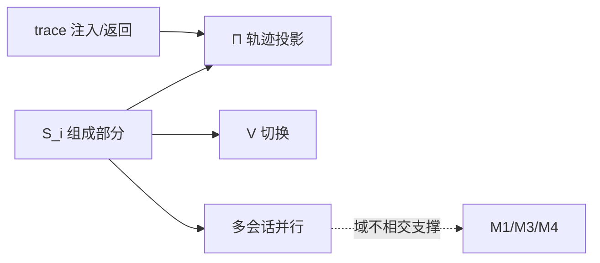

# 会话薄封装数学模型（Formal Models）

> 配套 [mbd-overview.md](./mbd-overview.md) / [mbd-us.md](./mbd-us.md)
> 记号沿用 design-model.md：S_i = 会话 i；V = 当前视图指针；域 D ∈ {E, V, Q, C, B}。

## §1 M1 trace 注入与结果返回

### 1.1 符号

- Σ = 遥测事件类型（llm.before / llm.after / tool.before / tool.after / …）
- Span = (traceID, spanID, parent, type, startedAt, endedAt, attrs)
- T_i = 会话 i 的 trace 存储（span 集合）
- H = Hook 链：H = h_n ∘ … ∘ h_1（函数复合），h_k: Hook → Hook（Wrapper 闭包）
- Loop: 会话 i 的 ReAct 循环 L_i

### 1.2 注入模型

Seele loop 在动作边界调用 hook：

```text
Before:  (ctx, σ) → (ctx', inv),  ctx 携带当前 span
After:   (ctx', inv, eff) → Δspan
注入:    inject(L_i, σ) = h_n(…h_1(base)(σ)…)
T_i     := T_i ∪ Δspan(L_i 执行产生的 span)
```

链中的 seelex 装饰器（Summary/Stage/Diagnostic）是 h_k，只做记录与透传，
不改变 L_i 的控制流。

### 1.3 结果返回模型

```text
Stream_i: (Q_i, input) → (output, ΔT_i, ΔV_i)
output = (reply, reasoning, toolCalls, err)
ΔT_i   = 本次调用写入 T_i 的 span
ΔV_i   = 投影到 View 的增量（M3）
```

结果不是「loop 闭包返回值内嵌 trace」，而是：loop 返回语义结果，
副作用（span）经 hook 链写入 T_i，seelex 侧查询。

### 1.4 不变量

- INV-T1: ∀ i≠j: T_i ∩ T_j = ∅（trace 按会话隔离；当前共享 MemoryTracer 需加会话过滤）
- INV-T2: 查询返回的 trace 只含该会话 span

### 1.5 测试

- trace 会话过滤测试（9.2 新增）：并发两会话执行，各自 trace 视图不相交

## §2 M2 session 组成部分

### 2.1 单元元组

```text
S_i := (id_i, K_i, parent_i, E_i, V_i, Q_i, C_i, B_i, status_i)

K_i   ∈ {main, subagent}
parent_i ∈ ID ∪ {⊥}          // subagent 归属主会话；main 为 ⊥
E_i   = 引擎/loop 句柄（opaque，seelebridge bundle 持有 Seele Session）
V_i   = (Conversation_i, Chat_i, ReadFiles_i)   // 可见投影
Q_i   = 输入队列（seq 有序）
C_i   = (plan, task, skill, compact) 四栈
B_i   = (workspaceID_i, parent_i, kind_i)       // 绑定
status_i ∈ {draft, idle, running, queued}
```

### 2.2 状态机（薄：由引擎状态驱动，不自造）

```text
δ: status × event → status
idle   --submit(空闲)--> running
running--submit(运行中)--> running（入队 Q_i）
running--完成/取消--> idle
idle   --unload/persist--> cold（释放 E_i）
cold   --NewSessionWithID+seed--> idle
```

热/冷判定 = `HasSession(id_i)`（bundle 存活），不是独立维护的 COLD/PREPARED/LIVE。

### 2.3 持久化键（会话粒度）

```text
store: session:<id_i>                → SessionRecord
       session:<id_i>:history        → DurableHistory
       session:<id_i>:transcript     → 事件日志
       session:<id_i>:toolresults    → 工具结果
       session:<id_i>:context        → 四栈
索引:  project:<p>:sessions          → {id_i}   // 项目 = 会话集合
       session:<id_i>:binding        → B_i
```

### 2.4 不变量

- INV-S1（域不相交）：∀ i≠j: 状态(E_i,V_i,Q_i,C_i) ∩ 状态(E_j,V_j,Q_j,C_j) = ∅
- INV-S2（种类正确）：K_i = subagent ⇒ parent_i ≠ ⊥；K_i = main ⇒ parent_i = ⊥
- INV-S3（写自有域）：S_i 的任何写经 session 端口，键含 id_i

### 2.5 测试

- session/domain_test（域不相交/队列隔离）、S0 污染测试、fork 隔离测试

## §3 M3 组成部分 → 前端投影（对话投影 Π_conv + 轨迹投影 Π_traj）

### 3.1 同一数据源，两种投影

```text
输入：View_i.Conversation（原始消息：role / content / tool / reasoning_content）
输出1：ChatItems_i     = Π_conv(Conversation_i)   // 对话视图（聊天 tab）
输出2：Trajectory_i    = Π_traj(Conversation_i)   // 轨迹视图（轨迹 tab）
```

### 3.2 对话投影 Π_conv（低密度、可读性优先）

```text
user        → 全量 markdown
assistant   → 回复正文 + 思考 chip（reasoning_content 一行带过）
tool / tool_result → 工具 chip 一行（name / status / duration / size）
system/notice → 通知
key: message:<id> / tool:<id>（与轨迹同一 key 方案）
```

职责：聊天场景的高可读投影；工具与思考压成一行，完整内容经同一 key
跳转到轨迹视图。

### 3.3 轨迹投影 Π_traj（高密度、诊断优先）

```text
响应类型分类：user→input；assistant→llm；tool/tool_result→tool（配对合并）；
error→error；system→notice
Trajectory_i = {(kind, key, name, status, duration, size, in/out, think)}
```

职责：Network 风格全量查看（IN/OUT/THINK + 上下文轴）。

### 3.4 共享分类/配对（两种投影的共同底层）

```text
同一 Conversation_i；tool 请求+结果按 tool.id 配对（缺 id 回退 name+顺序）；
key 全局唯一（消息 ID 全局计数器），保证增量渲染稳定与 chip↔轨迹互跳。
```

### 3.5 trace 与两种投影的关系

- 对话/轨迹 = Π_conv / Π_traj(View.Conversation)（可见对话派生）
- trace（telemetry）= T_i（执行 span，经 M1 会话过滤）
- 轨迹视图显示 Π_traj；trace 视图显示 T_i 的会话投影——数据源分离、语义一致

### 3.6 不变量

- INV-M3-1: Π_conv 与 Π_traj 均确定性（同输入同输出，纯函数）
- INV-M3-2: 两种投影都只含会话 i 内容（前端按 session_id 过滤增量）
- INV-M3-3（一致性）: 对同一 tool 记录，Π_conv 与 Π_traj 的
  status / duration / size 一致（同一分类函数派生）；chip 与轨迹行
  使用同一 key，点击互跳必然命中

### 3.7 测试

- components.test.mjs（对话投影分类/思考 chip/工具 chip/确定性）
- trajectory.test.mjs（轨迹投影分类/配对/确定性）
- protocol sid 过滤用例（两种投影共享的会话过滤）
- chat↔trajectory 一致性用例（同一 tool 在两视图状态/耗时/体量一致 + 跳转命中）

## §4 M4 视图切换

### 4.1 切换操作

```text
switch(i→j):
  若 HasSession(j) = false: cold_load(j)：store→重建 S_j
  V := j
  订阅 j 的事件流；前端基线 resync 后跟随增量
```

### 4.2 不变量（视图不写执行）

```text
INV-M4: switch(i→j) 不改写任何 S_k 的 E/V/Q/C/B（k 任意）
只允许: V 变化 + 订阅变化 + 前端基线变化
```

等价于 design-model 的「hot_attach 只移指针」；冷加载的「重建」也只发生在
目标会话自身（新 bundle），不触碰其它会话。

### 4.3 测试

- hot_attach 快照指纹（切换前后 X/M/R 字节级不变）
- lifecycle/switch deadlock 测试

## §5 M5 多会话并行

### 5.1 共享与隔离

```text
全局 G = (V, registry, bus, services)      // 唯一共享面
每个 S_i 独立持有 E_i/V_i/Q_i/C_i/B_i
services = 账号/provider/插件/effort（只读引用 + 快照）
```

### 5.2 并行执行模型

```text
∀ i≠j: S_i 与 S_j 的执行互不等待（除 G 的短临界区）
L_i 运行在独立 goroutine；I/O（provider/落盘）在锁外
会话写经 per-session 锁；G 的临界区微秒级
```

### 5.3 不变量

- INV-M5-1: ∀ i≠j: state(S_i) ∩ state(S_j) = ∅（无共享可变引用）
- INV-M5-2: race-free（-race 全绿）
- INV-M5-3: 会话 i 的输入只进 Q_i（路由只认显式 sid，防 TOCTOU）

### 5.4 测试

- session_stress_test（6 会话并行 + 切换风暴 + 队列并发，-race）
- session_decoupling_test（后台增量在活跃持全局锁时不被阻塞）

## 6. 模型关系图


