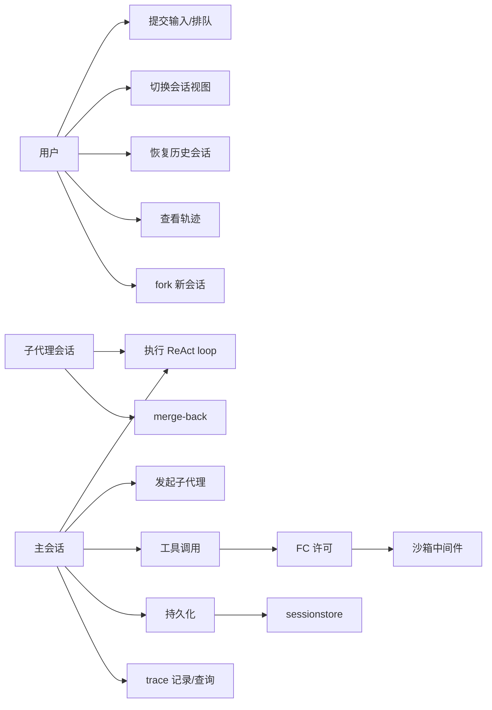

# 会话薄封装用例建模（Use-Case Modeling）

> 配套 [mbd-overview.md](./mbd-overview.md) / [mbd-models.md](./mbd-models.md)

## 1. 参与者

- **用户**：通过 GUI/TUI 与主会话交互。
- **主会话（MainAgentSession）**：用户级会话，持有 Seele 引擎/loop。
- **子代理会话（SubagentSession）**：plan 节点级独立会话，向主会话 merge-back。
- **Seele（框架）**：引擎 + ReAct loop + telemetry。
- **sessionstore**：会话粒度持久化。
- **沙箱**：工具调用中间件。

## 2. 用例图

## 3. 用例详述

### UC1 提交输入 / 排队
- 前置：存在主会话单元。
- 主流程：用户提交文本 → application → session.Submit → 空闲则 ChatStreamFor，
  运行中则入队。
- 后置：可见消息进入 View，队列状态更新。
- 不变量：队列只属于该会话（M5 域不相交）。

### UC2 切换会话视图
- 前置：目标会话存在（热/冷）。
- 主流程：hot attach（仅移 V）或 cold load（重建 bundle + 移 V）→ 前端基线 resync。
- 不变量：切换不触碰目标会话执行态（M4）。

### UC3 恢复历史会话
- 前置：sessionstore 有 `session:<id>` 记录。
- 主流程：LoadSession → NewMainSessionWithID seed → V:=id。
- 不变量：恢复后引擎历史与存储一致（会话粒度键）。

### UC4 查看轨迹
- 前置：会话有可见消息/工具记录。
- 主流程：轨迹视图 = M3 投影（conversation → records），trace 视图 = M1 会话过滤。
- 不变量：投影确定性、按会话隔离（M3/M1）。

### UC5 fork 新会话
- 前置：父会话非运行中。
- 主流程：会话粒度深拷贝 record 前缀 + 上下文栈 → 新 SessionUnit。
- 不变量：深拷贝边界（引用不相交）。

### UC6 执行 ReAct loop
- 主流程：session.Engine.ChatStreamFor → Seele loop → hooks 投影。
- 不变量：loop 归属会话单元，seelex 不重写（9.2 后）。

### UC7 发起子代理
- 主流程：plan 节点 → NewSubagentSessionWithID → 独立 loop。
- 不变量：子代理是独立会话（M2 K 种类 + parent 关联）。

### UC8 merge-back
- 主流程：子代理结果合并回主会话视图/上下文。
- 不变量：只经 session 端口写主会话（域不相交）。

### UC9 工具调用（FC 许可 + 沙箱中间件）
- 主流程：模型 tool call → FC 许可（权限判定）→ 沙箱中间件（PathGate/worktree/限额）
  → 执行 → 结果回写。
- 不变量：FC 授权即沙箱 allowance；沙箱不改变工具注册与执行语义。

### UC10 持久化
- 主流程：会话粒度 SaveSession/History/Transcript/ToolResults/Context。
- 不变量：原子单位 = 会话；项目 = 集合索引。

### UC11 trace 记录/查询
- 主流程：Seele loop 经 telemetry hook 链写入 → session 过滤查询。
- 不变量：trace 按会话隔离（M1）。
