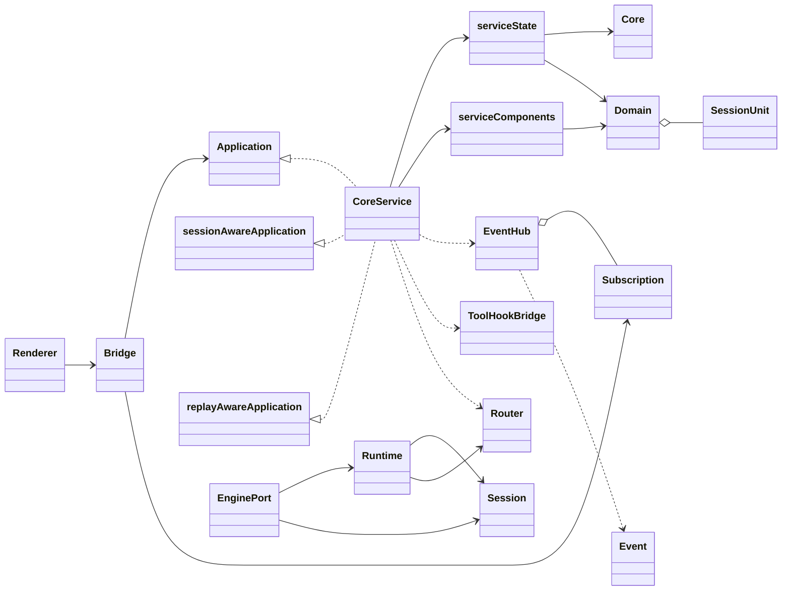
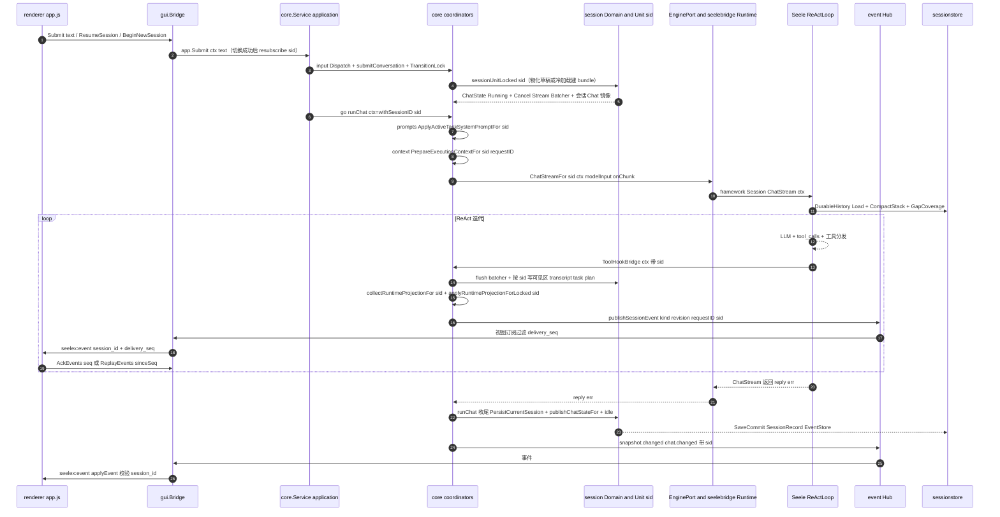
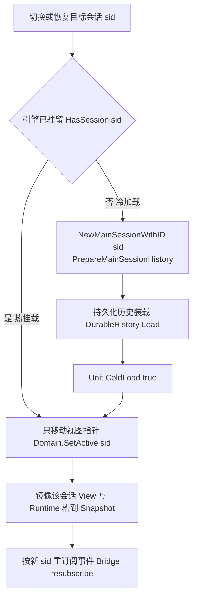

# 会话域架构图解：生态位与端到端数据流

> 性质：**一次性工作包辅助图**，不是长期事实来源；一切以代码与测试为准。
> 覆盖现状（波 1 提交 `834c203` 之后）；G1~G7 的**目标形状**见
> [target-design.md](target-design.md)，与本文“现状”栏并行阅读。
> 结构若随波 2+ 演进（Unit 槽扩展、锁拆分、快照分型），本文应同步更新。

## 1. SessionUnit 的生态位

`session.SessionUnit` 是**会话域的资源单元**（`S_i`），一个会话一份；`session.Domain`
是单元注册表与视图指针 V 的唯一持有者（actor 化，无共享 mutex）。`application/core`
不自己持有会话容器，只经 `Domain` 取单元、经 `Unit` 读会话状态。

`SessionUnit` 现在的字段职责：

| 成员                                 | 生态位                                        |
| ---------------------------------- | ------------------------------------------ |
| `ID / Kind / ParentID / Title`     | 身份与血缘（main / subagent、父会话、标题）              |
| `Runtime model.RuntimeState`       | **每会话运行时投影槽**（G1 波 1 新增；进程级原件在 G3 分型前整份拷贝） |
| `Revision uint64`                  | 该会话快照修订号（INV-G5：与进程 revision 互不相干）         |
| `Chat / Cancel / Stream / Batcher` | 聊天运行态桥：权威 ChatState、取消函数、可见输出流、流式批处理       |
| `Queue *InputQueue`                | 该会话排队输入（seq 有序，Payload 不透明）                |
| `View *View`                       | 该会话可见投影（对话/游标/ReadFiles）                   |
| `Context *ContextStack`            | 会话级上下文栈句柄                                  |
| `Binding SessionBinding`           | workspace / parent / kind 绑定               |
| `Engine EngineHandle`              | 引擎句柄（opaque；真引擎在 seelebridge bundle 内）     |
| `status / loaded`                  | 薄状态机（draft/idle/running/queued；引擎热/冷判定）    |

生态位一句话：**Unit 是“会话专属事实”的挂载点**——聊天运行态、可见投影、排队、
运行槽、未来（刀 4）的 composer/effort/approval 都收在这里；视图指针只是
`Domain.ActiveID()`，展示由 `view_state` 镜像，不参与事实判定。

## 2. struct / interface 生态位总览

角色图例（与上图节点一一对应，接口/实现关系见文字说明）：

- `Renderer`：app.js / client-state.js / protocol.js。
- `Bridge`：Wails 桌面适配（invoke 入口 + `seelex:event` 下发），持有 `Application`
  窄端口与视图 `Subscription`。
- `Application` / `sessionAwareApplication` / `replayAwareApplication`：GUI 定义在
  调用方一侧的窄接口（生产实现 `*core.Service`；虚线继承即“实现”关系）。
- `CoreService`：`application.Service = core.Service`，由 `serviceState` 与
  `serviceComponents` 组成。
- `Core`：internal/state 共享内核（`Mu` / `Snapshot` / `Deps` / `Events` /
  `Approval`）。
- `serviceState`：core 根状态（嵌入 Core，持有 `*session.Domain`、draft、chatSeq）。
- `serviceComponents`：view / tasks / sessions / prompts / context / history /
  subagent / input 各协调器（view 镜像 V，sessions 管目录，tasks 管任务/plan）。
- `Domain`：session actor（units 注册表 + activeID 视图指针）。
- `SessionUnit`：一个会话一份（字段表见第 1 节）。
- `EnginePort`：internal/adapters，实现 `contract.SessionChatEngine`
  （engines 注册表、telemetry 会话标签、`TokenCountFor(sid)`）。
- `Runtime`：seelebridge（sid → sessionBundle、planExecutor、telemetry hook Chain）。
- `Session`：外部 Seele framework ReActLoop / ContextComponents。
- `ToolHookBridge`：工具事件回写 core 的桥。
- `EventHub` / `Subscription` / `Event`：application/event 投递与订阅。
- `Router`：sessionstore（DurableHistory / EventStore / SessionGranularStore /
  SessionMetaStore），事实轨落盘。

要点：

- **端口在调用方一侧**：`gui.Application`/`sessionAwareApplication`/
  `replayAwareApplication` 是 GUI 定义给宿主实现的窄接口；生产实现是
  `*core.Service`（经 `application.New` 别名）。
- **共享内核**：`state.Core` 只放锁、权威 `Snapshot`、外部端口 Deps、事件与审批
  通道；业务协调器（view/tasks/sessions/prompts/context/...）各自独立，避免
  域间互相持有实现。
- **会话域单向依赖**：`core → session → sessionstore`；`session` 不 import
  core 的实现包（流类型用 `VisibleOutputSink`/`StreamBatcherSink` 接口收纳）。
- **引擎在另一侧**：`EnginePort` 是 framework Session 的应用适配面；真会话
  （bundle）归 seelebridge Runtime，按 sid 建/存，热/冷由 `HasSession` 判定。

## 3. 请求从前端进入的端到端数据流

对应关系说明：

1. **入口**：前端只碰 `Bridge`；Bridge 保持薄，业务判断在 `application`。
2. **会话定位**：提交前先确保 sid 存在（物化草稿或恢复会话）；切换类命令成功后
   Bridge 按新 sid 重订阅。
3. **执行**：真正跑在独立 goroutine（`runChat`），ctx 里带 sid；引擎与工具回调
   都靠 ctx 路由，绝不回读“当前视图”当事实源。
4. **写回**：可见区/transcript/task/plan/runtime 全部按 sid 写回自己的
   `SessionUnit`（View/Runtime 槽），只有视图会话才镜像到 `Core.Snapshot`。
5. **下发**：事件经 Hub 按订阅键过滤，Bridge relay 带 `session_id` 与
   `delivery_seq`，前端协议层再做一次防御性校验，随后回执水位。
6. **落盘**：事实走 sessionstore（DurableHistory/EventStore/SessionRecord），
   按会话绑定项目解析键，不随视图切换漂移。

## 4. 热挂载 vs 冷加载（切换/恢复分支）

两者的分界就是“要不要重建引擎 bundle / 从持久化恢复”：热挂载绝不触碰运行中会话
的引擎锁，冷加载只在目标空闲时发生。

## 5. 阅读提醒

- 本文是波 2+ 会话的上下文速记；开工前仍以源码和测试为准。
- 刀 4（G4）会把 composer/effort/fullAccess/approval/子代理树挂到 Unit 上并
  早分配 SID；刀 3 会把 `RuntimeState` 里进程级原件移出会话快照；届时本文件
  “SessionUnit 字段表”与第 2/3 节需同步修订。
