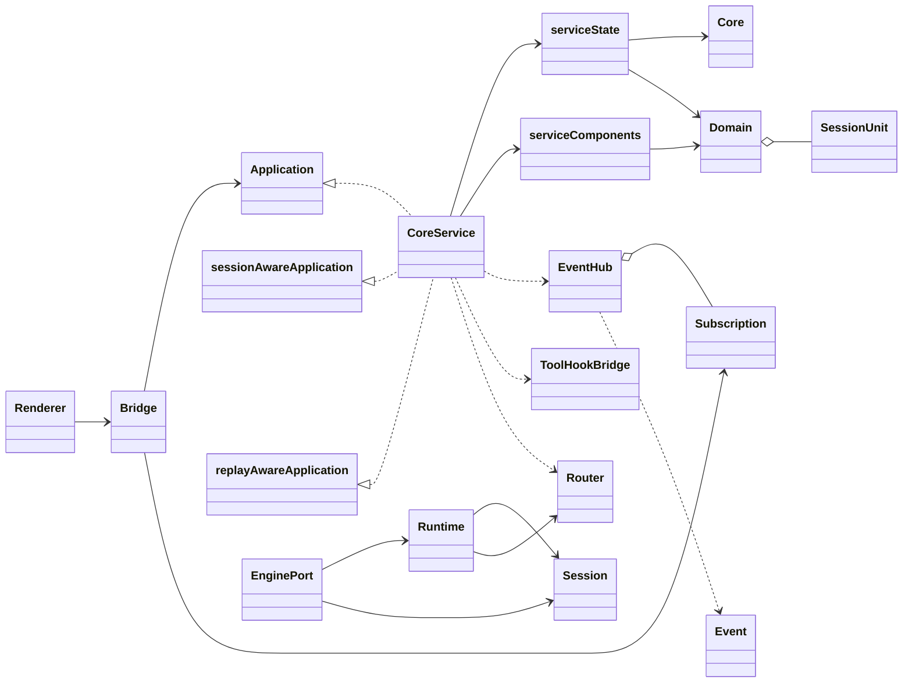
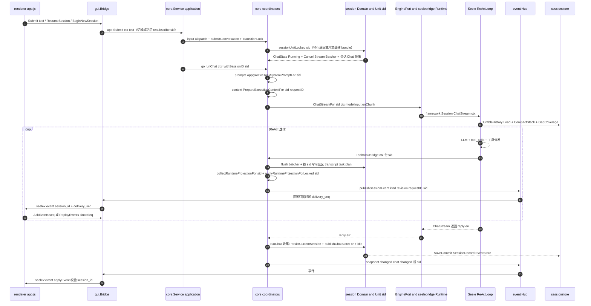
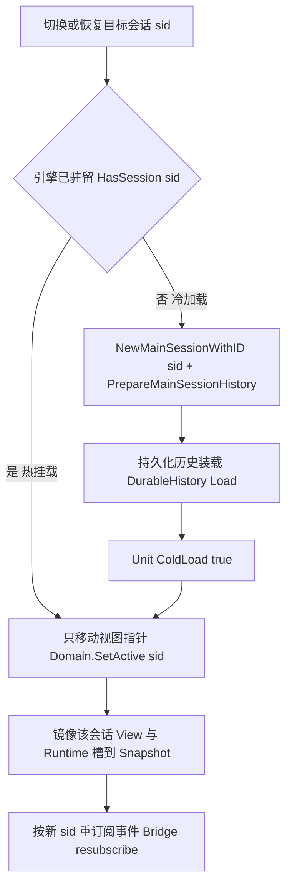

# 会话域架构图解：生态位与端到端数据流

> 性质：**一次性工作包辅助图**，不是长期事实来源；一切以代码与测试为准。
> 覆盖现状（波 4 部分收口 `5eadfb5` 之后）；G1~G7 的**目标形状**见
> [target-design.md](target-design.md)，与本文“现状”栏并行阅读。
> 结构若随波 3+ 演进（Unit 槽扩展、锁拆分、快照分型），本文应同步更新。

## 1. SessionUnit 的生态位

`session.SessionUnit` 是**会话域的资源单元**（`S_i`），一个会话一份；`session.Domain`
是单元注册表与视图指针 V 的唯一持有者（actor 化，无共享 mutex）。`application/core`
不自己持有会话容器，只经 `Domain` 取单元、经 `Unit` 读会话状态。

`SessionUnit` 现在的字段职责：

| 成员 | 生态位 |
|---|---|
| `ID / Kind / ParentID / Title` | 身份与血缘（main / subagent、父会话、标题） |
| `Runtime model.RuntimeState` | **每会话运行时投影槽**（G1 波 1 新增；进程级原件在 G3 分型前整份拷贝） |
| `Revision uint64` | 该会话快照修订号（INV-G5：与进程 revision 互不相干） |
| `Chat / Cancel / Stream / Batcher` | 聊天运行态桥：权威 ChatState、取消函数、可见输出流、流式批处理 |
| `Queue *InputQueue` | 该会话排队输入（seq 有序，Payload 不透明） |
| `View *View` | 该会话可见投影（对话/游标/ReadFiles） |
| `Context *ContextStack` | 会话级上下文栈句柄 |
| `Binding SessionBinding` | workspace / parent / kind 绑定 |
| `Engine EngineHandle` | 引擎句柄（opaque；真引擎在 seelebridge bundle 内） |
| `status / loaded` | 薄状态机（draft/idle/running/queued；引擎热/冷判定） |
| `approvalIDs` | 本会话待批审批（波 4：observe 按 sid 记账；非空 → Status=awaiting_approval） |
| `resident` | 引擎 bundle 驻留标记（波 4 G6：驱逐释放 bundle 后 false，Unit/View 保留） |

生态位一句话：**Unit 是“会话专属事实”的挂载点**——聊天运行态、可见投影、排队、
运行槽、未来（刀 4）的 composer/effort/approval 都收在这里；视图指针只是
`Domain.ActiveID()`，展示由 `view_state` 镜像，不参与事实判定。

### 1.1 引擎 bundle（sessionBundle）是什么

`seelebridge.sessionBundle` 是**一个逻辑会话在 seelebridge 侧的独立引擎运行时
槽位**，代码见 `seelebridge/runtime_bundle.go`：

```go
type sessionBundle struct {
    mu      sync.Mutex                   // 这个会话自己的锁（ChatStream 全程持有）
    session *frameworkSession.Session    // 真引擎：外部 Seele ReActLoop/上下文
    hooks   *frameworkSession.LoopHooks  // 装配给该会话的 loop hooks
    binding sessionBindings              // 会话绑定：ctxStore/mainHistory/mainSessionID
}
```

`Runtime` 用 `bundles map[sid]*sessionBundle` 登记（`bundlesMu` 只护注册表）；
`bundleFor(sid)` 不存在就新建并登记，并把 `activeSessionID` 指向它（legacy
兼容）；本结构禁止整体复制（内含锁与活动句柄）。

“bundle = 一捆”的命名含义：一个会话能跑，不是裸引擎对象，而是把
**引擎实例 + 会话自己的锁 + hooks + 会话绑定（历史/上下文存储/主会话 ID）**
捆在一起；锁在 bundle 内，多会话因此可并行且互不抢全局锁。

与 `SessionUnit` 的对应关系（同一个 sid 两端各一个槽）：

| | `SessionUnit`（应用/会话域侧） | `sessionBundle`（seelebridge 执行侧） |
|---|---|---|
| 管什么 | 状态与展示：ID/View/Queue/Chat/Runtime 槽/Revision/Binding | 能不能跑：真引擎/锁/hooks/持久化绑定 |
| 重量 | 轻量 | 重（真框架 Session） |
| 热/冷 | `loaded` 标记 | bundle 是否在内存 = `HasSession(sid)` |
| 刀 4 早分配 SID | 先建 Unit | **不建 bundle**（首次提交/冷加载才建） |
| 刀 6 驻留 LRU | Unit 可保留 | **被逐出的是 bundle**（引擎内存） |

### 1.2 波 4 演进（2026-09-03，部分落地）

- **approval 会话化**：`ApprovalRequest.SessionID` + broker observer
  `(sessionID, requestID, interaction)` + `Pending()/PendingBySession()`；
  seelebridge 权限中间件/ask_approve/PlanApprovalGate 源头携带会话归属；
  core `observeInteraction` 按 sid 记账并路由事件，单格
  `Snapshot.Interaction` 只镜像当前视图会话审批，hotAttach 激活后镜像
  首笔待批；GUI 侧栏 awaiting/archived 徽标 + 状态行待批计数。
- **驻留 LRU**：`seelexctx.Limits.ResidentSessionLimit`（默认 6）；core
  会话治理持有 `residentOrder`（ViewMu 护）——冷加载/热切换/物化 touch，
  超限驱逐最旧空闲驻留（先 `PersistCurrentSession` flush，再引擎
  `UnloadSession`，Unit 标记 `resident=false`，重开冷加载）。
- **G7 第一片**：`sessionstore.EventStore.LoadRange`（会话/Seq 区间含端点；
  倒置显式报错，(0,0)=全量），统一事件库读回面就绪。

热挂载 = bundle 还在内存，切换只移视图指针；冷加载 = bundle 不在，用
`NewMainSessionWithID(sid, hooks)` 重建再装历史。

## 2. struct / interface 生态位总览



角色图例（与上图节点一一对应，接口/实现关系见文字说明）：

- `Renderer`：app.js / client-state.js / protocol.js。
- `Bridge`：Wails 桌面适配（invoke 入口 + `seelex:event` 下发），持有 `Application`
  窄端口与视图 `Subscription`。
- `Application` / `sessionAwareApplication` / `replayAwareApplication`：GUI 定义在
  调用方一侧的窄接口（生产实现 `*core.Service`；虚线继承即“实现”关系）。
- `CoreService`：`application.Service = core.Service`，由 `serviceState` 与
  `serviceComponents` 组成。
- `Core`：internal/state 共享内核（`ViewMu` / `Snapshot` / `Deps` /
  `Events` / `Approval`；ViewMu 只护 Snapshot 与可见投影）。
- `serviceState`：core 根状态（嵌入 Core，持有 `*session.Domain`、draft、chatSeq）。
- `serviceComponents`：view / tasks / sessions / prompts / context / history /
  subagent / input 各协调器（view 镜像 V，sessions 管目录，tasks 管任务/plan）。
- `Domain`：session actor（units 注册表 + activeID 视图指针）。
- `SessionUnit`：一个会话一份（字段表见第 1 节）。
- `EnginePort`：internal/adapters，实现 `contract.SessionChatEngine`
  （engines 注册表、telemetry 会话标签、`TokenCountFor(sid)`）。
- `Runtime`：seelebridge（sid → sessionBundle、planExecutor、telemetry hook Chain）。
- `Session`：外部 Seele framework ReActLoop / ContextComponents。
- `ToolHookBridge`：工具事件回写 core 的桥。
- `EventHub` / `Subscription` / `Event`：application/event 投递与订阅。
- `Router`：sessionstore（DurableHistory / EventStore / SessionGranularStore /
  SessionMetaStore），事实轨落盘。

要点：

- **端口在调用方一侧**：`gui.Application`/`sessionAwareApplication`/
  `replayAwareApplication` 是 GUI 定义给宿主实现的窄接口；生产实现是
  `*core.Service`（经 `application.New` 别名）。
- **共享内核**：`state.Core` 只放视图锁（`ViewMu`）、权威 `Snapshot`、外部
  端口 Deps、事件与审批通道；业务协调器（view/tasks/sessions/prompts/
  context/...）各自独立，避免域间互相持有实现。会话目录 worker/缓存/标题
  表走 `session_runtime` 自己的 `catalogMu`；会话单元字段走 `Unit.mu`/
  `View.mu` 访问器（G5 锁拆分后不再共用视图锁）。
- **会话域单向依赖**：`core → session → sessionstore`；`session` 不 import
  core 的实现包（流类型用 `VisibleOutputSink`/`StreamBatcherSink` 接口收纳）。
- **引擎在另一侧**：`EnginePort` 是 framework Session 的应用适配面；真会话
  （bundle）归 seelebridge Runtime，按 sid 建/存，热/冷由 `HasSession` 判定。

## 3. 请求从前端进入的端到端数据流



对应关系说明：

1. **入口**：前端只碰 `Bridge`；Bridge 保持薄，业务判断在 `application`。
2. **会话定位**：提交前先确保 sid 存在（物化草稿或恢复会话）；切换类命令成功后
   Bridge 按新 sid 重订阅。
3. **执行**：真正跑在独立 goroutine（`runChat`），ctx 里带 sid；引擎与工具回调
   都靠 ctx 路由，绝不回读“当前视图”当事实源。
4. **写回**：可见区/transcript/task/plan/runtime 全部按 sid 写回自己的
   `SessionUnit`（View/Runtime 槽），只有视图会话才镜像到 `Core.Snapshot`。
5. **下发**：事件经 Hub 按订阅键过滤，Bridge relay 带 `session_id` 与
   `delivery_seq`，前端协议层再做一次防御性校验，随后回执水位。
6. **落盘**：事实走 sessionstore（DurableHistory/EventStore/SessionRecord），
   按会话绑定项目解析键，不随视图切换漂移。

波 3 锁面（G5 落地，2026-09-03）：`Core.Mu` 收口为 `ViewMu`；目录三态
（枚举缓存/标题/回执）归 `catalogMu`；可见投影写经 `View.mu` 访问器；
过渡互斥为 per-session keyed `SessionTransitionManager`（视图命令保留
view key，fork 落盘按父会话 key）。协调器自有状态（task/prompt/context/
plan 投影）仍在 ViewMu 下，随波 4 G6 收口（见台账“波 3 尚未完成”）。

G6 目录分格（2026-09-03 收口）：目录枚举缓存改为 `catalogGrid`——按
projectID 一格一格的会话列表；`RequestCatalogRefreshProject(projectID)` 只
刷新目标项目的格子，其它项目保留最近一轮结果；`Snapshot.Sessions` 与
`CatalogCache` 是逐格组合后的联合镜像（跨项目按会话 ID 去重），内部不再
存在单一全局数组。workspace/标题表以全局唯一 sessionID 为键，天然不分格。

C2 ArchiveSession（2026-09-03 收口）：`Service.ArchiveSession`/Bridge 命令
复用 `sessionBusy` 门控（running/queued/awaiting_approval 拒绝）；驻留会话先
flush + 释放引擎 bundle（驱逐前置语义），再经 `Coordinator.MarkSessionArchived`
把 `record.Status` 写为 archived；`PersistCurrentSession` 继承 draft/archived
粘性状态，避免归档被后续落盘悄悄清掉。目录分格枚举过滤归档行，五片数据保留、
可按 ID 冷读/重开（存储层枚举与定位仍返回归档行）。

C1 冷读面（2026-09-03 收口）：`SnapshotOf` 分热/冷：驻留（引擎 bundle 在内存，
含 legacy 当前视图占位）走单元槽热组装；未驻留从 record + Transcript/事件库
拼只读基线（`SessionSnapshot.Resident=false`），撤销 `cloneRuntimeState` 视图
回退（M4）。新增 `ListSessions()`（权威目录，行状态富化与 Snapshot 同源）与
`GetSessionTranscript(sessionID, fromSeq, toSeq)`（事件库区间读，(0,0)=全量）；
宿主面经 gui Bridge 暴露，不要求会话加载引擎。

G7 双轨桥收口（2026-09-03）：`UnifiedEventReader` 增加按需 `QueryRange`
（事实轨 `EventStore.LoadRange` 区间读 + 实时轨合并，取代整段 Load），并给出
`unifiedEventTopic` 的 (channel, sid) 映射契约（会话类事件带 session_id、
进程类为空；装配层 adapter 据此投进 application/event，seelebridge 不反向
依赖）。`SubagentLiveEvent` 增加 `assistant` 正文增量 kind：内容源 = 节点
Session 的 `ChatStream` onChunk（`AgentNode.Run` 边界，ChatStream 与 Chat
等价执行），经 Runtime node 实时面广播 + 历史回放。GUI 删除
`nodeDetailPollTimer` 2s 轮询，详情会话记录由正文增量驱动保持新鲜。

TUI 待批承载面（2026-09-03 收口）：无会话侧栏的 TUI 以最小可用面承载
口径——状态行跨会话待批计数（目录行数据源）+ 待批会话提示行；单格
Interaction 仍只表达当前视图会话审批，不做平行会话管理。

Composer 工作区草稿 binding 落盘（2026-09-03 G 收口）：工作区草稿在
BindWorkspace 后按绑定项目写 record（先 `EnsureIndexed` 空 commit 建项目索引，
再写 state 通道），不再落默认项目；冷启动装配器经 `DraftCandidates` 跨项目
枚举找回同一 SID/composer/项目，draft 槽恢复绑定；物化复用同一 SID 与项目，
清理写回同键。任务会话草稿（未绑定）保持默认项目语义。workspace.Repo 的
BindSession 仍在首次物化时写入（不在草稿期提前写），避免污染绑定解析器。

## 4. 热挂载 vs 冷加载（切换/恢复分支）



两者的分界就是“要不要重建引擎 bundle / 从持久化恢复”：热挂载绝不触碰运行中会话
的引擎锁，冷加载只在目标空闲时发生。

## 5. 阅读提醒

- 本文是波 2+ 会话的上下文速记；开工前仍以源码和测试为准。
- 刀 4（G4）会把 composer/effort/fullAccess/approval/子代理树挂到 Unit 上并
  早分配 SID；刀 3 会把 `RuntimeState` 里进程级原件移出会话快照；届时本文件
  “SessionUnit 字段表”与第 2/3 节需同步修订。
- 波 4 目录 projectID 分格、C2 archive、C1 冷读面与 G7 剩余（双轨桥一跳、
  runtime_live assistant 正文 kind、去 node 轮询）尚未收口——后续会话按
  台账「波 4 尚未完成」推进并继续同步本图。

## 6. core.Service 不是上帝：能力注入面 vs 宿主消费面

`core.Service` 方法很多，容易误读为“所有接口都由它实现”。实际要分两个方向：

- **能力注入面（core 依赖它们）**：接口定义在 `contract`/`event` 等包，由独立
  struct（adapter）实现，`main.go` 组装后经 `Dependencies` 注入 core。core 只
  调用接口，不触碰实现细节。
- **宿主消费面（core 实现它们）**：接口定义在调用方（GUI/TUI/headless），
  `core.Service` 的方法集直接满足，没有独立的 ServiceAdapter struct。

| 接口 | 实现者（struct） | core.Service 的角色 | 方向 |
|---|---|---|---|
| `event.Hub` / `SessionAwareHub` | `application/event.EventHub` | 依赖并转发（`publishSessionEvent`） | 注入面 |
| `contract.ChatEngine` / `SessionChatEngine` | `internal/adapters.EnginePort` | 依赖（`chatStream` 路由到引擎） | 注入面 |
| `contract.RuntimePort` | `adapters.RuntimePort`（包 seelebridge.Runtime） | 依赖（投影/plan/任务端口） | 注入面 |
| `contract.SessionPort` / `WorkspacePort` / `PluginPort` / `SkillPort` | 各 adapters | 依赖（目录/存储/插件/技能） | 注入面 |
| `Approval` | `application/approval.ApprovalBroker` | 依赖（审批通道） | 注入面 |
| `gui.Application` / `sessionAwareApplication` / `replayAwareApplication` | **`core.Service` 自身** | 直接满足方法集 | 消费面 |
| `tui.App` 等宿主小接口 | **`core.Service` 自身** | 直接满足方法集 | 消费面 |

```go
// 能力注入面：接口 ← 独立 struct，main 组装后注入
hub := new(EventHub)
engine := new(EnginePort)
service := newService(Dependencies{Hub: hub, Engine: engine /* ... */})

// 宿主消费面：接口 ← core.Service 自身，无独立 Adapter
var app Application = service // core.Service 直接满足 gui.Application
```

结论：`core.Service` 是一张宽门面，但**能力都被注入、实现都在独立 struct**；它的
“大”主要在宿主面方法集宽度，不在能力实现上。彻底拆薄（每个消费面一个 adapter）
是后续收敛方向，依赖 G1/G3/G4 数据面稳定后再做。
