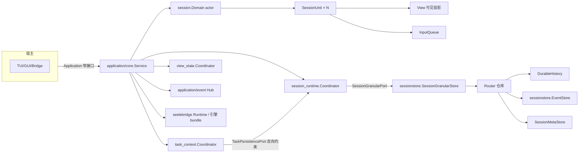
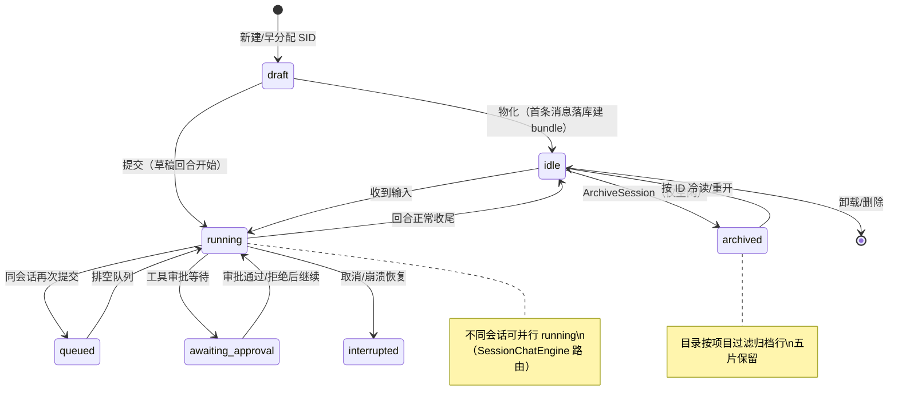
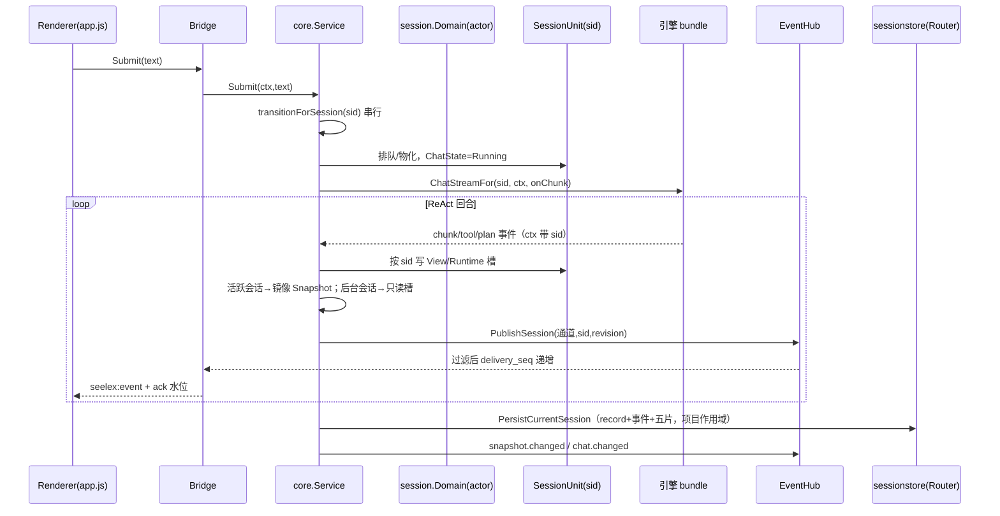
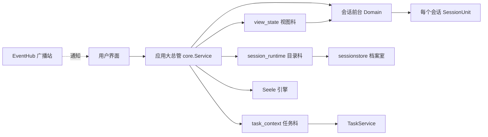
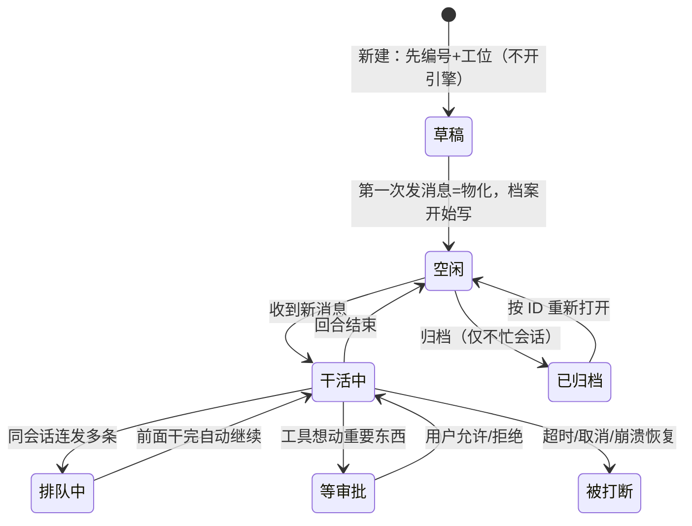
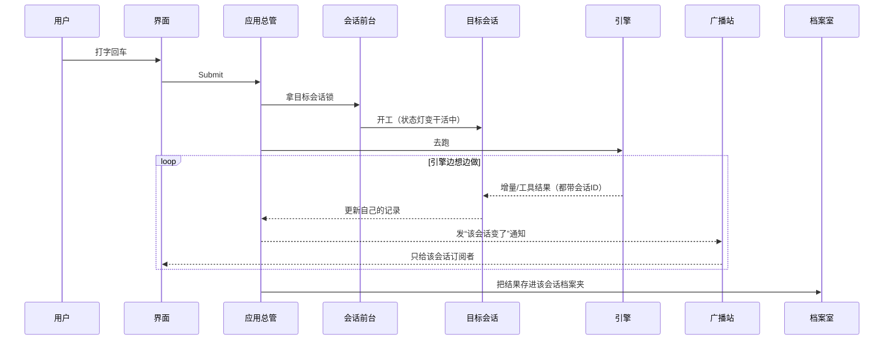

# 会话子系统整体审查（专业版 + 大白话版）

> 性质：一次性工作包讲解文档，不是长期事实来源；一切以代码与测试为准。
> 审查日期：2026-09-04。覆盖整改收口后的现状（G5 锁面收口、目录分格、
> 归档/冷读、双轨 trace 桥、per-session 过渡等）。
> 阅读顺序建议：先看「版本一」图与术语表，再对照「版本二」找感觉。

审查范围：`session`、`sessionstore`、`application/core` 的会话相关协调器
（session_runtime / task_context / view_state / context_runtime /
prompt_layer / subagent_view）、`application/event`、approval broker、
`gui/tui` 的会话消费面。

说明：下文“属性”= struct 字段；“方法/虚函数”= 可调用的行为方法。

---

# 版本一：Mermaid + 专业术语

## 术语表（边看边查）

- **SessionUnit（会话单元）**：一个会话在应用侧的全部“会话事实”挂载点
  （身份、状态、可见区、队列、审批、Runtime 槽）。
- **Domain（会话域 actor）**：单 goroutine + channel 串行处理注册表的
  “前台”，无共享 mutex。
- **ViewMu / stateMu / planMu / catalogMu**：不同属主的锁。ViewMu 只保护
  视图镜像 `Snapshot`；stateMu 保护 task 自有状态；planMu 保护 plan 投影；
  catalogMu 保护目录 worker 三态缓存。
- **镜像（mirror）vs 自有状态（authoritative state）**：自有状态是事实源；
  镜像只是渲染层副本。
- **Revision**：快照修订号。INV-G5：每会话一个 revision，进程一个
  revision，互不相干。
- **delivery_seq / 水位**：订阅者收到的投递序号与已应用水位，用于发现丢
  事件并重放。
- **投递端过滤**：事件在 Hub 分发时就按 `(通道, session_id)` 过滤，前端
  不判断“是不是我的会话”。
- **冷读 / 冷加载 / 热挂载**：无引擎 bundle 时从 record+事件库拼只读基线=
  冷读；重建 bundle=冷加载；bundle 在内存只移视图指针=热挂载。
- **驱逐（LRU resident_limit）**：驻留引擎 bundle 超过上限后，最久未用的
  空闲会话先 flush 再释放。
- **归档（archived）**：record 级状态；目录按项目分格后从常规列表过滤，
  五片数据保留可重开。
- **分格目录（catalogGrid by projectID）**：目录缓存按项目分桶；刷新一个
  项目不影响另一个项目。
- **双轨事件**：一条持久化“事实轨”（EventStore）+ 一条内存“实时轨”
  （subagent_live 等）。
- **端口 / 适配器（port / adapter）**：core 定义接口，main 组装真实实现，
  core 不依赖实现。
- **DTO**：跨层传输的纯数据形状，如 `Snapshot`/`SessionSnapshot`/
  `ProcessSnapshot`。

## 1.1 分层与依赖（单向）



说明：依赖方向 `core → session → sessionstore`；`tui/gui → application`；
seelebridge 在更底层，core 经端口使用；业务状态不进 host。

## 1.2 会话生命周期状态机



## 1.3 一次提交：actor → 引擎 → 事件 → 镜像 → 落盘



要点：写路由只允许三种 sid 来源（显式参数 / ctx 注入 / 事件负载）；
`Core.Snapshot.Session.ID` 不再是路由“神谕”（INV-G2）。

## 1.4 锁与并发模型

```mermaid
flowchart LR
    ViewMu[ViewMu: Snapshot 镜像+视图写] --> stateMu[stateMu: task 会话自有状态]
    stateMu --> planMu[planMu: plan 投影]
    ViewMu --> catalogMu[catalogMu: 目录三态]
    UnitMu[Unit/View.mu: 单会话字段] --- ViewMu
    note: 锁序 ViewMu→stateMu→planMu；planMu 为叶子；两段式发布避免 stateMu→ViewMu
```

| 锁 | 属主 | 保护内容 | 状态 |
|---|---|---|---|
| ViewMu | core 内核 | `Snapshot` 镜像 | 视图专用 |
| stateMu | task_context | `sessionStates`/会话运行字段 | 独立（G5 收口） |
| planMu | task_context | plan 投影缓存 | 独立（G5 收口） |
| catalogMu | session_runtime | 目录分格缓存+标题+回执 | 独立（波 3） |
| Unit/View.mu | session 域 | 单会话字段/可见区 | 独立 |

## 1.5 关键 struct / interface：属性与方法

### `session.Domain`（会话域 actor）
- 属性：`cmds chan`、`stopCh/done`。
- 方法：`Register(unit)`、`Remove(sid)`、`Unit(sid)`、`UnitIDs()`、
  `Live()`、`SetActive(sid)`、`ActiveID()`、`Close()`。
- 要点：单 goroutine 持注册表与视图指针 V，天然无锁串行（INV-G2）。

### `session.SessionUnit`（会话资源单元 S_i）
- 属性（主要）：
  - 身份/血缘：`ID`、`Kind`、`ParentID`、`Title`；
  - 会话选择：`Effort`、`FullAccess/fullAccessSet`；
  - 事实槽：`Runtime model.RuntimeState`、`Revision`；
  - 草稿：`Composer model.ComposerDraft`；
  - 聊天桥：`Chat`、`Cancel`、`Stream`、`Batcher`；
  - 结构：`View *View`、`Queue *InputQueue`、`Context`、`Binding`、`Engine`；
  - 私有状态：`status/loaded`、`approvalIDs`、`resident`。
- 方法（主要）：`ChatState/SetChatState/UpdateChat`、`SetCancel/CancelFunc`、
  `SetStream/StreamSink`、`SetBatcher/BatcherSink`、`Enqueue/PendingRequests/
  SetRequests`、`EffortLevel/SetEffortLevel`、`FullAccessMode/SetFullAccessMode`、
  `AddApproval/RemoveApproval/ApprovalIDs/PendingApprovalCount`、
  `SetResident/Resident`、`RuntimeState/SetRuntimeState/RuntimeStateLoaded/
  SnapshotRevision`、`SetComposerText/ComposerText`。
- 生态位：Unit 是“会话专属事实”的挂载点，视图指针只是 `Domain.ActiveID()`。

### `session.View`（单会话可见投影）
- 属性：`Conversation`、`Chat`、`ReadFiles`、`TotalMessages`、
  `HistoryOffset`、`HasMoreHistory`、`ConversationWindow`、`Revision`。
- 方法：`Mutate(fn)`、`Read(fn)`、`Clone()`。
- 要点：写经 `Mutate`，读/镜像经 `Read/Clone`。

### `sessionstore.Router`（持久化仓库）
- 键模型：`(projectID, sessionID)` 复合键；后端 JSON/SQLite/Postgres/Redis。
- 方法（主要）：`SaveCommitWorkspace`（原子写 record+history+事件+工具
  结果）、`LoadHistoryRangeWorkspace`、`LoadEventRangeWorkspace`、
  `ReadToolResult/ListToolResults`、`ListWorkspace(project)`、`DeleteWorkspace`
  等。
- 要点：单一 `Config`（INV-G13：无 per-session 存储策略）。

### `sessionstore.SessionGranularStore`（会话粒度五片门面）
- 属性：`router`、`workspaceResolver`、`projectSource`。
- 方法（主要）：`SaveSession/LoadSession`、`SessionsOf(project)`、
  `SaveHistory/HistoryRange`、`Transcript/TranscriptTail/EventRange`、
  `ToolResults/ToolResult`、`SaveContext/Context`、`SaveCommit`、`Delete`、
  `EnsureIndexed`、`ResolveProjectForSession`。

### `sessionstore.DurableHistory` / `EventStore`
- DurableHistory：会话 provider 历史句柄（按会话键读写）。
- EventStore：执行事实轨追加式事件库；`LoadRange` 区间读（(0,0)=全量）。

### `application/core/session_runtime.Coordinator`
- 属性：`Core`、`tasks TaskPersistencePort`、`view ViewPort`、闭包端口、
  `sessionRuntimeState`（transition 管理器 + catalogMu 三态：
  `catalogGrid`、`catalogWorkspaces`、`catalogTitles`、回执队列、worker
  channel）。
- 方法（主要）：`LocateSession`、`PersistCurrentSession`、`LoadSessionRecord`、
  `LoadTranscriptRange`、`SessionTitleFor/SetSessionTitleLocked`、
  `MarkSessionArchived`、`RequestCatalogRefresh/RequestCatalogRefreshProject`、
  `DraftCandidates`、`TransitionLock`。
- 端口接口：`SessionGranularPort`、`SessionRecordPort`、`SessionSnapshotPort`、
  `SessionTranscriptPort`、`SessionForkPort`、`TaskPersistencePort`（显式带
  sid）。

### `application/core/task_context.Coordinator`
- 属性：`stateMu`、`sessionStates`、`requestToSession`+`requestMu`、
  `planMu`、`planProjections`、依赖回调。
- `sessionTaskRuntime` 属性（每会话一份）：`taskExecution`、`taskService`、
  `transcript/transcriptSeq`、pending tool results、toolResultRefs、
  checkpoints、`planStack/activePlanID/planSequence`、replanInFlight、
  reactBudget、contextControlFailure。
- 方法（大类）：任务生命周期、转录、plan 栈/投影（`PushLoadedPlanLocked`、
  `SeedPlanProjection`、`ApplyPlanNodeProjection`、`PlanProjectionCopy`）、
  预算、TaskService 相关（`VerifyAndApply`、`OnChatEnd`）。
- `TaskService`：属性 `state`、`projection`、`lastTaskState`、`resumeRecord`
  等；方法 `OnChatEnd`、`VerifyAndApply`、`ObserveTool/ObservePlanEvent/
  ObserveModelOutput`、`SemanticProgress`。

### `application/core/view_state.Coordinator`
- 职责：把当前会话 View/Runtime/目录投影成 `Snapshot`；`BumpLocked()` 推进
  revision。
- 方法（主要）：`SnapshotView`、`SessionViewLocked/ReadLocked/MutateLocked`、
  `MirrorActiveViewLocked`、`CollectRuntimeProjection/For`、
  `ApplyRuntimeProjectionLocked/For`、`SetSessionChatLockedFor`、
  `AppendMessageLocked/For`。

### `application/event` Hub / Subscription
- `Hub`：`Publish/PublishSession`、`Subscribe/SubscribeFiltered/
  SubscribeWithReplay/SubscribeSession`；投递端过滤 + 溢出 resync/窗口重放。
- `Subscription`：`Events`、`Close`、`ReplaySince`、`DeliveryWatermark`；
  `delivery_seq` 是订阅者唯一连续性来源（INV-G3/G4）。

### approval broker
- 属性：`pending`、observer 回调（`(sessionID, requestID, interaction)`）。
- 方法：`Ask/Resolve`、`Pending/PendingBySession`、`SetObserver`。
- 会话侧：`SessionUnit.approvalIDs` 记账；`Snapshot.Interaction` 单格只镜像
  当前视图会话审批。

### contract 侧关键接口
- `SessionChatEngine`：`HasSession/ActivateSession/ChatStreamFor/
  SetSystemPromptFor/UnloadSession` 等——决定真并行还是单飞回退。
- `SessionPort`/`WorkspacePort`：core 消费的会话/工作区目录端口。
- `RuntimePort`：进程原件 + `PerSessionExecution()`（逐会话能力声明；当前
  seelebridge 返回 false——工具根仍是进程级 projectScope，待 per-session
  project root 落地后再开启）。

## 1.6 健康度结论（专业版）

- 依赖方向单向、端口在调用方一侧、DTO 纯化。
- G5 锁面已收口：task/prompt/plan 自有状态各自持锁离开 ViewMu；镜像写收敛
  到 ViewMu 短临界区。
- 目录按项目分格；归档/冷读/驱逐语义落盘级正确。
- 主要技术债：视图镜像仍与真实执行在事件回调里高频同步；进程隔离退路的
  `SessionSnapshot`/`ProcessSnapshot` 传输形状已预留。

---

# 版本二：Mermaid + 大白话

> 总比喻：会话系统像一间有很多“工位”的办公室。
> - 工位 = 会话：聊天记录（View）、状态灯（ChatState）、待审批纸条
>   （approvals）、草稿本（Composer）、工具箱（Engine bundle）。
> - Domain = 前台登记员：谁在哪个工位、前台“盯着”哪个工位。
> - Hub = 广播站：只把某工位的消息送到关心它的人那里。
> - Router/仓库 = 档案室：每会话一个档案夹，五个格子。
> - Coordinator = 各科室主任；锁 = 谁正在改这份文件的门锁。

## 2.1 谁管谁（大白话分层）



大白话规则：
- 目录科不偷看前台：目录按项目分桶。
- 任务科自己管账本：任务状态不与视图镜像抢锁。
- 前台切工位只换指针，不打断干活的人（热挂载）。

## 2.2 会话的一生（大白话状态机）



## 2.3 发一条消息后台发生了什么（大白话时序）



## 2.4 锁比喻（大白话）

| 锁 | 像什么 | 管什么 |
|---|---|---|
| ViewMu | “展示大屏”的锁 | 大屏（Snapshot）别显示到一半被改花 |
| stateMu | 任务科账本锁 | 任务/转录/审批账本 |
| planMu | 计划图锁 | 计划甘特图谁在改 |
| catalogMu | 目录科黑板锁 | 左侧栏会话列表 |
| Unit/View.mu | 工位抽屉锁 | 单个会话自己的记录 |

规则：锁序固定（大屏→账本→计划图）；绝不拿计划图锁去要账本锁，避免
死锁。

## 2.5 struct / interface 大白话表

| 类型 | 像什么 | 里面有什么（属性） | 能干什么（方法/虚函数） |
|---|---|---|---|
| `session.Domain` | 前台登记员 | 命令信箱、关闭开关 | 登记/注销/查工位、看与设“当前盯哪个工位” |
| `SessionUnit` | 一个工位档案夹 | ID/类型/父会话/标题；状态灯；审批纸条；草稿；effort/全权；可见区；队列；引擎句柄；驻留标记 | 改状态灯、取消、排队、设流、记/撤审批、读写草稿、标驻留 |
| `session.View` | 工位屏幕 | 聊天记录、状态灯、已读文件、窗口游标 | 加锁修改/读取、做快照副本 |
| `Router` | 档案室总仓 | 项目×会话键、后端 | 整包存、区间读、列项目会话、删会话 |
| `SessionGranularStore` | 档案室前台 | 仓库、会话→项目解析器 | 按项目列会话、五格读写、删、解析项目 |
| `session_runtime.Coordinator` | 目录科主任 | 分格目录黑板、标题、回执、过渡锁 | 找会话、落盘、读 record/transcript、归档、刷目录 |
| `task_context.Coordinator` | 任务科主任 | 每会话任务账本（stateMu）、plan 投影（planMu） | 开任务、终态工具、转录、plan 事件、预算 |
| `TaskService` | 任务现场监督员 | 任务状态、plan 读取器、最近可见状态 | 自然停止判定、打点校验、观察输出 |
| `EventHub/Subscription` | 广播站/电话 | 订阅谓词、窗口、水位 | 发布、按会话订阅、补发、关闭 |
| `ApprovalBroker` | 审批窗口 | 待批表、通知回调 | 发起、按会话查待批、结案 |
| `SessionChatEngine` 接口 | 能按会话号派活的引擎开关 | —（接口） | 有/建/跑/卸会话 |
| `SessionPort/WorkspacePort` | 档案室/项目部的电话 | —（接口） | 列会话、读历史、绑定工作区 |

## 2.6 大白话总结

- 每个会话自己管自己的事（数据分会话、锁分会话）；
- 前台只负责“看哪个”，不替工位干活；
- 广播只送关心的人；
- 存档（record）与显示（snapshot）分离。
- 最重要的纪律：多会话并行时，事件都带会话 ID，按 ID 路由，别用“当前
  显示的会话”去猜归属。

---

**审查结论（两版共用事实）**：架构方向正确——会话事实进 `SessionUnit`、
视图指针只属于 `Domain`、事件带 sid、存储按项目分格、锁按属主拆分；G5
剩余锁面已收口，全量门禁（build/vet/test/-race/node 184）全绿，台账
剩余项=0。
