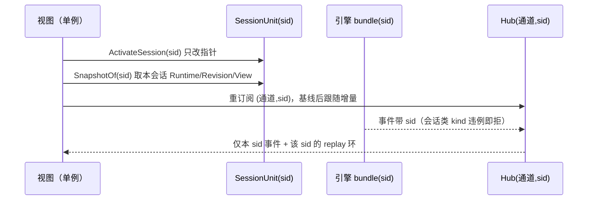

# 会话粒度目标设计与刀序（对账之后）

状态：**设计与决策已收敛，尚未实现**。本文件是整改工作包的目标形状与施工顺序；
事实来源仍是代码与测试，本文件描述"要达到什么"。

权威上游文档（不在此重复其内容）：

- 会话资源模型与事件路由：[session-domain-design.md](../2026-08-30-session-resource-refactor/session-domain-design.md)
- 上下文装配顺序与各层粒度：[context-prefix-chain.md](../arch/context-prefix-chain.md)
- 快照/事件活性协议：[session-snapshot-liveness.md](../arch/session-snapshot-liveness.md)
- 整改台账（可打点）：[README.md](README.md)

## 1. 矛盾消解记录

| # | 矛盾 | 消解方式 | 现状证据 |
|---|---|---|---|
| M1 | 「视图跟随」被我在 C4 搬进事件面：订阅传空 sid 跟随视图指针，replay 环因而跨会话 | 订阅键改为 `(通道, sid)`；切换会话＝重建订阅 + 重发基线；前端补 `event.session_id === snapshot.session.id` 硬校验 | `gui/bridge.go:259-271`、`application/core/session_scope.go:216-225`、`gui/frontend/dist/protocol.js`（全文无 `session_id`） |
| M2 | 空 sid 既是"进程级事件"又是"未知会话"，投递侧当通配放行 | 定义两类通道并按 kind 白名单：会话类 kind 的 sid 必填，hub 对「会话类 kind + 空 sid」拒绝发布并记诊断；进程类 kind 的 sid 必空 | `service_interaction.go:80/93/115/148` 全部以空 sid 发布含会话字段的载荷 |
| M3 | 快照既是前端基线又是"进程内哪个会话"的神谕，与"指针只是展示"的 A/D 阶段结论相抵 | 神谕废除：按会话路由的写只允许三个 sid 来源（显式参数 / ctx 注入 / 事件负载）；`Core.Snapshot.Session.ID` 只允许视图四件套读写 | `main.go:251/267`、`application/core/compressed_turn.go:44-60`、`session_scope.go:153` |
| M4 | `SnapshotOf` 声称 per-session，实际 clone 视图的 Runtime —— 把"Runtime 只有一格"固化成 API | 先补数据面（每会话 Runtime 槽 + 每会话 revision），再让 `SnapshotOf` 从该槽取；投影全量改 For 端口 | `session_scope.go:191`、`view_state/coordinator.go:96-146` |
| M5 | seelebridge 明文假设"application 保证同一时刻只有一个运行中会话"，与并行多 main agent 目标相抵 | 撤销该前置假设：额度按 sid 建槽；`activeSessionID` 降级为无 sid legacy 端口的兜底路由，且断不得成为事实源 | `seelebridge/runtime.go:68-76`、`plan/executor.go:74-83`、`internal/telemetry/session.go:14-19` |
| M6 | effort/plugin 修改会打到正在运行的会话（含其 system 原件与历史），与"运行中不支持更改"相抵 | 目标会话 running 时拒绝改 effort；plugin 激活/停用是进程级动作，任一会话 running 即拒绝并回滚 | `service_interaction.go:98-149`（`Engine.SetSystemPrompt`/`ClearHistory`/`promptStack.Reset` 均无守卫） |
| M7 | 关闭判定与超时取消都只看视图会话，后台运行中的会话会被直接杀死 | 判定改"任一会话非 idle"；超时取消全部 running sid；关闭前逐会话 flush（composer/Runtime 槽/View） | `gui/shutdown.go:49,67`、`service_input.go:180-192` |
| M8 | 我以为 tokens/replan/子代理树"卡上游 Seele"，实际基础设施已在 seelebridge 内建好但没接线 | 归入本仓库改动：在 seelebridge 会话入口注入 ctx（一处），此后 `SessionTracer.QueryBySession` 可按 sid 取 | `runtime.go:395-400` 已挂 `SessionTagHook`；`internal/telemetry.WithSessionID` 生产侧零调用；`engine_port.go:688-700` 退化成进程求和 |
| M9 | 我上一轮把"per-session 存储策略"当成缺口 | **撤销**：存储策略只有全局的，`Router` 单份 `Config` 即目标形状 | `sessionstore/sessionstore.go:211-236` |
| M10 | 消息 ID 全局计数器被当作需要会话化的候选 | **零改动**：保持全局分发（防重复与上下文干扰），新增不变量「唯一但不要求连续」并加测试 | `view_state/coordinator.go:59,169,277-308` |

## 2. 目标建模：粒度归属表

### 2.1 进程级（单例，只读原件，深拷贝进会话渲染）

`Originals`：system 模板（identity/plugin/instructions + 激活 skill 文本）、project 块、
memory 块、`seelexctx.Limits`、存储策略（`Router.Config`）、能力清单（插件/账号池/
Skill/可见工具）、**model / provider / account**（本轮已定：不 per-session pin）。

进程快照 `ProcessSnapshot`：`sessions[]`（含 workspace 列、status、resident）、
`workspaces[]`、`sessionWorkspaces`、`capabilities`、上述能力清单、进程 revision。

### 2.2 视图级（进程单例，但只是"在看什么"，不是事实源）

视图指针 `view→session`、对话渲染槽（镜像当前会话 View）、轨迹渲染槽（镜像当前
会话的子代理树 + join 结果）、目录投影数组（**按 projectID 索引**，非单一全局数组）。

### 2.3 会话级（每会话一份，拥有全部会话事实）

`SessionUnit` 增/迁：

| 成员 | 内容 | 来源变化 |
|---|---|---|
| `Runtime RuntimeState` | 会话专属运行态投影（见 2.4） | **新增**（今天只有 `Core.Snapshot.Runtime` 一格） |
| `Revision uint64` | 该会话快照修订号 | **新增**；`BumpFor(sid)` |
| `Composer` | 未发送输入、附件草稿、排队项（不入 context） | 从 `service.draft` 迁入；新分片 `composer` 持久化 |
| `PromptState` | effort 选择 + 渲染出的 system 副本 + `PlanPolicy` | 从单例 `effortManager` 拆出"选择"部分 |
| `FullAccess` | 该会话权限模式 | 从 broker 单 bool 拆出 |
| `Approvals []RequestID` | 待批请求归属 | `ApprovalRequest` 加 `SessionID` |
| `SubagentTree` | 本会话的树（子女按 sid 可寻址） | `Runtime.subagentTree` 单树 → per-bundle |
| `Status` | draft/idle/running/queued/**awaiting_approval**/archived | 枚举新增 |
| `Resident` | 引擎 bundle 是否驻留（驱逐/LRU 用） | **新增**，供诊断与侧栏 |

`SessionSnapshot`（会话粒度、传输完备）：`session`、`conversation`、`chat`、
`runtime`（本会话槽深拷贝）、`task`、`approvals[]`、`worktable(+batches)`、
`subagentTree`、`revision`（本会话）、窗口游标、`capabilities.sessionResume`。

### 2.4 `RuntimeState` 字段最终归属

| 字段 | 归属 | 落地条件 |
|---|---|---|
| `Effort`、`FullAccess` | 会话 | 纯 application 改动 |
| `Plan`、`TodoItems`、`WorkTable(+Batches)` | 会话 | 已具备（`planProjections`、`TaskSnapshotFor`）；投影需改用 For 变体 |
| `ActiveSkills`、`GoalSkillActive` | 会话 | `tasks` 域已带 For 变体，投影改调用 |
| `Tokens` | 会话 | 需 seelebridge ctx 注入 + `TokenCountFor(sid)` |
| `Replan` | 会话 | 需 per-sid `ReplanGuard` |
| `SubAgentTree` | 会话 | 需 per-bundle 树 + `ClearSubagentTreeFor(sid)` |
| `Model`、`Provider`、`Account`、`Plugin`、`Plugins`、`VisibleTools`、`Skills`、`Accounts`、`ScheduledTasks`、`ScheduledCommands` | 进程 | 从 `SessionSnapshot` 移除，前端改读进程快照 |

未满足落地条件的字段，**留在进程档并显式标注为全局值**；禁止用 clone 伪装成会话值。

### 2.5 子代理会话与 join

- 子代理会话按 `Kind=Subagent` 落五分片，`Binding.ParentID` 指向父 main 会话；
  **不进侧栏目录**（`SessionsOf` 结果按 kind 过滤），只能经父会话轨迹树节点打开
  （树节点已带 `SessionID`，`dto/subagent.go:23`）。
- join 规则：主会话上下文与可见区只承载 **mainagent 实际接收的内容**（即合并回父
  证据的那一份）；子代理自身运行细节只在子会话视图。当前该"实际接收内容"被可见区
  主动丢弃（`view_state/coordinator.go:160-162`），需改为可见且可持久的一条记录。
- 重启后：未完成的子代理会话标 `stale`，父树对应节点标 `interrupted`，由用户在父
  会话指挥 mainagent 重跑。

## 3. 不变量清单（测试与 review 引用编号）

| 编号 | 不变量 |
|---|---|
| INV-G1 | `Core.Snapshot` 不持有会话专属事实；会话专属字段一律来自 `SessionUnit` |
| INV-G2 | 按会话路由的写，其 sid 只能来自显式参数 / ctx 注入 / 事件负载；读 `Core.Snapshot.Session.ID` 做路由的位置数为 0（白名单：视图指针自身存取） |
| INV-G3 | 会话类 kind 事件 sid 必填，进程类必空；hub 拒绝违例发布并记诊断 |
| INV-G4 | 订阅键含 sid；replay 环与 ack 游标按 sid 隔离；切换即重订阅 |
| INV-G5 | 每会话一个 revision，与进程 revision 互不相干 |
| INV-G6 | 额度（PlanPolicy、fork 信号量、ReplanGuard）按 sid 建槽；`activeSessionID` 不参与事实判定 |
| INV-G7 | 原件只读共享；running 会话不重算自身 system 层；effort 变更仅作用于 idle 会话 |
| INV-G8 | 驻留受 LRU 上限（默认 6，走 limits）；驱逐前置＝非 running、非 awaiting_approval、composer/View/Runtime 槽已 flush；驱逐后再进＝冷 |
| INV-G9 | 退出：任一会话非 idle 即需等待或询问；超时取消全部 running sid；子代理标 stale |
| INV-G10 | 消息 ID 全局唯一、不要求连续；消费方禁止假设连续 |
| INV-G11 | 子代理会话落盘、不进侧栏、经父树打开 |
| INV-G12 | 只有 mainagent 实际接收的内容进入父会话上下文与可见区 |
| INV-G13 | 存储策略唯一来源是 `Router.Config`（进程级）；不存在 per-session 策略 |

## 4. 关键流程（目标）



- **热切换**：指针改 → 重订阅 → `SnapshotOf(sid)` 基线（本会话 revision）→ 增量。
  引擎不销毁、不清树、不改全局 prompt。
- **后台并行**：其他 sid 的事件只进它们自己的订阅；主会话的 replan/fork 额度互不
  占用；provider 限额按会话（不再试图做进程总量控制）。
- **待审批**：后台会话卡在审批 → `Status=awaiting_approval` 进目录列，视图侧显示
  待审批计数；`limits.approval_timeout` 到期自动拒绝并把结论写回该会话上下文。
- **冷打开**：未驻留会话从 `record` + `Transcript.Seq` + `DurableHistory` 拼只读基线
  （C1，位于刀 6），`Resident=false`。
- **退出**：flush 全部会话 → 等待/询问 → 超时取消全部 running → 关闭。

## 5. 刀序与验收

| 刀 | 内容 | 不变量 | 验收锚 |
|---|---|---|---|
| 0a | 压缩轮次归档按 sid 路由（ctx 优先，provider 兜底） | INV-G2/G3 | 后台会话压缩不再写入视图会话分片 |
| 0b | effort 运行守卫 + plugin 全局动作守卫 + `SetSystemPromptFor` | INV-G7 | 后台 running 会话的 system/历史不被改动 |
| 0c | 退出语义：任一会话非 idle 即等待、超时取消全部、flush composer/槽 | INV-G9 | `BeforeClose` 不再只看视图会话 |
| 1' | 每会话 `Runtime` 槽 + `Revision`；投影带 sid；事件带 sid；seelebridge ctx 注入 + `TokenCountFor` | INV-G1/G2/G5/G6 | `TestS0BackgroundEventsDoNotPolluteActiveSnapshot` |
| 2 | 订阅 `(通道,sid)`；前端 sid 校验；A6 通道白名单；per-sid ack/环 | INV-G3/G4 | `TestS0SwitchResyncsBaseline` |
| 3 | `SessionSnapshot`/`ProcessSnapshot` 分型（传输完备，为进程隔离保留退路） | INV-G1 | 前端 reducer + TUI/headless 契约测试 |
| 4 | Composer/effort/fullAccess/子代理树/approval 归属；子会话落盘与 stale | INV-G7/G11/G12 | `TestS0ForkDeepCopyIsolation` 扩展 |
| 5 | 锁拆分（`ViewMu`/`CatalogMu`/`Unit[i].Mu`）+ `TransitionLock` per-session | INV-G1/G6 | `-race` 全量 + 并行多用例 |
| 6 | 驻留 LRU/驱逐前置 flush；catalog 按 projectID；C2 archive；C1 冷读面 | INV-G8 | 台账 #4/#6 |
| 7 | 双轨 trace 桥（`UnifiedEvents` → live 事件）+ `EventStore` 区间读 + 去 `nodeDetailPollTimer` | INV-G4 | 台账 #3 |

依赖：0a/0b/0c 相互独立且互不依赖刀 1；刀 1 是全局收敛点（做完 `SnapshotOf` 的拷贝
方向自然成立，`session_scope.go:191` 的 clone 被替换）；刀 3 之后才谈前端完整分型。

## 6. 决策记录（本轮新增）

1. 子代理会话：**落盘、不进侧栏、经父树打开**；重启后标 `stale`。
2. 草稿身份：**早分配 SID + 建 Unit，不建引擎 bundle**（`HasSession=false`，首次提交
   才建 bundle 与 `DurableHistory`）；composer 跨重启恢复，提交成功后清空；新增
   `limits.composer_max_chars` 上限。
3. model/provider/account：**全部留进程级**；只有 effort 与 fullAccess 会话化。
4. seelebridge 并行化深度：**加 per-session 额度槽，保留 `activeSessionID` 仅作 legacy
   兜底**；不一次性删除无 sid 端口。
5. 进程隔离：仍为退路，触发条件＝刀 5 之后并行/切换/后台/热恢复仍不达标；因此刀 3
   必须把会话快照设计成传输完备的制品。

## 7. 明确不做

- per-session 存储策略（M9 撤销）。
- 消息 ID 会话化（M10 零改动）。
- 一次性删除所有无 sid 兼容端口（延后到端口清单一完成即评估）。
- C1 冷读面前置（后移到刀 6，它需要刀 1'/3 的槽与分型作为形状）。

## 8. 遗留待决（不阻塞刀 0）

- `session.StorePort`：生产零调用方。建议删除（适配职责已由 `internal/adapters` 承担），
  或在刀 1' 一并接为 `session` 域唯一存储入口——二选一，不留死契约。
- 待审批计数在 TUI 的呈现口径。

## 9. 推进波次（执行计划，2026-09-02 对账后定稿）

对账结论：阶段 G 其余各刀的改动面与刀 0 不在一个量级——G1/G5 是贯穿式大改，
G2/G4 是跨端/跨域中-大改，G3/G6/G7 是契约与装配中改。据此把刀 1'~7 收成四个
可独立验收的波次；波 3/4 与波 1/2 分会话推进，本文件与台账 README 是跨会话的
事实交接面。

### 依赖 DAG（依据代码事实）

```text
G1-T（trace 会话化 + TokenCountFor）已落地
   │
   ▼
G1（A: SessionUnit Runtime/Revision 槽 → B: 投影按 sid 收集/应用 + SnapshotOf
     → C: planExecutor/ReplanGuard 按 sid）
   │
   ├──────────────┬──────────────────┐
   ▼              ▼                  ▼
G2（订阅键+白名单） G3（快照分型）      G4（归属进 Unit 的数据面准备）
   │              │                  │
   └──────┬───────┘                  │
          ▼                          ▼
      G4（composer/effort/fullAccess/approval/子代理树进 Unit）
          │
          ▼
      G5（锁拆分；前置 = G1+G4 数据面）
          │
          ▼
      G6（LRU/驱逐/目录按 projectID/C2/C1 冷读）
          │
          ▼
      G7（双轨 trace 桥 + 去 nodeDetailPollTimer）
```

依赖理由：

- G1 → G2/G3：每会话 revision 与 Runtime 槽是「切换即重订阅基线」与
  `SessionSnapshot` 分型的形状前提（C1/C2 后移到刀 6 的原因）。
- G2/G3 → G4：归属进 Unit 后，事件必须能按 kind 白名单区分会话类/进程类，
  且状态字段需要干净的 `SessionSnapshot` 承载。
- G1+G4 → G5：锁拆分的前提是数据已进 Unit 槽、视图指针只是展示。
- G3+G4+G5 → G6：驱逐/目录/冷读依赖状态字段、Unit 锁与传输完备快照。
- G2 → G7：EventStore 区间读「投进 application/event」必须符合 `(通道,sid)` 语义。

执行中对账（2026-09-03，写入以修正波 1 范围）：

- G2 的**严格 kind 白名单**（会话类空 sid 直接拒绝发布）依赖 G4 的早分配
  SID——草稿目前以空 sid 占位，视图级快照/工作台事件在草稿期合法为空归属；
  因此波 1 只落地白名单分类/校验辅助与「显式会话订阅的精确 sid 口径」，
  把「空 sid 通配撤销」的最终开关放在 G4 之后。
- G1-C 拆成两半：ReplanGuard/额度按 sid 建槽（已完成，含运行时槽 replan
  统计）；planExecutor 的 binding/policy/fork 按 sid 槽（与 G4 的 per-session
  effort 及 plan 运行上下文绑定耦合，随波 2 推进）。
- 波 1 验收锚 `TestS0BackgroundEventsDoNotPolluteActiveSnapshot` 已落地并转绿；
  `TestS0SwitchResyncsBaseline` 待 G2 的 Bridge/前端重订阅切片完成后落地。

### 波次与验收锚

| 波 | 内容 | 主要改动面 | 验收锚（测试） |
|---|---|---|---|
| 波 1 | G1 全量 + G2 | core/session/task_context/view_state、seelebridge/plan、application/event、gui Bridge + 前端 protocol/client-state/app | `TestS0BackgroundEventsDoNotPolluteActiveSnapshot`、`TestS0SwitchResyncsBaseline`、`-race` 并行多用例 |
| 波 2 | G3 + G4 | model DTO 分型、前端 reducer/契约测试、session/sessionstore（composer 分片、Kind=Subagent 落盘）、approval/effort/fullAccess 归属 | `TestS0ForkDeepCopyIsolation` 扩展、前端分型契约测试 |
| 波 3 | G5 | core 锁拆分（ViewMu/CatalogMu/Unit[i].Mu）+ 出临界区化 | `-race` 全量 + 并行多用例 |
| 波 4 | G6 + G7 | 驻留 LRU/驱逐、目录 projectID 索引、C2/C1；EventStore 区间读、runtime_live 正文 kind、去 node 轮询 | 台账 #4/#6 与 INV-G8、G4 事件面测试 |

波 1/2 与波 3/4 分会话推进；每波内仍按小分片提交（先契约与测试，再实现），
保证任意提交点 `go build ./...` 与受影响包测试全绿。

### 波 2 执行中对账（2026-09-03 追加）

- G4 先行子项（早分配 SID + 建 Unit + composer 落盘/重启恢复）已落地：
  草稿从新建即持有真实 SID（`HasSession=false`），物化复用同一 ID；
  `SessionRecord.Status/Composer` 落盘，冷启动恢复草稿，提交成功后清空。
- G2 严格 kind 白名单已开启：会话类空 sid / 进程类带 sid 在
  `PublishSession` 拒绝并记诊断；草稿不再以空 sid 占位的前提已满足。
- 波 2 已完成（2026-09-03 收尾）：G1-C 剩余（planExecutor binding/policy/
  fork 运行路径按 sid 槽 + per-run locators + application 会话策略同步，
  提交 `40ebd46`）；G3（模型层分型已落地，前端新增 snapshot-shape 归属契
  约与 client-state 进程段保留/合并，提交 `0e53a03`/`75d3fc0`；桌面仍以
  联合 Workbench Snapshot 下发，会话粒度交付走既有 joint 形状）。
- 剩余波 2 内容（随下一会话推进）：G4 其余——fullAccess/approval 会话级
  归属与门控、`Kind=Subagent` 落盘与 stale 标记、Composer 完整归属（effort
  与 join 可见持久记录已落地）。
