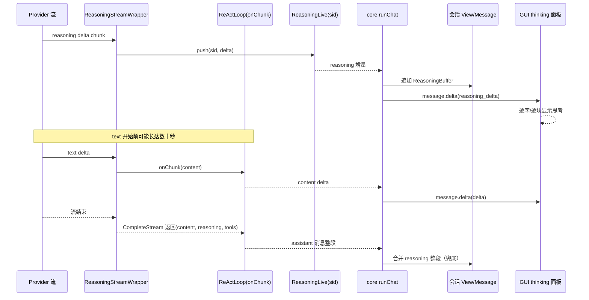

# Thinking（推理内容）实时链路设计与线谱

> 性质：一次性工作包设计/接线说明（2026-09-04）；以代码与测试为准。
> 背景：前端首个正文 token 前长期无输出，怀疑是模型在思考而运行链路没有
> 把思考过程实时回传。本文给出断点证据、目标组件、事件线谱与上下文缓存
> 策略，并标注“待实施/已具备”。

## 1. 现状与断点（证据）

1. **底层具备推理增量事件**：Seele `types/model.go` 已定义
   `StreamEventReasoning` 与 `CompleteStreamEvents(…, onEvent)`；provider
   客户端（`agent/core/api/client.go`）能按事件推送 reasoning 增量。
2. **运行 loop 未使用事件流**：Seele v0.1.2 `session/loop.go → callLLM` 只
   调用 `CompleteStream(ctx, …, onChunk func(string))`；`onChunk` 只收正文
   content。reasoning 在“本次 LLM 调用返回后”整段写入
   `Message.ReasoningContent`。
3. **seelex 侧只转发正文增量**：`application/core/chat.go` 的
   `EventMessageDelta` 只带 `Delta`（content）；reasoning 整段在回合边界经
   一次带 `ReasoningContent` 的 delta 送达（`application/event/hub.go`
   注释亦如此）。

结论：模型思考阶段前端零输出，是链路缺“推理实时轨”，不是 harness 忽略，
也不是死锁。

## 2. 目标组件

```mermaid
flowchart LR
    Provider[Provider 流式 API] -->|StreamEventReasoning| W[ReasoningStreamWrapper]
    Provider -->|text delta| W
    W -->|onChunk(content)| Loop[Seele ReActLoop 现状接口]
    W -->|reasoning delta| RL[ReasoningLive 每会话实时轨]
    RL --> Core[application/core reasoning 增量消费者]
    Core --> Msg[会话 view 消息 ReasoningBuffer]
    Core --> Ev[EventMessageDelta.ReasoningDelta]
    Ev --> GUI[GUI thinking 面板实时渲染]
    Loop -->|回合结束 ReasoningContent| Core
    Core -->|整段兜底| GUI
    Core -->|上下文保留策略| Ctx[下次请求信封/transcript]
```

组件职责：

| 组件 | 生态位 | 状态 |
|---|---|---|
| `ReasoningStreamWrapper`（seelebridge/internal/stream） | 在 `CompleteStream` 内部转调底层 `CompleteStreamEvents`：text→onChunk，reasoning→ReasoningSink | 待实施（不改上游 loop） |
| `ReasoningLive`（seelebridge runtime，每会话） | reasoning 实时轨：有界历史 + 订阅 channel（类比 subagent live） | 待实施 |
| core reasoning 消费者 | 按 sid 订阅 ReasoningLive，追加到会话消息的 ReasoningBuffer，并发布增量事件 | 待实施 |
| `MessageDelta.ReasoningDelta` | thinking 逐段增量载荷 | 待实施 |
| GUI thinking 面板 | 实时渲染增量；回合结束整段兜底（现状整段已具备） | 增量待实施 |
| 上下文保留策略 | 为缓存命中保留最近思考的有界尾部 | 待实施（策略见 §4） |

## 3. 事件线谱（目标）



线谱关键点：正文可以晚到，但 thinking 从首个 reasoning delta 就开始可见；
会话视图消息上保留同一消息的 reasoning 缓冲，结束整段只做校对合并，避免
双写。

## 4. 上下文保留策略（缓存命中）

目标：跨轮次让 provider 对“前缀 + 最近 thinking”命中缓存，同时不污染用户
正文上下文。

策略（待实施，参数化到 limits）：
1. 每条 assistant 消息保留完整 `ReasoningContent` 于可见消息与 transcript
   （现状已具备），供轨迹/回看。
2. 组装 provider 请求历史时，把最近一条 assistant 的 reasoning **有界尾部**
   透传（新 limits 项，如 `reasoning_context_chars`，默认保守值）；更早
   reasoning 裁剪，避免上下文膨胀。
3. provider 若支持在请求消息携带 reasoning（缓存键的一部分），由其服务端
   命中；不支持则此策略自动退化为“不携带”。
4. 仅 reasoning 无正文的回合（`loop.go` 对 content=="" 的边界），把摘要以
   user 可见内容回写，避免“空回复”。

## 5. 实施分片

- P0（仓库内可做，改观感）：GUI 在回合运行且超过阈值仍无正文 delta 时显示
  “思考中…（已 N 秒）”，整段 thinking 仍照现状展示。
- P1（reasoning 实时轨）：ReasoningStreamWrapper + ReasoningLive + core
  消费者 + `MessageDelta.ReasoningDelta` + GUI 实时面板；不改上游 loop。
- P2（缓存策略）：`reasoning_context_chars` 与请求信封携带规则 + 验收测试。

## 6. 验收建议

- 桩 completer 注入 `StreamEventReasoning` 序列 → 前端收到 `reasoning_delta`
  且与整段合并后无重复/缺口；
- 长时间纯思考场景下，首个前端可见输出为 reasoning delta（而非正文）；
- 上下文保留：两轮请求信封中最近 reasoning 尾部存在且可裁剪、总量有界；
- 全量 `-race` + node 前端契约测试保持绿。
