# 关于会话治理的优化方案（v8.3，2026-09-09）

> 状态：**权威设计稿**。逐条实现进度见同目录 [conformance-checklist.md](./conformance-checklist.md)；
> 代码与测试是已实现能力的最终事实源，本文件只定义目标口径。
>
> 已定稿（v4–v7）：message=全量事实（append）、EVENT=结构摘要（不参与装配）、回滚走 fork、
> 运行期重试缓存、LRU 用户确认行删除、history 带 message 锚、队列=引擎待发送队列、
> 单写者锁、魔法数字进 config、GUI/CLI 数据根隔离、metadata 模块化拆分（guide 只做读索引）。
>
> 沿革：v8～v8.3 的歧义收口条目（原编号 25–46）已全部并入正文，此处不再重复列举——
> 术语、端点约定与不变量见 §4；落盘形态与文件放置见 §2、§3.2；装配契约见 §5；
> 测试门禁见附录 D；§2.0 清单是新增落盘产物的准入门（规则 6）。
> 逐轮修订过程以 git 历史与工作包打点表为准。

## 0. 方案简述

现状（改造前）的 wire 段序：

```text
   0k                                                                                                                       200k
   ├──────────────────────────────────────────────────────────────────────────────────────────────────────────────────────────┤
   ├─system─┼─project─┼─memory/blocks─┼─stacks_compact_latest─┼─session_context(with skill record)─┼─plan/task─┼─latest_input─┤

   with goal_stack:
   ├────goal_latest────┤
   ……（按时间更早展开）……
   ├────goal_earliest───┤
```

v8.3 目标 wire 段序（`skill` 不再是独立段：它是 message 事件行，与 user 输入同语义、同序装配）：

```text
   0k                                                                                                                       200k
   ├──────────────────────────────────────────────────────────────────────────────────────────────────────────────────────────┤
   ├─system─┼─project─┼─memory/blocks─┼─compact_latest─┼─message tail(user|skill|assistant|tool 按 seq 同序)─┼─plan/task─┼─latest_input─┤

   with goal_stack:
   ├────goal_latest────┤
   ……（按栈深展开，同现状）……
   ├────goal_earliest──┤

   与现状的差异：session_context 段消失 → system 取 metadata/system.json 会话快照，
   compact_latest 取 compact.json head 的栈顶帧，skill 记录并入 message tail，
   plan/task 取各 kind 栈通道；attempts（同一操作最近 K 条）拼在 tail 内对应锚点之后。
```

段归属与装配边界的正文定义见 §5.1。

- goal_stack：agent 发起聊天后查看 goal 状态，栈空则继续正常对话，否则与 techleader 进行
  a2a 直到 goal 栈清空；goal 的发现/展开是运行时治理流。
- plan/task 栈与 goal 栈不同：以**批次**为单位维护与弹栈（条目 4）。
- 三类记录：message（持久，最终成功事实）、EVENT（结构性操作摘要）、
  操作尝试缓存（运行期非持久）。

### 0.1 两种上下文口径

- 前端/历史上下文 = message 持久事实（UI 翻页、看压缩前内容、追溯）；
- LLM wire 上下文 = compact 摘要 + 最新尾窗 + 最近 K 条尝试（K=同一操作重复次数）；
- 例：用户想看压缩前内容 → 前端读 message；LRU 已确认淘汰区显示摘要占位。

## 1. 事实模型

1. **message = 会话内容事实源**：条目=事件行（v8），append 增量、不重写。
2. **装配材料原则（v8）**：AI 需要看内容——涉及文件的新材料写入文件/结果存储
   （message 保留内容或 ref）；其余读到的信息直接以 message 内容发给 AI，
   不以抽象索引替代。
3. **EVENT = 结构性操作摘要**：不参与上下文、不承担幂等计数。
4. 尝试先进运行期缓存；**最终成功**（定义见第 4 节）才 append 进 message。
5. compact = 派生裁剪视图；超阈值进入用户确认的 LRU 淘汰。
6. 前端与 LLM 同源于 message，形状不同；历史回退走 fork。
7. 整条会话记录可检索：**单会话内**、**关键词模糊索引**（v8），索引可重建。
8. fork 深拷贝 = 现存 message ≤ from_message_id + 该点栈/上下文快照（history 锚重建）；
   引擎待发送队列不拷贝。

## 2. 存储布局与条目

### 0. metadata：模块化 head + guide 读索引

metadata 下全是会话粒度的热点数据，单一文件会造成跨模块写锁与整文件重写热点，故按模块
拆分；guide 只负责读索引/路由。

**统一落盘模式（一个规则覆盖所有通道，回答“为什么每类栈都要在 metadata 挂一份”）**：

| 通道类型 | 通道 | 发布点 | head 职责 |
|---|---|---|---|
| **追加型**（append-only） | `message/*.jsonl`、`event/*.jsonl`、各 kind 的 `history.jsonl`、`compact.jsonl` | 已 append 但**未发布**的行存在，故发布点 = head 水位 | 必须装水位；可见性判据 = `revision ≤ head_seq` + 条目键 last-wins |
| **整份替换型** | 各 kind 的 `active.jsonl`、`queue/queue.jsonl`、`input/draft.json`、`metadata/system.json`、`retention.json` | 文件原子替换成功 = 已发布；**替换没发生就是旧内容** | 只作水位/计数/校验，**不承担“拦下未发布内容”** |

**两类通道的可见性判据不同（v8.3 语义收口；不改变任何实现的写姿势）**：

- **追加型**：磁盘上存在“已 append、未发布”的行，所以必须有 head 当发布点。判据 =
  `revision ≤ head_seq`，且**同一条目键取最高 revision 胜出**（幂等与重放见规则 4）。
- **整份替换型**：`active.jsonl`、`queue.jsonl`、`draft.json` 等每次提交把该文件整体原子替换。
  这类文件**没有“未发布的中间态”**——rename 成功就是新内容，失败就是旧内容，二者都是自洽状态。
  因此**不得**用 `revision ≤ head_seq` 去推断整份替换型文件的内容新旧：戳号在该文件里只是
  “这批内容属于哪一次水位”的标签，不是可见性闸门。head 与它不一致时（例如 head 发布失败而
  active 已替换成功）按 §2.0 规则 4 走：数据为准、head 事后修补（T-M1-04 只约束追加型）。
  > 澄清一处早期歧义：打点表 H9 的“未发布状态迁移照样可见”不是实现缺陷，而是本表的判据
  > 被误承诺到了整份替换型通道上。修法是集稿（本条），不是改实现。

head 在两类通道里都**不可省**，但职责不同：追加型里它是发布点与残尾判据
（`readStackRowsFile(path, headSeq)` 丢弃半行与未发布行）；整份替换型里它只是水位与计数。
另外两件事由 head 的两个字段分别撑着，别混：`history_bytes` = **截回未发布的归档尾行**
（按长度截断，不解析内容）；`history_count` = **免读归档**（写路径与冷装载都不打开 history.jsonl，
`history_read=0` 靠的是它）。`active_count` 同时是装载/推进的关键路径与 verify 校验和；
`open_batches` **生产代码零读者**（只在 `stack_journal.go:133` 写、`:421` 复制），属多余字段。

```text
session/metadata/
  guide.json           # 版本判定/布局标记（不登记模块地址，见规则 3）
  message.json         # message head（热；水位/分片路由 + floor 当前发言角色）
  compact.json         # compact head（热）
  event.json           # event head（热）
  stack_plan.json      # plan 栈 head（热，独立锁）
  stack_task.json      # task 栈 head（热，独立锁）
  stack_goal.json      # goal 栈 head（热，独立锁）
  subagent.json        # 第四栈 head：subagent 批次（热，独立锁）
  lifecycle.json       # queue_head + draft_head + archived_at + order_policy/order_roles（群聊顺序）
  retention.json       # LRU 水位/淘汰状态
  system.json          # 会话 system prompt 快照（低频内容文件，规则 1 的唯一例外）
  media.json           # 媒体索引（预留）
```

规则：
1. 各模块 json 只装自己通道的 head/水位，是“该模块提交发布点”：先 append → 模块内原子替换。
   唯一例外 = `system.json`：会话初始化时一次性写入的低频内容（不是提交发布点，不配数据文件）。
2. 写锁按「模块 × 栈 kind」，彼此互不阻塞；不设全会话 metadata 写锁。**一份共享 head 不可能
   分锁**——head 的 read-modify-write 就是串行点，故锁要分开必须先拆发布点（§2.0 规则 2、I13）。
3. guide 只装 `layout_version`/`schema_version`/`session_id` 与时间戳，**不登记模块地址**：
   模块文件路径一律由模块枚举名推导（`metadata/<module>.json`）。
   读路径 = guide（版本判定）→ 模块 json → 数据文件；reader 打开模块文件后校验 schema/checksum，
   不匹配则重读一次（自愈读）；**第二次仍不匹配 → 按数据文件重建该模块 head（修补），
   不得返回旧值也不得判损坏**。
4. 跨模块一致性 = 固定写序 + commit_id 幂等 + 恢复修补；允许模块间短窗口分离
   （定义见第 4 节；message 为权威，event 缺失可补 interrupted）。
   **发布失败的重放义务（v8.3，适用全部通道：message / event / stack / queue / blob）**：
   head 发布（rename）失败时数据行已落盘，调用方可能用同一逻辑操作重试。因此每个追加型通道
   都必须同时具备 ① **逐逻辑操作唯一的 commit_id** + head 记 `last_commit_id` 判重，
   与 ② 读侧按条目键去重、**高 revision 胜出**；缺任一条，重放会在冷重载后暴露成重复条目。
   **随机值与常量同样禁止**：随机 → 重复提交认不出（多几行噪音，栈/队列会留双份条目）；
   常量 → **不同提交被误判成重复而整次丢弃**（比随机更危险，丢的是数据）。
   凭据必须由调用方按“这次到底是哪一次操作”生成（如 `<kind>-<batch_id>-<item_id>-<op_seq>`），
   不得由存储层现造，也不得在公开读接口回传时被抹掉（见 §5.1 的擦除路径）。
5. **分片边界与检索边界要分清**（v8.3 收口，此前与规则 1 的表格互斥）：
   - 模块 head 允许且应当装**本通道的分片路由**（`message.json` 的 `shards`、`event.json` 的
     `shards`）：它是发布点的组成部分，只含 path/起止号/行数/字节，发布时顺手可得；
   - **需要遍历全部分片才能重建的大索引**（检索索引、倒排/关键词表）属可重建派生物，
     放 `session/metadata-index/`（现状 `search.json`），丢了不影响正确性。
   判据一句话：**发布时顺手可得的算 head，需要重扫数据才算得出的算 metadata-index。**
6. **本清单是准入门**：未在表内登记的 `session/metadata/*.json` 一律禁止落盘，新增须先改本表
   并同步 I9/写锁与 T-* 用例。`toolresult.json`（旧 `tool-results/` 通道的 refs 发布点）属禁止项，
   blob 只保留 `big_tool_result` 一条通道（§2.0 规则 6、附录 B）。

   **v8.3 群聊扩展（2026-09-10，见 §8.3）的准入门登记**：
   - role draft（角色未同步缓冲）= `role_session/draft/<role_name>.jsonl`，位于角色会话子树，
     不进 `session/metadata/`；语义 = 未同步 WAL（文件存在即待同步，message head 发布后即删），
     不配长期 head、不做保留窗口；
   - 群聊顺序策略 = `metadata/lifecycle.json` 的 `order_policy`/`order_roles` 字段（整份替换型
     head 的一部分），前端交互只改这两个字段；
   - 定时任务 = EVENT `schedule.registered|cancelled|fired` + 运行期 timer；冷启动按 EVENT 重放
     重建 timer，不新增 metadata 文件；
   - compact 同步到角色 = 角色会话 `metadata/lifecycle.json` 的 `compact_ref`（frame_id +
     applied_seq），只引用 main 的帧，不产生第二份帧。
   - **floor（当前发言角色）** = `metadata/message.json` 的 `floor` 字段
     （role_name/role_session_id/round_id/seq/updated_at）：随 message head 发布，
     **零额外 IO**；运行期以 sequencer 内存态为快，冷恢复由 floor 字段 +
     最后一行 role 归属 + `order_policy/order_roles` 重建。不新增 metadata 文件，
     也不用 lifecycle head 另开一次 rename。
   - **presence（Agent Team 在线状态/当前发言高亮）= 运行态，不落盘**：
     与正文/一致性判定分离；冷启动由角色会话存在性 + 运行期 actor 状态 + floor 重建。

### 1. system / project / memory（项目粒度 + 会话侧 system 快照）

- **project 内容**存项目下 `project/{system,project}.jsonl`，不随会话复制；memory（MEMORY.md）
  暂不纳入；会话级可检索记忆 = 单会话关键词模糊索引。
- **system prompt 例外，留会话侧快照**（`metadata/system.json`，v8.3 修正早期“不随会话复制”口径）：
  项目级配置一旦被编辑，所有历史会话的 wire 前缀当场变化，直接破坏 §5.4 R2-STABLE-1 的字节级
  前缀承诺；且 fork session / subagent 子树必须自包含（T-FK-07）。因此会话初始化时写入当次生效
  的 prompt 内容 + 来源版本，之后只读，项目侧变更不影响已建会话。

### 2. compact：派生摘要帧（`session/compact.jsonl`）

- 一行 = 一次压缩覆盖 `[message_from, message_to]`（含端点）。
- **行 schema（唯一权威）**：`frame_id`、`prev_id`、`message_from`/`message_to`、
  `message_from_seq`/`message_to_seq`、`summary`、`boundary_status(complete|open)`、
  `commit_id`、`compressed_at`。压缩帧只有这一个来源。
- 写序：消息已是事实 → append 摘要帧 → 原子替换 compact.json →（如需）EVENT `compacted` 引用已发布的 frame_id（I5）。
- **单源写入（§2.0 规则 6、附录 B）**：压缩只写本通道 + head，不存在第二份压缩栈。
  上表之外的帧扩展字段（`Evidence`、`RequestFrom/To`、`Prev*`、`SummarySource/AnchorSource` 等）
  **不在 v8 schema 内**：压缩 DAG 的链锚校验与空洞补齐在冷重载后会退化，dev 阶段已接受（§3.2）；
  恢复该能力时先扩本表 schema 并补 T-* 用例（规划，见附录 C）。
- 淘汰联动：compact 超阈值 → 用户确认 → LRU 行删除（更新 retention.json 水位）。

### 2.5.5 「检查点」是两个东西（v8.3 消歧，落点待定）

稿子与代码里“checkpoint”指代两件事，必须分开称呼，否则 §2.7 与 §2.0 规则 6 会被读成互相打架：

| 名称 | 是什么 | 现有落点 | v8.3 归属 |
|---|---|---|---|
| **上下文检查点** | 给模型看的阶段摘要（带 `<!-- seelex:context-checkpoint:v1 -->` 前缀的渲染文本 + 结构事实） | message internal 行 + `state.json.Checkpoints` | 渲染正文留 message；结构事实改 EVENT `checkpoint`（§2.7，已定） |
| **引擎续跑快照** | workplan 的机器状态（`workplanTypes.Snapshot`，latest-wins、整份替换） | `checkpoint_store.go:46` → `router.SaveState` → **state.json** | **未定 [?]**：state.json 要退役（D9），而这个快照是 latest-wins 的整份替换型状态，既不是事件也不是正文 |

待定不阻塞其它阶段，但必须在做 S20（退役 state.json）之前点，二选一：
① 归为**整份替换型**新文件 `session/checkpoint.json`（与 `draft.json`/`system.json` 同类，
不进 head 清单则须先改 §2.0 准入门）；② 视为引擎侧缓存，接受重启后重建（若快照可从 message +
EVENT 完整重算，则无需落盘）。判据只有一个：**这个快照能不能从既有持久事实完全重算出来**。

### 3. message：全量事实、append、fork、恢复、淘汰与检索

- 存放：`session/message/message_{m}_{n}.jsonl`（正常运行期 append-only）。
- **条目约定（v8）**：一条 = 一个事件行（当前代码约定）；assistant 的 tool_call 与其
  result 属同一逻辑轮次，但仍是独立事件行；分片按事件行数（默认 100 行/片）。
- 元素：message_id（事件行键）、seq、role、content、tool_calls、result_ref、
  in_out_json（最终成功载荷）、commit_id、created_at。
- **提交语义**：append 数据 → 原子替换 message.json；成功判定 = message.json 已发布。
- 区间约定：`[message_from, message_to]` 含端点；EVENT.anchor_message_id = 事件发生在
  该行**之后**。
- 恢复：R1 UI/历史读 message；R2 = compact 摘要 + message_n 之后 + 最近 K 条尝试；
  R3 = interrupted 锚点后尾段。
- 回滚：走 fork；rolled_back 仅 EVENT 审计标记。
- LRU 行删除：只删 watermark 之前（连续前缀），message_id/seq 保持空洞不重编号；
  实现 = 写新分片 → 原子替换 message.json → 更新 retention.json → 删旧分片。
- fork：起点必须 ≥ watermark；拷贝 [watermark, from_message_id] 实际行，watermark 之前
  由摘要承接；起点早于 watermark 显式报错；队列与 draft 不拷贝。
- 记忆检索：**单会话内关键词模糊索引**（v8）；索引在 metadata-index/，可重建、允许落后。

### 4. plan / task / goal / subagent 四栈（按批次，含 message 锚，head 与锁按 kind 分域）

- 存放：`session/{plan,task,goal,subagent}/{active.jsonl,history.jsonl}`；
  head 各自独立：`metadata/stack_plan.json` / `stack_task.json` / `stack_goal.json` /
  `subagent.json`。**每个 kind 一把写锁、一份发布点**（§2.0 规则 2：共享 head = 共享串行点，
  拆锁必须先拆 head）。
- 批次语义：批次内未完成 → 整批留 active；全部完成 → 整批弹栈归档进 history.jsonl。
- **history 锚（v8）**：`item_message_id` = 条目进入 active 时的 message 坐标；
  `batch_message_to` = 整批完成弹栈时的 message 坐标；`batch_message_from` = 批次首个
  条目进入时的坐标。用途：观赏 + 按 message 点重建栈快照（历史 fork）。
- **subagent 批次（§2.4）**：一次派发 N 个 subagent = 一个批次、N 个条目；
  流转 = 派发 → 每个 subagent 一条 EVENT `subagent` 留档 → N 条进 `subagent/active.jsonl` →
  单个完成只更新对应条目 → 全部完成才把整批 append 进 `subagent/history.jsonl`（否则等待）。
  条目元数据：subagent session 号、结果状态（`success|fail`）、待合并 worktree、返回的 LLM 结果
  （超过 §2.6 软限则以 `result_ref` 指向 `big_tool_result`，正文不塞进栈行）。
- 状态迁移由 EVENT（goal.*/task.*/plan.*/subagent.*）记录。
- **fork session 不入栈**：独立项目级会话没有“整批完成”这一点，硬套批次语义
  会迫使栈通道出现“永不弹栈”的例外；其血缘只在父侧留 EVENT `fork`。
- **重放幂等（两条都要做：写侧凭据 + 读侧去重）**：
  1. **写侧**：栈提交的 `commit_id` 必须取自调用方的逻辑操作标识（同一次 push/replace/pop 重试
     复用同一个），head 记 `last_commit_id`；`commit_id = last_commit_id` 且 head 已推进 →
     整次空操作（与 A.2 同款水位幂等，不回读历史）。禁止用随机值当发布凭据。
  2. **读侧**：装载栈行必须按 `item_id` 去重、高 `revision` 胜出。
  两条互补：只有读侧去重挡不住 subagent 被重复派发，只有写侧幂等挡不住冷重载后的重复条目。

### 5. 会话单例生命周期对象

#### 5.1 input 草稿

- **`session/input/draft.json`**（1:1 单文件，整体原子替换；草稿无历史序列，不需要 append 通道）；
  head 在 lifecycle.json（与队列同模块）。
- 该文件只承载 **user 的输入框草稿**（装配目标 = 前端输入框）。群聊角色（main/tl/
  agent-team）的未同步产出**不写此文件**，走 §8.3 的 role draft（未同步 WAL）；
  两类 draft 不得混用同一条可见性判据。

#### 5.2 消息队列 = 引擎待发送请求队列

- **`session/queue/queue.jsonl`** = **整份原子替换型**（见 §2.0 通道类型表）：每次队列变更
  把整个文件替换一次，队列清空 = 删除文件。“出队”在这类文件里的语义 = 新内容里不再含该项，
  不需要墓碑行也不需要追加戳号；已发送项的最终事实以 message 行为准（发布点 = message.json）。
  head 在 lifecycle.json，只装队列水位与计数。
- 流转：
  - 草稿 → 队列（入队成功即清空草稿），或草稿直接发送；
  - 队列 FIFO，队首可发即发，否则等待；
  - **直发规则（v8）**：队列空 → 立即发送；队列非空 → 直接发送也入队尾；
  - 发送成功：in/out 落 message 并发布 message.json → 出队/标记 sent；
  - 发送失败：内容回草稿；草稿直发失败也回草稿；
  - 顺序：先队列后草稿；
  - 已发送未确认（崩溃）→ 重发；message.json 发布 = 最终确认与出队判定。
- 草稿↔队列迁移在 lifecycle 模块内原子完成。

#### 5.3 操作尝试缓存（运行期，非持久）

- 会话运行期内存；不进 metadata、不进备份、进程退出即清空。
- 每次操作尝试写入缓存；wire 只装配**同一操作最近 K 条尝试**（K = 该操作重复次数，
  默认 3；max_items/max_chars 先到先淘汰最旧）。
- **成功判定（v8）**：无重试 = 工具正常返回即成功；有重试 = 成功后再读确认
  （verify 目标状态）后才算最终成功，落 message 并发布 message.json；
- 事务边界：成功 = message.json 已发布；外部副作用先于落盘的间隙为已知风险，
  由 EVENT interrupted + 恢复提示承接，不自动重放危险操作；
- 重启后缓存清空，失败尝试不可回放；持久侧只留最终成功 + interrupted。

#### 5.4 会话可见状态与血缘的派生（v8.3）

会话可见状态与血缘**不设独立持久字段**（§3.2、§2.5.4），一律由既有通道派生：

| 状态 | 判据 | 备注 |
|---|---|---|
| 草稿行 | `session/input/draft.json` 存在且非空 | 空会话首次提交已发布 message head，目录可被枚举 |
| 已归档 | `metadata/lifecycle.json` 的 `archived_at` 标记 | **不能用 EVENT `session_archived` 做列表过滤**：EVENT 是派生摘要且允许短窗口落后（§2.0 规则 4），崩溃窗口里已归档会话会重新出现；EVENT 只做审计 |
| idle/running/queued/awaiting_approval | 运行期叠加，不落盘 | 与既有实现一致 |
| fork session 血缘 | 按 §8.1：子会话拷贝 `[watermark, from]` 实际行 + 该点栈快照，父侧写 EVENT `fork` 留档；子侧不再存 `ForkedFrom` 字段 | 父会话删除后血缘不可再显示（已接受） |

### 6. big_tool_result（唯一 blob 通道）

- 存放：`session/big_tool_result/<hash>.jsonl`（**主会话统一持有**）；除此以外不存在任何
  blob 目录或 blob 清单文件（§2.0 规则 6 准入门）。
- 读者只见 `result_ref`：可见性由 message/栈/EVENT 行里的引用决定，GC 按跨消息引用扫描判定存活性，
  不维护全局账本。
- **subagent 复用（v8）**：子代理不建独立 blob 目录，其大工具输出写入主会话
  big_tool_result；主会话 message/EVENT 与子代理 message 都可引用；GC 引用扫描
  需跨主会话与子代理消息，无引用才回收。
- 软限截断 + result_ref；硬限不落盘直接报错；配额 + GC。

### 7. EVENT：结构性操作摘要

- `session/event/event_{m}_{n}.jsonl`（与 message 同构滚动，行数 = §11 `event.shard_rows`）；head 在 event.json。
- **写形态 = 与 message 同构的 append-only**：一次提交只做「append 数据 → 原子替换
  head（发布点）」，**不回读任何历史分片**；幂等只由 head 水位判定（附录 A.2）。
- kind：compacted/fork/subagent/interrupted/rolled_back（审计标记）/request·turn 边界/
  goal.*/task.*/plan.*/token_usage/session_archived/**checkpoint**。
- **checkpoint 归 EVENT（§2.7）**：每次检查点的结构事实（覆盖区间、完成/待办/决策/失败
  计数、changed_files、artifacts、`tool_result_refs`）写 EVENT `checkpoint`，锚 = 检查点覆盖末行；
  当前投影（`Projection.Checkpoint`）由「最后一条 checkpoint 事件」派生，fork 裁剪按事件锚过滤。
  **分工**：给模型看的检查点渲染正文留在 message 的 internal 行（前缀
  `<!-- seelex:context-checkpoint:v1 -->`），EVENT 只存结构摘要与 refs——否则违反 I4。
  **硬性前置**：这些 internal 行必须由调用方置 `wire_material=true`，否则它们到不了模型
  （实测缺口见打点表 D8）。
- 行结构见附录 A；anchor_message_id = 事件发生在该行之后；不复制正文、不参与装配。

### 8. fork 的两种形态

#### 8.1 fork session

- 从主会话某 message_id fork 独立项目级会话；起点 ≥ LRU watermark。
- 拷贝 = [watermark, from_message_id] 实际行 + 按 history 锚重建的该点栈/上下文快照；
  watermark 之前摘要承接；队列与 draft 不拷贝。
- 主会话写 fork EVENT；子会话建立自己的 metadata/。

#### 8.2 fork subagent

- 存 `session/subagent_<hash>/` 子树（message/event/metadata 同构），**无独立
  big_tool_result**（引用主会话 blob，v8）；主会话只写 subagent EVENT；
  子代理结束可归档/删除，blob 按跨消息引用 GC。

#### 8.3 群聊角色、role draft 与调度（agent-team v0，2026-09-10）

> 定位：goal A2A 从“单 TechLeader 同步插话”升级为**群聊模式**的原型设计空间；
> message 被明确为 **append-only 在线文档**，所有参与者（user、main、tl，以及
> 后续 agent-team 角色）走同一条写入与装配流程。

**角色模型**

- `role_name`：`user` / `main` / `tl` / 未来 agent-team 角色；只是参与者身份，
  **不新增专属通道、专属写入器或专属过滤器**；
- `role_session_id`：角色自己的会话号（main = 主会话；tl = techleader 子树；
  agent-team 同理）；角色会话只做该角色的**备份与冷恢复**，
  主会话 message 文档是群聊正文唯一权威；
- `join_seq_id`：角色加入群聊时主文档的 message `seq`；角色只能看到
  `join_seq_id` 之后的群聊内容（加入前的历史由 main 决定是否以摘要共享）。

**统一写入流程（所有角色一致）**

1. 角色产出事件行（assistant tool_call、tool 结果、final LLM、user 输入等）
   先写自己的 **role draft**（append-only 未同步 WAL；文件存在 = 有待同步内容）；
2. 唯一 **sequencer** 按顺序键把 draft append 进 message 并发布 message head；
   一次 sync = 一批行 = 一个 `commit_id`（确定性命重，重放不重复）；
3. **同步成功（message head 发布）后立即删除该批 draft**；无保留窗口；
   半同步窗口（head 已发布、draft 未删）崩溃 → 按 `commit_id` 判定已同步，
   直接删除 draft，不重复 append；
4. 顺序键：`round_id`（一条 user 输入开启一轮）→ 角色顺序 → `unit_seq`；
   工具调用顺序在 draft 内按完整协议单元排定；
5. sync 后回写锚：goal stack 条目 `item_message_id`/`item_message_seq` +
   EVENT `goal.*`；
6. 角色 draft 不是长期事实源，不配长期 head；删除即代表已同步。

**角色 draft 的锁与 actor 模型（v8.3 补充，2026-09-10）**

- **每个角色一把独立 draft 锁**：`user` / `main` / `tl`（以及未来 agent-team 角色）
  各自只锁自己的 `role_session/draft/<role_name>.jsonl`；**不存在共享 draft 锁**，
  角色之间写 draft 不互相阻塞；
- 推荐实现为**每角色一个 actor 闭包**（goroutine + mailbox）：角色 actor 只做
  “产出事件行 → 追加自己的 draft → 通知 sequencer”，不持有 message 锁；
- sequencer 是另一个单写者 actor：只它持有 message 写锁，负责排序、分配全局 seq、
  发布 message head、回写锚与更新 floor；
- 锁域表：

| 角色 | draft 锁 | 谁持有 message 锁 | 备注 |
|---|---|---|---|
| user | `userDraftMu`（user actor） | 只有 sequencer | 输入框草稿与 role draft 分属不同文件 |
| main | `mainDraftMu`（main actor） | 只有 sequencer | main 同时是 compact 权威 |
| tl | `tlDraftMu`（tl actor） | 只有 sequencer | tl 备份行由 tl actor 写 |
| agent-team-* | 各自 `roleDraftMu` | 只有 sequencer | 新角色只新增锁/actor，不改共享锁 |

- 任何角色都不得直接写 message；角色 actor 的“完成/可同步”通知只进 sequencer 的
  排序队列，不参与 message 临界区。

**floor：当前发言角色的记录（v8.3 补充，2026-09-10）**

- floor = “当前轮到这里发言的角色”，字段：`floor.role_name`、
  `floor.role_session_id`、`floor.round_id`、`floor.seq`、`floor.updated_at`；
- **唯一写者 = sequencer**（本身就是串行点），其他角色只读；
- 持久化落点（已定，避免新增 IO 热点）：**message head 的 `floor` 字段**，
  随每次 sync 的 message head 原子发布写入——不额外增加 rename/fsync；
- 运行期以 sequencer 内存态为快（in-flight draft 尚未同步时也能表示“正在谁发言”）；
  冷恢复 = message head.floor + 最后一行 role 归属 + `order_policy/order_roles`；
- 可选审计：EVENT `turn.floor_granted`（记录发言权转移），不参与装配；
- 反例（禁止）：为 floor 单开 `metadata/floor.json` 或每轮额外替换 lifecycle head——
  那会把每轮多一次 fsync+rename（≈30–63 ms 量级），收益不抵成本。

**顺序策略（board-game 与 agent-team）**

| 模式 | 顺序 | 谁决定 | 持久化 |
|---|---|---|---|
| `goal_loop`（默认，goal 原型） | `user → main → tl → main → tl → …` 交替，直到 TL 判定结束（`verdict_done`/`escalate_human`/终态 gate 通过） | goal 治理固定循环 | `lifecycle.order_policy="goal_loop"` |
| `user_main_decided`（agent-team） | 由 **user 与 main 共同决定**群聊维护顺序（可插入/跳过/轮换其他角色） | user + main；前端交互下发 | `lifecycle.order_policy` + `order_roles`（有序角色列表） |
| `scheduled`（定时任务式插话） | 到点触发的角色在所有待排项中获得一个插入位（默认：不抢占当前单元，插在下一个 `unit_seq` 边界） | 计划本身（用户/main 配置） | EVENT `schedule.*` + 运行期 timer |

- 桌游式顺序只改变 **sequencer 的排序函数**；message/draft/compact 形态不变；
- 新角色加入 = 注册 `role_name` + `role_session_id` + 顺序优先级 + `join_seq_id`；
- `order_policy`/`order_roles` 是 `metadata/lifecycle.json`（整份替换型 head）字段，
  前端“顺序编辑”只改这两个字段；不得为顺序另开 metadata 文件。

**定时任务式插话（与桌游式并列支持）**

- 注册/取消/触发记录为 EVENT：`schedule.registered` / `schedule.cancelled` /
  `schedule.fired`（payload：schedule_id、role_name、role_session_id、cron/interval、
  next_fire_at、payload 引用）；
- 冷启动按 EVENT 重放重建 timer；错过的触发默认 **重启后立即补一次**（可配置为跳过）；
- 触发时角色像普通参与者一样先写 role draft，由 sequencer 在下一个可插入边界同步；
  定时插话不得阻塞其它角色的 draft 写入，也不得绕过 sequencer 直写 message。

**draft 的装配秩序（与 §5.1/§5.3 配合）**

- `user` 的 draft 装配目标是**前端输入框**（`session/input/draft.json`），
  未发送前不进群聊正文；
- 其他角色（main/tl/agent-team）的 draft 装配目标是**各自上下文**：
  作为 pending material 参与该角色下一次 wire 组装，但**未 sync 前不进主文档**；
- 每个角色的可见区间（装配输入）：

```text
role_wire(role) =
    main compact 帧引用（frame_id + applied_seq）              # 唯一权威来自 main
  + main message 行 where seq > join_seq_id(role) 且已发布      # 群聊正文
  + 该角色自身未同步 draft（role draft，按 round/role/unit_seq 排序）
```

- 角色加入时间不同 → `join_seq_id` 不同 → 各自可见历史不同；这是**预期语义**，
  不是数据缺失；join_seq_id 存入角色会话（`metadata/lifecycle.json` 的
  `join_seq_id`），并登记在 goal stack 条目锚上。

**压缩与恢复（join_seq_id / compact_ref）**

- compact 的唯一权威是 **main**：区间、帧内容、`frame_id` 由 main 产生；
- 帧发布后，把 `compact_ref`（frame_id + applied_seq）同步到每个角色会话的
  `metadata/lifecycle.json`；角色**不得生成第二份帧**；
- 角色冷恢复 = 自身备份行（message/event/draft WAL） + main 的 `compact_ref` +
  `join_seq_id` 之后的行；引用缺失显式报错，不伪造帧；
- **draft 在缓存中的加载**：冷启动先把未同步 draft 从 WAL 载入缓存，按
  `round_id → role → unit_seq` 排序；与已同步 message 行拼接时以 message 为准，
  已同步的 draft 一律删除；半同步批按 commit_id 幂等判定；
- 压缩与角色会话同步后，角色恢复不再回放 join_seq_id 之前的正文（由 main 帧承接）。

**角色区分与前端契约（设计层要求）**

- message 行必须携带可识别角色归属（`role_name` + `role_session_id`，或等价映射）；
- 右侧栏「状态 → Agent Team」子页维护团队名单：成员身份、**在线状态**、
  当前发言标识（floor）；未建 goal 时只有 user/main，新建 goal → 新建 TL →
  TL 上线进入团队；
- 「工作顺序」栏展示 `order_roles`，由 main agent 编排（阶段二放开 user+main）；
  定时任务 agent 单独分区、**不参考工作顺序**，到点经 role draft→sequencer 插话；
- 前端按角色区分展示（徽标/配色/分组/顺序面板/定时任务面板）；
- 顺序编辑与定时任务管理只产生：`order_policy`/`order_roles` 更新、`schedule.*` EVENT、
  role draft 写入；不得直接改 message 文件。
- 在线状态/presence 是运行态（不入 ER、不写 message）；协作模型调研与取舍见
  [`docs/research/2026-09-10-collaborative-doc-session-model.md`](../research/2026-09-10-collaborative-doc-session-model.md)。

**不变量（与 §4 同步登记）**

```text
I16 群聊 message 是 append-only 在线文档；只有 sequencer 能 append，所有角色（含 user/main/tl/agent-team）同一路径
I17 role draft = 未同步 WAL；同步成功即删，无保留窗口；draft 永不作为长期事实源
I18 compact 权威只在 main；角色会话只同步 compact_ref；join_seq_id 决定各角色可见/可装配起点
I19 桌游式顺序与定时插话只改变 sequencer 的排序/触发，不改变 message/draft/compact 形态
```

**验收编号（T-A2A-07…12）**

| 编号 | 断言 |
|---|---|
| T-A2A-07 | `order_policy=goal_loop` 时行序严格 `user→main↔tl` 交替，TL 终止后停止；`user_main_decided` 按 `order_roles` 生效 |
| T-A2A-08 | 定时触发角色经 draft→sequencer 在下一个可插入边界同步；不阻塞其它角色、不绕过 sequencer |
| T-A2A-09 | 不同 `join_seq_id` 的角色装配出的 wire 历史不同，且都只含 `seq > join_seq_id` 的已发布行 |
| T-A2A-10 | 冷启动从 role draft WAL 载入未同步批，按 round/role/unit_seq 装配；半同步批按 commit_id 幂等删除 |
| T-A2A-11 | main 帧发布后 `compact_ref` 同步到各角色；角色恢复不生成第二份帧，引用缺失显式报错 |
| T-A2A-12 | user draft 只进输入框；其他角色 draft 只进各自上下文；未 sync 前均不进主文档 |
| T-A2A-13 | user/main/tl/agent-team 各持独立 draft 锁/actor：并发写 draft 不互相阻塞、不触碰 message 锁；只有 sequencer 持 message 写锁 |
| T-A2A-14 | floor 记录（当前发言角色）只由 sequencer 写、随 message head 发布（零额外 rename）；冷恢复由 floor + 最后一行 role + order_policy 重建 |

### 9. 数据根、进程唯一性与 GUI/CLI 隔离

- GUI/CLI 各自数据根；单数据根 = 单进程写者（独占锁 + owner_process）。
- **锁被占用 = 立即报错**：不等待、不自旋、不参与锁竞争，也不接管（§9）。
- 唯一可接管的判据：`pid` 不存在 **或** 距 `renewed_at` 超过 `stale_after_seconds`（心跳超时），
  且必须 `auto_recover=true`；默认 false → 陈旧锁也只报错，由人处理。
- 心跳续约间隔必须显著小于 `stale_after_seconds`（实现取 `stale_after/3`，夹在 10–120 s）。
- **只读进程能否共享打开同一数据根：未定（打点表 [? ]）**。注意耦合：栈/事件读侧的无锁内存快照
  以“单数据根单进程写者”（I10）为前提；若允许第二个进程只读共享，快照的落后与截断判据要重定义。

### 10. 媒体/多模态（后续规划）

- 有项目关联：工作区媒体目录 + 消息引用；无项目关联：
  `session/meta/<hash>/<原名>`；索引放 media.json（预留）。

### 11. 魔法数字初稿（并入现有 limits/config 体系）

| 配置键（建议） | 默认值 | 含义 |
|---|---|---|
| `session_storage.message.shard_rows` | 100 | message 每分片事件行数 |
| `session_storage.event.shard_rows` | 100 | EVENT 每分片行数（独立键；实现现状是四通道共用 `message_shard_rows`，待分列） |
| `session_storage.wire.budget_tokens` | 200000 | R2 预算（**token 口径**，非字符）；每次请求参数可覆盖，配置给默认 |
| `session_storage.wire.soft_ratio` | 0.75 | 达软阈值即停止扩窗、收口到最近完整协议单元 |
| `session_storage.wire.target_ratio` | 0.60 | 压缩后的目标占用（压缩路径用，不是装配路径用） |
| `session_storage.retry_cache.max_items` | 64 | 尝试缓存条目上限 |
| `session_storage.retry_cache.max_chars` | 8388608 | 尝试缓存字符上限（8 MB） |
| `session_storage.retry_cache.wire_recent_errors` | 3 | 同一操作最近 K 条 |
| `session_storage.retention.compact_frame_threshold` | 30 | compact 帧数阈值 |
| `session_storage.retention.raw_bytes_alert` | 268435456 | 原始 message 告警（256 MB） |
| `session_storage.retention.mode` | manual | 用户确认后行删除；dry_run=true |
| `session_storage.queue.persist_pending` | true | 待发送队列落盘恢复 |
| `session_storage.groups.order_mode` | `goal_loop` | 群聊顺序策略：`goal_loop`（固定 user→main↔tl，直到 TL 判定结束）或 `user_main_decided`（user+main 决定，前端交互）（§8.3） |
| `session_storage.groups.max_roles` | 8 | 群聊角色上限（护栏；user/main/tl + agent-team） |
| `session_storage.schedule.enabled` | false | 定时任务式插话开关（EVENT `schedule.*` + 运行期 timer）（§8.3） |
| `session_storage.schedule.catch_up` | true | 冷启动错过定时触发时是否立即补一次 |
| `session_storage.draft.delete_after_sync` | true | role draft 同步成功即删（固定语义；配置仅作护栏校验） |
| `session_storage.lock.stale_after_seconds` | 300 | 心跳超时判定：距 `renewed_at` 超过此值才可能被视为可接管（锁被占用本身**立即报错**，不设等待时长） |
| `session_storage.lock.auto_recover` | false | 心跳超时的陈旧锁是否允许接管 |
| `session_storage.big_tool_result.soft_limit_chars` | 60000 | 对齐 DefaultToolResultLimit |
| `session_storage.big_tool_result.hard_limit_bytes` | 16777216 | 硬上限（16 MB） |
| `session_storage.big_tool_result.session_quota_bytes` | 67108864 | 会话 blob 配额（64 MB） |

#### 11.1 校准基准

长会话基准（≥500 轮、≥3 次压缩、≥5 次连续重试）：磁盘增长、R2 冷启动、wire 占用（K=3）、
LRU 删除与模块 json 发布耗时；据此校准默认值。

## 3. 存储 ER 图（v8）

```mermaid
erDiagram
    PROJECT ||--o{ SESSION : "拥有会话"
    PROJECT ||--o{ PROJECT_CONTENT : "项目粒度（system/project）"
    SESSION ||--o| METADATA_GUIDE : "读索引/路由 1:0..1"
    METADATA_GUIDE ||--o{ MODULE_HEAD : "索引模块 json"
    SESSION ||--o{ MESSAGE_SHARD : "message 分片"
    MESSAGE_SHARD ||--o{ MESSAGE : "事件行（append 分片）"
    SESSION ||--o{ COMPACT_FRAME : "派生摘要帧"
    SESSION ||--o{ EVENT : "结构性操作摘要"
    SESSION ||--o{ STACK : "plan|task|goal|subagent 四个独立栈"
    STACK ||--o{ STACK_ITEM : "批次条目（message 锚）"
    SESSION ||--o| DRAFT : "input 草稿 0..1"
    SESSION ||--o| QUEUE : "引擎待发送队列 0..1 array"
    SESSION ||--o{ BIG_TOOL_RESULT : "超大工具输出（主会话统一）"
    SESSION ||--o{ SUBAGENT_SESSION : "子代理现场"
    SUBAGENT_SESSION ||--o{ MESSAGE_SHARD : "同构子树"
    SUBAGENT_SESSION ||--o{ EVENT : "同构子树"
    SESSION ||--o{ ROLE : "群聊参与者（user|main|tl|agent-team）"
    SESSION ||--o| TEAM_REGISTRY : "角色注册表（RoleSpec 清单，整份替换型）"
    ROLE ||--o{ ROLE_SESSION : "角色会话（备份 + 冷恢复）"
    ROLE_SESSION ||--o{ ROLE_DRAFT : "未同步 WAL（同步后即删）"
    ROLE_SESSION ||--o{ MESSAGE_SHARD : "角色自身备份行（同构子树）"
    SESSION ||--o{ GROUP_ORDER : "群聊顺序策略（lifecycle order_policy/order_roles）"
    SESSION ||--o{ SCHEDULE : "定时任务式插话（EVENT schedule.*）"
    SESSION ||--o| FLOOR : "当前发言角色（message head.floor；随 sync 发布）"
    COMPACT_FRAME ||--o{ COMPACT_SYNC : "main 帧同步到各角色"
    ROLE_SESSION ||--o{ COMPACT_SYNC : "compact_ref（不生成第二份帧）"
    MESSAGE }o--o| ROLE_SESSION : "role_name/role_session_id 归属"
    COMPACT_FRAME ||--o{ MESSAGE : "覆盖区间（派生裁剪）"
    EVENT }o--o| MESSAGE : "anchor（事件发生在该行之后）"
    EVENT }o--o| COMPACT_FRAME : "frame_ref（0..1）"
    MESSAGE }o--o| BIG_TOOL_RESULT : "result_ref（0..1）"
    SUBAGENT_SESSION }o--o| BIG_TOOL_RESULT : "复用主会话 blob"

    PROJECT_CONTENT {
        string project_id PK
        string kind PK "system|project"
        int version
        json payload
    }
    SESSION {
        string session_id PK
        string project_id FK
        string kind "main|fork"
        string name
        string status
        datetime created_at
        datetime updated_at
    }
    METADATA_GUIDE {
        string session_id PK "1:1"
        int layout_version
        int schema_version
        datetime updated_at
    }
    MODULE_HEAD {
        string module_id PK "message|compact|event|stack_plan|stack_task|stack_goal|subagent|lifecycle|retention|system|media"
        string session_id FK
        string head "模块 head/水位"
        string commit_id
        string checksum
        datetime updated_at
    }
    MESSAGE_SHARD {
        string shard_id PK
        string session_id FK "或 subagent_id"
        string range_start
        string range_end
        string path "message_1_100.jsonl"
        int count "事件行数"
        string sha256
    }
    MESSAGE {
        string message_id PK "事件行键"
        string session_id FK "或 subagent_id"
        uint64 seq
        string role "user|assistant|tool|internal_user|context"
        string role_name "user|main|tl|agent-team（群聊归属）"
        string role_session_id FK "0..1（角色会话号）"
        uint64 round_id "0..1（群聊因果轮次）"
        uint64 unit_seq "0..1（角色内单元序）"
        string content
        string tool_calls
        string result_ref FK "0..1"
        string in_out_json "最终成功载荷"
        string commit_id
        datetime created_at
    }
    COMPACT_FRAME {
        string frame_id PK
        string session_id FK
        string prev_id FK
        string message_from
        string message_to
        string summary
        string boundary_status "complete|open"
        datetime compressed_at
    }
    EVENT {
        uint64 event_id PK "会话内单调"
        string session_id FK "或 subagent_id"
        string kind "compacted|fork|subagent|interrupted|rolled_back|goal.*|request_begin|token_usage|..."
        string anchor_message_id FK "0..1（事件发生在该行之后）"
        string frame_id FK "0..1"
        string commit_id
        json payload
        datetime created_at
    }
    STACK {
        string stack_id PK "kind × mode"
        string session_id FK
        string kind "plan|task|goal|subagent"
        string mode "active|history"
        uint64 head_seq "每 kind 各自水位，head 与写锁按 kind 分域"
    }
    STACK_ITEM {
        string item_id PK
        string batch_id FK "批次"
        string stack_id FK
        string item_message_id "进入 active 时坐标"
        string batch_message_from "批次首条目坐标"
        string batch_message_to "整批弹栈坐标"
        uint64 seq
        string status
        string payload "kind=subagent 时含 session 号/结果状态/待合并 worktree/返回结果或 result_ref"
    }
    DRAFT {
        string session_id PK "1:1（lifecycle 模块）"
        string content
        datetime saved_at
        string state "未发送|队列中|发送失败退回"
    }
    QUEUE {
        string session_id PK "1:1 array（lifecycle 模块）"
        json items "引擎待发送请求"
        string head_state "queued|sending|sent|failed"
        datetime updated_at
    }
    BIG_TOOL_RESULT {
        string hash PK "主会话统一持有"
        string session_id FK
        int size
        string kind
        string path "big_tool_result/<hash>.jsonl"
        datetime created_at
    }
    SUBAGENT_SESSION {
        string subagent_id PK
        string parent_session_id FK
        string path "session/subagent_<hash>/"
        string status "running|archived|merged"
        string fork_from_message
        datetime created_at
    }
    ROLE {
        string role_name PK "user|main|tl|agent-team"
        string session_id FK
        uint64 join_seq_id "加入群聊时的 main message seq"
        int order_priority "board-game 顺序优先级"
        string kind "user|main_agent|advisor|agent"
    }
    ROLE_SESSION {
        string role_session_id PK
        string session_id FK "main session"
        string role_name FK
        string path "session/goal_<hash>/ 或 session/role_<hash>/"
        uint64 join_seq_id "角色可见起点"
        string status "running|archived|merged"
        datetime created_at
    }
    ROLE_DRAFT {
        string role_session_id FK
        uint64 round_id
        uint64 unit_seq
        string path "role_session/draft/<role_name>.jsonl"
        string draft_lock "每角色独立锁（user/main/tl/agent-team 不共享）"
        string actor_id "角色 actor 闭包 id（mailbox 单写者）"
        string status "pending|synced"
        string commit_id "同步提交凭据（幂等）"
    }
    GROUP_ORDER {
        string session_id PK
        string order_policy "goal_loop|user_main_decided"
        json order_roles "有序角色列表"
        string decided_by "goal|user+main"
        uint64 round_id
    }
    SCHEDULE {
        string schedule_id PK
        string session_id FK
        string role_name FK
        string role_session_id FK
        string cron_or_interval
        datetime next_fire_at
        string state "registered|cancelled|fired"
    }
    COMPACT_SYNC {
        string frame_id FK
        string role_session_id FK
        uint64 applied_seq "角色已应用到的 main seq"
        datetime synced_at
    }
    FLOOR {
        string session_id PK "1:1，随 message head 发布"
        string role_name FK "当前发言角色"
        string role_session_id FK
        uint64 round_id
        uint64 seq "message 坐标"
        datetime updated_at
    }
```



说明：fork 出的独立会话是另一 SESSION；操作尝试缓存是运行态不入 ER；
presence（Agent Team 在线状态/当前发言高亮）同样是运行态、不入 ER；
LRU 行删除只发生在 watermark 之前且保留序号空洞。

### 3.1 关键关系说明

| 关系 | 语义与约束 |
|---|---|
| METADATA_GUIDE ↔ MODULE_HEAD | guide 只做读索引；模块 head 各自原子发布、写锁按模块 |
| MODULE_HEAD ↔ 数据文件 | 模块 head = 该模块提交发布点 |
| COMPACT_FRAME 覆盖 MESSAGE | [from,to] 含端点；链区间连续；open 允许未完成区 |
| EVENT → MESSAGE | anchor = 事件发生在该行之后；不复制正文 |
| STACK_ITEM → message 锚 | 观赏 + 按点重建栈快照 |
| DRAFT / QUEUE | 同 lifecycle 模块，原子迁移；队列空才直发 |
| MESSAGE / SUBAGENT_SESSION → BIG_TOOL_RESULT | 主会话统一 blob；GC 跨引用扫描 |
| ROLE / ROLE_SESSION → MESSAGE | `role_name`/`role_session_id` 标记群聊归属；角色会话只做备份与冷恢复，正文权威仍为主文档 |
| ROLE_DRAFT → MESSAGE | 未同步 WAL；只有 sequencer 能 append；同步成功（message head 发布）后 draft 立即删除 |
| ROLE_DRAFT ↔ 角色 actor/锁 | 每角色独立 draft 锁与 actor 闭包；角色之间不共享 draft 锁，只有 sequencer 持 message 写锁 |
| GROUP_ORDER → SESSION | 群聊顺序策略存 lifecycle `order_policy`/`order_roles`；桌游式与固定 goal 循环只改排序函数 |
| SCHEDULE → ROLE_DRAFT | 定时触发不绕过 sequencer：先写 role draft，再在下一个可插入边界同步 |
| COMPACT_FRAME → COMPACT_SYNC → ROLE_SESSION | compact 权威在 main；角色只同步 `compact_ref`（frame_id + applied_seq），不生成第二份帧 |
| ROLE_SESSION.join_seq_id | 角色加入群聊的 main seq；决定该角色可装配/恢复的可见起点 |
| FLOOR → MESSAGE head | 当前发言角色随 message head 原子发布（零额外 IO）；唯一写者 = sequencer；冷恢复据此 + 最后一行 role + order_policy 重建 |

### 3.2 实体 → 文件

| 实体 | 文件 |
|---|---|
| PROJECT_CONTENT | `project/project.jsonl`（system prompt 已改判会话侧快照，见 §2.1） |
| SESSION | **无独立文件**（v8.3）：`session_id`/时间戳/token 数由目录名 + `metadata/message.json` 的 `Meta` 提供；`Title`/`Kind`/子侧血缘不再持久化（dev 阶段已接受丢失）；可见状态按 §2.5.4 派生 |
| SYSTEM_SNAPSHOT | `session/metadata/system.json`（会话侧 prompt 快照，低频内容文件） |
| MESSAGE / MESSAGE_SHARD | `session/message/message_{m}_{n}.jsonl` |
| METADATA_GUIDE / MODULE_HEAD | `session/metadata/guide.json` + `session/metadata/<module>.json` |
| COMPACT_FRAME | `session/compact.jsonl` |
| EVENT | `session/event/event_{m}_{n}.jsonl`（与 message 同构命名；`{1..100}` 的写法作废，分片行数见 §11） |
| STACK / STACK_ITEM | `session/{plan,task,goal,subagent}/{active,history}.jsonl`（head：`stack_plan/stack_task/stack_goal/subagent.json`） |
| DRAFT / QUEUE | `session/input/draft.json` / `session/queue/queue.jsonl`（皆整份替换型；head 在 lifecycle.json） |
| BIG_TOOL_RESULT | `session/big_tool_result/<hash>.jsonl`（主会话统一；subagent 复用） |
| SUBAGENT_SESSION | `session/subagent_<hash>/`（无独立 blob） |
| ROLE / GROUP_ORDER | `session/metadata/lifecycle.json` 的 `order_policy`/`order_roles`（**运行时权威**）；角色配置内容见 TEAM_REGISTRY |
| TEAM_REGISTRY | `session/team/roles.json`（整份替换型：`TeamSpec` 的 RoleSpec 清单 + `team_kind`；替换成功即发布，不写 message、不需要 head 水位） |
| ROLE_SESSION | tl = `session/goal_<hash>/`；agent-team = `session/role_<hash>/`（message/event/metadata 同构，角色备份） |
| ROLE_DRAFT | `<role_session>/draft/<role_name>.jsonl`（append-only 未同步 WAL；同步后即删；文件存在 = 待同步） |
| FLOOR | **无独立文件**：`session/metadata/message.json` 的 `floor` 字段（随 message head 发布） |
| SCHEDULE | EVENT `session/event/*.jsonl` 的 `schedule.registered|cancelled|fired` + 运行期 timer（冷启动按 EVENT 重建，无独立文件） |
| COMPACT_SYNC | 角色会话 `metadata/lifecycle.json` 的 `compact_ref`（frame_id + applied_seq） |
| 会话检索索引 | `session/metadata-index/search.*`（单会话、可重建） |
| 操作尝试缓存 | 无（运行期内存，非存储） |
| 媒体（后续） | 工作区媒体目录 / `session/meta/<hash>/<原名>` |

## 4. 术语表、端点约定与不变量（v8 权威定义）

> 本表优先于文中任何早期表述；实现与测试以此为准。
>
> 本表的端点与幂等约定同时登记在仓库根 `MEMORY.md`「会话存储约定」一节，两处必须同步修改。

| 术语/约定 | 唯一解释 |
|---|---|
| message 条目 | 一个事件行（沿用当前代码约定）；assistant tool_call 与其 result 同逻辑轮次，但仍是独立事件行 |
| skill 记录 | 普通 message 事件行，与 user 发送的信息**同语义、同装配路径**；无专属段、无专属过滤器、无专属读取器（§5.1） |
| `seq` | **物理行坐标**：由存储层在 append 时分配的会话内单调整数，每事件行恰有一个、不重复；分片边界、水位、tail 起点（`message_to_seq + 1`）全部以它为准。LRU 删除后**保留空洞、不重编号** |
| `message_id` | **逻辑展示单元键**：由上层生成，标识“同一条 UI 消息”，可跨多条事件行共享、也**允许为空**（流式中间行无法稳定配对时）；一条 assistant 带多个 tool_calls 仍是 1 事件行，UI 拆分展示以它为派生。它**不参与分片计数，也不做幂等** |
| `commit_id` | **提交身份 / 幂等凭据**：一次持久提交一个值，同提交内多行共享；重复持久化同一 `commit_id` 必须整次空操作（行不重复、head 不双跳）。取自调用方的逻辑操作标识，**禁止用随机值**（随机 = 没有判重凭据） |
| 分片 | 按事件行数分片（默认 100 行/片） |
| message 区间 | `[message_from, message_to]` **含端点** |
| EVENT.anchor_message_id | 事件发生在**该行之后**（即从下一事件行起生效） |
| 最终成功 | 无重试 = 工具正常返回；有重试 = 成功后再读确认（verify 目标状态）后才落 message |
| K | 同一操作的重复次数；wire 只装配同一操作最近 K 条尝试（默认 3） |
| LRU watermark | 删除只发生在 watermark 之前（连续前缀），message_id/seq 保持空洞不重编号 |
| fork 起点 | 必须 ≥ watermark；拷贝 [watermark, from_message_id] 实际行；更早区间摘要承接 |
| history 锚 | item_message_id=进入 active 坐标；batch_message_from/to=批次首/完成弹栈坐标 |
| 直发规则 | 队列空 → 立即发送；队列非空 → 直接发送也入队尾 |
| guide 读 | reader 打开模块文件后校验 schema/checksum，不匹配重读一次（自愈读）；**第二次仍不符 → 按数据文件重建该模块 head（修补），不返回旧值、不判损坏** |
| 锚 ≤ watermark | 视为“已淘汰区”引用，不算损坏 |
| 检索 | 单会话内、关键词模糊索引（后续可升向量） |
| subagent blob | 复用主会话 big_tool_result，子代理不建独立 blob 目录 |
| 短窗口分离 | 多模块各自原子发布，无全局提交；message 已发布而 event 未发布的极小时间窗，
  崩溃时以 message 为准，event 缺失由恢复补 interrupted/忽略 |
| 栈 kind 分域 | plan/task/goal/subagent 各一份 head、各一把写锁；kind 之间不共享发布点，
  跨 kind 提交不得互相排队（§2.0 规则 2、I13） |
| message 通道定位 | message 只承载“给 LLM 看的会话正文事实”；血缘、状态位、检查点等非上下文
  元数据不得写成 message 行（§4「message 通道定位」） |
| subagent 批次完成点 | 该批全部条目进入终态（success\|fail）才是弹栈点；单个完成只更新条目，
  不得提前归档（§2.4） |
| 会话可见状态 | 不持久化状态字段：草稿 = `input/draft.json` 存在；已归档 = lifecycle head
  `archived_at`；其余运行期叠加（§2.5.4） |
| `role_name` / `role_session_id` | 群聊参与者身份与角色会话号（user/main/tl/agent-team，另含系统状态行的 `system`）；message 行必须可识别归属；角色会话只做备份与冷恢复（§8.3）。**provider 可见 role 仍只能是标准集**（本机实验：OpenAI 兼容端点拒绝 `tl`，期望 `system/user/assistant/tool/latest_reminder`）；自定义角色名只能存在于 metadata `role_name`，不得写入 provider `role` |
| role draft | 角色的**未同步 WAL**：append-only、文件存在 = 待同步；同步成功（message head 发布）后立即删除；无保留窗口，永不作为长期事实源（§8.3） |
| sequencer | 会话级单写者：决定跨角色顺序、分配 message 全局 seq、发布 head、回写锚；只有它能 append message（§8.3） |
| round_id / unit_seq | 群聊因果轮次（一条 user 输入开启一轮）与角色内单元序；与 message 全局 seq 分离（§8.3） |
| 群聊顺序策略 | `goal_loop`（固定 user→main↔tl 交替直到 TL 判定结束，默认）或 `user_main_decided`（user+main 决定、前端交互）；存 `lifecycle.order_policy`/`order_roles`（§8.3） |
| 定时任务式插话 | EVENT `schedule.registered/cancelled/fired` + 运行期 timer；触发角色先写 role draft，再由 sequencer 在下一个可插入边界同步（§8.3） |
| `join_seq_id` | 角色加入群聊时的 main message seq；角色只能装配/恢复 `seq > join_seq_id` 的已发布内容，join 前历史由 main 决定是否摘要共享（§8.3） |
| `compact_ref` | 角色会话对 main compact 帧的引用（frame_id + applied_seq）；compact 权威只在 main，角色不得生成第二份帧（§8.3） |
| `floor`（发言权） | 当前轮到的发言角色（role_name/role_session_id/round_id/seq/updated_at）；唯一写者 = sequencer；随 message head 原子发布，零额外 IO（§8.3） |
| 角色 draft 锁/actor | 每角色一把独立 draft 锁 + actor 闭包（user/main/tl/agent-team 不共享）；角色写 draft 不触 message 锁，只有 sequencer 持 message 写锁（§8.3） |
| R3 物化缓存 | 每个角色会话的 wire 物化视图（已 sync 的正文形态）；失效键 = message head commit/revision + compact frame_id/applied_seq + floor；角色 draft 是未同步缓冲，不进长期缓存，sync 成功后更新缓存、draft 删除（§8.3/R3） |
| subagent 派发 | **tool calling 能力，不是 A2A 团队成员**：劳务派遣式外包，可并发、可失败重试；不进 `order_roles`、不占 `floor`、不建参与群聊装配的角色会话子树。工作表是它的运行态视图（running/interrupted/done/failed），只有冷恢复消费 interrupted 节点（§4 T-RESUME） |
| 未完成工作恢复（T-RESUME） | 处理「终止前没做完的部分」的统一模板：落盘意图 → 终止不收敛（留 interrupted、不伪造结果、不删现场）→ 冷恢复识别（清单只进表格，不进 prompt）→ 重建上下文（已产出部分 + 派发时可见区间）→ 协议修复（`InterruptedToolResultPrefix`）→ 同路径重跑 → `system` 恢复说明 → 幂等（新 attempt/commit，旧行只作审计）。subagent = tool call 实例；agent-team 角色 = 角色会话实例（§8.3） |
| `RoleSpec` / `TeamSpec` | A2A 角色与团队规格（长期边界见 [`docs/arch/a2a-agent-team-factory.md`](../arch/a2a-agent-team-factory.md) §2）：`RoleSpec` = `role_name` + `role_kind` + `system_prompt` + 模型/账号策略 + `mirror_policy` + `directive_schema` + `order_priority` + `join_policy` + `presence_policy` + `tools_policy`；`TeamSpec` = `team_id` + `team_kind` + `order_policy` + `order_roles` + `roles[]` + `gate_policy` + `compact_policy`。`role_name` 只作 metadata；新增角色 = 新增一条 RoleSpec，不新增通道（§8.3） |
| 角色 registry / 角色工厂 | registry 是角色编排的**唯一权威**（`RoleRegistry`/`TeamRegistry` + `lifecycle.order_policy`/`order_roles`）；`AgentTeamFactory` 由 `TeamSpec` 派生角色会话、actor、draft 锁与 presence。`goal` 只是内置实例（`goal_loop` + user/main/tl），不是唯一形态；同一工厂必须能实例化第二个团队 |
| 调度策略函数 | sequencer 内**唯一可替换点**：`goal_loop` / `user_main_decided` / `schedule`；三者都不改变 message/draft/compact/floor 形态（I19） |

不变量：

```text
I1  正常运行期 message 只 append；重写只发生在用户确认的 LRU 行删除
I2  删除只发生在 watermark 之前；空洞不重编号；锚 ≤ watermark 不算损坏
I3  message 是正文权威；compact/event/stack/history 都是派生或摘要
I4  EVENT 不参与模型上下文装配
I5  模块 head 各自原子发布；跨模块固定写序 message → compact → event（compacted 事件必须引用已发布的 frame_id）
I6  操作尝试缓存非持久；重启后失败尝试不可回放
I7  fork 起点 ≥ watermark；拷贝 [watermark, from] + 摘要承接更早
I8  draft↔queue 迁移在 lifecycle 模块内原子；队列空才直发
I9  guide 只做读索引，不持有模块数据
I10 单数据根单进程写者（独占锁）
I11 subagent 无独立 blob，复用主会话 big_tool_result（GC 跨引用）
I12 检索索引 = 单会话关键词模糊索引，可重建、允许落后
I13 栈按 kind 分域：kind 之间不共享 head、不共享写锁（v8.3）
I14 metadata 目录只允许 §2.0 清单内文件；blob 只有 big_tool_result 一条通道（v8.3）
I15 非上下文元数据（血缘/状态位/检查点）不进 message 正文通道（v8.3）
I16 群聊 message = append-only 在线文档；只有 sequencer 能 append；user/main/tl/agent-team 走同一 draft→sync 路径
I17 role draft = 未同步 WAL；同步成功即删、无保留窗口；draft 永不作为长期事实源
I18 compact 权威只在 main；角色会话只同步 compact_ref；join_seq_id 决定各角色可见/可装配起点
I19 桌游式顺序与定时插话只改变 sequencer 的排序/触发，不改变 message/draft/compact 形态
I20 每角色 draft 锁/actor 独立：角色之间不共享 draft 锁，写 draft 不阻塞其他角色；只有 sequencer 持 message 写锁
I21 floor（当前发言角色）只由 sequencer 写，随 message head 发布（不另开文件、不额外 rename）；冷恢复由 floor + 最后一行 role + order_policy 重建
I22 装配输入只来自目标会话自身：main message/compact + 目标角色备份 + 目标角色 draft + join_seq_id/applied_seq 切点；禁止跨会话或全局历史回退
I23 pending draft 未 sync 前不进主文档、不进其他角色 wire；user draft 只进输入框
I24 会话切换是原子的：新 wire 就绪前保持旧视图，不允许半成品/跨会话内容可见
I25 compact frame/compact_ref.applied_seq/join_seq_id 是仅有的历史切点；不得用“引擎内存 RawHistory”充当装配输入
I26 subagent 是 tool calling 能力而非 A2A 角色：不进 `order_roles`、不占 floor、不参与群聊装配；其未完成节点只由工作表呈现，并被 T-RESUME 消费
I27 恢复说明一律用 `role=system`，provider role 不引入自定义角色名；恢复不得伪造既成结果，也不得重复计入结果（幂等键 = attempt/commit）
I28 角色编排的唯一权威 = registry（`lifecycle.order_policy`/`order_roles` + RoleSpec 清单）；前端只提交字段更新，不得持有第二份顺序事实
I29 新增 A2A 角色只新增 RoleSpec；调度只替换 sequencer 的 role 顺序函数（`goal_loop`/`user_main_decided`/`schedule`），message/draft/compact/floor 形态不变
```

## 5. R2 装配读取器契约（v8.1 增补）

> 定位：R2 是“构造下一次发给 LLM 的 wire 消息序列”的**纯函数**（只读、无副作用），
> 只消费持久事实（guide/module head/message/compact）+ 运行期缓存 + 请求参数，
> **不读取 EVENT**（EVENT 只服务 UI/审计/R3 快速定位）。实现放在新对话，本节约定输入、
> 输出、步骤、边界与契约测试。

### 5.1 范围边界

R2 负责“会话事实 → wire 会话正文段”；会话外段（system/project/memory/blocks、plan/task
尾部渲染、goal 说明）由装配层在 R2 之外组合。R2 输出不落盘；其“新材料”按第 1 节规则
由调用方决定是否写入 message。

**群聊模式的范围分域（§8.3）**：R2 的输入随角色不同而不同——

- `user` 的 draft 装配目标是前端输入框，未发送前不进任何模型 wire；
- 其他角色（main/tl/agent-team）装配各自上下文：`main compact_ref` + 该角色
  `join_seq_id` 之后已发布的 main message 行 + 该角色自身未同步 role draft；
- 未同步 draft 只进该角色自己的 wire，不进主文档、不进其他角色 wire；
- 角色加入时间不同导致各自可见历史不同，这是预期语义，不是数据缺失。

**skill 记录不是特例（D1）**：它是普通 message 事件行，与 user 发送的信息**同一语义、同一条
装配路径**——按 seq 落在 tail 里该在的位置，正常进入 wire。因此：

- 不存在“skill 段”，装配层不为它单独拼一段（否则同一内容会被投两次）；
- 不存在“skill 专属读取器/专属过滤器”，§5.3 步骤 4 的通用行映射就是它的映射；
- 承载 role 由上层策略选（`user` 或 `internal_user`），但**语义等价于用户输入**：若用
  `internal_user` 承载则必须置 `wire_material=true`，且公开读接口**不得再擦除它**——现状
  `stripRowFields`（`json_layout.go:436-445`）在返回前把 `wire_material` 连同 `commit_id`、
  `in_out_json` 一起清空：既让补了置位方也白置，也让“读出来再提交回去”的回路必然丢掉幂等凭据，
  展示面要区分时沿用既有内容前缀标记，不改变装配语义。

内容相关裁决（哪段进模型、顺序、截断策略）由设计稿机制 + 上层策略决定，不在 R2 契约内固化。

### 5.2 输入

```text
guide.json + message.json + compact.json（模块 head）
message 数据分片（session/message/*.jsonl）
运行期尝试缓存（attempts：anchor_message_id + operation_key + role/content/状态 + 时间序）
请求参数：model_input、tools、budget（默认 200k/软 75%/目标 60%）、
          K（同一操作最近 K 条，默认 3）、repair 策略开关
```

### 5.3 步骤

```text
0) 确定装配角色与可见区间：role_name/role_session_id + join_seq_id + compact_ref；
   user draft 走输入框路径，不进入 R2 的模型 wire；
1) 读 guide → 打开 message.json/compact.json，校验 schema/checksum（不匹配重读一次）；
2) frame = compact_head 指向的最新帧；tail_start = frame ? frame.message_to + 1 : 首行；
   （[from,to] 含端点，所以 tail 从 message_to 的下一行开始）
3) wire = []
   若存在 frame：wire += frame 摘要正文（栈顶帧 Chapter2；锚点章节不发给模型）
4) 按 seq 升序读 tail_start 之后的事件行，逐行装配：
   - user_input → user 消息；
   - assistant（正文/tool_calls）→ assistant 消息；
   - tool_output → tool 消息（content 或 result_ref）；
   - internal_user/context 行：仅当 wire_material=true 才映射为内部 user 材料，
     否则跳过（只服务前端/历史）；
   - 孤儿 tool_output（当前扫描窗口无匹配宣告）→ 跳过，不进 wire；
5) 缓存拼接：当某行 message_id 是尝试缓存锚点，且该锚点在 wire 中，
   按时间序拼接该操作最近 K 条尝试（失败原因/占位），再接后续行；
6) 预算控制：达到软预算后只保留到最近**完整协议单元**边界；仍超限 →
   返回 need_compact 信号，由压缩路径处理；
7) 流尾 open 单元（残缺工具轮/缺 result）：
   - 保留为 open 单元 + provider 安全修复占位（补齐缺失 tool 结果），
     断点续扫不跳后续 user；
   - 已由 EVENT interrupted 标记的断点只用于加速定位，不改变本函数正确性；
8) 输出：wire 消息序列 + 版本摘要（供前缀稳定性比较）。
```

### 5.4 输出与稳定性

- 输出 = `[]Message`（有序）+ `need_compact` + `prefix_digest`。
- 稳定性：无新消息、同参数、同缓存状态下，两次 R2 输出前缀逐字节一致
  （字节级前缀缓存前提）。
- 尝试缓存属于运行态：缓存清空后 wire 可能变化，因此**只有 frame + 持久 tail 部分
  承诺字节级稳定**；缓存拼接段只承诺活动窗口内稳定。

### 5.5 与短窗口分离、LRU 的关系

- R2 不依赖 EVENT：message/compact 已发布即正确；event 缺失不影响 R2
  （event 只用于 UI/审计/R3 定位）。
- LRU watermark 只删除 frame 之前的旧区；R2 只读最新 frame 与其 message_to 之后的
  tail，不受删除影响；frame.message_to 前的内容以摘要进入 wire。

### 5.6 契约测试清单（实现时逐条转测试）

| 编号 | 场景 | 断言 |
|---|---|---|
| R2-STABLE-1 | 无新消息连续两次 R2 | 前缀逐字节一致 |
| R2-TAIL-1 | 压缩后 tail 起点 | 从 frame.message_to 的下一行开始，端点含端点正确 |
| R2-FILTER-1 | internal/context 行 | 仅 wire_material=true 进 wire，其余跳过 |
| R2-CACHE-1 | 同一操作重试 >K | wire 只含最近 K 条、时间序正确 |
| R2-ORPHAN-1 | 孤儿 tool 行 | 不进入 wire |
| R2-OPEN-1 | 流尾残缺工具轮 | open 单元 + 修复占位，不丢后缀 |
| R2-BUDGET-1 | 预算超限 | 停在完整单元边界并置 need_compact |
| R2-EVENT-1 | event 缺失（短窗口崩溃） | R2 输出不受影响 |
| R2-WM-1 | LRU 已删旧区 | R2 只依赖 frame + tail，正常输出 |
| R2-FORK-1 | fork 起点 < watermark | 拒绝并提示（不静默截断） |

### 5.7 装配流程：冷加载、热切换、运行时切换（v8.3，2026-09-10）

> 本节是“整会话装配 + draft 装配”的唯一流程口径，覆盖：
> ① 冷加载（首步→末步）；② 已驻留会话的热切换；③ 运行中多会话的视图切换
> （A 在跑、切到 B/C、再切回）。术语见 §4/§8.3；实现与测试以此为准。

#### 5.7.1 冷加载（cold load）首步→末步

```text
view.switch(sessionID, role_name)
  → resolve project binding（workspace 绑定；禁止回退 active scope）
  → guide(schema) → head(message/compact/floor) 校验（失败自愈重读/按数据重建）
  → role 上下文（role_session_id / join_seq_id / compact_ref / order_policy）
  → main compact 帧（frame_id + applied_seq）
  → main message 行 where seq > max(applied_seq, join_seq_id)
  → role 备份（role session 的 message/event）
  → role draft WAL（未同步 op；round_id→role→unit_seq 排序）
  → pending 合并进 role wire（不进主文档）
  → 尝试缓存 K + 预算/完整单元边界 → role wire
  → 原子 view swap + 缓存(applied_seq/prefix_digest) + 注册 actor/presence/floor
```

逐步口径：

1. **入口与绑定**：以显式 `sessionID` + `role_name` 进入；项目归属由 workspace 绑定
   解析（`ResolveProjectForSession`），**不得回退 Router 活跃写作用域**。
2. **guide/head 校验**：读 `guide.json` 做布局/版本判定；逐个打开
   `message.json` / `compact.json`（+ `floor` 字段），校验 schema/checksum；
   失败按 §2.0 规则 3 自愈重读，二次仍不符则按数据文件重建该模块 head。
3. **角色上下文**：确定 `role_session_id`、`join_seq_id`、`compact_ref`
   （frame_id + applied_seq）、`order_policy/order_roles`、当前 `floor`；
   `role_name=user` 时这一支只用于输入框草稿，不进入模型 wire（见 5.7.4）。
4. **快照（compact）**：取 main 最新帧；角色**不得**使用自建帧；
   `applied_seq = max(compact_ref.applied_seq, join_seq_id)` 作为已同步正文起点。
5. **已同步正文**：读 main message 行 `seq > applied_seq`（分片按 head 路由；
   尾窗优先，全量仅在需要完整区间时）；按 `CompleteEventUnits` 收口到完整单元，
   open 单元保留 + 修复占位（§5.3 步骤 7）。
6. **角色备份**：`role_name != main` 时读该角色会话的备份行（message/event），
   用于 TL/agent-team 冷恢复与审计；备份不覆盖 main 权威。
7. **role draft WAL**：读 `<role_session>/draft/<role_name>.jsonl` 的未同步 op，
   按 `round_id → role → unit_seq` 排序；draft 文件存在 = 有待同步内容。
8. **pending 合并**：把未同步 draft 作为 pending 段并入**该角色自己的 wire**；
   未 sync 前**不进主文档、不进其他角色 wire**；user draft 只回输入框。
9. **尝试缓存与预算**：按锚点拼接同一操作最近 K 条尝试；token 预算达软阈值
   （默认 75%）停止扩窗并收口到完整单元；仍超限 → `need_compact`。
10. **输出与发布**：产出 `role_wire` + `need_compact` + `prefix_digest`；
    写回 R3 物化缓存（key = applied_seq/commit_id/floor）；
    **最后一个动作才是原子切换视图指针**（切换前视图不可见半成品）。
11. **注册运行期**：注册该会话 actor/锁、更新 presence（online）、
    设置 floor 高亮、订阅 head/event 变更；冷加载完成。
12. **失败语义**：head/checksum 可自愈/重建；compact_ref 缺失或 draft 损坏时
    **显式报错**，不伪造帧、不静默回退旧布局、不把别的会话内容当本会话历史。

#### 5.7.2 热切换（目标会话已驻留）

```text
target resident?
 ├─ yes → 读内存快照(floor/head/revision) → 校验与磁盘 revision 一致
 │        → R3 缓存命中(role_wire) → 合并 pending draft → 原子 view swap
 └─ no  → 走 5.7.1 冷加载（视图保持旧内容直到新 wire ready）
```

- 热切换**不做全量读**：优先取该会话的内存快照 + R3 缓存；
  缓存失效（head revision/compact frame 变化）才重建 role wire。
- 有未同步 draft 时，热切换同样按 5.7.7 的顺序把 pending 段并入目标角色 wire。
- 切换只改视图指针与订阅；不写 message、不改其他会话缓存。

#### 5.7.3 运行时会话切换（A 在跑，切到 B/C 再切回）

```text
A running (actor 写 A.draft, sequencer 同步 A 的 main 文档)
   │  view.switch(B)
   ▼
B 是 resident → hot attach；B 非 resident → cold load（5.7.1）
   │  A 的 runChat/actor 继续，事件只写 A 的 draft/queue/EVENT
   ▼
view.switch(A) → 若 A resident → hot attach；若已被卸载 → cold load A
```

- 切走 A **不写 message、不停止 A 的 actor**；A 的产出只进 A 的 draft/queue，
  由 A 的 sequencer 同步到 A 的 main 文档；
- B/C 的 wire **只**来自 B/C 自己的 `message + compact + 自身 draft + join_seq_id`；
  **禁止**回退到引擎共享 RawHistory 或任何“全局历史”；
- 切回 A 时若 A 已卸载 → 走冷加载；A 的 pending draft 从 WAL 载入并排序；
- 加载期间保持旧视图内容，直到新 wire 就绪后**原子替换**（不允许 A/B 内容串入 C，
  对应打点表根目录 repro 诊断用例的失败点）。

#### 5.7.4 draft 装配顺序（所有角色统一）

| draft | 装配目标 | 是否进主文档 | 排序键 |
|---|---|---|---|
| `user` draft（`input/draft.json`） | 前端输入框 | 否（发送并 sync 后才是 message 行） | 无（1:1 草稿） |
| `main` role draft | main 上下文（wire） | sync 前否；sync 后是 | `round_id → role → unit_seq` |
| `tl` / agent-team role draft | 各角色上下文（wire） | sync 前否；sync 后是 | 同上 |

规则：

1. 角色内顺序：`round_id` 升序 →（同一 round）role 顺序（`order_policy/order_roles`
   / `schedule` 插入点）→ `unit_seq` 升序；工具调用与结果在同一 unit 内按
   `CompleteEventUnits`（tool_call→tool→final）排定；
2. pending 段在 wire 中的位置：紧接该角色可见的**最后一条已 sync message 行**之后
   （`applied_seq` 之后），并以 `floor` 标识“正在谁发言”；
3. 只有 sequencer 的 sync 会把 pending 段转成主文档行；同步成功后
   **立即删除对应 draft**；半同步（head 已发布、draft 未删）按 `commit_id`
   幂等删除，不重复 append；
4. 多角色同时有 pending 时，主文档按 `order_policy` 依次同步；
   定时插话在下一个 `unit_seq` 边界插入，不抢占当前单元；
5. 每次 sync 后：更新 role 缓存视图、`applied_seq`、`floor`、presence 高亮。

#### 5.7.5 装配不变量（与 §4 同步登记）

```text
I22 装配输入只来自目标会话自身：main message/compact + 目标角色备份 + 目标角色 draft
    + join_seq_id/applied_seq 切点；禁止跨会话或全局历史回退
I23 pending draft 未 sync 前不进主文档、不进其他角色 wire；user draft 只进输入框
I24 会话切换是原子的：新 wire 就绪前保持旧视图，不允许半成品/跨会话内容可见
I25 compact frame/compact_ref.applied_seq/join_seq_id 是仅有的历史切点；不得用
    “引擎内存 RawHistory”充当装配输入
```

验收：T-ASM-01…06（冷加载逐步、角色可见区间、draft 分域、热切换缓存、
运行时切换隔离、draft 顺序/幂等），实现阶段并入附录 D；执行摘要见工作包
`docs/2026-09-10-backend-cache-goal-session/prompt.md` §8。

## 附录 A：EVENT 详细设计（v8）

### A.1 定位

EVENT 记录“对会话做了什么”的结构性操作摘要，不进入模型上下文；重试/失败由运行期缓存
承载，EVENT 不记录 repeat_count。

| kind | 场景 | 关键 payload |
|---|---|---|
| `compacted` | 哪个 message 之后压缩 | message_to、frame_id、reason、前后 token |
| `fork` | 从哪个 message fork 独立会话 | child_id、from_message、copy_range |
| `subagent` | 子代理 fork/merge | subagent_id、path、from/merge message、result_ref |
| `interrupted` | 中断断点（可能含未记录副作用） | 锚点、缺失 tool_call_id、side_effect_hint |
| `rolled_back` | 审计标记（能力走 fork） | 目标坐标、原因 |
| `request_begin/end`、`turn_begin/end` | 边界 | request/turn 坐标 + message 锚 |
| `goal.*` / `task.*` / `plan.*` | 状态迁移 | item/batch id、message 锚、前后状态 |
| `token_usage` | 用量 | tokens、聚合键 |
| `session_archived` | 归档/删除 | 位置、范围 |
| `checkpoint` | 任务上下文检查点（§2.7） | 覆盖区间、完成/待办/决策/失败计数、changed_files、artifacts、tool_result_refs |

### A.2 存储格式

- `session/event/event_{m}_{n}.jsonl`（append-only，按 §11 `event.shard_rows` 滚动）；head 在 event.json。
- 行结构：event_id、kind、anchor_message_id（=事件发生在该行之后）、frame_id、
  commit_id、payload、created_at。
- 模块化提交：固定写序 message → compact → event；崩溃允许 event 短窗口落后于 message，
  恢复按锚点补 interrupted 或忽略（先写模块为准）。
- 幂等（**水位式，与 message 同构，不回看历史**）：head 记 `last_event_id` 与
  `last_commit_id`。
  1. 行 `event_id = 0` → 引擎按 head 续号追加（= 新事件）；
  2. 行 `event_id ≤ last_event_id` → 已发布，跳过；
  3. 提交的 `commit_id = last_commit_id` 且 head 已推进 → 同 commit 重复持久化，整次空操作。
  幂等窗口 = 紧邻一次发布；需要更大窗口的生产者必须自带稳定坐标（显式 `event_id` 或
  payload 内业务唯一键）。**禁止为去重而重读分片**：EVENT 是派生摘要（I3/I4），跨
  commit 的重复行属审计噪音而非数据损坏，正确性由 message/compact 承担。

### A.3 payload 示例

```jsonc
{"event_id":42,"kind":"compacted","anchor_message_id":"message-260","frame_id":"compact-s-1",
 "payload":{"reason":"context_budget","before":{"tokens":175000},"after":{"tokens":85000}}}

{"event_id":57,"kind":"fork","anchor_message_id":"message-88",
 "payload":{"child_id":"c-9","child_kind":"fork_session","from_message":"message-88",
            "copy_range":{"message_from":"message-1","message_to":"message-88"}}}

{"event_id":60,"kind":"interrupted","anchor_message_id":"message-95",
 "payload":{"request_id":"req-10","missing_tool_call_id":"t2","boundary_status":"open",
            "side_effect_hint":"外部副作用可能已生效"}}

{"event_id":63,"kind":"subagent","anchor_message_id":"message-120",
 "payload":{"subagent_id":"sub-3","path":"session/subagent_<hash>/","merge_message":"message-119",
            "result_ref":"tr-...","status":"merged"}}
```

### A.4 使用场景

| 场景 | 消费者 | 用到的 kind |
|---|---|---|
| 断点续跑 | 恢复装配 | interrupted / compacted |
| fork 血缘与工作台 | fork 工具、goal 控制器 | fork / subagent / goal.* / task.* |
| UI 时间线/治理审计 | 前端、设置面板 | compacted / token_usage |
| 会话生命周期 | archive / reconcile | session_archived |

## 附录 B：与旧布局的关系（v8.3：彻底退役，不兼容）

- 旧 rollout / manifest / generation / transcript 布局**彻底退役，链路上不留只读回退**：
  读路径不再判定、不再打开旧目录，运维工具不再“新旧两套同时支持”；写路径只按 v8 布局。
- 布局判定只剩一个用途：枚举时遇到只含 `manifest.json` 的旧目录 → **跳过并告警**，不读内容。
- `SessionContextSchemaVersion` = v3，v2 及更早显式拒绝。
- 存量旧布局数据不迁移（处置记录见工作包台账，不在本文件）。

## 附录 C：遗留待定（后续细化项）

1. 关键词模糊索引的具体实现（倒排/ngram/正则层）与内存预算；
2. memory 项目级存储最终形态（MEMORY.md 变更频率讨论后定）；
3. 媒体通道去重/配额/缩略图细节；
4. subagent 深层嵌套（subagent 再 spawn）的路径与血缘表达；
5. LRU/缓存/配额默认值以 11.1 校准后修订；
6. 操作尝试缓存“重启后失败尝试不可回放”已接受；
7. 跨模块短窗口分离已接受（定义见第 4 节）；若未来要求强一致，需引入跨模块提交账本。

## 附录 D：功能测试用例（headless 前门禁）

> 门禁原则：每个阶段（README §8 的 M1–M5）实现时必须同步交付本附录对应 T-* 测试；
> 测试在存储层/读取器层直接构造数据并断言，不依赖 GUI。headless 只做跨模块装配冒烟，
> 不作为发现功能 bug 的兜底。以下用例已按“可转 Go 单测”的粒度书写。

### D.0 通用前置

```text
构造：临时数据根 + 一个 session；
提交：commit(rows) 表示“append rows → 原子发布对应模块 json”；
断言原则：先断言 head/文件，再断言读结果；所有文件操作用显式路径，不依赖目录扫描。
```

### D.1 M1：message 事件行 + metadata 模块化

| 编号 | 前置/数据 | 步骤 | 期望 |
|---|---|---|---|
| T-M1-01 | 空会话 | 首次 commit([u1]) | 生成 guide.json + message.json；head.last_message_id=u1；可读 |
| T-M1-02 | 一提交含 3 行 | commit([u1,a1,t1]) | 三行共享同一 commit_id；按 seq 重放顺序 u1→a1→t1 |
| T-M1-03 | 文件尾部存在半行 | 模拟崩溃残尾后恢复 | 截断/忽略半行；head 不前进；verify 通过 |
| T-M1-04 | append 完成但 message.json 未替换 | reader 读取 | 新行不可见（reader 以 head 为准） |
| T-M1-05 | 并发写 stack 与 message | 两个 goroutine 各自 commit | 不互相阻塞（模块锁独立）；两端 head 各自正确 |
| T-M1-06 | reader 读到旧 message.json | writer 正替换模块 json | reader 校验 checksum 失败后自愈重读，结果一致 |
| T-M1-07 | 已有 100 行 | commit 第 101 行 | 滚动到 message_101_200.jsonl；message.json 指向新分片 |
| T-M1-08 | 重复同一 commit_id | 重复持久化 | 幂等：行不重复、head 不双跳 |

### D.2 R1：前端/历史读取

| 编号 | 前置/数据 | 步骤 | 期望 |
|---|---|---|---|
| T-R1-01 | 100 行含 internal/context | 分页读取（每页 20） | 页序稳定；internal/context 按展示规则过滤/标记 |
| T-R1-02 | 有 compact 帧覆盖 [1,50] | R1 读取前 50 行 | 仍能读到全部原始行（压缩不删正文） |
| T-R1-03 | 已 LRU 删除 watermark 前行 | R1 读取历史 | 删除区返回摘要占位；不 panic、不返回空洞错位 |
| T-R1-04 | assistant 带 2 个 tool_calls | UI 展开 | 存储仍是 1 事件行；UI 派生多条展示消息，不影响读序 |

### D.3 R2：装配读取器（对应 §5.6，转为可执行用例）

| 编号 | 前置/数据 | 步骤 | 期望 |
|---|---|---|---|
| T-R2-01 | 5 行 + 无 frame | 连续两次 R2 | 输出前缀逐字节一致（digest 相同） |
| T-R2-02 | frame=[msg3,msg7] | R2 | 摘要在前；首条 tail = msg8（端点含端点语义） |
| T-R2-03 | internal_user(wire_material=false) | R2 | 跳过；仅 wire_material=true 的行进 wire |
| T-R2-04 | 同操作重试 5 次入缓存 | K=3 跑 R2 | wire 只含最近 3 条、时间序正确；K=2 变体只含 2 条 |
| T-R2-05 | 缓存已清空 | 再跑 R2 | 无尝试说明行；输出与纯持久数据装配一致 |
| T-R2-06 | 孤儿 tool 行（无宣告） | R2 | 不进入 wire |
| T-R2-07 | assistant 宣告 c1,c2，缺 c2 结果且无后续 user | R2 | open 单元保留 + c2 修复占位；不丢尾 |
| T-R2-08 | 同 07 但有后续 user | R2 | 修复后继续，不跳 next user、无重排 |
| T-R2-09 | 预算极小 | R2 | 停在最近完整单元边界；need_compact=true |
| T-R2-10 | 删除 event.json 条目（模拟短窗口崩溃） | R2 | 输出与 event 存在时一致（R2 不读 EVENT） |
| T-R2-11 | LRU 已删 watermark 前旧区 | R2 | frame + tail 正常输出（只依赖最新 frame 与其后 tail） |
| T-R2-12 | fork 起点 < watermark | R2/Fork 校验 | 显式报错，不静默截断 |
| T-R2-13 | 重启前有 13 轮，重启后首请求 | R2 与运行期基线比对 | 前缀一致（对照既有 I-LOG-4 语义） |

### D.4 R3：断点续跑

| 编号 | 前置/数据 | 步骤 | 期望 |
|---|---|---|---|
| T-R3-01 | interrupted 锚 msg95，后续 user 已到 msg120 | R3 从断点续跑 | 只处理断点后尾段；无重复、无遗漏 |
| T-R3-02 | 消息完整但 interrupted 事件缺失（event 滞后） | 恢复 | 不合成虚假 interrupted（message 完整为准） |
| T-R3-03 | 消息本身残缺（缺 tool 结果）且 event 缺失 | 恢复 | 合成 interrupted 并给修复占位 |
| T-R3-04 | 重启后尝试缓存为空 | 恢复后 R2 | 不依赖缓存即可装配；不 panic |

### D.5 lifecycle：draft / queue

| 编号 | 前置/数据 | 步骤 | 期望 |
|---|---|---|---|
| T-LC-01 | 草稿内容 D | D→入队 | queue 含 D，draft 清空（同一次 lifecycle 提交） |
| T-LC-02 | queue=[Q1,Q2] | 队首 Q1 阻塞 | Q2 不插队；Q1 成功后 Q2 才发 |
| T-LC-03 | 队列空 + 草稿 D | 直接发送 | 立即发送（不进队） |
| T-LC-04 | 队列非空 + 草稿 D | 直接发送 | D 入队尾，不插队 |
| T-LC-05 | 队首发送失败 | 观察 | 内容回草稿；队列移除该项 |
| T-LC-06 | 草稿直发失败 | 观察 | 内容回草稿 |
| T-LC-07 | 已发送但 message.json 未发布 | 重启 | 该项重发一次 |
| T-LC-08 | message.json 已发布 | 重启 | 不重发；队列出队（message 落盘=最终判定） |
| T-LC-09 | 非法状态迁移（queued→sent 无发送记录） | 调用 | 拒绝 |

### D.6 fork（session / subagent）

| 编号 | 前置/数据 | 步骤 | 期望 |
|---|---|---|---|
| T-FK-01 | 主会话 [watermark..100]，from=88 | fork session | 子会话含 [wm..88] 行 + 该点栈/上下文快照；队列/draft 为空 |
| T-FK-02 | 批次 B 部分完成，from 落在批次中 | fork | 子栈 = history 重建 + 仅含 ≤from 的 active 条目；>from 条目排除 |
| T-FK-03 | from < watermark | fork | 显式错误（不产生半成品会话） |
| T-FK-04 | fork 时并发写入 | fork | 基于固定 head 的一致快照（读时锁定语义） |
| T-FK-05 | spawn subagent | 观察 | 生成 subagent_<hash>/ 子树（metadata/message/event）；无独立 blob 目录 |
| T-FK-06 | subagent 大工具输出 | 观察 | result_ref 指向主会话 big_tool_result，可读回 |
| T-FK-07 | fork 后删除父会话 | 子会话恢复 | 子会话自包含可恢复（消息+引用 blob 均已物化） |
| T-FK-08 | 归档 subagent 后 | 主会话恢复 | 不受影响；主会话保留 subagent EVENT |
| T-FK-09 | 主会话与子代理消息均不再引用某 blob | GC | blob 被回收；任一仍引用则保留 |

### D.7 LRU / retention / watermark

| 编号 | 前置/数据 | 步骤 | 期望 |
|---|---|---|---|
| T-WM-01 | mode=manual | 触发淘汰 | 拒绝自动删除，返回“需用户确认” |
| T-WM-02 | 用户确认删除 [wm 前 30 行] | 执行 | message_id/seq 空洞保留；watermark 前移；R1/R2 行为符合占位语义 |
| T-WM-03 | 删除后 verify | 执行 | 空洞被接受（不算损坏）；checksum/head 一致 |
| T-WM-04 | 删除重写中途崩溃 | 恢复 | 旧分片+旧 head 完整（新分片未发布=未发生）或新 head 已发布二选一，无中间态 |
| T-WM-05 | 行删除后无引用 blob | GC | blob 回收；检索索引摘要仍可命中该区 |

### D.8 EVENT / 锚点 / 幂等

| 编号 | 前置/数据 | 步骤 | 期望 |
|---|---|---|---|
| T-EV-01 | compacted anchor=msg7 | 断言 | 事件位于 msg7 之后；R2 tail 从 msg8 开始 |
| T-EV-02 | 同 commit 重复持久化 | 断言 | 事件不重复（head `last_commit_id` 水位幂等，零历史重读） |
| T-EV-03 | message 完整但 compacted 事件缺失 | 恢复 | 不补事件也可正常装配（compact.json head 为准） |
| T-EV-04 | event 锚 ≤ watermark | verify | 视为已淘汰区引用，不算损坏 |
| T-EV-05 | 已存在多个 event 分片时再提交 EVENT | 计量读分片次数 | 只 append 尾分片；**读取历史分片 0 次**（append-only 写形态，A.2） |
| T-EV-06 | 同一父会话连续 fork 两次 | 读 EVENT | 两行 `fork` 事件都在（现状红：常量 commit_id 使第二次被整次丢弃，`TestProbeForkEventConstantCommitID`） |
| T-EV-07 | 读接口回传的行再次提交 | 幂等 | 公开读接口不得擦除 `commit_id`/`wire_material`（§5.1）；同凭据重放 = 空操作，不同凭据不得互判重复 |

### D.9 检索 / blob / 配置

| 编号 | 前置/数据 | 步骤 | 期望 |
|---|---|---|---|
| T-SR-01 | 构造含关键词的 3 个会话片段 | 建索引 + 模糊检索 | 命中正确片段区间；范围=本会话（不跨会话） |
| T-SR-02 | append 后未重建索引 | 检索 | 允许落后；重建后结果一致（可重建断言） |
| T-SR-03 | LRU 删除后重建索引 | 检索 | 被删区只回摘要命中，无悬空原文 |
| T-BL-01 | 输出 > hard_limit | 工具写入 | 不落盘、返回明确错误 |
| T-BL-02 | 输出 > soft_limit | 工具写入 | 截断 + result_ref；read_tool_result 可读回 |
| T-BL-03 | 超会话配额 | GC dry-run | 输出可回收清单，不自动删 |
| T-CFG-01 | 修改 wire_recent_errors/阈值 | 生效断言 | 配置覆盖默认值；非法值被拒绝 |

### D.10 栈通道（v8.3 补登；编号 → 实际测试函数）

| 编号 | 断言 | 落地的测试函数 |
|---|---|---|
| T-STK-01 | 只写设计稿指定的 `session/{kind}/{active,history}.jsonl` | `TestStackChannelWritesDesignedFiles` |
| T-STK-02 | head 内只装水位，不出现 item_id/条目内容 | `TestStackChannelHeadCarriesWatermarkOnly` |
| T-STK-03 | 批次部分完成 → 整批留 active | `TestStackChannelBatchStaysActiveUntilAllComplete` |
| T-STK-04 | 批次全完成 → 整批弹栈归档 | `TestStackChannelBatchPopsWhenAllComplete` |
| T-STK-05 | 逐条 `item_message_id` 各自坐标、同批共享 `batch_message_from` | `TestStackChannelAnchorsFromMessageRows` |
| T-STK-06 | 状态迁移写 EVENT `goal.*` 且带锚 | `TestStackChannelRecordsTransitionEvents` |
| T-STK-07 | head 未发布的投影不可见 | `TestStackChannelUnpublishedProjectionInvisible` |
| T-STK-08 | 崩溃残尾（半行/未发布）被丢弃 | `TestStackChannelCrashTailIgnored`（+ `TestStackChannelUnpublishedHistoryReaped`） |
| — | 其余既有语义：非栈顶 pop 拒绝、replace 派生迁移、未知 kind/重复 item 拒绝、无 head = 未发布、跨实例持久化、fork 按锚、并发单写者 | `TestStackChannelGoalRejectsNonTopPop` / `ReplaceActiveDerivesTransitions` / `RejectsUnknownKindAndDuplicate` / `MissingHeadIsNoop` / `PersistsAcrossInstances` / `ForkByMessageAnchor` / `ConcurrentKindsSingleWriter` |

**v8.3 新增（未实现，须先落契约）**：

| 编号 | 前置/数据 | 步骤 | 期望 |
|---|---|---|---|
| T-STK-09 | plan 与 goal 各一写者 | 并发提交（拆 head 后） | 互不阻塞；两份 head 各自推进；锁 profile 中无跨 kind 等待 |
| T-STK-10 | 同一 `commit_id` 的 push 提交两次 | 重放 | 第二次整次空操作：行数不增、head 不双跳（写侧水位幂等） |
| T-STK-11 | head 发布失败（注入 rename 超预算）后用同 `item_id` 重放，再冷重载 | 读栈 | active 中该 `item_id` **只有一条**，且取高 revision（读侧去重） |
| T-STK-12 | kind=`subagent` 批次 3 条，完成 2 条 | 观察 | 整批留 active；第 3 条完成后整批进 `subagent/history.jsonl`；条目含 session 号/结果状态/worktree/结果或 `result_ref` |
| T-STK-13 | active（整份替换型）提交后 head 发布失败 | 冷重载 | 按 §2.0 通道类型表判定：active 呈现的就是“那次替换成功的内容”，**不得**用 `revision ≤ head_seq` 判它新旧；head 与 active 不一致时按规则 4 以数据为准并事后修补 head |
| T-STK-14 | queue 变更（入队/出队/失败回草稿） | head 发布失败后冷重载 | active 型文件的语义正确：替换成功 = 新内容，失败 = 旧内容，不得出现半更新状态；`revision ≤ head_seq` 不用于拦它 |

### D.11 旧包袱退役回归门（防止退役通道复活）

| 编号 | 断言 |
|---|---|
| T-DP-01 | 一次完整提交（含 push/pop/压缩/fork/blob）后，`session/metadata/` 下只允许 §2.0 清单内文件名；出现 `toolresult.json` 即失败 |
| T-DP-02 | 全链路不再产生 `tool-results/`、`history.json`、`context.json`、`state.json`、`transcript.log`、`manifest.json`、`generation-*/`（目录快照比对） |
| T-DP-03 | 压缩后只有 `compact.jsonl` + `metadata/compact.json` 承载帧；任何第二处压缩栈存在即失败 |
| T-DP-04 | 首写各模块时 guide.json **不被重写**（写次数 = 0）；guide 仅在 layout/schema 变更时写 |

### D.12 门禁执行规则

```text
1. 每阶段（M1–M5）PR：必须包含该阶段全部 T-* 且全绿；
2. 新增字段/语义：先在“术语表与不变量”（§4）登记，再补对应 T-*；
3. headless 冒烟只在 T-* 全绿后运行，负责跨模块装配，不负责发现功能 bug；
4. 失败修复遵循 MEMORY.md“先复现再修复”，用例留作回归。
```

## 附录 E：三个坐标轴与真实行示例（v8.3）

### E.1 一句话定义

| 轴 | 类型 | 谁生成 | 语义 | 唯一性 / 可空 | 能不能做幂等 |
|---|---|---|---|---|---|
| `seq` | uint64 | 存储层 append 时续号 | **物理行坐标**（第几行）：分片边界、水位、tail 起点 `message_to_seq+1`、fork 过滤 | 每行恰一个、不重复；LRU 后留空洞不重编号 | 否（新行必然拿更大号） |
| `message_id` | string | 上层业务 | **逻辑展示单元**（哪句话）：一条 UI 气泡可跨多事件行；`event-to-message` 索引，禁止按数组位置推导 | 可跨行共享；**允许为空**（流式中间行） | 否（可空且可共享） |
| `commit_id` | string | 调用方按“哪一次操作”生成 | **提交身份**：一次持久提交一个值，同提交内多行共享；`== head.last_commit_id` → 整次空操作 | **逐操作唯一**：随机与常量都禁止；公开读接口不得擦除 | **只有它能** |

其它通道沿同一形状复制：EVENT 用 `event_id`（单调号）+ `anchor_message_id`（字符串锚）；
栈条目用 `seq`/`revision` + `item_message_id`/`item_message_seq` 双坐标。
**规律：字符串键负责跨重启稳定定位，数值号负责比较与算术，提交号负责去重。**

### E.2 会话目录（目标态）

```text
project-<hash>/session-<hash>/
  metadata/ guide.json message.json compact.json event.json
            stack_plan.json stack_task.json stack_goal.json subagent.json
            lifecycle.json retention.json system.json checkpoint.json
  message/message_1_100.jsonl   compact.jsonl
  event/event_1_100.jsonl
  plan/{active,history}.jsonl  task/…  goal/…  subagent/…
  input/draft.json  queue/queue.jsonl
  team/roles.json
  big_tool_result/<hash>.jsonl
  metadata-index/search.json   # 可重建索引统一放这里
```

### E.3 正文与 head（同一次会话早期）

```jsonl
{"seq":1,"message_id":"m-1","kind":"user_input","role":"user","content":"把栈测试跑一遍","token_count":28,"created_at":"2026-09-09T20:41:03Z","commit_id":"c-01"}
{"seq":2,"message_id":"m-2","kind":"llm","role":"assistant","tool_calls":[{"id":"t1","name":"bash","args":{"command":"go test ./sessionstore -run TestStackChannel"}}],"token_count":112,"created_at":"2026-09-09T20:41:07Z","commit_id":"c-02"}
{"seq":3,"message_id":"m-2","kind":"tool_output","role":"tool","tool_call_id":"t1","name":"bash","content":"ok  sessionstore  9.83s","token_count":41,"created_at":"2026-09-09T20:41:16Z","commit_id":"c-02"}
{"seq":4,"message_id":"m-2","kind":"tool_output","role":"tool","tool_call_id":"t2","name":"read_file","result_ref":"tr-9a1cf0e2","token_count":60412,"created_at":"2026-09-09T20:41:18Z","commit_id":"c-03"}
{"seq":5,"kind":"llm","role":"assistant","content":"测试全绿；…","token_count":36,"created_at":"2026-09-09T20:41:21Z","commit_id":"c-04"}
{"seq":6,"message_id":"m-3","kind":"llm","role":"assistant","content":"测试全绿。revision 是发布点判据…","token_count":97,"created_at":"2026-09-09T20:41:22Z","commit_id":"c-04","in_out_json":{"text":"…"}}
```

看点：`seq` 连续；`m-2` 被 seq2/3/4 三行共享（一次工具轮次 = 前端一条气泡）；**seq5 无
`message_id`**（流式中间行）；`c-02`/`c-04` 各含两行。

```json
{"schema_version":1,"session_id":"sess-a51d","module_id":"message","commit_id":"c-04","checksum":"b7e1…9f",
 "updated_at":"2026-09-09T20:41:22Z",
 "payload":{"session_id":"sess-a51d","last_seq":6,"last_message_id":"m-3",
   "shards":[{"path":"message_1_100.jsonl","from_seq":1,"to_seq":6,"rows":6}],
   "total_rows":6,"watermark_seq":0,"watermark_message_id":"",
   "meta":{"token_count":60726,"shard_count":1,"created_at":"…","updated_at":"…"}}}
```

`meta` 即会话列表的枚举面 → 这就是 §3.2 “SESSION 无独立文件”的依据。

### E.4 发布失败与重放（三轴各自的表现）

```text
提交 c-04：seq5/seq6 已 append，但 head 的 rename 撞瞬时外部句柄、77 ms 预算用尽 → 报错
磁盘： seq1 2 3 4 [5 6]      head： last_seq = 4      读者： 只见 seq ≤ 4（未发布 = 未发生）
重放 c-04：待写行 commit_id == head.commit_id → 整次空操作，seq5/6 不重复
```

同一条规则在栈上现状是坏的：凭据是存储层现造的随机值，两次重放留下同 `item_id` 的两行，
head 一推进就双双可见（→ T-STK-13 红灯）。EVENT 上是反方向坏的：fork 传常量 `"fork-event"`，
第二次 fork 被 A.2 规则 3 判成重复而**整次丢弃**（→ T-EV-06 红灯）。一个多留噪音、一个丢真数据，
所以 §2.0 规则 4 现在把随机与常量并列禁止。

### E.5 压缩 / 栈 / 队列 / 事件

```jsonl
{"frame_id":"f-1","prev_id":"","message_from":"m-1","message_to":"m-2","message_from_seq":1,"message_to_seq":4,"summary":"要求跑栈测试；测试通过；文件已读（原文 tr-9a1cf0e2）。","boundary_status":"complete","commit_id":"c-05","compressed_at":"2026-09-09T20:44:10Z"}
{"item_id":"p-3","batch_id":"b-7","stack_id":"plan|active","kind":"plan","seq":13,"status":"active","revision":13,"item_message_id":"m-2","item_message_seq":2,"batch_message_from":"m-2","payload":{"id":"plan-12"}}
{"item_id":"sa-1","batch_id":"sb-3","stack_id":"subagent|active","kind":"subagent","seq":1,"status":"success","revision":21,"item_message_id":"m-3","item_message_seq":6,"batch_message_from":"m-3","payload":{"subagent_session":"sess-b7d1","result_status":"success","merge_worktree":"wt/a51d/node-9e09","result_ref":"tr-31be"}}
{"item_id":"q-21","state":"queued","request_id":"req-77","content":"继续","revision":4,"created_at":"2026-09-09T20:47:12Z"}
{"event_id":11,"kind":"compacted","anchor_message_id":"m-2","frame_id":"f-1","commit_id":"c-05","payload":{"message_to":"m-2","before":{"tokens":175000},"after":{"tokens":85000}},"created_at":"2026-09-09T20:44:10Z"}
{"event_id":13,"kind":"checkpoint","anchor_message_id":"m-3","commit_id":"c-07","payload":{"version":4,"covers":{"from_seq":1,"to_seq":6},"completed":["跑栈测试"],"pending":["拆栈 head"],"changed_files":[],"tool_result_refs":["tr-9a1cf0e2"]},"created_at":"2026-09-09T20:45:02Z"}
{"event_id":14,"kind":"fork","anchor_message_id":"m-2","commit_id":"fork-sess-c2f8","payload":{"child_id":"sess-c2f8","child_kind":"fork_session","from_message":"m-2","copy_range":{"message_from":"m-1","message_to":"m-2"}},"created_at":"2026-09-09T20:46:11Z"}
```

- `tail_start = message_to_seq + 1 = 5`：`[from,to]` 含端点，seq4 已在摘要里，不重发。
- `sb-3` 尚有 `sa-2` 未终态 → **整批不许弹栈**；第四栈的条目键就是它的幂等键（`subagent-sb-3-sa-2`）。
- `fork` 事件的凭据必须逐操作唯一（示例含子会话号 `fork-sess-c2f8`）：常量会让第二次 fork
  被 A.2 规则 3 误判重复而整次丢弃；随机会让重放认不出而多留噪音。
- `queue/queue.jsonl` 属整份替换型：一次变更替换整个文件，“出队”= 新内容里不含该项，无需墓碑行。
