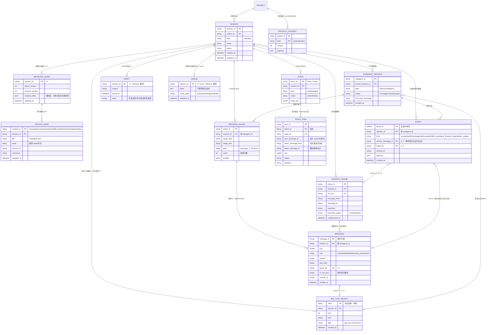

# 关于会话治理的优化方案（v8.2，2026-09-09）

> 状态：**设计稿，未实现**。代码与测试是最终事实源。
>
> 已定稿（v4–v7）：message=全量事实（append）、EVENT=结构摘要（不参与装配）、回滚走 fork、
> 运行期重试缓存、LRU 用户确认行删除、history 带 message 锚、队列=引擎待发送队列、
> 单写者锁、魔法数字进 config、GUI/CLI 数据根隔离、metadata 模块化拆分（guide 只做读索引）。
>
> v8 增补（第五轮，歧义收口）：
> 25. **message 条目 = 事件行**（沿用当前代码约定；tool_call + 其 result 属同一逻辑轮次，
>     但不影响分片行数）；分片按事件行计数；
> 26. **区间端点约定**：message 区间 `[message_from, message_to]` **含端点**；
>     EVENT.anchor_message_id = 事件发生在**该行之后**；本约定同时写入 MEMORY.md；
> 27. **commit_id 粒度 = 一次持久提交**（可含多条事件行）；同一提交内的行共享 commit_id；
> 28. **装配材料原则（修正）**：读操作的内容**不得用抽象索引替代**——涉及文件的新材料
>     写入文件/结果存储（message 保留内容或 ref）；其余读到的信息直接以 message 内容
>     发给 AI（AI 需要看内容，不理解抽象索引）；
> 29. **成功判定**：无重试 = 工具正常返回即成功；有重试 = 成功后再读确认，确认后才落
>     最终成功 message；
> 30. **K = 同一操作的重复次数**；wire 只装配同一操作最近 K 条尝试；
> 31. **检索范围 = 单会话内**；索引 = 会话级**关键词模糊索引**（后续可升向量）；
> 32. **subagent 大工具输出复用主会话 big_tool_result**（子代理不建独立 blob 目录，
>     主会话方便统一读取；GC 引用扫描跨主会话与子代理消息）；
> 33. 其余歧义按第 4 节“术语表与不变量”收口（fork 起点、history 锚、直发规则、
>     guide 自愈读、锚 ≤ watermark 等）。
>
> v8.1 增补：新增 §5“R2 装配读取器契约”（供新对话按契约实现）；同目录 README.md
> 已统一为同一口径（README 为总览，本文件为权威明细）。
>
> v8.2 增补：新增附录 D“功能测试用例（headless 前门禁）”——每个功能在实现阶段就带
> 确定性单元/集成测试，禁止“先堆功能、最后统一 headless 才发现问题”。

## 0. 方案简述

已知 session 目前的结构如下：

```text
   0k                                                                                                                       200k
   ├──────────────────────────────────────────────────────────────────────────────────────────────────────────────────────────┤
   ├─system─┼─project─┼─memory/blocks─┼─stacks_compact_latest─┼─session_context(with skill record)─┼─plan/task─┼─latest_input─┤

   with goal_stack:
   ├────goal_latest────┤
   ……（按时间更早展开）……
   ├────goal_earliest───┤
```

- goal_stack：agent 发起聊天后查看 goal 状态，栈空则继续正常对话，否则与 techleader 进行
  a2a 直到 goal 栈清空；goal 的发现/展开是运行时治理流。
- plan/task 栈与 goal 栈不同：以**批次**为单位维护与弹栈（条目 4）。
- 三类记录：message（持久，最终成功事实）、EVENT（结构性操作摘要）、
  操作尝试缓存（运行期非持久）。

### 0.1 两种上下文口径

- 前端/历史上下文 = message 持久事实（UI 翻页、看压缩前内容、追溯）；
- LLM wire 上下文 = compact 摘要 + 最新尾窗 + 最近 K 条尝试（K=同一操作重复次数）；
- 例：用户想看压缩前内容 → 前端读 message；LRU 已确认淘汰区显示摘要占位。

## 1. 事实模型

1. **message = 会话内容事实源**：条目=事件行（v8），append 增量、不重写。
2. **装配材料原则（v8）**：AI 需要看内容——涉及文件的新材料写入文件/结果存储
   （message 保留内容或 ref）；其余读到的信息直接以 message 内容发给 AI，
   不以抽象索引替代。
3. **EVENT = 结构性操作摘要**：不参与上下文、不承担幂等计数。
4. 尝试先进运行期缓存；**最终成功**（定义见第 4 节）才 append 进 message。
5. compact = 派生裁剪视图；超阈值进入用户确认的 LRU 淘汰。
6. 前端与 LLM 同源于 message，形状不同；历史回退走 fork。
7. 整条会话记录可检索：**单会话内**、**关键词模糊索引**（v8），索引可重建。
8. fork 深拷贝 = 现存 message ≤ from_message_id + 该点栈/上下文快照（history 锚重建）；
   引擎待发送队列不拷贝。

## 2. 存储布局与条目

### 0. metadata：模块化 head + guide 读索引

metadata 下全是会话粒度的热点数据，单一文件会造成跨模块写锁与整文件重写热点，故按模块
拆分；guide 只负责读索引/路由。

```text
session/metadata/
  guide.json           # 读路径索引/路由（低频：模块注册、滚动、版本变更）
  message.json         # message head（热）
  compact.json         # compact head（热）
  event.json           # event head（热）
  stack.json           # plan/task/goal 栈 head（热）
  lifecycle.json       # queue_head + draft_head（同模块，保证迁移原子）
  retention.json       # LRU 水位/淘汰状态
  subagent.json        # 子代理清单
  media.json           # 媒体索引（预留）
```

规则：
1. 各模块 json 只装自己通道的 head/水位，是“该模块提交发布点”：先 append → 模块内原子替换。
2. 写锁按模块，模块间互不阻塞；不设全会话 metadata 写锁。
3. guide 只做读索引/路由（layout/schema/模块清单），低频更新；读路径 =
   guide → 模块 json → 数据文件；reader 打开模块文件后校验 schema/checksum，
   不匹配则重读一次（自愈读）。
4. 跨模块一致性 = 固定写序 + commit_id 幂等 + 恢复修补；允许模块间短窗口分离
   （定义见第 4 节；message 为权威，event 缺失可补 interrupted）。
5. 大索引（shard_index、检索索引）是可重建派生物，放 `session/metadata-index/`，
   不混入模块 head。

### 1. system / project / memory（项目粒度）

- system、project 存项目下 jsonl，不随会话复制；memory（MEMORY.md）暂不纳入；
  会话级可检索记忆 = 单会话关键词模糊索引。

### 2. compact：派生摘要帧（`session/compact.jsonl`）

- 一行 = 一次压缩覆盖 [message_m, message_n]（含端点），元素与现有 CompactFrame 一致。
- 写序：消息已是事实 → append 摘要帧 → 原子替换 compact.json。
- 淘汰联动：compact 超阈值 → 用户确认 → LRU 行删除（更新 retention.json 水位）。

### 3. message：全量事实、append、fork、恢复、淘汰与检索

- 存放：`session/message/message_{m}_{n}.jsonl`（正常运行期 append-only）。
- **条目约定（v8）**：一条 = 一个事件行（当前代码约定）；assistant 的 tool_call 与其
  result 属同一逻辑轮次，但仍是独立事件行；分片按事件行数（默认 100 行/片）。
- 元素：message_id（事件行键）、seq、role、content、tool_calls、result_ref、
  in_out_json（最终成功载荷）、commit_id、created_at。
- **提交语义**：append 数据 → 原子替换 message.json；成功判定 = message.json 已发布。
- 区间约定：`[message_from, message_to]` 含端点；EVENT.anchor_message_id = 事件发生在
  该行**之后**。
- 恢复：R1 UI/历史读 message；R2 = compact 摘要 + message_n 之后 + 最近 K 条尝试；
  R3 = interrupted 锚点后尾段。
- 回滚：走 fork；rolled_back 仅 EVENT 审计标记。
- LRU 行删除：只删 watermark 之前（连续前缀），message_id/seq 保持空洞不重编号；
  实现 = 写新分片 → 原子替换 message.json → 更新 retention.json → 删旧分片。
- fork：起点必须 ≥ watermark；拷贝 [watermark, from_message_id] 实际行，watermark 之前
  由摘要承接；起点早于 watermark 显式报错；队列与 draft 不拷贝。
- 记忆检索：**单会话内关键词模糊索引**（v8）；索引在 metadata-index/，可重建、允许落后。

### 4. plan / task / goal 栈（按批次，含 message_id 锚）

- 存放：`session/{plan,task,goal}/{active.jsonl,history.jsonl}`；head 在 stack.json。
- 批次语义：批次内未完成 → 整批留 active；全部完成 → 整批弹栈归档进 history.jsonl。
- **history 锚（v8）**：`item_message_id` = 条目进入 active 时的 message 坐标；
  `batch_message_to` = 整批完成弹栈时的 message 坐标；`batch_message_from` = 批次首个
  条目进入时的坐标。用途：观赏 + 按 message 点重建栈快照（历史 fork）。
- 状态迁移由 EVENT（goal.*/task.*/plan.*）记录。

### 5. 会话单例生命周期对象

#### 5.1 input 草稿

- `session/input/draft.json(l)`；head 在 lifecycle.json（与队列同模块）。

#### 5.2 消息队列 = 引擎待发送请求队列

- `session/queue/queue.json(l)`；head 在 lifecycle.json。
- 流转：
  - 草稿 → 队列（入队成功即清空草稿），或草稿直接发送；
  - 队列 FIFO，队首可发即发，否则等待；
  - **直发规则（v8）**：队列空 → 立即发送；队列非空 → 直接发送也入队尾；
  - 发送成功：in/out 落 message 并发布 message.json → 出队/标记 sent；
  - 发送失败：内容回草稿；草稿直发失败也回草稿；
  - 顺序：先队列后草稿；
  - 已发送未确认（崩溃）→ 重发；message.json 发布 = 最终确认与出队判定。
- 草稿↔队列迁移在 lifecycle 模块内原子完成。

#### 5.3 操作尝试缓存（运行期，非持久）

- 会话运行期内存；不进 metadata、不进备份、进程退出即清空。
- 每次操作尝试写入缓存；wire 只装配**同一操作最近 K 条尝试**（K = 该操作重复次数，
  默认 3；max_items/max_chars 先到先淘汰最旧）。
- **成功判定（v8）**：无重试 = 工具正常返回即成功；有重试 = 成功后再读确认
  （verify 目标状态）后才算最终成功，落 message 并发布 message.json；
- 事务边界：成功 = message.json 已发布；外部副作用先于落盘的间隙为已知风险，
  由 EVENT interrupted + 恢复提示承接，不自动重放危险操作；
- 重启后缓存清空，失败尝试不可回放；持久侧只留最终成功 + interrupted。

### 6. big_tool_result（超大工具输出）

- 存放：`session/big_tool_result/<hash>.jsonl`（**主会话统一持有**）。
- **subagent 复用（v8）**：子代理不建独立 blob 目录，其大工具输出写入主会话
  big_tool_result；主会话 message/EVENT 与子代理 message 都可引用；GC 引用扫描
  需跨主会话与子代理消息，无引用才回收。
- 软限截断 + result_ref；硬限不落盘直接报错；配额 + GC；
  blob 索引为可重建派生物（不设全局 blob 账本）。

### 7. EVENT：结构性操作摘要

- `session/event/event_{1..100}.jsonl`；head 在 event.json。
- kind：compacted/fork/subagent/interrupted/rolled_back（审计标记）/request·turn 边界/
  goal.*/task.*/plan.*/token_usage/session_archived。
- 行结构见附录 A；anchor_message_id = 事件发生在该行之后；不复制正文、不参与装配。

### 8. fork 的两种形态

#### 8.1 fork session

- 从主会话某 message_id fork 独立项目级会话；起点 ≥ LRU watermark。
- 拷贝 = [watermark, from_message_id] 实际行 + 按 history 锚重建的该点栈/上下文快照；
  watermark 之前摘要承接；队列与 draft 不拷贝。
- 主会话写 fork EVENT；子会话建立自己的 metadata/。

#### 8.2 fork subagent

- 存 `session/subagent_<hash>/` 子树（message/event/metadata 同构），**无独立
  big_tool_result**（引用主会话 blob，v8）；主会话只写 subagent EVENT；
  子代理结束可归档/删除，blob 按跨消息引用 GC。

### 9. 数据根、进程唯一性与 GUI/CLI 隔离

- GUI/CLI 各自数据根；单数据根 = 单进程写者（独占锁 + owner_process）。
- 陈旧锁：pid + 启动时间戳；pid 不存在或锁龄超 `stale_after_seconds`（默认 300）为陈旧，
  默认提示拒绝，`auto_recover=false`。

### 10. 媒体/多模态（后续规划）

- 有项目关联：工作区媒体目录 + 消息引用；无项目关联：
  `session/meta/<hash>/<原名>`；索引放 media.json（预留）。

### 11. 魔法数字初稿（并入现有 limits/config 体系）

| 配置键（建议） | 默认值 | 含义 |
|---|---|---|
| `session_storage.message.shard_rows` | 100 | 每分片事件行数 |
| `session_storage.retry_cache.max_items` | 64 | 尝试缓存条目上限 |
| `session_storage.retry_cache.max_chars` | 8388608 | 尝试缓存字符上限（8 MB） |
| `session_storage.retry_cache.wire_recent_errors` | 3 | 同一操作最近 K 条 |
| `session_storage.retention.compact_frame_threshold` | 30 | compact 帧数阈值 |
| `session_storage.retention.raw_bytes_alert` | 268435456 | 原始 message 告警（256 MB） |
| `session_storage.retention.mode` | manual | 用户确认后行删除；dry_run=true |
| `session_storage.queue.persist_pending` | true | 待发送队列落盘恢复 |
| `session_storage.lock.stale_after_seconds` | 300 | 陈旧锁判定 |
| `session_storage.lock.auto_recover` | false | 陈旧锁接管 |
| `session_storage.big_tool_result.soft_limit_chars` | 60000 | 对齐 DefaultToolResultLimit |
| `session_storage.big_tool_result.hard_limit_bytes` | 16777216 | 硬上限（16 MB） |
| `session_storage.big_tool_result.session_quota_bytes` | 67108864 | 会话 blob 配额（64 MB） |

#### 11.1 校准基准

长会话基准（≥500 轮、≥3 次压缩、≥5 次连续重试）：磁盘增长、R2 冷启动、wire 占用（K=3）、
LRU 删除与模块 json 发布耗时；据此校准默认值。

## 3. 存储 ER 图（v8）



说明：fork 出的独立会话是另一 SESSION；操作尝试缓存是运行态不入 ER；
LRU 行删除只发生在 watermark 之前且保留序号空洞。

### 3.1 关键关系说明

| 关系 | 语义与约束 |
|---|---|
| METADATA_GUIDE ↔ MODULE_HEAD | guide 只做读索引；模块 head 各自原子发布、写锁按模块 |
| MODULE_HEAD ↔ 数据文件 | 模块 head = 该模块提交发布点 |
| COMPACT_FRAME 覆盖 MESSAGE | [from,to] 含端点；链区间连续；open 允许未完成区 |
| EVENT → MESSAGE | anchor = 事件发生在该行之后；不复制正文 |
| STACK_ITEM → message 锚 | 观赏 + 按点重建栈快照 |
| DRAFT / QUEUE | 同 lifecycle 模块，原子迁移；队列空才直发 |
| MESSAGE / SUBAGENT_SESSION → BIG_TOOL_RESULT | 主会话统一 blob；GC 跨引用扫描 |

### 3.2 实体 → 文件

| 实体 | 文件 |
|---|---|
| PROJECT_CONTENT | `project/{system,project}.jsonl` |
| MESSAGE / MESSAGE_SHARD | `session/message/message_{m}_{n}.jsonl` |
| METADATA_GUIDE / MODULE_HEAD | `session/metadata/guide.json` + `session/metadata/<module>.json` |
| COMPACT_FRAME | `session/compact.jsonl` |
| EVENT | `session/event/event_{1..100}.jsonl` |
| STACK / STACK_ITEM | `session/{plan,task,goal}/{active,history}.jsonl` |
| DRAFT / QUEUE | `session/input/draft.json(l)` / `session/queue/queue.json(l)`（head 在 lifecycle.json） |
| BIG_TOOL_RESULT | `session/big_tool_result/<hash>.jsonl`（主会话统一；subagent 复用） |
| SUBAGENT_SESSION | `session/subagent_<hash>/`（无独立 blob） |
| 会话检索索引 | `session/metadata-index/search.*`（单会话、可重建） |
| 操作尝试缓存 | 无（运行期内存，非存储） |
| 媒体（后续） | 工作区媒体目录 / `session/meta/<hash>/<原名>` |

## 4. 术语表、端点约定与不变量（v8 权威定义）

> 本表优先于文中任何早期表述；实现与测试以此为准。

| 术语/约定 | 唯一解释 |
|---|---|
| message 条目 | 一个事件行（沿用当前代码约定）；assistant tool_call 与其 result 同逻辑轮次，但仍是独立事件行 |
| message_id / seq | 事件行键 / 会话内单调序号；UI 拆分消息以 message_id 派生，不改变存储行数 |
| 分片 | 按事件行数分片（默认 100 行/片） |
| message 区间 | `[message_from, message_to]` **含端点** |
| EVENT.anchor_message_id | 事件发生在**该行之后**（即从下一事件行起生效） |
| commit_id | 一次持久提交的标识；可含多条事件行，同提交内行共享 commit_id |
| 最终成功 | 无重试 = 工具正常返回；有重试 = 成功后再读确认（verify 目标状态）后才落 message |
| K | 同一操作的重复次数；wire 只装配同一操作最近 K 条尝试（默认 3） |
| LRU watermark | 删除只发生在 watermark 之前（连续前缀），message_id/seq 保持空洞不重编号 |
| fork 起点 | 必须 ≥ watermark；拷贝 [watermark, from_message_id] 实际行；更早区间摘要承接 |
| history 锚 | item_message_id=进入 active 坐标；batch_message_from/to=批次首/完成弹栈坐标 |
| 直发规则 | 队列空 → 立即发送；队列非空 → 直接发送也入队尾 |
| guide 读 | reader 打开模块文件后校验 schema/checksum，不匹配重读一次（自愈读） |
| 锚 ≤ watermark | 视为“已淘汰区”引用，不算损坏 |
| 检索 | 单会话内、关键词模糊索引（后续可升向量） |
| subagent blob | 复用主会话 big_tool_result，子代理不建独立 blob 目录 |
| 短窗口分离 | 多模块各自原子发布，无全局提交；message 已发布而 event 未发布的极小时间窗，
  崩溃时以 message 为准，event 缺失由恢复补 interrupted/忽略 |

不变量：

```text
I1  正常运行期 message 只 append；重写只发生在用户确认的 LRU 行删除
I2  删除只发生在 watermark 之前；空洞不重编号；锚 ≤ watermark 不算损坏
I3  message 是正文权威；compact/event/stack/history 都是派生或摘要
I4  EVENT 不参与模型上下文装配
I5  模块 head 各自原子发布；跨模块固定写序 message → event → compact
I6  操作尝试缓存非持久；重启后失败尝试不可回放
I7  fork 起点 ≥ watermark；拷贝 [watermark, from] + 摘要承接更早
I8  draft↔queue 迁移在 lifecycle 模块内原子；队列空才直发
I9  guide 只做读索引，不持有模块数据
I10 单数据根单进程写者（独占锁）
I11 subagent 无独立 blob，复用主会话 big_tool_result（GC 跨引用）
I12 检索索引 = 单会话关键词模糊索引，可重建、允许落后
```

## 5. R2 装配读取器契约（v8.1 增补）

> 定位：R2 是“构造下一次发给 LLM 的 wire 消息序列”的**纯函数**（只读、无副作用），
> 只消费持久事实（guide/module head/message/compact）+ 运行期缓存 + 请求参数，
> **不读取 EVENT**（EVENT 只服务 UI/审计/R3 快速定位）。实现放在新对话，本节约定输入、
> 输出、步骤、边界与契约测试。

### 5.1 范围边界

R2 负责“会话事实 → wire 会话正文段”；会话外段（system/project/memory/blocks、plan/task
尾部渲染、goal 说明）由装配层在 R2 之外组合。R2 输出不落盘；其“新材料”按第 1 节规则
由调用方决定是否写入 message。

### 5.2 输入

```text
guide.json + message.json + compact.json（模块 head）
message 数据分片（session/message/*.jsonl）
运行期尝试缓存（attempts：anchor_message_id + operation_key + role/content/状态 + 时间序）
请求参数：model_input、tools、budget（默认 200k/软 75%/目标 60%）、
          K（同一操作最近 K 条，默认 3）、repair 策略开关
```

### 5.3 步骤

```text
1) 读 guide → 打开 message.json/compact.json，校验 schema/checksum（不匹配重读一次）；
2) frame = compact_head 指向的最新帧；tail_start = frame ? frame.message_to + 1 : 首行；
   （[from,to] 含端点，所以 tail 从 message_to 的下一行开始）
3) wire = []
   若存在 frame：wire += frame 摘要正文（栈顶帧 Chapter2；锚点章节不发给模型）
4) 按 seq 升序读 tail_start 之后的事件行，逐行装配：
   - user_input → user 消息；
   - assistant（正文/tool_calls）→ assistant 消息；
   - tool_output → tool 消息（content 或 result_ref）；
   - internal_user/context 行：仅当 wire_material=true 才映射为内部 user 材料，
     否则跳过（只服务前端/历史）；
   - 孤儿 tool_output（当前扫描窗口无匹配宣告）→ 跳过，不进 wire；
5) 缓存拼接：当某行 message_id 是尝试缓存锚点，且该锚点在 wire 中，
   按时间序拼接该操作最近 K 条尝试（失败原因/占位），再接后续行；
6) 预算控制：达到软预算后只保留到最近**完整协议单元**边界；仍超限 →
   返回 need_compact 信号，由压缩路径处理；
7) 流尾 open 单元（残缺工具轮/缺 result）：
   - 保留为 open 单元 + provider 安全修复占位（补齐缺失 tool 结果），
     断点续扫不跳后续 user；
   - 已由 EVENT interrupted 标记的断点只用于加速定位，不改变本函数正确性；
8) 输出：wire 消息序列 + 版本摘要（供前缀稳定性比较）。
```

### 5.4 输出与稳定性

- 输出 = `[]Message`（有序）+ `need_compact` + `prefix_digest`。
- 稳定性：无新消息、同参数、同缓存状态下，两次 R2 输出前缀逐字节一致
  （字节级前缀缓存前提）。
- 尝试缓存属于运行态：缓存清空后 wire 可能变化，因此**只有 frame + 持久 tail 部分
  承诺字节级稳定**；缓存拼接段只承诺活动窗口内稳定。

### 5.5 与短窗口分离、LRU 的关系

- R2 不依赖 EVENT：message/compact 已发布即正确；event 缺失不影响 R2
  （event 只用于 UI/审计/R3 定位）。
- LRU watermark 只删除 frame 之前的旧区；R2 只读最新 frame 与其 message_to 之后的
  tail，不受删除影响；frame.message_to 前的内容以摘要进入 wire。

### 5.6 契约测试清单（实现时逐条转测试）

| 编号 | 场景 | 断言 |
|---|---|---|
| R2-STABLE-1 | 无新消息连续两次 R2 | 前缀逐字节一致 |
| R2-TAIL-1 | 压缩后 tail 起点 | 从 frame.message_to 的下一行开始，端点含端点正确 |
| R2-FILTER-1 | internal/context 行 | 仅 wire_material=true 进 wire，其余跳过 |
| R2-CACHE-1 | 同一操作重试 >K | wire 只含最近 K 条、时间序正确 |
| R2-ORPHAN-1 | 孤儿 tool 行 | 不进入 wire |
| R2-OPEN-1 | 流尾残缺工具轮 | open 单元 + 修复占位，不丢后缀 |
| R2-BUDGET-1 | 预算超限 | 停在完整单元边界并置 need_compact |
| R2-EVENT-1 | event 缺失（短窗口崩溃） | R2 输出不受影响 |
| R2-WM-1 | LRU 已删旧区 | R2 只依赖 frame + tail，正常输出 |
| R2-FORK-1 | fork 起点 < watermark | 拒绝并提示（不静默截断） |

## 附录 A：EVENT 详细设计（v8）

### A.1 定位

EVENT 记录“对会话做了什么”的结构性操作摘要，不进入模型上下文；重试/失败由运行期缓存
承载，EVENT 不记录 repeat_count。

| kind | 场景 | 关键 payload |
|---|---|---|
| `compacted` | 哪个 message 之后压缩 | message_to、frame_id、reason、前后 token |
| `fork` | 从哪个 message fork 独立会话 | child_id、from_message、copy_range |
| `subagent` | 子代理 fork/merge | subagent_id、path、from/merge message、result_ref |
| `interrupted` | 中断断点（可能含未记录副作用） | 锚点、缺失 tool_call_id、side_effect_hint |
| `rolled_back` | 审计标记（能力走 fork） | 目标坐标、原因 |
| `request_begin/end`、`turn_begin/end` | 边界 | request/turn 坐标 + message 锚 |
| `goal.*` / `task.*` / `plan.*` | 状态迁移 | item/batch id、message 锚、前后状态 |
| `token_usage` | 用量 | tokens、聚合键 |
| `session_archived` | 归档/删除 | 位置、范围 |

### A.2 存储格式

- `session/event/event_{1..100}.jsonl`（append-only）；head 在 event.json。
- 行结构：event_id、kind、anchor_message_id（=事件发生在该行之后）、frame_id、
  commit_id、payload、created_at。
- 模块化提交：固定写序 message → event；崩溃允许 event 短窗口落后于 message，
  恢复按锚点补 interrupted 或忽略（先写模块为准）。
- 幂等：commit_id + 事件指纹去重。

### A.3 payload 示例

```jsonc
{"event_id":42,"kind":"compacted","anchor_message_id":"message-260","frame_id":"compact-s-1",
 "payload":{"reason":"context_budget","before":{"tokens":175000},"after":{"tokens":85000}}}

{"event_id":57,"kind":"fork","anchor_message_id":"message-88",
 "payload":{"child_id":"c-9","child_kind":"fork_session","from_message":"message-88",
            "copy_range":{"message_from":"message-1","message_to":"message-88"}}}

{"event_id":60,"kind":"interrupted","anchor_message_id":"message-95",
 "payload":{"request_id":"req-10","missing_tool_call_id":"t2","boundary_status":"open",
            "side_effect_hint":"外部副作用可能已生效"}}

{"event_id":63,"kind":"subagent","anchor_message_id":"message-120",
 "payload":{"subagent_id":"sub-3","path":"session/subagent_<hash>/","merge_message":"message-119",
            "result_ref":"tr-...","status":"merged"}}
```

### A.4 使用场景

| 场景 | 消费者 | 用到的 kind |
|---|---|---|
| 断点续跑 | 恢复装配 | interrupted / compacted |
| fork 血缘与工作台 | fork 工具、goal 控制器 | fork / subagent / goal.* / task.* |
| UI 时间线/治理审计 | 前端、设置面板 | compacted / token_usage |
| 会话生命周期 | archive / reconcile | session_archived |

## 附录 B：与旧布局/rollout 的关系（迁移）

- 新会话按 v8 布局写入；旧 rollout/manifest/generation/transcript 只读兼容，
  不自动改写存量数据；迁移单独方案 + 备份 + 中文预警确认。
- 布局判定：存在 `session/metadata/guide.json` = 新布局；存在 `manifest.json` = 旧布局；
  运维工具需同时支持两套。

## 附录 C：遗留待定（后续细化项）

1. 关键词模糊索引的具体实现（倒排/ngram/正则层）与内存预算；
2. memory 项目级存储最终形态（MEMORY.md 变更频率讨论后定）；
3. 媒体通道去重/配额/缩略图细节；
4. subagent 深层嵌套（subagent 再 spawn）的路径与血缘表达；
5. LRU/缓存/配额默认值以 11.1 校准后修订；
6. 操作尝试缓存“重启后失败尝试不可回放”已接受；
7. 跨模块短窗口分离已接受（定义见第 4 节）；若未来要求强一致，需引入跨模块提交账本。

## 附录 D：功能测试用例（headless 前门禁）

> 门禁原则：每个阶段（README §8 的 M1–M5）实现时必须同步交付本附录对应 T-* 测试；
> 测试在存储层/读取器层直接构造数据并断言，不依赖 GUI。headless 只做跨模块装配冒烟，
> 不作为发现功能 bug 的兜底。以下用例已按“可转 Go 单测”的粒度书写。

### D.0 通用前置

```text
构造：临时数据根 + 一个 session；
提交：commit(rows) 表示“append rows → 原子发布对应模块 json”；
断言原则：先断言 head/文件，再断言读结果；所有文件操作用显式路径，不依赖目录扫描。
```

### D.1 M1：message 事件行 + metadata 模块化

| 编号 | 前置/数据 | 步骤 | 期望 |
|---|---|---|---|
| T-M1-01 | 空会话 | 首次 commit([u1]) | 生成 guide.json + message.json；head.last_message_id=u1；可读 |
| T-M1-02 | 一提交含 3 行 | commit([u1,a1,t1]) | 三行共享同一 commit_id；按 seq 重放顺序 u1→a1→t1 |
| T-M1-03 | 文件尾部存在半行 | 模拟崩溃残尾后恢复 | 截断/忽略半行；head 不前进；verify 通过 |
| T-M1-04 | append 完成但 message.json 未替换 | reader 读取 | 新行不可见（reader 以 head 为准） |
| T-M1-05 | 并发写 stack 与 message | 两个 goroutine 各自 commit | 不互相阻塞（模块锁独立）；两端 head 各自正确 |
| T-M1-06 | reader 读到旧 message.json | writer 正替换模块 json | reader 校验 checksum 失败后自愈重读，结果一致 |
| T-M1-07 | 已有 100 行 | commit 第 101 行 | 滚动到 message_101_200.jsonl；message.json 指向新分片 |
| T-M1-08 | 重复同一 commit_id | 重复持久化 | 幂等：行不重复、head 不双跳 |

### D.2 R1：前端/历史读取

| 编号 | 前置/数据 | 步骤 | 期望 |
|---|---|---|---|
| T-R1-01 | 100 行含 internal/context | 分页读取（每页 20） | 页序稳定；internal/context 按展示规则过滤/标记 |
| T-R1-02 | 有 compact 帧覆盖 [1,50] | R1 读取前 50 行 | 仍能读到全部原始行（压缩不删正文） |
| T-R1-03 | 已 LRU 删除 watermark 前行 | R1 读取历史 | 删除区返回摘要占位；不 panic、不返回空洞错位 |
| T-R1-04 | assistant 带 2 个 tool_calls | UI 展开 | 存储仍是 1 事件行；UI 派生多条展示消息，不影响读序 |

### D.3 R2：装配读取器（对应 §5.6，转为可执行用例）

| 编号 | 前置/数据 | 步骤 | 期望 |
|---|---|---|---|
| T-R2-01 | 5 行 + 无 frame | 连续两次 R2 | 输出前缀逐字节一致（digest 相同） |
| T-R2-02 | frame=[msg3,msg7] | R2 | 摘要在前；首条 tail = msg8（端点含端点语义） |
| T-R2-03 | internal_user(wire_material=false) | R2 | 跳过；仅 wire_material=true 的行进 wire |
| T-R2-04 | 同操作重试 5 次入缓存 | K=3 跑 R2 | wire 只含最近 3 条、时间序正确；K=2 变体只含 2 条 |
| T-R2-05 | 缓存已清空 | 再跑 R2 | 无尝试说明行；输出与纯持久数据装配一致 |
| T-R2-06 | 孤儿 tool 行（无宣告） | R2 | 不进入 wire |
| T-R2-07 | assistant 宣告 c1,c2，缺 c2 结果且无后续 user | R2 | open 单元保留 + c2 修复占位；不丢尾 |
| T-R2-08 | 同 07 但有后续 user | R2 | 修复后继续，不跳 next user、无重排 |
| T-R2-09 | 预算极小 | R2 | 停在最近完整单元边界；need_compact=true |
| T-R2-10 | 删除 event.json 条目（模拟短窗口崩溃） | R2 | 输出与 event 存在时一致（R2 不读 EVENT） |
| T-R2-11 | LRU 已删 watermark 前旧区 | R2 | frame + tail 正常输出（只依赖最新 frame 与其后 tail） |
| T-R2-12 | fork 起点 < watermark | R2/Fork 校验 | 显式报错，不静默截断 |
| T-R2-13 | 重启前有 13 轮，重启后首请求 | R2 与运行期基线比对 | 前缀一致（对照既有 I-LOG-4 语义） |

### D.4 R3：断点续跑

| 编号 | 前置/数据 | 步骤 | 期望 |
|---|---|---|---|
| T-R3-01 | interrupted 锚 msg95，后续 user 已到 msg120 | R3 从断点续跑 | 只处理断点后尾段；无重复、无遗漏 |
| T-R3-02 | 消息完整但 interrupted 事件缺失（event 滞后） | 恢复 | 不合成虚假 interrupted（message 完整为准） |
| T-R3-03 | 消息本身残缺（缺 tool 结果）且 event 缺失 | 恢复 | 合成 interrupted 并给修复占位 |
| T-R3-04 | 重启后尝试缓存为空 | 恢复后 R2 | 不依赖缓存即可装配；不 panic |

### D.5 lifecycle：draft / queue

| 编号 | 前置/数据 | 步骤 | 期望 |
|---|---|---|---|
| T-LC-01 | 草稿内容 D | D→入队 | queue 含 D，draft 清空（同一次 lifecycle 提交） |
| T-LC-02 | queue=[Q1,Q2] | 队首 Q1 阻塞 | Q2 不插队；Q1 成功后 Q2 才发 |
| T-LC-03 | 队列空 + 草稿 D | 直接发送 | 立即发送（不进队） |
| T-LC-04 | 队列非空 + 草稿 D | 直接发送 | D 入队尾，不插队 |
| T-LC-05 | 队首发送失败 | 观察 | 内容回草稿；队列移除该项 |
| T-LC-06 | 草稿直发失败 | 观察 | 内容回草稿 |
| T-LC-07 | 已发送但 message.json 未发布 | 重启 | 该项重发一次 |
| T-LC-08 | message.json 已发布 | 重启 | 不重发；队列出队（message 落盘=最终判定） |
| T-LC-09 | 非法状态迁移（queued→sent 无发送记录） | 调用 | 拒绝 |

### D.6 fork（session / subagent）

| 编号 | 前置/数据 | 步骤 | 期望 |
|---|---|---|---|
| T-FK-01 | 主会话 [watermark..100]，from=88 | fork session | 子会话含 [wm..88] 行 + 该点栈/上下文快照；队列/draft 为空 |
| T-FK-02 | 批次 B 部分完成，from 落在批次中 | fork | 子栈 = history 重建 + 仅含 ≤from 的 active 条目；>from 条目排除 |
| T-FK-03 | from < watermark | fork | 显式错误（不产生半成品会话） |
| T-FK-04 | fork 时并发写入 | fork | 基于固定 head 的一致快照（读时锁定语义） |
| T-FK-05 | spawn subagent | 观察 | 生成 subagent_<hash>/ 子树（metadata/message/event）；无独立 blob 目录 |
| T-FK-06 | subagent 大工具输出 | 观察 | result_ref 指向主会话 big_tool_result，可读回 |
| T-FK-07 | fork 后删除父会话 | 子会话恢复 | 子会话自包含可恢复（消息+引用 blob 均已物化） |
| T-FK-08 | 归档 subagent 后 | 主会话恢复 | 不受影响；主会话保留 subagent EVENT |
| T-FK-09 | 主会话与子代理消息均不再引用某 blob | GC | blob 被回收；任一仍引用则保留 |

### D.7 LRU / retention / watermark

| 编号 | 前置/数据 | 步骤 | 期望 |
|---|---|---|---|
| T-WM-01 | mode=manual | 触发淘汰 | 拒绝自动删除，返回“需用户确认” |
| T-WM-02 | 用户确认删除 [wm 前 30 行] | 执行 | message_id/seq 空洞保留；watermark 前移；R1/R2 行为符合占位语义 |
| T-WM-03 | 删除后 verify | 执行 | 空洞被接受（不算损坏）；checksum/head 一致 |
| T-WM-04 | 删除重写中途崩溃 | 恢复 | 旧分片+旧 head 完整（新分片未发布=未发生）或新 head 已发布二选一，无中间态 |
| T-WM-05 | 行删除后无引用 blob | GC | blob 回收；检索索引摘要仍可命中该区 |

### D.8 EVENT / 锚点 / 幂等

| 编号 | 前置/数据 | 步骤 | 期望 |
|---|---|---|---|
| T-EV-01 | compacted anchor=msg7 | 断言 | 事件位于 msg7 之后；R2 tail 从 msg8 开始 |
| T-EV-02 | 同 commit 重复持久化 | 断言 | 事件不重复（指纹幂等） |
| T-EV-03 | message 完整但 compacted 事件缺失 | 恢复 | 不补事件也可正常装配（compact.json head 为准） |
| T-EV-04 | event 锚 ≤ watermark | verify | 视为已淘汰区引用，不算损坏 |

### D.9 检索 / blob / 配置

| 编号 | 前置/数据 | 步骤 | 期望 |
|---|---|---|---|
| T-SR-01 | 构造含关键词的 3 个会话片段 | 建索引 + 模糊检索 | 命中正确片段区间；范围=本会话（不跨会话） |
| T-SR-02 | append 后未重建索引 | 检索 | 允许落后；重建后结果一致（可重建断言） |
| T-SR-03 | LRU 删除后重建索引 | 检索 | 被删区只回摘要命中，无悬空原文 |
| T-BL-01 | 输出 > hard_limit | 工具写入 | 不落盘、返回明确错误 |
| T-BL-02 | 输出 > soft_limit | 工具写入 | 截断 + result_ref；read_tool_result 可读回 |
| T-BL-03 | 超会话配额 | GC dry-run | 输出可回收清单，不自动删 |
| T-CFG-01 | 修改 wire_recent_errors/阈值 | 生效断言 | 配置覆盖默认值；非法值被拒绝 |

### D.10 门禁执行规则

```text
1. 每阶段（M1–M5）PR：必须包含该阶段全部 T-* 且全绿；
2. 新增字段/语义：先在“术语表与不变量”（§4）登记，再补对应 T-*；
3. headless 冒烟只在 T-* 全绿后运行，负责跨模块装配，不负责发现功能 bug；
4. 失败修复遵循 MEMORY.md“先复现再修复”，用例留作回归。
```
