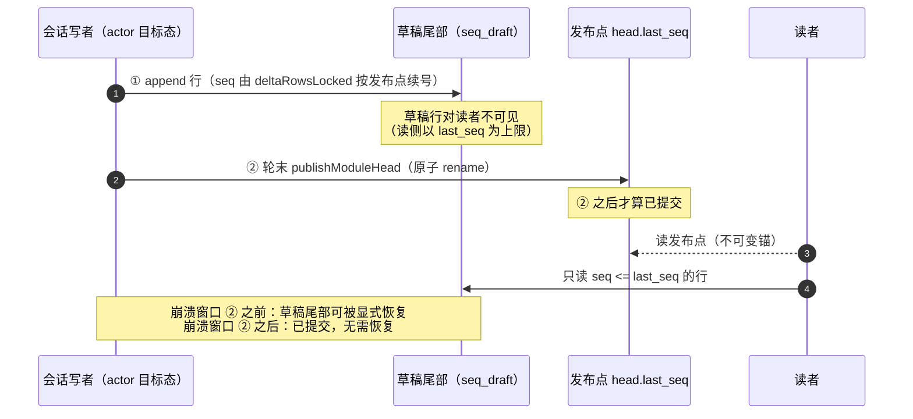
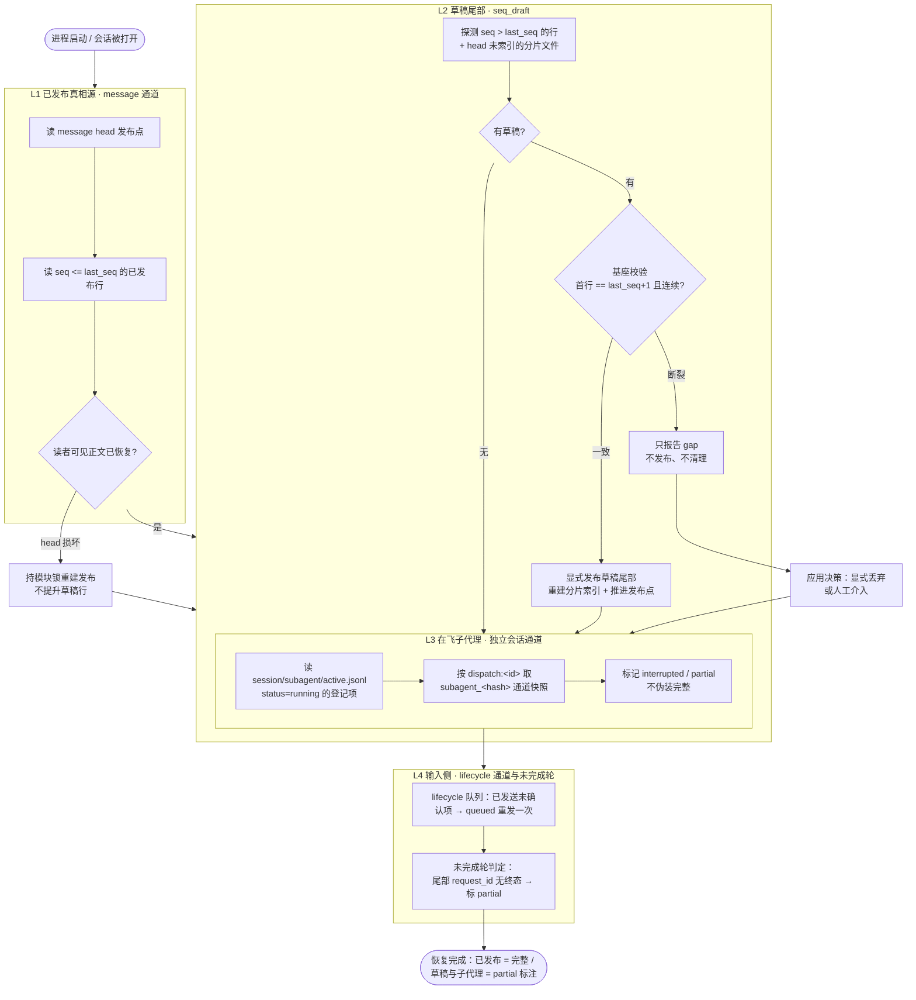
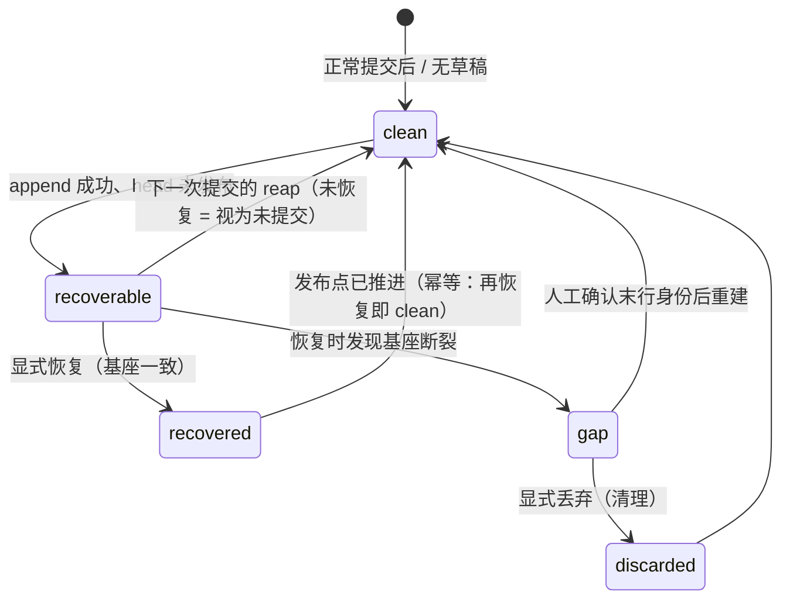

# 会话中断恢复顺序（seq_draft / 草稿尾部）

> 状态：**已落地 L1/L2 存储层 + 端口**（2026-09-22）｜L3 复用既有子代理通道｜L4 依赖前置项
> 关联：`my_design.md` §2.0 规则 4（提交凭据）、§3 message 通道（唯一正文事实源）、§8.3（发言权 Floor）、
> 实现：`sessionstore/pending_tail.go`、测试：`sessionstore/pending_tail_test.go`

---

## 1. 结论先行

**中断后不是"只能恢复到前缀"**——真相源是 append-only 行 + **一个发布点**，
所以恢复边界是**上一次提交点**，而不是"前缀匹配"。

当前写路径的提交粒度是**一轮一次**（`chat.go:265`），轮内另有压缩点
（`context_runtime/coordinator.go:118`）与计划/任务栈（每次节点变化都提交）。
因此中断丢失的是**当前这一轮的未提交部分**。本文件定义这段"未提交部分"
（草稿尾部 / seq_draft）的**恢复顺序与拒绝条件**。

---

## 2. 三个术语钉死

| 术语 | 定义 | 代码位置 |
|---|---|---|
| **发布点** | `message head.last_seq`：`seq <= last_seq` 的行为**已提交**、对读者可见 | `sessionstore/message_rows.go`（`messageHead.LastSeq`） |
| **草稿尾部 / seq_draft** | 物理上已写入分片、但 `seq > head.last_seq` 的行（含 head 未索引的分片文件）——**未提交** | `sessionstore/pending_tail.go`（`pendingTailLocked`） |
| **基座校验** | 草稿尾部必须**恰好**是发布点的连续后续：首行 = `last_seq+1` 且逐行 +1；否则为**基座断裂**，拒绝发布 | `pending_tail.go`（`classifyPendingTail`） |

> 为什么不是"另开一个 seq_draft 文件"：草稿尾部**已经是**同语义的两阶段窗口，
> 且读侧天然按发布点过滤（`readRowsLocked` 以 `last_seq` 为上限，草稿对读者
> 不可见）。另开文件会引入"草稿 ↔ message"的第二份对账域，反而增加而不是
> 减少前缀连续性判定。

---

## 3. 写路径：三阶段提交

**关键性质**：`append` 与 `publish` 之间就是"草稿"的全部定义域；`head_self_heal`
的读者自愈**禁止**在任何情况下把这段行提升为已提交（D2 红线）——只有显式
恢复入口允许推进发布点。

---

## 4. 恢复顺序（L1 → L4）

### 4.1 顺序为什么是这样

| 层 | 为什么必须在这个位置 | 依赖 |
|---|---|---|
| **L1** | 发布点内是唯一权威正文；先拿到它才能判定 L2 的**基座** | 无 |
| **L2** | 草稿尾部的可发布性取决于 L1 的发布点；且必须在**下一次提交**之前处理——提交路径的 `reapUnpublishedLocked` 会按「未提交 ⇒ 清理」抹掉它 | L1 的 `last_seq` |
| **L3** | 子代理各自独立会话通道，恢复只依赖登记表 + 各自通道，与 L2 无耦合 | `subagent/active.jsonl` |
| **L4** | 决定"这一轮算不算完成"，是 UI 呈现（partial vs 完整）的最后一步 | L1/L2 的尾部 request_id |

> **L3 的恢复上限 = 子会话自己的提交粒度**。所以"seq_draft 阶段同步派出的
> subagent 内容"要真正可恢复，WAL 语义必须对**所有会话通道同构**（main /
> role-* / subagent_&lt;hash&gt;/），不能只做 main。

---

## 5. 草稿尾部状态机

对应 API 返回值：`clean` / `recoverable` / `recovered` / `gap` / `discarded`。

---

## 6. 本次落地的 API 面

| 层 | 方法 | 说明 |
|---|---|---|
| 存储实现 | `storeEngine.pendingTailReport` / `recoverPendingTail` / `discardPendingTail` | 均在 `messageMu` 内；恢复路径**不做 reap** |
| Router | `PendingMessageTailWorkspace` / `RecoverPendingMessageTailWorkspace` / `DiscardPendingMessageTailWorkspace` | 非 v8 布局返回 `ok=false` |
| 会话粒度存储 | `SessionGranularStore.PendingMessageTail` / `RecoverPendingMessageTail` / `DiscardPendingMessageTail` | 项目作用域解析同既有约定 |
| 适配器 | `SessionPort.*Workspace`（三件） | 返回 `sessionstore.PendingTailReport` |
| 应用侧 | 待装配：会话加载/恢复入口调用"探测 → 决策 →（恢复 | 丢弃）" | 见第 7 节前置项 |

**幂等性**：发布凭据取草稿行自带的 `commit_id`（确定性；S17/D13 禁止现造随机
凭据），因此重复恢复是空操作（第二次探测即 `clean`）。

---

## 7. 红线与未落地项

### 红线（改动此处必须重新论证）

1. **读侧不得提升草稿行**：`head_self_heal` 的读者自愈只允许重建**已发布**
   head，绝不能把 `seq > last_seq` 的行变成已提交（否则并发写者的未提交内容
   被静默固化）。
2. **Seq 只能在发布时刻续号**：草稿行不带"最终 Seq"（或必须原样保留提交路径
   写入的号）；任何让草稿自行分配全局 Seq 的设计都会与并发写者冲突。
3. **基座断裂只报告**：`gap` 状态下不发布、不清理、不猜测——把决策显式留给
   应用/人工。
4. **整份重写分片的路径必须保住草稿尾部**：LRU 删除（`lruDelete`）、compact、
   分片切分都重写分片文件；引入"长期存在的未发布尾部"后，这些路径必须显式
   保留/重写尾部行，否则草稿会被静默吃掉。

### 未落地项（及其前置条件）

| 项 | 内容 | 前置条件 |
|---|---|---|
| 每步 append（草稿粒度从"轮"降到"step"） | 在 step 边界（`handleToolStart`/`handleToolComplete`/`appendDelta`）只 append 行、**不动 head** | 需要**分配器改动**：`deltaRowsLocked` 现按 `head.LastSeq` 续号，逐步 append 必须改为按"物理末行"续号，否则第二段草稿会与第一段**同号**而被去重逻辑静默丢弃 |
| 写者 actor 化 | per-(workspace,session) 单写者收口 8 个写调用点（`chat.go:265`、`coordinator.go:118`、`content_lru.go:194`、`resident_lru.go:145`、`session_draft.go:56`、`session_lifecycle.go:148`、`archive_session.go:67`、`session_fork.go:118`） | 可复用 `seelebridge/internal/actor`（`seelactor.New`）；读侧改不可变投影（`stackViews` 范式）以消除 C1 锁热点 |
| durable queue 写入侧接线 | `queueEnqueue` / `saveDraft` / `draftToQueue` 目前**只有测试调用**，主链路用户输入仍在内存队列 | 无（最小改动、收益直接） |
| fsync 策略 | 每步 append 是否 `file.Sync()`：不 sync = 进程被杀可恢复、断电丢；每步 sync = 断电可恢复、每步一次落盘 | 与应用可接受的写放大共同决定 |
| C1/C2 | head 体积随分片数线性增长 + 读者与写者同锁（红探针 222ms/预算 30ms）；head 每次提交整份重写 | 逐步草稿落地前应先修，否则把锁热点换成 IO 热点 |

---

## 8. 验收证据

| 测试 | 覆盖 |
|---|---|
| `TestPendingTailCleanAfterNormalCommit` | 正常提交无草稿（误报护栏） |
| `TestPendingTailRecoversRowsBeyondPublishedPoint` | L2 主路径：append 未发布 → 显式恢复 → 读者可见 3 行 + `verifyMessage` 通过 + 二次恢复幂等 |
| `TestPendingTailRecoversExtraShardFile` | 分片滚动后崩溃：head 未索引的分片整文件可恢复 |
| `TestPendingTailGapIsReportedButNotPublished` | 基座断裂：`gap` + 发布点不变 + **文件未被隐式清理** |
| `TestPendingTailDiscardIsExplicit` | 显式丢弃可观测且通道回到自校验通过 |
| `TestPendingTailRecoverKeepsHeadOnlyFields` | 恢复发布不丢 `Floor`/watermark（与 D1 同族护栏） |

**有牙证明**：临时禁用发布（`recoverPendingTail` 直接返回）→ 3 条恢复类测试失败；
临时禁用基座连续性校验 → `gap` 测试失败（报 `Status:recoverable`）。均已复原。
