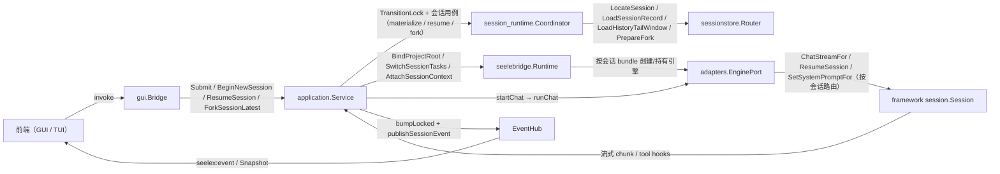

# Architecture Documents

本目录存放跨模块、长期有效的架构事实与设计原则，例如依赖方向、协议语义、并发模型、存储模型和已知结构性缺陷。

适合放置：

- 多个代码模块共同遵循的边界。
- 已接受且仍有效的架构决策和演进路线。
- 需要长期维护的调用链、状态机和安全模型。

不适合放置单一模块的当前实现细节（写入模块 README）、一次性实施计划（写入日期工作包）或外部方案调研（写入 `docs/research/`）。文档必须标明哪些是当前实现、哪些是目标设计。

## 文档索引

| 文档 | 说明 |
|------|------|
| [`seele-v2-runtime-architecture.md`](seele-v2-runtime-architecture.md) | Seelex 使用 Seele v0.1.1 远程模块边界的稳定架构（迁移完成） |
| [`architecture-and-flaws.md`](architecture-and-flaws.md) | 架构说明书与已知硬伤清单 |
| [`ARCHITECTURE_REVIEW.md`](ARCHITECTURE_REVIEW.md) | 上下文控制/数据流架构评审（历史，待与当前代码同步刷新） |
| [`plan.md`](plan.md) | 上下文、Skill、Plugin 与 Seele 薄封装实现方案 |
| [`design-decisions-mcp-storage.md`](design-decisions-mcp-storage.md) | MCP 中间件从 CAD 专属→通用→存储解耦的设计推演 |
| [`mcp-call-chain-flowchart.md`](mcp-call-chain-flowchart.md) | Agent 调用 MCP 全链路函数流 + 熔断事件通道 |
| [`context-improvement-plan.md`](context-improvement-plan.md) | Context 包拆分为 snapshot/provider/compactor/merger 方案 |
| [`skill-effort-architecture.md`](skill-effort-architecture.md) | Effort system prompt 与 Skill 用户上下文的当前实现设计 |
| [`agent-workbench-architecture.md`](agent-workbench-architecture.md) | DSL 对话卡片、Agent E2E、Workspace 沙盒与多会话并行总体架构 |
| [`subagent-visibility-design.md`](subagent-visibility-design.md) | 子代理详情查看系统设计方案 |
| [`session-snapshot-liveness.md`](session-snapshot-liveness.md) | Session、Snapshot、Runtime 投影与子代理回流的数据流及无死锁边界 |
| [`readme-spec.md`](readme-spec.md) | 模块 README 编写规范：生态位/文件与函数索引/分卷/链接与编码约定 |
| [`context-prefix-chain.md`](context-prefix-chain.md) | 上下文前缀链路：稳定前缀 + 累积 context + plan/task 后置（已实现） |
| [`a2a-agent-team-factory.md`](a2a-agent-team-factory.md) | A2A AgentTeam 与角色工厂：subagent 外包边界、goal TL 第一实例、RoleSpec/TeamSpec 泛化设计（目标态） |

## 会话数据流：架构层与方法

一次会话操作（提交 / 新建 / 恢复 / 分支 / 持久化）经过的层与方法：

关键方法（真实签名见各模块 README 的函数索引）：

- 提交：`Service.Submit` → `submitConversation` → `materializeDraftSession` → `startChat` → `runChat` → `EnginePort.ChatStreamFor`
- 新建：`Service.BeginNewSession`（草稿槽位）→ 首次提交物化
- 恢复：`Service.ResumeSession` → `resumeSession`（三读 + 会话级 `SetSystemPromptFor`）
- 分支：`Service.ForkSessionLatest` → `forkSessionLocked` → `Coordinator.PrepareFork` → `SaveCommitWorkspace`
- 持久化：`Coordinator.PersistCurrentSession` → `SessionPort.SaveCommit` → `Router.SaveCommit`（原子写 sessions-json）
