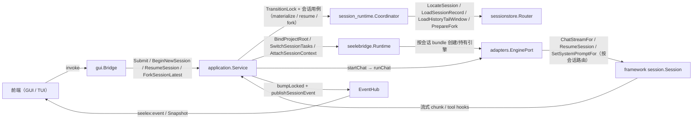

# Architecture Documents

本目录存放跨模块、长期有效的架构事实与设计原则，例如依赖方向、协议语义、并发模型、存储模型和已知结构性缺陷。

适合放置：

- 多个代码模块共同遵循的边界。
- 已接受且仍有效的架构决策和演进路线。
- 需要长期维护的调用链、状态机和安全模型。

不适合放置单一模块的当前实现细节（写入模块 README）、一次性实施计划（写入日期工作包）或外部方案调研（写入 `docs/research/`）。文档必须标明哪些是当前实现、哪些是目标设计。

## 文档索引

| 文档 | 说明 |
|------|------|
| [`seele-v2-runtime-architecture.md`](seele-v2-runtime-architecture.md) | Seelex 使用 Seele v0.1.1 远程模块边界的稳定架构（迁移完成） |
| [`architecture-and-flaws.md`](architecture-and-flaws.md) | 架构说明书与已知硬伤清单 |
| [`ARCHITECTURE_REVIEW.md`](ARCHITECTURE_REVIEW.md) | 上下文控制/数据流架构评审（历史，待与当前代码同步刷新） |
| [`plan.md`](plan.md) | 上下文、Skill、Plugin 与 Seele 薄封装实现方案 |
| [`design-decisions-mcp-storage.md`](design-decisions-mcp-storage.md) | MCP 中间件从 CAD 专属→通用→存储解耦的设计推演 |
| [`mcp-call-chain-flowchart.md`](mcp-call-chain-flowchart.md) | Agent 调用 MCP 全链路函数流 + 熔断事件通道 |
| [`agent-permission-subjects.md`](agent-permission-subjects.md) | 工具权责模型：主体（root/sub/emp_ro/emp_rw）× 路由组（ro/rw/rw_session/rw_desktop/ctl/adm）× 位（rwx）+ sudo；求值顺序、错误语义、当前实现与未落地部分 |
| [`context-improvement-plan.md`](context-improvement-plan.md) | Context 包拆分为 snapshot/provider/compactor/merger 方案 |
| [`skill-effort-architecture.md`](skill-effort-architecture.md) | Effort system prompt 与 Skill 用户上下文的当前实现设计 |
| [`agent-workbench-architecture.md`](agent-workbench-architecture.md) | DSL 对话卡片、Agent E2E、Workspace 沙盒与多会话并行总体架构 |
| [`subagent-visibility-design.md`](subagent-visibility-design.md) | 子代理详情查看系统设计方案 |
| [`session-snapshot-liveness.md`](session-snapshot-liveness.md) | Session、Snapshot、Runtime 投影与子代理回流的数据流及无死锁边界 |
| [`readme-spec.md`](readme-spec.md) | 模块 README 编写规范：生态位/文件与函数索引/分卷/链接与编码约定 |
| [`context-prefix-chain.md`](context-prefix-chain.md) | 上下文前缀链路：稳定前缀 + 累积 context + plan/task 后置（已实现）；含压缩四区模型与边界判据（共识 + 已落地） |
| [`a2a-agent-team-factory.md`](a2a-agent-team-factory.md) | A2A AgentTeam 与角色工厂：subagent 外包边界、goal TL 第一实例、RoleSpec/TeamSpec 泛化设计（目标态） |
| [`agent-team-seat-vs-claim.md`](agent-team-seat-vs-claim.md) | 席位制 team work（order_roles/环/座位/裁决 gate）与认领式 teamwork（任务池/Assignee/并行节点）的机制对照、优势与代价、扬长避短；面向作品集的叙事与证据映射 |
| [`agent-team-phase2-and-goal-vs-vmodel.md`](agent-team-phase2-and-goal-vs-vmodel.md) | Agent Team 第二阶段反思：市面多代理做法对照、现状「玩具感」诊断（带代码锚点）、改动清单，以及 goal 与 V 模型的范畴澄清（goal 是流程无关宿主，V 模型是团队顺序拓扑；goal 域只需把 acceptance 升级为阶段配对）；含待商榷 fork。**讨论输入，未改代码** |
| [`teamwork-leader-worker-architecture.md`](teamwork-leader-worker-architecture.md) | Teamwork 目标架构与里程碑：由「席位同步轮转」重构为「leader + 异步 worker（子进程工具调用范式）」——非串行 / 信号驱动 / job_manage 作业化 / 权限受控；Seele 新增 `jobs` 契约+Manager+`jobs_manage`、Seelex 提供 Executor 与派发侧工具及 worktree(git)、`moduleTeamwork` 硬编排存储、teammate 人数上限与一角色一 teammate、长驻会话「释放 worktree+删内容、保在线」；含 M0–M4 详表、死代码清单与已决/待议清单（job 作用域已定 O3：`Scope{Session,Subject}` 两并列字段、不拼分隔符，归属沿用既有 `BatchID` 盖印章）。**目标设计，未改代码** |

## 会话数据流：架构层与方法

一次会话操作（提交 / 新建 / 恢复 / 分支 / 持久化）经过的层与方法：

```mermaid
flowchart LR
    FE["前端（GUI / TUI）"] -->|invoke| BR["gui.Bridge"]
    BR -->|Submit / BeginNewSession / ResumeSession / ForkSessionLatest| SVC["application.Service"]
    SVC -->|TransitionLock + 会话用例（materialize / resume / fork）| CRD["session_runtime.Coordinator"]
    CRD -->|LocateSession / LoadSessionRecord / LoadHistoryTailWindow / PrepareFork| ST["sessionstore.Router"]
    SVC -->|BindProjectRoot / SwitchSessionTasks / AttachSessionContext| RT["seelebridge.Runtime"]
    SVC -->|startChat → runChat| EP["adapters.EnginePort"]
    EP -->|ChatStreamFor / ResumeSession / SetSystemPromptFor（按会话路由）| SESS["framework session.Session"]
    RT -->|按会话 bundle 创建/持有引擎| EP
    SESS -->|流式 chunk / tool hooks| SVC
    SVC -->|bumpLocked + publishSessionEvent| HUB["EventHub"]
    HUB -->|seelex:event / Snapshot| FE
```

关键方法（真实签名见各模块 README 的函数索引）：

- 提交：`Service.Submit` → `submitConversation` → `materializeDraftSession` → `startChat` → `runChat` → `EnginePort.ChatStreamFor`
- 新建：`Service.BeginNewSession`（草稿槽位）→ 首次提交物化
- 恢复：`Service.ResumeSession` → `resumeSession`（三读 + 会话级 `SetSystemPromptFor`）
- 分支：`Service.ForkSessionLatest` → `forkSessionLocked` → `Coordinator.PrepareFork` → `SaveCommitWorkspace`
  （**会话分叉 ForkSession**：独立子会话 + tool-results 物理复制 + 可达 ref 裁剪，口径见
  `application/core/session_runtime/fork.go` 头部；**子代理派发 ForkSubagent** 不走这条——
  它经 workplan DAG 落 `subagent_<hash>/` 子树并复用主会话 `big_tool_result`，无独立 refs 索引）
- 持久化：`Coordinator.PersistCurrentSession` → `SessionPort.SaveCommit` → `Router.SaveCommit`（原子写 sessions-json）
