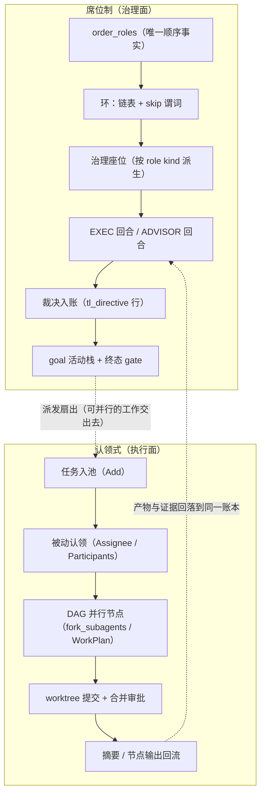

# 席位制 team work 与认领式 teamwork：优势、代价与扬长避短（作品集版）

> 用途：作品集 / 对外讲解口径。姊妹篇 [`agent-team-work-vs-market.md`](agent-team-work-vs-market.md)
> 回答的是「和市场常见多代理方案差在哪」；**本篇回答的是「和本仓库另一条协作轴（认领制）差在哪、
> 这样做的优势与代价是什么、怎么扬长避短」**。
>
> 口径分层（沿用姊妹篇）：**A 类 = 本次实测**（每条给可复现命令）；**B 类 = 本仓库源码/文档静态锚点**
> （本次只读，行号基于当时的 HEAD，漂移时以符号名为准）；**C 类 = 仓库既有报告**（历史版本口径）；
> **D 类 = 外部公开资料**（本次 **未复核**：`web_search` 返回 403 配额不足，`subagents` 账号 402）。
> 凡 D 类一律显式标注「未复核」，不进结论、不进作品集正文的数字。

---

## 0. 一句话结论

两条轴回答的是**不同的工程问题**，不存在谁替代谁：

- **认领制（claim）回答「谁来做」**：任务池 + 身份（`main:<会话>` / `subagent:<会话>`）+ `Assignee` 标签
  + 并行节点 + 摘要回流。它的强项是**吞吐与弹性**，弱项是**「做完了」这件事只能靠自述**。
- **席位制（seat）回答「谁在什么上下文下、按什么顺序、被谁裁决、算不算完成」**：静态顺序事实
  （`lifecycle.order_roles`）→ 环（链表 + skip）→ 治理座位（EXEC / ADVISOR）→ 回合制推进 →
  裁决入账 → goal 活动栈的收口 gate。它的强项是**可验收、上下文口径可算、人类中途可介入**，
  弱项是**串行、不弹性、单位成本高**。

所以「扬长避短」不是把一条轴做得更像另一条，而是**分层**：席位制管治理面（目标、顺序、裁决、权限），
认领制管执行面（扇出、并发、worktree 隔离、提交/合并作为机器证据），两侧的产物回落到同一条账本。
本仓库这两条轴**已经是并存的**（`application/core/agentteam` + `application/core/goal` vs
`seelebridge/fork` + `seelebridge/task` + `application/core/work_table.go`），缺的是把它们当成一个
「治理 + 执行」的分层方案写进叙事（见 §6）。

---

## 1. 先把词用对：两条轴的机制定义

| | 认领式 teamwork（claim） | 席位制 team work（seat） |
| --- | --- | --- |
| 分配工作的方式 | 任务池 + 认领（`attach` 接管 → `Assignee`） | 静态顺序事实（`order_roles`）+ 环 + 治理座位 |
| 身份 | `main:<mainSessionID>` / `subagent:<subSessionID>` | 角色名 + 角色会话（`<team_id>-<role_name>`） |
| 协作介质 | task 行（`Assignee` / `Participants` / `Trace`）+ 子代理摘要 + worktree 合并 | **唯一帧账本**（同一 `seq` 空间，逐帧带 `role_name`）+ 角色 lifecycle |
| 执行单元 | plan 节点 / fork 子代理（DAG，可并发） | 席位回合（`roleTurnSeat.Act` → `RunRoleTurn`） |
| 「做完」的判据 | 任务终态 + 有界自述摘要（+ worktree 提交/合并痕迹） | goal `acceptance` + 终态 gate 的裁决（`verdict_done` 才收口） |
| 主要代码锚点 | `seelebridge/task/task.go`、`application/core/work_table.go`、`seelebridge/fork/tool.go`、`seelebridge/worktree/worktree_manager.go` | `application/core/agentteam/{spec,scheduler,runtime,factory}.go`、`application/core/goal_coordinator.go`、`application/core/goal/gate.go`、`sessionstore/role_session.go` |

**认领的确切语义（B）**：`attachParticipantLocked` 里，「认领」= **最后一个接管者成为当前 `Assignee`**，
名单只增不减，没有 lease / TTL / unclaim / 排他检查（`seelebridge/task/task.go`）。
也就是说认领是**标签语义**，不是锁语义。子代理行的认领是**被动投影**发生的：
`fork` 注册子代理树 → 树事件 → `application/core/work_table.go` 的 `syncSubagentTask`
→ `TaskAttachParticipant`（模型不调任何工具也照样认领）。

**席位的确切语义（B）**：发言权的唯一运行时落点是 `message head.floor`（写者只有一个：sequencer），
顺序的唯一运行时事实是环的链表（`application/core/agentteam/scheduler.go`），落盘事实是
`lifecycle.order_policy/order_roles`。环本身**不生产正文**，它只做两件事：决定下一个谁发言（`Advance(skip)`）、
以及在交班时下发 team work 前缀（`SetPrefix`）。

---

## 2. 逐维度对照（谁更强、代价在哪）

| 维度 | 认领式 | 席位制 | 谁更强 / 代价 |
| --- | --- | --- | --- |
| **分配机制** | `Assignee` 单值标签，最后接管者覆盖 | 单一顺序事实 + 单游标（无争用） | 席位制：**不会出现「两个都以为自己是 owner」**；认领制无 lease/TTL/排他 |
| **并行度 / 墙钟** | 节点级并行（`PolicyConcurrency`：high=3、max=节点数；仍有账号槽上限） | 严格串行（环 + 每回合一次治理推进） | 认领制：**大扇出快一个量级**；席位制要拿「可审计」换墙钟 |
| **结果证据强度** | 任务终态 + 自述摘要；`evidence` 是固定字符串（`"subagent:"+status` / `"node:"+status`）；fork DAG **无 verify 节点**；机器可验证的只有 worktree 提交/合并 | goal `acceptance`（≤64 条）+ 终态 gate：`verdict_done` 才收口、`not_done` 保持 active、`escalate_human` 转人工、b 缺席有缺席矩阵 | **席位制，且这是最值钱的一条**：验收不依赖措辞 |
| **上下文口径** | 父代理/开发者**临时打包**（fork 摘要：单行 160 rune、每子代理 30 行截断） | **账本前缀投影**：`C = max(join_seq_id, compact_ref.applied_seq)`，`seq > C` 才是它的记录；缺 `compact_ref` 直接报错；面板用占位 `—` 表示「它没看到这帧」 | 席位制：口径可算、可审计；认领制有界但不可审计「它到底看了什么」 |
| **质量对抗面** | 需要自己搭 reviewer；一般无「裁决入账」 | ADVISOR 回合制评审，裁决以 `kind=tl_directive` + `role_name=tl` 落在同一账本 | 席位制：对抗面是结构性的，不是流程约定 |
| **人类介入点** | 多在头尾（派任务 / 看结果） | 会话粒度权限档（`manual/edit/auto/full`）+ 审批预筛（high 风险或 b 缺席一律转人工，默认拒绝兜底）+ 员工在编/入库 | 席位制：**中途换档、撤权、叫停是一等公民** |
| **失败隔离** | 账号槽耗尽会排队 / fail-fast 连坐（worktree 脏未提交从「判失败」降级为「收尾警告」正是 2026-09-11 连坐事故的产物） | 某角色的会话坏了不影响账本；面板能报 `unassigned_role_rows`、切点异常等症状 | 席位制：爆炸半径小 |
| **重启恢复** | 认领依赖内存 `SubAgentTree`，重启后 `Assignee` 可能停在 `main`（`docs/research/2026-08-24-fork-subagent-recovery.md`），后续靠 `RestoreSubagentAnchors` 修 | 环是派生态（从 `order_roles` 重建）＋账本在存储层 → 按前缀重建 | 席位制：恢复语义更干净；认领制已部分补齐 |
| **成本结构** | 派发 + 摘要（+ 节点各自上下文） | 每角色独立角色会话 + 前缀装配 + **每回合一次评审模型调用** | 认领制：单位成本低；席位制的治理开销是**按回合计的固定开销** |
| **弹性 / 扩展** | 临时加节点即可（`max_concurrency` 可传） | 席位集合在装配时定（`order_roles` 显式或按 `OrderPriority` 推导），加人=改顺序事实 | 认领制 |
| **依赖表达** | 真 DAG（`start → s1..sN → summary`） | 固定环表达「顺序」，不是任意 DAG | 认领制：任意依赖要靠它 |
| **粒度** | 任务粒度任意（可拆可并） | 粒度 = 角色（粗） | 认领制 |

---

## 3. 优势（席位制相对认领制，逐条给证据）

1. **可验收性（最核心）**：「队友做完了」必须落到某条 `seq` 上，而 goal 的收口由 gate 裁决决定，
   不是由它自己说。证据（B）：`application/core/goal/gate.go` 的 `ProposeFinish`
   （`verdict_done → completed`、`verdict_not_done → 保持 active`、`escalate_human → 转人工`、
   b 缺席 → 安全默认）与 `CloseTopGoalOnTerminal`；`GoalRecord.Acceptance` 是域内一等字段
   （`application/core/goal/record.go`，上限 64 条）。作品集里这一条最值钱：**验收判据是数据，不是措辞**。
2. **分配无争用的确定性**：发言权来自一份顺序事实 + 一个游标，不存在「抢占 / 覆盖」。
   对比：认领制的 `Assignee` 是单值字段，同 goal 的两个并行子代理会共用同一 task 行，
   `Assignee` 被后到者覆盖（B：`seelebridge/task/task.go` 的 `attachParticipantLocked`、
   `seelebridge/fork/bind_subagent_task_test.go`）。
3. **上下文口径可算、有界、可展示**：切点 `C` 的计算式、端点语义（`seq > C`）、
   main 恒 `C=0`、缺 `compact_ref` 硬报错而不静默兼容、以及前端把「不在区间内」的行渲染成占位 `—`
   ——这套口径让「它当时能看到什么」变成可核对的事实（B：`sessionstore/role_session.go`；
   数据流详见 [`2026-09-16-team-work-record-dataflow/README.md`](../2026-09-16-team-work-record-dataflow/README.md)）。
4. **质量对抗面是结构性的**：ADVISOR 座位由 role kind 派生（改名不丢座位），指令与裁决落在同一账本，
   且在**产出它的那一回合**就可见（B/C：`application/core/goal_coordinator.go`、
   [`2026-09-16-advisor-verdict-visible-immediately.md`](../devlog/2026-09-16-advisor-verdict-visible-immediately.md)）。
5. **人类控制面中途可得**：会话粒度权限档 `manual/edit/auto/full`（升序 = 自动度递增，只剪 `ask` 规则、
   从不新增 allow、从不触碰 deny；`full` 只对 root 短路，员工/子代理判定链一字不改），
   外加审批预筛的「默认拒绝兜底」（B/C：`seelebridge/tools/permission_tiers.go`、
   [`2026-09-16-session-permission-tiers.md`](../devlog/2026-09-16-session-permission-tiers.md)、
   [`agent-permission-subjects.md`](agent-permission-subjects.md)）。
6. **恢复语义干净**：环是可重建的派生态（`Runtime.Reset` 只清 `stopped/round/noProgress`，
   不动顺序与成员），账本在存储层；上一轮 goal 的逃生状态不会传染给新 goal
   （B/C：[`2026-09-16-agentteam-ring-revive.md`](../devlog/2026-09-16-agentteam-ring-revive.md)）。
7. **失败隔离**：某角色的角色会话坏了不影响主账本；症状可枚举（`unassigned_role_rows`、切点异常、
   `missing compact_ref`、`empty_ring` / `no_executor`），检测面是只读的。

---

## 4. 代价与劣势（席位制相对认领制，必须写进作品集）

1. **吞吐与墙钟**：席位制是串行的（环 + 每回合一次治理推进 `AdvanceAfterChat`）。需要大扇出时，
   认领制的节点级并行（`PolicyConcurrency`：high=3、max=节点数）在同一时间窗内能做完更多事。
   **席位制用墙钟换可审计性**，这笔账要讲清楚，不能只讲收益。
2. **弹性差**：席位在装配时就定了（`order_roles` 显式或按 `OrderPriority` 推导；显式落盘后
   `OrderPriority` 就是死字段）。临时「多叫一个人来」在这条轴上是改顺序事实，不是加个节点。
3. **负载均衡靠人**：固定顺序意味着慢的席位是瓶颈，而 ADVISOR 每回合都要跑一次模型
   ——这是**按回合计的固定行政开销**，前缀投影压的是「喂多少上下文」，压不掉「多跑一次模型」。
4. **现状要如实说**：环上真正有执行者的只有 `user / main / tl`；`agent` 角色要装配了
   `RoleTurnRunner` 才拿到执行座位，否则只占位并被如实报进 `Unexecuted`。
   今天这套 team work 更接近**「双座位（EXEC + ADVISOR）治理环 + 只读的角色记录视图」**，
   而不是「多人并行团队」。作品集里把它说成后者就是宣传偏差。
5. **依赖表达弱**：席位制用固定环表达顺序，任意 DAG 依赖表达不了——那是认领轴（`fork_subagents` /
   `WorkPlan`）的地盘。
6. **粒度粗**：执行单元是角色，不是任务；`task` 可以拆到很细，席位不能。
7. **仓库自身的工程债（对外引用前必须先说清）**：
   - `GatePolicy` / `CompactPolicy` / `PresencePolicy` / `ModelPolicy` / `DirectiveSchema`
     在 `dto.TeamSpec` / `RoleSpec` 与 preset 里有声明，但目前**只有存储规整与回读，没有运行时消费者**
     （B：全仓检索只命中 DTO / preset / 注册表 / 适配器透传）。
   - `compact_ref.applied_seq` 的写入入口只有 headless `role.set_lifecycle`，**仓内没有自动写入者**
     （切点抬高由宿主/巡检调用方负责）——所以别写成「compact 后自动抬高」。
   - `TurnScheduler.Remove/Restore`、`Runtime.Next()` 目前无生产调用点；`README` 措辞与 grep 事实有出入
     （B：`application/core/agentteam/scheduler.go` 头注已按事实修正）。
   - 认领侧的对应缺口：`ResumePlan` 无用户可达入口、部分完成的 fork 会重跑整个 DAG、
     后台会话分区的 task 不走默认身份/名单（B/D：`docs/research/2026-08-24-fork-subagent-recovery.md`）。

---

## 5. 扬长避短（可执行清单）

**A. 分层：席位制定「做什么 / 算不算完成」，认领制定「怎么并行做完」**

1. goal（`acceptance` + 参与角色 + 权限档）作为治理外壳；**可并行的部分显式派给认领轴**
   （`fork_subagents` / `WorkPlan`：并发上限、worktree 隔离、提交与合并审批）。
2. 认领轴的产物必须回落到同一账本（节点输出 / 摘要 / worktree 合并结果 → 主会话行），
   再由 ADVISOR 回合裁决；这样「并行干活」不会把证据切碎到各自的 message history 里。
3. 已知的机器证据链：`worktree` 的提交存在性与合并结果是**可机器验证**的收尾判据
   （B：`seelebridge/worktree/worktree_manager.go`）；把它当认领轴的验收锚点用，
   而不是只看 `"subagent:"+status` 这种固定字符串 evidence。

**B. 补强席位制最弱的两条（吞吐 / 弹性）**

4. **按任务类型选顺序策略**：`goal_loop`（默认，强治理）/ `user_main_decided`（人决定发言顺序，
   交互式）/ `scheduled_only`（定时旁路，不入 `order_roles`）。不要让所有任务都吃满治理开销。
5. **给治理开销设上界**：轮次上限（`goalLoopRoundLimit`）与无进展逃生的语义已经钉死
   （B：`application/core/goal_coordinator.go`、`goal_loop_limit_test.go`），
   作品集里可直接作为「成本有界」的证据。
6. **需要并行就切轴**：把「并行」当成一次显式派发（席位 → 认领），而不是指望环自己变快。

**C. 补强认领制最弱的两条（验收 / 上下文口径）**

7. 每个认领行绑定**机器可验证锚点**（提交 sha / 测试命令与输出 / 产物路径），
   把 `evidence` 从固定字符串升级为可核验引用。
8. 把「这一轮喂给子代理什么」也落成可读记录（现在只有 fork 侧的截断摘要）；
   等价目标：让认领轴也有「前缀投影」那样的可算口径。

**D. 演示层面**

9. 卖点排序：**先讲可审计/可验收（席位制的稀缺性），再讲吞吐（认领制的常规能力）**。
   反过来讲，就变成「又一个多代理框架」，前面那条优势会被淹没。

---

## 6. 作品集怎么讲

### 6.1 叙事骨架（五幕）

1. **失效模式**：摘要回传丢证据、没有权威记录、上下文靠手工打包、人类只在头尾、重启即失忆
   （详见姊妹篇 §1 的 F1–F5）。
2. **取舍**：把账本放在第一位——协作介质就是唯一帧账本，角色的上下文是账本的**前缀投影**，
   队友的工作、主会话的工作、评审的裁决落在同一条 `seq` 序列上。
3. **机制**：前缀投影（切点可算）＋席位/环（顺序唯一事实）＋goal 活动栈（可嵌套）＋终态 gate
   （裁决收口）＋权限档与审批（人类中途可介入）。
4. **证据**：见 §7 的 A/B 类清单与可复现命令；异常有症状表（可诊断，不是「玄学翻车」）。
5. **边界**：未实现字段、缺 A/B 基准、外部数字未复核，一次性讲清（§4.7、§7）。

### 6.2 三分钟演示脚本（全部有代码锚点）

1. `goal begin` → 团队自动装配；`join_seq_id` = 装配那一刻主会话已提交的尾 `seq`
   （B：`application/core/goal_service.go` 的 `teamJoinSeqFor`）。
2. 打开 Team 面板的角色记录表：main 车道有全部回合，teammate 车道在入伙前是占位 `—`
   （「它没看到这帧」，不是「内容丢了」）。
3. 跑一轮：EXEC 产出 → 回合尾 ADVISOR 评审 → **裁决在产出它的那一回合就可见**
   （`kind=tl_directive` + `role_name=tl`）。
4. `goal_propose_finish` → 终态 gate：`verdict_done` 收口出栈 / `verdict_not_done` 保持 active /
   `escalate_human` 转人工。
5. 切权限档（`manual ↔ auto`）：只剪 `ask` 规则，deny 段逐条保留；员工/子代理不享 `full` 档。
6. 重启/切会话：环按 `order_roles` 重建，账本按前缀重建（不是「从内存里恢复一个对象图」）。

### 6.3 主张 ↔ 证据映射（写进作品集页脚）

| 主张 | 证据 |
| --- | --- |
| 上下文口径可算 | `sessionstore/role_session.go`（切点计算 + 缺帧硬报错）；`TestRoleSnapshotMarksRowsOutsidePrefixMatch`、`TestAssembleRoleWireForMainIsMainSessionContext` |
| 队友在 goal 那一回合入伙 | `TestGoalBeginJoinsTeammatesAtGoalTurn` |
| 裁决不靠「下一次用户回合」 | `TestAdvisorVerdictVisibleInProducingTurn` |
| 座位按 kind 派生（改名不丢座位） | `goal_seats_test.go`（`TestSeatPlanFollowsRoleKindNotRoleName` 等） |
| 逃生不传染新 goal | `agentteam_ring_revive_test.go` |
| 权限档不越员工/子代理边界 | `TestTierDoesNotBypassEmployeeBoundary`、`TestTierDoesNotBypassSubagentBoundary` |
| 认领是被动投影（不靠模型自觉） | `TestTaskRegistryPassiveIdentityAndClaim`、`TestRefreshWorkTableSnapshotPublishesSubagentRows` |

### 6.4 想让「更快 / 更省」站得住，必须先补的实验

1. **同任务、同模型的席位制 vs 认领式对照**：墙钟时间、token、成功率（这是 §4.1 的代价，
   没有这组数据就只能定性）。
2. **前缀投影的省量对照**：同任务下「喂全历史」vs「喂前缀」的输入 token。
3. **有 gate vs 无 gate 的端到端验收成功率**：把「可验收」从机制论证升级为实验结论。
4. 仓库既有 C 类报告：[`../../.seelex/perf/REPORT-latest.md`](../../.seelex/perf/REPORT-latest.md)
   （2026-08-05，TUI 口径，**不含 team work 专用基准**）。

### 6.5 不能写的话（诚信红线）

- 未复核的外部数字（本次 `web_search` 403）不得进作品集正文。
- 把登记字段（`GatePolicy` / `CompactPolicy` / `PresencePolicy` / `DirectiveSchema` / `ModelPolicy`）
  说成「已实现的能力」。
- 把「可并行」说成「已经并行」；把 `agent` 席位的执行座位说成默认就有。
- 把「合并/提交存在性」说成「验收通过」——前者是机器证据，后者是 gate 的裁决。

---

## 7. 证据清单与未验证项

### 7.A 本次实测（A 类，可复现）

| 命令 | 结果 |
| --- | --- |
| `go test ./seelebridge/task -run TestTaskRegistryPassiveIdentityAndClaim -count=1 -v` | PASS（认领语义） |
| `go test ./application/core -run "TestGoalBeginJoinsTeammatesAtGoalTurn\|TestAdvisorVerdictVisibleInProducingTurn\|TestRingEscapeClosesGoalAndArchivesTLHistory\|TestRoleTurnSeatPassesRoleIdentityToExecutionFace" -count=1 -v` | 4/4 PASS |
| `go test ./sessionstore -run TestRoleSnapshotMarksRowsOutsidePrefixMatch -count=1 -v` | PASS（切点与区间计数） |

### 7.B 静态锚点（B 类，本次只读）

`application/core/agentteam/{spec,scheduler,runtime,factory,presets}.go`、
`application/core/goal/{gate,record,stack}.go`、`application/core/goal_coordinator.go`、
`application/core/goal_service.go`、`application/core/work_table.go`、`sessionstore/role_session.go`、
`seelebridge/task/task.go`、`seelebridge/fork/{tool,summary}.go`、`seelebridge/plan/policy.go`、
`seelebridge/worktree/worktree_manager.go`、`seelebridge/session/subagent_tree.go`、
`gui/frontend/dist/agent-team-view.js`。静态检索结论：`GatePolicy` / `CompactPolicy` /
`PresencePolicy` / `ModelPolicy` / `DirectiveSchema` 仅出现在 DTO、preset、注册表、适配器与
工厂回读处，未见运行时消费分支。

### 7.C 既有报告（C 类，历史口径）

- [`../../.seelex/perf/REPORT-latest.md`](../../.seelex/perf/REPORT-latest.md)（2026-08-05，TUI 口径）。
- [`../../2026-09-16-team-work-record-dataflow/README.md`](../2026-09-16-team-work-record-dataflow/README.md)
  （记录数据流与症状表）。
- `docs/devlog/` 的 `2026-09-16-agentteam-ring-revive.md`、`2026-09-16-advisor-verdict-visible-immediately.md`、
  `2026-09-16-session-permission-tiers.md`、`2026-09-14-teamwork-wiring-fixes.md`。

### 7.D 外部口径（**本次未复核**）

主流框架的分配机制（CrewAI 的 sequential/hierarchical、AutoGen 的 GroupChat speaker selection、
LangGraph 的 supervisor/swarm handoff、MetaGPT 的 SOP、学术上的 Contract Net / blackboard /
market-based allocation）本次**无法核实**（`web_search` 403、`subagents` 402）。
这些只作背景，不作为论据，也不进作品集数字。

### 7.E 未验证项（诚实清单）

1. 没有「席位制 vs 认领式」的端到端 A/B 基准（§6.4）。
2. `agent` 席位的真实执行面（`RunRoleTurn` 在真实模型下的表现）只有单测级证据，
   活体探针（`gui/*_live_probe_test.go`）本次未运行。
3. `compact_ref` 的自动抬高依赖宿主调用方，仓内无自动写者（§4.7）。
4. 行号锚点基于本次阅读的 HEAD，后续改动会漂移；以符号名为准。
5. 认领侧的若干行为（同 goal 双工共用一行、后台会话分区不走名单、`defaultIdentity` 单槽）
   来自静态推导，未做真机复现。

---

## 8. 相关文档

- 市场对照（姊妹篇）：[`agent-team-work-vs-market.md`](agent-team-work-vs-market.md)
- 团队装配与角色工厂：[`a2a-agent-team-factory.md`](a2a-agent-team-factory.md)
- 权责模型：[`agent-permission-subjects.md`](agent-permission-subjects.md)
- 记录数据流：[`../../2026-09-16-team-work-record-dataflow/README.md`](../2026-09-16-team-work-record-dataflow/README.md)
- 工作台/任务行：[`../gui/modules/work-table.md`](../gui/modules/work-table.md)
- 子代理恢复（认领侧缺口）：[`../research/2026-08-24-fork-subagent-recovery.md`](../research/2026-08-24-fork-subagent-recovery.md)
