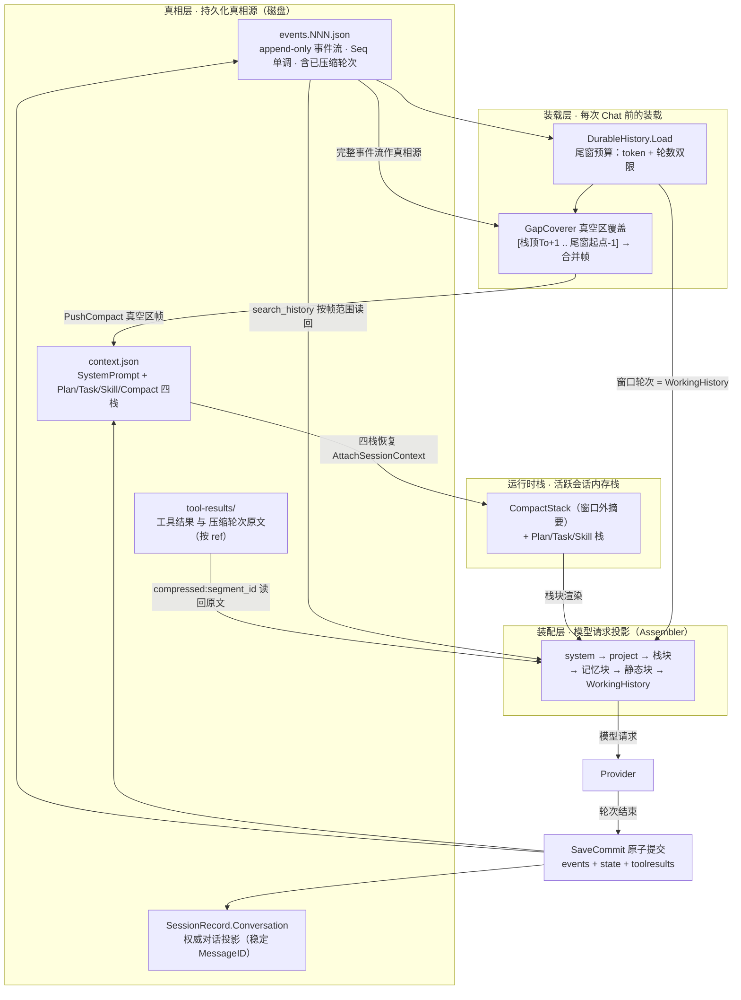
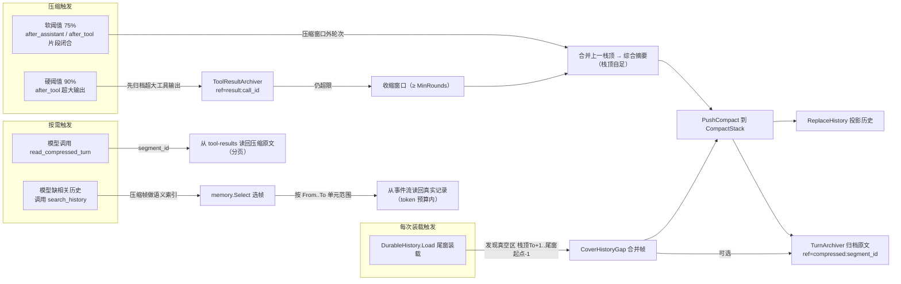
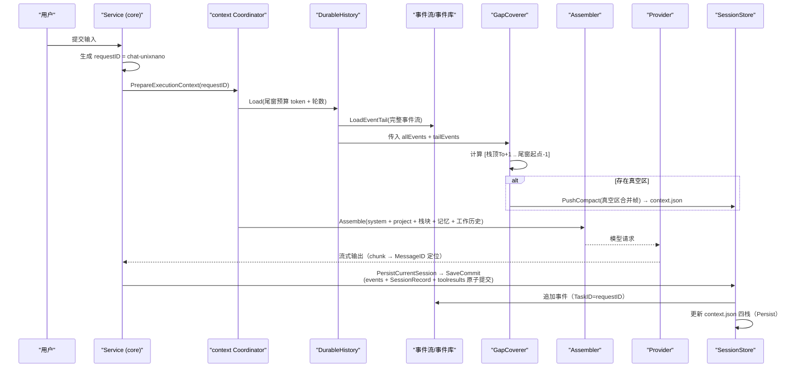

# 对话 fork（会话级）功能可行性调研

日期：2026-08-24
状态：调研结论 + 一期决策已定（2026-08-24），**一期已实现（2026-08-25：存储层 + 核心用例 + GUI/TUI 入口已落地；fork 树展示与精细切断点 UI 待做）**。仓库内全部 fork 均为子代理 fork（`fork_subagents`/WorkPlan）；**对话级 fork 已可用**：TUI `/fork [session_id]` 命令、GUI 会话树「分支」按钮（默认 fork 到最新完整轮次并切换）。本文件是外部做法（Codex）、当前存储链路、上下文机制与候选方案的可行性评估。**一期决策已定稿（见「十、一期决策契约」），被否决方向已在原文标注，后续实现与 agent 以「十」为决策事实源，不再展开候选权衡。无二期——引用式浅拷贝/段落共享彻底否决。** 会话级粒度 M1 已落地，M2/M3 未实现（见 [session-resource-granularity.md](2026-08-24-session-resource-granularity.md)）。
范围：对话 fork（新开会话的分支，**非 subagent fork**）的语义、Codex 实现机制与前置条件；Seelex sessionstore 存储链路与原子能力；requestID 轮次标记与「超会话精确检索」断言核实；候选方案（id 编码 / 段落式存储 / 邻接表 meta / 引用式浅拷贝）评估；上下文机制复述与上下文丢失风险。

## TL;DR

1. **Codex 的对话 fork = 新 thread + 完整历史复制（深拷贝）**，血缘靠 `forked_from_thread_id` 元数据，新 id 不编码父前缀；交互式 fork 默认 `ForkPersistence::Copied`（深拷贝），2026-08 起 exec 持久线程新增 `ForkPersistence::Referenced`（引用式浅拷贝）优化路径。
2. **Seelex 当前无任何对话 fork 能力**（代码与文档均无）；存储底座已具备 `(project, session)` 分区、多后端原子提交、事件流/对话双真相、四栈持久化与恢复，但**没有 clone/copy 原语、无血缘字段、无段落索引、无 fork 树**。
3. **requestID（`chat-<unixnano>`）确为会话轮次通用标记**（ChatState/Event.TaskID/worktable/协议 request_id）；但「requestID 用于超会话精确检索早期内容」**不成立**——现有检索是会话内「超长上下文」检索，定位键是 SegmentID/帧范围，requestID 只是事件关联标签。
4. **一期决策：深拷贝 + 血缘 meta 索引**（段落式存储 + 邻接表继续做）。`forksessionid 编码父前缀 + requestID` 与「引用式浅拷贝」**已否决**（碰撞/变长/表达不了切断点；共享对象可变性引入上下文丢失风险，鲁棒性差）。详见「十、一期决策契约」。
5. **上下文机制是六层模型**（装配/窗口/压缩栈/真空区覆盖/原文归档/检索）；真空区结构性无法消除但已有覆盖。引用式 fork 的最大风险是**共享对象可变性**（`context.json` 整文件覆盖、会话目录 `RemoveAll` 删除）。

## 一、Codex fork 功能调研

### 1.1 CLI 语义

官方 CLI 文档（mintlify 镜像；`developers.openai.com` 返回 403，源码另见 §1.3）：

- `codex fork`（选择器选会话）/ `codex fork --last`（fork 最近会话）；
- 行为：加载选中会话历史 → **创建新 thread ID** → **把全部会话历史复制到新 thread** → 打开 TUI 继续；
- 原会话**不变**；Fork vs Resume 的区别：Fork 产生新 thread ID + 历史复制，Resume 继续原 thread + 历史共享。

### 1.2 协议层

`thread/fork`（[Threads API](https://mintlify.wiki/openai/codex/api/threads)）：

- 方法 `thread/fork`，参数仅 `threadId`，返回新 thread，发 `thread/forked` 通知；
- Thread 对象含 `id / title / status / rollout_path / cwd / turns`，持久化为磁盘 JSONL rollout 文件；
- 相关方法：`thread/start / resume / list / read / archive / rollback / compact/start` 等。

### 1.3 源码层（openai/codex main，2026-08-24 抓取）

`codex-rs/core/src/thread_manager.rs`：

- 切断点类型 `ForkSnapshot::{TruncateBeforeNthUserMessage(usize), Interrupted}`——支持「在第 N 条用户消息前切断」和「中断态」；
- fork = 分配**新 ThreadId** + 继承父历史（`InitialHistory::Forked`），元数据 `forked_from_thread_id: Option<ThreadId>`；
- 默认 `ThreadId::new` 是不透明随机生成，**父前缀不编码进 id**。

### 1.4 深拷贝还是浅拷贝

`codex-rs/core/src/session/mod.rs`：

```rust
/// Controls which fork history belongs in the newly created thread's own rollout.
pub(crate) enum ForkPersistence {
    Copied,
    Referenced {
        history_base: Option<HistoryPosition>,
        inherited_item_count: usize,
    },
}
```

两条路径：

- `fork_thread_from_history`（`thread/fork`、CLI fork 走这里）固定传 `ForkPersistence::Copied` → **深拷贝**：新线程把完整历史前缀 + 本地 settings 一起写入**自己新的 rollout 文件**，fork 后立即 materialize + flush；原线程不变。
- `fork_prepared_thread`（持久 exec 线程新优化路径）传 `ForkPersistence::Referenced` → **浅拷贝**：`rollout_items.drain(..*inherited_item_count)` 把继承历史从子 rollout 清掉，祖先记录留在 `history_base` 之后，子只存本地增量。

内存层细节：`InitialHistory::Resumed` 持有 `Arc<Vec<RolloutItem>>`（共享），fork 后的 `InitialHistory::Forked(items)` 是 owned `Vec`；从 resumed 转 forked 用 `Arc::unwrap_or_clone`——引用唯一则零拷贝接管，多引用则深拷贝整个 Vec。切断点处理直接对 owned Vec 做 `truncate`。

### 1.5 前置条件总结

- 存在已持久化、可完整加载的父线程；
- 可确定切断点（第 N 条用户消息 / 中断轮次）；
- 能分配新 thread id；
- 能整体复制历史（或按新优化引用父历史）；
- 原线程保持只读不变；
- fork 后按新 thread 打开交互界面。

## 二、当前 session store 链路

### 2.1 存储分层与物理结构

调用链：`application/core`（会话用例）→ `session.Manager`（薄包装）→ `sessionstore.Router`（串行化 + 项目作用域 + 后端原子切换）→ Repository 实现（JSON / SQLite / PostgreSQL / Redis）。

JSON 落盘布局（[sessionstore.go](../../sessionstore/sessionstore.go)）：

```text
sessions-json/<project-hash>/session-<session-hash>/
  manifest.json        # 唯一发布点：指向当前 generation + 各 shard 计数 + SessionMeta
  generation-<rand>/   # 不可变 generation：history.NNN.json / events.NNN.json / state.json
  tool-results/        # append-only，按 ref hash 索引（含压缩轮次原文 compressed:<segment_id>）
  subagents/           # <mainID>-<subID>.json（子代理会话记录，仅 JSON 后端）
  framework-events.json # 执行事实事件库（append-only）
```

关键语义：

- **原子性**：`WriteCommit` 写全新 generation，最后原子替换 `manifest.json`；读永远只看到旧代或新代，绝不混代。Redis 用 `MULTI/EXEC`，SQL 用事务。Router 的 `Configure` 切换后端也是原子 swap。
- **双真相**：`state.json` 里的 `SessionRecord v3`（ID/Title/Conversation/PlanStack/Tasks/Execution/Projection/Checkpoints/ToolResults）是权威；`history.NNN.json`（provider history）只是可重建缓存。
- **事件流**：`events.NNN.json` append-only，`Seq` 单调；Event 带 `TaskID`（=requestID）、`MessageID`、Role、Content、ToolCall、ResultRef、TokenCount。
- **独立通道**：context 四栈（system prompt + Plan/Task/Skill/Compact）走 `WriteContextState`；tool results 走 append-only ref 通道；项目级记录按 projectID 独立。

### 2.2 会话生命周期（application/core）

1. `BeginNewSession`：草稿态，不持久化；
2. `materializeDraftSession`：首条请求时 `Engine.StartSession()` 分配会话 ID + 项目绑定；
3. `startChat → runChat`：生成 `requestID = chat-<unixnano>`，TranscriptEvent 的 `TaskID` 打上该标记；
4. `PersistCurrentSession`（切会话/结束时）：锁外收集 task 快照 → 锁内构建 record+events → `SaveSessionSnapshot` → `SaveCommit`（一次原子写全量）；
5. `resumeSession`：三路并行加载（record / history 尾窗 / transcript）→ 按会话 ID 重建独立引擎（M1）→ 恢复 plan/task/context 四栈；
6. `LoadMoreHistory`：按 offset 窗口读 conversation 模块。

### 2.3 现有原子能力清单

| 能力 | 通道 | 语义 |
|---|---|---|
| `SaveCommit` / `WriteCommit` | 全量快照 | history+events+state+toolResults 一次原子切换 |
| `SaveState` | 会话 record | 独立 channel |
| `SaveContextState` | context 四栈 | 独立 channel |
| `AppendFrameworkEvent` | 事实事件库 | append-only |
| `WriteProjectRecord` | 项目级 | 跨会话共享，read-only contract |
| NodeSession 写/读/列/删 | subagents/ | `<main>-<sub>.json`，从主会话目录即可枚举 |
| `Delete` | 会话级 | JSON 为 `RemoveAll` 会话目录 |
| `Configure` | 后端 | 原子换 repository |
| 读侧 | Read / ReadRange / LoadEventTail / LoadEventRange / ReadConversationRange / ReadToolResult / ReadFrameworkEvents / List | 窗口与模块化读取 |

### 2.4 会话级粒度核实

[session-resource-granularity.md](2026-08-24-session-resource-granularity.md) 明确：M1（会话级 chat runtime、EnginePort 多实例、事件带 session_id、显式 session API）**已实现**；但执行仍是**全局单飞**（`ErrSessionBusy`/`anyChatRunningLocked` 全局判定），真正的会话并行（M2）未实现，`Core.Mu` 仍是全局快照锁。

## 三、技术前提核实

### 3.1 requestID 是会话轮次的通用标记——属实

`chat.go:33` 生成 `requestID = fmt.Sprintf("chat-%d", time.Now().UnixNano())`，并贯穿：

- `ChatState.RequestID`（快照里的 running 标记）；
- `TranscriptEvent.TaskID` → 落盘为 `sessionstore.Event.TaskID`；
- worktable 的 `BatchID`（`SetCurrentTaskBatch(requestID)`）；
- task 注册表 `BeginTask(requestID, ...)`；
- context_runtime 按 `event.TaskID == requestID` 过滤当前轮事件；
- GUI 协议 Event 的 `request_id`（调用链关联 ID，见 [application-protocol.md](../gui/modules/application-protocol.md)）。

局限：进程内时间戳 ID——非全局唯一、非单调轮次号（同一纳秒两次 startChat、或重启后理论可碰撞）；标识「一次完整轮次」，不能表达轮中间的切断点。

### 3.2 requestID 用于「超会话精确检索早期会话内容」——未核实到，现有实现不支持

- 现有精确检索是**会话内**「超长上下文历史检索」（[search.go](../../seelexctx/search/search.go)）：用 CompactStack 压缩帧做语义索引（`memory.Select` 按词法选帧），再按帧的 `[From..To]` **单元范围**从事件流读回真实记录，定位键是 `SegmentID`，**不按 requestID 检索**；
- `read_compressed_turn(segment_id)` 按 segment_id 经 ToolResults 通道读回原文，也不按 requestID；
- 规划中的 Session Storage v2（[README](../2026-08-05-session-storage-modularization/README.md)，仅设计冻结、未实现）把 **RoundNo** 定义为会话轮次唯一截断单位、**EventSeq** 为事件流序号，长期记忆命中带 `RoundNo/EventSeq`；事件里 TaskID 只是「诊断关联」，不承担检索键。

结论：该断言不成立（或混淆了「超长上下文」与「超会话」）；requestID 目前只是事件/工作台/协议上的轮次关联标签，真正的事实锚点是事件 `Seq` 和规划中的 `RoundNo`。

## 四、候选方案可行性评估

### 4.1 方案 A：forksessionid = mainsessionid + requestid（id 编码血缘）——已否决

建议**放弃**，理由：

1. 嵌套 fork 无限变长（`mainsession+fork1+fork2+...`），session id 是用户可见标识；
2. 同点双 fork（A/B 两个分支）得到相同 requestID → 相同 forksessionid → 相互覆盖；requestID 是时间戳，重启后也可碰撞；首条请求前无 requestID；
3. requestID 表达不了切断点：一轮内多个 tool 事件共享同一 requestID，无法表示轮中间切断；
4. 主会话归属不靠 id 编码解决（M2 键空间补 sessionID 的既有结论）。

建议对齐 Codex：fork 分配不透明新 sessionid（或可读前缀 + 随机/递增后缀），血缘放元数据：`forked_from_session_id + fork_point{round/event_seq/request_id} + fork_time`。

### 4.2 方案 B：段落式存储 + 邻接表 meta + 尽量浅拷贝

> 决策说明：本方案的「段落式存储 + 邻接表 meta」部分已采用（一期）；「尽量浅拷贝」部分**已否决**（一期），保留为二期候选。

| 方案点 | 现状 | 结论 |
|---|---|---|
| 段落式存储 | 事件流 append-only + `CompleteEventUnits` 按轮次分组；CompactFrame 已带 EventFrom/To、MessageFrom/To | **已有雏形**；conversation 消息整体存 state.json，无按段落独立寻址；段落索引未落盘 |
| sessionid→requestid 索引 | requestID 已在事件 TaskID/worktable/ChatState 贯穿 | 有字段，无索引文件；建议段落主键用 EventSeq/RoundNo，requestID 只做关联字段 |
| requestid→forksessionid 邻接表 | 无任何 lineage 结构；NodeSessionRecord 只有单级 `MainSessionID` | **需新增**，建议仿照 `subagents/` 模式在主会话目录存 main 粒度 meta/邻接表 |
| meta 是 mainsession 粒度 | 子代理记录已按主会话目录存放、可枚举 | 与现有约定一致，合理 |
| 尽量浅拷贝 | 每个会话目录自包含，fork 默认整目录复制 | **已否决（无二期）**：共享对象可变性（context.json 整文件覆盖、会话目录 RemoveAll 删除）引入上下文丢失风险与引用计数/GC 复杂度；无二期，彻底否决 |

需要新增三块：

1. **段落索引**：每会话一份段落表（段落 id/轮次 → `[EventSeq 范围, MessageID 范围, requestID]`），fork 按段落边界切，不按 requestID 切；
2. **lineage meta**：主会话粒度邻接表（父 session → 子 fork session，边带切断点 + 状态），`SessionRecord` 加 `forked_from` 指针；
3. **引用式段落存储**：段落内容不可变（generation 已发布不可改是现成底座）+ 子会话 manifest 引用父段落（类似 Codex `Referenced` 的 `history_base`）。**最大风险是打破「会话自包含」后删除/迁移/GC 要处理引用计数。**（一期不实现，保留为二期候选。）

### 4.3 已定路线

- 一期（已定）：深拷贝（**含 tool-results 物理复制**，见「十、10.2」）+ 段落索引 + 邻接表 meta + 整帧继承 + 删父支持（纯增量，不动存储布局）；
- **无二期**：引用式段落存储彻底否决（共享对象可变性 + 引用计数/GC/拼接坐标复杂度，鲁棒性差）。

## 五、上下文机制复述（六层模型）

1. **L0 请求装配层**（[assembler.go](../../seelexctx/assembler.go)）：system prompt → project 块 → 栈块（Plan/Task/Skill/Compact，栈顶 = now using）→ 记忆块（可选）→ 调用方静态块（plan authority / task checkpoint / evidence）→ WorkingHistory。这些块只进模型请求，不写历史。
2. **L1 滑动窗口**：窗口内完整轮次原样保留；`DurableHistory.Load` 按 token + 轮数双限只装载最新若干完整轮次（`CompleteEventUnits` 保证只在轮次边界切）。
3. **L2 压缩栈 CompactStack**：窗口外轮次压缩成综合摘要（栈顶自足），push 进四栈；压缩帧带段落定位 `EventFrom/EventTo`、`MessageFrom/MessageTo`、`EventRevision/ConversationRevision`。
4. **L3 真空区覆盖**（[gap.go](../../seelexctx/gap.go)）：每次 Load 以完整事件流为真相源，把 `[栈顶To+1 .. 尾窗起点-1]` 未压缩轮次合并成帧 push，保证「压缩栈覆盖 + 窗口」连续无断档。
5. **L4 原文归档**（[compressed_turn.go](../../application/core/compressed_turn.go)）：压缩轮次原文经 tool-results 通道持久化（ref = `compressed:<segment_id>`），`read_compressed_turn` 分页读回。
6. **L5 检索**（[search.go](../../seelexctx/search/search.go)）：压缩栈帧当语义索引，命中帧按 `[From..To]` 从事件流读回真实记录（token 预算内）。

底层两条事实源：`events.NNN.json`（append-only，含已压缩轮次，真相源）与 `SessionRecord.Conversation`（权威对话投影）；provider history 只是可重建缓存。

### 5.1 管理流程图



### 5.2 条件触发事件图



### 5.3 一次 Chat 请求的上下文时序图



## 六、风险与边界测试

### 6.1 现有机制自身的边界风险

1. **真空区结构性无法消除**：调参只能缩小，无法消除；`CoverHistoryGap` 失败时保守忽略（不阻断请求），该区间轮次从后续请求丢失（事件流还在，可检索/读回）。
2. **压缩帧坐标是「近似对齐」**：帧 `From/To` 与事件流单元下标只做 clamp 容错，错位时可能读回相邻轮次（精度问题）。
3. **context.json 与 generation 非同一事务**：`DurableHistory.Save` 先 `router.Save`（history）再 `stateStore.Persist`（context），两次原子写之间断电 → history 与四栈可能错配。
4. **原文归档依赖 tool-results 存活**：`compressed:<segment_id>` 被删除/GC 后 `read_compressed_turn` 失败，只剩摘要。
5. **检索兜底有上限**：无压缩栈的超长会话只扫最近 300 单元，久远内容可检索性有限。

### 6.2 引用式浅拷贝 fork 新增的上下文丢失风险

| 风险 | 触发场景 | 后果 |
|---|---|---|
| **引用段落断裂** | 子会话引用父段落/压缩帧/tool-results；父会话被 Delete（现状是 `RemoveAll` 整目录） | 子会话 resume/读回 404，上下文整体丢失 |
| **父 context.json 被整体重写** | 父继续对话 → `Persist` 整文件覆盖 context.json | 引用式 fork 要求被引用对象不可变，但 context.json 是可变整文件——子会话读父栈会看到父的新栈，跨分支污染 |
| **SessionRecord 未截断** | 从父第 N 轮 fork，但直接复制父的 `Projection.Checkpoint.CoversEventRange.End`（可能已指向 N 之后） | resume 后 transcriptSeq 锚点错位：混入 fork 点后的父事件，或漏掉 fork 点前的压缩段 |
| **压缩帧跨段错位** | 子引用父段落 + 本地新段落拼接；`CoverHistoryGap` 的「栈顶 To / 尾窗起点」按拼接坐标计算 | 父段落尾部被误判为真空区重复压缩，或子段落开头被误判为已覆盖 → 该覆盖的没覆盖 |
| **检索索引越界** | search 按子会话事件流建 units，父段落 EventSeq 与子不连续 | 帧范围 clamp 后落在错误段落，读回内容串分支 |
| **fork 点在压缩段中间** | 某 requestID 的部分事件已进压缩帧摘要 | 截断到该 requestID 得到半截段落，摘要与原文不一致 |
| **同点双 fork** | 同一轮 fork 两次，requestID 相同 | fork id 碰撞/覆盖 |
| **跨项目 fork** | 段落引用跨 project 目录 | tool-results/context 按 `(project, session)` 键存储，跨项目引用需 scope 处理 |

### 6.3 边界测试靶子

1. fork 点在压缩段中间 → 截断不完整 / 摘要与原文不一致；
2. 父在 fork 后继续提交、子 resume → 用 `CoversEventRange` 锚点验证子不混入父新事件（最容易漏的上下文丢失）；
3. 删父会话后子 resume / search / read_compressed_turn → 引用段落断裂；
4. 子会话首次 Load 触发真空区覆盖 → 拼接坐标下不重复压缩、不漏覆盖；
5. 同 requestID 两次 fork → id 唯一性；
6. 父 context.json 更新后子 AttachSessionContext → 栈是否被父污染。

## 七、栈恢复能力与快照点现状

### 7.1 stack 恢复能力——有，已落地

- **context 四栈**：`context.json`（独立通道，不随 generation rollover 失效）；恢复路径 `resumeSession` → `AttachSessionContext`（[session_workspace_ports.go](../../internal/adapters/session_workspace_ports.go)）→ `NewSessionContextStore + Load` 加载进内存 → 挂到 Runtime；损坏/版本不兼容显式失败，不静默降级。
- **task/plan 执行栈**：`SessionRecord` 持久化 `PlanStack`/`Tasks`/`Checkpoints`/`Projection`；恢复路径 `RestoreSessionTaskLocked` + `persistedPlanRestorer.RestorePlan`。

### 7.2 stack 快照点——有记录，分四类

1. **CompactFrame 自带段落级快照点**（[session_context.go](../../sessionstore/session_context.go)）：`EventFrom/EventTo`、`MessageFrom/MessageTo`、`EventRevision/ConversationRevision`、`RoundFrom/RoundTo`（RoundNo 体系启用前为 0）；
2. **TaskCheckpoint.CoversEventRange**（`SessionRecord.Checkpoints` + `Projection.Checkpoint`）；
3. **TaskContextProjection**——压缩/中断/重启后重建 bounded context 的版本化来源；
4. **CheckpointStore**（[checkpoint_store.go](../../sessionstore/checkpoint_store.go)，`checkpoint-<hash>` 独立键）——workplan runner 快照，不属于对话栈。

注意：以上都是「已提交状态」快照，**不是每轮/每段落可寻址的快照**；`sessionid → requestid` 段落索引目前没有落盘。

## 八、边界场景 User Story 与决策建模

以下 user story 把 §6.3 的边界测试靶子转成可验收场景，并标注每个场景**需要建模出来的决策点**（含候选选项）。**决策已定稿（见「决策建模汇总」与「十、一期决策契约」）**；下文候选仅作调研记录，已定决策直接标注在场景上。

### US-1 在已压缩轮次上 fork

> 作为用户，我想从「已被压缩成摘要」的旧轮次上 fork，以便回到早期决策点重新分叉，而不丢失那段对话的细节。

边界条件：切断点 requestID 的部分事件已进入 CompactStack 帧（摘要覆盖），`EventFrom/EventTo` 指向压缩段内部。

需要建模的决策：

- 切断点锚定：用 `EventSeq`/段落边界，不用 requestID（requestID 表达不了轮中间切断）。
- 压缩帧内切断语义（三选一）：
  a. **展开重摘要**：读回该帧原文，把切断点之前的段落重新生成摘要给子会话（最贵、最准）；
  b. **整帧继承**：子会话直接继承该压缩帧 + 摘要，切断点只对帧后内容生效（便宜，但子会话会「知道」切断点之后的摘要内容）；
  c. **拒绝 + 提示最近段落边界**：切断点不在段落边界时给出最近的可 fork 段落（最简，先落地）。
  - **已定：b 整帧继承**（a/c 否决）；落地时重写帧范围字段，见「十、10.2」。

验收标准：子会话首轮请求不出现摘要与原文不一致、不重复段落、不丢段落；`search_history` 在子会话命中父段落时读回内容与切断点一致。

### US-2 父会话在 fork 后继续推进，子会话恢复

> 作为用户，我在会话 A 第 10 轮 fork 出 B，然后继续在 A 聊到第 20 轮；再恢复 B 时，我希望 B 只看到 fork 点之前的内容，A 的新进展绝不能混入。

边界条件：fork 时父的 `Projection.Checkpoint.CoversEventRange.End` 可能已指向第 10 轮之后（父仍在提交）。

需要建模的决策：

- **快照版本绑定**：fork 必须引用父的「已发布 generation 快照」，而不是父的当前内存/最新状态；lineage meta 记录 `forked_from_generation`。
- **SessionRecord 截断语义**：fork 时 `Conversation/Events/PlanStack/Tasks/Checkpoints/Projection` 一律截断到 fork 轮，`CoversEventRange.End` 重写为 fork 点（禁止直接复制）。
- 可选：fork 后父继续提交不触发子任何更新（单向快照，无同步）。

验收标准：B resume 后 `transcriptSeq = min(fork 点, 恢复时锚点)`；A 第 11~20 轮事件不出现在 B 的 transcript/检索/压缩栈中。

### US-3 删除已 fork 出子分支的父会话

> 作为用户，我想删除父会话 A，同时让子会话 B（引用 A 的段落）继续可用，不出现读回 404。

边界条件：子会话引用父会话的段落/压缩帧/tool-results；现状 `Delete` 是 `RemoveAll` 整目录。

需要建模的决策：

- 删除语义（三选一）：
  a. **拒绝删除**：存在子引用时返回错误并列出子会话（最安全，先落地）；
  b. **孤儿化**：删除父的对话可见性，保留被引用不可变段落，子通过 lineage 找到孤儿段（需 GC/引用计数）；
  c. **级联删除**：确认后连同子一起删（显式二次确认）。
- 引用计数或 lineage 反向依赖查询（删前查 children）作为 a/b 的公共底座。
  - **已定：允许删除（深拷贝后两端独立，血缘 meta 保留）**；前提是 tool-results 物理复制，见「十、10.2」。

验收标准：删除父时要么被拒绝并提示子会话，要么子会话 resume/search/read_compressed_turn 全部可读；任何路径都不产生悬挂引用。

### US-4 从同一轮 fork 出两个方向（A/B 实验）

> 作为用户，我想从会话 A 的第 10 轮 fork 出 B1、B2 两个不同方向的分支，互不覆盖、互不影响。

边界条件：同一轮两次 fork；若 fork id = `mainsessionid + requestid` 则两者相同 → 覆盖。

需要建模的决策：

- fork id 生成：不透明新 id + 随机/递增后缀；同点双 fork 恒产生不同 id。
- 幂等语义：同「父 + 切断点 + fork 意图」二次调用返回既有 fork，还是新建（默认新建，除非显式幂等键）。
- 邻接表边模型：一条 `parent → child` 边带 `fork_point{event_seq 范围, request_id, fork_time}`，两个 child 就是两条边，天然支持多分支。

验收标准：B1/B2 id 不同；各自的 resume/检索/四栈互不串写；邻接表可列出同点全部子分支。

### US-5 fork 后父会话四栈变化，子会话不受污染

> 作为用户，我在 A 的第 10 轮 fork 出 B 后继续在 A 推进 Plan/Task（四栈变化），B 恢复时四栈必须仍是 fork 点时刻的栈。

边界条件：`context.json` 是整文件可变覆盖；引用式实现若「读父 context.json 当前内容」就会看到父的新栈。

需要建模的决策：

- 四栈快照语义：fork 时把父四栈（含 CompactStack 前缀）作为子会话的**独立栈起点**落盘（一期深拷贝）；二期若做引用，被引用的栈帧必须不可变（栈帧 append-only + 帧级寻址，禁止整文件覆盖被引用文件）。
- CompactStack 帧不可变假设：现有 `PushCompact` 只 append 不修改旧帧，满足；但 `Persist` 整文件覆盖破坏不可变性，需改为「帧级写」或「fork 时拷贝」。

验收标准：B 的 Plan/Task/Skill/Compact 四栈与 fork 时刻一致；A 后续四栈变化不影响 B；B 内 push 的新帧不影响 A。

### US-6 子会话首次恢复触发真空区覆盖

> 作为实现者，子会话（引用或复制父段落）首次 Load 时，GapCoverer 必须正确覆盖真空区，不重复压缩、不漏覆盖。

边界条件：父段落 EventSeq 与子新段落不连续；`CoverHistoryGap` 的「栈顶 To / 尾窗起点」按拼接坐标计算。

需要建模的决策：

- 段落拼接坐标：子会话可见事件流 = 父段落 + 子段落，`CompleteEventUnits` 单元索引必须连续映射（复制时天然连续；引用时需虚拟拼接层）。
- 真空区边界规则：fork 时父段落已覆盖的部分（`EventTo ≤ fork 点`）视为已覆盖，子首次 Load 不得重复压缩；子段落开头之前不得出现「已覆盖」误判。

验收标准：子会话首次 Load 后，压缩栈覆盖 + 窗口连续无断档，且与「把父段落物理复制后」的行为完全一致（引用与复制的对拍测试）。

### US-7 会话运行中发起 fork

> 作为用户，我想在会话 A 正在执行时 fork，系统应给出明确行为：要么排队等待提交点，要么拒绝并提示。

边界条件：fork 点轮次可能尚未提交（事件还在流式写入）；`SessionRecord` 权威快照尚未覆盖该轮。

需要建模的决策：

- fork 前置条件：父会话无进行中写入（与 M2 会话锁/transition 互斥）；
- 轮中间切断：对齐 Codex `ForkSnapshot::Interrupted`——在活动轮起点切断或拒绝；
- 预期 revision：fork 携带父 `expected_revision`，提交变化则拒绝（CAS 语义）。

验收标准：运行中 fork 不产生半截快照；fork 后的子会话首轮只看到完整轮次。

### US-8 跨项目 fork

> 作为用户，我想把项目 P1 的会话 A fork 到项目 P2，子会话在 P2 下可正常恢复、检索、读回。

边界条件：tool-results/context/事件按 `(project, session)` 键存储；引用式段落跨 project 目录。

需要建模的决策：

- 跨项目引用 vs 复制：一期强制复制（tool-results 按 ref 复制或共享命名空间）；二期若允许跨项目引用，键空间要加 scope 校验（`PathGate` 同款思想）。
- lineage meta 归属：记录在子会话所在项目（P2）下，指向父（P1, session A）。
  - **已定：一期禁止跨项目 fork**；跨项目会话引用另立预览调研（引用条目 + 按需读回插入），见「十、10.1-8」。

验收标准：P2 子会话可完整恢复/检索；删除 P1 的 A 不影响 P2 子会话（US-3 跨项目版本）。

### US-9 检索在引用段落上的边界

> 作为用户，我在子会话 B 里搜索历史，命中父段落时能正确读回内容，且结果明确来自 fork 点之前的段落，不串分支。

边界条件：search 的 units 索引基于子会话事件流；父段落 EventSeq 与子不连续时帧范围 clamp 可能落在错误段落。

需要建模的决策：

- 检索坐标系：`SegmentID/From/To` 在拼接坐标下解析；命中来源标注 `source = parent(segment_id)` 或 `source = fork 前/后`。
- 帧范围 clamp 规则：越界时拒绝命中而不是静默偏移到相邻段落。

验收标准：search 命中内容均在 fork 点之前（或明确标注）；任何越界不返回串分支内容。

## 决策建模汇总（一期已定稿）

| 决策点 | 候选 | 一期决策 | 状态 |
|---|---|---|---|
| fork id | 编码血缘 / 不透明新 id | 不透明新 id + lineage 元数据 | 已定 |
| 切断点锚 | requestID / EventSeq / RoundNo | EventSeq + 段落边界（RoundNo 未启用） | 已定 |
| 压缩帧内 fork | 展开重摘要 / 整帧继承 / 拒绝 | **整帧继承**：子继承压缩帧 + 摘要，切断点只对帧后内容生效 | 已定 |
| 快照版本 | 引用当前状态 / 引用已发布 generation | 已发布 generation（不可变） | 已定 |
| SessionRecord 截断 | 直接复制 / 截断到 fork 轮 | 截断 + 重写 CoversEventRange | 已定 |
| 删除父会话 | 拒绝 / 孤儿化 / 级联 | **允许删除**：深拷贝后两端独立，血缘 meta 保留（前提：tool-results 物理复制） | 已定 |
| 四栈继承 | 引用父栈 / fork 时深拷贝为独立栈起点 | fork 时深拷贝（context.json 独立副本） | 已定 |
| 段落共享 | 深拷贝 / 引用式 | **深拷贝（含 tool-results 物理复制）** | 已定 |
| 运行中 fork | 排队 / 拒绝 | 拒绝（CAS expected_revision） | 已定 |
| 跨项目 | 复制 / 跨项目引用 | **禁止 fork**；跨项目会话引用另立预览调研 | 已定 |
| 血缘方向 | 仅正向 / 双向 | 双向：子会话自带 `forked_from`，父目录 children 索引仅展示层 | 已定（实施契约） |
| 整帧范围重写 | 原样继承 / 截断到切断点 | 继承帧重写 EventTo/MessageTo/EventRevision 到切断点 | 已定（实施契约） |

## 十、一期决策契约与实施要点

> 决策事实源（2026-08-24 定稿）。后续实现与 agent 以本节为准；§四/§八中的候选方案仅作调研记录，已被本节覆盖的方向一律不再作为可选实现。

### 10.1 已定决策

1. **深拷贝父会话内容**：fork = 在目标项目下创建新 session key，把父会话的快照（ProviderHistory 缓存、事件流、SessionRecord、context.json、tool-results）整体复制到新会话，两端此后完全独立。
2. **血缘 meta 索引**：mainsession 粒度邻接表记录指向关系（`sessionid → requestid` 索引 + `requestid → forksessionid` 指向）；`SessionRecord` 新增 `forked_from_session_id` 反向字段。
3. **已压缩会话 fork 走整帧继承**：切断点落在压缩帧内时，子会话直接继承该压缩帧 + 摘要，切断点只对帧后内容生效；接受子会话「知道」切断点之后的摘要内容（产品提示见实施要点 7）。
4. **深拷贝支持删除父会话**：删除父会话不影响子会话（血缘保留），无需引用计数/孤儿化/级联。
5. **同点多次 fork 基建**：fork id 不透明唯一；邻接表一对多；段落索引按 `(session_id, event_seq)` 定位。
6. **支持回滚到 main**：血缘 parent 链 + 任一祖先会话可直接 resume（深拷贝天然支持）。
7. **父栈变化不污染子**：context.json 深拷贝后两端只有血缘关系，无共享状态。
8. **跨项目 fork 禁止**：一期拒绝；跨项目会话引用作为独立预览调研，走「引用条目 + 按需读回插入上下文」链路（蓝本：`result_ref`/`read_tool_result`/`compressed:<segment_id>`，现有 attachment 机制不存在，需新建）。

### 10.2 实施契约（必须落地，否则决策不成立）

1. **tool-results 物理复制**：现状 `tool-results/` 物理位于会话目录内，删除 = `RemoveAll` 整目录。fork 深拷贝必须包含 `tool-results/`（含 `compressed:<segment_id>` 压缩原文）的物理复制；否则删父后子会话 `read_tool_result`/`read_compressed_turn` 全部 404，「删父安全」决策失效。
2. **整帧继承的帧范围重写**：继承的 CompactFrame 必须重写 `EventTo/MessageTo/EventRevision` 到切断点，否则子会话的 search 命中与真空区覆盖按父会话更晚坐标计算而错位。
3. **血缘双向索引**：子会话自带 `forked_from`（反向，删父后仍保留）；父目录 children 索引只是可重建的展示层，不承载血缘事实。

### 10.3 被否决方向（防止误导后续实现）

| 方向 | 否决理由 |
|---|---|
| `forksessionid = mainsessionid + requestid` id 编码 | 嵌套变长；同点双 fork 碰撞；requestID 表达不了轮中间切断；主会话归属不靠 id 编码解决 |
| 引用式浅拷贝（段落共享 / `history_base`） | 共享对象可变性（context.json 整文件覆盖、会话目录 RemoveAll）引入上下文丢失风险；引用计数/GC/拼接坐标复杂度高，鲁棒性差；一期收益（省一次复制）远小于维护成本 |
| 压缩帧内 fork 展开重摘要 | 最贵；整帧继承已足够一期使用 |
| 删除父会话：拒绝 / 孤儿化 / 级联 | 深拷贝后两端独立，删除语义自然成立，无需这些机制 |
| 跨项目 fork 复制 | 一期禁止，跨项目引用只做预览调研 |

### 10.4 待新增工作项

- 段落索引（每会话段落表：段落/轮次 → `[EventSeq 范围, MessageID 范围, requestID]`）
  ——**已落地（2026-08-25，派生式 `EventParagraphs`，未落盘文件）**；
- lineage meta（邻接表 + `SessionRecord.forked_from`）——**已落地**
  （`SessionRecord.ForkedFrom` + `ForkPoint`；父目录 children 索引仍为可重建
  展示层）；
- 会话克隆/复制原语（含 tool-results 物理复制）——**已落地**（子会话
  `WriteCommit` 携带截断内容 + 父通道全量 tool-results）；
- fork API/命令与 fork 树展示（GUI/TUI）——**部分已落地**（TUI `/fork`
  命令、GUI 会话树「分支」按钮与 `Bridge.ForkSessionLatest`；fork 树展示
  待做）；
- 跨项目会话引用预览调研（独立于 fork 本体）——**未做（待做）**。

## 十一、事件流体系盘点（三轨）

Seelex 的 event 事件体系是**三条不同语义的通道**：对话轮次事件流、执行事实事件库、前端快照轨。三者容易混淆，先总述再逐条拆。

| 通道 | 存储 | 语义 | 生命周期 |
|---|---|---|---|
| ① 对话轮次事件流 `sessionstore.Event` | `events.NNN.json`（随 generation 原子提交） | 会话对话本身：user/assistant/tool 的完整轮次 | 随 `SaveCommit` 持久化 |
| ② 执行事实事件库 `frameworkevent.Event` | `framework-events.json`（append-only，不随 generation 失效） | workplan/子代理/llm-tool 遥测的执行事实 | sink 追加，best-effort |
| ③ 前端快照轨 `application/event` | 内存投递，不持久化 | UI 增量事件（消息/工具/工作台/审批） | 进程存活期 |

### 11.1 ① 对话轮次事件流（`sessionstore.Event` / `TranscriptEvent`）

记录哪些事件（字段：`Seq / TaskID(=requestID) / MessageID / Role / ReasoningContent / Content / ToolCallID / Name / ToolCalls / ResultRef / TokenCount / CreatedAt`）：

- `user`：用户输入（[chat.go](../../application/core/chat.go) 首条与排队批次）；
- `assistant`：模型文本/推理 + 工具调用宣告（[task_context_state.go](../../application/core/task_context/task_context_state.go)）；
- `tool`：工具结果（按 `ToolCallID` 配对，超大结果只留 `ResultRef`）；
- `tool_result`：与 UI 消息关联的角色（`MessageID` 做 event-to-message 索引）。

用在什么地方：

1. `DurableHistory.Load` 尾窗加载 → `eventsToMessages` 转成 provider 的 WorkingHistory（模型请求的窗口轮次来源）；
2. `resumeSession` 三读之一（transcript）→ 恢复任务栈尾部历史、`transcriptSeq` 锚点；
3. `seelexctx/search` 的 `search_history`：按压缩帧 `[From..To]` 读回真实聊天记录；
4. `GapCoverer` 真空区覆盖：`CompleteEventUnits` 按轮次分组，渲染真空区摘要；
5. `context_runtime`：按 `TaskID == requestID` 过滤当前轮事件做压缩/恢复决策；
6. `CompleteEventUnits` 轮次单元划分：所有上层（窗口/压缩/检索）共用。

### 11.2 ② 执行事实事件库（`frameworkevent.Event` → `EventLogEntry`）

记录哪些事件（字段：`ID / Sequence(UnixNano) / OccurredAt / Source / Type / Status / Scope{PlanID,RunID,NodeID,BranchID,AgentID,ToolCallID} / Locations / Content / ContentRef / Failure / Attributes`；Type 只有 `lifecycle / progress / heartbeat / fault`，Status 有 `queued / running / completed / failed / canceled / panicked`），按 Source 分四类：

| Source | 记录内容 | 写入方 |
|---|---|---|
| `workplan.runner` | plan/节点执行事实（runner 事件、节点结果生命周期） | seelebridge plan.EventSink（[events.go](../../seelebridge/plan/events.go)） |
| `seelex.subagent` | 子代理阶段事件（queued/running/completed/failed） | `EventSink.AppendPhase` |
| `seelex.subagent.result` | 子代理最终结论（node_id + status + goal + summary + result，「结论跟随 mainagent」） | [runtime_subagent_recovery.go](../../seelebridge/runtime_subagent_recovery.go) |
| `seelex.telemetry.summary` | B 类 llm/tool 意图-效果脱敏摘要 | [events_unified.go](../../seelebridge/events_unified.go) `SummaryLog` |

用在什么地方：

1. `RestoreSubagentAnchors`：重启后从主会话事件库读 `seelex.subagent.result` 结论事件，重建子代理树与 worktable 认领（`Assignee → subagent:<节点会话ID>`）；
2. `Runtime.UnifiedEvents(sessionID, nodeID, limit)`：统一事件查询（A 类事实 + B 类摘要同库合一，按 sessionID/nodeID 过滤）——GUI 详情页/数据面；
3. 事件库迁移合并：`mergeEventLogEntries` 按 Seq 幂等合并 v1 `events.json` → v2 `framework-events.json`。

### 11.3 ③ 前端快照轨（`application/event` EventHub，内存）

记录哪些事件（`ProtocolVersion + Seq + Revision + RequestID + SessionID + Kind + Payload`），16 种 kind：

- 会话/消息：`snapshot.changed`、`message.added`、`message.delta`
- 工具：`tool.started`、`tool.completed`
- 子代理：`subagent.changed`、`subagent.tool.started`、`subagent.tool.completed`
- 运行时/工作台：`runtime.changed`、`worktable.changed`、`task.changed`
- 交互/异常：`interaction.opened/closed`、`error`、`resync.required`、`app.exit_requested`

用在什么地方：

- GUI bridge（[bridge.go](../../gui/bridge.go) `Subscribe(256)`）和 TUI（[tui.go](../../tui/tui.go) `Subscribe(256)`）消费，驱动前端 reducer/重渲染；
- `PublishSession` 带 `session_id` 路由（M1），多会话页签按会话过滤订阅；
- 缓冲溢出时发 `resync.required` 让订阅方重建快照。

### 11.4 三轨小结

① 是「对话本身」的事实流，喂模型和检索；② 是「执行过程」的事实流，喂恢复锚点和详情页；③ 是「UI 增量」的实时轨，不落盘。三者的公共关联键是 `session_id`（+ `TaskID/requestID`、`NodeID`）。

## 参考来源

- Codex CLI fork 文档：<https://mintlify.wiki/openai/codex/cli/fork>（`developers.openai.com` 2026-08-24 访问 403）
- Codex Threads API：<https://mintlify.wiki/openai/codex/api/threads>
- openai/codex 源码（main，2026-08-24 抓取）：`codex-rs/core/src/thread_manager.rs`、`codex-rs/core/src/session/mod.rs`
- 相关仓库文档：[session-resource-granularity.md](2026-08-24-session-resource-granularity.md)、[fork-subagent-recovery.md](2026-08-24-fork-subagent-recovery.md)、[session-storage-modularization](../2026-08-05-session-storage-modularization/README.md)、[application-protocol.md](../gui/modules/application-protocol.md)
