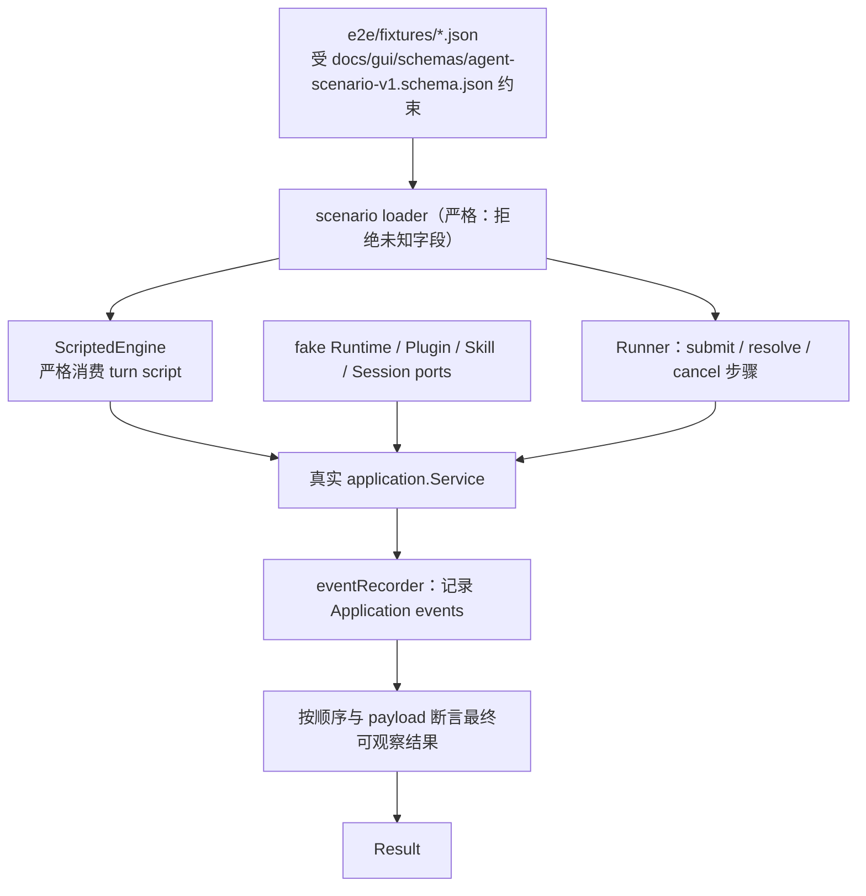
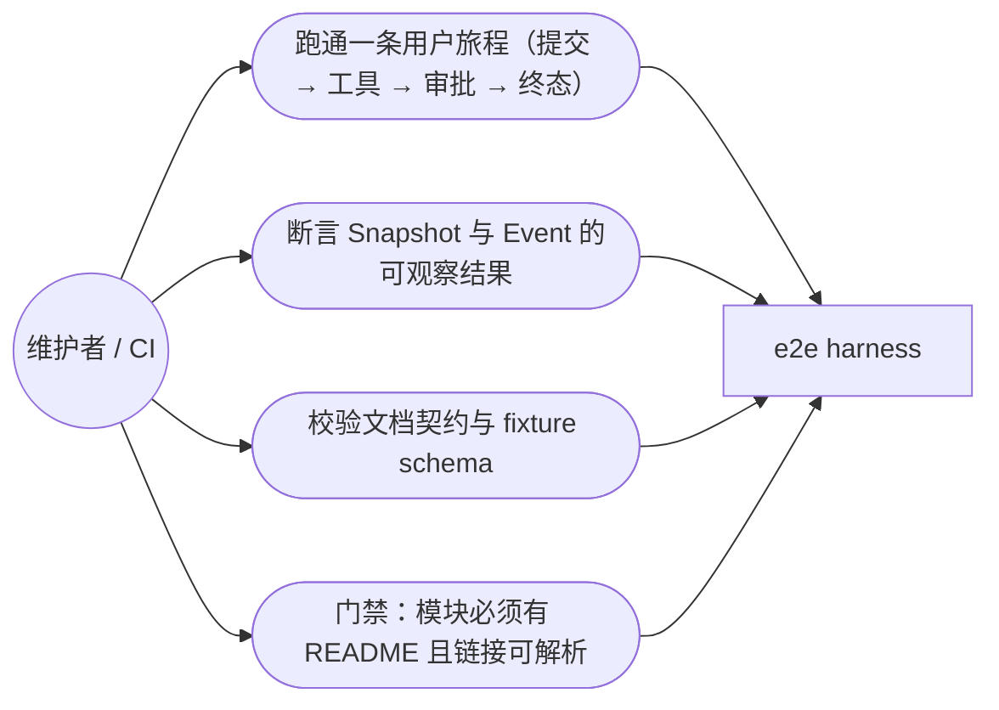

# End-to-End Testing

## 生态位

`e2e/` 承载跨 Application、Engine script、Tool lifecycle 和 Interaction 的确定性验收能力。它验证用户旅程，不依赖真实 LLM 或外部网络。

主要调用方：CI（`go test ./e2e/... -count=1`）与本地回归；它同时是 README 覆盖门禁
（`layout_test.go`）的所在地。

## 架构图



## 用例图



## 子模块

- [`scenario/`](scenario/README.md)：scenario v1 schema、loader、scripted engine、runner、event recorder 和 harness。
- fixture 由 `docs/gui/schemas/agent-scenario-v1.schema.json` 约束；新增 fixture 应放在 `e2e/fixtures/`。

## 边界

E2E harness 可以实现 Application ports，但不复制生产实现。真实浏览器/Wails smoke 属于 GUI 测试层，不应塞进纯 Go scenario runner。

## Review 指南

- scenario 必须确定性、无网络、无真实凭据。
- 断言应面向可观察结果和事件顺序，不依赖私有字段。
- 新协议字段需同步 schema、loader validation 和有效/无效 fixture。

## 测试

```text
go test ./e2e/... -count=1
go test . -run '^TestGUI' -count=1
```
