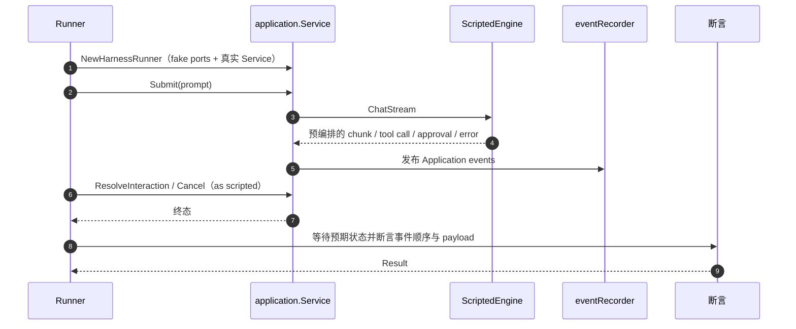

# E2E Scenario Runtime

## 生态位

本包用声明式 `seelex.scenario/v1` JSON 驱动确定性 Agent 旅程，生态位介于 Application 单元测试与真实桌面/browser E2E 之间。

## 时序图



## 核心结构

- `Scenario`/`InitialState`/`Step`：脚本、初始状态、操作与断言。
- `EngineTurn`/`Emission`：预编排的 assistant chunk、tool call、approval 和错误。
- `ScriptedEngine`：实现 `application.ChatEngine`，严格消费 turn script。
- `Runner`：执行 submit、resolve、cancel 等步骤，等待预期状态并生成 `Result`。
- `eventRecorder`：记录 Application events 供顺序与 payload 断言。
- `NewHarnessRunner`：装配 fake Runtime/Plugin/Skill/Session ports 与真实 `application.Service`。

## 数据流

```text
scenario JSON -> Load/Validate -> ScriptedEngine
       |                              |
       +---------- Runner -> Application Service -> events/snapshot
                                      |
                                 Result JSON
```

Tool lifecycle 在 Started/Completed 时进入 Application hooks；需要真实业务工具语义时通过 `ToolExecutorFactory` 注入。

## Review 指南

- `ScriptedEngine` 的 history/session 行为必须与生产 port 契约一致。
- runner wait 必须有 context/timeout，不能无限轮询。
- tool、approval、plan branch 的 ID 要稳定，便于重放。
- schema validation 错误应包含 scenario/step 上下文。

## 测试

```text
go test ./e2e/scenario -count=1
```
