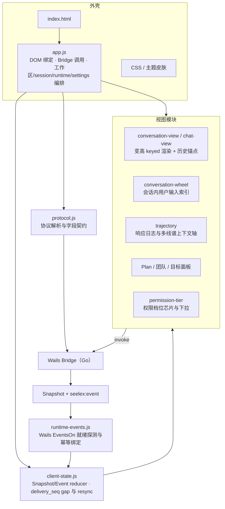

# GUI Frontend

## 生态位

本目录包含被 Go `embed.FS` 打包进 Wails 的前端源码。当前没有 bundler；`dist/` 就是可维护源文件和生产资产，而不是可随意删除的生成目录。

## 架构图



前端不维护业务镜像：权限档位、运行态、会话状态一律消费后端下发的权威字段；
本地只保留光标、viewport、展开态与布局。

## 结构

| 文件 | 职责 |
|---|---|
| `dist/app.js` | DOM 绑定、Bridge 调用、工作区/session/runtime/settings 编排。 |
| `dist/client-state.js` | Snapshot/Event reducer、delivery_seq gap 和 resync；`acceptBaseline` 是**订阅换代基线**入口（`seelex:ready` 才走它：新订阅 `delivery_seq` 从 1 重计，已应用水位必须归零——不看会话 id 变没变）；保留桌面进程段（`processContext`）——会话粒度基线到达时与进程段合并渲染，session-only 的 `runtime.changed` 不抖动账户/插件/技能/模型等进程面板（G3 收口）。 |
| `dist/runtime-events.js` | Wails `EventsOn` 就绪探测、幂等绑定与 ready/event 转发（ready 走 `acceptBaseline`）。 |
| `dist/conversation-view.js` / `chat-view.js` | 变高 keyed conversation、顶部 history sentinel（自动翻更早页由 `shouldAutoLoadOlder` 把关：**停在尾部时一律不翻**）、chat activity 渲染；历史加载用「按消息 key 的锚点」保持阅读位置。 |
| `dist/conversation-wheel.js` | 右侧「会话内用户输入索引」：一条刻度 = 一条用户输入，且**覆盖整会话**（刻度表来自后端全量索引 `Bridge.SessionInputIndex`，含尚未加载到窗口的早期轮次；`app.js` 推入 + 宿主回读通道 `locateInput`）。位置：已加载轮次用问题节点在内容里的真实高度比例，未加载轮次按确定性比例布点；只索引用户输入（不再退回助手步骤/多类别刻度），当前输入高亮、悬停出摘要、点击跳到对应输入——未加载的目标先按页回读（`planInputLocate`/`locateInput`）再定位，回读通道未装配时只提示不空转；键盘 ↑↓/PgUp/PgDn/Home/End 只作用于用户输入刻度。纯函数（`normalizeInputIndex`/`planInputLocate`/`inputAtOffset`/`activeInputIndex`/`scrollTopForFraction`）可离线单测。空态只做视觉隐藏（`display:none` 会让轨道高度量成 0，轮轴再也出不来）。 |
| `dist/trajectory.js` | 轨迹（Network 风格响应日志）纯函数：响应类型分类（input/llm/tool/error/system/notice；`role=system`/`kind=system` 独立成「系统」轨，`message.kind` 显式类别优先，无 kind 的旧数据回退 role 判定）、tool 请求/响应配对、过滤、统计、表格渲染与多线谱分轨上下文轴。多线谱语义集中在 `AXIS_LANES`（轨定义与顺序单一事实源）：每类响应占一条固定轨，块宽只表达该记录在轴上的相对体量（`contextAxisWeight`），入轨与定位由 `axisBlocks` 统一计算，不再出现同一块两套位置语义。轴还内联前缀注入（`prefixLayerSegments`，Bridge.PromptLayers）、压缩刻度（`compactionMarks`，snapshot.task.context_compactions）与压缩分界虚线（`renderCompressionCutRow`：每个压缩点一条竖向虚线 + 「以上 … 已被折叠」，只画锚定在本页的刻度——钳到页边界的刻度位置不真实，不画假线）三条元数据轨与 `renderAxisDetail` 详情（压缩详情内按 `frame_ref` 分页读回折叠帧正文）。 |
| `dist/compaction-format.js` | 压缩记录的展示口径（纯函数、零依赖）：原因/来源标签、被压区间（`compactionRangeText`）、分界标注（`compactionCutLabel`）——右栏「上下文压缩」条目与轨迹压缩轨/详情共用同一份，避免同一条记录两种读法。区间只取记录里已有的边界字段，绝不用 `messages_before`（装配前的引擎历史条数）冒充消息条数。还有门禁进度的累计与耗时文案：`mergeCompactionProgress`（把一帧 `compaction.progress` 并进本轮，判轮次边界、累加逐关耗时、终局沿用最后一条 running 的序号，见 `dist/compaction-format.test.mjs`）与 `compactionGateDurationText`（不足 1ms 写 `<1ms`，不写 `0ms` 也不凑成 1ms）。 |
| `dist/context-summary.js` | 右栏「状态」子页的「上下文压缩」条目：版本/原因/来源/被压区间/估算/时间 + 展开后按 `frame_ref` 分页读回的折叠帧正文（与轨迹详情同一容器与分页组件）。此前只有一句硬编码英文占位句，没有区间、没有来源、不可展开。条目上方还有一轮压缩的门禁进度条（复用 Plan 面板的轨道）+ **逐关耗时清单**：压缩整轮只有几十毫秒，进度条不可能「慢慢走」，能看见串行工作的就是这份清单（每关一行 + 该关实测毫秒；起手帧那一关还没有数字，写「进行中」而不编耗时）。 |
| `dist/trajectory-view.js` | 轨迹视图组件：对话区「轨迹」子页的上下文轴（记录轨 + 前缀注入/压缩元数据轨）/轴详情/过滤条/摘要/表格 keyed 渲染，行内复制/展开/result_ref 分页读回，本地过滤状态；普通轴块点击切回全量并定位轨迹行，元数据块点击开轴详情。**上下文轴分页**：滚轮在轴区域内翻页（`axisWheelStep` 累积阈值、一页一屏语义）、`Shift+滚轮`换页大小（`AXIS_PAGE_SIZE_STEPS`/`stepAxisPageSize`，带页码与页大小提示），分页窗口计算是纯函数（`resolveAxisPage`/`axisPageWindow`/`axisPageForIndex`）；翻到尚未加载的更早区间时提示并以既有 `loadMore` 通道回读，不静默跳位。 |
| `dist/components.js` | message/tool/queue 等纯渲染组件；对话滚动轴（thinking / tool 各自可展开收起，LLM 正文内联）与左侧调试 id。 |
| `dist/html-embed.js` | 会话内 HTML 渲染块：`seelex-html`（别名 `html-preview`）围栏 → **沙箱 iframe**（`sandbox="allow-scripts"`，**无 `allow-same-origin`**）+ srcdoc 内嵌 CSP（`default-src 'none'`、断网、仅 data: 图片）+ 源码折叠；`title=`/`height=` 参数，高度钳制 120–640px。普通 ```html 仍是源码块。 |
| `dist/theme.js` | 换肤加载层（**两轴**：深浅 × 皮肤）：读 `themes/manifest.json` → 归一化 → 切 `<html data-theme>`（深浅）与皮肤 `<link>`（品牌）；id 限 `[a-z0-9-]`、路径只允许 `themes/<id>.css`（防路径逃逸）；皮肤记 `localStorage["seelex.skin"]`、深浅记 `localStorage["seelex.mode"]`。 |
| `dist/themes/` | 内置皮肤包 + `manifest.json`（schema 2：`skins[]` + `modes[]`）：皮肤只覆盖**品牌 token**（主信号 + 环境渐变，8 个 `--skin-*`），中性基座由深浅在 `styles.css` 提供（契约与 token 清单见 `themes/README.md`），皮肤不写选择器、不用 `!important`、不引远程资源。 |
| `dist/vendor/` | 第三方资源落盘区（无 CDN、随包嵌入）：`pico.min.css` 组件库、`marked`、`highlight.js`、`DOMPurify`、`docx-preview`、`PDF.js`、`xterm/`（终端仿真器 + 容器自适应插件，见 `vendor/xterm/README.md`）。版本与许可登记见 `vendor/README.md`。 |
| `dist/plan-dsl.js` | Plan JSON DSL 归一化、DAG → 树状布局（节点详情弹窗数据面）、节点详情弹窗。树轨事实是 `treeIsLast`/`treeAncestors`（末子标记 + 各层祖先是否续行），由 `tree-fork.treeRowAttrs` 画成缩进轨；子代理树同一套。 |
| `dist/agent-team-view.js` | Agent Team 面板渲染（右侧栏 · 状态 → Agent Team）：**分成「员工库」（可用员工 = 全局母本 ∪ 本会话在编，行首 ≡ 拖进发言顺序，来源 chip 标 `库` / `本会话`，行内 新建 / 编辑 / 删除 / 入库）、「团队库」（一行一支用户团队，团队名是按钮 → 打开「这一支」的团队面板；行内 装配 / ✕；内置形态退成表下一行 chip）、「员工栏」（在编员工 + 发言顺序，行首手柄拖拽调序，三列表：身份 / 位置 / 操作）、「发言调度」（运行态顺序串珠条：序号 + 身份，发言中 / 下一个各占一档高亮，轮次徽标 + 席位/收束一行 meta）**；入职与修改员工、新建与编辑团队都是**冷加载面板**（`hirePanel` / `teamEditorPanel`，点 + / 团队名才注入 slot，字段按 身份 / 编排 / 能力 / 提示词 分节条目化，✕ 图标 / Esc 关闭），团队面板的成员表（`renderTeamMemberList`）行序即发言顺序、可 ✕ 移除、可拖拽调序、可承接从员工库拖来的行。数据源是 Application API（`Bridge.AgentTeamPresets/View/Library/GlobalConfig/SaveTeam/DeleteTeam/MaterializeTeam/PutRole/DeleteRole/SetOrder/InstantiateRole/SaveEmployee/DeleteEmployee/OptimizePrompt` 等）。各份事实各有归属：发言顺序 = 会话 `lifecycle.order_policy/order_roles`，员工配置（提示词/权限）= 会话角色注册表，团队库 / 员工库 / 默认顺序 = **全局**母本（数据根下 `team/`，会话读的是深拷贝副本）；本模块不缓存顺序、不做乐观重排——每次动作后重拉视图（纯函数 `employeePool` / `teamMemberNames` / `nextAgentTeamOrder` / `agentTeamOrderForDrag` / `teamGlobalDrift` 供共用）。 |
| `dist/todo-view.js` | todolist 渲染组件（数据源 `runtime.todo_items` 权威投影；仍供测试与复用，右侧工作台已由工作表格接管）。 |
| `dist/work-table.js` | 工作表格视图（弹窗内完整多维表格：阶段/任务/描述/状态/Assignee/Dependency/附件）、批次分片（批次 = chat 请求，批次头可折叠 + 各类计数）、筛选（全部/Plan/Task/Todo/Subagent，按权威 kind）、行内打点、todo 三态更新、retry 计数（RETRY n）、plan/subagent 详情入口；行区独立滚轮滚动（表头吸顶）+ 分页查看（每页 10/20/50，页码钳制）；section/行两级 keyed reconciliation + html 缓存；`workTableSignatures`/`countUnread` 提供未读角标判据。 |
| `dist/tree-fork.js` | 树 / 分叉的统一渲染件（VS Code 观感，纯函数）。两件事：① `treeRowAttrs` 把「层级 + 是否末子 + 祖先是否续行」折算成树轨的 class/行内 style——祖先续行轨 = 行内 1px `linear-gradient` 背景（每层一道），自身连接轨 = `::before`（末子圆角弯头 / 非末子整行竖线），**零额外 DOM**；② `layoutCommitGraph` 把 git 的 parents 拓扑算成泳道（`rows[].lane` + 每行线段 + `dropped`），`commitGraphRowHTML` 逐行画 SVG（直线 / 合并贝塞尔 + 提交点），泳道色走 `--fork-lane-0..5`。像素几何只有一份（`railOffset`/`laneCenter`），CSS 只负责画，换肤只换 token。 |
| `dist/worktree-view.js` | 工作树视图（「资源管理器」子页「工作树」面板）：数据源 `Bridge.WorkspaceTree(relPath, depth)` / `Bridge.WorkspaceFileCount()`（后端权威元数据，只含名称/路径/类型/大小/计数，不含文件内容）；目录行惰性展开（首次经 `loadDir` 拉子级并缓存）、直接文件计数 badge、截断提示；文件行是可点击按钮（`data-file-open`），点击经 `options.onOpenFile` 打开文件预览，同时 `draggable="true" data-file-drag="<工作区相对路径>"`——可以直接拖到聊天框/消息队列发出去（落点映射见 `dist/file-drop.js`）；层级连线交给 `tree-fork` 的树轨（不再是缩进 + 字符画），行点击用容器委托（展开/收起重绘不再逐行绑监听），全部文本 escape。 |
| `dist/file-drop.js` | 档案夹 → 会话的拖放**纯映射**（拖拽载荷 → 工作区相对路径 → 排队正文 → 动作）：`normalizeDropPath`（只接受工作区内相对路径：绝对路径、`..`、超长一律丢弃）、`dropPaths`（自定义 mime → `text/plain` → 带路径字段的 `files`；**裸文件名不接受**——发出去只会让模型去读一个不存在的文件）、`fileQueueText`（渲染成一条可执行的读取指令）、`dropPlan`（草稿非空 → `insert` 只追加引用、不替用户发出去；草稿为空 → `queue` 走 composer 的普通提交路径，会话运行中由后端排进消息队列）。DOM 与 Bridge 调用留在 `app.js`（document 级委托：消息队列每次重绘都换 DOM） |
| `dist/file-preview.js` | 文件预览控制器与纯函数（「资源管理器」子页左抽屉）：数据源 `Bridge.WorkspaceFileContent(relPath, limit)`（后端受控读取：containment/敏感过滤/上限/二进制探测，原始字节 base64 带回）；按扩展名分派渲染——markdown（marked→DOMPurify→highlight.js）、代码/文本（highlight.js 高亮或纯文本）、PDF（PDF.js canvas 分页）、Word（docx-preview）、图片（blob ``）、`.doc` 提示转换；组件全部本地 vendor（`dist/vendor/`，随 embed 离线打包）；文本永不直接 innerHTML，markdown 输出先 DOMPurify 消毒。抽屉是**多文件详情容器**：每个打开的文件一枚 chip（`renderPreviewTabsHTML`）+ 一个独立面板（切换只切显隐，不重读、不丢滚动位置）；抽屉**头部就是 chip 标签条本身**（无独立标题 / 元信息行——「文件详情 · path · size」那行已删，文件身份由 chip 承担，动作按钮贴右）；纯函数 `previewTabLabel`/`normalizePreviewTab`/`openPreviewTab`/`closePreviewTab` 给出标签生命周期（打开去重、关闭切邻居、关闭不同项保持当前激活）；最后一个 chip 关闭（容器为空）回调 `onEmpty` → 抽屉收起、子页恢复原来大小。**编辑面**（`canEditPreview` / `decodeEditableText` / `serializeEditableText` / `editDirty` / `baselineDriftNotice`）：只有文本类、二进制探测为真且未被截断的读取才给编辑入口（非 UTF-8 的文件不给——保存会静默改掉它的编码）；**只有 Ctrl+S（或动作条「保存」）才落盘**，落盘按原文件的 EOL / BOM 还原，随后按同一路径**读回实际文件**并把编辑器基线换成读回的那一份（外部并发改动被点名而不是被掩盖）；退出编辑 / 关闭 chip / 收起抽屉前先过脏守卫（保存 / 不保存 / 取消，chip 上以 ● 标未保存），取消与保存失败都原样保留缓冲。 |
| `dist/git-log-view.js` | 提交记录视图（「资源管理器」子页「提交记录」面板）：数据源 `Bridge.WorkspaceGitLog(limit)`（后端权威只读元数据：按 `--topo-order` 的提交行 + 每个提交的 `parents` 父 hash，不含 diff/文件内容）。分叉不再贴 `git --graph` 的字符画：`tree-fork.layoutCommitGraph` 按 parents 算泳道，逐行 SVG 画直线/合并曲线 + 提交点；短 hash 点击复制完整 hash、截断与泳道上限提示；hash 复制走容器委托；全部文本 escape。 |
| `dist/terminal-panel.js` | **下栏终端面板**（VS Code 式）：纯函数（`clampTerminalHeight`/`normalizeTerminalState`/`terminalTabItems`/`nextActiveTerminal`/`decodeBase64Bytes`/`encodeBase64Bytes`/`terminalEventOf`）与 DOM 控制器 `createTerminalPanel` 同文件。终端的**权威状态在后端**（`Bridge.TerminalOpen/Write/Resize/Close/List`），前端只持有布局（`seelex.terminal.v1`：是否展开/收起/高度）与 xterm 实例：多开标签（同名 shell 编号、退出划线、行尾 ✕）、顶边拖拽调高（键盘 ↑↓ 微调）、收起只留头带；输出走独立事件名 `seelex:terminal`（不进 `seelex:event` 的 seq 水位，`TerminalOpen` 返回前到达的输出按 id 暂存后补投）；尺寸唯一来自 xterm `fit()` 的 cols/rows（`onResize` → `TerminalResize`）。终端不属于会话：切换会话/历史分页都不触碰它。xterm 的配色只在创建时从 token 取一次，换肤后由 `refreshTheme()` 把最新 token 套回全部已开终端（`app.js` 把它接到 `theme.js` 的 `onApplied` 回流口，契约见 `dist/themes/README.md` 的「换肤回流」段）。控制器级契约测试见 `terminal-panel-controller.test.mjs`（假 DOM + 假 xterm + 假 Bridge，不开窗不起进程）。 |
| `dist/scheduled-tasks-view.js` | 定时/周期任务面板渲染（数据源 `runtime.scheduled_tasks` / `runtime.scheduled_commands` 权威投影）。 |
| `dist/read-sources.js` | **deprecated**（不再被 `app.js` 引用，右栏已由「工作树」接管；文件预览已落地）：从会话工具事件中收集成功完成的 `read_file` 路径。文件与测试保留供会话证据复用。 |
| `dist/markdown.js` | 安全 Markdown、think block 和 URL 过滤。 |
| `dist/effort-control.js` | Effort selector 状态与 rollback。 |
| `dist/protocol.js` | protocol version 校验、conversation window 和递归 Plan 增量 reducer；不判定事件所属会话（归属由 application 在投递端过滤）。 |
| `dist/snapshot-shape.js` | 快照分型的字段归属契约（G3）：SessionRuntime/ProcessRuntime/顶层键所有权表、`splitRuntime`/`classifySnapshot`/`assertTypedShape`/`processContextOf` 纯函数。桌面仍收联合 Snapshot 时按表区分会话与进程字段；会话/进程制品到达后做泄漏校验（INV-G1 前端镜像）。 |
| `dist/sidebar.js` | 左栏纯显示工具：重名消歧编号（渲染期派生）。标题截断已删除——会话条目改成「标题段 + ⋯ 段」后由 CSS 省略号按栏宽截断，完整标题 + 时间 + token 走共享提示气泡（数据层砍字会让同前缀会话无法区分）。会话置顶/别名**不再**存 `localStorage` —— 它们属于会话展示元数据，由后端持久化并随快照 `session.meta` 下发，写入经 `Bridge.SetSessionMeta(sessionID, pinned, alias, sortOrder)`。 |
| `dist/dock-layout.js` | 子页停靠布局纯函数：对话/轨迹与状态/工作台/资源管理器五个子页在主视图与右栏的分区、排序、激活与置换演算（`normalizeDockState`/`swapViews`），不含 DOM、存储或 Bridge 调用，由 `app.js` 消费。 |
| `dist/*.test.mjs` | Node 内置 test runner 契约测试。`trajectory.test.mjs` 覆盖轨迹响应类型分类、配对、过滤、统计、上下文轴分轨布局、前缀注入轨与压缩刻度、轴详情与转义安全。 |

## 视觉设计系统

样式全部集中在 `dist/styles.css`，遵循 Tracebench（轨迹台架）设计体系：本地 Agent 工程验证台架，铁蓝石墨 + 暖纸白 + 黄铜信号灯，会话/工具/Plan 全部打在一条时间基线上。

- token 层分两条轴：**深浅**（`:root` 浅色 / `:root[data-theme="dark"]` 深色）给表面色（`--bg/panel/surface`）、文本色、描边、语义色（`--status-running/done/failed/info`）、刻度线（`--tick`）、半透明面与投影；**皮肤**（`themes/<skin>.css`）只给品牌（主信号 + 环境渐变，8 个 `--skin-*`），由 styles.css 桥接成 `--accent`/`--on-accent`/`--shell-gradient`。字阶、圆角与间距属基座，不分轴。组件不得硬编码色值；同义状态只允许使用对应语义变量，禁止色值漂移。
- 字体三角色：界面正文 `--font-ui`，数据/时间戳/状态 `--font-mono`，标签与数字 `--font-display`（Bahnschrift 系测量字）；最小可见字号 10px，数据行 ≥11px，正文不低于 12px。
- 中栏签名：`#trace-rail` 是一条垂直时间基线，消息与 Plan 卡片以打点（`::before` 圆点）挂线，工具卡片以左侧 3px 状态条标识；运行中的 Plan 节点是唯一常驻动效（黄铜扫掠 `trace-sweep`），`prefers-reduced-motion` 全局关闭。
- 界面词统一为中文：就绪 / 执行中 / 排队 / 手动 / 自动改文件 / 自动执行 / 全权；弹窗 eyebrow 不再使用英文机器词。
- 图标管线：静态按钮以 `data-icon` 占位，启动时由 `components.js` 的
  `hydrateIcons()` 注入统一 stroke SVG（ICONS 注册表）；顶部连接点
  `.status-dot` 由 `chat-view.js` 追加 `online` 类切换语义色。
- 信息层级：对话区子页（`对话 / 轨迹`）与右侧栏三个子页（`状态 / 工作台 /
  资源管理器`）同属一套停靠布局（`seelex.dock.v1` localStorage 记忆）：默认
  会话两页在主视图、右栏三页在右栏；页签可点击切换、拖拽换序、跨栏置换
  （拖到另一栏某页签上松开即与该页签互换）。「历史检索」收进 `#side-more`
  折叠区常驻右栏子页之下；左侧栏只承载会话树（工作区绑定在会话树的行内动作里），
  三栏宽度可拖拽调整（`--left-w`/`--right-w`，localStorage 记忆；**无固定上限**，
  只按视口宽封顶，窗口越大越能拉开）。
- 「资源管理器」子页的**内容详情抽屉可收起让出内容页**（2026-09-17）：抽屉头部
  的「收起详情，让出内容页」把详情折成一条 28px 竖轨（`.is-preview-collapsed`：
  `preview panes` 两列），工作树 + 提交记录独占子页；点竖轨还原。它与「隐藏
  工作树/提交记录」（详情独占）是两个方向，互斥（收起时复位隐蔽态），因此不会
  出现两侧都隐蔽的空子页。打开文件会解除收起态（点文件树必须能看见详情）。
- 中栏底部是**下栏终端**（VS Code 式，2026-09-17）：`.terminal-panel` 三态 =
  隐藏（`.hidden`）/ 收起（`.is-collapsed`，只留 30px 头带）/ 展开；展开高度由
  `--terminal-h` 控制（顶边分隔条拖拽或 ↑↓ 微调，localStorage `seelex.terminal.v1`
  记忆，上限 72vh 保证对话区不被顶掉）。头部左侧是收起/展开，中间是**多开标签条**
  （同名 shell 自动编号、退出态划线、行尾 ✕ 关单个），右侧是 新建 / 关闭当前 /
  隐藏。快捷键与 VS Code 对齐：`` Ctrl+` `` 切换（已展开则收起）、`` Ctrl+Shift+` ``
  新建；顶栏 `#terminal-button` 是同一入口。终端会话与输出全部来自后端
  （见 [`../README.md`](../README.md) 的「下栏终端」），前端只持有布局与 xterm 实例。
- 右栏「状态」子页自上而下：`状态`（键值两列表格 `status-table`）→ `账户`
  （条目化账户栏，见下）→ `Agent Team`（员工栏 / Team 栏两块表格）。账户栏从
  左侧栏底部搬到这里：状态区显示的就是当前账户的 provider/model，账户列表贴在
  它下面，一眼能对上「现在是谁在跑」。
- 会话条目（左栏）固定两段：**标题段**（状态点 + 完整标题，CSS 省略号按栏宽
  截断，条目里不再出现时间/token）+ **⋯ 段**（省略号按钮，点开才是置顶 / 分支 /
  删除三个操作）。时间、token 与完整标题在鼠标常驻（或键盘聚焦）时由共享提示
  气泡（`#ui-tooltip`，一条 DOM、`[data-tip]` 委托触发、`\n` 分行）一起给出；
  ⋯ 段同一时刻只开一条，点空白 / Esc / 执行动作即收起。
- Agent Team 是两个东西：「员工栏」管人（员工名单表 + 一步实例化表单，
  同名角色就地覆盖），「Team 栏」管装配与编排（装配形态、顺序策略、工作顺序表、
  发言调度、定时 agent 表）。两栏都是条目化表格，别再往 chip 混排的自由布局里加字段。
- 动效克制：只保留一个加载指示（`runtime-spinner`），装饰性动画（扫光、连点、辉光、呼吸）已移除；`prefers-reduced-motion` 全局生效。
- 交互口径（拟物但克制：北欧家居式极简 + 锤子式短促回弹）：
  - 焦点提示只作用于**外框**：`1px solid var(--focus-ring)` + `box-shadow: var(--focus-glow)`（`0 0 12px 1px`，零偏移、纯发散模糊）；内部 `textarea` 的 focus ring 显式清掉。
    **例外（用户口径）**：聊天框是**卡片**，它的「点击激活」不再加聚光——卡片一旦发光就像"被选中/报错"，不像"正在输入"。`.composer:focus-within` 改成卡片抬升 `--shadow-lift`（两套皮肤各一档）＋ 一点点 accent 描边提示焦点在哪；
  - 消息队列 = 叠在聊天框上沿的一叠卡片：`.message-queue` 是列，卡片之间用 `--queue-peek` 相互压边（每张卡底部预留同样高度的内边距，压边吃掉的是留白而不是正文），最下面一条（最新排队）紧贴聊天框上沿；被指到/键盘进入的那张浮到最上面；作为文件拖放目标时高亮同一套强调边；
  - 档案夹 → 会话的拖拽：工作树文件行 `draggable`（`data-file-drag` = 工作区相对路径），聊天框与消息队列是落点，映射逻辑在 `dist/file-drop.js`（纯函数）：草稿非空只**追加**引用（不替用户发出去），草稿为空就走 composer 的普通提交路径（会话运行中由后端排进消息队列——上方那叠卡片就是这么来的）；
  - 按压是「陷进去再弹回来」：`:active` 用 0 偏移内阴影 `--press-shadow` + `translateY(1px) scale(.985)`（图标键 .94），开关态（`perm-chip.is-on` / `team-preset.is-active` / 已置顶）也用内阴影表示"已经按进去"；位移都在 1~2px，不做弹跳；
  - 层次靠 1px 外框 + 极轻投影，不堆厚描边；`prefers-reduced-motion` 关闭全部 transition/animation。
- 内存口径（前端只做减法的三件事）：
  - **事件委托**：会话列表、账户栏、插件列表、命令/内联建议、提交记录、工作树的行级动作都挂在容器上一条监听，列表重绘不再重建 N 个闭包与监听器，也不留孤儿监听；
  - **一条共享提示气泡**替代每行 `title`/子元素提示（#ui-tooltip）；
  - **拓扑只传一次**：git log 只下发 `commits`（含 parents），不再同时下发 `lines`（同一份数据发两遍）；Plan/子代理树的树轨是布尔标记而不是每节点一个引导字符串。
  - 度量看顶部性能徽标（`perf-hooks.js` 采集 DOM 节点数等无内容指标，点击展开）。
- 语义色映射以 `:root` token 为唯一事实来源；新增组件时先查 token，不新增同义色。
- 会话树：会话按工作区（`session_workspaces` 投影）分组，未绑定或工作区已消失的会话收进「未关联会话」置底；工作区组头可点击折叠（localStorage 记忆）；工具 in/out 面板支持展开/收回切换。每行带可见状态徽标（`session.status`：运行中/排队/草稿/恢复中），保留的「新建会话」草稿槽位以草稿行常驻列表（点击恢复，物化后消失）。`restoring` 表示运行中切换到未驻留会话时后台冷加载中：视图已切到目标空壳，输入区禁用，装载完成后由 `snapshot.changed` 发布内容基线并回到就绪。
- 目录形状（G6）：后端目录缓存按 projectID 分格枚举（`SessionsOf` 是唯一
  枚举源头），`sessions[]`/`session_workspaces` 只是落到快照的**联合镜像**
  （跨项目按会话 ID 去重）。前端按工作区分组属渲染层派生，不拥有存储归属
  事实；同 ID 会话在多个项目格重复出现（迁移/旧布局）时以后端最近更新为准。
- 去线框原则：主面板与内容面（状态、概要、工作区、定时任务、历史检索、
  用户消息等）默认不画边框，靠底色/留白/字阶分层；数据密集视图（工作表格、
  Plan/节点详情）保留细边框作数据分隔。

## 状态流

快照分型（G3，契约先行）：`application/model` 已把 DTO 拆成
`SessionSnapshot`/`SessionRuntime`（会话粒度、传输完备）与
`ProcessSnapshot`/`ProcessRuntime`（进程目录/能力清单）。桌面 Workbench
现阶段仍以联合 Snapshot 下发（进程字段内联在 `runtime`），`snapshot-shape.js`
是前端唯一的字段归属事实表：进程面板（账户/插件/技能/定时任务/模型）与
会话面板（effort/plan/work_table/子代理树）各自按所有权提取；会话制品若泄漏
进程字段或进程制品泄漏会话字段，`assertTypedShape` 直接拒绝（INV-G1）。
`createGUIClient` 在快照边界经 `processContextOf` 记录进程上下文（联合
Workbench 快照或进程制品）；会话粒度基线（`capabilities.session_snapshot`）
到达时与进程段合并成渲染快照，`runtime.changed` 只携带会话运行字段时进程
段照常保留——桌面进程面板不随会话载荷抖动。联合快照自身已带进程字段，
按原样渲染（无重复合并）。

1. 初始化先等待并幂等绑定 Wails `EventsOn`，再通过 Bridge `Snapshot` 获取权威状态；runtime 尚未就绪时整个初始化按既有重试机制继续，不能静默进入无事件模式。
2. `client-state` 应用连续 `seelex:event` 增量。
3. seq 缺口先向宿主 `ReplayEvents` 增量补取；补不齐、协议不兼容或未知状态才触发完整 Snapshot resync。
4. render functions 根据 state 投影 DOM；所有 mutation 通过 Bridge 返回 Application。

权限档位控件不维护本地状态：composer chip（`#perm-toggle`，位置沿用原"全权"chip，尾部 `▾` 表示可下拉）显示当前档短名，**点击就地展开芯片下拉**（`#perm-menu`，位于 `<div class="perm-picker">` 内、向上展开的一层浮层）；条目由 `permission-tier.js:permissionTierMenuItems` 给出，与运行状态弹窗里的列表**同源**（同一份后端目录 `snapshot.runtime.permission_tiers` + 同一份生效档 `snapshot.runtime.permission_tier`）。点一条即调用 `Bridge.SetPermissionTier`，按返回的**生效档位**渲染芯片并重新拉取 Snapshot；`applyPermissionTier` 是唯一提交路径，下拉与弹窗列表共用。键盘：`↑/↓` 循环（纯函数 `nextTierIndex`）、`Enter`/空格提交、`Esc` 或点击浮层外关闭；`aria-expanded`/`aria-haspopup` 由 `togglePermissionMenu` 维护。运行状态弹窗里的「权限档位（本会话）」列表保留为总览口。后端同时发布完整 `runtime.changed` 供连续事件链更新。旧 `full_access` 保留为派生位（`full` 档 ⇒ true）。

事件是状态更新的唯一快路径。渲染层每应用一批事件就向宿主回报应用水位
（`Bridge.AckEvents`，密集期按 150ms 合并）；`delivery_seq` 出现缺口时先向宿主
`ReplayEvents` 增量补取，补不齐才整份重拉 Snapshot。因此 `chat.running=true` 期间
不再有每秒轮询：桌面 WebView 丢掉 terminal event 遗留的 `RUN`/`Waiting for output…`
由宿主重推未确认事件收敛（`gui/bridge.go` 的 `armResend`/`catchUpRenderer`，重推封顶
`eventResendMaxTries` 次，超出窗口则投递带水位的 `resync.required`）。原
`active-chat-sync.js` 已删除。

视图会话切换（ResumeSession/ActivateSession/新建/分支）会使 Bridge 重建订阅：
新订阅的 `delivery_seq` 从 1 重新计，因此**订阅换代基线**（`seelex:ready`）到达时，
`client-state.acceptBaseline` 一律复位已应用水位（不看会话 id 变没变），`app.js`
同步复位待发回执游标——否则新订阅 seq<=旧水位的首段事件会被当作重复静默丢弃，
会话正文停在基线，且回执会把旧订阅的高水位报给宿主，宿主据此停止补投（永久静默）。
归零只走 `acceptBaseline` 这一个入口：同一订阅内的整份 refresh 必须保留水位，否则
宿主从重放窗口补投的旧序号事件会被重复应用（流式 delta 叠两遍）。

`resync.required` 是宿主的**指令**（"整份重拉，并把水位抬到这个序号"），因此
`protocol.js` 在 `delivery_seq` 的连续性/去重判定**之前**处理它：它的序号可能是
本订阅的投递水位（等于甚至小于渲染层已应用水位），先走去重判定会把它当迟到事件
吞掉——整份重拉永不发生，视图停在旧内容上。

右侧工作台由「工作表格」入口按钮统一接管：数据源 `snapshot.runtime.work_table`
+ `snapshot.runtime.work_table_batches`（权威投影）与
`worktable.changed`/`task.changed` 增量（`worktable.changed` 附加 `batches`
批次头、并在子代理树内容变化时附带 `subagent_tree`；两者都是可选增量，
缺失时保留既有值，空数组表示树已清空）。按钮常驻，带未读角标（未读 = 新增或状态/
retry 变化的条目，打开详情后清零）；点开按钮弹出完整多维表格弹窗（工作台
窄，详情在弹窗内看全）。Plan 节点 / todolist 项 / task 主动条目 / fork
子代理归一为 WorkItem 行，按批次分组（批次头可折叠）并按权威 kind 筛选；
行内可展开打点、todo 三态更新、plan/subagent 详情入口。无任务时隐藏整个
section。

todo 项（kind=todo）进入工作表格的 `tasklist` 阶段；三态（pending/doing/
done）只读权威 `work_table` 状态，行内按钮经 `Bridge.UpdateWorkItemStatus`
回写后端（成功路径发布 `runtime.changed` + `worktable.changed`），渲染不做
本地猜测。状态迁移按 kind 限定（todo 仅三态；task/plan/subagent 维持通用
迁移），非法状态由后端拒绝。
Plan DSL（`plan-dsl.js`）保留为节点详情弹窗的数据面：`refreshPlanDetailData`
只算 DSL 不改面板 DOM。详情入口按 Plan DSL → 子代理树 → 工作表格行
（`workItemToDetailNode`）→ 仅身份节点逐级兜底打开：同一批次还有子代理在跑
时，行会先经 `worktable.changed`/`task.changed` 到达，而树只由整份快照与
`runtime.changed` 携带，早期版本在这种时序下会静默不弹窗；弹窗只保留三块
数据面——会话记录 / 上下文 / 功能打点，全部由 `SubagentSessionDetail` 单一
权威载荷提供（第一视角流式通道 `SubagentDetailStreamStart/Stop` 与
`seelex:subagent_live` 订阅已删除）。弹窗与会话记录区可拖拽调整大小
（复用工作表格弹窗的 `data-resizable` + `.modal-resize-handle` 交互），会话
记录内容按框内宽度自适应（`width:100%` + `overflow-wrap:anywhere` +
`min-width:0`），长行/代码块/URL 不横向溢出。

task 即 worktable 条目（单一注册表 actor，保护粒度=task）：主动 `taskadd`
工具、被动 plan/subagent 生命周期同步都落到同一数据面；增量事件
`task.changed` 按 task_id 单行 upsert，`worktable.changed` 保持整表替换；
retry 状态展示 `RETRY n`（retry_count）。

## 右侧栏子页（状态 / 工作台 / 资源管理器）

五个子页（对话/轨迹/状态/工作台/资源管理器）由停靠布局统一管理（纯函数见
`dist/dock-layout.js`，DOM 与持久化在 `app.js`）：`main` 区固定展示两个页签、
`right` 区固定展示三个页签，页签可点击切换、同区拖拽换序、跨区拖拽置换，
整体记忆在 `seelex.dock.v1`（旧 `seelex.right.tab` 仅作一次迁移读取）。
右栏默认三个子页（`.right-tabs`，默认激活「状态」）：

- **状态**：项目状态表（状态/会话/消息/任务/文件数）+「概要」= 压缩栈表格
  （一行一次折叠，点行读帧正文；原「状态」面板整体移入）。
- **工作台**：「目标」面板 + 工作表格入口 + 定时任务面板。
- **代码**（资源管理器）：左右分栏——左「内容详情」抽屉 + 右**三个平级子页**
  （工作树 / 提交记录 / 工作区更改）。子页用一条内嵌页签切换（`role=tablist`，
  一次只显示一个），激活态与顺序记忆在 `seelex.right.explorer.v1`，旧
  `seelex.right.codePanes` 只作一次迁移读取（迁移后写新键、删旧键）。每个子页头部
  一枚刷新按钮（`data-icon="refresh"`），内容区自己就是滚动容器
  （`overflow-y: auto`，滚轮只滚该子页）；重新激活该子页或再点该子页页签也会刷新。
  刷新是**原子能力**：单飞（在飞期间复用同一个 promise）+ 代次提交（过期响应不回写、
  不出现三个面板新旧混搭），失败保留旧数据只提示——规则在
  `gui/frontend/dist/explorer-refresh.js`，页签语义在 `explorer-pages.js`。
  内容详情抽屉宽度可拖拽（`--preview-w`，`seelex.preview-pane-width` 记忆，
  **无固定上限**——只受子页宽封顶，可把任一侧拉到几乎占满子页），抽屉头部一枚按钮
  可**隐蔽工作树与提交记录**让内容详情独占子页（`seelex.preview-panes-hidden` 记忆），
  另一枚按钮/Esc **关闭全部文件详情**。抽屉不再记忆展开态：容器以「有文件详情」为
  生命周期前提。

「目标」面板（`goal-view`）展示当前任务的工程目标证据面：目标文本（最近一条
非空用户消息）、任务状态/摘要（`snapshot.task` 权威 TaskState）、激活 skill
chips + GOAL badge（`runtime.active_skills` / `runtime.goal_skill_active`，
后端锁内快照投影，`runtime.changed` 增量携带）。无内容时整个 section 隐藏。

「资源管理器」子页数据面：工作树走 `Bridge.WorkspaceTree/FileCount`（惰性目录展开），
提交记录走 `Bridge.WorkspaceGitLog(limit)`（最近 20 条：按 `--topo-order` 的提交行
+ 每个提交的 `parents` 父 hash + hash/作者/时间/标题；前端按 parents 算泳道，
用 SVG 画直线/合并曲线 + 提交点，短 hash 点击复制完整 hash）。
两面板在工作区切换或 chat 结束（文件/提交可能变化）时按需刷新；子页未激活时
数据面缓存，激活时按需拉取。文件预览：点击工作树文件行 → 左抽屉经
`Bridge.WorkspaceFileContent` 拉取受控字节（默认 4 MiB 文本 / 24 MiB 文档图片，
后端 64 MiB 硬钳制）→ 按扩展名分派渲染（见 `file-preview.js`）。抽屉是**多文件
详情容器**：每个打开的文件一枚 chip（抽屉头部就是 chip 标签条，无独立标题 /
元信息行）+ 一个独立面板（点 chip 切换、点 chip
尾部 ✕ 关闭单个详情；再次点开同一文件只是激活，不重复读盘）；最后一个 chip 关闭
（容器为空）时容器生命周期结束——抽屉自动收起、子页恢复原来大小（工作树/提交
记录重新占满）。预览属当前工作区，工作区切换时抽屉随树清空；截断文件明确提示、
分页类（PDF/Word/图片）超限放弃渲染而非半截展示。历史检索保留在 `#side-more`
折叠区常驻。

### Agent Team 面板（员工库 / 团队库 / 员工栏 / 发言调度）

面板分四块，交互口径与事实源如下（用户口径：员工库与团队解耦、团队只负责"装配谁
/ 顺序 / 呼叫谁"、顺序直接拖、入职与修改走冷加载面板且字段条目化、母本全局而会话
读深拷贝副本；2026-09-15 第二轮又收了一轮噪音：栏头注解与"存当前会话 / 入库当前
会话 / 顺序设为默认"三个整表级写动作全部撤掉，改成行内一次性的最小动作）：

**四块各自只管一份事实（2026-09-24 澄清语意并删掉耦合点）**：员工库 = 全局「员工是谁 +
档案（提示词 / 权限 / 类型）」的**唯一编辑入口**；团队库 = 全局「一支团队有谁、什么顺序」；
员工栏 = **本会话**「在编名单 + 发言顺序 + 入职 / 摘除 / 移出本会话」；发言调度 = 运行态只读。
员工栏行内原来的「编辑」（会话作用域改档案）已下线——同一个人的档案有两套按钮、写两份事实，
必然要漂移（视图侧得靠 `teamGlobalDrift` + 「入库」+ 漂移提示兜）；现在要改档案回员工库改，
再「入职」一次即覆盖本会话副本（同 `role_name` 幂等覆盖），`app.js` 里接 `data-team-edit`
的分支一并删除。三块栏头的 `title` 写明各自事实域（栏头不摆注解文字，域只在 hover 里说）。

- **员工库 = 可用员工（全局母本 ∪ 本会话在编）**：读侧合并（`employeePool`），行首
  ≡ 可拖到员工栏或团队成员表把人排进发言顺序；每行带来源 chip（`库` / `本会话`）。
  库里的行给「编辑 / ✕」（`AgentTeamSaveEmployee` / `AgentTeamDeleteEmployee`，写
  全局母本 `<root>/team/employees.json`），只在本会话在编的行给一个「入库」（写母本，
  不装配）。这样就解决了"会话里明明有人、员工库却是 0 人"的空壳问题；两份事实仍
  分属两个作用域，合并只发生在展示层。宿主未下发员工库（旧后端）时不渲染写按钮，
  也不渲染拖拽条。
- **团队库 = 用户自己的团队**：一行一支，列为 团队 / 规模 / 操作。**团队名是按钮**，
  点它打开这**这一支**团队的团队面板（面板标题写明"团队 · 名字"，右上角 ✕ 关闭）；
  行内只留「装配」（`AgentTeamMaterializeTeam`）与「✕」（`AgentTeamDeleteTeam`）。
  内置形态（`goal-a2a` / `review-team` …）是代码里的模板、不是用户数据，所以退成
  表下一行小 chip：点一下就地装配，当前形态禁用——不再往库里塞假条目，也不再有
  「存入库」把 preset 写进用户数据。
- **员工栏（在编员工 + 发言顺序）**：行首手柄（`data-icon="grip"`）是拖拽条，把
  员工拖到另一行之前（或拖到底部"顺序末尾"落区）即提交整份 `order_roles`；
  **没有 ↑/↓ 按钮**——拖拽是唯一的调序通道（用户口径），`nextAgentTeamOrder` 因此
  只处理"摘除 / 恢复"（纯函数 `agentTeamOrderForDrag` 负责位置，非法动作返回 null
  不提交）。行内只留本会话的两件事：✕ **摘除**（出工作顺序、留角色）与**删除**
  （连会话注册表一起删）；**档案只回显**（权限 / 提示词 chip 的 title 写明"本会话
  在编副本"），编辑入口在员工库。表只留三列（身份 / 位置 / 操作），类型 chip 并进身份格：
  窄栏里列一多，每列只剩二十几像素（`user` 会被折成 `use r`）。
- **发言调度（运行态串珠条）**：不摆 项/值 表——顺序本身是一条可视的链
  （`.schedule-pill`：序号 + 身份），"发言中"（floor）与"下一个"（`schedule.next_role`）
  各占一档高亮，其余为普通/虚线（`unexecuted` 的角色标"无执行者"）；上方徽标是
  `轮次 / 上限`，下方一行 meta 只在有收束原因/无执行者角色时出现。环成员不含
  `user`（用户的发言机会是回合尾消息队列被整批提升为下一轮，不是排班位），所以珠子
  里没有 `USER`、"下一个"也不会指向人。参照群聊的通行做法：顺序用位置与编号表达，
  不靠文字播报。没有 `TeamView.schedule`（旧宿主）时整块隐藏，不拿静态顺序冒充运行态。
- **冷加载面板**：员工库的 `+ 新建员工` / 「修改」、员工栏的 `+ 入职`、`+ 新建团队` /
  点团队名 打开的「入职 / 修改员工」与「团队」面板默认都不渲染——只有 `data-team-hire-slot` /
  `data-team-team-slot` 两个隐藏占位；点开才注入表单，右上角是 `data-icon="close"`
  （取消 / Esc 同样关闭）。字段**条目化 + 序列化**：一条字段一行（序号 + 标签 +
  控件 + 说明），按 身份 / 编排 / 能力 / 提示词 分节——右栏只有 220~480px，标签与
  控件并排会把控件挤到 80px 宽。
  员工字段：1 角色名（修改态只读）、2 类型、3 入职时机、4 在席策略、
  **5 权限（`tools_policy`）**、6 模型、**7 员工提示词**。填写值来自
  `TeamView.members`（会话作用域）或 `TeamGlobalConfig.employees`（员工库作用域）的
  登记回读，因此一次编辑不会把提示词/权限清空；表单上的 `data-team-hire-scope`
  决定提交走 `AgentTeamSaveEmployee`（员工库，不装配）还是
  `AgentTeamInstantiateRole`（当前会话入职）。
  **团队面板的成员表**（`renderTeamMemberList`）：行序即发言顺序，行上带序号 + 身份
  + 「✕ 移除」，整行可拖拽调序；也能**从员工库把行拖进来**（落点在某位成员上 = 插
  到它之前）。行序在提交时由 `agentTeamEntryFromForm` 序列化成
  `order_roles`（`user → main → 成员`）——成员顺序是团队库条目的一部分。
- **提示词优化**：员工面板里的「优化提示词」按钮调 `Bridge.AgentTeamOptimizePrompt`
  （一次有界 LLM 回合），结果只渲染成候选 + 改动理由，点「应用到提示词」才写回
  输入框；落盘仍走「入职 / 保存修改」。
- **权限边界（如实标注）**：`tools_policy` 目前是**登记 + 展示**——值随角色注册表
  落盘并在员工栏可见，运行时按角色的工具拦截尚未接线（真正拦截在 seelebridge
  `PermissionGate`，按会话/全局）。
- **后端方法仍保留**：`AgentTeamSaveCurrentTeam` / `AgentTeamPublishToGlobal` /
  `AgentTeamSetDefaultOrder` 在 Application/Bridge 面上健在（headless 与工具面可用，
  `gui/README.md` 有说明），只是 GUI 不再直接暴露这三个"整表级"入口。

### 页签与折叠口径（2026-09 交互改版）

- **选中页签 = 静止胶囊（2026-09-24 换代，取代纸质笔记本书签拟物）**：选中态统一成
  "同色系薄底 + 同色系重字"（`--hl-fill` / `--hl-ink`，`styles.css` 第 27 节 j），
  不描边、不加下条、不投影、不做位移——用户口径是"高亮既不是黑块 / 黑外框，也不是
  圆角 + 单边黑条"。同一套口径覆盖页签家族的五处：对话区子页、右栏子页、工作表页签、
  终端页签、发言调度胶囊（第 27 节 o）；库内 `inset 0 -Npx 0` 的写法已清零，
  `rgba(0, 0, 0` 只剩深色主题里的两个投影 token。
- **上下文压缩块在 状态 折叠区里，且概要有且仅有它（两轮口径叠加）**：
  2026-09-24 把 `#context-compactions` 挂回 `#status-panel` 里、紧随概要（用户口径：
  "上下文压缩内容需要放到状态的概要下面"）；2026-09-26 再收窄为"概要有且仅有压缩栈
  表格"——同区的英文作用域说明删除，卡片改表格。折叠区默认收起，所以"按下回车到底
  动没动"改由视图侧兜住：`app.js: repaintCompactions` 见到本轮门禁进度就
  `revealStatusPanel()` 打开折叠区（只开不收），历次记录不自动弹开（免得跟用户手动
  收起打架）；两条口径都由 `gui/frontend/dist/status-panel.test.mjs` 钉住。
- **状态 / 账户 / Agent Team 三个折叠块默认收起**：`index.html` 里
  `#status-panel`、`#accounts-section`、`#team-section` 都不带 `open`，展开才拉
  数据（Agent Team 的 `toggle` 事件仍触发一次 `refreshAgentTeam`）。避免右栏一
  进来就被三张长表占满。
- **对话里的 EXEC / ADVISOR 区分（2026-09-15 二改：颜色高亮也去掉）**：两个 agent
  的 provider role 都是 `assistant`，`components.js` 仍按 `role_name` 给消息加
  `is-exec` / `is-advisor` 类，但 `styles.css` 第 20 节**只保留发言人名的着色**
  （EXEC 冷钢蓝、ADVISOR 暖黄）——既没有整块底色，也没有左侧那条 3px 状态条
  （用户口径：把左侧的颜色高亮也去掉，身份只由名字给）。用户自己的输入气泡
  （`.message.user .message-body` 的 `--surface` 底）保留，它是"这条是我说的"的
  功能区分，不是归属分区。
- **会话条目紧凑 + ⋯ 浮层菜单（2026-09-15 二改）**：条目只留"标题 + 状态"两段，
  行高 24px、内边距 1px 4px（`--row-min-h` 只管团队表格，不跟着一起缩）；⋯ 按钮
  **常驻**在行尾（不再 hover 才显形），点开的是挂在 `document.body` 上的浮层菜单
  `#session-menu`（`position: fixed`，所以不被左栏滚动容器裁掉；下方放不下会翻到
  上方，左右夹在视口内）：置顶 / 取消置顶、分支出新会话、删除会话三项带文字标签。
  菜单项与行内动作同源（同一批 `data-*` 键），点击经
  `dispatchSessionListAction` 走同一条分派；`state.openSessionMenu` 仍是唯一开合
  状态，重绘后 `syncSessionMenu()` 按新的 ⋯ 按钮重新贴位，滚动/缩放/Esc/点外部一律
  关闭。
- **左右栏收起按钮在栏内（2026-09-15 改版）**：收起/展开不在顶栏，而在每条栏自己
  的 `.panel-rail-head` 一行里，图标是 `chevron-left` / `chevron-right`（展开态与
  收起态各一枚，`html[data-left-collapsed]` / `[data-right-collapsed]` 由 CSS 切换
  显隐）。收起后每条栏仍保留 26px 窄脊 + 那枚按钮（可达、不占位），Ctrl+B /
  Ctrl+J 与 `seelex.*.collapsed` 记忆不变。
- **外壳承载环境渐变（2026-09-24 换代后）**：`.app-shell` 铺一条等亮度竖向渐变
  （`--shell-gradient`，每套皮肤深浅各一条），顶栏与左右栏透明透出它、中栏是盖在
  渐变上的"纸"；面板之间的层次仍靠各自的 `surface` 与 1px 发丝接缝，不靠辉光。
  右栏页签条没有装饰性渐变。

## 输入前缀（sigil）与命令面板

composer 的输入前缀是一份**跨前后端契约**，前端只消费不发明（权威表与理由见
[docs/gui/modules/shell-and-interactions.md](../../docs/gui/modules/shell-and-interactions.md)
第 6 节与 `docs/gui/decisions.md` 的 ADR-GUI-021）：

| 前缀 | 作用 | 候选来源 |
|---|---|---|
| `/` | 命令与工具（全量入口，也列 Skill） | `Bridge.Suggestions` |
| `#` | 切换 Plugin（含 `off`） | 同上 |
| `$` | 召回 Skill（激活） | 同上 |
| `@` | 手动召唤团队（内置形态 + 团队库条目） | 同上 |

- 表在前端只落一处：`app.js` 的 `SIGIL_COMMAND/SIGIL_PLUGIN/SIGIL_SKILL/SIGIL_TEAM`
  与 `SIGILS`、`SIGIL_PATTERN`（内联建议"该不该弹"的判定）。命令面板触发器按钮
  （`index.html` 的 `data-trigger`）与内联建议共用同一组字符。
- `@` 提交成功后**强制重取**一次 Agent Team 面板（`refreshAgentTeam({force:true})`，
  仅在面板展开时）：装配改的是后端事实，面板缓存的是上一次读回的成员表。
- 选中的建议只写回 composer，最终统一走 `Submit`；前端不执行任何前缀语义。
- `suggestionIcon` 为 `team` 类建议映射 `components.js` 的 `team` 图标。

## 定时周期任务

右侧栏「工作台」子页「定时任务」section 常驻（含「新建定时任务」按钮）：数据来自 `snapshot.runtime.scheduled_tasks`（seelebridge 调度器状态变化经 observer → `RefreshRuntimeSnapshot` → `runtime.changed` 增量投影，见 `seelebridge/scheduler/` 与 `application/core/service_scheduler.go`）。任务渲染只读展示：名称/类型/启用状态/下次运行/上次结果/日志尾部，取消按钮以 `data-sched-cancel` 携带任务 ID 并调用 `Bridge.CancelScheduledTask`。

新建弹窗的字段由 `Bridge.ScheduleTask` 提交（`scheduled-tasks-view` 不直接持有 Bridge）：类型分「命令」与「提示词」两种；执行方式分「周期重复」与「定时执行（一次性）」两种。

- **命令任务（主路径）**：下拉选项来自 `snapshot.runtime.scheduled_commands`（后端编译期白名单，`main.go` 登记 `auto_get_jobs`，指向 `local/tools/auto_get_jobs/main.py`）。白名单命令的 argv 固定、不经 shell 展开，前端无法注入任意命令。脚本依赖（`.env`、`user_requirements.txt`、`city_list.json`、chromedriver）均按其自身目录解析，调度器只提供固定工作目录与超时。
- **提示词任务（扩展点）**：提交后由后端注入的 executor 触发一次 agent 会话（main 装配为 application Submit，排队语义：会话忙时任务排队，不与进行中的对话冲突）。任务绑定当前 main session（`session_id` 留空 = 执行时当前会话；显式绑定会在会话切换后跳过而非误投）。结果回传为「已提交」状态字；异步会话的完整输出请从会话记录/事件库查询，这是当前实现的有意取舍。

- **周期重复**：以「每 n 小时/天/周/月」表达（`period-row`：数值 + 单位下拉；
  提交时换算为 `interval` 纳秒并附带 `periodUnit`/`periodValue`）。month 由
  调度器按日历月推进、月末日期自动钳制；无周期单位的旧任务回退到
  `interval_seconds` 秒级展示。
- **定时执行（一次性）**：以 `datetime-local` 选择执行时间，提交时转为
  RFC3339 `runAt`；后端要求晚于当前时间，创建即启用，执行后自动停用并保留
  记录（面板展示「定时 MM-dd HH:mm」与「一次性」标记）。

任务状态、白名单命令均为公开元数据，不含 secret；渲染文本全部 escape。

`Snapshot.Conversation` 是后端提供的有界窗口；**窗口截断与游标（`total_messages`/`history_offset`/`has_more_history`）全部是后端 `view_state` 的投影，增量 reducer 只负责 upsert 消息**（阶段 B2：旧实现曾在 JS 里复刻一份截断+计数规则，两边一旦漂移就会出现客户端少显示历史）。回合边界的 `snapshot.changed` 会把权威窗口带回，因此一次回合内数组最多增长该回合新增的消息数。消息 DOM 使用真实内容高度的 keyed reconciliation，不使用 `virtual-list.js` 的固定行高模型。

历史分页契约（2026-09-11 收口，前后端同口径）：

- 窗口 = `[history_offset, history_offset + 窗口条数)` 的**连续区间**，窗口条数上限
  `limits.history_window`；初始窗口贴尾（`history_offset = total - 窗口条数`）。
- 顶部 sentinel 接近视口或点「加载更早」→ `LoadMoreHistory(0)`：**一页 = 一整窗**
  （页大小由后端单点决定；半页会把「窗口」和「页」两个尺寸混在一起），
  窗口整体后退一页，分页态写进后端会话可见投影（不再只写 Snapshot 镜像，
  否则新消息/工具事件一次镜像就把分页结果抹回尾部，表现为「点了加载更早，
  内容回卷，再点还是同一页」）。
- **自动翻页只在用户离开尾部时发生**（`conversation-view.js` 的
  `shouldAutoLoadOlder`）：窗口整体后退会把尾部那段移出 DOM，所以用户停在尾部时
  sentinel 的任何几何触发（容器 `display:none` 后重新显示、侧栏折叠、布局抖动
  把 sentinel 带进 `rootMargin`）都不得翻页——否则"最新消息"会在用户没做任何
  操作的情况下从 DOM 消失。「加载更早」按钮走宿主命令，不受这条限制。
- 回看更早历史期间（`history_offset + 窗口条数 < total_messages`，前端判据
  `historyWindowed()`）：尾部新消息不再把窗口拽回尾部，也**不会**被追加进
  列表（那会在窗口与尾巴之间插出断层）；`message.added` 只记为已应用。
- 历史栏因此常驻两个动作：「加载更早」（`has_more_history`）与「回到最新」
  （`LoadLatestHistory`，窗口重新贴尾并带回回看期间的新消息）。
- 滚动恢复按**消息 key 锚定**（记住视口顶部第一条消息，更新后按回原位），
  而不是 `scrollHeight` 增量——窗口整体后退时高度几乎不变，增量算法会把
  用户甩到别的位置。锚点已被截掉时退回增量算法。

对话区聊天视图（`components.js` + `conversation-view.js`）按 Codex/Qoder 式
分离「对话与轨迹」：LLM 正文保持内联不进滚动轴；thinking 与 tool-calling
各自收进可展开/收起的滚动轴（thinking 轴默认展开并带滚动，工具轴默认收起，
展开后在轴内滚动查看全部工具条目）；每条消息/工具左侧显示会话定位 id
（`.item-id`），便于对照轨迹与记录排查。聊天区右侧的对话导航轮轴是一条
**问答刻度**（对齐 DeepSeek 网页版右侧导航）：**一条刻度 = 一问一答**，刻度挂在
每个 user 轮上，位置来自问题节点在内容里的**真实高度比例**（不是按条目权重
均分），当前问答用主信号色加长、其余压暗；点击刻度即跳到该问题（回答正好在
它下面铺开）并闪烁定位、悬停出问题摘要、键盘支持上下/翻页/首尾，拖动或点击
轨道空白处按内容比例滚动。相邻刻度保持最小间距，短问答不会叠在一起。窗口里
没有 user 轮时（长会话翻到中段）退回按助手步骤分段，右侧不会空着。刻度表随
DOM 重新测量：加载更早历史、增量新消息、容器缩放后自动重建，不需要任何
「刻度加载」状态。类型与摘要来自渲染层写入的 `data-wheel-kind`/`data-wheel-label`。
轨迹子页仍保留全部工具 IN/OUT 与思考全文，不做折叠。

回答里需要图表/示意图时，用显式标记的围栏块让前端渲染 HTML：

````text
```seelex-html title="任务耗时分布" height=320
<svg viewBox="0 0 100 40">…</svg>
```
````

渲染规则是固定的安全契约（实现见 `html-embed.js`）：HTML **只进沙箱 iframe**，
永不注入应用 DOM；`sandbox` 只给 `allow-scripts`，不给 `allow-same-origin`
（两者同给等于没有沙箱），因此块内脚本拿不到宿主 DOM / storage，也够不到
Wails bridge；srcdoc 自带 CSP（`default-src 'none'`、`connect-src 'none'`、
只允许内联样式/脚本与 `data:` 图片）断掉网络出口；不给表单/弹窗/顶层跳转。
块内附「查看源码」（转义文本）供用户核对。普通 ```html 围栏仍然是源码块，
不会被执行。

样式分三层，改外观前先确认改哪一层（顺序不能换）：

1. **组件库**（`vendor/pico.min.css`）= 元素基线与通用组件皮。它只作用于没被
   类选择器覆盖的元素，所以引入它不会推翻既有外观；
2. **Seelex 样式**（`styles.css`）= 语义 token + 组件样式，并把 `--pico-*`
   桥接到 token（"组件库桥接"段），因此第三方组件跟随皮肤换色；
3. **皮肤包**（`themes/<skin>.css`）= 只覆盖**品牌 token** 的换肤层（"皮肤"与
   "深浅"在设置的「外观」区各自一排卡片，两条轴互不耦合：深浅给中性基座，
   皮肤给主信号与环境渐变）。组件结构不动。

控件尺寸走 token（`--control-h-sm/--control-h/--control-h-lg`、`--row-min-h`），
图标按钮、徽标、输入框、页签、主次按钮、列表行统一取这几个值——同排控件不再
高低不齐；右栏团队区的动作按钮固定最小宽度，窄栏里不会把"删除"挤成竖排。
微标签（数据/序号）下限 10.5px，正文 13.5px。

**引入组件库必须注意 role 语义冲突**：Pico 把 `[role=group]` / `[role=search]`
当作它的"输入组合"组件（`display:inline-flex` + `width:100%` + 子项
`flex:1 1 auto`），而 Seelex 用同一个 role 表达语义分组。凡是自绘的分组容器
（`.context-axis`、`.effort-control`、`.work-todo-status`）都要在"Pico 的 role
组件归位"段里显式还原布局，否则会出现"标题与轨道被排成左右两栏、轨道塌成窄
条"这类比例错乱。新增带 role 的容器时，先检查它是否被组件库命中。

对话列与上下文轴同样按这套节奏收口：消息块间距 26px、折叠头 34px、思考正文
12.5px/1.7、工具芯片 24px 高；上下文轴用 64px 标签列 + 16px 轨道，
块最小宽 3px（压缩刻度 4px）保证可点。

**不要用高特异性通配链剥按钮样式**：``.app-shell button:not(...):not(...) { border:0;
background:transparent }`` 这类规则特异性高于自绘控件的类规则，会把上下文轴块
`.axis-segment`、关闭按钮 `.axis-detail-close` 的底色边框一起剥掉（表现为"轴上有
内容却看不见"）。要归零就归零"外边距/默认宽度"，颜色与边框交给各自的类。
上下文轴块的颜色用 `color-mix(状态色, 轨底色)` 的实色而不是 10% 透明度的
`--tint-*`：一条轨道可能装几十上百个窄块，透明底色在浅色皮肤下等于不可见。

对话区顶部是主视图页签条（`.conversation-tabs`，本地 UI 状态）；「对话 / 轨迹」
两个会话子页可以留在主视图，也可以与右栏任一子页置换后停靠到右栏。会话类
页面在主视图激活时显示底部输入框，其它主视图全宽展示时不遮挡。
「轨迹」子页把同一份 `Snapshot.conversation` 投影为 Network 风格的响应日志：
先按响应类型分类（输入 / LLM / 工具 / 错误 / 系统 / 通知；`role=system` 与
`kind=system` 独立成「系统」轨），工具请求与 `tool_result`
按 tool id 配对为一行（IN/OUT、状态、耗时、大小、`result_ref` 截断读回）；
过滤条按类型筛选并带计数，展开详情复用 `io-panel` 交互契约（复制/展开/
`ToolResultContent` 分页读回）。轨迹数据纯前端派生，不新增后端契约；子页
未激活时只缓存数据面（懒渲染），增量事件到达时重新投影。顶部上下文轴在
六条响应类型轨之外内联两条元数据轨：「前缀注入」轨（Bridge.PromptLayers
的会话级当前层，段宽=层文本占比、横跨整轴，点击开详情看全文——替代旧独立
「前缀注入」面板）、「压缩」轨（`snapshot.task.context_compactions` 的折叠帧刻度，
锚定压缩发生时会话推进位置；**每段是竖向虚线**，栈顶/当前前沿用
`--compaction-frame-latest`（浅底深灰）、被更晚折叠取代的用
`--compaction-frame-stale`（浅底浅灰）——两个 token 只是中性 ramp 的别名，
所以深色模式的倒置由深浅基座自己完成，不写第二套色值）与「分界」轨（**会话单例**：
只画当前前沿那一条竖向虚线 + 「以上 消息 …（事件 …）已被折叠」标注，历次折叠各画
一条会让读者以为两条线之间那段还发给模型）。刻度与虚线都可点：详情按公开元数据
（版本/原因/来源/被压区间/时间）如实展开，并给出「折叠帧正文」入口——正文不进快照，
前端按记录里的 `frame_ref` 经 `Bridge.ToolResultContent` 分页读回（同一个分页组件，
不再把用户指向模型侧工具）。system prompt 与压缩的注入/折叠均可 trace 到轴上，
粒度到会话级当前层与每次压缩事件）。

右栏「状态」子页的「概要」区**有且仅有压缩栈表格**（2026-09-26 口径：一行一次折叠，
栈顶在前、按新旧下沉，前沿行标「栈顶」并取深灰，过时行降为浅灰；点行读本帧正文，
弹框入口同排）。原先挤在同一区的英文作用域说明已删——它说的两件事由项目名/根路径
与上面的状态表承载。表格与轨迹压缩详情、对话区分界共用同一份口径函数
（`dist/compaction-format.js`，含栈序 `compactionStackOrder` 与前沿
`compactionFrontier`）：区间只取记录里的边界字段（`message_from/to`、
`event_from/to`），绝不用 `messages_before`（装配前的引擎历史条数）冒充
"压缩前 N 条消息"。

子代理增量递归更新 `runtime.plan.nodes`：`subagent.changed` 替换完整节点，
工具 started/completed 按 ID upsert `node.tool_events`。Plan 支持
`worktree_creating`、`rebasing`、`merging`；工作表格子代理行经「详情」打开
节点详情弹窗（会话、上下文快照、节点时间线、工具输入/结果/错误与功能打点
表——tasklist 的 `task_check_node` 检查点和子代理工具活动由同一事件投影
驱动）。reducer 采用路径级结构共享（`mapPlanNodePath`）：未命中分支复用原
对象，不整树深拷贝；`worktable.changed` 只替换 `runtime.work_table`。

详情弹窗另有「上下文」标签：展示 `SubagentSessionDetail` 返回的子代理结构化上下文快照（Goal/Progress/Findings/Decisions/Constraints/PendingWork/MessageCount/TokenEstimate，运行中实时导出、结束后快照），与会话记录、工具活动共同构成运行过程的可核验证据面；快照只含公开证据，不含 prompt 原文或秘密。

Plan 渲染是树状布局（不是扁平 DAG）：`plan-dsl.js` 的 `layoutPlanTree` 从无入边根节点做 Kahn 拓扑分层（level = 到根最长路径），节点按 `treeIsLast`/`treeAncestors`（末子标记 + 各层祖先是否续行）交给 `tree-fork` 画缩进轨——末子是圆角弯头、非末子整行竖线、祖先还有后继兄弟才续行，**不再用字符画连线**；多入边节点（菱形 join）采用「主路径树 + 旁路标记」策略——树父节点取入边源中层最深者，其余入边渲染为「旁路」chip 引用，节点只出现一次、不死循环。无 edges 的 Plan（纯 children 嵌套）保留旧缩进契约；Kahn 未访问的环内节点按根扁平处理（环防御，深度有界）。节点卡片能力（打点表、详情弹窗、工具活动）原样保留。子代理树（`renderSubagentTree`）共用同一套树轨。

工作表格的 `subagent` 阶段来自 `snapshot.runtime.subagent_tree` 投影（后端
内存态，不落盘；权威 Snapshot 增量携带）。行显示状态着色（running/done/
failed）、goal、Assignee 与 parent dependency；行「详情」打开节点详情弹窗。
子代理生命周期是被动数据源：fork 注册/完成由后端 observer 自动发布
`worktable.changed`，不依赖模型调用任何工具；完成的子代理有界保留（
`subagentTreeRetainDone`，超限清最旧），直到 `ClearSubagentTree` 显式清空。
fork 子代理不在活跃 Plan 里时（计划已清除）详情弹窗回退到子代理树投影
数据，会话记录/上下文仍由 `SubagentSessionDetail` 承载。

`fork_subagents` 的外层工具在 summary 完成前保持运行态；这时应点击 Plan 节点查看真实进度，不能仅以 `Waiting for output…` 判定卡死。若外层工具报告子代理结果过大，详情中的会话、功能打点和工具活动才是可核验的证据面；renderer 不把过大的 `final_output` 当作完整审查结果的替代品。

点击新建会话只调用 `BeginNewSession` 进入编辑草稿：草稿从新建即持有早分配
的真实 SID（`HasSession=false`，不建引擎 bundle）。「任务会话」是真正未关联
的会话——`BeginNewSession` 会清空上一个会话继承的项目绑定（项目地址、资源
管理器文件树/提交记录不再显示），第一次提交真实对话后 Application 用同一
草稿 ID 物化，并以首个问题作为列表标题。「工作区会话」先进入未关联草稿、
再在草稿上 `BindWorkspace` 绑定所选工作区，首次提交物化到该项目。草稿
未发送正文由渲染层输入防抖写后端（`SaveComposerDraft`），重启后随
`seelex:ready` 的 `snapshot.session.composer` 回填输入框。

`beginNewSession` 只做「调命令 + 重拉快照」：会话目录的收敛由 Bridge 在命令返回前等刷新回执保证（见 `gui/README.md` 的 Bridge 契约），前端不再在列表为空时回填上一次目录并延时重拉——那是在 renderer 里伪造业务状态掩盖异步竞态。

## 安全和身份规则

- 所有模型/工具/用户文本在进入 HTML 前 escape 或经过受控 Markdown renderer。
- 禁止执行 raw HTML、危险 URL 或任意脚本。
- session/project 名称只显示；按钮 `data-session`、`data-ws` 必须保存 ID。
- 草稿 session 从新建即持有早分配真实 ID；只有输入过 composer 才随 record
  落盘并常驻左侧列表（`status=draft` 行，点击恢复同一草稿）；草稿行不允许
  delete/binding，物化后按正式 Session 处理。
- DSN、API key 等秘密不能进入 renderer state。
- system prompt、其装配结果和层摘要不能进入 renderer state；Runtime 面板只显示模型、Provider、Plugin、Effort、工具和 Plan 等可公开诊断信息。

## Review 指南

- Event delta 是否可能重复应用或越过 revision floor。
- DOM key 是否稳定，streaming 时是否无意义重建大列表。
- `innerHTML` 数据是否全部 escape。
- Plan 点状态更新是否来自权威 JSON，而非仅靠 CSS 本地猜测。
- 新 Bridge 调用是否处理 rejection 并恢复 optimistic UI。

## 测试

```text
Get-ChildItem gui/frontend/dist -Filter *.js | ForEach-Object { node --check $_.FullName }
node --test gui/frontend/dist/*.test.mjs
go test ./gui -count=1
```

`runtime-events.test.mjs` 验证 Wails runtime 延迟就绪时不会漏绑或重复绑定。`event-chain.test.mjs` mock Wails `seelex:event` 并验证主代理/子代理工具完成状态和权威 `runtime.full_access` 通过 `createGUIClient`/`protocol.js` 后可见，且连续事件不会退化为 Snapshot reload；主代理工具卡明确断言完成后不再显示 `Waiting for output…`。
`multi-session-switch-freshness.test.mjs` 复现「多会话 + 单会话进行」的正文冻结：
切到另一会话后新订阅 `delivery_seq=1..N` 的流式增量必须落地并回报宿主，不得被
旧会话水位吞掉或退化为整份刷新。
`session-switch-stale-event.test.mjs` 复现「热会话切换时而灵时不灵」的迟到事件
竞态（热→热 与 热→冷）：切换竞态中旧订阅/旧视图的迟到事件不得推进新订阅的
applied 水位——否则新会话 `delivery_seq=1..N` 会被误判为重复静默丢弃，正文冻结
在基线直到下一次整份刷新或再切换一次。配套 `protocol.test.mjs` 断言视图外事件
丢弃但不推进水位。
`work-table.test.mjs` 覆盖工作表格归一化、多维表格渲染（含转义）、todo 三态
控件与打点表；`protocol.test.mjs` 断言 `worktable.changed` 只替换
`runtime.work_table`（plan 对象引用不变）且子代理事件复用未命中分支节点
（结构共享，无整树深拷贝）。`git-log-view.test.mjs` 覆盖提交记录归一化
（提交行/畸形载荷）、parents 泳道布局（merge 分叉与 join 收口）、SVG 分叉渲染、
截断与泳道上限提示、全部文本 escape 与复制回调；`tree-fork.test.mjs` 覆盖树轨
几何（末子弯头 / 续行轨 / 深度与缩进钳制）与泳道算法（分叉、合并、空闲泳道复用、
泳道打满丢弃、畸形载荷不出 NaN）。
`file-preview.test.mjs` 覆盖预览分派（扩展名→类型/语言）、大小格式、UTF-8/
UTF-16/GBK 解码、base64 往返与截断语义，以及多文件详情标签的纯函数（标签名、
打开去重、关闭切邻居/保持当前项、chip 渲染与转义）；`worktree-view.test.mjs`
断言文件行渲染为带路径元数据的打开按钮；`file-drop.test.mjs` 覆盖拖放纯映射（只接受工作区内相对路径——绝对路径/`..`/超长丢弃、mime 与 `text/plain` 的读取优先级、裸文件名拒绝、读取指令正文、"草稿非空只追加"的落点判定）；`file-preview-controller.test.mjs` 覆盖编辑面的控制器契约（Ctrl+S 是唯一的写盘动作、保存后读回并把基线换成磁盘的那一份、脏关闭与收起抽屉的保存选择守卫）。后端侧：`workspace/readfile_test.go` 覆盖
containment/敏感过滤/符号链接拒绝/上限钳制/截断/二进制探测，
`application/core/workspace_file_usecase_test.go` 覆盖当前工作区 root 转发与
后端缺文件端口时的降级，`gui/bridge_test.go` 覆盖 Bridge 参数转发。

## Context compression summary

Overview in the status sub-page holds **only** the compaction stack, rendered as a table: one row per successful compression, newest first, the frontier row flagged 栈顶, and the frame body read back on demand by reference — the body stays in the session content store and is paged through `Bridge.ToolResultContent` (`frame_ref`). The English scope sentence that used to sit in the same section is gone (the project name, root path and the status table already carry it), and the card list it shared the section with is replaced, because free-layout cards misalign in a ~300px rail. Prompt text, tool payloads and raw conversation history are still not part of the snapshot; the entry no longer claims “details can be re-read when needed” without offering an entry point.
The trajectory axis marks each frame with a **dashed** vertical tick — frontier frame in `--compaction-frame-latest`, superseded frames in `--compaction-frame-stale`; both alias the neutral ramp, so the dark-mode inversion needs no second palette — plus exactly one cut line for the current frontier, captioned `以上 消息 …（事件 …）已被折叠`, so the folded prefix reads as a boundary rather than a bare tick. In the conversation column the same frontier is a dashed separator whose chip states in visible text that the messages above it remain readable and are simply no longer sent to the model.

A compression round is also visible **while it runs**. The backend publishes `compaction.progress` (one frame per gate, exactly one terminal frame; session-routed, `revision=0`, so it never enters the snapshot) and the right column renders a gate progress bar over the plan-board track plus a per-gate duration list. The block itself lives **inside the 状态 fold, right after 概要** (user口径: “上下文压缩内容需要放到状态的概要下面”); because that fold starts collapsed, `repaintCompactions` reveals it (`revealStatusPanel`) whenever a round is in flight — records alone never force it open, so a manual collapse is not fought back (`gui/frontend/dist/status-panel.test.mjs` pins both halves). Two properties make the round readable rather than a single green flash: the explicit path (`/compact`, `compact_context`) emits a **begin frame before the first expensive step** — the round has two silent stretches otherwise, the judge gate (22–40 ms on a 640 KB fixture: two whole-request token estimates, full accumulated context + engine cache peak) and the frame gate (15–19 ms) — so pressing Enter gives feedback immediately instead of "no reaction"; and every frame carries the wall-clock milliseconds of the segment that just finished (`elapsed_ms`, 0 for the begin frame), so the list answers "which gate was slow" for a round that is over in tens of milliseconds. The automatic path deliberately has no begin frame (whether to fold *is* the outcome of that estimate), which keeps the older rule intact: no fold, no progress. Gates whose segment is under a millisecond print `<1ms`; the begin frame's gate prints `进行中` and never takes a checklist row of its own — the UI never invents a duration it does not have.

The command palette (`/`) lists only what the input box can actually submit: commands and
skills. Tools are not suggestions at all (`SuggestionKindTool` and the alias-folding
`toolSuggestions` were removed) — they are called by the model behind the permission gate,
so a capability only gets a `/name` entry once it is registered as a command (compaction:
command `/compact`, model-side tool `compact_context`). Typing a tool name still gets an
unknown-command notice that says so and points at the same-capability command.

The right-column “代码”子页“工作树”面板 shows the bound workspace's file tree via
`Bridge.WorkspaceTree` / `Bridge.WorkspaceFileCount` (metadata only: name,
path, type, size, counts). It replaces the former flat “Agent read files”
list; the backend `read_files` archive is still persisted as session evidence
but is no longer a main panel. 点击文件行会在同子页左抽屉打开文件预览：内容经
`Bridge.WorkspaceFileContent` 受控读取（containment/敏感文件/忽略目录过滤、
64 MiB 硬上限 + 截断标记、二进制探测），原始字节只进预览抽屉，不进入
Snapshot/业务状态；accounts.yaml 等敏感名与 .git/node_modules/.seelex 等
忽略路径在 workspace 层直接拒绝。同一子页的「提交记录」面板经
`Bridge.WorkspaceGitLog` 展示最近 20 条提交的拓扑泳道图（按 `--topo-order` 的
提交行 + 每个提交的 parents；分叉由前端 tree-fork 画 SVG，hash/作者/时间/标题
为只读元数据，不含 diff/文件内容）。


## 视觉换代：Qoder 基座 + 两轴换肤（2026-09-24）

默认外观从 `graphite`（铁蓝石墨 + 黄铜）换成 `qoder` + 浅色（象牙暖白外壳 + 纯白内容面，
墨黑主信号），并在 `dist/styles.css` 末尾新增**第 27 节「Qoder 基座」**（几何、密度、层级、
标签字号——只走 token，不写硬编码色值），同时把**环境渐变**（壳承载 `--shell-gradient`）
落进第 27 节 a)。

**换肤拆成两条正交的轴**（用户要求"皮肤和深浅色分开来做"）：

- **深浅（mode）** = 中性基座：`styles.css` 的 `:root`（浅色）与 `:root[data-theme="dark"]`
  （深色）给面 / 文本 / 描边 / 状态 / 半透明面 / 投影；由 `<html data-theme>` 选择；
- **皮肤（skin）** = 品牌：`themes/<skin>.css` 只给**主信号 + 环境渐变**共 8 个 `--skin-*`
  token，styles.css 桥接成 `--accent`/`--on-accent`/`--shell-gradient`；
- 两者可自由组合（5 皮肤 × 2 深浅 = 10 种外观），"加一套皮肤 = 加一个 CSS 文件 + 一条登记"，
  不改任何 JS，也不改深浅。设置弹窗「外观」区因此有**两排卡片**（`#theme-picker` 皮肤 /
  `#mode-picker` 深浅）；`theme.js` 的落点从「6 套整皮肤」变成「皮肤 `<link>` + `data-theme`」，
  记忆也拆成 `localStorage["seelex.skin"]` 与 `localStorage["seelex.mode"]`；
- **契约收紧**：皮肤包仍"只覆盖 `:root`、不写选择器、不用 `!important`"，但覆盖面从
  "全部语义 token"收窄到 8 个品牌 token；中性 token 由深浅基座负责，`theme.test.mjs`
  对**两条轴各自的 token 清单**都有校验；
- **5 套皮肤**：`qoder`（默认）/ `graphite` / `verdigris` / `paper` / `silver`，
  **每套都有自己的环境渐变**（深浅各一条，见 `themes/README.md` 的皮肤表）；
- **文档与证据**：成因分析（五条可复现规则）、渐变色皮肤设计、逐文件改动表、静态复刻页
  与实机截图都在 [`docs/design/qoder-skin/`](../../docs/design/qoder-skin/README.md)。

**中栏是"一块带圆角的纸"（2026-09-24 第二波）**：`.workspace`（对话区整块 panel：子页页签条 +
对话/轨迹 + composer + 终端面板）拿到 `border-radius: var(--r-md)`(8px)，子节点由既有
`overflow: hidden` 一起裁圆；圆角里露出来的是壳的渐变，**不缩进**——这与 Qoder 实机量到的
"纸四角 7–8px 圆角、四边紧贴窗口"一致（量法见 `docs/design/qoder-skin/tools/measure-skin.py`
同族，数值见 DESIGN-LANGUAGE §3）。同时把 `.conversation-tabs` 的底色清掉：它还留着
**渐变换代前**的壳色 `var(--bg)`（#f7f6f2），叠在纸上就是第三种颜色、会把纸上面两个圆角
抹平——纸要读成"一整块"，页签条就得是纸的一部分。