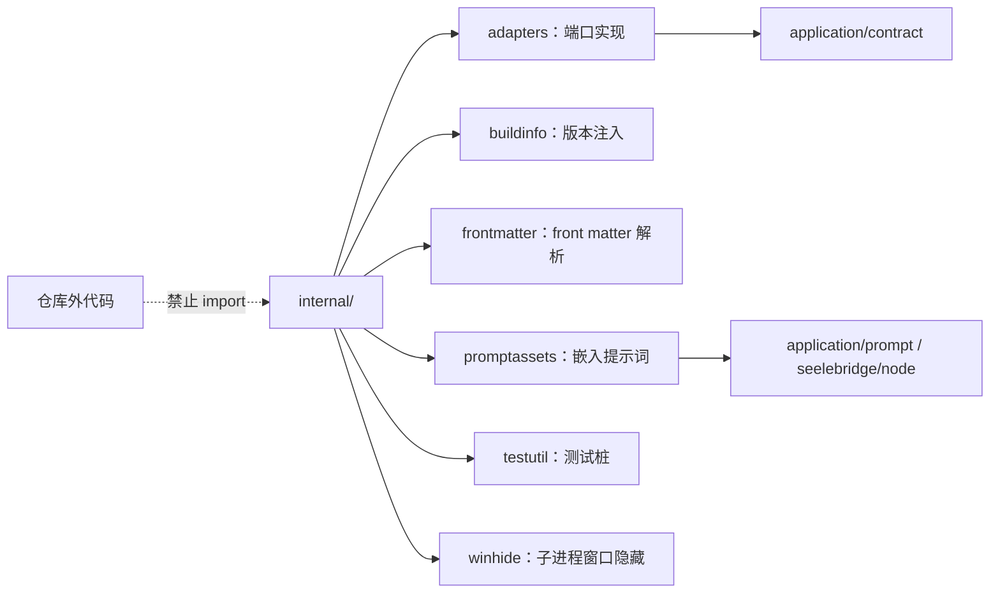

# Internal Packages

## 生态位

`internal/` 存放只允许本 module 使用的基础实现。这里的代码不能被仓库外 import，也不应包含面向产品的 Application 用例。

当前子模块：

- [`adapters/`](adapters/README.md)：把引擎/运行时/插件/Skill/会话/工作区能力适配为 `application/contract` 端口。
- [`buildinfo/`](buildinfo/README.md)：构建期注入的版本与默认前端。
- [`frontmatter/`](frontmatter/README.md)：Markdown YAML front matter 解析。
- [`promptassets/`](promptassets/README.md)：Seelex-owned 提示词资产（构建期嵌入）。
- [`testutil/`](testutil/README.md)：仅测试使用的共享桩（EmbeddedChatEngine 等）。
- [`winhide/`](winhide/README.md)：Windows 子进程控制台窗口隐藏（非 Windows 空操作）。

新增 internal 包前应确认它确实被多个内部模块复用；只被单一模块使用的 helper 优先留在拥有者目录。

## 架构图

