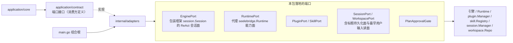

# Adapters

## 生态位

`application/adapters` 将引擎、运行时、插件、Skill、会话、工作区等外部系统的
能力适配为 `application` 依赖的窄端口。所有端口类型在此包导出（`EnginePort`、
`RuntimePort`、`PluginPort`、`SkillPort`、`SessionPort`、`WorkspacePort`、
`PlanApprovalGate`），composition root（`main.go`）负责装配，本包不持有生命周期。

## 架构图



本包只做形状转换与窄接口收敛，不持有生命周期，也不反向依赖 `application` 门面。

## 归属

- 引擎适配：`EnginePort` 包装框架 `session.Session` 的 ReAct 会话面。
- 运行时适配：`RuntimePort` 代理 `seelebridge.Runtime` 的能力面。
- 会话/工作区/插件/Skill：对应 manager/repo/registry 的窄端口。
- 会话标题的持久化面（`session_runtime.SessionTitlePort`）与"最早用户输入"的
  有界读面（`session_runtime.FirstUserInputPort`）也由 `SessionPort` 落地
  （`SaveSessionTitle`/`SessionTitle` 走会话头；`FirstUserInputs` 只打开首个
  消息分片）。这些是可选能力断言：装配缺方法时应用层会静默降级（标题不落盘、
  老会话标题回填失效），因此包内有编译期契约断言与真存储回归测试。

## 验证

```text
go test ./application/adapters -count=1
```
