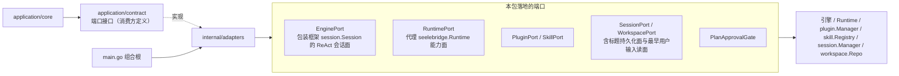

# Adapters

## 生态位

`application/adapters` 将引擎、运行时、插件、Skill、会话、工作区等外部系统的
能力适配为 `application` 依赖的窄端口。所有端口类型在此包导出（`EnginePort`、
`RuntimePort`、`PluginPort`、`SkillPort`、`SessionPort`、`WorkspacePort`、
`PlanApprovalGate`），composition root（`main.go`）负责装配，本包不持有生命周期。

## 架构图



本包只做形状转换与窄接口收敛，不持有生命周期，也不反向依赖 `application` 门面。

## 归属

- 引擎适配：`EnginePort` 包装框架 `session.Session` 的 ReAct 会话面。
- 运行时适配：`RuntimePort` 代理 `seelebridge.Runtime` 的能力面。
- 会话/工作区/插件/Skill：对应 manager/repo/registry 的窄端口。
- 会话标题的持久化面（`session_runtime.SessionTitlePort`）与"最早用户输入"的
  有界读面（`session_runtime.FirstUserInputPort`）也由 `SessionPort` 落地
  （`SaveSessionTitle`/`SessionTitle` 走会话头；`FirstUserInputs` 只打开首个
  消息分片）。这些是可选能力断言：装配缺方法时应用层会静默降级（标题不落盘、
  老会话标题回填失效），因此包内有编译期契约断言与真存储回归测试。

## 并发与锁纪律（EnginePort）

本包最容易出事的地方是**两把不同半径的锁**，谈问题时必须分清：

| 锁 | 半径 | 持锁范围 |
| --- | --- | --- |
| `frameworkSession.Session` 的回合闸门 + 工作状态短锁 | 单会话 | 闸门只串行化"谁在跑回合"（不持锁跑整轮）；工作历史由短临界区保护（Seele 的 `workingState`），回合内的写入排队到循环的下一个检查点 |
| `EnginePort.mu`（下称 `port.mu`） | 全进程（端口级） | 只应覆盖注册表/别名的查表与改写 |

三条不变量：

1. **回合内直接用公开方法，不需要"环内把手"**。Seele 把"整轮持锁"换成闸门 + 短临界区
   之后，工具 handler / 循环回调里调 `History()` / `ReplaceHistory()` 不再自锁：读只取
   一次微秒级临界区，写在忙时排队到下一个检查点（空闲时立即应用）。因此桩内的环内
   通道与 `contract.InLoopEngine` 已删除，端口侧没有"环内专用实现"这一层。
2. **`port.mu` 内不做跨越等待的操作**。`port.mu` 内只允许：查表、改
   `engines`/`engineCalls`/`pendingHistory`/别名，以及调用**不会等回合**的引擎方法
   （`Session` 的历史读写属于这一类：短临界区 + 检查点队列）。对已注册引擎的其它历史
   操作要么先释放 `port.mu`（`AppendHistoryFor`/`ClearHistoryFor`/`SetSystemPromptFor`/
   `RawHistoryFor`/`ClearHistory`），要么在该会话 `engineCalls == 0` 时进行。
3. **目标会话有回合在飞 ⇒ 把替换交给引擎排队**（`queueSessionHistory` →
   `Session.ReplaceHistory`：下一个检查点落地，本回合的下一次请求即读到），不再"登记到
   收尾再换一台干净引擎"。`pendingHistory` 只对**没有**该能力的引擎（旧替身/legacy）
   兜底：登记按会话键控，安装点在 `ChatStream`/`ChatStreamFor` 出口（该会话计数归零、
   且 `port.mu` 还握着 ⇒ 对新回合原子）；登记时不 arm durable 的「下一次装载」槽，安装
   时才 arm；后台会话的安装只换注册表里的引擎，不改活跃别名（`activateLocked` 只查表，
   不建引擎）。

`installHistoryInPlace` 是唯一的"就地重建 provider 历史"实现：引擎支持替换时直接交给
`Session.ReplaceHistory`（一次短临界区装完整份），否则退回 `ClearHistory` + 逐条
`AppendHistory` 的兼容形状；上游 `ClearHistory` 刻意保留 system 消息，所以兼容形状只补
缺、不重加——否则每次压缩/恢复都会复制一份 prompt。

## Review 指南

- 新增端口方法时先问：这一步会不会在 `port.mu` 里等某个回合？（等就有 S3b 那类引信。）
  会就改成锁外，或改走"交给引擎排队"。
- `engineCalls` 只看目标会话自己的计数，不要拿活跃会话的计数代替（后台会话折叠的
  判据就是它）。
- 别名 `port.engine` 与 `port.sessionID` 必须成对改；先 install 再 activate，反过来
  会让工厂白造一台引擎（`TestEnginePortLazyResumeCreatesOnlyRequestedSession` 钉住）。
- 忙会话的折叠必须保留「在飞 tool_call 单元」（`withInFlightTail`），否则引擎以
  `ErrInFlightToolCallDropped` 拒收整次替换。

## 验证

```text
go test ./internal/adapters -count=1
```

关键测试：`engine_port_reentrance_test.go`（回合内读历史**必须立刻返回**——旧自锁断言
的反转报警器）、`engine_port_history_test.go`（回合内替换在检查点当场生效 + 在飞下界 +
锁外立即落地）、`engine_port_lockfuse_test.go`（写面/读面都不再把 `port.mu` 跨在等回合
上；每条都同时断言"折叠当场返回"与"别的会话照样开回合"）。
`e2e/scenario` 与 `application/core` 的压缩用例覆盖应用侧口径。
