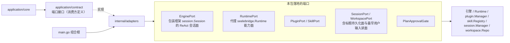

# Adapters

## 生态位

`application/adapters` 将引擎、运行时、插件、Skill、会话、工作区等外部系统的
能力适配为 `application` 依赖的窄端口。所有端口类型在此包导出（`EnginePort`、
`RuntimePort`、`PluginPort`、`SkillPort`、`SessionPort`、`WorkspacePort`、
`PlanApprovalGate`），composition root（`main.go`）负责装配，本包不持有生命周期。

## 架构图



本包只做形状转换与窄接口收敛，不持有生命周期，也不反向依赖 `application` 门面。

## 归属

- 引擎适配：`EnginePort` 包装框架 `session.Session` 的 ReAct 会话面。
- 运行时适配：`RuntimePort` 代理 `seelebridge.Runtime` 的能力面。
- 会话/工作区/插件/Skill：对应 manager/repo/registry 的窄端口。
- 会话标题的持久化面（`session_runtime.SessionTitlePort`）与"最早用户输入"的
  有界读面（`session_runtime.FirstUserInputPort`）也由 `SessionPort` 落地
  （`SaveSessionTitle`/`SessionTitle` 走会话头；`FirstUserInputs` 只打开首个
  消息分片）。这些是可选能力断言：装配缺方法时应用层会静默降级（标题不落盘、
  老会话标题回填失效），因此包内有编译期契约断言与真存储回归测试。

## 并发与锁纪律（EnginePort）

本包最容易出事的地方是**两把不同半径的锁**，谈问题时必须分清：

| 锁 | 半径 | 持锁范围 |
| --- | --- | --- |
| `frameworkSession.Session.mu` | 单会话 | `Chat`/`ChatStream` 从进函数持到出函数（整段 ReAct 循环，含工具内联派发）；`History`/`AppendHistory`/`ClearHistory`/`SetSystemPrompt` 用同一把非重入锁 |
| `EnginePort.mu`（下称 `port.mu`） | 全进程（端口级） | 只应覆盖注册表/别名的查表与改写 |

三条不变量：

1. **回合内不二次取锁**。`ChatStream` 注入本轮 ctx 的环内把手（Seele `session.InLoop`）
   是唯一能在工具 handler / 循环回调里读写历史的门；端口侧实现见
   `engine_port_inloop.go`，语义与判据见 `application/core/README-context.md`
   的「回合内即时压缩」。环外一律回落到会取锁的方法。
2. **`port.mu` 的任一次持有都不得跨越一次可能阻塞的 `Session.mu` 等待**。因此
   `port.mu` 内只允许：查表、改 `engines`/`engineCalls`/`pendingHistory`/别名，以及
   操作**尚未发布**的新引擎（除它自己没人拿得到，不可能堵）。对已注册引擎的历史读写
   要么先释放 `port.mu`（`AppendHistoryFor`/`ClearHistoryFor`/`SetSystemPromptFor`/
   `RawHistoryFor`/`ClearHistory`），要么在该会话 `engineCalls == 0` 时进行。
3. **目标会话有回合在飞 ⇒ 只登记不安装**。`pendingHistory` 按会话键控，安装点在
   `ChatStream`/`ChatStreamFor` 出口（该会话计数归零、且 `port.mu` 还握着 ⇒ 对新回合
   原子）。登记时**不** arm durable 的「下一次装载」槽，安装时才 arm；后台会话的安装
   只换注册表里的引擎，不改活跃别名（`activateLocked` 只查表，不建引擎）。

`installHistoryInPlace` 是唯一的"就地重建 provider 历史"实现：上游 `ClearHistory`
刻意保留 system 消息，所以它只补缺、不重加——否则每次压缩/恢复都会复制一份 prompt。

## Review 指南

- 新增端口方法时先问：这一步会不会在 `port.mu` 里调已注册引擎的历史方法？会就改成
  锁外或走登记。
- `engineCalls` 只看目标会话自己的计数，不要拿活跃会话的计数代替（后台会话折叠的
  判据就是它）。
- 别名 `port.engine` 与 `port.sessionID` 必须成对改；先 install 再 activate，反过来
  会让工厂白造一台引擎（`TestEnginePortLazyResumeCreatesOnlyRequestedSession` 钉住）。
- 环内/环外的判定只能由引擎作证（ctx 里的把手），不得用调用计数、时间戳之类推断。

## 验证

```text
go test ./internal/adapters -count=1
```

关键测试：`engine_port_reentrance_test.go`（回合内取锁必自锁的反向事实）、
`engine_port_inloop_test.go`（环内把手当场生效 + 在飞下界 + 环外回落）、
`engine_port_lockfuse_test.go`（三条 `port.mu → Session.mu` 引信：非活跃写面、
活跃写面、读面；每条都同时断言"折叠当场返回"与"别的会话照样开回合"）。
`e2e/scenario` 与 `application/core` 的压缩用例覆盖应用侧口径。
