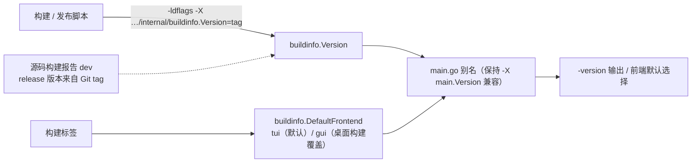

# Buildinfo

## 生态位

`internal/buildinfo` 承载构建期注入的版本信息：

- `Version`：发布版本（`-ldflags "-X .../internal/buildinfo.Version=<tag>"`）。
- `DefaultFrontend`：默认前端（`tui`；桌面构建覆盖为 `gui`）。

`main.go` 中的 `Version` / `DefaultFrontend` 是该包的别名（保持
`-X main.Version` 注入兼容），发布脚本注入点在 `internal/buildinfo`。

## 数据流图

