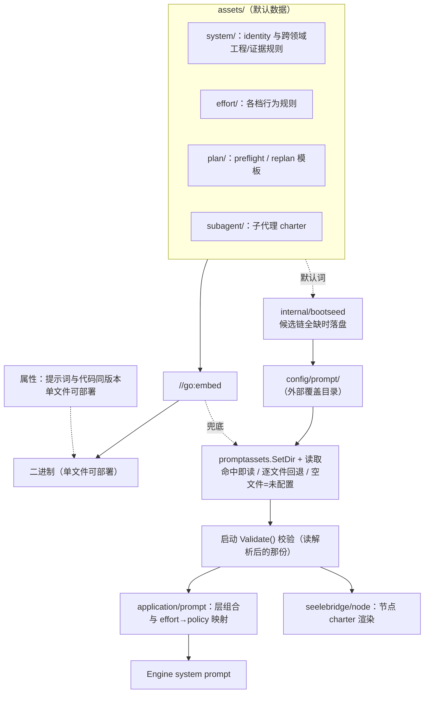

# Prompt Assets

## 生态位

`internal/promptassets/assets/` is the source of truth for Seelex-owned
system, effort, optional Plan prompts, and the subagent charter. Assets are
**embedded at build time** (`//go:embed`) so a release binary has no mutable
prompt-file dependency: 单二进制可部署、提示词与代码同版本。

**外部覆盖层（已实现）**：启动期按责任链确定提示词资产目录——默认
`config/prompt/`（`config/prompt/system/instructions.md` → `<exe>/config/prompt/...`），
候选链全缺时用内嵌默认词初始化（`internal/bootseed`），随后 `promptassets.SetDir`
把它设为覆盖目录。解析口径三条：**命中即读**（目录里同名文件优先于内嵌）、
**逐文件回退**（只覆盖一份也能用）、**空文件 = 未配置**（回退内嵌，不把该段抹空）。
`Validate()` 读的是解析后的那份，用户改坏的提示词在装配期就报错。

目录布局与内嵌资源一一对应（`config/prompt/<相对路径>`）：

```text
config/prompt/
├── system/identity.md
├── system/instructions.md
├── effort/{lite,medium,high,max}.md
├── plan/{preflight,replan}.md
└── subagent/charter.md
```

`plan/*.md` 与 `subagent/charter.md` 是**模板**（含 `{{...}}` 运行期事实），
外部化后仍需保留模板变量，否则 `Validate()` 会当场失败。

## 架构图



## Structure

| Path | Purpose |
|---|---|
| `assets/system/` | Identity and cross-cutting engineering/evidence rules. |
| `assets/effort/` | One user-selected effort policy per level. |
| `assets/plan/` | Optional Plan selection and explicit recovery-plan templates. |
| `assets/subagent/` | Subagent charter (Claude Code 风格结构化提示词：Role/Context/Task/Investigation/Constraints/Verification；含工作强度预判 → 可再开子代理)。 |

## Authoring rules

Read [`AGENTS.md`](AGENTS.md) before changing an asset. It is the mandatory
authoring contract for agents: principle, positive scope, negative scope,
paired do/don't examples, fallback, self-check, privacy boundaries, and test
updates. Template variables are limited to `PlanData` policy fields; do not add
user content, credentials, or hidden runtime state to assets.

Plan selection and replan assets lead with complete, copyable canonical JSON
shapes. A model chooses one shape and changes only node `input` text; structural
rules and the final schema checklist follow the positive examples.

System instructions distinguish **tasklist** from **plan**: tasklist mode runs
the loaded DAG serially with the primary Agent's own project-scoped tools and
defers one `task_complete` (checkmarks apply when it is accepted); plan mode
calls `plan_run`, where `kind:"agent"` nodes spawn subagents that inherit
project scope and parent evidence and may run in parallel, with node
completion projected in real time. The mode choice is a task-level decision;
assets must not present either mode as mandatory.

## Terminal protocol

System instructions require a tool-using request to converge through
`task_complete` or `task_failed`. The former records delivery and evidence;
the latter records bounded failure facts. Prompt prose does not replace the
Application-side payload validation or token/checkpoint context controller.

## Task context policy

System instructions distinguish trusted installed Skill policy from user/Plan data. Active task Skills and Plan execution policy are injected as system layers and reconstructed from the persisted projection; canonical Plan data and checkpoints remain lower-priority structured context. Instructions also require Agents to treat `result_ref` warnings as omitted evidence, use `read_tool_result` or `read_plan` for targeted read-only retrieval, and never infer facts from truncated or omitted content.

## Tool entry boundaries

System instructions state the time boundary between the serial and the background
command entries: a command expected to run longer than five minutes is dispatched
with `bash_bg` (its `description` becomes the work-table row title), the serial
entries refuse a `timeout` above that budget and name `bash_bg` instead, and a
runtime without the background surface falls back to an explicit serial `timeout`.
The number in the asset is the one the code enforces
(`seelebridge/tools.serialBashBudget`): a test there renders this asset and fails
when prose and code drift apart.

## Visual answers

System instructions describe the one rendered-HTML surface the GUI provides:
a `seelex-html` fenced block (optional `title=`/`height=`) that the conversation
draws inside a sandboxed frame with no network and no application access. The
asset states the positive cases (chart/diagram/comparison), the negative cases
(markdown table already answers it; remote assets or fetched data), and that a
bare ```html fence stays a source block. Runtime facts — sandbox attributes,
CSP, height clamp — live in `gui/frontend/dist/html-embed.js`; the asset must
not claim more than that implementation enforces.

## Verification

`PlanActHarnessCases` 是确定性的提示词回归 harness。它覆盖“验证完成后交付”“导出 Markdown 后再答复”和“拒绝未计划的第二轮验证”等正反场景；它检查渲染后的 system + effort 指令仍包含这些收束契约，不以真实模型输出冒充确定性测试。

```text
go test ./internal/promptassets ./application/prompt ./application/core ./seelebridge -count=1
go build ./...
```
