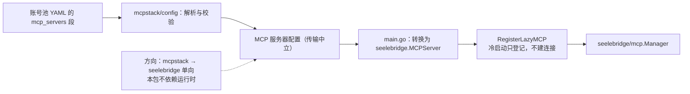

# MCP Config

## 生态位

`mcpstack/config` 从账号池 YAML 的 `mcp_servers` 段加载 MCP 服务器配置。
它只负责解析与校验，不依赖运行时；注册由 composition root（`main.go`）
转换为 `seelebridge.MCPServer` 并调用 `RegisterLazyMCP`，从而保持
`mcpstack → seelebridge` 单向依赖。

## 数据流图



## 验证

```text
go test ./mcpstack/config -count=1
```
