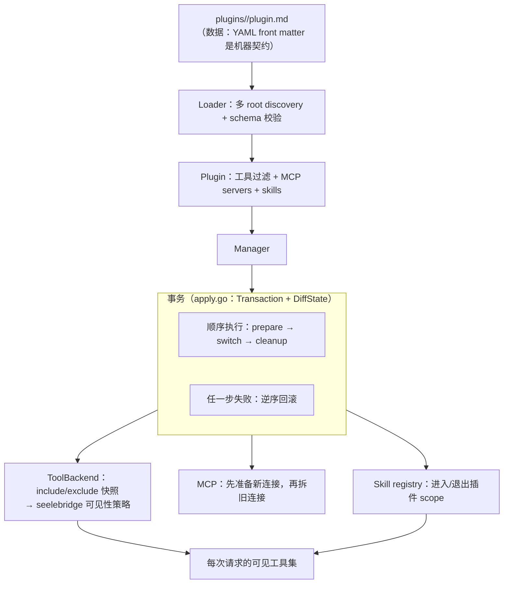
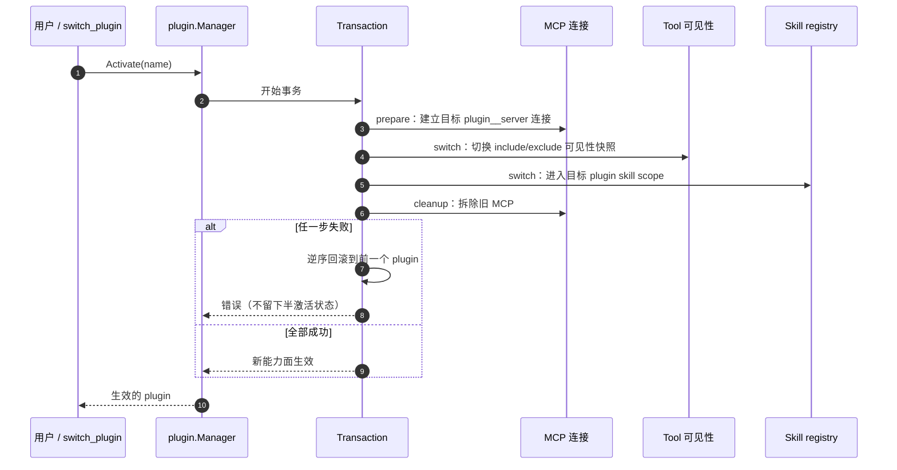

# Plugin Runtime

## 生态位

`plugin` 把 `plugins/<name>/plugin.md` 声明转换为可运行的专业能力形态，并协调工具可见性（include/exclude 快照经 `ToolBackend` 交给 seelebridge 的可见性策略）、MCP servers 与 Seelex Skill registry。

主要调用方：组合根 `main.go`（装配与 `switch_plugin` 工具）与 `gui`/`tui`（插件切换入口）。

## 架构图



## 时序图：激活一个 Plugin



## 文件结构

- `plugin.go`：`Plugin`、`MCPServer` 和 schema version 模型。
- `loader.go`：多 root discovery、front matter 解析、名称/schema 校验和 Skill 加载。
- `apply.go`：通用事务助手 `Transaction`（顺序执行 + 失败逆序回滚）与
  快照差异 `DiffState`（新增/删除/修改）。
- `manager.go`：Load、Activate、Deactivate、Reload；跨 Tool/MCP/Skill 的
  事务式回滚统一走 `Transaction`，Reload 热更新 diff 走 `DiffState`。

## 生命周期

1. `Loader.LoadAll` 按 root 优先级发现目录并解析 `plugin.md`。
2. `Manager.Load` 注册所有 tool filters，发布 plugin skills；任一失败按逆序回滚。
3. `Activate` 先用 `plugin__server` 名准备目标 MCP，再切 Tool 和 Skill，最后拆旧 MCP。
4. 任一步失败都恢复前一个 plugin，避免半激活状态。
5. `Deactivate` 拆 MCP、恢复默认 Tool 可见性并退出 plugin skill scope。

## 边界

本包不执行工具、不实现 MCP transport，也不解析 Skill 指令语义；这些由 backend ports 完成。`plugins/` 是数据，`plugin/` 是运行时。

## Review 指南

- 激活顺序是否保持“先准备新状态，再移除旧状态”。
- rollback 是否同时覆盖 Tool、Skill、MCP 和 `current`。
- runtime MCP name 是否 plugin-qualified，避免不同插件 server 冲突。
- loader 是否拒绝路径逃逸、重复名称和不支持 schema。
- 不要在 manager 持锁时执行可能永久阻塞的 backend；若调整并发模型需补 race/rollback tests。

## 测试

```text
go test ./plugin -count=1
```
