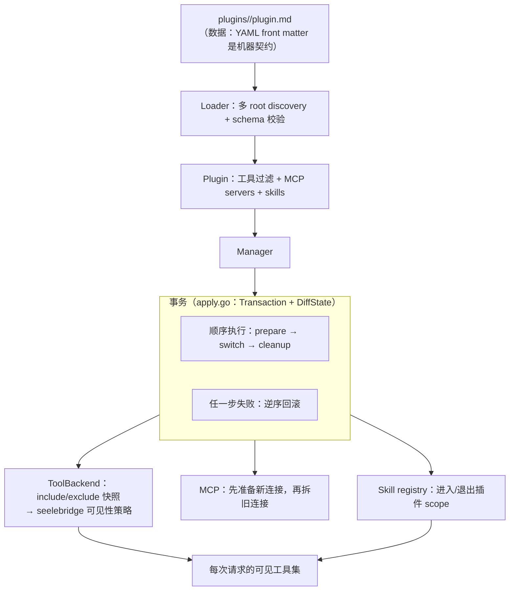
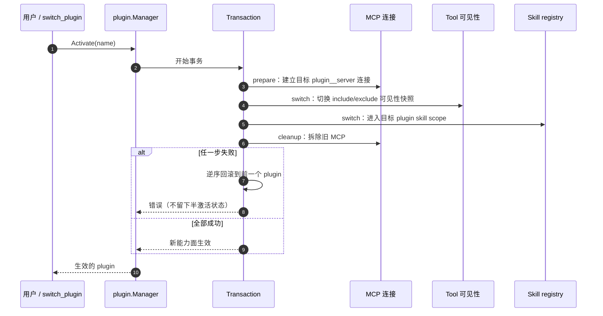

# Plugin Runtime

## 生态位

`plugin` 把 `plugins/<name>/plugin.md` 声明转换为可运行的专业能力形态，并协调工具可见性（include/exclude 快照经 `ToolBackend` 交给 seelebridge 的可见性策略）、MCP servers 与 Seelex Skill registry。

主要调用方：组合根 `main.go`（装配与 `switch_plugin` 工具）与 `gui`/`tui`（插件切换入口）。

## 架构图



## 时序图：激活一个 Plugin



## 文件结构

- `plugin.go`：`Plugin`、`MCPServer` 和 schema version 模型。
- `loader.go`：多 root discovery、front matter 解析、名称/schema 校验和 Skill 加载；
  `PrimaryRoot()` 给出**写侧**该落盘的根（链上第一个真实存在的根，与读侧同源）。
- `curated.go`：精选目录 `plugins/curated.yaml` 的读侧与守卫（严格解码 + 交叉校验：
  只列已落盘插件、禁止重复 include/exclude、权限档只属于 preset、`source` 五字段必填、
  没装的只能进 `presets[].pending`——而每条 pending 必须带 `upstream`/`source`/`verified`/
  `promote` 四项，`verified` 目前只允许 `listing-only`）。装配面两道闸也在本文件：
  `AssemblePreset` / `AssemblePlugin` 对 pending 显式拒绝并**点名它是 pending 与它的来源**；
  读面 `CuratedCatalog.SourceSummary(name)` 给出"哪个插件是谁给的"一行摘要。
  转正四问 = `CuratedPromoteQuestions`。旁车文件不进 `Loader`：它只认目录。
- `curated_write.go`：精选目录的**写侧**——发现 → 读回 → 落进 yaml。`RegisterDiscoveredPlugins`
  把"已落盘但目录里没登记"的本机自建插件补进 `entries`（`source.kind = local`）并挂进 `local`
  preset；只追加（文本插入，注释与已有条目逐字节保留）、只登记本根下的插件、幂等、写回前自检
  （坏目录拒绝改写、没有目录不硬造）。`Manager.RegisterDiscoveredPlugins` 是走读侧同一条
  first-wins 责任链的入口。
- `scaffold.go`：`plugin_create` / `skill_create` 的脚手架写盘（落在 `PrimaryRoot()`）。
- `apply.go`：通用事务助手 `Transaction`（顺序执行 + 失败逆序回滚）与
  快照差异 `DiffState`（新增/删除/修改）。
- `manager.go`：Load、Activate、Deactivate、Reload；跨 Tool/MCP/Skill 的
  事务式回滚统一走 `Transaction`，Reload 热更新 diff 走 `DiffState`。

## 生命周期

1. `Loader.LoadAll` 按 root 优先级发现目录并解析 `plugin.md`。
2. `Manager.Load` 注册所有 tool filters，发布 plugin skills；任一失败按逆序回滚。
3. `Activate` 先用 `plugin__server` 名准备目标 MCP，再切 Tool 和 Skill，最后拆旧 MCP。
4. 任一步失败都恢复前一个 plugin，避免半激活状态。
5. `Deactivate` 拆 MCP、恢复默认 Tool 可见性并退出 plugin skill scope。

## 边界

本包不执行工具、不实现 MCP transport，也不解析 Skill 指令语义；这些由 backend ports 完成。`plugins/` 是数据，`plugin/` 是运行时。插件根的**责任链**（`-plugins` > `$SEELEX_PLUGINS` > `<exe>/plugins` > `<exe>/../plugins` > CWD `plugins`）在组合根 `main.go`（`pluginRootChain`），本包只负责"多根 first-wins"地加载；"零插件"由 `main.go` 的 `requirePlugins` 显式拒绝启动。

## Review 指南

- 激活顺序是否保持“先准备新状态，再移除旧状态”。
- rollback 是否同时覆盖 Tool、Skill、MCP 和 `current`。
- runtime MCP name 是否 plugin-qualified，避免不同插件 server 冲突。
- loader 是否拒绝路径逃逸、重复名称和不支持 schema。
- 写侧（`plugin_create`/`skill_create`）是否落在 `PrimaryRoot()`（链上第一个存在的根），
  而不是链首那个可能只存在于交付树里的路径（否则"创建成功但 reload 看不到"）。
- `curated.yaml` 是否满足 `curated.go` 的铁律；`pending` 的每条是否带齐 `upstream`/`source`/`verified`/`promote`
  （没实读正文就只准 `verified: listing-only`）；装配到 pending 是否**显式拒绝并指向来源**；
  改完跑 `go test ./plugin/... ./e2e/ -count=1`。
- 不要在 manager 持锁时执行可能永久阻塞的 backend；若调整并发模型需补 race/rollback tests。

## 测试

```text
go test ./plugin/... ./e2e/ -count=1
go test . -run 'Curated|Plugin|Layout' -count=1   # 仓库里那份 curated.yaml 的落地守卫
```
