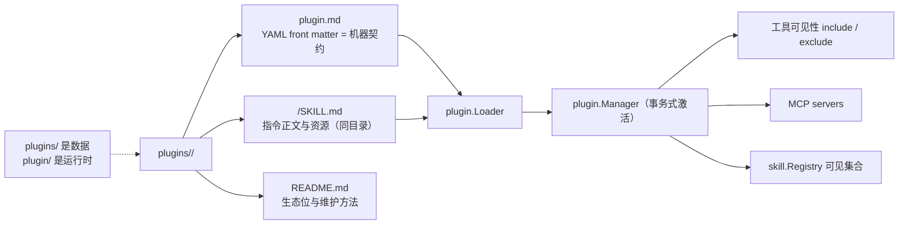

# Built-in Plugins

## 生态位

`plugins/` 是 Seelex 随发行包交付的声明式专业能力集合。每个一级目录都是独立 Plugin 模块：`plugin.md` 定义机器契约，README 解释生态位，子目录 `SKILL.md` 提供可加载技能和资源。

| Plugin | 生态位 | README |
|---|---|---|
| `default` | 全工具与全局能力入口 | [`default`](default/README.md) |
| `freecad` | CAD 垂直能力验证 | [`freecad`](freecad/README.md) |
| `impeccable` | 前端设计纪律与确定性检测器（Impeccable 移植） | [`impeccable`](impeccable/README.md) |

## 架构图



## Plugin 契约

`plugin.md` YAML front matter 至少包含 `schema_version`、`name`、`description`、`include`、`exclude`。可选 `mcp_servers` 定义 transport/command/args/env/url。正文是 plugin system prompt。

## 维护规则

- 目录名、manifest `name` 与 README 标题语义一致。
- include/exclude 使用稳定工具名或明确 glob；始终保留切换工具，否则 Agent 可能无法退出形态。
- Skill 资源不得逃逸 Skill root。
- MCP 命令不得写死个人绝对路径；本机配置应外置。
- 新 Plugin 必须更新本索引、`layout_test.go` 和发行白名单验证。

## 测试

```text
go test ./plugin ./skill . -run 'Plugin|Skill|Layout' -count=1
```
