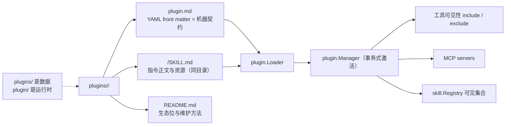

# Built-in Plugins

## 生态位

`plugins/` 是 Seelex 随发行包交付的声明式专业能力集合。每个一级目录都是独立 Plugin 模块：`plugin.md` 定义机器契约，README 解释生态位，子目录 `SKILL.md` 提供可加载技能和资源。

| Plugin | 生态位 | 来源（谁给的） | README |
|---|---|---|---|
| `default` | 全工具与全局能力入口 | `builtin` · <https://github.com/RedHuang-0622/seelex>（随发行包） | [`default`](default/README.md) |
| `hardware` | 硬件/CAD 工程能力（FreeCAD 批处理脚本 + stdio MCP） | `builtin` · <https://github.com/RedHuang-0622/seelex>（随发行包；外部依赖 FreeCAD） | [`hardware`](hardware/README.md) |
| `impeccable` | 前端设计纪律与确定性检测器（Impeccable 移植） | `vendored` · <https://github.com/pbakaus/impeccable>（Apache-2.0，未固定 commit） | [`impeccable`](impeccable/README.md) |

**「来源」这一列的归属说明**：`plugins_list` 的回执在组合根 `main.go`（不在 `plugins/**`+`plugin/**` 这块领地），所以这一列是「这个插件是谁给的」在当前领地内的最小可见化；机读面是同源的一份读数——`plugin.CuratedCatalog.SourceSummary(name)` 给出同样的一行摘要（`entries` 读落盘来源，`pending` 读「未落盘 + 出处 + 证据档」）。两处都由 `e2e/layout_test.go` 的 `TestPluginsReadmeIndexCarriesSource` 钉在 `curated.yaml` 上（entry 的 `source.url` 不在表里就红）。

本目录除插件目录外还有一个**旁车数据文件** [`curated.yaml`](curated.yaml)：精选目录（这份发行包到底带什么、是谁给的、按哪个权限档装配）。它**不是插件**——`plugin.Loader` 只认目录（`plugin/loader.go` 的 `entry.IsDir()`），加进来不会多出任何插件（门禁：`plugin/curated_test.go` 的 `TestCuratedCatalogSideCarIsNotAPlugin`）。

## 插件根从哪来（责任链）

`plugins/` 不是写死的 CWD 路径，而是一条责任链（`main.go` 的 `pluginRootChain`）：

```text
-plugins <paths>      >  $SEELEX_PLUGINS  >  <exe>/plugins  >  <exe>/../plugins  >  plugins(CWD)
   显式旗标                环境变量           交付树自带         交付树上一级       仓库/开发场景
```

加载器是**多根 first-wins**（`plugin.Loader.LoadAll`：先出现的同名插件胜出、不存在的根静默跳过），所以这条链决定"去哪里找"，不决定"找到的是哪一份插件"以外的任何事。启动期会打一行根报告（`main.go` 的 `logPluginRoots`）：

```text
plugin: 根 plugins=3, dist/dev/plugins=0（共加载 3 个插件）
```

**零插件是显式失败**（`main.go` 的 `requirePlugins`）：一个插件都没加载到就拒绝启动，错误里列出试过的每个根与两条救法（`-plugins` / `$SEELEX_PLUGINS`）。旧口径静默跳过不存在的根 → 空表不报错 → 找不到 `default` 就 `return nil`，结果是"零插件零技能启动且日志里没有一个字"；同理，插件加载到了但没有 `default` 时现在也会打一行提示（不再无声）。

写侧（`plugin_create` / `skill_create`）落在链上**第一个真实存在**的根（`Loader.PrimaryRoot`），与读侧同源，避免"创建成功但 `plugins_reload` 看不到"。

**写侧还要把新插件登记进精选目录**（`plugin.RegisterDiscoveredPlugins`，`plugin/curated_write.go`）：启动期与每次 `plugins_reload` 之后，磁盘上有、目录里没有的本机自建插件会被补一条 `entries`（`source.kind: local`，url 指向它所在的本机根）并挂进 `local` preset——**发现 → 读回 → 落进 yaml**。理由：agent 自己长出来的插件（`plugin_create` 可以带 skill）如果只能被读成"漂移"，使用者就得手工把机器该做的簿记抄进 YAML。登记只**追加**、逐字节保留已有条目与注释，且只登记**落在本根下面**的插件（多根 first-wins 下，别的根供上来的插件不属于这份目录）；写回前自检，坏目录拒绝改写。

## 精选目录（`curated.yaml`）

它是内置 marketplace 清单的**本地简化版**：外部清单形如 `{name, description, owner, plugins:[{name, source}]}`、用 `name@marketplace` 标识安装、有 `claude plugin validate <dir>` 校验；我们只保留「带什么、谁给的、哪个权限档」三件事，不做下载与版本解析。三条铁律由 `plugin/curated.go` 机检（读侧 + 严格解码），不靠人眼评审：

1. **只列已落盘插件**：`entries` 与插件根下真实可加载的插件一一对应，多一条少一条都红；没装的只能出现在 `presets[].pending`，语义是**装配到它必须显式拒绝**——两道装配闸在 `plugin/curated.go` 的 `AssemblePreset` / `AssemblePlugin`，拒绝文案会**点名它是 pending 并指向它的来源**（不是甩一句"插件目录不存在"），运行时入口是 `plugin.Manager.ActivateFromCatalog`（拒绝发生在任何副作用之前）。
2. **禁止在这里重复 `include`/`exclude`**（事实源是 `plugin.md`），**权限档只出现在 preset**：`entries` 下冒出 `include:`/`permission_tier:` 就是 unknown field 解码错误。
3. 每条 entry 必有 `source`（`kind`/`url`/`license`/`pinned`/`read_at`）：一眼看出哪个插件是谁给的。

### `pending` 记的是**路线图**，不是可用集合

每条候选必须写清四件事，缺一项目录就红：`upstream`（清单里那条候选的字面标识，一般是 `owner/repo`，这是"谁给的"）、`source`（这次**实读**的出处与日期；`kind: community-listing` 表示"社区清单/主题页的一次实读"）、`verified`（**核到什么程度**）、`promote`（转正还缺什么）。

当前唯一实读过的证据档是 **`listing-only`** = 「仓库存在 + 官方一句话定位」，**没有**读进任何 skill 正文——所以 `pending` 里的名字一律**不得被读成"已可用"**，装配到它必然被拒。转正（从 `pending` 挪进 `entries` 并加进 `presets[].plugins`）前必须先实读正文并过**可装载性四问**（机器可引用版本：`plugin.CuratedPromoteQuestions`）：

1. **可装载性**：正文能否被 `skill.LoadPluginDir` 装载（目录/frontmatter/name 合法）；
2. **不带权限面**：不携带权限档、`hooks` 或插件级 MCP 权限（权限只能由 preset 给）；
3. **许可证**：上游 LICENSE 明确且允许再分发；
4. **成本**：装配后每轮进上下文的 name+description 体积可接受。

现在 `presets.design` 的 `pending` 里躺着 7 条前端候选，全部来自 `docs/research/2026-10-05-teammate-plugin-assembly-external-research.md` §4 的 Playwright 实读（`verified: listing-only`）——**它们是"要去核谁"，不是"可以装什么"**。空 `pending: []` 与"没写 `pending`"在 YAML 里是两件事（后者是漏写，会红）：门禁见 `plugin/curated_test.go` 的 `TestCuratedPendingEmptySequenceIsDeclared`，发行树那一半见 `e2e/layout_test.go` 的 `TestShippedCuratedCatalogPendingIsEvidenceTagged`。

装配语义仍是**全局单选**（`docs/2026-08-14-decoupling/05-plugin-dual-track-decision.md:71`）：preset 表达"切到哪个插件 + 用哪个权限档"，不表达同时叠加；`ActivateFromCatalog` 对一个 preset 解析出多个插件时显式拒绝，而不是悄悄只激活第一个。

## 架构图



## Plugin 契约

`plugin.md` YAML front matter 至少包含 `schema_version`、`name`、`description`、`include`、`exclude`。可选 `mcp_servers` 定义 transport/command/args/env/url。正文是 plugin system prompt。

## 维护规则

- 目录名、manifest `name` 与 README 标题语义一致。
- include/exclude 使用稳定工具名或明确 glob；始终保留切换工具，否则 Agent 可能无法退出形态。
- Skill 资源不得逃逸 Skill root。
- MCP 命令不得写死个人绝对路径；本机配置应外置。
- 新 Plugin 必须**同时**更新本索引（含「来源」列）、`curated.yaml`（`entries` + 至少一个 preset）和 `layout_test.go` 白名单验证——三处任一漏改都会被门禁点亮（`curated_catalog_test.go`、`e2e/layout_test.go`）。
- 往 `presets[].pending` 加候选时必须带 `upstream`/`source`/`verified`/`promote` 四项；没实读正文就只准写 `verified: listing-only`，不许写成已可用。
- 改 `curated.yaml` 后跑 `go test ./plugin/... ./e2e/ -run 'Curated|Layout|Plugin' -count=1`：目录引用了不存在的插件、`pending` 里混进已装插件、entry/pending 缺 `source`、`verified` 不是已知证据档、README 索引与 entries 不一致，都会红。

## 测试

```text
go test ./plugin/... ./e2e/ -count=1
go test ./plugin -run 'Plugin|Curated' -count=1   # 精选目录守卫与装配闸
```
