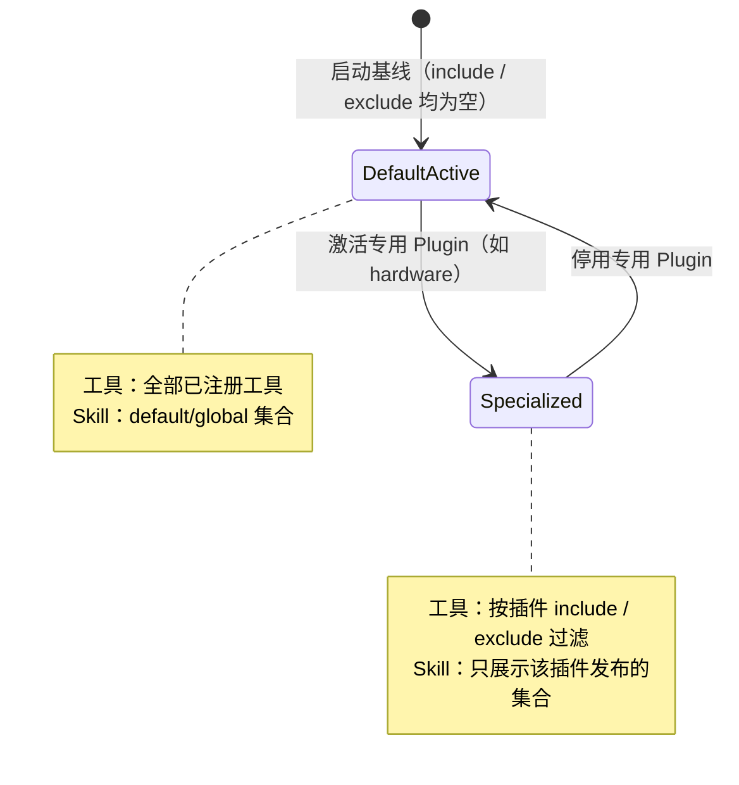

# Default Plugin

## 生态位

`default` 是未选择专业形态时的开放能力入口，允许所有已注册工具并展示全局 Skill。它适合通用对话、跨域任务和插件选择前的探索。

主要消费方：`plugin.Loader`（读取 manifest）、`seelebridge.Runtime`（注册工具过滤）、
`skill.Registry`（计算可见 Skill 集合）。

## 生命周期



工具可见性与执行授权是两层：`default` 不等于 full-access permission。

## 实现

- `plugin.md` 的 include/exclude 均为空，交由 Seele Tool holder 暴露全部工具。
- Plan 是启动即注册的基础工具；`plan/` 是默认 Plugin 提供的 `plan` Skill，用 `$plan` 召回（`$` = Skill 前缀、`#` = 切换 Plugin），不再存在独立 Plan Plugin。
- 每个子目录是一个通用 Skill（`$` 前缀召回）。
- `$goal` 与 `$teamwork` 是团队作业面的一对：`$goal` 维护 agent 自总结的目标看板（正文/完成条件/阶段打点），
  `$teamwork` 是 leader 的工具面规范（V 模型阶段派活 + 契约先行 + 证据收尾）。**不再有席位轮转。**
- 激活专用 Plugin 后，Registry 只展示该 Plugin 发布的 Skill；退出后恢复 default/global 集合。

## Skill 说明

| Skill | 定位 |
|---|---|
| `$goal` | 目标看板维护者：agent 自总结的 goal 看板（正文 + 完成条件 + 每阶段打点，位置由 active seq 钉住），并驱动团队按 V 模型阶段推进 |
| `$teamwork` | leader 工具面：`team_plan` / `team_dispatch` / `team_join` / `team_milestone` / `team_close` + `jobs_manage` 的用法、V 模型阶段模板与铁律 |
| `$plan` | WorkPlan：`plan_load` / `plan_run` 的 DAG 规划与执行 |
| `$plan-design` | 启发式方案设计：标杆调研、方案对比、技术选型 |
| `$plan-efficiency` | 规划式效率方案：打点表、活动图、SubAgent 调度 |
| `$plan-norm` | 约束式规范方案：ASPICE 追溯、变更影响分析、审查检查单 |
| `$code` | 代码实现：接口优先、增量验证 |
| `$code-aesthetics` | 代码审美：命名、简洁、可读、idiomatic |
| `$review` | 代码审查：正确性 / 安全性 / 性能 / 可维护性 / 一致性 |
| `$test` | 测试编写：单元 / 集成 / 边界，table-driven |
| `$cli-design` | CLI / TUI 交互设计：组件选型、配色、键盘映射 |

## 非职责

Default 不等于 full-access permission。工具可见性与执行授权是两个独立层次。

## 依赖与生命周期

manifest 由 `plugin.Loader` 读取，Tool filter 由 `seelebridge.Runtime` 注册，Skill 可见性由 `skill.Registry` 计算。Default 通常是启动基线；专用 Plugin 停用后回到全局 Skill/工具视图。

## Review

- 新全局 Skill 是否真的适用于所有形态；领域专用 Skill 应放到对应 Plugin。
- 不要用 default 绕过 project scope 或 approval。

## 验证

```text
go test ./skill ./plugin . -run 'Plugin|Skill|Layout' -count=1
```
